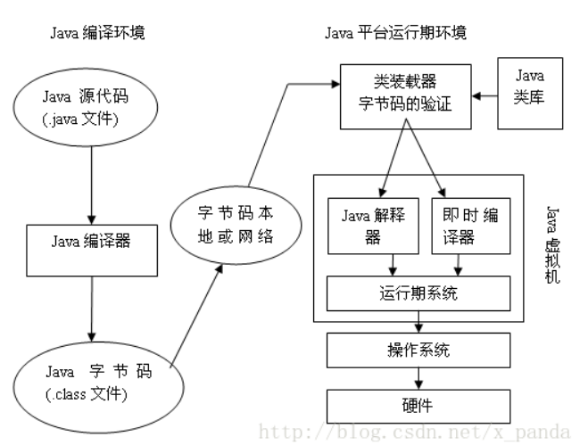
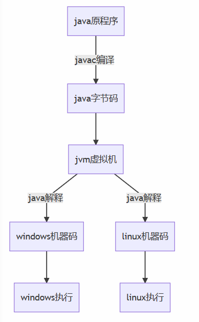
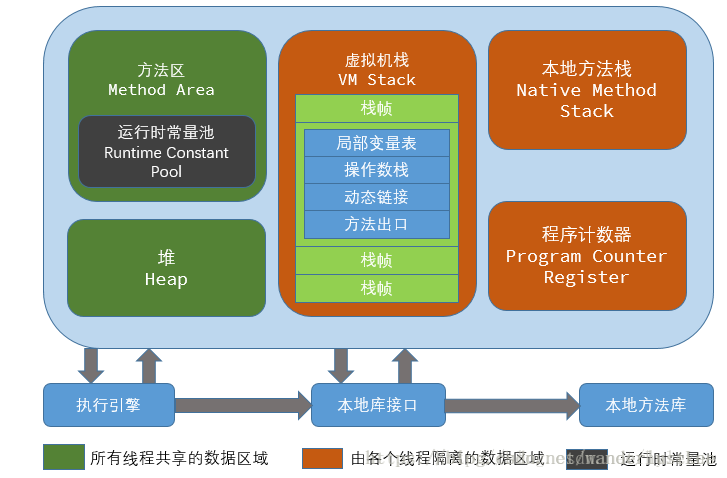
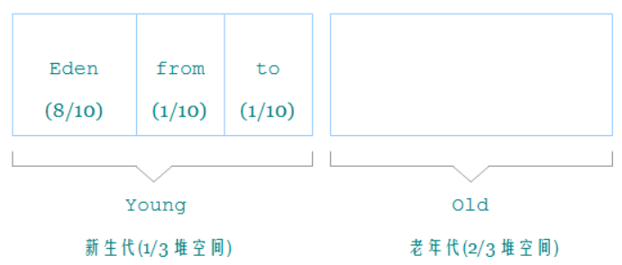

### 1.java虚拟机运行时数据区

##### 1.1 java代码编译执行过程






　1.**源码编译：**通过Java源码编译器将Java代码编译成JVM字节码（.class文件）

　2.**类加载：**通过ClassLoader及其子类来完成JVM的类加载

　3.**类执行：**字节码被装入内存，进入JVM虚拟机，被解释器解释执行

java程序经过一次编译之后，将java代码编译为字节码也就是class文件，通过ClassLoader及其子类来完成JVM的类加载，然后使用java虚拟机进行解释/编译，最后再转换为不同平台的机器码，在操作系统中得到执行。


##### 1.2 JVM处处运行

Java虚拟机(JVM)实现了程序与操作系统的分离，从而实现了Java 的跨平台。

JVM在它的生存周期中有一个明确的任务，那就是运行Java程序，因此当Java程序启动的时候，就产生JVM的一个实例；当程序运行结束的时候，该实例也跟着消失了 。

三种JVM：

① Sun公司的HotSpot 

② BEA公司的JRockit 

③ IBM公司的J9 JVM

在JDK1.7及其以前我们所使用的都是Sun公司的HotSpot，jdk1.8将采用Sun公司的**HotSpot**和BEA公司的**JRockit**两个JVM中精华形成jdk1.8的JVM。


##### 1.3 JVM内存结构

通过Class Loader将class字节码文件载入JAVA虚拟机。

至于它是否可以运行，则由Execution Engine执行引擎决定。

① 定位和导入二进制class文件

② 验证导入类的正确性

③ 为类分配初始化内存

④ 帮助解析符号引用.




- **程序计数器：**当前线程所执行字节码的行号指示器，每条线程都需要一个独立的程序计数器。

- **Java 虚拟机栈**

- **本地方法栈：**java在内存中专门开辟了一块区域处理标记为native的代码，他的具体做法是Native Method Stack中登记native方法，在Execution Engine执行时加载native libraies。

- **Java 堆**

- **方法区：**被所有线程共享，保存所有字段和方法字节码、以及一些特殊方法如构造函数，接口代码也在此定义。简单说，**所有定义的方法的信息都保存在该区域，用来保存装载的类的元结构信息**。

  > 静态变量+常量+类信息+运行时常量池存放在**方法区**
  >
  > 实例变量存在**堆内存**中

- **运行时常量池**

- **直接内存**

**Execution Engine执行引擎：** 负责解释命令，提交操作系统执行

**Native Interface 本地接口：**Java语言本身不能对操作系统底层进行访问和操作，但是可以通过JNI接口调用其他语言来实现对底层的访问。


### 2.程序计数器（线程私有）

##### 2.1 定义

程序计数器

是一块较小的内存空间，可以看作是当前线程所执行字节码的行号指示器。

#####  2.2 作用

1. 为了线程切换后能恢复到正确的执行位置，**每条线程都需要一个独立的程序计数器**。

  * 如果线程正在执行的是一个 Java 方法，计数器记录的是正在执行的虚拟机字节码指令的地址；
  * 如果正在执行的是 Native 方法，这个计数器的值为空。

  

2. 程序计数器是唯一一个没有规定任何 OutOfMemoryError 的区域。 


### 3.Java 虚拟机栈（线程私有）

##### 3.1 作用

Java 虚拟机栈（Java Virtual Machine Stacks）是线程私有的，**生命周期与线程相同**。
**虚拟机栈描述的是 Java 方法执行的内存模型**：每个方法被执行的时候都会创建一个**栈帧**（Stack Frame），存储：

- 本地变量（Local Variables）：输入参数和输出参数以及方法内的变量
- 操作栈：记录出栈、入栈的操作
- 栈帧数据（Frame Data）：包括类文件、方法等。

每一个方法被调用到执行完成的过程，就对应着一个栈帧在虚拟机栈中从入栈到出栈的过程。

**对于栈来说不存在垃圾回收问题，只要线程一结束该栈就Over**


##### 3.2 栈运行原理

栈中的数据都是以栈帧（Stack Frame）的格式存在，栈帧是一个内存去块，是一个数据集

当一个方法A被调用时就产生一个栈帧F1，并被压入到栈中，

A方法调用了B方法，于是产生栈帧F2也被压入到栈，

B方法调用了C方法，于是产生栈帧F3也被压入到栈

执行完毕后，先弹出F3，再弹出F2，再弹出F1


#####  

##### 3.3 异常情况

- StackOverflowError：线程请求的栈深度大于虚拟机所允许的深度
- OutOfMemoryError：虚拟机栈扩展到无法申请足够的内存时


### 4.本地方法栈（线程私有）

##### 4.1 作用 

而本地方法栈（Native Method Stacks）为虚拟机使用到的 Native 方法服务。

Java语言本身不能对操作系统底层进行访问和操作，但是可以通过JNI接口调用其他语言来实现对底层的访问。


##### 3.2 异常情况

- StackOverflowError：线程请求的栈深度大于虚拟机所允许的深度
- OutOfMemoryError：虚拟机栈扩展到无法申请足够的内存时


##### 3.3 **什么是Native 方法:**

简单地讲，一个Native Method就是一个java调用非java代码的接口。一个Native Method是这样一个java的方法：该方法的实现由非java语言实现，比如C。这个特征并非java所特有，很多其它的编程语言都有这一机制，比如在C＋＋中，你可以用extern “C”告知C＋＋编译器去调用一个C的函数。    

```java
public final class System {
    private static native void registerNatives();
    static {
        registerNatives();

    }.............

}
```


### 5.Java 堆（线程共享）

> 注：
>
> - Jdk1.6之前：有永久代，常量值1.6在方法区
> - Jdk1.7：有永久代，但已经逐步“去永久代”，常量池1.7在堆
> - Jdk1.8之后：无永久代，常量池1.8在元空间

##### 5.1 定义

Java堆（Java Heap）是Java虚拟机所管理的内存中**最大的一块**。Java堆是被所有线程共享的一块内存区域，在虚拟机启动时创建。也是垃圾回收回收的重点区域。

 

##### 5.2 作用

此内存区域的唯一目的就是存放对象实例，**几乎所有的对象实例以及数组都在这里分配内存。**

随着JIT编译器的发展与逃逸分析技术逐渐成熟，**栈上分配、标量替换**优化技术将会导致一些微妙的变化发生，所有的对象都分配在堆上也渐渐变得不是那么“绝对”了。


##### 5.3 垃圾回收

Java堆是垃圾收集器管理的主要区域，因此很多时候也被称做“GC堆”。Java堆可以处于物理上不连续的内存空间中，只要逻辑上是连续的即可。

 从内存回收的角度来看，由于现在收集器基本都采用**分代收集算法**，所以Java堆中还可以细分为：**Eden空间、From Survivor空间、To Survivor空间**




##### 5.4 可扩展性

在实现时，既可以实现成固定大小的，也可以是可扩展的，不过当前主流的虚拟机都是按照可扩展来实现的（通过-Xmx和-Xms控制）。如果在堆中没有内存完成实例分配，并且堆也无法再扩展时，将会抛出OutOfMemoryError异常。 


### 6.方法区（线程共享，永久代）

##### 6.1 作用

用于存储已被虚拟机加载的**类信息、普通常量、静态变量、即时编译器编译后的代码**等数据。

 和 Java 堆一样，不需要连续的内存，可以选择固定的大小，更可以选择不实现垃圾收集。


##### 6.2 垃圾回收

相对而言，垃圾收集行为在这个区域是比较少出现的。这区域的内存回收目标主要是针对**常量池的回收和对类型的卸载**，一般来说，这个区域的回收“成绩”比较难以令人满意，尤其是类型的卸载，条件相当苛刻。


##### 6.3 异常情况

当方法区无法满足内存分配需求时，将抛出OutOfMemoryError异常。 


### 7.常量池

##### 7.1 常量池的划分

- Class 文件常量池
- 运行时常量池
- 字符串常量池


##### 7.2 Class 文件常量池

Class 文件常量池指的是编译生成的 class 字节码文件，其结构中有一项是常量池（Constant Pool Table），用于存放编译期生成的各种字面量和符号引用，这部分内容将在类加载后进入方法区的运行时常量池中存放。

什么是字面量和符号引用？

* 字面量是指**字符串字面量**和**声明为 final 的（基本数据类型）常量值**，这些字符串字面量除了类中所有**双引号括起来的字符串(包括方法体内的)**，还包括所有用到的**类名、方法的名字和这些类与方法的字符串描述、字段(成员变量)的名称和描述符**；方法内的常量值由栈分配，所以并不算是字面量。

* 符号引用，就是指指向 UTF-8 表中向这些字面量的引用，**包括类和接口的全限定名(包括包路径的完整名)、字段的名称和描述符、方法的名称和描述符**。只不过是以一组符号来描述所引用的目标，和内存并无关，所以称为符号引用，**直接指向内存中某一地址的引用称为直接引用。**


##### 7.2 运行时常量池（Run-time Constant Pool）

运行时常量池是方法区的一部分，是一块内存区域。Class 文件常量池将在类加载后进入方法区的运行时常量池中存放。

一个类加载到 JVM 中后对应一个运行时常量池，运行时常量池相对于 Class 文件常量池来说具备**动态性**，Class 文件常量只是一个静态存储结构，里面的引用都是符号引用。而运行时常量池可以在运行期间将符号引用解析为直接引用。

运行时常量池就是用来索引和查找字段和方法名称和描述符的。给定任意一个方法或字段的索引，通过这个索引最终可得到该方法或字段所属的类型信息和名称及描述符信息。


**位置变化**：

Java6和6之前，运行时常量池是存放在方法区中的。

Java7，将运行时常量池是存放到了堆中。

Java8之后，取消了整个永久代区域，取而代之的是元空间。没有再对常量池进行调整。


##### 7.3 字符串常量池（Interned Strings）

在 JDK1.6（含）之前也是方法区的一部分，并且其中存放的是字符串的对象。
在 JDK1.7（含）之后，是在堆内存之中，存储的是字符串对象的引用，字符串实例是在堆中。

字符串常量池是全局的，JVM 中独此一份，因此也称为全局字符串常量池。


##### 7.4 常量池的好处

常量池是为了避免频繁的创建和销毁对象而影响系统性能，其实现了对象的共享。例如字符串常量池，在编译阶段就把所有的字符串文字放到一个常量池中。

（1）节省内存空间：常量池中所有相同的字符串常量被合并，只占用一个空间。

（2）节省运行时间：比较字符串时，==比equals()快。对于两个引用变量，只用==判断引用是否相等，也就可以判断实际值是否相等


### 8.直接内存

##### 8.1 定义

直接内存（Direct Memory）并不是虚拟机运行时数据区的一部分，也不是Java虚拟机规范中定义的内存区域，而是堆外内存。

##### 8.2 运用实例

在JDK 1.4中新加入了NIO（New Input/Output）类，引入了一种基于通道（Channel）与缓冲区（Buffer）的I/O方式，它可以使用Native函数库直接分配堆外内存，然后通过一个存储在Java堆中的DirectByteBuffer对象作为这块内存的引用进行操作。

##### 8.3 优点

显著提高性能，因为避免了在Java堆和Native堆中来回复制数据。 


##### 8.4 内存限制

受到本机总内存（包括RAM以及SWAP区或者分页文件）大小以及处理器寻址空间的限制。


参考博客：https://blog.csdn.net/flyingdog123/article/details/80419911

https://blog.csdn.net/Yano_nankai/article/details/50957578

https://blog.csdn.net/a1102325298/article/details/90106244

