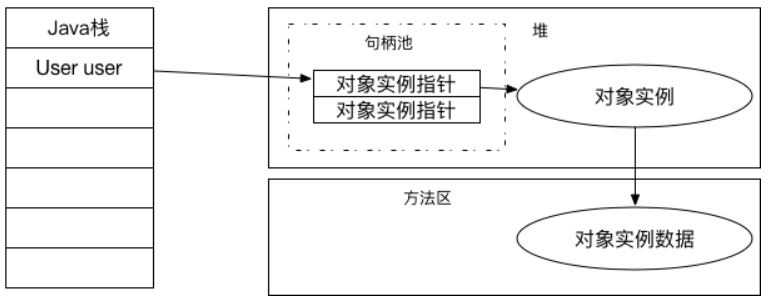
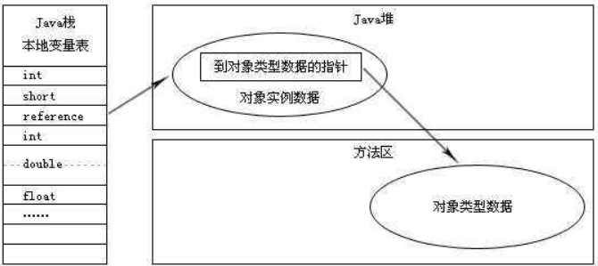

### 1.创建对象过程


##### 1.1 检查指令参数

虚拟机遇到一条new指令时，首先将去**检查这个指令的参数**是否能在常量池中定位到一个类的符号引用，并且检查这个符号引用代表的类是否已被加载、解析和初始化过。如果没有，那必须先执行相应的类加载过程。 


##### 1.2 为对象分配内存

在类加载检查通过后，接下来虚拟机将**为新生对象分配内存**。对象所需内存的大小在类加载完成后便可完全确定，为对象分配空间的任务等同于把一块确定大小的内存从Java堆中划分出来。

1. 分配方式：

- **指针碰撞**：假设Java堆中内存是绝对规整的，所有用过的内存都放在一边，空闲的内存放在另一边，中间放着一个指针作为分界点的指示器，那所分配内存就仅仅是把那个指针向空闲空间那边挪动一段与对象大小相等的距离，这种分配方式称为“指针碰撞”。
- **空闲列表**：如果Java堆中的内存并不是规整的，已使用的内存和空闲的内存相互交错，那就没有办法简单地进行指针碰撞了，虚拟机就必须**维护一个列表，记录上哪些内存块是可用的**，在分配的时候从列表中找到一块足够大的空间划分给对象实例，并更新列表上的记录，这种分配方式称为“空闲列表”。


##### 1.3 选择分配方式

选择哪种分配方式**由Java堆是否规整决定**，而Java堆是否规整又**由所采用的垃圾收集器是否带有压缩整理功能决定。**

- 使用**Serial、ParNew**等带Compact（比较紧凑）过程的收集器时，系统采用的分配算法是**指针碰撞**。

- 而使用**CMS**这种基于Mark-Sweep算法的收集器时，通常采用**空闲列表**。 

   

  

##### 1.4 分配内存时在并发情况下的线程安全问题

对象创建在虚拟机中是非常频繁的行为，即使是仅仅修改一个指针所指向的位置，在并发情况下也并**不是线程安全的**，可能出现正在给对象A分配内存，指针还没来得及修改，对象B又同时使用了原来的指针来分配内存的情况。解决对象创建在虚拟机中在并发情况下的线程安全问题，**两种方案**：

- **对分配内存空间的动作进行同步处理**——实际上虚拟机采用**CAS配上失败重试**的方式保证更新操作的原子性；
- 把内存分配的动作按照线程划分在不同的空间之中进行，即每个线程在Java堆中预先分配一小块内存，**称为本地线程分配缓冲**（Thread Local Allocation Buffer，TLAB）。哪个线程要分配内存，就在哪个线程的TLAB上分配，只有TLAB用完并分配新的TLAB时，才需要同步锁定。虚拟机是否使用TLAB，可以通过-XX:+/-UseTLAB参数来设定。


##### 1.5初始化为零值

 内存分配完成后，虚拟机需要**将分到的内存空间都初始化为零值（不包括对象头）**，如果使用TLAB，这一工作过程也可以提前至TLAB分配时进行。这一步操作保证了对象的实例字段在Java代码中可以不赋初始值就直接使用，程序能访问到这些字段的数据类型所对应的零值。 


##### 1.6 对对象进行设置

对对象进行必要的设置，例如这个对象是哪个类的实例、如何才能找到类的元数据信息、对象的哈希码、对象的GC分代年龄等信息。这些信息存放在对象的对象头（Object Header）之中。根据虚拟机当前的运行状态的不同，如是否启用偏向锁等，对象头会有不同的设置方式。


##### 1.7 执行初始化方法

执行<init>方法，把对象按照程序员的意愿进行初始化。


HotSpot解释器的代码片段  ：

```java
//确保常量池中存放的是已解释的类
if (!constants->tag_at(index).is_unresolved_klass()) {
    //断言确保是klassOop和instanceKlassOop（这部分下一节介绍）
    oop entry = (klassOop) ＊constants->obj_at_addr(index);
    assert(entry->is_klass(), "Should be resolved klass");
    klassOop k_entry = (klassOop) entry;
    assert(k_entry->klass_part()->oop_is_instance(), "Should be instanceKlass");
    instanceKlass＊ ik = (instanceKlass＊) k_entry->klass_part();
    //确保对象所属类型已经经过初始化阶段
    if ( ik->is_initialized() && ik->can_be_fastpath_allocated() )
    {
        //取对象长度
        size_t obj_size = ik->size_helper();
        oop result = NULL;
        //记录是否需要将对象所有字段置零值
        bool need_zero = !ZeroTLAB;
        //是否在TLAB中分配对象
        if (UseTLAB) {
            result = (oop) THREAD->tlab().allocate(obj_size);
        }
        if (result == NULL) {
            need_zero = true;
            //直接在eden中分配对象
            retry:
            HeapWord＊ compare_to = ＊Universe::heap()->top_addr();
            HeapWord＊ new_top = compare_to + obj_size;
            /* cmpxchg是x86中的CAS指令，这里是一个C++方法，通过CAS方式分配空间，如果并发失败，
转到retry中重试，直至成功分配为止*/
            if (new_top <= ＊Universe::heap()->end_addr()) {
                if (Atomic::cmpxchg_ptr(new_top, Universe::heap()->top_addr(), compare_to) != compare_to) {
                    goto retry;
                }
                result = (oop) compare_to;
            }
        }
        if (result != NULL) {
            //如果需要，则为对象初始化零值
            if (need_zero ) {
                HeapWord＊ to_zero = (HeapWord＊) result + sizeof(oopDesc) / oopSize;
                obj_size -= sizeof(oopDesc) / oopSize;
                if (obj_size > 0 ) {
                    memset(to_zero, 0, obj_size ＊ HeapWordSize);
                }
            }
            //根据是否启用偏向锁来设置对象头信息
            if (UseBiasedLocking) {
                result->set_mark(ik->prototype_header());

            } else {
                result->set_mark(markOopDesc::prototype());
            }
            result->set_klass_gap(0);
            result->set_klass(k_entry);
            //将对象引用入栈，继续执行下一条指令
            SET_STACK_OBJECT(result, 0);
            UPDATE_PC_AND_TOS_AND_CONTINUE(3, 1);
        }
    }
}
```


### 2 对象的内存布局

在HotSpot虚拟机中，对象在内存中存储的布局可以分为3块区域：

- 对象头（Header）
- 实例数据（Instance Data）
- 对齐填充（Padding）

 

##### 2.1 对象头

HotSpot虚拟机的**对象头**包括两部分信息：

1. 第一部分用于存储对象自身的运行时数据，如**哈希码（HashCode）、GC分代年龄、锁状态标志、线程持有的锁、偏向线程ID、偏向时间戳**等，这部分数据的长度在32位和64位的虚拟机（未开启压缩指针）中分别为32bit和64bit，官方称它为“Mark Word”。对象头信息是与对象自身定义的数据无关的额外存储成本，Mark Word被设计成一个非固定的数据结构以便在极小的空间内存储尽量多的信息。
2. 对象头的另外一部分是**类型指针**，即对象指向它的类元数据的指针，虚拟机通过这个指针来确定这个对象是哪个类的实例。并不是所有的虚拟机实现都必须在对象数据上保留类型指针，换句话说，查找对象的元数据信息并不一定要经过对象本身。


HotSpot虚拟机对象头 **Mark Word:**


另如果对象是一个Java数组，那在对象头中还必须有一块用于记录数组长度的数据，因为虚拟机可以通过普通Java对象的元数据信息确定Java对象的大小，但是从数组的元数据中却无法确定数组的大小。


##### 2.2 实例数据

实例数据部分是对象真正存储的有效信息，也是在程序代码中所定义的各种类型的字段内容。

- 无论是从父类继承下来的，还是在子类中定义的，都需要记录起来。这部分的存储顺序会受到虚拟机分配策略参数（FieldsAllocationStyle）和字段在Java源码中定义顺序的影响。HotSpot虚拟机默认的分配策略为longs/doubles、ints、shorts/chars、bytes/booleans、oops（Ordinary Object Pointers），相同宽度的字段总是被分配到一起。
- 在满足这个前提条件的情况下，在父类中定义的变量会出现在子类之前。如果CompactFields参数值为true（默认为true），那么子类之中较窄的变量也可能会插入到父类变量的空隙之中。 


##### 2.3 对齐填充

**对齐填充**并不是必然存在的，仅仅起着占位符的作用。由于HotSpot VM的自动内存管理系统要求对象的大小必须是8字节的整数倍。而对象头部分正好是8字节的倍数（1倍或者2倍），因此，当对象实例数据部分没有对齐时，就需要通过对齐填充来补全。  


### 3 对象的访问定位

##### 3.1 访问对象方式

Java程序通过栈上的reference数据来操作堆上的具体对象，访问方式取决于虚拟机实现而定，有两种：

- 使用句柄
- 直接指针


##### 3.2 句柄访问

如果使用句柄访问的话，那么Java堆中将会划分出一块内存来作为句柄池，reference中存储的就是对象的句柄地址，而句柄中包含了对象实例数据与类型数据各自的具体地址信息，如图：




##### 3.3 直接指针访问

如果使用直接指针访问，那么Java堆对象的布局中就必须考虑如何放置访问类型数据的相关信息，而reference中存储的直接就是对象地址，如图：




##### 3.4 二者各自优点

- 使用句柄访问方式优点：reference中存储的是稳定的句柄地址，在对象被移动（垃圾收集时移动对象是非常普遍的行为）时只会改变句柄中的实例数据指针，而reference本身不需要修改。 
- 使用直接指针访问方式优点：速度更快，它节省了一次指针定位的时间开销，由于对象的访问在Java中非常频繁，因此这类开销积少成多后也是一项非常可观的执行成本。

**Sun HotSpot使用直接指针访问方式进行对象访问的。**