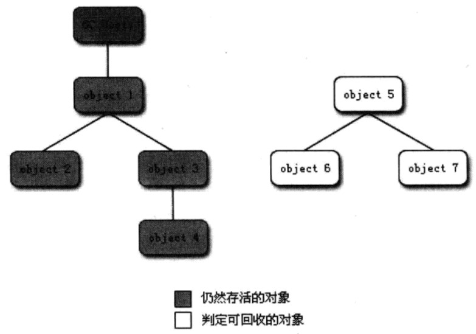

###1 概述

程序计数器、虚拟机栈、本地方法栈3个区域随线程而生，随线程而灭；栈中的栈帧随着方法的进入和退出执行着出栈和入栈操作。每一个栈帧中分配多少内存基本上是在类结构确定下来时就已知的因此这几个区域的内存分配和回收都具备确定性，在这几个区域内就不需要过多考虑回收的问题，因为方法结束或者线程结束时，内存自然就跟随着回收了。

而Java堆和方法区则不一样，一个接口中的多个实现类需要的内存可能不一样，一个方法中的多个分支需要的内存也可能不一样，我们只有在程序处于**运行期间时**才能知道会创建哪些对象，这部分内存的分配和回收都是动态的，垃圾收集器所关注的是这部分内存。

垃圾收集器在对堆进行回收前，第一件事情就是要确定这些对象之中哪些还“存活”着，哪些已经“死去”。


### 2 如何判断对象是否“死去“

1. 引用计数法

2. 可达性分析算法 

   

##### 2.1 引用计数法

给对象添加一个引用计数器，每当有一个地方引用它，计数器就+1,；当引用失效时，计数器就-1；任何时刻计数器都为0的对象就是不能再被使用的。 

**引用计数法的缺点：**

主流的Java虚拟机里面没有选用引用计数算法来管理内存，最主要的原因是它很难解决对象之间相互循环引用的问题。

如下代码：

```
＊＊
 ＊ testGC()方法执行后，objA和objB会不会被GC呢？
 ＊ @author zzm
＊/
public class ReferenceCountingGC {
    public Object instance = null;
    private static final int _1MB = 1024 ＊ 1024;
    /＊＊
    ＊ 这个成员属性的唯一意义就是占点内存，以便能在GC日志中看清楚是否被回收过
    ＊/
    private byte[] bigSize = new byte[2 ＊ _1MB];
    public static void testGC() {
            ReferenceCountingGC objA = new ReferenceCountingGC();
            ReferenceCountingGC objB = new ReferenceCountingGC();
            objA.instance = objB;
            objB.instance = objA;
            objA = null;
            objB = null;
            //假设在这行发生GC，objA和objB是否能被回收？
            System.gc();
    }
}

```


##### 2.2 可达性分析算法

通过一系列的名为“GC Roots”的对象作为起始点，从这些节点开始向下搜索，搜索所走过的路径称为引用链（Reference Chain），当一个对象到 GC Roots 没有任何引用链相连（用图论的话来说就是从 GC Roots 到这个对象不可达）时，则证明此对象是不可用的。 




### 3 GC Roots的对象

在Java语言中，可作为GC Roots的对象包括下面几种：

1. 虚拟机栈（栈帧中的本地变量表）中引用的对象。
2. 方法区中类静态属性引用的对象。
3. 方法区中常量引用的对象。
4. 本地方法栈中JNI（即一般说的Native方法）引用的对象。


### 4 Java 的4种引用方式

- 强引用 Strong Reference
- 软引用 Soft Reference
- 弱引用 Weak Reference
- 虚引用 Phantom Reference


##### 4.1 强引用

强引用就是指在程序代码之中普遍存在的，类似 `Object obj = new Object()` 这类的引用，只要强引用还存在，垃圾收集器永远不会回收掉被引用的对象。

##### 4.2 软引用

软引用是用来描述一些还有用但并非必需的对象。对于软引用关联着的对象，在系统将要发生内存溢出异常之前，将会把这些对象列进回收范围之中进行第二次回收。如果这次回收还没有足够的内存，才会抛出内存溢出异常。

##### 4.3 弱引用

弱引用也是用来描述非必需对象的，但是它的强度比软引用更弱一些，被弱引用关联的对象只能生存到下一次垃圾收集发生之前。当垃圾收集器工作时，无论当前内存是否足够，都会回收掉只被弱引用关联的对象。

##### 4.4 虚引用

虚引用是最弱的一种引用关系。一个对象是否有虚引用的存在，完全不会对其生存时间构成影响，也无法通过虚引用来取得一个对象实例。为一个对象设置虚引用关联的唯一目的就是能在这个对象被收集器回收时收到一个系统通知。


### 5 finalize()方法

即使在可达性分析算法中不可达的对象，也并非是“非死不可”的，要真正宣告一个对象死亡，至少要经历两次标记过程。

##### 5.1 直接死亡

直接死亡的对象符合下列条件：

- 对象没有覆盖finalize()方法。
- 或者finalize()方法已经被虚拟机调用过。


##### 5.2 给第二次机会

 如果这个对象被判定为**有必要执行finalize()方法**，那么这个对象将会放置在一个叫做F-Queue的队列之中，并在稍后由一个由虚拟机自动建立的、低优先级的Finalizer线程去执行它。执行并不承诺会等待它运行结束，因为如果一个对象在finalize()方法中执行缓慢，或者发生了死循环，将很可能会导致F-Queue队列中其他对象永久处于等待，甚至导致整个内存回收系统崩溃。

finalize()方法是对象逃脱死亡命运的最后一次机会，稍后GC将对F-Queue中的对象进行第二次小规模的标记，如果**对象要在finalize()中重新与引用链上的任何一个对象建立关联**，譬如把自己（this关键字）赋值给某个类变量或者对象的成员变量，那在第二次标记时它将被移除出“即将回收”的集合。


代码：一次对象自我拯救的演示

```
/＊＊  ＊ 此代码演示了两点：  

＊ 1.对象可以在被GC时自我拯救。  

＊ 2.这种自救的机会只有一次，因为一个对象的finalize()方法最多只会被系统自动调用一次  

＊ @author zzm  

＊/
public class FinalizeEscapeGC {
    public static FinalizeEscapeGC SAVE_HOOK = null;
    public void isAlive() {
            System.out.println("yes, i am still alive :)");
    }
    @Override
    protected void finalize() throws Throwable {
            super.finalize();
            System.out.println("finalize mehtod executed!");
            FinalizeEscapeGC.SAVE_HOOK = this;
    }
    public static void main(String[] args) throws Throwable {
            SAVE_HOOK = new FinalizeEscapeGC();
            //对象第一次成功拯救自己
               SAVE_HOOK = null;
            System.gc();
            //因为finalize方法优先级很低，所以暂停0.5秒以等待它
            Thread.sleep(500);
            if (SAVE_HOOK != null) {
                    SAVE_HOOK.isAlive();
            } else {
                    System.out.println("no, i am dead :(");
            }
            //下面这段代码与上面的完全相同，但是这次自救却失败了
            SAVE_HOOK = null;
            System.gc();
            //因为finalize方法优先级很低，所以暂停0.5秒以等待它
            Thread.sleep(500);
            if (SAVE_HOOK != null) {
                    SAVE_HOOK.isAlive();
            } else {
                    System.out.println("no, i am dead :(");
            }
    }
}

```


运行结果： 

```
finalize mehtod executed! 

yes, i am still alive :) 

no, i am dead :( 
```

有些教材中描述它适合做“关闭外部资源”之类的工作，这完全是对这个方法用途的一种自我安慰。finalize()能做的所有工作，使用try-finally或者其他方式都可以做得更好、更及时，所以建议大家完全可以忘掉Java语言中有这个方法的存在。 


参考博客：https://blog.csdn.net/woohooli/article/details/5586429