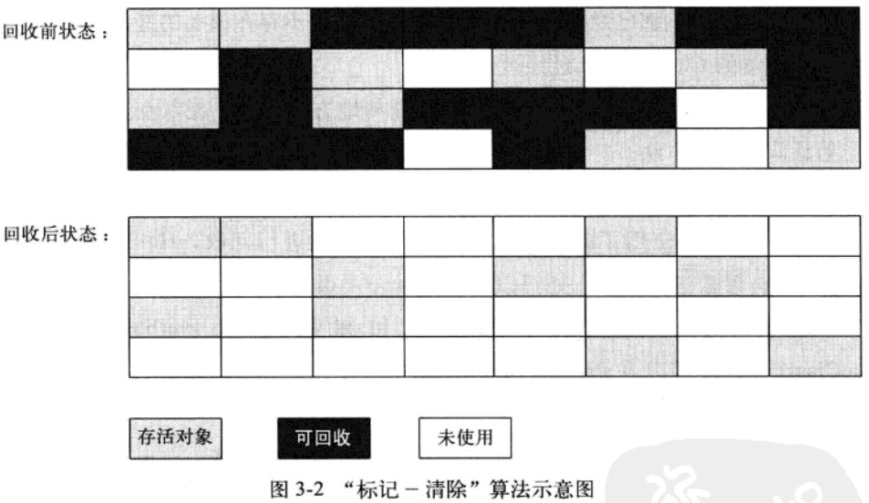
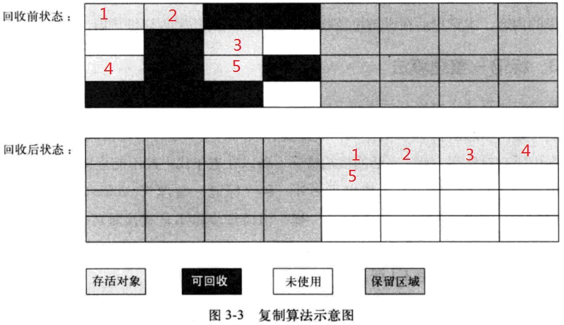
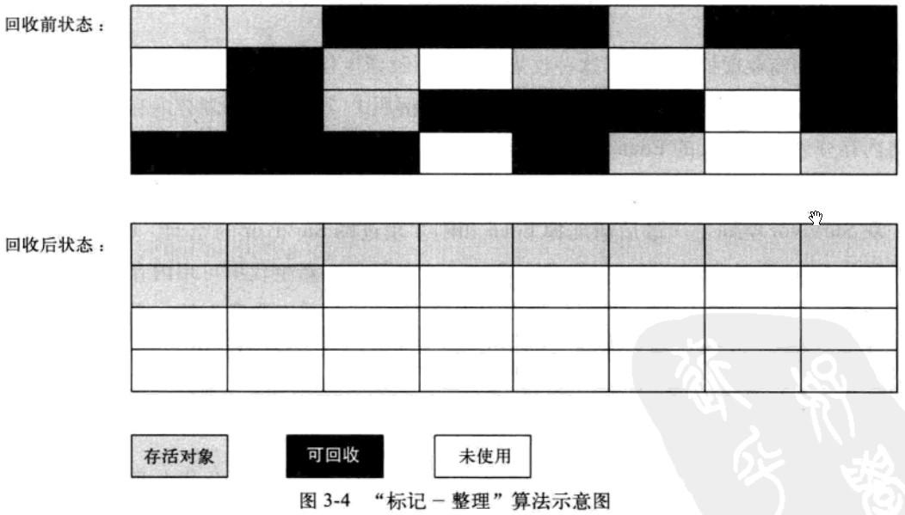

### 1 回收方法区

在方法区中进行垃圾收集的“性价比”一般比较低：在堆中，尤其是在新生代中，常规应用进行一次垃圾收集一般可以回收70%～95%的空间，而永久代的垃圾收集效率远低于此。 

永久代的垃圾收集主要回收两部分内容：

- 废弃常量

- 无用的类

  

##### 1.1 回收废弃常量

与回收Java堆中的对象非常类似。以常量池中字面量的回收为例，假如一个字符串“abc”已经进入了常量池中，但是当前系统没有任何String对象引用常量池中的“abc”常量，也没有其他地方引用了这个字面量，如果这时发生内存回收，这个“abc”常量就会被系统清理出常量池。常量池中的其他类（接口）、方法、字段的符号引用也与此类似。

##### 1.2 回收“无用的类”

判定一个类是否是“无用的类”需要同时满足下面3个条件：

- 该类所有的实例都已经被回收，也就是Java堆中不存在该类的任何实例。
- 加载该类的ClassLoader已经被回收。
- 该类对应的java.lang.Class 对象没有在任何地方被引用，无法在任何地方通过反射访问该类的方法。

##### 1.3 参数

虚拟机可以对满足上述3个条件的无用类进行回收，但并不是和对象一样，不使用了就必然会回收。对是否对类进行回收，HotSpot虚拟机提供了几个参数。

- -Xnoclassgc：关闭CLASS的垃圾回收功能，就是虚拟机加载的类，即便是不使用，没有实例也不会回收。
- -verbose:class：监视类加载信息
- -XX:+TraceClassLoading&-XX:+TraceClassUnLoading：打印出类的加载和被卸载的过程信息 （需要FastDebug版的虚拟机支持）

在大量使用反射、动态代理、CGLib等ByteCode框架、动态生成JSP以及OSGi这类频繁自定义ClassLoader的场景都需要虚拟机具备类卸载的功能，以保证永久代不会溢出。 

###  

### 2 垃圾收集算法

- 标记-清除算法
- 复制算法 
- 标记-整理算法 
- 分代收集算法

### 3 标记-清除算法

分为标记和清除两个阶段。首先标记出所有需要回收的对象，在标记完成后统一回收被标记的对象 。

缺点：

- 效率问题。标记和清除过程的效率都不高。   
- 空间问题。标记清除之后会产生大量不连续的内存碎片，空间碎片太多可能导致，程序分配较大对象时无法找到足够的连续内存，不得不提前出发另一次垃圾收集动作。 

### 4 复制算法（Copying）- 新生代

将可用内存按容量划分为大小相等的两块，每次只使用其中一块。当这一块的内存用完了，就将存活着的对象复制到另一块上面，然后再把已经使用过的内存空间一次清理掉。 

##### 4.1 优缺点

1. 优点：

   复制算法使得每次都是针对其中的一块进行内存回收，内存分配时也不用考虑内存碎片等复杂情况，只要移动堆顶指针，按顺序分配内存即可，实现简单，运行高效。

   

2. 缺点：

   将内存缩小为原来的一半。在对象存活率较高时，需要执行较多的复制操作，效率会变低。

##### 4.2 应用

商业的虚拟机都采用复制算法来回收新生代。因为新生代中的对象容易死亡，所以并不需要按照1:1的比例划分内存空间，而是将内存分为一块较大的 Eden 空间和两块较小的 Survivor 空间。每次使用 Eden 和其中的一块 Survivor。

当回收时，将 Eden 和 Survivor 中还存活的对象一次性拷贝到另外一块 Survivor 空间上，最后清理掉 Eden 和刚才用过的 Survivor 空间。Hotspot 虚拟机默认 Eden 和 Survivor 的大小比例是8:1，也就是每次新生代中可用内存空间为整个新生代容量的90%（80% + 10%），只有10%的内存是会被“浪费”的。

当Survivor空间不够用时，需要依赖其他内存（这里指老年代）进行分配担保。 

### 5 标记-整理算法（Mark-Compact）-老年代

复制收集算法在对象存活率较高时就要进行较多的复制操作，效率将会变低。且如果不想浪费50%的空间，就需要有额外的空间进行分配担保，以应对被使用的内存中所有对象都100%存活的极端情况，所以在老年代一般不能直接选用这种算法。

 根据老年代的特点，有人提出了另外一种“标记-整理”算法，标记过程仍然与“标记-清除”算法一样，但后续步骤不是直接对可回收对象进行清理，而是让所有存活的对象都向一端移动，然后直接清理掉端边界以外的内存。

### 6 分代收集算法

当前商业虚拟机的垃圾收集都采用“分代收集”（Generational Collection）算法，这种算法并没有什么新的思想，只是根据对象的存活周期，将内存划分为几块。一般是把 Java 堆分为新生代和老年代，这样就可以根据各个年代的特点，采用最适当的收集算法。 

- 新生代：每次垃圾收集时会有大批对象死去，只有少量存活，所以选择**复制算法**，只需要少量存活对象的复制成本就可以完成收集。
- 老年代：对象存活率高、没有额外空间对它进行分配担保，必须使用**“标记-清理”或“标记-整理”算法**进行回收。

### 7 HotSpot虚拟机如何发起内存回收

##### 7.1 为什么要有OopMap？

帮HotSpot快速且准确地完成GC Roots枚举。

从可达性分析中从GC Roots节点找引用链这个操作为例，如果要逐个检查这里面的引用，那么必然会消耗很多时间。

 另外，可达性分析对执行时间的敏感还体现在GC停顿上，即在整个分析期间GC进行时**必须停顿所有Java执行线程**（Sun将这件事情称为“Stop The World”）。

 由于目前的主流Java虚拟机使用的都是准确式GC，所以当GC停顿后，并不需要一个不漏地检查完所有执行上下文和全局的引用位置，在HotSpot的实现中，是使用一组称为OopMap的数据结构来达到这个目的的。在类加载完成的时候，HotSpot就把**对象内什么偏移量上是什么类型的数据计算出来**，在JIT编译过程中，**也会在特定的位置记录下栈和寄存器中哪些位置是引用**。这样，GC在扫描时就可以直接得知这些信息了。

##### 7.2 安全点

1. 设置安全点的原因：可能导致引用关系变化或者说OopMap内容变化的指令非常多，如果为每一条指令都生成对应的OopMap，那将会需要大量的额外空间，这样GC的空间成本将会变得很高。
2. 解决方案：HotSpot只是在“特定的位置”生成OopMap记录信息，这些位置称为安全点（Safepoint），即程序执行时并非在所有地方都能停顿下来开始GC，只有在到达安全点时才能暂停。
3. 选取依据：Safepoint的选定既不能太少以致于让GC等待时间太长，也不能过于频繁以致于过分增大运行时的负荷。所以，安全点的选定基本上是以程序“是否具有让程序长时间执行的特征”为标准进行选定的——因为每条指令执行的时间都非常短暂，程序不太可能因为指令流长度太长这个原因而长时间运行，“长时间执行”的最明显特征就是指令序列复用，例如方法调用、循环跳转、异常跳转等，所以具有这些功能的指令才会产生Safepoint。 
4. 在GC发生时让所有线程（这里不包括执行JNI调用的线程）都“跑”到最近的安全点上再停顿下来：

- 抢先式中断：在GC发生时，首先把所有线程全部中断，如果发现有线程中断的地方不在安全点上，就恢复线程，让它“跑”到安全点上。现在几乎没有虚拟机实现采用抢先式中断来暂停线程从而响应GC事件。
- 主动式中断： 不直接对线程操作，仅仅简单地设置一个标志，各个线程执行时主动去轮询这个标志，发现中断标志为真时就自己中断挂起。轮询标志的地方和安全点是重合的，另外再加上创建对象需要分配内存的地方。

##### 7.3 安全区域

Safepoint机制保证了程序执行时，在不太长的时间内就会遇到可进入GC的Safepoint。但是，程序“不执行”的时候呢？所谓的程序不执行就是没有分配CPU时间，典型的例子就是线程处于Sleep状态或者Blocked状态，这时候线程无法响应JVM的中断请求，“走”到安全的地方去中断挂起。对于这种情况，就需要安全区域（Safe Region）来解决。

 **安全区域是指在一段代码片段之中，引用关系不会发生变化。在这个区域中的任意地方开始GC都是安全的。**我们也可以把Safe Region看做是被扩展了的Safepoint。 在线程执行到Safe Region中的代码时，首先标识自己已经进入了Safe Region，那样，当在这段时间里JVM要发起GC时，就不用管标识自己为Safe Region状态的线程了。在线程要离开Safe Region时，它要检查系统是否已经完成了根节点枚举（或者是整个GC过程），如果完成了，那线程就继续执行，否则它就必须等待直到收到可以安全离开Safe Region的信号为止。

