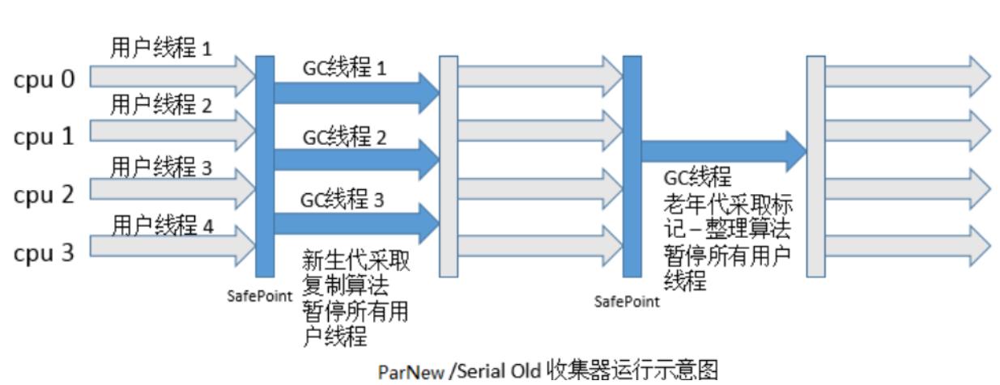
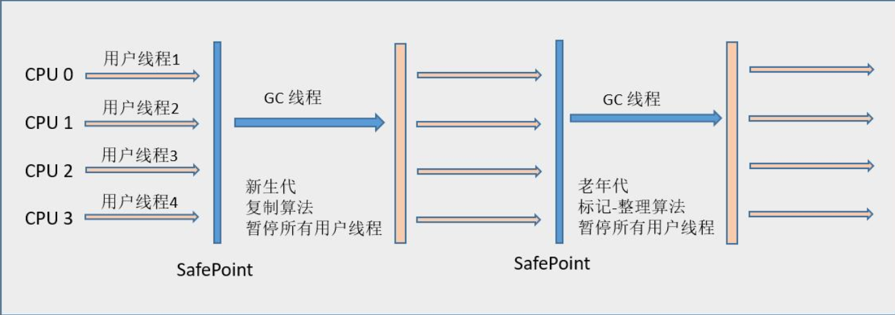
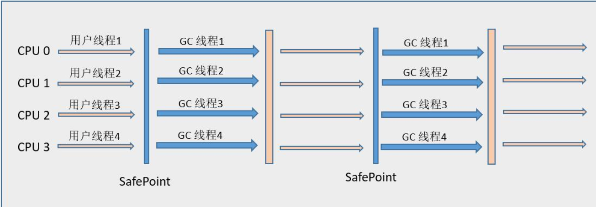
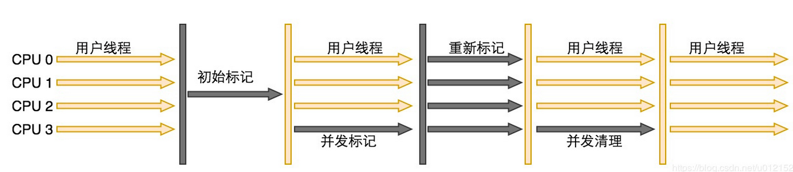
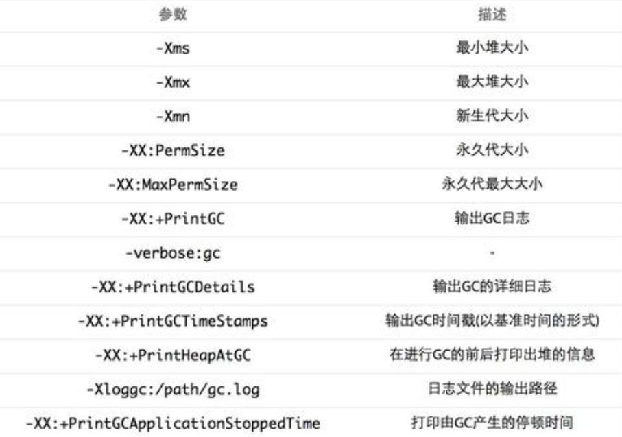
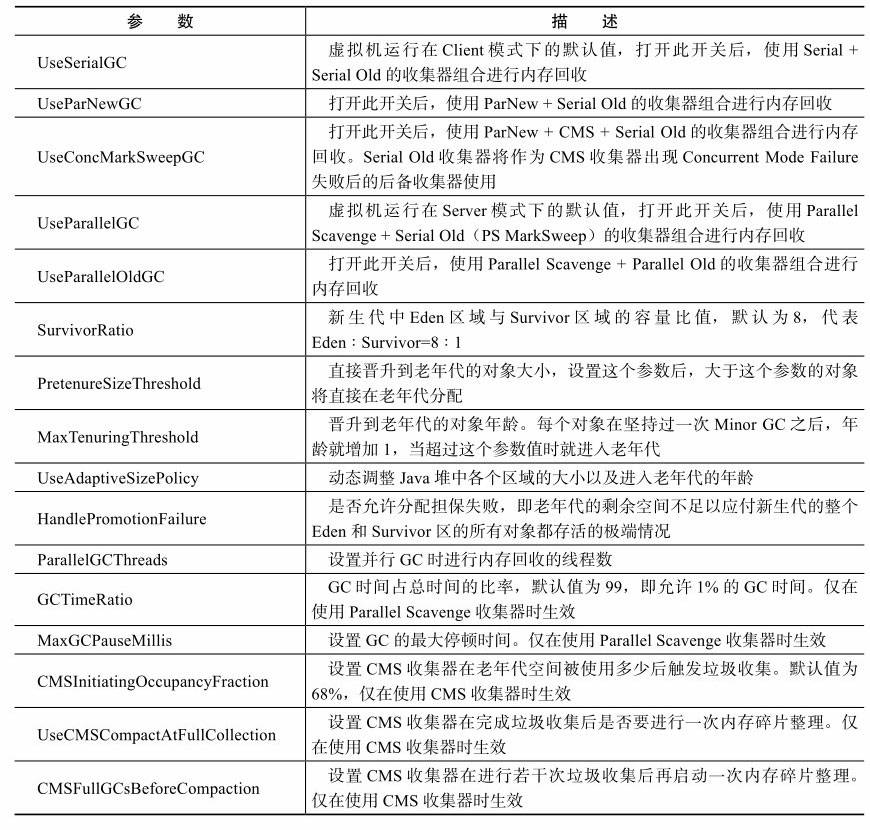

有连线的即可合作的收集器。


### 1 Serial收集器（单线程）

##### 1.1 特点

Serial收集器是最基本、发展历史最悠久的收集器。它的“单线程”的意义并不仅仅说明它只会使用一个CPU或一条收集线程去完成垃圾收集工作，更重要的是在它进行垃圾收集时，**必须暂停其他所有的工作线程**，直到它收集结束。

Serial/Serial Old收集器的运行示意图：

 


##### 1.2 优点

Serial收集器依然是虚拟机运行在Client模式下的默认新生代收集器。简单而高效（与其他收集器的单线程比），对于限定单个CPU的环境来说，Serial收集器由于没有线程交互的开销自然可以获得最高的单线程收集效率。在用户的桌面应用场景中，分配给虚拟机管理的内存一般来说不会很大，收集几十兆甚至一两百兆的新生代，停顿时间完全可以控制在几十毫秒最多一百多毫秒以内。**所以，Serial收集器对于运行在Client模式下的虚拟机来说是一个很好的选择。**


### 2 ParNew收集器（多线程）

##### 2.1 优势

ParNew收集器其实就是Serial收集器的多线程版本，除了使用多条线程，其他与Serial收集器相比并没有太多创新之处。但它却是**许多运行在Server模式下的虚拟机中首选的新生代收集器，因为除了Serial收集器外，目前只有它能与CMS收集器配合工作。**

   

##### 2.2 参数

- -XX:+UseConcMarkSweepGC：该选项的默认新生代收集器
- -XX：+UseParNewGC：选项来强制指定ParNew收集器。

 

##### 2.3 性能

ParNew收集器在单CPU的环境中绝对不会有比Serial收集器更好的效果。当然，随着可以使用的CPU的数量的增加，它对于GC时系统资源的有效利用还是很有好处的。它默认开启的收集线程数与CPU的数量相同，在CPU非常多的环境下，可以使用-XX:ParallelGCThreads参数来限制垃圾收集的线程数。




##### 2.4 并发&并行

- 并行（Parallel）：指多条垃圾收集线程并行工作，但此时用户线程仍然处于等待状态。 
- 并发（Concurrent）：指用户线程与垃圾收集线程同时执行（但不一定是并行的，可能会交替执行），用户程序在继续运行，而垃圾收集程序运行于另一个CPU上。  


### 3 Parallel Scavenge收集器(并行&多线程)

> 吞吐量优先收集器

Parallel Scavenge收集器是一个新生代收集器，它也是使用**复制算法**的收集器。Parallel Scavenge收集器的特点是它的关注点与其他收集器不同：

- CMS等收集器：尽可能地缩短垃圾收集时用户线程的停顿时间。
- Parallel Scavenge收集器：达到一个可控制的吞吐量（Throughput）。


##### 3.1 吞吐量

吞吐量 = 运行用户代码时间 /（运行用户代码时间 +垃圾收集时间）。主要适合在后台运算而不需要太多交互的任务。


##### 3.2 参数

- XX:MaxGCPauseMillis：控制最大垃圾收集停顿时间（毫秒）

  不要认为如果把XX:MaxGCPauseMillis设置得稍小一点就能使得系统的垃圾收集速度变得更快，GC停顿时间缩短是以牺牲吞吐量和新生代空间来换取的：系统把新生代调小一些，收集300MB新生代肯定比收集500MB快，这也直接导致垃圾收集发生得更频繁一些，原来10秒收集一次、每次停顿100毫秒，现在变成5秒收集一次、每次停顿70毫秒。停顿时间的确在下降，但吞吐量也降下来了。 

- -XX:GCTimeRatio：设置吞吐量大小

  GCTimeRatio参数的值应当是一个大于0且小于100的整数，也就是垃圾收集时间占总时间的比率，相当于是吞吐量的倒数。如果把此参数设置为19，那允许的最大GC时间就占总时间的5%（即1 /（1+19）），默认值为99。


- -XX:+UseAdaptiveSizePolicy:这是一个开关参数，当这个参数打开之后，就不需要手工指定新生代的大小（-Xmn）、Eden与Survivor区的比例（-XX:SurvivorRatio）、晋升老年代对象年龄（-XX:PretenureSizeThreshold）等细节参数了.


##### 3.3 **GC自适应的调节策略**

虚拟机会根据当前系统的运行情况收集性能监控信息，动态调整这些参数以提供最合适的停顿时间或者最大的吞吐量，这种调节方式称为**GC自适应的调节策略**。若对于收集器运作原来不太了解，只需要把基本的内存数据设置好（如-Xmx设置最大堆），然后使用MaxGCPauseMillis参数（更关注最大停顿时间）或GCTimeRatio （更关注吞吐量）参数给虚拟机设立一个优化目标。

自适应调节策略也是Parallel Scavenge收集器与ParNew收集器的一个重要区别。 


### 4 Serial Old收集器（单线程 ）

Serial Old是Serial收集器的老年代版本，使用“**标记-整理”算法**。

##### 4.1 应用

Client模式下的虚拟机使用。

Server模式下，那么它主要还有两大用途：

- 在JDK 1.5以及之前的版本中与Parallel Scavenge收集器搭配使用。
- 作为CMS收集器的后备预案，在并发收集发生Concurrent Mode Failure时使用。

 


### 5 Parallel Old收集器（多线程）

Parallel Old是Parallel Scavenge收集器的老年代版本，使用**“标记-整理”算法**。

在注重吞吐量以及CPU资源敏感的场合，Parallel Scavenge+Parallel Old收集器都可以优先考虑。





### 6 CMS收集器

CMS（Concurrent Mark Sweep）收集器是一种以获取最短回收停顿时间为目标的收集器，基于“标记—清除”算法实现。

##### 6.1 运作过程

分为4个步骤：

- 初始标记（CMS initial mark）：标记一下GC Roots能直接关联到的对象，速度很快。
- 并发标记（CMS concurrent mark）：进行GC Roots Tracing的过程。
- 重新标记（CMS remark）：为了修正并发标记期间因用户程序继续运作而导致标记产生变动的那一部分对象的标记记录，这个阶段的停顿时间一般会比初始标记阶段稍长一些，但远比并发标记的时间短。 
- 并发清除（CMS concurrent sweep） 

其中，初始标记、重新标记这两个步骤仍然需要“Stop The World”。


由于整个过程中耗时最长的并发标记和并发清除过程收集器线程都可以与用户线程一起工作，所以，从总体上来说，CMS收集器的内存回收过程是与用户线程一起并发执行的。

Concurrent Mark Sweep收集器运行示意图 ：




##### 6.2 优缺点

优点：并发收集、低停顿。

缺点：

1. **CMS收集器对CPU资源非常敏感**。

   面向并发设计的程序都对CPU资源比较敏感。在并发阶段，它虽然不会导致用户线程停顿，但是会因为占用了一部分线程（或者说CPU资源）而导致应用程序变慢，总吞吐量会降低。

   CMS默认启动的回收线程数是（CPU数量+3）/ 4，当CPU不足4个（譬如2个）时，CMS对用户程序的影响就可能变得很大，如果本来CPU负载就比较大，还分出一半的运算能力去执行收集器线程，就可能导致用户程序的执行速度忽然降低了50%。


2. **CMS收集器无法处理浮动垃圾（Floating Garbage）**

   可能出现“Concurrent Mode Failure”失败而导致另一次Full GC的产生。

   由于CMS并发清理阶段用户线程还在运行着，伴随程序运行自然就还会有新的垃圾不断产生，这一部分垃圾出现在标记过程之后，CMS无法在当次收集中处理掉它们，只好留待下一次GC时再清理掉。


3. **收集结束时会有大量空间碎片产生**

   CMS是一款基于“标记—清除”算法实现的收集器，收集0结束时会有大量空间碎片产生。空间碎片过多时，将会给大对象分配带来很大麻烦，往往会出现老年代还有很大空间剩余，但是无法找到足够大的连续空间来分配当前对象，不得不提前触发一次Full GC。


### 7 G1收集器

G1（Garbage-First）收集器是当今收集器技术发展的最前沿成果之一，HotSpot开发团队赋予它的使命是（在比较长期的）未来可以替换掉JDK 1.5中发布的CMS收集器。

##### 7.1 特点

1. **并行与并发**

   G1能充分利用多CPU、多核环境下的硬件优势，使用多个CPU（CPU或者CPU核心）来缩短Stop-The-World停顿的时间，部分其他收集器原本需要停顿Java线程执行的GC动作，G1收集器仍然可以通过并发的方式让Java程序继续执行。

   

2. **分代收集**

   与其他收集器一样，分代概念在G1中依然得以保留。虽然G1可以**不需要其他收集器配合就能独立管理整个GC堆**，但它能够采用不同的方式去处理新创建的对象和已经存活了一段时间、熬过多次GC的旧对象以获取更好的收集效果。

   

3. **空间整合**

   G1从整体来看是基于“标记—整理”算法实现的收集器，从局部（两个Region之间）上来看是基于“复制”算法实现的。这两种算法都意味着G1运作期间不会产生内存空间碎片。

   

4. **可预测的停顿**

   较CMS，G1除了追求低停顿外，还能建立可预测的停顿时间模型，让使用者明确指定在一个长度为M毫秒的时间片段内，消耗在垃圾收集上的时间不得超过N毫秒。 

   在G1之前的其他收集器进行收集的范围都是整个新生代或者老年代，而G1则将整个Java堆划分为多个大小相等的独立区域（Region），虽然还保留有新生代和老年代的概念，但新生代和老年代不再是物理隔离的了，它们都是一部分Region（不需要连续）的集合。  


为何可以实现可预测停顿？

G1收集器之所以能建立可预测的停顿时间模型，是因为它可以有计划地避免在整个Java堆中进行全区域的垃圾收集。G1跟踪各个Region里面的垃圾堆积的价值大小（回收所获得的空间大小以及回收所需时间的经验值），在后台维护一个优先列表，每次根据允许的收集时间，优先回收价值最大的Region（这也就是Garbage-First名称的来由）。这种使用Region划分内存空间以及有优先级的区域回收方式，保证了G1收集器在有限的时间内可以获取尽可能高的收集效率。


##### 7.2 运作步骤

- 初始标记阶段：标记一下GC Roots能直接关联到的对象，并且修改TAMS（Next Top at Mark Start）的值，让下一阶段用户程序并发运行时，能在正确可用的Region中创建新对象，这阶段需要停顿线程，但耗时很短。

- 并发标记阶段：从GC Root开始对堆中对象进行可达性分析，找出存活的对象，这阶段耗时较长，但可与用户程序并发执行。

- 最终标记阶段：为了修正在并发标记期间因用户程序继续运作而导致标记产生变动的那一部分标记记录，虚拟机将这段时间对象变化记录在线程Remembered Set Logs里面，最终标记阶段需要把Remembered Set Logs的数据合并到Remembered Set中，这阶段需要停顿线程，但是可并行执行。

- 筛选回收阶段：首先对各个Region的回收价值和成本进行排序，根据用户所期望的GC停顿时间来制定回收计划。

  


##### 7.3 总结

G1与CMS相比，虽然它们都立足于低停顿时间，CMS仍然是我现在的选择，但是随着Oracle对G1 的持续改进，我相信G1会是最终的胜利者。

如果你现在采用的收集器没有出现问题，那就没有任何理由现在去选择G1，如果你的应用追求低停顿，那G1现在已经可以作为一个可尝试的选择，如果你的应用追求吞吐量，那G1并不会为你带来什么特别的好处。  


### 8 理解GC日志

```
33.125: [GC [DefNew: 3324K->152K(3712K), 0.0025925 secs] 3324K->152K(11904K), 0.0031680 secs]
100.667: [Full GC [Tenured: 0K->210K(10240K), 0.0149142 secs] 4603K->210K(19456K), [Perm : 2999K->2999K(21248K)], 0.0150007 secs] [Times: user=0.01 sys=0.00, real=0.02 secs]
```

- 33.125&100.667：代表了GC发生的时间，这个数字的含义是从Java虚拟机启动以来经过的秒数。 

- [GC&[Full GC：说明了这次垃圾收集的停顿类型。

  如果有“Full”，说明这次GC是发生了Stop-The-World的，例如下面这段新生代收集器ParNew的日志也会出现“[Full GC”（这一般是因为出现了分配担保失败之类的问题，所以才导致STW）。如果是调用System.gc()方法所触发的收集，那么在这里将显示“[Full GC (System)”。  

  

```
[Full GC 283.736: [ParNew: 261599K->261599K(261952K), 0.0000288 secs]
```


- [DefNew & [Tenured & [Perm：表示GC发生的区域，与使用的GC收集器是密切相关。

  Serial收集器的新生代名：“Default New Generation”，显示“[DefNew”。

  ParNew收集器的新生代名：“Parallel New Generation”，显示“[ParNew”。

  Parallel Scavenge收集器的新生代名：“PSYoungGen”，

  老年代和永久代同理，名称也是由收集器决定的。 


- 3324K->152K(3712K)：GC前该内存区域已使用容量-> GC后该内存区域已使用容量 (该内存区域总容量)。

  3324K->152K(11904K)：GC前Java堆已使用容量->GC后Java堆已使用容量(Java堆总容量)。

  0.0025925 secs：该内存区域GC所占用的时间，单位是秒。

有的收集器会给出更具体的时间数据，如“[Times：user=0.01 sys=0.00，real=0.02 secs]”，这里面的user、sys和real分别代表用户态消耗的CPU时间、内核态消耗的CPU事件和操作从开始到结束所经过的墙钟时间（Wall Clock Time）。CPU时间与墙钟时间的区别是，墙钟时间包括各种非运算的等待耗时，例  如等待磁盘I/O、等待线程阻塞，而CPU时间不包括这些耗时，但当系统有多CPU或者多核的话，多线程操作会叠加这些CPU时间，所以看到user或sys时间超过real时间是完全正常的。   


### 9 垃圾收集器参数总结







### 10 内存分配与回收策略


##### 10.1 **对象优先在Eden分配**  

- 大多数情况下，对象在新生代Eden区中分配。当Eden区没有足够空间进行分配时，虚拟机将发起一次Minor GC。
- -XX:+PrintGCDetails：这个收集器日志参数，告诉虚拟机在发生垃圾收集行为时打印内存回收日志，并且在进程退出的时候输出当前的内存各区域分配情况。在实际应用中，内存回收日志一般是打印到文件后通过日志工具进行分析。


##### 10.2 **大对象直接进入老年代**

所谓的大对象是指，需要大量连续内存空间的Java对象，最典型的大对象就是那种很长的字符串以及数组（笔者列出的例子中的byte[]数组就是典型的大对象）。经常出现大对象容易导致内存还有不少空间时就提前触发垃圾收集以获取足够的连续空间来“安置”它们。

- -XX:PretenureSizeThreshold：设置大于值的对象直接在老年代分配。这样做的目的是避免在Eden区及两个Survivor区之间发生大量的内存复制。
- 注意 PretenureSizeThreshold参数只对Serial和ParNew两款收集器有效，Parallel Scavenge 收集器不认识这个参数，Parallel Scavenge收集器一般并不需要设置。如果遇到必须使用此参数的场合，可以考虑ParNew加CMS的收集器组合。


##### 10 3 **长期存活的对象将进入老年代** 

虚拟机给每个对象定义了一个对象年龄计数器。如果对象在Eden出生并经过第一次Minor GC后仍然存活，并且能被Survivor容纳的话，将被移动到Survivor空间中，并且对象年龄设为1。对象在Survivor区中每“熬过”一次Minor GC，年龄就增加1岁，当它的年龄增加到一定程度（默认为15岁），就将会被晋升到老年代中。

- -XX:MaxTenuringThreshold：对象晋升老年代的年龄阈值，可以通过参数设置。


##### 10.4 **动态对象年龄判定**

如果在Survivor空间中相同年龄所有对象大小的总和大于Survivor空间的一半，年龄大于或等于该年龄的对象就可以直接进入老年代，无须等到MaxTenuringThreshold中要求的年龄。


##### 10.5 **空间分配担保**

在发生Minor GC之前，虚拟机会先检查老年代最大可用的连续空间是否大于新生代所有对象总空间。

如果这个条件成立，那么Minor GC可以确保是安全的。

如果不成立，则虚拟机会查看HandlePromotionFailure设置值是否允许担保失败。

* 如果允许，那么会继续检查老年代最大可用的连续空间是否大于历次晋升到老年代对象的平均大小。
  * 如果大于，将尝试着进行一次Minor GC，尽管这次Minor GC是有风险的。
  * 如果小于，或者HandlePromotionFailure设置不允许冒险，那这时也要改为进行一次Full GC。 


JDK 6 Update 24之后的规则变为**只要老年代的连续空间大于新生代对象总大小或者历次晋升的平均大小就会进行Minor GC，否则将进行Full GC。** 


### 11 **Minor GC和Full GC**

- 新生代GC（Minor GC）：指发生在新生代的垃圾收集动作，因为Java对象大多都具备朝生夕灭的特性，所以Minor GC非常频繁，一般回收速度也比较快。
- 老年代GC（Major GC / Full GC）：指发生在老年代的GC，出现了Major GC，经常会伴随至少一次的Minor GC（但非绝对的，在Parallel Scavenge收集器的收集策略里就有直接进行Major GC的策略选择过程）。Major GC的速度一般会比Minor GC慢10倍以上。

