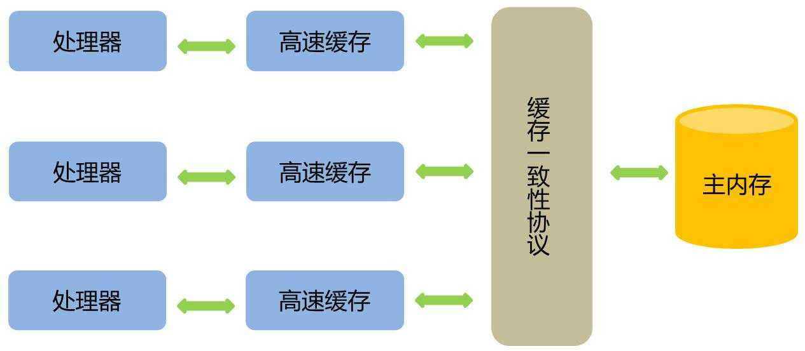
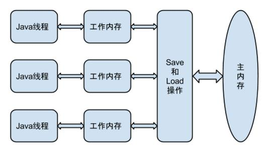

# 1 硬件的效率与一致性

### 1.1 高速缓存

由于计算机的存储设备与处理器的运算速度有几个数量级的差距，所以现代计算机系统都不得不加入一层读写速度尽可能接近处理器运算速度的高速缓存（Cache）来作为内存与处理器之间的缓冲：将运算需要使用到的数据复制到缓存中，让运算能快速进行，当运算结束后再从缓存同步回内存之中，这样处理器就无须等待缓慢的内存读写了。  


### 1.2 缓存数据不一致的问题

在多处理器系统中，每个处理器都有自己的高速缓存，而它们又共享同一主内存（Main Memory）。当多个处理器的运算任务都涉及同一块主内存区域时，将可能导致各自的缓存数据不一致。

解决方案：缓存一致性协议

 


# 2 Java内存模型

### 2.1 主内存与工作内存

Java内存模型的主要目标是定义程序中各个变量的访问规则，即在虚拟机中将变量存储到内存和从内存中取出变量这样的底层细节。

变量包括了：

- 实例字段
- 静态字段
- 构成数组对象的元素

不包括局部变量与方法参数，因为是线程私有的，不会被共享，自然就不会存在竞争问题。 




- 主内存： Java内存模型规定了所有的变量都存储在主内存（Main Memory）中。
- 工作内存：可与前面讲的处理器高速缓存类比，保存了被该线程使用到的变量的主内存副本拷贝。
- 线程：线程对变量的所有操作（读取、赋值等）都必须在工作内存中进行，而不能直接读写主内存中的变量。不同的线程之间也无法直接访问对方工作内存中的变量，线程间变量值的传递均需要通过主内存来完成。


### 2.2 内存间的交互操作

内存间的每一种操作就是原子的、不可再分的。


### 2.3 volatile

关键字volatile可以说是Java虚拟机提供的最轻量级的同步机制。 当一个变量定义为volatile之后，它将具备两种特性：**可见性和禁止指令重排序优化。**

##### 2.3.1 可见性

保证此变量对所有线程的可见性：这里的“可见性”是指当一条线程修改了这个变量的值，新值对于其他线程来说是可以立即得知的。而普通变量不能做到这一点，普通变量的值在线程间传递均需要通过主内存来完成。由于volatile变量只能保证可见性，在不符合以下两条规则的运算场景中，我们仍然要通过加锁（使用synchronized或java.util.concurrent中的原子类）来保证原子性：

- 运算结果并不依赖变量的当前值
- 或者能够确保只有单一的线程修改变量的值

像如下的代码清单的这类场景就很适合使用volatile变量来控制并发，当shutdown()方法被调用时，能保证所有线程中执行的doWork()方法都立即停下来：

```
volatile boolean shutdownRequested;
public void shutdown() {
    shutdownRequested = true;
}
public void doWork() {
    while (!shutdownRequested) {
        // do stuff
    }
}
```


##### **2.3.2 禁止指令重排序优化**

是允许编译器和处理器对指令重排序的，但是规定了as-if-serial语义， 不管怎么重排序，程序的执行结果不能改变。比如下面的程序段：

```
double pi = 3.14; //A

double r = 1; //B

double s= pi * r * r;//C
```

上面的语句，可以按照A->B->C执行，结果为3.14,但是也可以按照B->A->C的顺序执行，因为A、B是两句独立的语句，而C则依赖于A、B，所以A、B可以重排序，但是C却不能排到A、B的前面。JMM保证了重排序不会影响到单线程的执行，但是在多线程中却容易出问题。

如下（多线程）：假如有两个线程执行下列代码段，线程1先执行write，随后线程2再执行multiply，最后ret的值一定是4吗？结果不一定。

还可能是线程1先对flag赋值为true，随后执行到线程2，ret直接计算出结果，再到线程1，这时候a才赋值为2,很明显迟了一步。 

```
int a = 0;

bool flag = false;

public void write() {

a = 2; //1

flag = true; //2

}

public void multiply() {

if (flag) { //3

int ret = a * a;//4

}

}
```

这时候可以为flag加上volatile关键字，禁止重排序，可以确保程序的“有序性”，也可以上重量级的synchronized和Lock来保证有序性,它们能保证那一块区域里的代码都是一次性执行完毕的。 


如下：volatile应用实例

```
Map configOptions;
char[] configText;
//此变量必须定义为volatile
volatile boolean initialized = false;
//假设以下代码在线程A中执行
//模拟读取配置信息，当读取完成后将initialized设置为true以通知其他线程配置可用
configOptions = new HashMap();
configText = readConfigFile(fileName);
processConfigOptions(configText, configOptions);
initialized = true;
//假设以下代码在线程B中执行
//等待initialized为true，代表线程A已经把配置信息初始化完成
while (!initialized) {
    sleep();
}
//使用线程A中初始化好的配置信息
doSomethingWithConfig();

```


##### 2.3.3 volatile底层的实现机制 

如果把加入volatile关键字的代码和未加入volatile关键字的代码都生成汇编代码，会发现加入volatile关键字的代码会多出一个lock前缀指令。

lock前缀指令实际相当于一个内存屏障，内存屏障提供了以下功能：

（1）修改volatile变量时会强制将修改后的值刷新的主内存中。    

（2）修改volatile变量后会导致其他线程工作内存中对应的变量值失效。因此，再读取该变量值的时候就需要重新从读取主内存中的值。   

（3）lock前缀指令其实就相当于一个内存屏障。内存屏障是一组CPU处理指令，用来实现对内存操作的顺序限制。volatile的底层就是通过内存屏障来实现的。插入一个内存屏障，相当于告诉CPU和编译器先于这个命令的必须先执行，后于这个命令的必须后执行 。


##### 2.3.4 应用场景

1. 状态量标记

```
int a = 0;

volatile bool flag = false;

public void write() {

a = 2; //1

flag = true; //2

}

public void multiply() {

if (flag) { //3

int ret = a * a;//4

}

}
```


2. 单例模式的实现，典型的双重检查锁定（DCL） 

```
class Singleton{

private volatile static Singleton instance = null;

private Singleton() {

}

public static Singleton getInstance() {

if(instance==null) {

synchronized (Singleton.class) {

if(instance==null)

instance = new Singleton();

}

}

return instance;

}

}
```

