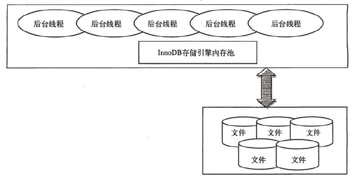
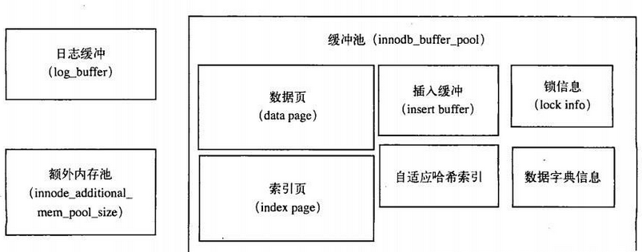
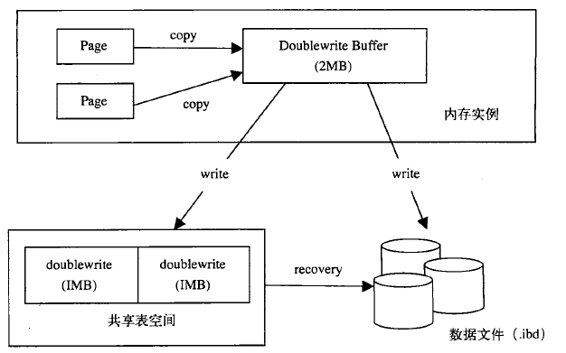

# 1.mysql体系结构&存储引擎

## 1.1.mysql体系结构


- MySQL向外提供的交互接口（Connectors）
- 管理服务组件和工具组件(Management Service & Utilities)
- 连接池组件(Connection Pool)
- SQL接口组件(SQL Interface)
- 查询分析器组件(Parser)
- 优化器组件（Optimizer）
- 缓存主件（Caches & Buffers）
- 插件式存储引擎（Pluggable Storage Engines）
- 物理文件（File System）


## 1.2 InnoDB存储引擎

**特点：**

* 主要面向OLTP（在线事务处理）

- 行锁设计
- 支持外键
- 支持非锁定读（即默认情况下读取操作不会产生锁）
- 通过多版本并发控制（MVCC）来活的高并发性
- 默认为repeatable级别
- 使用next-key locking的策略避免幻读
- 插入缓冲
- 二次写
- 自适应哈希索引
- 预读
- 聚焦索引


## 1.3 MyISAM存储引擎

特点：

- 主要面向OLAP（在线分析处理）
- 不支持事务
- 表锁
- 全文索引
- 可以使用myisampack工具来进一步压缩数据文件（赫夫曼算法）


## 1.4.Memory（Heap）存储引擎

默认使用哈希索引，而不是B+树

只支持表锁，并发性能较差，不支持TEXT和BLOB列类型

存储变长字段（varchar）时是按照定长字段（char）的方式进行的

此外有一点常被忽视的是，MySQL 数据库使用Memory 存储引擎作为临时表来存放查询的中间结果集。如果中间结果集大于Memory存储引擎表的容量设置 ，又或者中间结果含有TEXT或BLOB列类型字段，则MySQL数据库会把其转换到MyISAM存储引擎表而存放到磁盘。之前提到MylSAM不缓存数据文件，因此这时产生的临时表的性能对于查询会有损失。


## 1.5 InnoDB&MyISAM区别（9点）

1. InnoDB支持事务，MyISAM不支持，对于InnoDB每一条SQL语言都默认封装成事务，自动提交，这样会影响速度，所以最好把多条SQL语言放在begin和commit之间，组成一个事务； 

2. InnoDB支持外键，而MyISAM不支持。对一个包含外键的InnoDB表转为MYISAM会失败； 

3. InnoDB是聚集索引，使用B+Tree作为索引结构，数据文件是和（主键）索引绑在一起的（表数据文件本身就是按B+Tree组织的一个索引结构），必须要有主键，通过主键索引效率很高。但是辅助索引需要两次查询，先查询到主键，然后再通过主键查询到数据。因此，主键不应该过大，因为主键太大，其他索引也都会很大。

   MyISAM是非聚集索引，也是使用B+Tree作为索引结构，索引和数据文件是分离的，索引保存的是数据文件的指针。主键索引和辅助索引是独立的。

   也就是说：InnoDB的B+树主键索引的叶子节点就是数据文件，辅助索引的叶子节点是主键的值；而MyISAM的B+树主键索引和辅助索引的叶子节点都是数据文件的地址指针。

  索引区别：https://www.cnblogs.com/jie-y/p/11153480.html这篇博文写的很好

 

4. InnoDB不保存表的具体行数，执行select count(*) from table时需要全表扫描。而MyISAM用一个变量保存了整个表的行数，执行上述语句时只需要读出该变量即可，速度很快（注意不能加有任何WHERE条件）；

那么为什么InnoDB没有了这个变量呢？

因为InnoDB的事务特性，在同一时刻表中的行数对于不同的事务而言是不一样的，因此count统计会计算对于当前事务而言可以统计到的行数，而不是将总行数储存起来方便快速查询。InnoDB会尝试遍历一个尽可能小的索引除非优化器提示使用别的索引。如果二级索引不存在，InnoDB还会尝试去遍历其他聚簇索引。
如果索引并没有完全处于InnoDB维护的缓冲区（Buffer Pool）中，count操作会比较费时。可以建立一个记录总行数的表并让你的程序在INSERT/DELETE时更新对应的数据。和上面提到的问题一样，如果此时存在多个事务的话这种方案也不太好用。如果得到大致的行数值已经足够满足需求可以尝试SHOW TABLE STATUS


5. Innodb不支持全文索引，而MyISAM支持全文索引，在涉及全文索引领域的查询效率上MyISAM速度更快高；PS：5.7以后的InnoDB支持全文索引了

6. MyISAM表格可以被压缩后进行查询操作

7. InnoDB支持表、行(默认)级锁，而MyISAM支持表级锁

   InnoDB的行锁是实现在索引上的，而不是锁在物理行记录上。潜台词是，如果访问没有命中索引，也无法使用行锁，将要退化为表锁。

    例如：

  ```
    t_user(uid, uname, age, sex) innodb;
     
    uid PK
    无其他索引
    
    update t_user set age=10 where uid=1;             命中索引，行锁。
     
    update t_user set age=10 where uid != 1;           未命中索引，表锁。
     
    update t_user set age=10 where name='chackca';    无索引，表锁。
  ```

 

8、InnoDB表必须有主键（用户没有指定的话会自己找或生产一个主键），而Myisam可以没有

9、Innodb存储文件有frm、ibd，而Myisam是frm、MYD、MYI

    Innodb：frm是表定义文件，ibd是数据文件
    
    Myisam：frm是表定义文件，myd是数据文件，myi是索引文件


如何选择：

    1. 是否要支持事务，如果要请选择innodb，如果不需要可以考虑MyISAM；
    
    2. 如果表中绝大多数都只是读查询，可以考虑MyISAM，如果既有读也有写，请使用InnoDB。
    
    3. 系统奔溃后，MyISAM恢复起来更困难，能否接受；
    
    4. MySQL5.5版本开始Innodb已经成为Mysql的默认引擎(之前是MyISAM)，说明其优势是有目共睹的，如果你不知道用什么，那就用InnoDB，至少不会差。

 


InnoDB为什么推荐使用自增ID作为主键？

    答：自增ID可以保证每次插入时B+索引是从右边扩展的，可以避免B+树和频繁合并和分裂（对比使用UUID）。如果使用字符串主键和随机主键，会使得数据随机插入，效率比较差。

 


innodb引擎的4大特性

       插入缓冲（insert buffer),二次写(double write),自适应哈希索引(ahi),预读(read ahead


# 2.InnoDB存储引擎

## 2.1.InnoDB体系架构

InnoDB有多个内存块， 你可以认为这些内存块组成了一个大的内存池， 负责如下工作：

-  维护所有进程／线程需要访问的多个内部数据结构。
-  缓存磁盘上的数据， 方便快速地读取 ，并且在对磁盘文件的数据进行修改之前在这里缓存。
-  重做日志 {redo log ) 缓冲。




后台线程的主要作用是负责刷新内存池中的数据，保证缓冲池中的内存缓存的是最近的数据。此外，将已修改的数据文件刷新到磁盘文件，同时保证在数据库发生异常情况下，InnoDB能恢复到正常运行状态。


## 2.2.线程

InnoDB 存储引擎是在一个被称做master thread的线程上几乎实现了所有的功能。

默认情况下， InnoDB 存储引擎的后台线程有7个：

- 4个IO thread
- 1个master thread
- 1个锁 (lock ) 监控线程
- 1个错误监控线程

lnnoDB Plugin 版本开始增加了默认IO thread 的数量， 默认的read thread和write thread分别增大到了4个。


## 2.3.内存

InnoDB 存储引擎内存由以下几个部分组成：

* **缓冲池（占最大块内存）**：用来存放各种数据的缓存。因为InnoDB的存储引擎的工作方式总是将数据库文件按页 （每页16K) 读取到缓冲池， 然后按最近最少使用 (LRU ) 的算法来保留在缓冲池中的缓存数据。如果数据库文件需要修改，总是首先修改在缓存池中的页（发生修改后，该页即为脏页），然后再按照一定的频率将缓冲池的脏页刷新   (flush ) 到文件。


* **日志缓冲池**：将重做日志信息先放入这个缓冲区 ， 然后按一定频率将其刷新到重做日志文件。

  该值一般不需要设置为很大，因为一般情况下每一秒钟就会将重做日志缓冲刷新到日志文件。


* **额外内存池：**当该区域的内存不够时，会从缓冲池中申请。因此 ， 当你申请了很大的InnoDB缓冲池时，这个值也应该相应增加。





## 2.4.master thread

master  thread的线程优先级别最高。其内部由几个循环组成：

- 主循环 ( loop ) 
- 后台循环 ( background loop ) 
- 刷新循环 ( flush loop ) 
- 暂停循环 (suspend loop)


loop 称为主循环， 因为大多数的操作都在这个循环中， 其中有两大部分操作 ： 

- 每秒钟的操作
- 每10秒的操作


每秒一次的操作包括：

- 日志缓冲刷新到磁盘 ， 即使这个事务还没有提交（总是）。
- 合并插入缓冲（可能）。
- 至多刷新100个InnoDB 的缓冲池中的脏页到磁盘 （可能）。
- 如果当前没有用户活动 ， 切换到background loop (可能）。


每10秒的操作， 包括如下内容：

- 刷新100个脏页到磁盘（可能）。
- 合并至多5个插入缓冲（总是）。
- 将日志缓冲刷新到磁盘 （总是）。
- 删除无用的 Undo页（总是）。
- 刷新100个或者10个脏页到磁盘（总是）。
- 产生一个检查点（总是）。


background loop, 若当前没有用户活动（数据库空闲时）或者数据库关闭时， 就会切换到这个循环。这个循环会执行以下操作：

- 删除无用的Undo页（总是）。
- 合并20个插入缓冲（总是 ）。
- 跳回到主循环（总是）。
- 不断刷新100个页，直到符合条件（可能，跳转到flush loop中完成）。


并不能认为l _second   和sleeps的值总是相等的。在某些情况下， 可以通过两者之间差值的比较来反映当前数据库的负载压力。


## 2.5.master thread的潜在问题

 InnoDB 存储引擎最多都只会刷新100 个脏页到磁盘 ，合并20个插入缓冲。如果是在密集写的应用程序中 ， 每秒中可能会产生大于100个的脏页 ， 或是产生大于20个插入缓冲。

InnoDB Plugin开始提供参数 ：

-  innodb_io_capacity ：  默认值为200。对于刷新到磁盘的数量， 会按照innodb_io_capacity 的百分比来刷新相对数量的页。
- innodb_adaptive_ flushing：自适应地刷新，该值影响 每1秒刷新脏页的数量。


## 2.6.InnoDB存储引擎关键特性

### 2.6.1.插入缓冲

在进行插入操作时，对于非聚集索引 ， 叶子节点的插入不再是顺序的了。这时就需要离散地访问非聚集索引页，插入性能在这里变低了，因为B+树的特性决定了非聚集索引插入的离散性。

InnoDB存储引擎开创性地设计了插入缓冲，对于非聚集索引的插入或更新操作，不是每一次直接插入索引页中。而是先判断插入的非聚集索引页是否在缓冲池中。如果在，则直接插入，如果不在，则先放入一个插入缓冲区中，好似欺骗数据库这个非聚集的索引已经插到叶子节点了，然后再以一定的频率执行插入缓冲和非聚集索引页子节点的合并操作， 这时通常能将多个插入合并到一个操作中（因为在一个索引页中），这就大大提高了对非聚集索引执行插入和修改操作的性能。

插入缓冲的使用需要满足以下两个条件：

- 索引是辅助索引。
- 索引不是唯一的。

目前插入缓冲存在一个问题是，在写密集的情况下，插入缓冲会占用过多的缓冲池内存， 默认情况下最大可以占用 1 / 2 的缓冲池内存。


### 2.6.2.两次写

当数据库宕机时，可能发生数据库正在写一个页面，而这个页只写了一部分（比如16K的页，只写前4K的页）的情况，我们称之为部分写失效。

在应用重做日志前，我们需要一个页的副本，当写入失效发生时，先通过页的副本来还原该页，再进行重做， 这就是doub lewrite。

先将脏页写入Doublewrite Buffer，由Doublewrite Buffer写入doublewrite共享表空间进行备份，然后再写入数据文件。当宕机时，由doublewrite进行数据恢复。




### 2.6.3.自适应哈希索引

InnoDB 存储引擎会监控对表上索引的查找 ， 如果观察到建立哈希索引可以带来速度的提升，则建立哈希索引 ， 所以称之为自适应的。

自适应哈希索引通过缓冲池的B+树构造而来， 因此建立的速度很快。而且**不需要将整个表都建哈希索引 ， InnoDB 存储引擎会自动根据访问的频率和模式来为某些页建立哈希索引**。

值得注意的是，**哈希索引只能用来搜索等值的查询**， 如select * from table where index_col ='xxx', 而对千其他查找类型，如范围查找，是不能使用的。


### 2.6.4 预读


参考博客：https://blog.csdn.net/qq_35642036/article/details/82820178