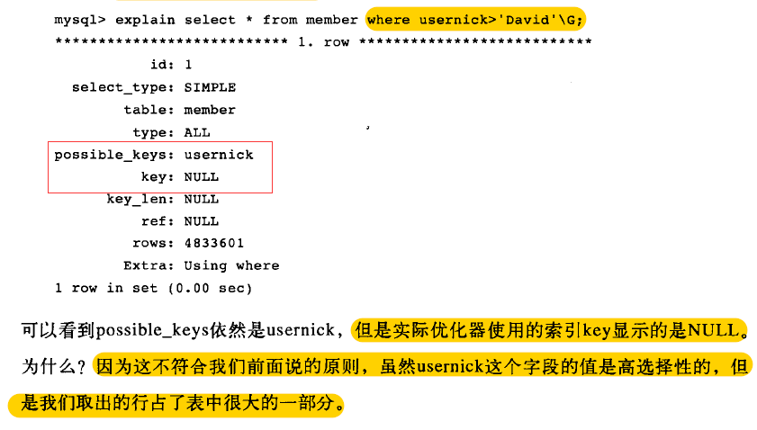
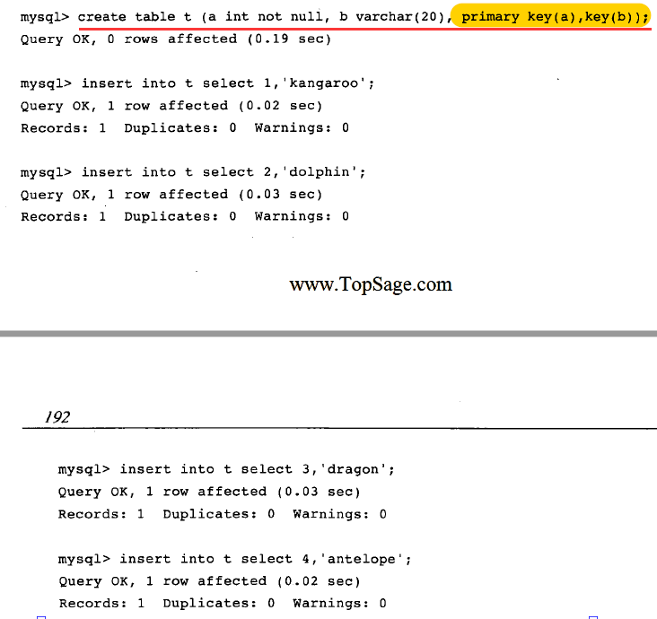
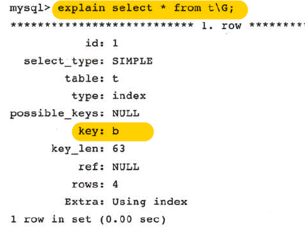
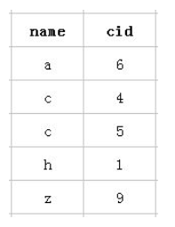

# 1 InnoDB存储引擎索引概述

InnoDB 存储引擎支持两种常见的索引：

- B+树索引(由平衡二叉树演化，B+树不是二叉树)
- 哈希索引（也就是自适应哈希索引）


注意：B+ 树索引并不能找到一个给定键值的具体行。 B+树索引能找到的只是**被查找数据行所在的页**。然后数据库通过把页读入内存，再在内存中进行查找，最后得到查找的数据。


推荐博客：https://baijiahao.baidu.com/s?id=1628226562020721873&wfr=spider&for=pc


# 2 B+树索引

数据库中，B+树的高度一般在2~3层，也就是对于查找某一键值的行记录，最多只需要2~3次IO，意味着只需要0.02~0.03秒。

B+树索引可以分为聚焦索引和辅助聚焦索引.


### 2.1 聚焦索引和辅助聚焦索引

https://blog.csdn.net/itguangit/article/details/82145322

##### 2.1.1 聚焦索引

就是按照每张表的主键构造一颗B+树，并且叶节点中存放着整张表的行记录数据，因此聚焦节点的叶节点是数据页，每个数据页之间都通过一个双向链表来进行连接。

聚焦索引的存储并不是物理上的连续，是逻辑上的连续。


 优点&缺点：

索引能让数据库查询数据的速度上升， 而使写入数据的速度下降，原因很简单的， 因为平衡树这个结构必须一直维持在一个正确的状态， 增删改数据都会改变平衡树各节点中的索引数据内容，破坏树结构， 因此，在每次数据改变时， DBMS必须去重新梳理树（索引）的结构以确保它的正确，这会带来不小的性能开销，也就是为什么索引会给查询以外的操作带来副作用的原因。


##### 2.1.2 非聚焦索引

如果给表中多个字段加上索引 ， 那么就会出现多个独立的索引结构，每个索引（非聚集索引）互相之间不存在关联。

每次给字段建一个新索引， 字段中的数据就会被复制一份出来， 用于生成索引。 因此， 给表添加索引，会增加表的体积， 占用磁盘存储空间。 


**非聚集索引和聚集索引的区别**在于， 通过聚集索引可以查到需要查找的数据， 而通过非聚集索引可以查到记录对应的主键值 ， 再使用主键的值通过聚集索引查找到需要的数据，。

所以如果聚焦索引树和非聚焦索引树的高度都为3，那么对于非聚焦索引查找，一共需要6次逻辑IO来访问最终的一个数据页。

不管以任何方式查询表， 最终都会利用主键通过聚集索引来定位到数据， 聚集索引（主键）是通往真实数据所在的唯一路径。


##### 2.1.3 覆盖索引

然而， 有一种例外可以不使用聚集索引就能查询出所需要的数据。

先看下面这个SQL语句 ：

```
//建立索引

create index index_birthday on user_info(birthday);

//查询生日在1991年11月1日出生用户的用户名

select user_name from user_info where birthday = '1991-11-1'
```

这句SQL语句的执行过程如下:

- 首先，通过非聚集索引index_birthday查找birthday等于1991-11-1的所有记录的主键ID值
- 然后，通过得到的主键ID值执行聚集索引查找，找到主键ID值对就的真实数据（数据行）存储的位置

- 最后， 从得到的真实数据中取得user_name字段的值返回， 也就是取得最终的结果

我们把birthday字段上的索引改成双字段的覆盖索引 ：

`create index index_birthday_and_user_name on user_info(birthday, user_name);`

通过非聚集索引index_birthday_and_user_name查找birthday等于1991-11-1的叶节点的内容，然而， 叶节点中除了有user_name表主键ID的值以外， user_name字段的值也在里面， 因此不需要通过主键ID值的查找数据行的真实所在， 直接取得叶节点中user_name的值返回即可。 通过这种覆盖索引直接查找的方式， 可以省略不使用覆盖索引查找的后面两个步骤， 大大的提高了查询性能。


### 2.2 什么时候使用B+树索引

当某个字段的取值范围很广，几乎没有重复（高选择性），此时使用B+树索引是最适合的，例如姓名字段。

但是如果出现了访问字段是高选择性的，但是取出的行数据占表中大部分的数据时，这时Mysql不会使用B+数索引。

例如下图：


但是如果执行下面的语句：（会不使用索引而使用全表扫描）




即如果取出的数据超过表中数据的20%，优化器就不会使用索引，而是进行全表扫描。


### 2.4 顺序读、随机读与预读取

- 顺序读：顺序地读取磁盘上的块
- 随机读：访问的块不是连续的，需要磁盘的磁头不断移动，读取的速度较低。
- 预读取：通过一次IO请求将多个页读取到缓冲池中，并且估计预读取的多个页马上会被访问。传统的IO每次只读取一个页。（为了提高读取性能，InnoDB引入了预读取技术，然而实际测试很糟糕）


- 在数据库中：
- 顺序读是指根据索引的叶节点数据就能顺序地读取所需的行数据，这个顺序是逻辑的顺序。
- 随机读是指访问非聚焦索引叶节点不能完全得到结果，需要去找到聚焦索引然后找到实际行数据。


### 2.5 辅助索引的优化

因为辅助索引的叶节点包含主键，但是辅助索引的叶并不包含行信息，所以InnoDB存储引擎总是会先从辅助索引的叶节点判断是否能得到所需的数据。

看一个例子：




执行`select * from t`,得到的结果：


这是因为辅助索引中包含了主键a的值，因此访问b列上的辅助索引就能得到a值，这样就可以得到表中所有的数据了。所以优化器选择了辅助索引。

explain验证一下：




如果想要对列a进行排序，需要对其进行order by操作。这样优化器会直接走主键，避免对a列排序。

或者强制使用主键来得到结果：`select * from t force index(primary)`


### 2.6 explain字段

 explain模拟优化器执行SQL语句，在5.6以及以后的版本中，除过select，其他比如insert，update和delete均可以使用explain查看执行计划，从而知道mysql是如何处理sql语句，分析查询语句或者表结构的性能瓶颈。  

| 信息          | 描述                                                         |
| ------------- | ------------------------------------------------------------ |
| id            | 查询的序号,id值越大，优先级越高，越先执行                    |
| select_type   | 将select查询分为简单(simple)和复杂两种类型<br />复杂类型又分为子查询(subquery)和from列表中包含子查询(drived) <br />1.simple: 简单的select查询，查询中不包含子查询或者UNION <br />2. primary :查询中若包含任何复杂的子部分，最外层查询被标记 <br />3. subquery:在select或where列表中包含了子查询 <br />4. derived:在from列表中包含的子查询被标记为derived（衍生），MySQL会递归执行这些子查询，把结果放到临时表中 <br />5. union:如果第二个select出现在UNION之后，则被标记为UNION，如果union包含在from  子句的子查询中，外层select被标记为derived <br />6. union result:UNION 的结果 |
| table         | 输出的行所引用的表                                           |
| type          | 1.all: 全表扫描 <br />2. index:按索引次序扫描，先读索引，再读实际的行，结果还是全表扫描，主要优点是避免了排序。因为索引是排好的。 <br />3.range： 以范围的形式扫描。（where >） <br />4.ref： 非唯一索引访问 <br />5.eq_ref： 使用唯一索引查找(主键或唯一索引) <br />6.const： 常量查询 <br />7.system： 系统查询 <br />8.null: 优化过程中就已经得到结果，不在访问表或索引 |
| possible_keys | 可能用到的索引                                               |
| key           | 实际使用的索引                                               |
| key_len       | 索引字段最大可能使用长度                                     |
| ref           | 显示索引的哪一列被使用了，如果有可能是一个常数，哪些列或常量被用于查询索引列上的值 |
| rows          | 估计需要扫描的行数                                           |
| Extra         | 显示以上信息之外的其他信息                                   |


### 2.7 最左原则

```
CREATE TABLE `student` (
  `id` int(11) NOT NULL AUTO_INCREMENT,
  `name` varchar(255) DEFAULT NULL,
  `cid` int(11) DEFAULT NULL,
  PRIMARY KEY (`id`),
  KEY `name_cid_INX` (`name`,`cid`),
) ENGINE=InnoDB AUTO_INCREMENT=8 DEFAULT CHARSET=utf8
```

以联合索引(name,cid)为例


`EXPLAIN SELECT * FROM student WHERE   cid=1;` 


查询结果：

key : name_cid_INX

type:index


`EXPLAIN SELECT * FROM student WHERE   cid=1 AND name='小红';` 


查询结果：

key : name_cid_INX

type:ref


sql查询用到索引的条件是必须要遵守最左前缀原则，为什么上面两个查询还能用到索引？ 

首先，index这种类型表示是mysql会对整个该索引进行扫描。要想用到这种类型的索引，对这个索引并无特别要求，只要是索引，或者某个复合索引的一部分，mysql都可能会采用index类型的方式扫描。但是呢，缺点是效率不高，mysql会从索引中的第一个数据一个个的查找到最后一个数据，直到找到符合判断条件的某个索引。

而ref：这种类型表示mysql会根据特定的算法快速查找到某个符合条件的索引，而不是会对索引中每一个数据都进行一 一的扫描判断。而要想实现这种查找，索引却是有要求的，**简单说，也就是索引字段的数据必须是有序的，才能实现这种类型的查找，才能利用到索引。**

 

以该表的(name,cid)复合索引为例,它内部结构简单说就是下面这样排列的： 



 mysql创建复合索引的规则是首先会对复合索引的最左边的，也就是第一个name字段的数据进行排序，在第一个字段的排序基础上，然后再对后面第二个的cid字段进行排序。其实就相当于实现了类似 order by name cid这样一种排序规则。 

 所以：第一个name字段是绝对有序的，而第二字段就是无序的了。所以通常情况下，直接使用第二个cid字段进行条件判断是用不到联合索引的。这就是所谓的mysql为什么要强调最左前缀原则的原因。 

 **那么什么时候才能用到呢?**

当然是cid字段的索引数据也是有序的情况下才能使用，什么时候才是有序的呢？观察可知，**当然是在name字段是等值匹配的情况下，cid才是有序的**。

这也就是mysql索引规则中要求复合索引要想使用第二个索引，必须先使用第一个索引的原因。（而且第一个索引必须是等值匹配）。

 


 `EXPLAIN SELECT * FROM student WHERE   cid=1 AND name='小红';` 

这句sql语句，虽然cid放在了前面而name被放在了后面，但是查询的时候还是用到了联合索引，这是为什么呢？

答：优化器。

mysql查询优化器会判断纠正这条sql语句该以什么样的顺序执行效率最高，最后才生成真正的执行计划。所以，当然是我们能尽量的利用到索引时的查询顺序效率最高咯，所以mysql查询优化器会最终以这种顺序进行查询执行。

 

###  2.8 联合索引

联合索引是指对表上的多个列做索引。

创建方法：`alter table t add u_m_b(userId, mobile, billMonth);`，以userId，mobile，billMonth（分别编号为1，2，3方便讲解）为例

1.联合索引由三个列组成，共由7种and的查询情况：

| 用到的列                                                     | 结果                   |
| ------------------------------------------------------------ | ---------------------- |
| userId，mobile，billMonth（1，2，3）<br /> explain select * from t_mobilesms_11 <br />where userid='2222'  and mobile='13281899972' and billMonth='2018-04' | type:ref，key:联合索引 |
| userId，mobile（1，2）                                       | type:ref，key:联合索引 |
| userId，billMonth（1，3）                                    | type:ref，key:联合索引 |
| mobile，billMonth（2，3）                                    | type:all，key:null     |
| userId（1）                                                  | type:ref，key:联合索引 |
| mobile（2）                                                  | type:all，key:null     |
| billMonth（3）                                               | type:all，key:null     |
| userId or mobile（1，2） 注意：这里用的是or                  | type:all，key:null     |

注意：and连接的列名顺序不一致并不影响查询结果，因为优化器会对其顺序进行优化。

这篇博客（写的太好了，复习一定要记得看一下，联合索引的部分）：

http://blog.codinglabs.org/articles/theory-of-mysql-index.html


2.建立三个单独的索引（userId，mobile，billMonth）

| 用到的列                                   | 结果                                                         |
| ------------------------------------------ | ------------------------------------------------------------ |
| userid and mobile and billMonth（1，2，3） | type：ref，possible_keys：userid mobile billMonth，key：userid |
| mobile and billMonth（2，3）               | type：ref，possible_keys：mobile billMonth，key：mobile      |
| userid or mobile（1，2）                   | type：index_merge，possible_keys：userid mobile，key：userid mobile |


index_merge（索引合并优化）：

1. 索引合并是把几个索引的范围扫描合并成一个索引。
2. 索引合并的时候，会对索引进行并集，交集或者先交集再并集操作，以便合并成一个索引。  
3. 这些需要合并的索引只能是一个表的。不能对多表进行索引合并。 


### 2.9 索引失效

关于or：

假如or连接的**俩个查询条件字段中有一个不是单独索引**的话,引擎会放弃索引而产生全表扫描，也就是所谓的索引失效。

但是如果两个都是单独索引的话，两个索引都会用上，使用的是index_merge索引合并优化（mysql5.0后引进的）。


解决方案：

通常情况下, 用UNION替换WHERE子句中的OR将会起到较好的效果. 对索引列使用OR将造成全表扫描. 

注意, 以上规则只针对多个索引列有效. 如果有column没有被索引, 查询效率可能会因为你没有选择OR而降低. 


关于索引失效：

使用范围查询，会导致索引失效。


### 2.10 实际应用题

一个文章库，里面有两个表：category和article。category里面有10条分类数据。article里面有  20万条。article里面有一个"article_category"字段是与category里的"category_id"字段相对应的。  article表里面已经把article_category字义为了索引。数据库大小为1.3G。

**问题一描述**：
执行一个很普通的查询： Select * FROM `article` Where article_category=11 ORDER BY article_id DESC LIMIT 5 。执行时间大约要5秒左右

解决方案：
建一个索引：create index idx_u on article (article_category,article_id);
Select * FROM `article` Where article_category=11 ORDER BY article_id DESC LIMIT 5 减少到0.0027秒


**问题二描述**：
Select * FROM `article` Where article_category IN (2,3) ORDER BY article_id DESC LIMIT 5 执行时间要11.2850秒。
使用OR:
select * from article
where article_category=2
or article_category=3
order by article_id desc
limit 5
执行时间：11.0777

解决方案：避免使用in 或者 or (or会导致扫表)，使用union all
使用UNION ALL：
(select * from article where article_category=2 order by article_id desc limit 5)
UNION ALL (select * from article where article_category=3 order by article_id desc limit 5)
ORDER BY article_id desc
limit 5
执行时间：0.0261


# 3 哈希算法

##### 3.1 二者区别


*(图片源自网络)*

**B+树是一个平衡的多叉树，从根节点到每个叶子节点的高度差值不超过1，而且同层级的节点间有指针相互链接。**

在B+树上的常规检索，从根节点到叶子节点的搜索效率基本相当，不会出现大幅波动，而且基于索引的顺序扫描时，也可以利用双向指针快速左右移动，效率非常高。

因此，B+树索引被广泛应用于数据库、文件系统等场景。顺便说一下，xfs文件系统比ext3/ext4效率高很多的原因之一就是，它的文件及目录索引结构全部采用B+树索引，而ext3/ext4的文件目录结构则采用Linked  list, hashed B-tree、Extents/Bitmap等索引数据结构，因此在高I/O压力下，其IOPS能力不如xfs。


而**哈希索引的示意图**则是这样的：

*(图片源自网络)*

简单地说，**哈希索引就是采用一定的哈希算法**，把键值换算成新的哈希值，检索时不需要类似B+树那样从根节点到叶子节点逐级查找，只需一次哈希算法即可立刻定位到相应的位置，速度非常快。

从上面的图来看，B+树索引和哈希索引的明显区别是：

- **如果是等值查询，那么哈希索引明显有绝对优势**，因为只需要经过一次算法即可找到相应的键值；当然了，这个前提是，键值都是唯一的。如果键值不是唯一的，就需要先找到该键所在位置，然后再根据链表往后扫描，直到找到相应的数据；
- 从示意图中也能看到，**如果是范围查询检索，这时候哈希索引就毫无用武之地了**，因为原先是有序的键值，经过哈希算法后，有可能变成不连续的了，就没办法再利用索引完成范围查询检索；
- 同理，**哈希索引也没办法利用索引完成排序**，以及like ‘xxx%’ 这样的部分模糊查询（这种部分模糊查询，其实本质上也是范围查询）；
- **哈希索引也不支持多列联合索引的最左匹配规则**；
- B+树索引的关键字检索效率比较平均，不像B树那样波动幅度大，**在有大量重复键值情况下，哈希索引的效率也是极低的，因为存在所谓的哈希碰撞问题**。


##### 3.2 应用场景

在MySQL中，只有HEAP/MEMORY引擎表才能显式支持哈希索引（NDB也支持，但这个不常用），InnoDB引擎的自适应哈希索引（adaptive hash index）不在此列，因为这不是创建索引时可指定的。

还需要注意到：HEAP/MEMORY引擎表在mysql实例重启后，数据会丢失。

通常，B+树索引结构适用于绝大多数场景，像下面这种场景用哈希索引才更有优势：

> 在HEAP表中，如果存储的数据重复度很低（也就是说基数很大），对该列数据以等值查询为主，没有范围查询、没有排序的时候，特别适合采用哈希索引
>
> 例如这种SQL：
> SELECT … FROM t WHERE C1 = ?; — 仅等值查询

在大多数场景下，都会有范围查询、排序、分组等查询特征，用B+树索引就可以了。

### 


参考博客：https://www.cnblogs.com/maohuidong/p/10490893.html