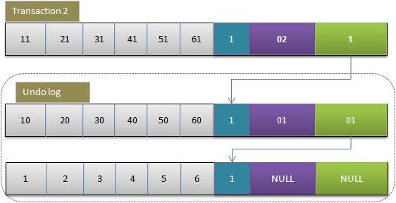

相关命令：

- show engines;  查看数据库支持的引擎
- show variables like '%storage_engine%';   查看数据库默认的引擎
- select @@global.tx_isolation; 查询数据库的隔离级别
- show variables like 'innodb_autoinc_lock_mode';  获取到当前自增长锁的模式
- select * from information_schema.INNODB_LOCKS;  获取到当前加锁情况
- show InnoDB status;  查看最近死锁的日志。


# 1 MySQL中的锁

保证数据并发访问的一致性、有效性。

MySQL中有着Lock和Latch的概念，在数据库中，这两者都可以被称为“锁”，但是两者有着截然不同的含义。


Latch一般称为闩锁（轻量级的锁），因为其要求锁定的时间必须非常短。若持续的时间长，则应用的性能会非常差，在InnoDB引擎中，Latch又可以分为mutex（互斥量）和rwlock（读写锁）。其目的是用来保证并发线程操作临界资源的正确性，并且通常没有死锁检测的机制。

Lock的对象是事务，用来锁定的是数据库中的对象，如表、页、行。并且一般lock的对象仅在事务commit或rollback后进行释放（不同事务隔离级别释放的时间可能不同）。

关于Latch更详细的讲解可以参考：[关于MySQL latch争用深入分析与判断](http://www.cnblogs.com/geaozhang/p/7287108.html)，本文主要关注的是Lock锁。


### 1.1 共享锁&排他锁

InnoDB 实现了标准的行级锁，也就是共享锁（Shared Lock）和互斥锁（Exclusive Lock）。

- 共享锁（读锁），允许事务读一行数据。
- 排他锁（写锁），允许事务删除或更新一行数据。

而它们的名字也暗示着各自的另外一个特性，共享锁之间是兼容的，而互斥锁与其他任意锁都不兼容：


因为共享锁代表了读操作、互斥锁代表了写操作，所以我们可以在数据库中**并行读**，但是只能**串行写**，只有这样才能保证不会发生线程竞争，实现线程安全。


### 1.2 锁的粒度

Lock锁根据粒度主要分为**表锁、页锁和行锁**。不同的存储引擎拥有的锁粒度都不同。


##### 1.2.1 表锁

表级别的锁定是MySQL各存储引擎中最大颗粒度的锁定机制。该锁定机制最大的特点是实现逻辑非常简单，带来的系统负面影响最小。所以获取锁和释放锁的速度很快。由于表级锁一次会将整个表锁定，所以可以很好的避免困扰我们的死锁问题。

**表锁在并发下的读没什么问题，但是在并发插入时的性能就要差一些了。**
使用表级锁定的主要是MyISAM，MEMORY，CSV等一些非事务性存储引擎。

表锁的语法很简单：

```
# 获取表锁
LOCK TABLES
    tbl_name [[AS] alias] lock_type
    [, tbl_name [[AS] alias] lock_type] ...

lock_type:
    READ [LOCAL]
  | [LOW_PRIORITY] WRITE

# 释放表锁
UNLOCK TABLES
```

MyISAM在执行查询前，会自动执行表的加锁、解锁操作，一般情况下不需要用户手动加、解锁，但是有的时候也需要显示加锁。比如：检索某一个时刻t1，t2表中数据数量。

```
LOCK TABLE t1 read, t2 read;
select count(t1.id1) as 'sum' from t1;
select count(t2.id1) as 'sum' from t2;
UNLOCK TABLES;
```


##### 1.2.2 页锁（一页16kb）

页级锁定是MySQL中比较独特的一种锁定级别，在其他数据库管理软件中也并不是太常见。页级锁定的特点是锁定颗粒度介于行级锁定与表级锁之间，所以获取锁定所需要的资源开销，以及所能提供的并发处理能力也同样是介于上面二者之间。另外，页级锁定和行级锁定一样，会发生死锁。
在数据库实现资源锁定的过程中，随着锁定资源颗粒度的减小，锁定相同数据量的数据所需要消耗的内存数量是越来越多的，实现算法也会越来越复杂。不过，随着锁定资源颗粒度的减小，应用程序的访问请求遇到锁等待的可能性也会随之降低，系统整体并发度也随之提升。
**使用页级锁定的主要是BerkeleyDB存储引擎。**


##### 1.2.3 行锁

行级锁定最大的特点就是锁定对象的粒度很小，也是目前各大数据库管理软件所实现的锁定颗粒度最小的。由于锁定颗粒度很小，所以发生锁定资源争用的概率也最小。
虽然能够在并发处理能力上面有较大的优势，但是行级锁定也因此带来了不少弊端。由于锁定资源的颗粒度很小，所以每次获取锁和释放锁需要做的事情也更多，带来的消耗自然也就更大了。此外，行级锁定也最容易发生死锁。
**使用行级锁定的主要是InnoDB存储引擎。**


##### 1.2.4 总结

- 表级锁：开销小，加锁快；不会出现死锁；锁定粒度大，发生锁冲突的概率最高，并发度最低。
- 行级锁：开销大，加锁慢；会出现死锁；锁定粒度最小，发生锁冲突的概率最低，并发度也最高。
- 页面锁：开销和加锁时间界于表锁和行锁之间；会出现死锁；锁定粒度界于表锁和行锁之间，并发度一般。

从锁的角度来说，表级锁更适合于以查询为主，只有少量按索引条件更新数据的应用，如Web应用；而行级锁则更适合于有大量按索引条件并发更新少量不同数据，同时又有并发查询的应用，如一些在线事务处理（OLTP）系统。


# 2 InnoDB中的锁

### 2.1 意向锁

为了支持在不同粒度上进行加锁操作，InnoDB 存储引擎引入了意向锁（Intention Lock）。

那什么是意向锁呢？我们在这里可以举一个例子：**如果没有意向锁，当已经有人使用行锁对表中的某一行进行修改时，如果另外一个请求要对全表进行修改，那么就需要对所有的行是否被锁定进行扫描，在这种情况下，效率是非常低的；不过，在引入意向锁之后，当有人使用行锁对表中的某一行进行修改之前，会先为表添加意向互斥锁（IX），再为行记录添加互斥锁（X），在这时如果有人尝试对全表进行修改就不需要判断表中的每一行数据是否被加锁了，只需要通过等待意向互斥锁被释放就可以了。**

与上一节中提到的两种锁的种类相似的是，意向锁也分为两种：

- **意向共享锁（IS）**：事务想要在获得表中某些记录的共享锁，需要在表上先加意向共享锁。
- **意向互斥锁（IX）**：事务想要在获得表中某些记录的互斥锁，需要在表上先加意向互斥锁。

随着意向锁的加入，锁类型之间的兼容矩阵也变得愈加复杂：


意向锁其实不会阻塞全表扫描之外的任何请求，它们的主要目的是为了表示**是否有人请求锁定表中的某一行数据**。


### 2.2 **自增长锁**

自增长锁是一种特殊的表锁机制，提升并发插入性能。对于这个锁有几个特点：

- 在 SQL 执行完就释放锁，并不是事务执行完。
- 对于 insert...select 大数据量插入会影响插入性能，因为会阻塞另外一个事务执行。
- 自增算法可以配置。

在 MySQL 中 innodb_auto_inclock_mode 有 3 种配置模式 0、1、2，分别对应：

- **传统模式：**使用表锁。
- **连续模式：**对于插入的时候**可以确定行数的使用互斥量**，对于**不能确定行数的使用表锁**的模式。
- **交错模式：**所有的都使用互斥量，为什么叫交错模式呢，有可能在批量插入时自增值不是连续的，当然一般来说如果不看重自增值连续一般选择这个模式，性能是最好的。


# 3 行锁的算法

InnoDB存储引擎有3种行锁的算法，其分别是：

- Record Lock：记录锁是锁住记录的，**锁住的是索引记录，而不是我们真正的数据记录**
- Gap Lock：间隙锁顾名思义锁间隙，不锁记录。锁间隙的意思就是锁定某一个范围，间隙锁又叫 gap 锁，其不会阻塞其他的 gap 锁，但是**会阻塞插入间隙锁**，**这也是用来防止幻读的关键**。 
- Next-Key Lock：Gap Lock+Record Lock，锁定一个范围，并且锁定记录本身。


### 3.1 三种行锁

##### 3.1.1 记录锁

这是一个索引记录锁（主键和唯一索引都算），会锁住索引记录，如果建表时没有设置添加索引，Innodb会去锁定隐式的主键。 它是建立在索引记录上的锁，很多时候，锁定一条数据，由于无索引，往往会导致整个表被锁住，建立合适的索引可以防止扫描整个表。 


##### 3.1.2 间隙锁

间隙锁是一个在索引记录之间的间隙上的锁，设计它的目的是用来解决幻读问题，保证某个间隙内的数据在锁定情况下不会发生任何变化。比如mysql默认隔离级别下的可重复读（RR）。

**当使用唯一索引来搜索唯一行的语句时，不需要间隙锁定。如下面语句的id列有唯一索引，此时只会对id值为10的行使用记录锁。**

> select * from t where id = 10 for update;// 注意：普通查询是快照读，不需要加锁

- 如果，上面语句中id列**没有建立索引或者是非唯一索引时**，则语句会产生间隙锁。

- 如果，搜索条件里有**多个查询条件(即使每个列都有唯一索引)**，也是会有间隙锁的。


需要注意的是，当id列上**没有索引时**，SQL会走聚簇索引的**全表扫描**进行过滤，由于过滤是在MySQL Server层面进行的。因此每条记录（无论是否满足条件）都会被加上X锁。但是，为了效率考量，MySQL做了优化，对于不满足条件的记录，会在判断后放锁，最终持有的，是满足条件的记录上的锁。但是不满足条件的记录上的加锁/放锁动作是不会省略的。所以在没有索引时，不满足条件的数据行会有加锁又放锁的耗时过程。


举例：

根据检索条件向下寻找最靠近检索条件的记录值A作为左区间，向上寻找最靠近检索条件的记录值B作为右区间，即锁定的间隙为（A，B）。

> number 	1 	2 	3 	4 	5 	6 	6 	6 	11
>
> id 		1 	3 	5 	7 	9 	10 	11 	12 	23

select * from t where number=6;那么间隙锁锁定的间隙为：（5，11），所以你再想插入5到11之间的数就会被阻塞。

更需要你注意的是，当你再执行update t set number = 6 where id = 1也会被阻塞。这是为什么？你想想看，要保证每次查询number=6的数据行数不变，如果你将另外一条数据修改成了6，岂不会多了一条？所以此时不会允许任何一条数据被修改成6。


参考博客：https://blog.csdn.net/zcl_love_wx/article/details/82382582


##### 3.1.3 Next-Key Lock

这个锁本质是**记录锁加上 gap 锁**。在 RR 隔离级别下(InnoDB 默认)，InnoDB 对于**行的扫描锁定都是使用此算法**，**但是如果查询扫描中有唯一索引会退化成只使用记录锁。也就是如果由唯一索引（包括主键和unique，那么就不适用间隙锁）**

因为唯一索引能确定行数，而其他索引不能确定行数，需要使用间隙锁防止其他事务中再次添加这个索引的数据造成幻读。RR 隔离级别下，InnoDB 使用 Next-Key Lock 算法避免了幻读。


例如有一个索引有10，11，13和20这4个值，那么该索引可能被Next-Key  Locking的区间为：


### 3.2 **一条简单SQL的加锁实现分析**

在介绍完一些背景知识之后，本文接下来将选择几个有代表性的例子，来详细分析MySQL的加锁处理。当然，还是从最简单的例子说起。就如同下面两条简单的SQL，他们加什么锁？

 

- **SQL1：**select * from t1 where id = 10;
- **SQL2：**delete from t1 where id = 10;

 

针对这个问题，该怎么回答？我能想象到的一个答案是：

 

- **SQL1：**不加锁。因为MySQL是使用多版本并发控制的，读不加锁。
- **SQL2：**对id = 10的记录加写锁 (走主键索引)。

 

这个答案即可能是正确的，也有可能是错误的，已知条件不足，这个问题没有答案。如果需要回答这个问题，我必须还要知道以下的一些前提。

- **前提一：**id列是不是主键？

- **前提二：**当前系统的隔离级别是什么？

- **前提三：**id列如果不是主键，那么id列上有索引吗？

- **前提四：**id列上如果有二级索引，那么这个索引是唯一索引吗？

- **前提五：**两个SQL的执行计划是什么？索引扫描？全表扫描？

 

下面，我将这些问题的答案进行组合，然后按照从易到难的顺序，逐个分析每种组合下，对应的SQL会加哪些锁。

 

**注：**下面的这些组合，我做了一个前提假设，也就是有索引时，执行计划一定会选择使用索引进行过滤 (索引扫描)。但实际情况会复杂很多，真正的执行计划，还是需要根据MySQL输出的为准。

 

- **组合一：**id列是主键，RC隔离级别
- **组合二：**id列是二级唯一索引，RC隔离级别
- **组合三：**id列是二级非唯一索引，RC隔离级别
- **组合四：**id列上没有索引，RC隔离级别
- **组合五：**id列是主键，RR隔离级别
- **组合六：**id列是二级唯一索引，RR隔离级别
- **组合七：**id列是二级非唯一索引，RR隔离级别
- **组合八：**id列上没有索引，RR隔离级别
- **组合九：**Serializable隔离级别

 

注：在前面八种组合下，也就是RC，RR隔离级别下，SQL1：select操作均不加锁，采用的是快照读，因此在下面的讨论中就忽略了，主要讨论SQL2：delete操作的加锁。

 

##### **组合一：id主键+RC**

给定SQL：delete from t1 where id = 10，id是主键时，此SQL只需要在id=10这条记录上加X锁即可。

 

##### **组合二：id唯一索引+RC**

此组合中，id是unique索引，而主键是name列。此时，由于id是unique索引，因此delete语句会选择走id列的索引进行where条件的过滤，在找到id=10的记录后，首先会将unique索引上的id=10索引记录加上X锁，同时，会根据读取到的name列，回主键索引(聚簇索引)，然后将聚簇索引上的name  = ‘d’ 对应的主键索引项加X锁。

 

**结论**：若id列是unique列，其上有unique索引。那么SQL需要加两个X锁，一个对应于id unique索引上的id = 10的记录，另一把锁对应于聚簇索引上的[name=’d’,id=10]的记录。

 

##### **组合三：id非唯一索引+RC**

 id列不再唯一，只有一个普通的索引。首先，id列索引上，满足id = 10查询条件的记录，均已加锁。同时，这些记录对应的主键索引上的记录也都加上了锁。与组合二唯一的区别在于，组合二最多只有一个满足等值查询的记录，而组合三会将所有满足查询条件的记录都加锁。

 

**结论**：若id列上有非唯一索引，那么对应的所有满足SQL查询条件的记录，都会被加锁。同时，这些记录在主键索引上的记录，也会被加锁。

 

##### **组合四：id无索引+RC**

若id列上没有索引，SQL会走聚簇索引的全扫描进行过滤，由于过滤是由MySQL   Server层面进行的。因此每条记录，无论是否满足条件，都会被加上X锁。但是，为了效率考量，MySQL做了优化，对于不满足条件的记录，会在判断后放锁，最终持有的，是满足条件的记录上的锁，但是不满足条件的记录上的加锁/放锁动作不会省略。同时，优化也违背了2PL的约束。

 

##### **组合五：id主键+RR**

 加锁与组合一一致。

 

##### **组合六：id唯一索引+RR**

与组合二一致。两个X锁，id唯一索引满足条件的记录上一个，对应的聚簇索引上的记录一个。

 

##### **组合七：id非唯一索引+RR**

RC隔离级别允许幻读，而RR隔离级别，不允许存在幻读。比起组合三，这里多了一个gap锁，锁住两条记录之间的GAP。这个多出来的GAP锁，就是不会出现幻读的关键。

所谓幻读，就是同一个事务，连续做两次当前读，那么这两次当前读返回的是完全相同的记录。

那么既然防止幻读，需要靠GAP锁的保护，为什么组合五、组合六，也是RR隔离级别，却不需要加GAP锁呢？

答：GAP锁的目的，是为了防止同一事务的两次当前读，出现幻读的情况。而组合五，id是主键；组合六，id是unique键，都能够保证唯一性。一个等值查询，最多只能返回一条记录，而且新的相同取值的记录，一定不会在新插入进来，因此也就避免了GAP锁的使用。

 

**结论：**Repeatable  Read隔离级别下，id列上有一个非唯一索引，对应SQL：delete from t1 where id = 10;  首先，通过id索引定位到第一条满足查询条件的记录，加记录上的X锁，加GAP上的GAP锁，然后加主键聚簇索引上的记录X锁，然后返回；然后读取下一条，重复进行。直至进行到第一条不满足条件的记录[11,f]，此时，不需要加记录X锁，但是仍旧需要加GAP锁，最后返回结束。

 

##### **组合八：id无索引+RR**

 组合八，Repeatable Read隔离级别下的最后一种情况，id列上没有索引，只能进行全表扫描。

这是一个很恐怖的现象。首先，聚簇索引上的所有记录，都被加上了X锁。其次，聚簇索引每条记录间的间隙(GAP)，也同时被加上了GAP锁。这个示例表，只有6条记录，一共需要6个记录锁，7个GAP锁。试想，如果表上有1000万条记录呢？

 在这种情况下，这个表上，除了不加锁的快照度，其他任何加锁的并发SQL，均不能执行，不能更新，不能删除，不能插入，全表被锁死。

 当然，跟组合四：类似，这个情况下，MySQL也做了一些优化，对于不满足查询条件的记录，MySQL会提前放锁。针对上面的这个用例，就是除了记录[d,10]，[g,10]之外，所有的记录锁都会被释放，同时不加GAP锁。

 

**结论：**在Repeatable  Read隔离级别下，如果进行全表扫描的当前读，那么会锁上表中的所有记录，同时会锁上聚簇索引内的所有GAP，杜绝所有的并发 更新/删除/插入  操作。当然，也可以通过触发semi-consistent read，来缓解加锁开销与并发影响，但是semi-consistent  read本身也会带来其他问题，不建议使用。

 

##### **组合九：Serializable**

 针对前面提到的简单的SQL，最后一个情况：Serializable隔离级别。对于SQL2：delete from t1 where id = 10; 来说，Serializable隔离级别与Repeatable Read隔离级别完全一致，因此不做介绍。

 Serializable隔离级别，影响的是SQL1：select * from t1 where id = 10;  这条SQL，在RC，RR隔离级别下，都是快照读，不加锁。但是在Serializable隔离级别，SQL1会加读锁，也就是说快照读不复存在，MVCC并发控制降级为Lock-Based  CC。

 **结论：**在MySQL/InnoDB中，所谓的读不加锁，并不适用于所有的情况，而是隔离级别相关的。Serializable隔离级别，读不加锁就不再成立，所有的读操作，都是当前读。

 


# 4 MVCC 

### 4.1 概念

MVCC，多版本并发控制技术。在 InnoDB 中，**在每一行记录的后面增加两个隐藏列，记录创建版本号和删除版本号**。通过版本号和行锁，从而提高数据库系统并发性能。 

在 MVCC 中，对于读操作可以分为两种读：

- **快照读：**读取的历史数据，适用于简单的 select 语句，不加锁，MVCC 实现可重复读，使用的是 MVCC 机制读取 undo 中的已经提交的数据。所以它的读取是非阻塞的。
- **当前读：**需要加锁的语句，update，insert，delete，select...for update 等等都是当前读。


MVCC只在REPEATABLE READ和READ  COMMITTED两个隔离级别下工作。其他两个隔离级别都和MVCC不兼容，因为READ  UNCOMMITTED总是读取最新的数据行，而不是符合当前事务版本的数据行，而SERIALIZABLE会对所有读取到的行都加锁。

- **在 RR 隔离级别下的快照读，不是以 begin 事务开始的时间点作为 snapshot 建立时间点，而是以第一条 select 语句的时间点作为 snapshot 建立的时间点。以后的 select 都会读取当前时间点的快照值。**
- **而在 RC 隔离级别下总是读取被锁定行最新的快照数据。**


举个简单的例子：

1. 一个事务A（txnId=100）修改了数据X，使得X=1，并且commit了
2. 另外一个事务B（txnId=101）开始尝试读取X，但是还X=1。但B没有提交。
3. 第三个事务C（txnId=102）修改了数据X，使得X=2。并且提交了
4. 事务B又一次读取了X。这时

- 如果事务B是Read Committed。那么就读取X的最新commit的版本，也就是X=2
- 如果事务B是Repeatable Read。那么读取的就是当前事务（txnId=101）之前X的最新版本，也就是X被txnId=100提交的版本，即X=1。


### 4.2 过程

SELECT

> InnoDB会根据以下两个条件检查没行记录：
> a. InnoDB只会查找版本早于当前事务版本的数据行（也就是，行的系统版本小于或等于事务的系统版本号），
>    这样可以确保事务读取到的行，要么是事务开始前已经存在的，要么是事务自身插入或者修改过的。
> b. 行的删除版本要么未定义，要么大于当前事务的版本号。这样可以确保事务读取到的行，在事务之前未被
>    删除。
>    只有符合上述两个条件的记录，才能被作为返回查询结果

INSERT

> InnoDB为新插入的一行保存当前系统版本号作为行版本号

DELETE

> InnoDB为删除的每一行保存当前系统版本号作为删除标识

UPDATE

> UPDATE为插入一行新纪录，保存当前系统版本号作为行版本号，同时保存当前系统版本号到原来的行作为删除


行的更新状态：

下面演示下事务对某行记录的更新过程：

1.初始数据行


>后面三个隐含字段分别对应该行的事务号和回滚指针，假如这条数据是刚INSERT的，可以认为ID为1，其他两个字段为空。


2.事务1更改该行的各字段的值


当事务1更改该行的值时，会进行如下操作：

> 用排他锁锁定该行
> 记录redo log
> 把该行修改前的值Copy到undo log，即上图中下面的行
> 修改当前行的值，填写事务编号，使回滚指针指向undo log中的修改前的行


3.事务2修改该行的值



>与事务1相同，此时undo log，中有有两行记录，并且通过回滚指针连在一起。

因此，如果undo log一直不删除，则会通过当前记录的回滚指针回溯到该行创建时的初始内容，所幸的时在Innodb中存在purge线程，它会查询那些比现在最老的活动事务还早的undo log，并删除它们，从而保证undo log文件不至于无限增长。


# 5 一致性非锁定读&一致性锁定读

### 5.1  一致性非锁定读

一致性非锁定读（consistent  nonlocking  read）是指InnoDB存储引擎通过多版本控制（MVCC）的方式来读取当前执行时间数据库中行的数据。如果读取的这行正在执行DELETE或UPDATE操作，这时读取操作不会向XS锁一样去等待锁释放，而是会去读一个快照数据。

在事务隔离级别RC和RR下，InnoDB存储引擎使用非锁定的一致性读。然而对于快照数据的定义却不同，在RC级别下，对于快照数据，非一致性读总是读取被锁定行的最新一份快照数据。而在RR级别下，对于快照数据，非一致性读总是读取事务开始时的行数据版本。


### 5.2 一致性锁定读

前面说到，在默认隔离级别RR下，InnoDB存储引擎的SELECT操作使用一致性非锁定读。但是在某些情况下，用户需要显式地对数据库读取操作进行加锁以保证数据逻辑的一致性。InnoDB存储引擎对于SELECT语句支持两种一致性的锁定读（locking  read）操作。

- SELECT … FOR UPDATE （X锁）
- SELECT … LOCK IN SHARE MODE （S锁）


# 6 锁带来的问题


InnoDB存储引擎在RR级别就已经解决了所有问题，但是它和Serializable的区别在哪里呢？区别就在于RR级别还存在一个**丢失更新问题**，而SERIALIZABLE无论对于查询还是更新都会进行锁定操作。


如图所示，用户原始金额为100，如果程序中对于转账和存款的判断是先查询再更新的话就会出现丢失更新的问题，也就是后面的更新覆盖了前面的更新。如果想避免这种问题，只能每次更新的时候金额基于表里最新的值来做。如果必须要先查询再更新，可以在更新的条件里判断金额（乐观锁），也可以使用隔离级别最高的SERIALIZABLE。


参考博客：

http://benjaminwhx.com/2018/04/27/%E8%B0%88%E8%B0%88MySQL%E7%9A%84%E9%94%81/

https://www.cnblogs.com/wade-luffy/p/9689975.html

http://hedengcheng.com/?p=771#_Toc374698322

https://zhuanlan.zhihu.com/p/73078137

https://blog.csdn.net/chen77716/article/details/6742128