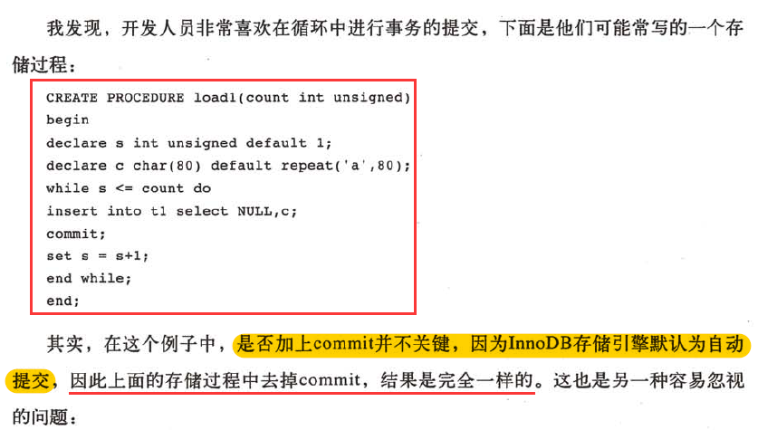

# 1 事务概述

要么所有修改都保存，要么所有修改都不保存。

- **原子性（Atomicity）**：原子性是指事务是一个不可分割的工作单位，事务中的操作要么都发生，要么都不发生。
- **一致性（Consistency）**：事务前后数据的完整性必须保持一致。
- **隔离性（Isolation）**：事务的隔离性是多个用户并发访问数据库时，数据库为每一个用户开启的事务，不能被其他事务的操作数据所干扰，多个并发事务之间要相互隔离。
- **持久性（Durability）**：持久性是指一个事务一旦被提交，它对数据库中数据的改变就是永久性的，接下来即使数据库发生故障也不应该对其有任何影响

# 2 事务实现 

隔离性由锁实现，原子性、一致性、持久性通过数据库的redo和undo实现。

### 2.1 redo

当事务执行时，会向InnoDB存储引擎的日志缓冲里插入事务日志，当事务提交时，必须将InnoDB存储引擎的日志缓冲写入磁盘。

**也就是在写数据前，需要先写日志——预写日志方式**

##### 2.1.1 作用

Redo log的主要作用是用于数据库的崩溃恢复

##### 2.1.2 Redo 的组成

Redo log可以简单分为以下两个部分：

- 内存中重做日志缓冲 (redo log buffer),是易失的，在内存中
- 重做日志文件 (redo log file)，是持久的，保存在磁盘中

##### 2.1.3 redo流程

- 第一步：先将原始数据从磁盘中读入内存中来，修改数据的内存拷贝
- 第二步：生成一条重做日志并写入redo log buffer，记录的是数据被修改后的值
- 第三步：当事务commit时，将redo log buffer中的内容刷新到 redo log file，对 redo log file采用追加写的方式
- 第四步：定期将内存中修改的数据刷新到磁盘中

 

##### 2.1.4 redo日志和二进制日志的区别

二进制日志是在**存储引擎的上层**产生的，不管是什么存储引擎，对数据库进行了修改都会产生二进制日志。而redo log是innodb层产生的，只记录该存储引擎中表的修改。并且二进制日志先于redo log被记录。

### 2.2 undo

事务有时需要撤销，这时就需要undo。对数据库进行修改时，数据库不但会产生redo，还会产生undo。

##### 2.2.1 作用

undo是一种逻辑日志，有两个作用：

- 用于事务的回滚
- MVCC

undo日志，只将数据库逻辑地恢复到原来的样子，在回滚的时候，它实际上是做的相反的工作，比如一条INSERT ，对应一条 DELETE，对于每个UPDATE,对应一条相反的 UPDATE,将修改前的行放回去。undo日志用于事务的回滚操作进而保障了事务的原子性。

##### 2.2.2 写入时机

- DML操作修改聚簇索引前，记录undo日志
- 二级索引记录的修改，不记录undo日志

 

# 3 事务控制语句

### 3.1 概念

事务默认都是自动提交的。如果想要手动开始一个事务，必须使用begin、start transaction 或者执行set autocommit=0，以禁止当前会话的自动提交。

### 3.2 语句

1. 事务开始

   begin或start transaction;

   

2. 事务提交

   commit或commit work；

   

3. 回滚

   rollback或rollback work；

   

4. 保存点设置

   savepoint 标识；

   

5. 回滚到保存点

   rollback to savepoint 标识；

   

6. 删除保存点

   release savepoint 标识。

注：这里有一个容易犯的错，rollback to savepoint，虽然由rollback，但是不是真正地借书一个事务，因此即使执行了rollback to savepoint,之后也需要显式地运行commit或者rollback命令。

### 3.3 事务隔离级别

| 事务隔离级别   | 脏读 | 不可重复读 | 幻读 |
| -------------- | ---- | ---------- | ---- |
| 读未提交       | √    | √          | √    |
| 读已提交（RC） | ×    | √          | √    |
| 可重复读（RR） | ×    | ×          | √    |
| 串行化         | ×    | ×          | ×    |

##### 3.3.1 脏读

脏读就是指当一个事务正在访问数据，并且对数据进行了修改，而这种修改还没有提交到数据库中，这时，另外一个事务也访问这个数据，然后使用了这个数据。 

> 例如：  张三的工资为5000,事务A中把他的工资改为8000,但事务A尚未提交。  与此同时，  事务B正在读取张三的工资，读取到张三的工资为8000。  随后，  事务A发生异常，而回滚了事务。张三的工资又回滚为5000。  最后，  事务B读取到的张三工资为8000的数据即为脏数据，事务B做了一次脏读。 

##### 3.3.2 不可重复读

事务A首先读取了一条数据，然后执行逻辑的时候，事务B将这条数据改变了，然后事务A再次读取的时候，发现数据不匹配了，就是所谓的不可重复读了。 

>   例如：  在事务A中，读取到张三的工资为5000，操作没有完成，事务还没提交。  与此同时，  事务B把张三的工资改为8000，并提交了事务。  随后，  在事务A中，再次读取张三的工资，此时工资变为8000。在一个事务中前后两次读取的结果并不致，导致了不可重复读。 

##### 3.3.3 幻读

事务A首先根据条件索引得到N条数据，然后事务B改变了这N条数据之外的M条或者增添了M条符合事务A搜索条件的数据，导致事务A再次搜索发现有N+M条数据了，就产生了幻读。 

> 例如：  目前工资为5000的员工有10人，事务A读取所有工资为5000的人数为10人。  此时，  事务B插入一条工资也为5000的记录。  这是，事务A再次读取工资为5000的员工，记录为11人。此时产生了幻读。

 

 注意：与标准SQL不同的是，InnoDB存储引擎在RR事务隔离级别下，使用Next-Key Lock锁的算法避免了幻读的产生，这与其他数据库系统不同。所以说，InnoDB存储引擎在默认RR事务隔离下已经达到了serializable隔离级别。

### 3.4 分布式事务

InnoDB存储引擎支持XA事务，通过XA事务来实现分布式事务的实现。

使用分布式事务时，InnoDB存储引擎的事务隔离级别必须设置为serializable。

分布式事务可能在银行系统的转账中比较常见。

### 3.5 不好的事务习惯

##### 3.5.1 在循环中提交

错误方式：

正确方式：

显然第二种方法要快得多。因为每一次提交都要写一次redo日志。

 

