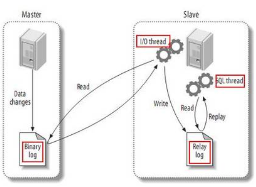

### 1 作用

主从复制，是用来建立一个和主数据库完全一样的数据库环境，称为从数据库；主数据库一般是准实时的业务数据库。

1. 做数据的热备，作为后备数据库，主数据库服务器故障后，可切换到从数据库继续工作，避免数据丢失。
2. 架构的扩展。业务量越来越大，I/O访问频率过高，单机无法满足，此时做多库的存储，降低磁盘I/O访问的频率，提高单个机器的I/O性能。
3. 读写分离，降低主服务器压力 。

### 2 主从复制的原理

1. 主库对所有DDL和DML产生的日志写进binlog；
2. 主库生成一个 log dump 线程，用来给从库I/O线程读取binlog；
3. 从库的I/O Thread去请求主库的binlog，并将得到的binlog日志写到relay log文件中；
4. 从库的SQL Thread会读取relay log文件中的日志解析成具体操作，将主库的DDL和DML操作事件重放。

### 3 主从复制存在的问题

1. 主库宕机后，数据可能丢失；
2. 主从同步延迟。

### 4 产生同步延迟的原因

MySQL的主从复制都是单线程的操作，主库对所有DDL和DML产生的日志写进binlog，由于binlog是顺序写，所以效率很高。Slave的SQL   Thread线程将主库的DDL和DML操作事件在slave中重放。DML和DDL的IO操作是随即的，不是顺序的，成本高很多。

另一方面，由于SQL  Thread也是单线程的，当主库的并发较高时，产生的DML数量超过slave的SQL  Thread所能处理的速度，或者当slave中有大型query语句产生了锁等待那么延时就产生了。

常见原因：Master负载过高、Slave负载过高、网络延迟、机器性能太低、MySQL配置不合理。

### 5 主从延时排查方法

通过监控 show slave status 命令输出的Seconds_Behind_Master参数的值来判断：

NULL，表示io_thread或是sql_thread有任何一个发生故障；

0，该值为零，表示主从复制良好；

正值，表示主从已经出现延时，数字越大表示从库延迟越严重。

### 6 解决方案

1. 半同步复制

从MySQL5.5开始，MySQL已经支持半同步复制了，半同步复制介于异步复制和同步复制之间，主库在执行完事务后不立刻返回结果给客户端，需要等待至少一个从库接收到并写到relay  log中才返回结果给客户端。相对于异步复制，半同步复制提高了数据的安全性，同时它也造成了一个TCP/IP往返耗时的延迟。

2. 主库配置sync_binlog=1，innodb_flush_log_at_trx_commit=1

sync_binlog的默认值是0，MySQL不会将binlog同步到磁盘，其值表示每写多少binlog同步一次磁盘。

innodb_flush_log_at_trx_commit为1表示每一次事务提交或事务外的指令都需要把日志flush到磁盘。

> 注意:将以上两个值同时设置为1时，写入性能会受到一定限制，只有对数据安全性要求很高的场景才建议使用，比如涉及到钱的订单支付业务，而且系统I/O能力必须可以支撑！ 

解决从库复制延迟的问题：

1. 优化网络
2. 升级Slave硬件配置
3. Slave调整参数，关闭binlog，修改innodb_flush_log_at_trx_commit参数值
4. 升级MySQL版本到5.6，使用并行复制

### 7 异步复制&全同步复制&半同步复制

##### 6.1 异步复制

1、逻辑上

MySQL默认的复制即是异步的，主库在执行完客户端提交的事务后会立即将结果返给给客户端，并不关心从库是否已经接收并处理，这样就会有一个问题，主如果crash掉了，此时主上已经提交的事务可能并没有传到从库上，如果此时，强行将从提升为主，可能导致新主上的数据不完整。

2、技术上

主库将事务 Binlog 事件写入到 Binlog 文件中，此时主库只会通知一下 Dump 线程发送这些新的 Binlog，然后主库就会继续处理提交操作，而此时不会保证这些 Binlog 传到任何一个从库节点上。

##### 6.2 全同步复制

1、逻辑上

指当主库执行完一个事务，所有的从库都执行了该事务才返回给客户端。因为需要等待所有从库执行完该事务才能返回，所以全同步复制的性能必然会收到严重的影响。

2、技术上

当主库提交事务之后，所有的从库节点必须收到、APPLY并且提交这些事务，然后主库线程才能继续做后续操作。但缺点是，主库完成一个事务的时间会被拉长，性能降低。

##### **6.3 半同步复制**

1、逻辑上

是介于全同步复制与全异步复制之间的一种，主库只需要等待至少一个从库节点收到并且 Flush Binlog 到 Relay Log  文件即可，主库不需要等待所有从库给主库反馈。同时，这里只是一个收到的反馈，而不是已经完全完成并且提交的反馈，如此，节省了很多时间。

2、技术上

介于异步复制和全同步复制之间，主库在执行完客户端提交的事务后不是立刻返回给客户端，而是等待至少一个从库接收到并写到relay  log中才返回给客户端。相对于异步复制，半同步复制提高了数据的安全性，同时它也造成了一定程度的延迟，这个延迟最少是一个TCP/IP往返的时间。所以，半同步复制最好在低延时的网络中使用。

##### 6.4 并发复制

主备延迟的主要原因在于，master A 上产生 binlog 的速度大于slave B 处理 binlog 的速度。数据的积压就在于 sql_thread 处理的速度。在 MySQL 5.6 版本之前，只支持单线程复制。单线程的 binlog 复制，在高并发的场景下会出现严重的主从不一致。要解决这个问题，就需要将上面的 sql_thread 拆解成为多个线程处理。也就是并发复制

 

**总结：**

从MySQL5.5开始，MySQL以插件的形式支持半同步复制。其实说明半同步复制是更好的方式，兼顾了同步和性能的问题。并发复制从5.7之后开始提供。

参考博客：https://www.cnblogs.com/qinyujie/p/8891775.html

https://www.2cto.com/database/201807/763856.html