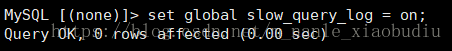
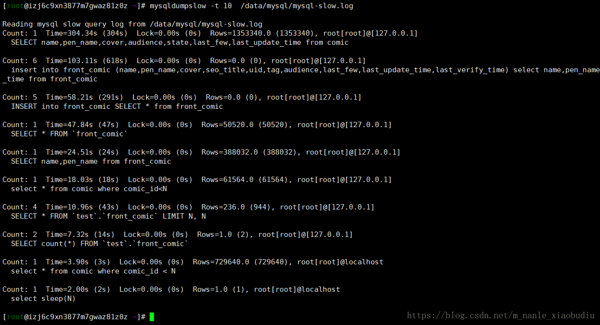
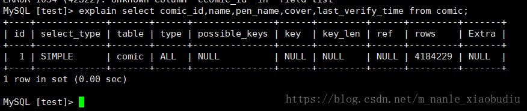
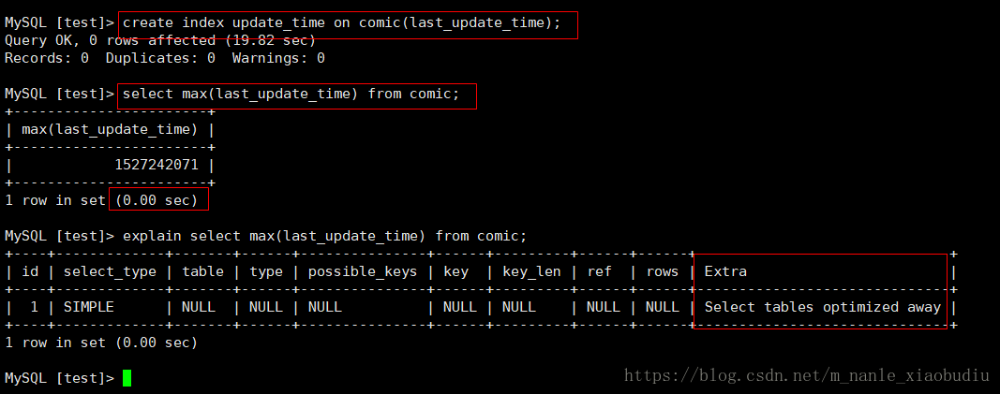

# 1 生成实验数据

原理：sql 蠕虫复制（这种生成数据方式同样适用于数据表中有主键的情况）。

> insert into comic (name,pen_name,cover) select name,pen_name,cover from comic

# 2 慢查询日志设置

当语句执行时间较长时，通过日志的方式进行记录，这种方式就是慢查询的日志。

### 2.1 临时开启慢查询日志

> set global slow_query_log = on; 

注：

如果想关闭慢查询日志，只需要执行 set global slow_query_log = off; 即可.

如果需要长时间开启，则需要更改mysql配置文件，第6点有介绍

 

### 2.2 临时设置慢查询时间临界点  

查询时间高于这个临界点的都会被记录到慢查询日志中（如果需要长时间开启，则需要更改mysql配置文件，第6点有介绍）。

> set long_query_time = 1;

现在起，所有执行时间超过1秒的sql都将被记录到慢查询文件中（我这里就是 /data/mysql/mysql-slow.log）。

 

### 2.3 设置慢查询存储的方式

> set globle log_output = file;

说明: 可以看到,我这里设置为了file,就是说我的慢查询日志是通过file体现的,默认是none,我们可以设置为table或者file,如果是table则慢查询信息会保存到mysql库下的slow_log表中

 

### 2.4 查询慢查询日志的开启状态和慢查询日志储存的位置

> show variables like '%quer%';

**参数说明:**

slow_query_log : 是否已经开启慢查询

slow_query_log_file : 慢查询日志文件路径

long_query_time :  超过多少秒的查询就写入日志 

log_queries_not_using_indexes 如果值设置为ON，则会记录所有没有利用索引的查询(性能优化时开启此项,平时不要开启)

 

### 2.5 使用慢查询日志示例

> cat -n  /data/mysql/mysql-slow.log

从慢查询日志中，我们可以看到每一条查询时间高于1s钟的sql语句，并可以看到执行的时间是多少。

比如上面，就表示 sql语句  select * from comic where comic_id < 1952000;  执行时间为3.902864秒，超出了我们设置的慢查询时间临界点1s，所以被记录下来了。

 

### 2.6 永久设置慢查询日志开启，以及设置慢查询日志时间临界点

linux中，mysql配置文件一般默认在 /etc/my.cnf

更改对应参数即可。

 

# 3 对慢查询日志进行分析

我们通过查看慢查询日志可以发现，很乱，数据量大的时候，可能一天会产生几个G的日志，根本没有办法去清晰明了的分析。所以，这里，我们采用工具进行分析。

### 3.1 使用mysqldumpslow进行分析

> mysqldumpslow -t 10  /data/mysql/mysql-slow.log  #显示出慢查询日志中最慢的10条sql

注：mysqldumpslow工具还有其他参数，以提供其他功能，这里，只以最基本的-t做了介绍。

 

### 3.2 使用pt-query-digest工具进行分析

mysqldumpslow是mysql安装后就自带的工具，用于分析慢查询日志，但是pt-query-digest却不是mysql自带的，如果想使用pt-query-digest进行慢查询日志的分析，则需要自己安装pt-query-digest。pt-query-digest工具相较于mysqldumpslow功能多一点。

##### 3.2.1 安装

yum install perl-DBI

yum install perl-DBD-MySQL

yum install perl-Time-HiRes

yum install perl-IO-Socket-SSL

wget percona.com/get/pt-query-digest

chmod u+x pt-query-digest 

mv pt-query-digest  /usr/bin/  

 

##### 3.2.2 查看具体参数作用

pt-query-digest --help

 

##### 3.2.3 使用

pt-query-digest  /data/mysql/mysql-slow.log

查询出来的结果分为三部分：

 第一部分：

显示出了日志的时间范围，以及总的sql数量和不同的sql数量。

第二部分：

显示出统计信息。

第三部分：

每一个sql具体的分析

- pct是percent的简写，表示占的百分比

- cout是占总sql个数的百分比
- exec time 是占总执行时间的百分比
- lock time 表示占总的锁表时间的百分比

 

##### **3.2.5 如何通过pt-query-digest 慢查询日志发现有问题的sql**

* **查询次数多且每次查询占用时间长的sql**

  通常为pt-query-digest分析的前几个查询

* IO消耗大的sql

  注意pt-query-digest分析中的Rows examine项

* **为命中索引的sql**

  注意pt-query-digest分析中Rows examine（扫描行数） 和 Rows sent （发送行数）的对比 ，如果扫描行数远远大于发送行数，则说明索引命中率并不高。

# 4 对sql进行优化

### 4.1 使用explain查询sql的执行计划

> explain select comic_id,name,pen_name,cover,last_verify_time from comic;

**参数分析：**

- table：表示属于哪张数据表

- type：最重要的参数，表示连接使用了何种类型。从最好到最差的连接类型为const，eq_reg，ref，range，index和ALL。

- possible_keys：显示可能应用在这张表中的索引。如果为null，则表示没有可能的索引。

- key：实际使用的索引。如果为null，则表示没有使用索引。

- key_len：使用的索引的长度，在不损失精确性的情况下，长度越短越好。

- ref：表示索引的哪一列被使用了，如果可能的话，是一个常数。

- rows：Mysql认为必须检查的用来返回请求数据的行数。 

### 4.2 count() 和 Max() 的优化方法

优化前，是没有为last_update_time字段建立索引的情况，查询最大的时间戳。

优化后，是为last_update_time字段建立索引的情况，查询最大的时间戳

> create index update_time on comic(last_update_time);

对比，可以看到，在没有为字段建立索引的情况下，查询时间是11秒多，建立索引之后，查询时间变成0秒了。

所以总结就是，**如果经常用于count和max操作的字段，可以为其添加索引。**

还有，值得注意的地方是：count() 计算时，count（*）会将这一列中的null值但也算进去，而count（comic_id）则不会将null算进去。

 

### 4.3 子查询的优化

通常情况下，需要把子查询优化为join查询，但在优化时要注意关联键是否有一对多的关系，如果有，是可能会出现重复数据的。所以如果存在一对多关系，则应该使用distinct进行限制。

例如：

> select t.id from t where t.id in (select k.kid from k);

优化成：

> select distinct t.id from t join k on t.id = k.kid;

原文链接：https://blog.csdn.net/m_nanle_xiaobudiu/article/details/79288257