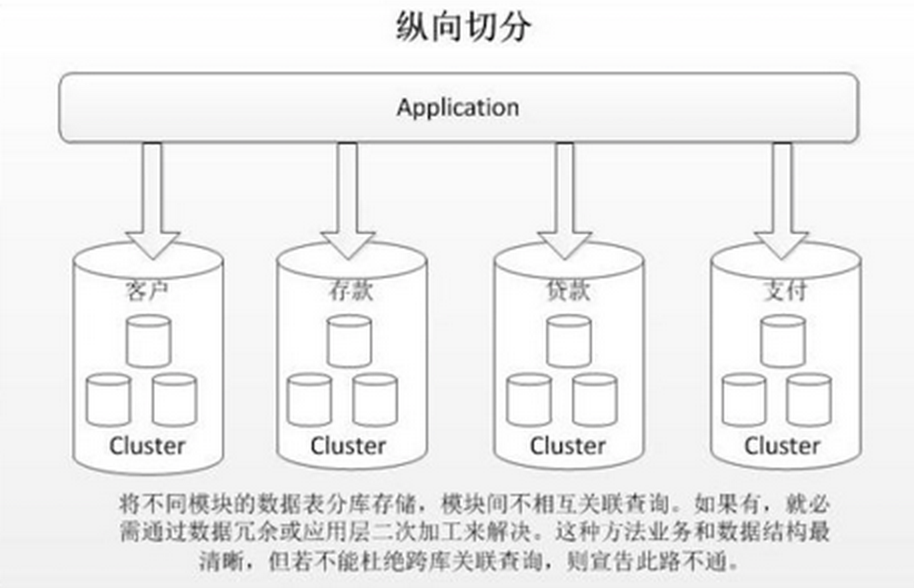
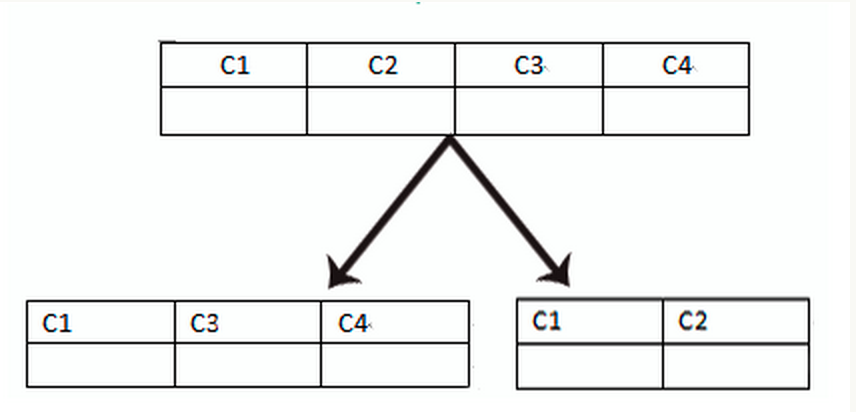

# 1 数据切分 

当MySQL单表记录数过大时，数据库的CRUD性能会明显下降，一些常见的优化措施有垂直切分，水平切分以及读写分离。

### 1.1 垂直切分

垂直切分常见有垂直分库和垂直分表两种。 

##### 1.1.1 垂直分库

垂直分库就是根据业务耦合性，将关联度低的不同表存储在不同的数据库。做法与大系统拆分为多个小系统类似，按业务分类进行独立划分。与"微服务治理"的做法相似，每个微服务使用单独的一个数据库。如图： 

##### 1.1.2 垂直分表

垂直分表是基于数据库中的"列"进行，某个表字段较多，可以新建一张扩展表，将不经常用或字段长度较大的字段拆分出去到扩展表中。在字段很多的情况下（例如一个大表有100多个字段，某些字段位blob或text属性），通过"大表拆小表"，更便于开发与维护，也能避免跨页问题，MySQL底层是通过数据页存储的，一条记录占用空间过大会导致跨页，造成额外的性能开销。另外数据库以行为单位将数据加载到内存中，这样表中字段长度较短且访问频率较高，内存能加载更多的数据，命中率更高，减少了磁盘IO，从而提升了数据库性能。 

**垂直切分的优点：**

- 解决业务系统层面的耦合，业务清晰
- 与微服务的治理类似，也能对不同业务的数据进行分级管理、维护、监控、扩展等
- 高并发场景下，垂直切分一定程度的提升IO、数据库连接数、单机硬件资源的瓶颈

**缺点：**

- 部分表无法join，只能通过接口聚合方式解决，提升了开发的复杂度
- 分布式事务处理复杂
- 依然存在单表数据量过大的问题（需要水平切分）

 

### 1.2 水平分区

水平切分分为库内分表和分库分表。每个表中只包含一部分数据，从而使得单个表的数据量变小，达到分布式的效果。 

库内分表只解决了单一表数据量过大的问题，但没有将表分布到不同机器的库上，因此对于减轻MySQL数据库的压力来说，帮助不是很大，大家还是竞争同一个物理机的CPU、内存、网络IO，**最好通过分库分表来解决。** 

##### 1.2.1 优缺点

水平切分的优点：

- 不存在单库数据量过大、高并发的性能瓶颈，提升系统稳定性和负载能力
- 应用端改造较小，不需要拆分业务模块

缺点：

- 跨分片的事务一致性难以保证
- 跨库的join关联查询性能较差
- 数据多次扩展难度和维护量极大

##### 1.2.2 切分规则

**1.根据数值范围**

按照时间区间或ID区间来切分。例如：按日期将不同月甚至是日的数据分散到不同的库中；将date为2018-1-1~2018-12-31的记录分到第一个库，2019-1-1~2020-12-31的分到第二个库，以此类推。某种意义上，某些系统中使用的"冷热数据分离"，将一些使用较少的历史数据迁移到其他库中，业务功能上只提供热点数据的查询，也是类似的实践。

这样的优点在于：

- 单表大小可控
- 天然便于水平扩展，后期如果想对整个分片集群扩容时，只需要添加节点即可，无需对其他分片的数据进行迁移
- 使用分片字段进行范围查找时，连续分片可快速定位分片进行快速查询，有效避免跨分片查询的问题。

缺点：

- 查找不均匀，热点数据成为性能瓶颈。连续分片可能存在数据热点，例如按时间字段分片，有些分片存储最近时间段内的数据，可能会被频繁的读写，而有些分片存储的历史数据，则很少被查询。

**2.根据数值取模**

一般采用hash取模mod的切分方式，例如：将 Customer 表根据 cusno 字段切分到4个库中，余数为0的放到第一个库，余数为1的放到第二个库，以此类推。这样同一个用户的数据会分散到同一个库中，如果查询条件带有cusno字段，则可明确定位到相应库去查询。

优点：

- 数据分片相对比较均匀，不容易出现热点和并发访问的瓶颈

缺点：

- 后期分片集群扩容时，需要迁移旧的数据（使用一致性hash算法能较好的避免这个问题）
- 容易面临跨分片查询的复杂问题。比如上例中，如果频繁用到的查询条件中不带cusno时，将会导致无法定位数据库，从而需要同时向4个库发起查询，再在内存中合并数据，取最小集返回给应用，分库反而成为拖累。

**3.一致性哈希（推荐）**

一致性哈希的算法简单而巧妙，很容易做到数据均分布，其单调性也保证了扩缩容的数据迁移是比较少的。 

### 1.3 2. 读/写分离

经典的数据库拆分方案，主库负责写，从库负责读；

### 1.4 分库分表带来的问题

##### 1.3.1 事务一致性问题

**分布式事务（隔离级别为可串行化）**

当更新内容同时分布在不同库中，不可避免会带来跨库事务问题。跨分片事务也是分布式事务，没有简单的方案，一般可使用"XA协议"和"两阶段提交"处理。

分布式事务能最大限度保证了数据库操作的原子性。但在提交事务时需要协调多个节点，推后了提交事务的时间点，延长了事务的执行时间。导致事务在访问共享资源时发生冲突或死锁的概率增高。随着数据库节点的增多，这种趋势会越来越严重，从而成为系统在数据库层面上水平扩展的枷锁。

**最终一致性**

对于那些性能要求很高，但对一致性要求不高的系统，往往不苛求系统的实时一致性，只要在允许的时间段内达到最终一致性即可，可采用事务补偿的方式。与事务在执行中发生错误后立即回滚的方式不同，事务补偿是一种事后检查补救的措施，一些常见的实现方法有：对数据进行对账检查，基于日志进行对比，定期同标准数据来源进行同步等等。事务补偿还要结合业务系统来考虑。

##### 1.3.2 跨节点关联查询 join 问题

考虑到性能，尽量避免使用join查询。 

切分之前，系统中很多列表和详情页所需的数据可以通过sql join来完成。而切分之后，数据可能分布在不同的节点上，此时join带来的问题就比较麻烦了，考虑到性能，尽量避免使用join查询。

解决这个问题的一些方法：

**1）全局表**

全局表，也可看做是"数据字典表"，就是系统中所有模块都可能依赖的一些表，为了避免跨库join查询，可以将这类表在每个数据库中都保存一份。这些数据通常很少会进行修改，所以也不担心一致性的问题。

**2）字段冗余**

一种典型的反范式设计，利用空间换时间，为了性能而避免join查询。例如：订单表保存userId时候，也将userName冗余保存一份，这样查询订单详情时就不需要再去查询"买家user表"了。

但这种方法适用场景也有限，比较适用于依赖字段比较少的情况。而冗余字段的数据一致性也较难保证，就像上面订单表的例子，买家修改了userName后，是否需要在历史订单中同步更新呢？这也要结合实际业务场景进行考虑。

**3）数据组装**

在系统层面，分两次查询，第一次查询的结果集中找出关联数据id，然后根据id发起第二次请求得到关联数据。最后将获得到的数据进行字段拼装。

**4）ER分片**

关系型数据库中，如果可以先确定表之间的关联关系，并将那些存在关联关系的表记录存放在同一个分片上，那么就能较好的避免跨分片join问题。在1:1或1:n的情况下，通常按照主表的ID主键切分。

##### 1.3.3 跨节点分页、排序、函数问题

跨节点多库进行查询时，会出现limit分页、order by排序等问题。

分页需要按照指定字段进行排序：

- 当排序字段就是分片字段时，通过分片规则就比较容易定位到指定的分片；
- 当排序字段非分片字段时，就变得比较复杂了。需要先在不同的分片节点中将数据进行排序并返回，然后将不同分片返回的结果集进行汇总和再次排序，最终返回给用户。

### 1.5 分库分表之后id 主键如何处理

因为要是分成多个表之后，每个表都是从 1 开始累加，这样是不对的，我们需要一个全局唯一的 id 来支持。

生成全局 id 有下面这几种方式：

- **UUID**：不适合作为主键，因为太长了，并且无序不可读，查询效率低。比较适合用于生成唯一的名字的标示比如文件的名字。
- **数据库自增 id** : 两台数据库分别设置不同步长，生成不重复ID的策略来实现高可用。这种方式生成的 id 有序，但是需要独立部署数据库实例，成本高，还会有性能瓶颈。
- **利用 redis 生成 id :** 性能比较好，灵活方便，不依赖于数据库。但是，引入了新的组件造成系统更加复杂，可用性降低，编码更加复杂，增加了系统成本。
- **Twitter的snowflake算法**
- **美团的Leaf分布式ID生成系统** ：Leaf 是美团开源的分布式ID生成器，能保证全局唯一性、趋势递增、单调递增、信息安全，里面也提到了几种分布式方案的对比，但也需要依赖关系数据库、Zookeeper等中间件。感觉还不错。

[推荐博客1][https://blog.csdn.net/qq_28289405/article/details/80576614]

[推荐博客2][https://www.cnblogs.com/butterfly100/p/9034281.html]

[][]

[面试题][https://blog.csdn.net/Iperishing/article/details/87552180]