[博客](https://blog.51cto.com/zhangfengzhe/2069971)

## 1 前言

数据库连接池的基本思想是：为数据库连接建立一个“缓冲池”，预先在池中放入一定数量的数据库连接管道，需要时，从池子中取出管道进行使用，操作完毕后，在将管道放入池子中，从而避免了频繁的向数据库申请资源，释放资源带来的性能损耗。在如今的分布式系统当中，系统的QPS瓶颈往往就在数据库，所以理解数据库连接池底层构造原理与设计思想是很有益处的。我们常用的数据库连接池有C3P0，DBCP，Druid等。

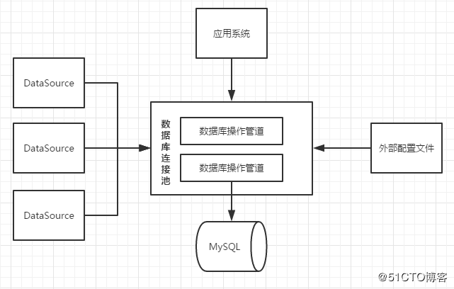

> 第一，数据库连接池中存放的就是数据库操作管道，不仅仅是存放，而且应该是管理这些管道；
>
> 第二，应该提供外部配置文件去初始化数据库连接池；
>
> 第三，如果一个数据库操作管道已经被占用，那么其他请求是否应该得到这个管道，也就是说我们要考虑多线程并发下，管道的分配问题；
>
> 第四，如果做到管道的复用？放回池子中，标示可用，并不是真正的关闭管道；

## 2 迷你版数据库连接池实现

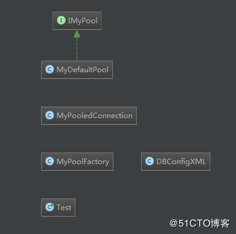

> IMyPool是一个接口，对外提供数据库连接池的基本服务，比如得到一个数据库操作管道。
>
> MyDefaultPool是IMyPool的实现。
>
> MyPooledConnection代表数据库操作管道，它可以执行SQL，关闭管道等。
>
> MyPoolFactory是一个工厂，单例模式，用于得到IMyPool实现。
>
> DBConfigXML代表外部配置文件。
>
> Test用于测试。

### 2.1 DBConfigXML

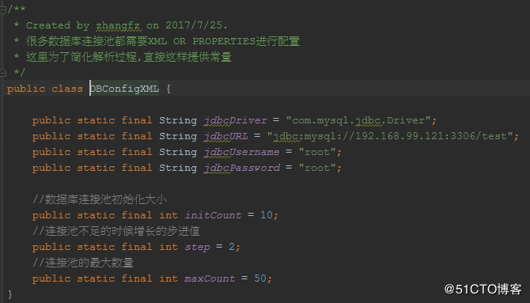

> 我们在实际中使用数据库连接池，需要在Spring的配置文件中，进行一些参数配置。这里，为了简化解析，直接提供。 

### 2.2 MyPooledConnection

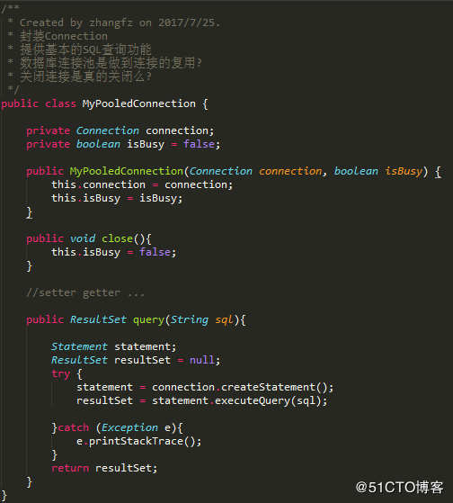

> 所谓数据库连接管道，就是对JDBC Connection进行封装而已，但是需要注意isBusy的这个标示。对管道的关闭，实际上只是标示的改变而已！ 

### 2.3 IMyPool

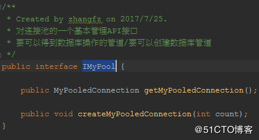

### 2.4 MyDefaultPool

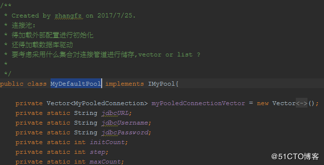

> 需要注意到是，MyDefaultPool持有一个管道集合，基于多线程的考虑，这里使用了Vector。 

### 2.5 MyDefaultPool需要初始化

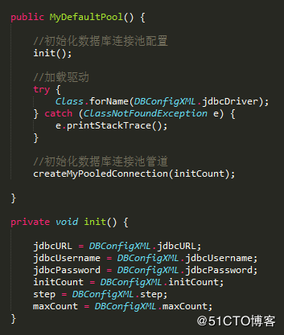

> 数据库连接池需要根据外部配置文件完成数据库驱动加载以及初始化管道的建立。 

### 2.6 createMyPooledConnection接口实现

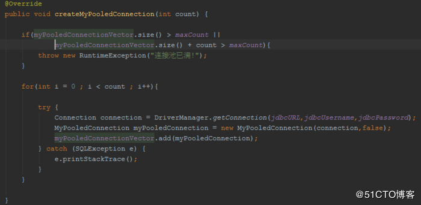

> 数据库连接池在创建管道时，应该去看一下是否达到上限，如果没有，则可以创建。
>
> 不仅仅要创建出来，还要标示每一个管道的isBusy标志。

### 2.7 getMyPooledConnection接口实现

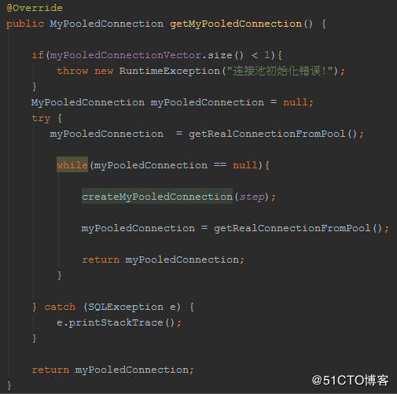

> 这里需要注意的是：如果得不到操作管道，需要去创建管道！

### 2.8 getRealConnectionFromPool

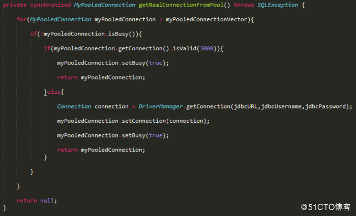

> 第一，这里使用了synchronized，就是为了避免多线程下产生问题。
>
> 第二，要知道Connection是有超时机制的，如果我们得到的管道的Connection已经超时了怎么办呢？
>
> 第三，得到管道后，一定注意isBusy的设置。

### 2.9 MyPoolFactory

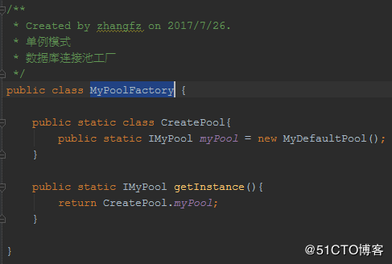

### 2.10 测试

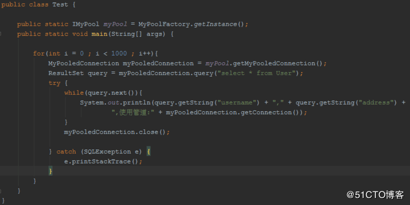

