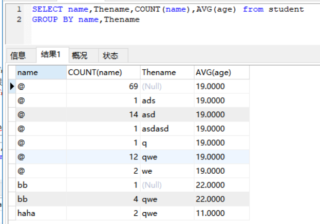
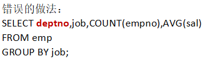
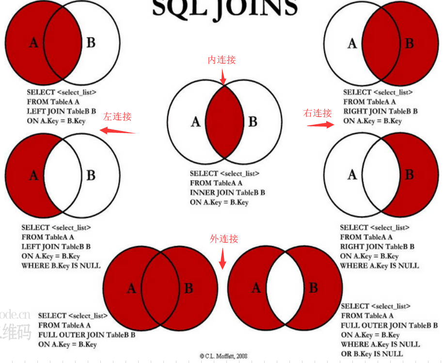

### 1 分组查询

##### 1.1 用例

根据name,Thename分组然后列出name，Thename，各组的数量以及平均年龄

##### 1.2 错误的查询方式

注：出现在select列表中的字段，如果出现的位置不是在组函数中，那么必须出现在group by子句中。

### 2 执行顺序

FROM

WHERE

GROUP BY

HAVING

SELECT

DISTINCT

UNION

ORDER BY

### 3 多表查询

隐式内连接看不到join

显式内连接看得到join

### 4 三大范式

目前[关系数据库](https://baike.baidu.com/item/%E5%85%B3%E7%B3%BB%E6%95%B0%E6%8D%AE%E5%BA%93/1237340)有六种范式：第一范式（1NF）、第二范式（2NF）、第三范式（3NF）、巴斯-科德范式（BCNF）、[第四范式](https://baike.baidu.com/item/%E7%AC%AC%E5%9B%9B%E8%8C%83%E5%BC%8F/3193985)(4NF）和[第五范式](https://baike.baidu.com/item/%E7%AC%AC%E4%BA%94%E8%8C%83%E5%BC%8F/5025271)（5NF，又称完美范式）。

而通常我们用的最多的就是第一范式（1NF）、第二范式（2NF）、第三范式（3NF），也就是本文要讲的“三大范式”。

##### 4.1 第一范式

**第一范式（1NF）：要求数据库表的每一列都是不可分割的原子数据项。**

举例说明：

在上面的表中，“家庭信息”和“学校信息”列均不满足原子性的要求，故不满足第一范式，调整如下：

可见，调整后的每一列都是不可再分的，因此满足第一范式（1NF）；

 

##### 4.2 第二范式

**第二范式（2NF）：在1NF的基础上，非码属性必须完全依赖于候选码（在1NF基础上消除非主属性对主码的部分函数依赖）**

**第二范式需要确保数据库表中的每一列都和主键相关，而不能只与主键的某一部分相关（主要针对联合主键而言）。**

举例说明：

在上图所示的情况中，同一个订单中可能包含不同的产品，因此主键必须是“订单号”和“产品号”联合组成，

但可以发现，产品数量、产品折扣、产品价格与“订单号”和“产品号”都相关，但是订单金额和订单时间仅与“订单号”相关，与“产品号”无关，

这样就不满足第二范式的要求，调整如下，需分成两个表：

   

 

##### 4.3 第三范式

**第三范式（3NF）：在2NF基础上，任何非主属性不依赖于其它非主属性（在2NF基础上消除传递依赖）**

**第三范式需要确保数据表中的每一列数据都和主键直接相关，而不能间接相关。**

举例说明：

上表中，所有属性都完全依赖于学号，所以满足第二范式，但是“班主任性别”和“班主任年龄”直接依赖的是“班主任姓名”，

而不是主键“学号”，所以需做如下调整：

  

这样以来，就满足了第三范式的要求。

参考博客：https://www.cnblogs.com/wsg25/p/9615100.html