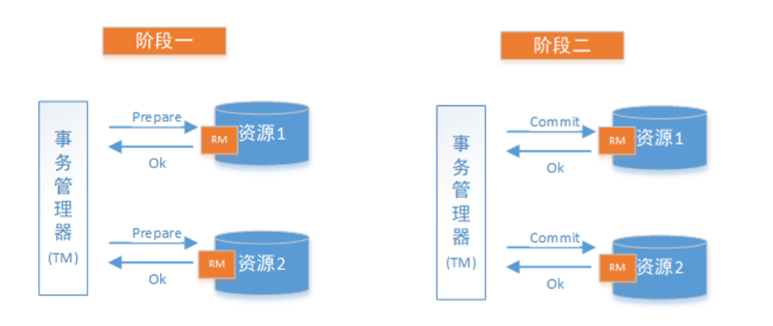
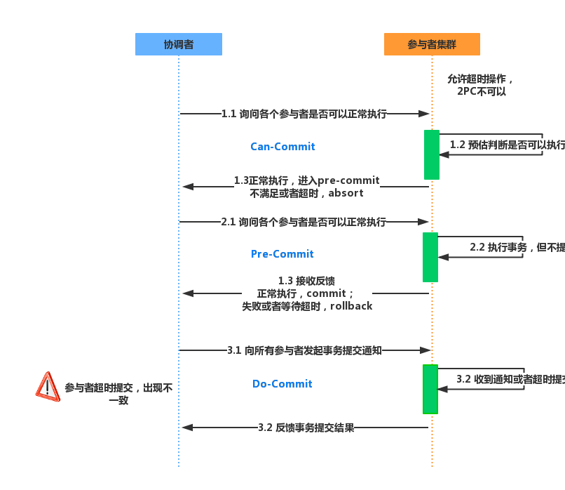

# 分布式事务

[博客](https://blog.csdn.net/oldshaui/article/details/88743085)

## CAP理论

* 一致性(Consistency)：服务A、B、C三个结点都存储了用户数据， 三个结点的数据需要保持同一时刻数据一致性。

* 可用性(Availability)：服务A、B、C三个结点，其中一个结点宕机不影响整个集群对外提供服务，如果只有服务A结点，当服务A宕机整个系统将无法提供服务，增加服务B、C是为了保证系统的可用性。

* 分区容忍性(Partition Tolerance)：分区容忍性就是允许系统通过网络协同工作，分区容忍性要解决由于网络分区导致数据的不完整及无法访问等问题。
  分布式系统不可避免的出现了多个系统通过网络协同工作的场景，结点之间难免会出现网络中断、网延延迟等现象，这种现象一旦出现就导致数据被分散在不同的结点上，这就是网络分区

## 分布式事务的解决方案

### 1 两阶段提交协议（2PC）

2PC即两阶段提交协议，P是指准备阶段，C是指提交阶段。

整个事务过程由事务管理器和参与者组成，事务管理器负责决策整个分布式事务的提交和回滚，事务参与者负责自己本地事务的提交和回滚。

在计算机中部分关系数据库如Oracle、MySQL支持两阶段提交协议，如下图：

1. 准备阶段（Prepare phase）：事务管理器给每个参与者发送Prepare消息，每个数据库参与者在本地执行事务，并写本地的Undo/Redo日志，此时事务没有提交。  （Undo日志是记录修改前的数据，用于数据库回滚，Redo日志是记录修改后的数据，用于提交事务后写入数 据文件）

2. 提交阶段（commit phase）：如果事务管理器收到了参与者的执行失败或者超时消息时，直接给每个参与者发送回滚(Rollback)消息；否则，发送提交(Commit)消息；参与者根据事务管理器的指令执行提交或者回滚操作，并释放事务处理过程中使用的锁资源。注意:必须在最后阶段释放锁资源。 下图展示了2PC的两个阶段，分成功和失败两个情况说明：

   **成功情况：**

   

   

   

**中断事务：**
 1、发送回滚请求
 2、各个参与者节点回滚事务
 3、反馈给协调者事务回滚结果
 4、协调者接受各参与者节点ack后回滚事务

**二阶段提交存在的问题：**

- 同步阻塞
  二阶段提交过程中，所有参与事务操作的节点处于同步阻塞状态，无法进行其他的操作
- 单点问题
  参与者会一直阻塞下去。尤其在第二阶段，协调者发生故障，那么所有的参与者还都处于锁定事务资源的状态中，而无法继续完成事务操作。（如果是协调者挂掉，可以重新选举一个协调者，但是无法解决因为协调者宕机导致的参与者处于阻塞状态的问题）
- 脑裂导致数据不一致
  如果分布式节点出现网络分区，某些参与者未收到commit提交命令。则出现部分参与者完成数据提交。未收到commit的命令的参与者则无法进行事务提交，整个分布式系统便出现了数据不一致性现象。

### 2 三阶段提交协议(3PC)

3PC是2PC的改进版，实质是将2PC中提交事务请求拆分为两步，形成了**CanCommit**、**PreCommit**、 **doCommit**三个阶段的事务一致性协议

**阶段一 : CanCommit**
 1、事务询问
 2、各参与者节点向协调者反馈事务询问的响应

 **阶段二 : PreCommit**
 根据阶段一的反馈结果分为两种情况

1. **执行事务预提交**
   1. 发送预提交请求
      协调者向所有参与者节点发送preCommit请求，进入prepared阶段
   2. 事务预提交
      各参与者节点接受到preCommit请求后，执行事务操作
   3. 各参与者节点向协调者反馈事务执行
2. **中断事务**
   任意一个参与者节点反馈给协调者**响应No**时，或者在**等待超时**（**协调者等待参与者**）后，协调者还未收到参与者的反馈，就中断事务，中断事务分为两步：
   1）协调者向各个参与者节点发送abort请求
   2）参与者收到abort请求，或者等待超时时间后，中断事务(**参与者等待协调者**)

**阶段三 : doCommit**
 1、执行提交

- 发送提交请求
  协调者向所有参与者节点发送doCommit请求
- 事务提交
  各参与者节点接受到doCommit请求后，执行事务提交操作
- 反馈事务提交结果
- 事务完成
  协调者接受各个参与者反馈的ack后，完成事务

2、中断事务

1. 参与者接受到abort请求后，执行事务回滚
2. 参与者完成事务回滚以后，向协调者发送ack
3. 协调者接受回滚ack后，回滚事务

**3PC相较于2PC而言，解决了协调者挂点后参与者无限阻塞和单点问题，但是仍然无法解决网络分区问题**

### 3 事务补偿（TCC）

TCC型事务（Try/Confirm/Cancel）可以归为补偿型。补偿型的例子，在一个长事务（ long-running ）中 ，一个由两台服务器一起参与的事务，服务器A发起事务，服务器B参与事务，B的事务需要人工参与，所以处理时间可能很长。如果按照ACID的原则，要保持事务的隔离性、一致性，服务器A中发起的事务中使用到的事务资源将会被锁定，不允许其他应用访问到事务过程中的中间结果，直到整个事务被提交或者回滚。这就造成事务A中的资源被长时间锁定，系统的可用性将不可接受。

WS-BusinessActivity提供了一种基于补偿的long-running的事务处理模型。还是上面的例子，服务器A的事务如果执行顺利，那么事务A就先行提交，如果事务B也执行顺利，则事务B也提交，整个事务就算完成。但是如果事务B执行失败，事务B本身回滚，这时事务A已经被提交，所以需要执行一个补偿操作，将已经提交的事务A执行的操作作反操作，恢复到未执行前事务A的状态。这样的SAGA事务模型，是牺牲了一定的隔离性和一致性的，但是提高了long-running事务的可用性

### 4 消息队列实现最终一致

> 队列生产与消费的流程

如果消息队列不支持事务消息，那么我们的解决方案是，新增一张message表，并开启一个定时任务扫描这张message表，将所有状态为prepared的message发送给消息队列，发送成功后，将message状态置为confirmed。

1、Producer生成消息并发送给MQ（同步/异步）

2、MQ接受消息并将消息持久化(持久化为可选操作配置)

3、MQ向生产者返回消息的接受结果（确认/返回值/异常）

4、Consumer监听MQ中的消息

5、Consumer获取到消息执行相应的业务逻辑

6、Consumer进行消费后，对成功消费的消息向MQ进行确认(ACK)

7、MQ得到ACK确认后将消息从MQ中移除

 

> 出现异常的处理方式

每一步都有可能异常或者出现意外，比如在插入到数据库中出现异常、发送到MQ中途异常、MQ接受消息后返回确认时异常、MQ向消费者投递消息异常、消费者消费消息后向MQ进行ACK确认时异常等。每一步的异常都要进行相应的处理，不然就有可能导致脏数据。

插入到数据库中出现异常：当product插入到数据库异常，这一步还没到MQ，直接回滚。本地消息表的作用在于不过度依赖MQ，MQ中途也有可能挂掉。

- 发送到MQ中途异常：轮训本地消息表对没有发送到MQ的消息进行重发

- MQ接受消息后返回确认时异常:和上步一样,重发到MQ，等MQ给确认收到更改本地消息

- MQ向消费者投递消息异常:MQ会进行重试向消费者投递消息，只要消费者没有给MQ ACK确认，MQ就会进行重试，重试配置可根据实际业务配置

- 消费者消费消息后向MQ进行ACK确认时异常:和上步相同，MQ没收到ACK确认还是会重发

- MQ重发时，在消费者需要进行幂等设计处理，防止脏数据

- 对于本地消息表，可以抽离出来做成消息服务系统，毕竟不只是一个服务在使用，抽离出来可以作为共用
  

