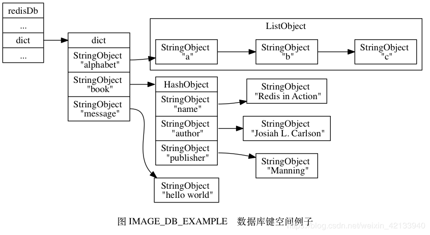

Redis 数据库里面的每个键值对 ( key-value pair ) 都是由对象 ( object ) 组成的，其中：

数据库键总是一个字符串对象 ( string object ) ;

而数据库键的值则可以是字符串对象、列表对象 ( list object )、哈希对象 ( hash object )、集合对象 ( set object )、有序集合对象 ( sorted set object ) 这五种对象中的其中一种。


# 1 简单动态字符串

### 1.1 SDS结构

SDS会记录字符串长度，使用了的长度以及空间长度。

```
typedef char *sds;

struct sdshdr {
        // 记录 buf 数组中已使用字节的数量
        // 等于 SDS 所保存字符串的长度
        int len;
        // 记录 buf 数组中未使用字节的数量
        int free;
        // 字节数组，用于保存字符串
        char buf[];
};
```

SDS也是以'\0'表示结束, 这一个字节不会计入已使用的长度. 这样做的好处是可以重用C字符串函数库里面的一部分函数. 


# 1.2 C字符串&SDS区别

| C 字符串                                             | SDS                                                  |
| ---------------------------------------------------- | ---------------------------------------------------- |
| 获取字符串长度的复杂度为 O(N) 。                     | 获取字符串长度的复杂度为 O(1) 。                     |
| API 是不安全的，可能会造成缓冲区溢出。               | API 是安全的，不会造成缓冲区溢出。                   |
| 修改字符串长度 `N` 次必然需要执行 `N` 次内存重分配。 | 修改字符串长度 `N` 次最多需要执行 `N` 次内存重分配。 |
| 只能保存文本数据。                                   | 可以保存文本或者二进制数据。                         |
| 可以使用所有 `<string.h>` 库中的函数。               | 可以使用一部分 `<string.h>` 库中的函数。             |

SDS优点：

1. 常数复杂度获取字符串长度
2. 杜绝缓冲区溢出
3. 减少修改字符串长度时所需的内存重分配次数
4. 二进制安全
5. 兼容部分 C 字符串函数


# 2 哈希算法

当要将一个新的键值对添加到字典里面时，程序需要先根据键值对的键计算出哈希值和索引值，然后再根据索引值，将包含新键值对的哈希表节点放到哈希表数组的指定索引上面。

Redis使用MurmurHash算法来计算键的哈希值，这种算法的优点在于，即使输入的键是有规律的，算法仍能给出一个很好的随机分布性，并且算法的计算速度也非常快。


# 3 解决键冲突

当有两个或以上数量的键被分配到了哈希表数组的同一个索引上面时，称这些键发生了冲突。Redis的哈希表使用**链地址法**来解决键冲突，每个哈希表节点都有一个next指针，多个哈希表节点可以用next指针构成一个单向链表，被分配到同一个索引上的多个节点可以用这个单向链表连接起来，以此解决键冲突的问题。

因为dictEntry节点组成的链表没有指向链表表尾的指针，所以为了速度考虑，程序总是将新节点添加到链表的表头位置（复杂度为O（1）），排在其他已有节点的前面。


# 4 对象

Redis并没有直接使用简单动态字符串（SDS）、双端链表、字典、压缩列表、整数集合这些数据结构来实现键值对数据库，而是基于这些数据结构创建了一个对象系统，这个系统包含字符串对象、列表对象、哈希对象、集合对象和有序集合对象这五种类型的对象，每种对象都用到了至少一种如上的数据结构。 

用例：

>redis> SET message "hello world"
>OK
>
>redis> RPUSH alphabet "a" "b" "c"
>(integer) 3
>
>redis> HSET book name "Redis in Action"
>(integer) 1
>
>redis> HSET book author "Josiah L. Carlson"
>(integer) 1
>
>redis> HSET book publisher "Manning"
>(integer) 1

那么在这些命令执行之后， 数据库的键空间如下：



- alphabet 是一个列表键，存列表。
- book 是一个哈希表键，存哈希值。
- message 是一个字符串键，存字符串。


# 5 Redis设置键的生存时间或过期时间

### 5.1 设置键的过期时间

Redis可以通过EXPIRE、PEXPIRE、EXPIREAT、PEXPIREAT对键设置有效期，使用TTL或者PTTL查看键的有效期，-1表示键是永久的，PERSIST可以移除一个键的过期时间。


### 5.2 过期键的判定

REDIS使用一个过期字典来保存键的过期时间，通过过期字典，程序可以用以下步骤判断键是否过期：
 （1）检查给定键是否存在过期字典：如果存在，那么取得键的过期时间
 （2）检查当前UNIX时间戳是否大于键的过期时间：如果是，则过期


### 5.3 过期键删除策略

#####  5.3.1 定时删除

 在设置键的过期时间的同时，创建一个定时器，让定时器在键的过期时间来临时，立即执行对键的删除操作。
 **优点**：

通过使用定时器，可以保证过期键会尽可能快的被删除，被释放过期键所占用的内存。

 **缺点**：

①对CPU时间是最不友好的：在过期键比较多的情况下，删除过期键这一行为会占用很多的CPU时间，在内存不紧张但是CPU紧张的情况下，这种策略反而会对服务器的响应时间和吞吐量造成影响。

②创建一个定时器需要用到Redis服务器中的时间事件 ——redis中是使用无序链表实现的，查找一个事件的时间复杂度为O（N）,并不能高效的处理大量时间事件。


##### 5.3.2 惰性删除

 放任键过期不管，但是每次从键空间中获取键时，都检查取得的键是否过期，如果过期的话，就删除该键。
 **优点**：对CPU友好
 **缺点**：如果一个键已经过期，而这个键又仍然保留在数据库中，那么只要这个过期键不被删除，所占用的内存就不会释放。过期且长期不使用的键可以看成一种内存泄漏。


##### 5.3.3 定期删除

 每隔一段时间进行一次检查，删除里面的过期键。定期删除是前两种方案的一种折中。
 **难点**：确定删除操作执行的时长和频率。


 Redis中使用的删除策略**是惰性删除和定期删除**.

 

 

### 5.4 RDB、AOF和复制功能对过期键的处理

##### 5.4.1 RDB

1.生成RDB文件：执行SAVE或者BGSAVE命令时，已过期的键不会被写入RDB文件。

2.载入RDB文件：

* 如果服务器以主服务器模型运行， 程序会对文件中保存的键进行检查，过期的键**不会**被载入到数据库中。
* 如果服务器以从服务器模式运行，不论文件中保存的键是否过期，都会被载入到数据库中。不过因为主从服务器在进行同步的时候，从服务器的数据库会被清空，所以过期键对RDB载入的服务器也不会造成影响。


##### 5.4.2 AOF

1.AOF文件写入：当服务器以AOF持久化模式运行时，如果某个键已经过期，但是还没有被惰性删除或者定时删除时，不会对AOF文件产生任何影响。当过期键被惰性删除或者定时删除后，向AOF文件中追加（append）一条DEL命令。

2.AOF文件重写：在执行AOF文件的过程中，程序会对数据库中的键进行检查，已过期的键不会被保存到重写后的AOF文件中。


##### 5.4.3 复制模式下

当服务器运行在复制模式下时，从服务器的过期键删除动作由主服务器控制：
 ①**主服务器**在删除一个过期键之后会想从服务器发送一个DEL命令
 ②**从服务器**在执行读命令时，即使碰到过期键也不会将过期键删除，而是继续像处理未过期的键一样处理过期键
 ③**从服务器**只有接收到主服务器的DEL命令时才会删除过期键。


 

 

 

 

 

 

 