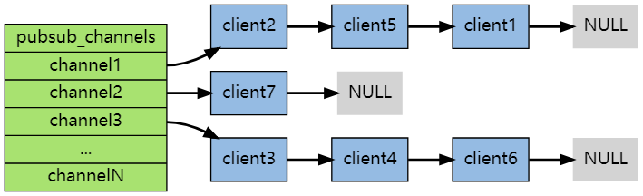
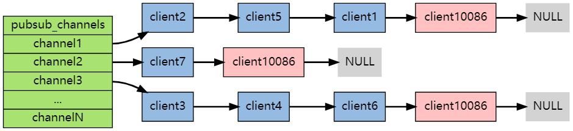
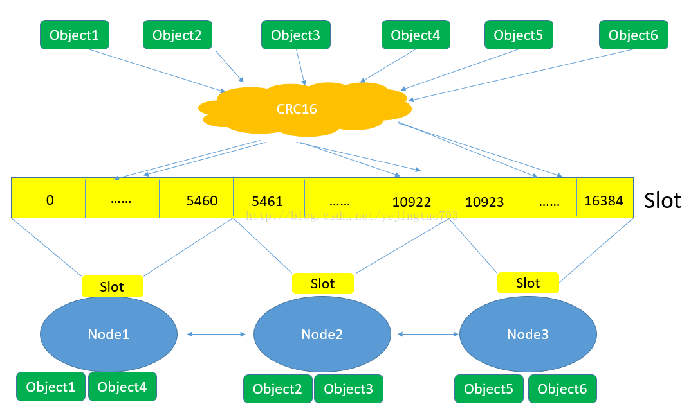
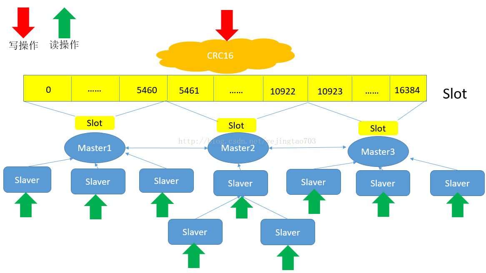

# **1 哨兵工作原理**

[博客](https://www.jianshu.com/p/06ab9daf921d)

首先进行监控，并且所有的哨兵同步信息。

哨兵向订阅里边发布信息。

故障转移：哨兵发现主节点下线→哨兵开启投票竞选负责人→由负责人推选新的主节点→新的主节点断开原主节点，并且其他的从节点连接新的主节点，原主节点上线后作为从节点连接


## 1.1 监控工作流程

①哨兵发送 info 指令，并且保存所有哨兵状态，主节点和从节点的信息。

②主节点会记录 redis 实例的信息，主节点记录的信息跟哨兵记录的信息看起来是一样的，实际上还是有点区别。

③哨兵会根据在主节点拿到的从节点信息，给对应的从节点也发送 info 指令。

④接着哨兵 2 来了，同样的也会给主节点发送 info 指令，并且建立 cmd 连接。

⑤这个时候哨兵 2 也会保存跟哨兵 1 一样的信息，只不过是保存的哨兵信息是 2 个。

⑥这个时候为了每个哨兵的信息都一致它们之间建立了一个发布订阅。为了哨兵之间的信息长期对称它们之间也会互发 ping 命令。

⑦当再来一个哨兵 3 时，也会做同样的事情，给主节点和从节点发送 info。并且跟哨兵 1 和哨兵 2 建立连接。


## **1.2 通知工作流程**

sentinel 会给主从的所有节点发送命令获取其状态，并且会把信息发布到哨兵的订阅里。


## **1.3 故障转移原理**

### 1.3.1 主观下线&客观下线

哨兵会一直给主节点发送 publish sentinel：hello，直到哨兵报出 sdown.哨兵报出主节点 sdown 后还没有完，哨兵还会往内网里发布消息说明这个主节点挂了。发送的指令是 sentinel is-master-down-by-address-port。

其余的哨兵接收到指令后，主节点挂了吗?让我去看看到底挂没挂。发送的信息也是 hello。

其余的哨兵也会发送他们收到的信息并且发送指令 sentinel is-master-down-by-address-port 到自己的内网，确认一下第一个发送 sentinel is-master-down-by-address-port 的哨兵说你说的对，这个家伙确实挂了。

当所有人都认为主节点挂了后就会修改其状态为 odown。当一个哨兵认为主节点挂了标记的是 sdown，当半数哨兵都认为挂了其标记的状态是 odown。**这也就是配置哨兵为什么配置单数的原因。**

对于一个哨兵认为主节点挂了称之为主观下线，半数哨兵认为主节点挂了称之为客观下线。


### 1.3.2 选取领头哨兵

一旦被认为主节点客官下线后，哨兵就会进行下一步操作：

这个时候，五个 sentinel 就在一起开会了，所有的哨兵会同时发送指令 sentinel is-master-down-by-address-port 并且携带上自己竞选次数和 runid。

每个 sentinel 既是参选者也是投票者，每个 sentinel 都有一票，信封就代表自己的投票权。

当 sentinel1 和 sentinel4 同时把指令发送到群里准备竞选时，sentinel2 这个时候就说我先接到谁的指令就把票投给谁。

按照这样的规则一直发起投票直到有一个 sentinel 的票数为总 sentinel 数量的一半之多就会当选。


### 1.3.3 领头哨兵选取主节点

1. 删除列表中处于下线状态的从服务
2. 删除最近5秒没有回复过领头sentinel info信息的从服务（响应慢的）
3. 删除与已下线的主服务断开连接时间超过 down-after-milliseconds*10毫秒的从服务，这样就能保留从的数据比较新（与原主节点断开时间久的）
4. 领头sentinel从剩下的从列表中选择优先级高的，如果优先级一样，选择偏移量最大的（偏移量大说明复制的数据比较新），如果偏移量一样，选择runid最小的从服务，也就说根据 runid 的创建时间来判断，时间早的上位

 挑选出新的主服务之后，领头sentinel 向原主服务的从服务发送 slaveof 新主服务的命令，复制新master


# 2 发布订阅

## **2.1 subscribe**

```
说明：每个 Redis 服务器进程都维持着一个表示服务器状态的 redis.h/redisServer 结构， 结构的 pubsub_channels 属性是一个字典， 这个字典就用于保存订阅频道的信息，其中，字典的键为正在被订阅的频道， 而字典的值则是一个链表， 链表中保存了所有订阅这个频道的客户端。

例子示意图：在下图展示的这个 pubsub_channels 示例中， client2 、 client5 和 client1 就订阅了 channel1 ， 而其他频道也分别被别的客户端所订阅。
```




```
操作：当客户端调用 SUBSCRIBE 命令时， 程序就将客户端和要订阅的频道在 pubsub_channels 字典中关联起来。

示意图：如果客户端 client10086 执行命令 SUBSCRIBE channel1 channel2 channel3 ，那么前面展示的 pubsub_channels 将变成下面这个样子，通过遍历所有输入频道。
```




## 2.2 publish

```
原理说明：当调用 PUBLISH channel message 命令， 程序首先根据 channel 定位到字典的键， 然后将信息发送给字典值链表中的所有客户端。

例子示意图：对于以下这个 pubsub_channels 实例， 如果某个客户端执行命令 PUBLISH channel1 "hello moto" ，那么 client2 、 client5 和 client1 三个客户端都将接收到 "hello moto" 信息，通过遍历订阅频道的所有客户端。
```


## 2.3 psubscribe

可以根据通配符批量订阅频道


# 3 Redis集群设计原理

[博客](https://blog.csdn.net/yejingtao703/article/details/78484151?utm_medium=distribute.pc_relevant.none-task-blog-BlogCommendFromMachineLearnPai2-2.compare&depth_1-utm_source=distribute.pc_relevant.none-task-blog-BlogCommendFromMachineLearnPai2-2.compare)

## 3.1 Master节点&从节点

只有1个Master，可以有N个slaver，而且Slaver也可以有自己的Slaver，由于这种主从的关系决定他们是在配置阶段就要指定他们的上下级关系，而不是Zookeeper那种平行关系是自主推优出来的。

1. 读写分离，Master只负责写和同步数据给Slaver，Slaver承担了被读的任务，所以Slaver的扩容只能提高读效率不能提高写效率。

2. Slaver先将Master那边获取到的信息压入磁盘，再load进内存，client端是从内存中读取信息的，所以Redis是内存数据库。

3. 当一个新的Slaver加入到这个集群时，会主动找Master来拜码头，Master发现新的小弟后将全量数据发送给新的Slaver，数据量越大性能消耗也就越大，所以尽量避免在运行时做Slaver的扩容。


> 简单总结下主从模式的设计

优点：读写分离，通过增加Slaver可以提高并发读的能力。

缺点：Master写能力是瓶颈。

  虽然理论上对Slaver没有限制但是维护Slaver开销总将会变成瓶颈。

  Master的Disk大小也将会成为整个Redis集群存储容量的瓶颈。


## 3.2 哈希*Slot*




1. 对象保存到Redis之前先经过CRC16哈希到一个指定的Node上，例如Object4最终Hash到了Node1上。

2. 每个Node被平均分配了一个Slot段，对应着0-16384，Slot不能重复也不能缺失，否则会导致对象重复存储或无法存储。

3. Node之间也互相监听，一旦有Node退出或者加入，会按照Slot为单位做数据的迁移。例如Node1如果掉线了，0-5640这些Slot将会平均分摊到Node2和Node3上,由于Node2和Node3本身维护的Slot还会在自己身上不会被重新分配，所以迁移过程中不会影响到5641-16384Slot段的使用。

**简单总结下哈希Slot的优缺点：**

- 缺点：每个Node承担着互相监听、高并发数据写入、高并发数据读出，工作任务繁重

- 优点：将Redis的写操作分摊到了多个节点上，提高写的并发能力，扩容简单。




看到这里大家也就发现了，主从和哈希的设计优缺点正好是相互弥补的，将图一每一套主从对应到图二中的每一个*Node*，就是*Redis*集群的终极形态，先*Hash*分逻辑节点，然后每个逻辑节点内部是主从，如图：

想扩展并发读就添加*Slaver*，想扩展并发写就添加*Master*，想扩容也就是添加*Master*，任何一个*Slaver*或者几个*Master*挂了都不会是灾难性的故障。


