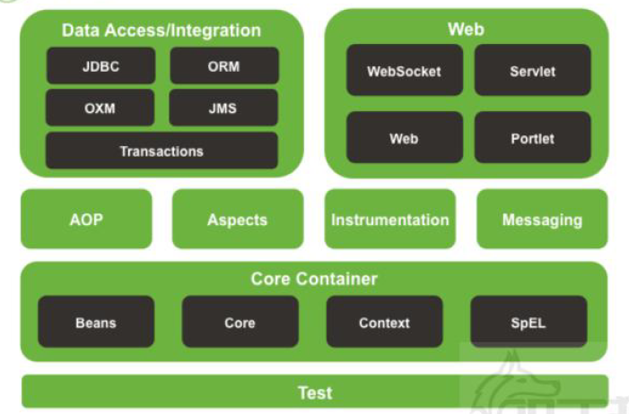
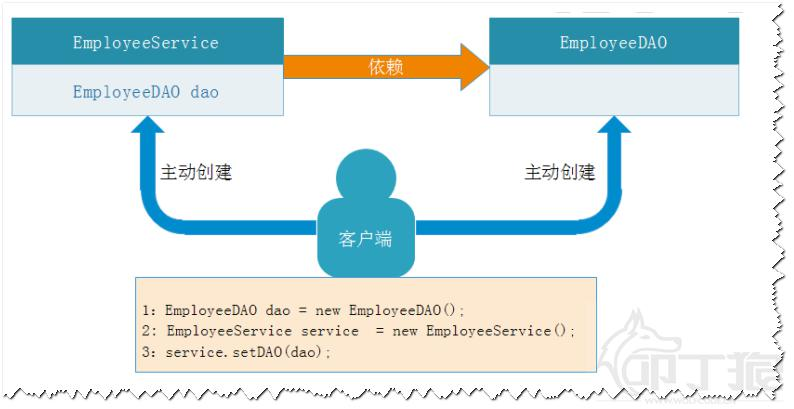

# 1 为什么要有Spring

### 1.1 传统代码的问题 

* 代码耦合度比较高

```java
public class EmployeeServiceImpl implements IEmployeeService {
private IEmployeeDAO dao;
public EmployeeServiceImpl() {
//创建依赖对象
dao = new EmployeeDAOJdbcImpl();
}
public void save() {
//TODO
}
}
```

此时如果把IEmployeeDAO 的实现类换成EmployeeDAOMyBatisImpl ， 此时需要修改EmployeeServiceImpl 的源代码，不符合开闭原则。

> 开闭原则：对于扩展是开放的，对于修改是关闭的。

* 循环依赖问题：

  如在创建A 类时，构造器需要B 类，那将去创建B，在创建B 类时又发现需要C 类，则又去创建C，最终在创建C 时发现又需要A；从而形成一个环。

* 控制事务繁琐
* 第三方框架运用太麻烦


### 1.2 什么是spring

Spring 是一个轻量级的DI/IoC 和AOP 容器的开源框架，致力于构建致力于构建轻量级的JavaEE应用，简化应用开发，本身涵盖了传统应用开发，还拓展到移动端，大数据等领域。

> 什么是容器（Container）：从程序设计角度看就是装对象的的对象，因为存在放入、拿出等操作，所以容
> 器还要管理对象的生命周期，如Tomcat 就是Servlet 和JSP 的容器。


Spring 提供了Java EE 每一层的解决方案，所以我们也说Spring 是Java EE 的全栈式（full stack）框架。


优势：

1. Spring 能帮我们低侵入/低耦合地**根据配置文件创建及组装对象之间的依赖关系**。
2. Spring 面向**切面编程**能帮助我们**无耦合的实现日志记录，性能统计，安全控制**等。
3. Spring 能非常简单的且强大的**声明式事务管理**。
4. Spring 提供了**与第三方数据访问框架（如Hibernate、JPA）无缝集成**，且自己也提供了一套JDBC模板来方便数据库访问。

5. Spring 提供**与第三方Web（如Struts1/2、JSF）框架无缝集成**，且自己也提供了一套Spring MVC框架，来方便Web 层搭建。
6. Spring 能方便的**与如Java Mail、任务调度、缓存框架等技术整合**，降低开发难度。


framework：




### 1.3 Spring测试框架

/Marie(2019)/programming/08%E6%80%BB%E7%AC%94%E8%AE%B0/Spring/assets/1.5.jpg)

传统测试存在的问题：

1. 每个测试都要重新启动Spring，启动容器的开销大，测试效率低下。
2. 不应该是测试代码管理Spring 容器，应该是Spring 容器在管理测试代码。
3. 不能正常的关闭Spring 容器，Spring 容器生命周期非正常退出。

**Spring测试框架：基于jUnit4 的测试**

```java
@RunWith(SpringJUnit4ClassRunner.class)
@ContextConfiguration("classpath:springTest.xml")
public class SpringTestTest {
	//从Spring IoC 容器中根据类型找到对应的bean 并自动注入到某个字段上
	@Autowired
	private HelloWorld world;
	@Test
	public void test1() throws Exception {
		world.sayHello();
	}
}
```

若把@ContextConfiguration("classpath:springTest.xml") 写成@ContextConfiguration
默认去找的当前测试类名-context.xml 配置文件,如:SpringTestTest-context.xml


**Spring测试框架：基于jUnit5的测试：**

```java
@SpringJUnitConfig
public class SpringTestTest {
	@Autowired
	private HelloWorld world;
    
	@Test
	void test1() throws Exception {
		world.sayHello();
	}
}

```


# 2 IOC

IoC：Inversion of Control（控制反转），不是什么新技术，而是一种设计思想，好比于MVC。

DI：Dependency Injection（依赖注入），指将对象的创建权，反转给了Spring 容器，即将对象依赖属性（常量，对象，集合）通过配置设值给该对象。

### 2.1 IOC创建对象

**传统方式创建对象：**




**使用Spring创建对象：**

反控：调用者只管负责从Spring 容器中获取需要使用的对象，不关心对象的创建过程，也不关心该对象依
赖对象的创建以及依赖关系的组装，也就是把创建对象的控制权反转给了Spring 框架。


### 2.2 创建Bean的三种方式

被Spring IoC 容器管理的对象称之为bean。

元数据的配置有三种方式：

-  XML-based configuration
-  Annotation-based configuration
-  Java-based configuration


##### 2.2.1 IOC管理bean原理

1.通过Resource 对象加载配置文件
2.解析配置文件，得到指定名称的bean
3.解析bean 元素，id 作为bean 的名字，class 用于反射得到bean 的实例：
注意：此时，bean 类必须存在一个无参数构造器(和访问权限无关)；
4.调用getBean 方法的时候，从容器中返回对象实例；


三种创建bean的方式：

```java
	@Test
	void testSpring() throws Exception {
		HelloWorld world = null;
		Resource resource =  new ClassPathResource("applicationContext.xml");
		BeanFactory factory = new XmlBeanFactory(resource);
		//world = (HelloWorld) factory.getBean("helloWorld");
		//world = factory.getBean(HelloWorld.class);
		world = factory.getBean("helloWorld", HelloWorld.class);//推荐
		world.sayHello();
	}
```


##### 2.2.2 import

```java
<import resource="classpath:cn/wolfcode/day1/_02_hello/hello.xml"/>
```

注意：

1. 默认情况下，从classpath 的跟路径寻找。

2. 可以使用前缀来定位文件的基础位置：

   ①：[classpath:]：后面的文件从classpath 路径开始找(推荐)；
   ②：[file:]：后面的文件使用文件系统的路径开始找；

注意：只有当框架中实现了Resource 接口才能够识别上述的前缀标识符。


# 3 IOC（基于XML）

### 3.1 BeanFactory 

BeanFactory：Spring 最底层的接口，只提供了的IoC 功能，负责创建、组装、管理bean，在应用中，一般不使用BeanFactory，而推荐使用ApplicationContext（应用上下文）。


### 3.2 ApplicationContext  

ApplicationContext 接口继承了BeanFactory，除此之外还提供AOP 集成、国际化处理、事件传播、统一资源价值等功能。

```java
public interface ApplicationContext extends EnvironmentCapable, ListableBeanFactory,
HierarchicalBeanFactory,MessageSource, ApplicationEventPublisher, ResourcePatternResolver {
}
```


### 3.3 bean 的创建时机

1、BeanFactory 需要等到获取某一个bean 的时候才会创建该bean--延迟初始化。
2、ApplicationContext 在启动Spring 容器的时候就会创建所有的bean（Web 应用建议）。

**BeanFactory:（不使用Spring Test）**

```java
@Test
void testBeanFactory() throws Exception {
Resource resource =
new ClassPathResource("cn/wolfcode/day1/_04_container/ContainerTest-context.xml");
BeanFactory factory = new XmlBeanFactory(resource);
System.out.println("--------before --------");
factory.getBean("someBean", SomeBean.class);//开始创建bean
System.out.println("--------after --------");
}
```

输出结果：

```
--------before --------
创建SomeBean 对象
```


**ApplicationContext：（不使用Spring Test）**

```java
@Test
void testBeanApplicationContext() throws Exception {
    ApplicationContext ctx = new
ClassPathXmlApplicationContext("cn/wolfcode/day1/_04_container/ContainerTest-context.xml");//已创建好所有bean
System.out.println("--------before --------");
ctx.getBean("someBean", SomeBean.class);
System.out.println("--------after --------");
}
```

输出结果：

```
创建SomeBean 对象
--------before --------
--------after --------
```


**使用Spring Test：BeanFactory和ApplicationContext的方式配置Spring**

```java
@SpringJUnitConfig

public class ContainerTest {

	@Autowired

	private BeanFactory factory;

	@Autowired

	private ApplicationContext ctx;

}

```


延迟初始化配置：

针对于当前xml 中所有的bean。
<beans default-lazy-init="default | false | true">
针对于指定的bean:
<bean lazy-init="default | false | true">


### 3.4 Bean 实例化方式

1. 构造器实例化（无参数构造器），最标准，使用最多。

2. 静态工厂方法实例化：解决系统遗留问题。

3. 实例工厂方法实例化：解决系统遗留问题。

4. 实现FactoryBean 接口实例化：实例工厂变种。

   如集成MyBatis 框架使用：org.mybatis.spring.SqlSessionFactoryBean


##### 3.4.1 构造器实例化

（无参数构造器），最标准，使用最多

```java
public class SomeBean1 {
	public SomeBean1() {
		System.out.println("SomeBean1 构造器");
	}
}

```

```java
<bean id="someBean1" class="cn.wolfcode.day1._05_create_bean._1constructor.SomeBean1"/>
```


##### 3.4.2 静态工厂方法实例化

解决系统遗留问题。

很明显这个方法可以在创建Bean的时候实现自己的方法。

```java
public class SomeBean2 {

}

public class SomeBean2Factory {
	public static SomeBean2 createInstance() {
		//TODO
		return new SomeBean2();
	}
}
```

```java
<bean id="someBean2"
class="cn.wolfcode.day1._05_create_bean._2staticfactory.SomeBean2Factory"
factory-method="createInstance"/>
```


##### 3.4.3 实例工厂方法实例化

解决系统遗留问题。

```java
public class SomeBean3 {

}

public class SomeBean3Factory {
	public SomeBean3 createInstance() {
		//TODO
		return new SomeBean3();
	}
}
```


```java
<bean id="factory"
class="cn.wolfcode.day1._05_create_bean._3instancefactory.SomeBean3Factory"/>
<bean id="someBean3" factory-bean="factory" factory-method="createInstance"/>
```


##### 3.4.4 实现FactoryBean 接口实例化

实例工厂变种

```java
public class SomeBean4 {
    
}

public class SomeBean4FactoryBean implements 	FactoryBean<SomeBean4>{
	public SomeBean4 getObject() throws Exception {
		//TODO
		return new SomeBean4();
	}

    public Class<?> getObjectType() {
		return SomeBean4.class;
	}
}
```

```java
<bean id="someBean4"
class="cn.wolfcode.day1._05_create_bean._4factorybean.SomeBean4FactoryBean"/>
```


### 3.5 Bean作用域

```java
<bean id="" class="" scope="作用域"/>
```


- **singleton: 单例，**在Spring IoC 容器中仅存在一个Bean 实例（默认的scope）。
- **prototype: 多例，**每次从容器中调用Bean 时，都返回一个新的实例，即每次调用getBean()时，相当于执行new XxxBean()，不会在容器启动时创建对象。
- request: 用于web 开发，将Bean 放入request 范围，request.setAttribute("xxx") ， 在同一个request 获得同一个Bean。
- session: 用于web 开发，将Bean 放入Session 范围，在同一个Session 获得同一个Bean 。
- globalSession: 一般用于Porlet 应用环境, 分布式系统存在全局session 概念（单点登录），如果不是porlet环境，globalSession 等同于Session 。
- application 
- websocket


### 3.6 Bean初始化和销毁

```java
<bean id="someBean" class="......"
init-method="该类中初始化方法名"
destroy-method="该类中销毁方法名">
</bean>
```

- init-method：bean 生命周期初始化方法,对象创建后就进行调用
- destroy-method:容器被正常销毁的时候，如果bean 被容器管理，会调用该方法。


# 4 DI（基于XML）

即注入操作。

怎么注入：

- setter 方法注入
- 构造器注入

注入值类型：

1. 常量值（简单类型）：value 元素
2. 对象: ref 元素
3. 集合: 对应集合类型元素

> 详细配置代码略。


### 4.1 属性占位符

eg:配置连接池

db.properties 文件：

```java
jdbc.driverClassName=com.mysql.jdbc.Driver
jdbc.url=jdbc:mysql:///springdemo
jdbc.username=root
jdbc.password=admin
jdbc.initialSize=5
```


配置文件：用context引入propeties文件

```java
<context:property-placeholder location="classpath:db.properties"/>
<bean id="dataSource" class="com.alibaba.druid.pool.DruidDataSource" init-method="init"
destroy-method="close">
<property name="driverClassName" value="${jdbc.driverClassName}"/>
<property name="url" value="${jdbc.url}"/>
<property name="username" value="${jdbc.username}"/>
<property name="password" value="${jdbc.password}"/>
<property name="initialSize" value="${jdbc.initialSize}"/>
</bean>
```


# 5 Bean生命周期

1. 启动Spring容器
2. 创建Bean对象--->实则在调用Bean对象的构造器
3. 为Bean设置属性
4. 调用Bean对象的初始化init-method
5. 我们获取bean对象，调用bean对象中的某一个方法
6. 调用bean对象的销毁方法destroy-method
7. Spring容器销毁

```java
package cn.wolfcode.lifecycle;

//模拟数据库连接池
public class MyDataSource {

	public MyDataSource() {
		System.out.println("创建对象..");
	}

	public void open() {
		System.out.println("开启资源");
	}

	public void close() {
		System.out.println("释放资源");
	} 

	public void doWork() {
		System.out.println("工作.......");
	}
}

```


```java
<?xml version="1.0" encoding="UTF-8"?>
<beans xmlns="http://www.springframework.org/schema/beans" xmlns:xsi="http://www.w3.org/2001/XMLSchema-instance"
	xsi:schemaLocation="http://www.springframework.org/schema/beans 
		http://www.springframework.org/schema/beans/spring-beans.xsd">
	
		//init-method: 定义初始化方法,在构造器执行之后,立马执行
		//destroy-method:定义销毁之前的方法,在销毁执行之前,调用
	<bean id="ds" class="cn.wolfcode.lifecycle.MyDataSource" 
		init-method="open" destroy-method="close"/>
</beans>

```


```java
package cn.wolfcode.lifecycle;

import static org.junit.jupiter.api.Assertions.*;

import org.junit.jupiter.api.Test;
import org.springframework.beans.factory.annotation.Autowired;
import org.springframework.test.context.junit.jupiter.SpringJUnitConfig;

@SpringJUnitConfig
public class App {

	//方法一：传统的方法
	@Test
	void testOld() throws Exception {
		//创建对象
		MyDataSource ds = new MyDataSource();
		//立马对对象做初始化操作
		ds.open();
		ds.doWork();
		//在销毁之前执行扫尾操作
		ds.close();
	}

	//方法二：Spring
	@Autowired
	private MyDataSource dataSource;

	@Test
	void testIoC() throws Exception {
		dataSource.doWork();
	}
}

```

输出：两种方法输出相同

```
创建对象..
开启资源
工作.......
释放资源
```


# 6 注解配置IoC 和DI

**1. Autowired 注解和Qualifier 注解**

可以让spring自动的把属性需要的对象找出来并注入对象

Autowired和Qualifier作用是完全一样的

两个都需要注解解析器


**2.@Resource**

左边相当于右边的表达：

| @Autowired	@Qualifier("cat1") | @Resource(name="cat1") |
| -------------------------------- | ---------------------- |
| **@Autowired**                   | **@Resource**          |


3. @component
4. 作用域注解
5. Autowired和Setter的区别

| @Autowired                                                   | @Setter                                                      |
| ------------------------------------------------------------ | ------------------------------------------------------------ |
| @Autowired注解贴在字段上面，自动从Spring容器中去找到匹配的对象，被设置给该字段 | @Setter贴在字段上面，仅仅是为我们生成一个Setter方法，本身不能完成注入操作 |

 

# 7 AOP

### 7.1 静态代理

**代理模式：**客户端直接使用的都是代理对象，不知道真实对象是谁，此时代理对象可以在客户端和真实对象之间起到中介的作用。

1. 代理对象完全包含真实对象，客户端使用的都是代理对象的方法，和真实对象没有直接关系；
2. 代理模式的职责：把不是真实对象该做的事情从真实对象上撇开——职责清晰；


**静态代理：**在程序运行前就已经存在代理类的字节码文件，代理对象和真实对象的关系在运行前就确定了。

```java
public class EmployeeServiceProxy implements IEmployeeService {
	private IEmployeeService target;
	private TransctionManager txManager;//事务
	public void setTarget(IEmployeeService target) {
		this.target = target;
	}
    
	public void setTxManager(TransctionManager txManager) {
		this.txManager = txManager;
	}
    
	public void save(Employee e) {
		txManager.begin();
	try {
		target.save(e);
		txManager.commit();
	} catch (Exception ex) {
		ex.printStackTrace();
		txManager.rollback();
	}
}
    
	public void update(Employee e) {
		txManager.begin();
	try {
		target.update(e);
		txManager.commit();
	} catch (Exception ex) {
		ex.printStackTrace();
		txManager.rollback();
		}
	}
}
```


xml：

```java
<bean id="transctionManager" class="cn.wolfcode.wms.tx.TransctionManager" />
<bean id="employeeDAO" class="cn.wolfcode.wms.dao.impl.EmployeeDAOImpl" />
<bean id="employeeServiceProxy" class="cn.wolfcode.wms.proxy.EmployeeServiceProxy">
	<property name="txManager" ref="transctionManager" />
    
	<property name="target">
		<bean class="cn.wolfcode.wms.service.impl.EmployeeServiceImpl">
			<property name="dao" ref="employeeDAO" />
		</bean>
	</property>
	
</bean>
```

**优点：**

1. 业务类只需要关注业务逻辑本身，保证了业务类的重用性。
2. 把真实对象隐藏起来了,保护真实对象

**缺点：**

1. 代理对象的某个接口只服务于某一种类型的对象，也就是说每一个真实对象都得创建一个代理对象。
2. 如果需要代理的方法很多，则要为每一种方法都进行代理处理。
3. 如果接口增加一个方法，除了所有实现类需要实现这个方法外，所有代理类也需要实现此方法。


### 7.2 动态代理

代理模式：客户端直接使用的都是代理对象，不知道真实对象是谁，此时代理对象可以在客户端和真实对象之间起到中介的作用。

- **静态代理**：在程序运行前就已经存在代理类的字节码文件，代理对象和真实对象的关系在运行前就确定了。
- **动态代理**：动态代理类是在程序运行期间由JVM 通过反射等机制动态的生成的，所以不存在代理类的字节码文件，代理对象和真实对象的关系是在程序运行时期才确定的。

**如何实现动态代理：**
1）：针对有接口：使用**JDK 动态代理**
2）：针对无接口：使用**CGLIB 或Javassist 组件**


##### 7.2.1 jdk动态代理

```java
public class TransctionManagerInvocationHandler implements java.lang.reflect.InvocationHandler {
	private Object target;
	private TransctionManager txManager;
		public void setTarget(Object target) {
			this.target = target;
	}
    
    public void setTxManager(TransctionManager txManager) {
		this.txManager = txManager;
	}
    
	public <T> T getProxyObject() {
		return (T) Proxy.newProxyInstance(target.getClass().getClassLoader(),
		target.getClass().getInterfaces(),
		this);
	}
    
	public Object invoke(Object proxy, Method method, Object[] args) throws Throwable {
		Object ret = null;
		txManager.begin();
		try {
			ret = method.invoke(target, args);
			txManager.commit();
		} catch (Exception ex) {
			ex.printStackTrace();
			txManager.rollback();
		}
		return ret;
	}
}
```


##### 7.2.2 CGLIB 动态代理

使用JDK 的动态代理，只能针对于目标对象存在接口的情况，如果目标对象没有接口，此时可以考虑使用CGLIB 的动态代理方式。

```java
public class TransctionManagerInvocationHandler implements org.springframework.cglib.proxy.InvocationHandler {
    
	private Object target;
	private TransctionManager txManager;
	public void setTarget(Object target) {
		this.target = target;
	}
    
	public void setTxManager(TransctionManager txManager) {
		this.txManager = txManager;
	}
    
	public <T> T getProxyObject() {
		Enhancer enhancer = new Enhancer();
		enhancer.setSuperclass(target.getClass());
		enhancer.setCallback(this);
		return (T) enhancer.create();
	}
    
	public Object invoke(Object proxy, Method method, Object[] args) throws Throwable {
		Object ret = null;
		txManager.begin();
	try {
		ret = method.invoke(target, args);
		txManager.commit();
	} catch (Exception ex) {
		ex.printStackTrace();
		txManager.rollback();
	}
	return ret;
	}
}
```


### 7.3 使用jdk动态代理配置AOP

切面的目的就是功能增强，如日志切面就是一个横切关注点，应用中许多方法需要做日志记录的只需要插
入日志的切面即可。

xml配置：

```java
public class TransctionManager {
    public void begin() {
        System.out.println("开启事务");
    }
    public void commit() {
        System.out.println("提交事务");
    }
    public void close() {
        System.out.println("释放资源");
    }
    public void rollback() {
        System.out.println("回滚事务");
    }
    public Object around() {
        Object ret = null;
        System.out.println("开启事务");
        try {
            //执行目标方法
            System.out.println("执行目标方法");
            System.out.println("提交事务");
        } catch (Throwable ex) {
            System.out.println("回滚事务");
        } finally {
            System.out.println("释放资源");
        }
	return ret;
    }
}
```

```java
<bean id="transctionManager" class="cn.wolfcode.wms.tx.TransctionManager" />
<aop:config>	
    <aop:aspect ref="transctionManager">
        <aop:pointcut expression="
        execution(* cn.wolfcode.wms.service.*Service.*(..))" id="txPoint" />
            <aop:before method="begin" pointcut-ref="txPoint" />
            <aop:after-returning method="commit" pointcut-ref="txPoint" />
            <aop:after-throwing method="rollback" pointcut-ref="txPoint" />
            <aop:after method="close" pointcut-ref="txPoint" />
            <aop:around method="around" pointcut-ref="txPoint"/>
    </aop:aspect>
</aop:config>
```


注解配置：

```java
@Component
@Aspect
public class TransctionManager {
    @Pointcut("execution(* cn.wolfcode.wms.service.*Service.*(..))")
    public void txPoint() {
    }
    @org.aspectj.lang.annotation.Before("txPoint()")
        public void begin(JoinPoint jp) {
        System.out.println("开启事务");
    }
    @org.aspectj.lang.annotation.AfterReturning("txPoint()")
        public void commit() {
        System.out.println("提交事务");
    }
    @org.aspectj.lang.annotation.After("txPoint()")
        public void close() {
        System.out.println("释放资源");
    }
    @org.aspectj.lang.annotation.AfterThrowing(value = "txPoint()", throwing = "ex")
        public void rollback(Throwable ex) {
        System.out.println("回滚事务" + ex);
        }
    @org.aspectj.lang.annotation.Around(value = "txPoint()")
        public Object around(ProceedingJoinPoint pjp) {
        Object ret = null;
        System.out.println("开启事务");
        try {
            //执行目标方法
            ret = pjp.proceed();
            System.out.println("提交事务");
        } catch (Throwable ex) {
            System.out.println("回滚事务");
        } finally {
            System.out.println("释放资源");
        }
        return ret;
    }
}
```


```java
<!-- IoC 注解解释器-->
<context:component-scan base-package="cn.wolfcode.wms" />
<!-- DI 注解解释器-->
<context:annotation-config />
<!-- AOP 注解解释器-->
<aop:aspectj-autoproxy />
```


> 默认使用的JDK 动态代理方式，可以设置使用CGLIB 方式。
>
> <aop:aspectj-autoproxy proxy-target-class="true"/>


