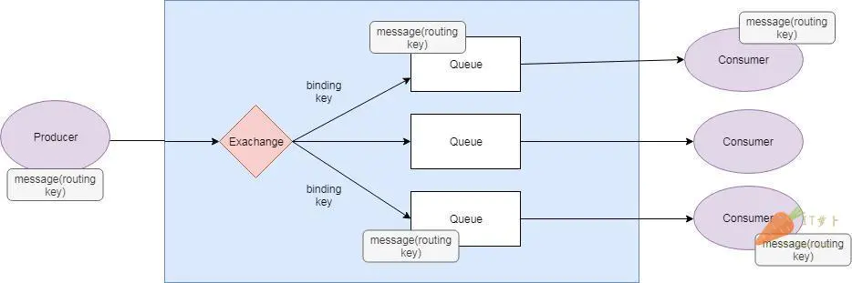
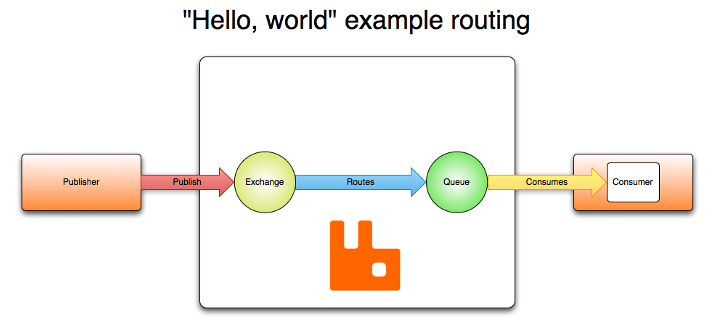
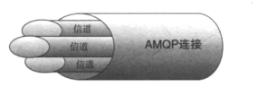

# 1 五种消息类型

## 1.1 基本消息模型

 


就是普通的生产者消费模型


> ACK

RabbitMQ有一个ACK机制。当消费者获取消息后，会向RabbitMQ发送回执ACK，告知消息已经被接收。不过这种回执ACK分两种情况：

- 自动ACK：消息一旦被接收，消费者自动发送ACK
- 手动ACK：消息接收后，不会发送ACK，需要手动调用


> 选择

这需要看消息的重要性：

- 如果消息不太重要，丢失也没有影响，那么自动ACK会比较方便
- 如果消息非常重要，不容丢失。那么最好在消费完成后手动ACK，否则接收消息后就自动ACK，RabbitMQ就会把消息从队列中删除。如果此时消费者宕机，那么消息就丢失了。


## 1.2 work消息模型


竞争消费者模式：避免执行资源密集型任务时，一个消息只能被一个消费者获取

> 实现非公平竞争

我们可以使用basicQos方法和prefetchCount = 1设置。 这告诉RabbitMQ不要向工作人员发送新消息，直到它处理并确认了前一个消息。 相反，它会将其分派给不是仍然忙碌的下一个工作人员。


## 1.3 订阅模型-Fanout


之前介绍的工作队列：每个任务只被传递给一个工作人员。

订阅模式：我们将会传递一个信息给多个消费者。

> 解读

1、1个生产者，多个消费者

2、每一个消费者都有自己的一个队列

3、生产者没有将消息直接发送到队列，而是发送到了交换机

4、每个队列都要绑定到交换机

5、生产者发送的消息，经过交换机到达队列，实现一个消息被多个消费者获取的目的

```java
Fanout：广播，将消息交给所有绑定到交换机的队列

Direct：定向，把消息交给符合指定routing key 的队列 

Topic：通配符，把消息交给符合routing pattern（路由模式） 的队列
```


## 1.4 订阅模型-Direct

有选择性的接收消息,在Direct模型下，队列与交换机的绑定，不能是任意绑定了，而是要指定一个RoutingKey（路由key），消息的发送方在向Exchange发送消息时，也必须指定消息的routing key。


P：生产者，向Exchange发送消息，发送消息时，会指定一个routing key。

X：Exchange（交换机），接收生产者的消息，然后把消息递交给 与routing key完全匹配的队列

C1：消费者，其所在队列指定了需要routing key 为 error 的消息

C2：消费者，其所在队列指定了需要routing key 为 info、error、warning 的消息


## 1.5 订阅模型-Topic

opic`类型的`Exchange`与`Direct`相比，都是可以根据`RoutingKey`把消息路由到不同的队列。只不过`Topic`类型`Exchange`可以让队列在绑定`Routing key` 的时候使用通配符！


> 持久化

交换机还可以通过参数设置持久化


# 2 原理

[博客](https://www.jianshu.com/p/256c502d09cd)

MQ全称是Message Queue，可以理解为消息队列的意思，简单来说就是消息以管道的方式进行传递。

优点：实现了微服务间的高度解耦


## 2.1 重要组成部分

生产者（Producer）：发送消息的应用。

消费者（Consumer）：接收消息的应用。

队列（Queue）：存储消息的缓存。

消息（Message）：由生产者通过RabbitMQ发送给消费者的信息。

连接（Connection）：连接RabbitMQ和应用服务器的TCP连接。

通道（Channel）：连接里的一个虚拟通道。当你通过消息队列发送或者接收消息时，这个操作都是通过通道进行的。

交换机（Exchange）：交换机负责从生产者那里接收消息，并根据交换类型分发到对应的消息列队里。要实现消息的接收，一个队列必须到绑定一个交换机。

绑定（Binding）：绑定是队列和交换机的一个关联连接。

路由键（Routing Key）：路由键是供交换机查看并根据键来决定如何分发消息到列队的一个键。路由键可以说是消息的目的地址。


## 2.2 工作流程

**生产者（Producer）**发送/发布消息到代理->**消费者（Consumer）**从代理那里接收消息。哪怕生产者和消费者运行在不同的机器上，**RabbitMQ**也能扮演代理中间件的角色。

当生产者发送消息时，它并不是直接把消息发送到队列里的，而是使用交换机（Exchange）来发送。下面的设计图简单展示了这三个主要的组件之间是如何连接起来的。

交换机代理（exchange agent）负责把消息分发到不同的队列里。这样的话，消息就能够从生产者发送到交换机，然后被分发到消息队列里。这就是常见的“发布”方法。




*生产者（producer）*把消息发送给交换机。当你创建交换机的时候，你需要指定类型。交换机的类型接下来会讲到。

*交换机（exchange）*接收消息并且负责对消息进行路由。根据交换机的类型，消息的多个属性会被使用，例如路由键。

*绑定（binding）*需要从交换机到队列的这种方式来进行创建。在这个例子里，我们可以看到交换机有到两个不同队列的绑定。交换机根据消息的属性来把消息分发到不同的队列上。

*消息（message）*消息会一直留在队列里直到被消费。

*消费者（consumer）*处理消息。


## 2.3 AMQP协议

**1. 什么是AMQP?**

```
  在异步通讯中，消息不会立刻到达接收方，而是被存放到一个容器中，当满足一定的条件之后，消息会被容器发送给接收方，这个容器即消息队列，而完成这个功能需要双方和容器以及其中的各个组件遵守统一的约定和规则，AMQP就是这样的一种协议，消息发送与接受的双方遵守这个协议可以实现异步通讯。这个协议约定了消息的格式和工作方式。
```

**2. 为什么使用AMQP**

```
  为什么使用AMQP或者AMQP解决了什么问题？
  在分布式的系统中，子系统之如果使用socket连接进行通讯，有很多问题需要解决。比如：
  1）信息的发送者和接受者如何维持这个连接，如果一方中断，这期间的数据如何防止丢失？
  2）如何降低发送者和接受者的耦合度？
  3）如何让优先级高的接受者先接到数据？
  4）如何做到load balance?均衡接受者的负载？
  5）如何将信息发送到相关的接收者，如果接受者订阅了不同的数据，如何正确的分发到接受者？
  6）如何做到可扩展，将通信模块发到集群上去。
  7）如何保证接受者接到了完整，正确或是有序的数据？
  AMQP解决了这些问题。与此同时，基于AMQP实现的产品相比其他类似产品（AcitveMQ，Openfire）有着自己的特点。
```


**3.rabbitmq基于AMQP实现**

RabbitMQ基于AMQP实现，AMQP是一个高级消息队列网络协议，

AMQP的工作过程如下图：消息（message）被发布者（publisher）发送给交换机（exchange），然后交换机将收到的消息根据路由规则分发给绑定的队列（queue）。最后AMQP代理会将消息投递给订阅了此队列的消费者，或者消费者按照需求自行获取。 




你的应用程序和Rabbit  Server之间会创建一个TCP连接，一旦TCP打开，并通过了认证，你的应用程序和Rabbit就创建了一条AMQP信道（Channel）。

认证就是你试图连接Rabbit之前发送的Rabbit服务器连接信息和用户名和密码，有点像程序连接数据库，使用Java有两种连接认证的方式




> 为什么不通过TCP直接发送命令

对于操作系统来说创建和销毁TCP会话是非常昂贵的开销，而且操作系统每秒能创建的TCP也是有限的。 


> 持久化工作原理

rabbitMQ默认情况下重启服务器会导致消息丢失，那么怎么保证Rabbit在重启的时候不丢失呢？答案就是消息持久化。

 Rabbit会将你的持久化消息写入磁盘上的持久化日志文件，等消息被消费之后，Rabbit会把这条消息标识为等待垃圾回收。


> 消息不丢失

从安全角度考虑，网络是不可靠的，又或是消费者在处理消息的过程中意外挂掉，这样没有处理成功的消息就会丢失。

基于此原因，AMQP 模块包含了一个消息确认（Message Acknowledgements）机制：当一个消息从队列中投递给消费者后，不会立即从队列中删除，直到它收到来自消费者的确认回执后，才完全从队列中删除。


# 3 消息队列选择建议

## **3.1 Kafka**

Kafka主要特点是基于Pull的模式来处理消息消费，追求高吞吐量，一开始的目的就是用于日志收集和传输，适合产生大量数据的互联网服务的数据收集业务。

大型公司建议可以选用，如果有日志采集功能，肯定是首选kafka了。

## **3.2 RocketMQ**

天生为金融互联网领域而生，对于可靠性要求很高的场景，尤其是电商里面的订单扣款，以及业务削峰，在大量交易涌入时，后端可能无法及时处理的情况。

RoketMQ在稳定性上可能更值得信赖，这些业务场景在阿里双11已经经历了多次考验，如果你的业务有上述并发场景，建议可以选择RocketMQ。

## **3.3 RabbitMQ**

RabbitMQ :结合erlang语言本身的并发优势，性能较好，社区活跃度也比较高，但是不利于做二次开发和维护。不过，RabbitMQ的社区十分活跃，可以解决开发过程中遇到的bug。

如果你的数据量没有那么大，小公司优先选择功能比较完备的RabbitMQ。

