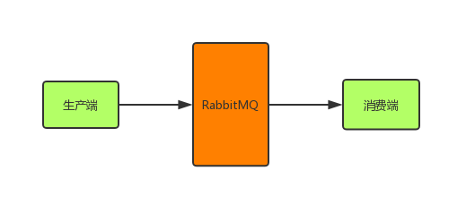
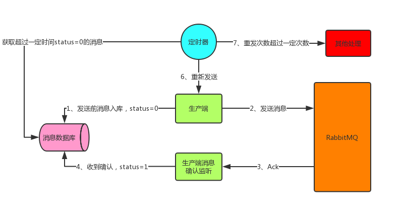
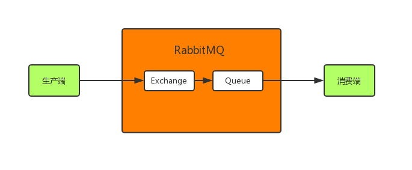
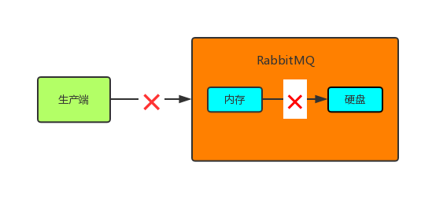

[博客](https://developer.51cto.com/art/201902/591997.htm)

## 1 **为什么在系统架构中要引入消息中间件** 

### 1.1 解耦

在实际的系统架构设计中，如果全部采取这种系统耦合的方式，在某些场景下绝对是不合适的，系统耦合度太严重。 


### 1.2 **异步调用** 

假设你有一个系统调用链路，是系统 A 调用系统 B，一般耗时 20ms;系统 B 调用系统 C，一般耗时 200ms;系统 C 调用系统 D，一般耗时  2s，如下图所示： 


整个调用过程中，C调D需要2s，导致最终链路执行时间是 2 秒多 ，直接将链路调用性能降低了 10  倍。

我们可以使用RabbitMQ做异步调用，将D系统分离出去，提高系统性能：


系统 C 就是发送个消息到 MQ 中间件里，由系统 D 消费到消息之后慢慢的异步来执行这个耗时 2s  的业务处理。通过这种方式直接将核心链路的执行性能提升了 10 倍。 


### 1.3 **流量削峰** 

假设你有一个系统，平时正常的时候每秒可能就几百个请求，系统部署在 8 核 16G 的机器的上，正常处理都是 ok  的，每秒几百请求是可以轻松抗住的。但是在高峰期一下子来了每秒钟几千请求，瞬时出现了流量高峰，此时你的选择是要搞 10 台机器，那么每天就那半个小时有用，别的时候都是浪费资源的。

此时我们就可以用 MQ 中间件来进行流量削峰。所有机器前面部署一层 MQ，平时每秒几百请求大家都可以轻松接收消息。

一旦到了瞬时高峰期，一下涌入每秒几千的请求，就可以积压在 MQ 里面，然后那一台机器慢慢的处理和消费。

等高峰期过了，再消费一段时间，MQ 里积压的数据就消费完毕了。


## 2 如何保证RabbitMQ消息不丢失

我们都知道，消息从生产端到消费端消费要经过3个步骤：

1. 生产端发送消息到RabbitMQ；
2. RabbitMQ发送消息到消费端；
3. 消费端消费这条消息;

> 丢数据一般分为两种，一种是mq把消息丢了，一种就是消费时将消息丢了。 



### 2.1 数据丢失三种情况

**A:生产者弄丢了数据**
 生产者将数据发送到rabbitmq的时候，可能在传输过程中因为网络等问题而将数据弄丢了。

**B:rabbitmq自己丢了数据**
 如果没有开启rabbitmq的持久化，那么rabbitmq一旦重启，那么数据就丢了。所依必须开启持久化将消息持久化到磁盘，这样就算rabbitmq挂了，恢复之后会自动读取之前存储的数据，一般数据不会丢失。除非极其罕见的情况，rabbitmq还没来得及持久化自己就挂了，这样可能导致一部分数据丢失。

**C：消费端弄丢了数据**
 主要是因为消费者消费时，刚消费到，还没有处理，结果消费者就挂了，这样你重启之后，rabbitmq就认为你已经消费过了，然后就丢了数据。


> 保证消息不丢失

```
1. 开启事务（不推荐）
2. 开启confirm（推荐）
3. 开启RabbitMQ的持久化（交换机、队列、消息）
4. 关闭RabbitMQ的自动ack（改成手动）
```


> 保证消息不重复消费

```
幂等性（每个消息用一个唯一标识来区分，消费前先判断此标识有没有被消费过，若已消费过，则直接ACK）
```


### 2.2 如何防止消息丢失

#### **2.2.1 **confirm机制

> 生产者丢失消息

生产者将信道设置成confirm模式，一旦信道进入confirm模式，所有在该信道上面发布的消息都会被指派一个唯一的ID(从1开始)，一旦消息被投递到所有匹配的队列之后，broker就会发送一个确认给生产者（包含消息的唯一ID）,这就使得生产者知道消息已经正确到达目的队列了，如果消息和队列是可持久化的，那么确认消息会将消息写入磁盘之后发出，broker回传给生产者的确认消息中deliver-tag域包含了确认消息的序列号，此外broker也可以设置basic.ack的multiple域，表示到这个序列号之前的所有消息都已经得到了处理。   confirm模式最大的好处在于他是异步的，一旦发布一条消息，生产者应用程序就可以在等信道返回确认的同时继续发送下一条消息，当消息最终得到确认之后，生产者应用便可以通过回调方法来处理该确认消息，如果RabbitMQ因为自身内部错误导致消息丢失，就会发送一条nack消息，生产者应用程序同样可以在回调方法中处理该nack消息。

 

> 具体操作

（1）先将消息放入生产者Redis（此时消息的状态为未投放），再放入队列  

（2）根据conform（ReturnCallback和ConfirmCallback）的结果来确定消息是否投递成功，  投递成功的，修改生产者redis中此消息的投递状态为已投递， 投递失败的将会放入失败的Redis，并从生产者Redis中删除，由定时任务定期扫描并重新投递  

（3）需要一个专门的定时任务扫描生产者Redis中存放了一定时间，但是状态还是未投放的消息 ，此消息会被认为已经投递，但是没有任何反馈结果（由于不可知因素，导致没有ReturnCallback，也没有ConfirmCallback），  此类消息被扫描到后，会放入失败的Redis，并从生产者Redis中删除，由定时任务定期扫描并重新投递  

（4）还需要一个专门的定时任务扫描生产者Redis中存放了很久，仍然未消费的数据（状态为已投递），此类消息被扫描到后，会放入失败的Redis，并从生产者Redis中删除，由定时任务定期扫描并重新投递  

（5）扫描失败的Redis的定时任务都遵循一条原则，一条消息最多被重新投递三次，若投递了三次仍然失败，则记录日志，记录到数据库，不会再投递，需要人工干预处理 

 


#### 2.2.2 持久化

>rabbitmq自己弄丢了数据

所有需要给exchange、queue和message都进行持久化： 

> exchange持久化

```java
//第三个参数true表示这个exchange持久化

channel.exchangeDeclare(EXCHANGE_NAME, "direct", true);

```

> queue持久化

```java
//第二个参数true表示这个queue持久化

channel.queueDeclare(QUEUE_NAME, true, false, false, null);
```

> message持久化

```java
//第三个参数MessageProperties.PERSISTENT_TEXT_PLAIN表示这条消息持久化
channel.basicPublish(EXCHANGE_NAME, ROUTING_KEY, MessageProperties.PERSISTENT_TEXT
```

这样，如果RabbitMQ收到消息后挂了，重启后会自行恢复消息。


而且持久化可以跟生产的confirm机制配合起来，只有消息持久化到了磁盘之后，才会通知生产者ack，这样就算是在持久化之前rabbitmq挂了，数据丢了，生产者收不到ack回调也会进行消息重发。

 


#### 2.2.3 手动ack

> 消费者弄丢了数据 

使用rabbitmq提供的ack机制，首先关闭rabbitmq的自动ack，然后每次在确保处理完这个消息之后，在代码里手动调用ack。这样就可以避免消息还没有处理完就ack。 




> 具体操作

（1）消费者取到消息后，从消息中取出唯一标识，先判断此消息有没有被消费过，若已消费过，则直接ACK（避免重复消费）  

（2）正常处理成功后，将生产者Redis中的此消息删除，并ACK（告诉server端此消息已成功消费）  

（3）遇到异常时，捕获异常，验证自己在消息中设定的重试次数是否超过阀值，若超过，则放入死信队列，若未超过，则向将消息中的重试次数加1，抛出自定义异常，进入重试机制  

（4）有专门的消费者用于处理死信队列中消费多次仍未消费成功的数据，可以记录日志，入库，人工干预处理 


 

 

 

