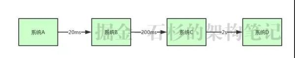
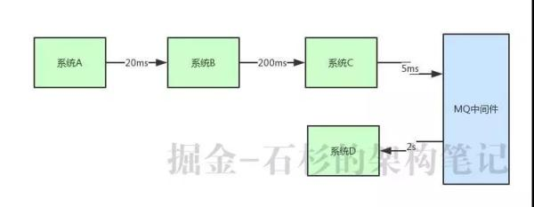
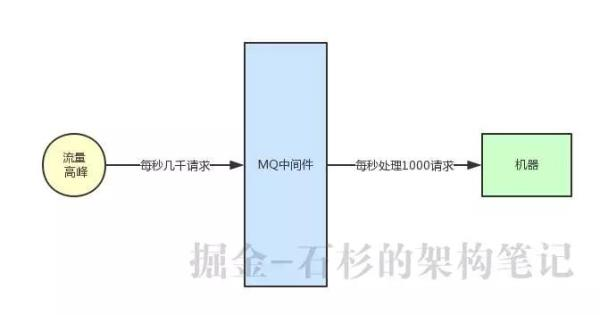

[博客](https://developer.51cto.com/art/201902/591997.htm)

## 1 **为什么在系统架构中要引入消息中间件** 

### 1.1 解耦

在实际的系统架构设计中，如果全部采取这种系统耦合的方式，在某些场景下绝对是不合适的，系统耦合度太严重。 

### 1.2 **异步调用** 

假设你有一个系统调用链路，是系统 A 调用系统 B，一般耗时 20ms;系统 B 调用系统 C，一般耗时 200ms;系统 C 调用系统 D，一般耗时  2s，如下图所示： 

整个调用过程中，C调D需要2s，导致最终链路执行时间是 2 秒多 ，直接将链路调用性能降低了 10  倍。

我们可以使用RabbitMQ做异步调用，将D系统分离出去，提高系统性能：

系统 C 就是发送个消息到 MQ 中间件里，由系统 D 消费到消息之后慢慢的异步来执行这个耗时 2s  的业务处理。通过这种方式直接将核心链路的执行性能提升了 10 倍。 

### 1.3 **流量削峰** 

假设你有一个系统，平时正常的时候每秒可能就几百个请求，系统部署在 8 核 16G 的机器的上，正常处理都是 ok  的，每秒几百请求是可以轻松抗住的。但是在高峰期一下子来了每秒钟几千请求，瞬时出现了流量高峰，此时你的选择是要搞 10 台机器，那么每天就那半个小时有用，别的时候都是浪费资源的。

此时我们就可以用 MQ 中间件来进行流量削峰。所有机器前面部署一层 MQ，平时每秒几百请求大家都可以轻松接收消息。

一旦到了瞬时高峰期，一下涌入每秒几千的请求，就可以积压在 MQ 里面，然后那一台机器慢慢的处理和消费。

等高峰期过了，再消费一段时间，MQ 里积压的数据就消费完毕了。

## 2 如何保证RabbitMQ消息不丢失

