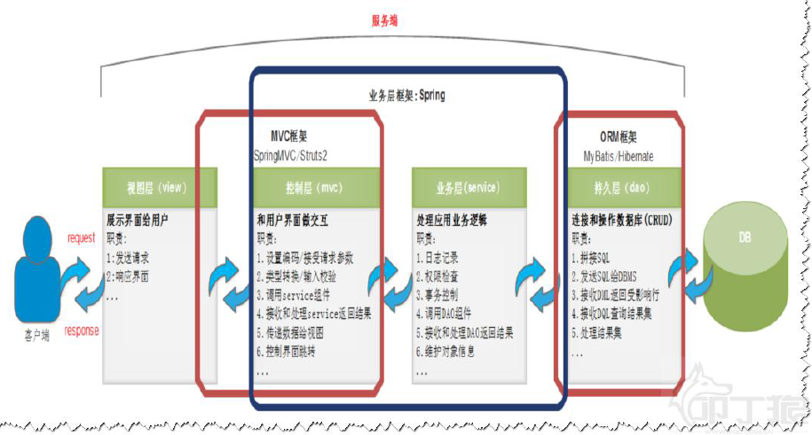
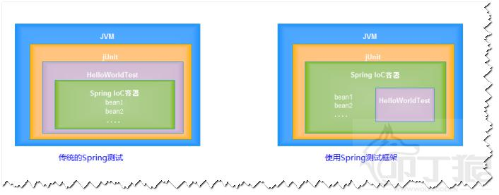
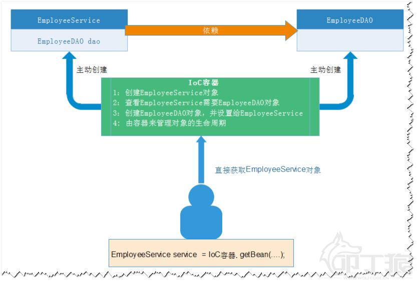

# 1 为什么要有Spring

### 1.1 传统代码的问题 

* 代码耦合度比较高

```java
public class EmployeeServiceImpl implements IEmployeeService {
private IEmployeeDAO dao;
public EmployeeServiceImpl() {
//创建依赖对象
dao = new EmployeeDAOJdbcImpl();
}
public void save() {
//TODO
}
}
```

此时如果把IEmployeeDAO 的实现类换成EmployeeDAOMyBatisImpl ， 此时需要修改EmployeeServiceImpl 的源代码，不符合开闭原则。

> 开闭原则：对于扩展是开放的，对于修改是关闭的。

* 循环依赖问题：

  如在创建A 类时，构造器需要B 类，那将去创建B，在创建B 类时又发现需要C 类，则又去创建C，最终在创建C 时发现又需要A；从而形成一个环。

* 控制事务繁琐
* 第三方框架运用太麻烦


### 1.2 什么是spring

 Spring是一个轻量级的IoC和AOP容器框架。是为Java应用程序提供基础性服务的一套框架，目的是用于简化企业应用程序的开发，它使得开发者只需要关心业务需求。常见的配置方式有三种：基于XML的配置、基于注解的配置、基于Java的配置。 

> 什么是容器（Container）：从程序设计角度看就是装对象的的对象，因为存在放入、拿出等操作，所以容
> 器还要管理对象的生命周期，如Tomcat 就是Servlet 和JSP 的容器。



Spring 提供了Java EE 每一层的解决方案，所以我们也说Spring 是Java EE 的全栈式（full stack）框架。


**主要由以下几个模块组成：**

- Spring Core：核心类库，提供IOC服务；

- Spring Context：提供框架式的Bean访问方式，以及企业级功能（JNDI、定时任务等）；

- Spring AOP：AOP服务；

- Spring DAO：对JDBC的抽象，简化了数据访问异常的处理；

- Spring ORM：对现有的ORM框架的支持；

- Spring Web：提供了基本的面向Web的综合特性，例如多方文件上传；

- Spring MVC：提供面向Web应用的Model-View-Controller实现。
  

优势：

1. Spring 能帮我们低侵入/低耦合地**根据配置文件创建及组装对象之间的依赖关系**。
2. Spring 面向**切面编程**能帮助我们**无耦合的实现日志记录，性能统计，安全控制**等。
3. Spring 能非常简单的且强大的**声明式事务管理**。
4. Spring 提供了**与第三方数据访问框架（如Hibernate、JPA）无缝集成**，且自己也提供了一套JDBC模板来方便数据库访问。

5. Spring 提供**与第三方Web（如Struts1/2、JSF）框架无缝集成**，且自己也提供了一套Spring MVC框架，来方便Web 层搭建。
6. Spring 能方便的**与如Java Mail、任务调度、缓存框架等技术整合**，降低开发难度。


framework：


### 1.3 Spring测试框架



传统测试存在的问题：

1. 每个测试都要重新启动Spring，启动容器的开销大，测试效率低下。
2. 不应该是测试代码管理Spring 容器，应该是Spring 容器在管理测试代码。
3. 不能正常的关闭Spring 容器，Spring 容器生命周期非正常退出。

**Spring测试框架：基于jUnit4 的测试**

```java
@RunWith(SpringJUnit4ClassRunner.class)
@ContextConfiguration("classpath:springTest.xml")
public class SpringTestTest {
	//从Spring IoC 容器中根据类型找到对应的bean 并自动注入到某个字段上
	@Autowired
	private HelloWorld world;
	@Test
	public void test1() throws Exception {
		world.sayHello();
	}
}
```

若把@ContextConfiguration("classpath:springTest.xml") 写成@ContextConfiguration
默认去找的当前测试类名-context.xml 配置文件,如:SpringTestTest-context.xml


**Spring测试框架：基于jUnit5的测试：**

```java
@SpringJUnitConfig
public class SpringTestTest {
	@Autowired
	private HelloWorld world;
    
	@Test
	void test1() throws Exception {
		world.sayHello();
	}
}

```


# 2 IOC

IoC：Inversion of Control（控制反转），不是什么新技术，而是一种设计思想，好比于MVC。

DI：Dependency Injection（依赖注入），指将对象的创建权，反转给了Spring 容器，即将对象依赖属性（常量，对象，集合）通过配置设值给该对象。

### 2.1 IOC创建对象

**传统方式创建对象：**


**使用Spring创建对象：**

反控：调用者只管负责从Spring 容器中获取需要使用的对象，不关心对象的创建过程，也不关心该对象依
赖对象的创建以及依赖关系的组装，也就是把创建对象的控制权反转给了Spring 框架。




### 2.2 创建Bean的三种方式

被Spring IoC 容器管理的对象称之为bean。

元数据的配置有三种方式：

-  XML-based configuration
-  Annotation-based configuration
-  Java-based configuration


三种创建bean的方式：

```java
	@Test
	void testSpring() throws Exception {
		HelloWorld world = null;
		Resource resource =  new ClassPathResource("applicationContext.xml");
		BeanFactory factory = new XmlBeanFactory(resource);
		//world = (HelloWorld) factory.getBean("helloWorld");
		//world = factory.getBean(HelloWorld.class);
		world = factory.getBean("helloWorld", HelloWorld.class);//推荐
		world.sayHello();
	}
```


##### 2.2.2 import

```java
<import resource="classpath:cn/wolfcode/day1/_02_hello/hello.xml"/>
```

注意：

1. 默认情况下，从classpath 的跟路径寻找。

2. 可以使用前缀来定位文件的基础位置：

   ①：[classpath:]：后面的文件从classpath 路径开始找(推荐)；
   ②：[file:]：后面的文件使用文件系统的路径开始找；

注意：只有当框架中实现了Resource 接口才能够识别上述的前缀标识符。


# 3 IOC（基于XML）

### 3.1 BeanFactory 

BeanFactory：Spring 最底层的接口，只提供了的IoC 功能，负责创建、组装、管理bean，在应用中，一般不使用BeanFactory，而推荐使用ApplicationContext（应用上下文）。


### 3.2 ApplicationContext  

ApplicationContext 接口继承了BeanFactory，除此之外还提供AOP 集成、国际化处理、事件传播、统一资源价值等功能。

```java
public interface ApplicationContext extends EnvironmentCapable, ListableBeanFactory,
HierarchicalBeanFactory,MessageSource, ApplicationEventPublisher, ResourcePatternResolver {
}
```


### 3.3 bean 的创建时机

1、BeanFactory 需要等到获取某一个bean 的时候才会创建该bean--延迟初始化。
2、ApplicationContext 在启动Spring 容器的时候就会创建所有的bean（Web 应用建议）。

**BeanFactory:（不使用Spring Test）**

```java
@Test
void testBeanFactory() throws Exception {
Resource resource =
new ClassPathResource("cn/wolfcode/day1/_04_container/ContainerTest-context.xml");
BeanFactory factory = new XmlBeanFactory(resource);
System.out.println("--------before --------");
factory.getBean("someBean", SomeBean.class);//开始创建bean
System.out.println("--------after --------");
}
```

输出结果：

```
--------before --------
创建SomeBean 对象
```


**ApplicationContext：（不使用Spring Test）**

```java
@Test
void testBeanApplicationContext() throws Exception {
    ApplicationContext ctx = new
ClassPathXmlApplicationContext("cn/wolfcode/day1/_04_container/ContainerTest-context.xml");//已创建好所有bean
System.out.println("--------before --------");
ctx.getBean("someBean", SomeBean.class);
System.out.println("--------after --------");
}
```

输出结果：

```
创建SomeBean 对象
--------before --------
--------after --------
```


**使用Spring Test：BeanFactory和ApplicationContext的方式配置Spring**

```java
@SpringJUnitConfig

public class ContainerTest {

	@Autowired

	private BeanFactory factory;

	@Autowired

	private ApplicationContext ctx;

}

```


延迟初始化配置：

针对于当前xml 中所有的bean。
<beans default-lazy-init="default | false | true">
针对于指定的bean:
<bean lazy-init="default | false | true">


### 3.4 Bean 实例化方式

1. 构造器实例化（无参数构造器），最标准，使用最多。

2. 静态工厂方法实例化：解决系统遗留问题。

3. 实例工厂方法实例化：解决系统遗留问题。

4. 实现FactoryBean 接口实例化：实例工厂变种。

   如集成MyBatis 框架使用：org.mybatis.spring.SqlSessionFactoryBean


##### 3.4.1 构造器实例化

（无参数构造器），最标准，使用最多

```java
public class SomeBean1 {
	public SomeBean1() {
		System.out.println("SomeBean1 构造器");
	}
}

```

```java
<bean id="someBean1" class="cn.wolfcode.day1._05_create_bean._1constructor.SomeBean1"/>
```


##### 3.4.2 静态工厂方法实例化

解决系统遗留问题。

很明显这个方法可以在创建Bean的时候实现自己的方法。

```java
public class SomeBean2 {

}

public class SomeBean2Factory {
	public static SomeBean2 createInstance() {
		//TODO
		return new SomeBean2();
	}
}
```

```java
<bean id="someBean2"
class="cn.wolfcode.day1._05_create_bean._2staticfactory.SomeBean2Factory"
factory-method="createInstance"/>
```


##### 3.4.3 实例工厂方法实例化

解决系统遗留问题。

```java
public class SomeBean3 {

}

public class SomeBean3Factory {
	public SomeBean3 createInstance() {
		//TODO
		return new SomeBean3();
	}
}
```


```java
<bean id="factory"
class="cn.wolfcode.day1._05_create_bean._3instancefactory.SomeBean3Factory"/>
<bean id="someBean3" factory-bean="factory" factory-method="createInstance"/>
```


##### 3.4.4 实现FactoryBean 接口实例化

实例工厂变种

```java
public class SomeBean4 {
    
}

public class SomeBean4FactoryBean implements 	FactoryBean<SomeBean4>{
	public SomeBean4 getObject() throws Exception {
		//TODO
		return new SomeBean4();
	}

    public Class<?> getObjectType() {
		return SomeBean4.class;
	}
}
```

```java
<bean id="someBean4"
class="cn.wolfcode.day1._05_create_bean._4factorybean.SomeBean4FactoryBean"/>
```


### 3.5 Bean初始化和销毁

```java
<bean id="someBean" class="......"
init-method="该类中初始化方法名"
destroy-method="该类中销毁方法名">
</bean>
```

- init-method：bean 生命周期初始化方法,对象创建后就进行调用
- destroy-method:容器被正常销毁的时候，如果bean 被容器管理，会调用该方法。


# 4 DI（基于XML）

即注入操作。

怎么注入：

- setter 方法注入
- 构造器注入

注入值类型：

1. 常量值（简单类型）：value 元素
2. 对象: ref 元素
3. 集合: 对应集合类型元素

> 详细配置代码略。


### 4.1 属性占位符

eg:配置连接池

db.properties 文件：

```java
jdbc.driverClassName=com.mysql.jdbc.Driver
jdbc.url=jdbc:mysql:///springdemo
jdbc.username=root
jdbc.password=admin
jdbc.initialSize=5
```


配置文件：用context引入propeties文件

```java
<context:property-placeholder location="classpath:db.properties"/>
<bean id="dataSource" class="com.alibaba.druid.pool.DruidDataSource" init-method="init"
destroy-method="close">
<property name="driverClassName" value="${jdbc.driverClassName}"/>
<property name="url" value="${jdbc.url}"/>
<property name="username" value="${jdbc.username}"/>
<property name="password" value="${jdbc.password}"/>
<property name="initialSize" value="${jdbc.initialSize}"/>
</bean>
```


# 5 注解配置IoC 和DI

**1. Autowired 注解和Qualifier 注解**

可以让spring自动的把属性需要的对象找出来并注入对象

Autowired和Qualifier作用是完全一样的

两个都需要注解解析器


**2.@Resource**

左边相当于右边的表达：

| @Autowired	@Qualifier("cat1") | @Resource(name="cat1") |
| -------------------------------- | ---------------------- |
| **@Autowired**                   | **@Resource**          |


3. @component
4. 作用域注解
5. Autowired和Setter的区别

| @Autowired                                                   | @Setter                                                      |
| ------------------------------------------------------------ | ------------------------------------------------------------ |
| @Autowired注解贴在字段上面，自动从Spring容器中去找到匹配的对象，被设置给该字段 | @Setter贴在字段上面，仅仅是为我们生成一个Setter方法，本身不能完成注入操作 |

 

# 7 AOP

### 7.1 引出AOP

面向切面。切面的目的就是功能增强，如日志切面就是一个横切关注点，应用中许多方法需要做日志记录的只需要插入日志的切面即可。减少了代码重复冗余和耦合的情况，事务是AOP很重要的一个应用。


### 7.2 使用AOP配置开发

##### 7.2.1 **使用jdk动态代理配置AOP**

切面的目的就是功能增强，如日志切面就是一个横切关注点，应用中许多方法需要做日志记录的只需要插
入日志的切面即可。

**1.xml配置**

```java
public class TransctionManager {
    public void begin() {
        System.out.println("开启事务");
    }
    public void commit() {
        System.out.println("提交事务");
    }
    public void close() {
        System.out.println("释放资源");
    }
    public void rollback() {
        System.out.println("回滚事务");
    }
    public Object around() {
        Object ret = null;
        System.out.println("开启事务");
        try {
            //执行目标方法
            System.out.println("执行目标方法");
            System.out.println("提交事务");
        } catch (Throwable ex) {
            System.out.println("回滚事务");
        } finally {
            System.out.println("释放资源");
        }
	return ret;
    }
}
```

```xml
<bean id="transctionManager" class="cn.wolfcode.wms.tx.TransctionManager" />
    
<aop:config>	
    <aop:aspect ref="transctionManager">
   <!--pointcut:切入点，哪些包中的哪些类中的哪些方法，可认为是连接点的集合。-->
        <aop:pointcut expression="
        execution(* cn.wolfcode.wms.service.*Service.*(..))" id="txPoint" />
            <aop:before method="begin" pointcut-ref="txPoint" />
            <aop:after-returning method="commit" pointcut-ref="txPoint" />
            <aop:after-throwing method="rollback" pointcut-ref="txPoint" />
            <aop:after method="close" pointcut-ref="txPoint" />
            <aop:around method="around" pointcut-ref="txPoint"/>
    </aop:aspect>
</aop:config>
```


**2.AspectJ 注解配置 **

>用于增强的类需要配Conponent和Aspect注解

```java
//用于增强的类需要配Conponent和Aspect注解
@Component
@Aspect
public class TransactionManager {
	
	//表示给谁做增强
	@Pointcut("execution(* cn.wolfcode.service.*Service.*(..))")
	public void txPoint() {
		
	}
	
	//各种何时增强的标签
	@Before("txPoint()")
	public void begin(JoinPoint jp) {
		System.out.println("开启事务");
	}

	@AfterReturning("txPoint()")
	public void commit(JoinPoint jp) {
		System.out.println("提交事务");
	}

	@AfterThrowing(value="txPoint()",throwing="ex")
	public void rollback(JoinPoint jp, Throwable ex) {
		//ex和App-context.xml里面的ex一致
		System.out.println("回滚事务,异常信息:" + ex.getMessage());
	}

	@After("txPoint()")
	public void close(JoinPoint jp) {
		System.out.println("释放资源");
	}

	@Around("txPoint()")
	public Object aroundMethod(ProceedingJoinPoint pjp) {
		Object ret = null;
		System.out.println("开启事务");
		try {
			ret = pjp.proceed();//调用真实对象的方法
			System.out.println("提交事务");
		} catch (Throwable e) {
			System.out.println("回滚事务,异常信息=" + e.getMessage());
		} finally {
			System.out.println("释放资源");
		}
		return ret;
	}
}
```


```xml
	<!-- DI注解解析器 -->
	<context:annotation-config />
	<!-- IoC注解解析器 -->
	<context:component-scan base-package="cn.wolfcode" />
	<!-- AOP注解解析器 -->
	<!-- proxy-target-class="true"表示使用JDK，JDK动态代理需要实现接口 -->
	<aop:aspectj-autoproxy proxy-target-class="false"/>
```


##### 7.2.2 使用CGLIB配置AOP

> 默认使用的JDK 动态代理方式，可以设置使用CGLIB 方式。
>
> <aop:aspectj-autoproxy proxy-target-class="true"/>


