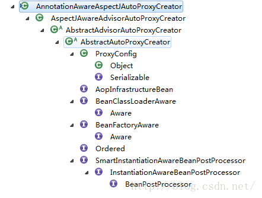
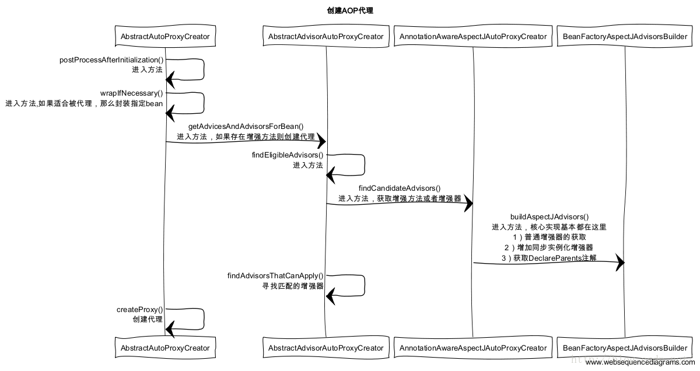

# 1 AOP实现原理剖析

先放一个AOP开发部分代码：

```
//用于增强的类需要配Conponent和Aspect注解
@Component
@Aspect
public class TransactionManager {
	
	//表示给谁做增强
	@Pointcut("execution(* cn.wolfcode.service.*Service.*(..))")
	public void txPoint() {
		
	}
	
	//各种何时增强的标签
	@Before("txPoint()")
	public void begin(JoinPoint jp) {
		System.out.println("开启事务");
	}

	@AfterReturning("txPoint()")
	public void commit(JoinPoint jp) {
		System.out.println("提交事务");
	}

	@AfterThrowing(value="txPoint()",throwing="ex")
	public void rollback(JoinPoint jp, Throwable ex) {
		//ex和App-context.xml里面的ex一致
		System.out.println("回滚事务,异常信息:" + ex.getMessage());
	}

	@After("txPoint()")
	public void close(JoinPoint jp) {
		System.out.println("释放资源");
	}

	@Around("txPoint()")
	public Object aroundMethod(ProceedingJoinPoint pjp) {
		Object ret = null;
		System.out.println("开启事务");
		try {
			ret = pjp.proceed();//调用真实对象的方法
			System.out.println("提交事务");
		} catch (Throwable e) {
			System.out.println("回滚事务,异常信息=" + e.getMessage());
		} finally {
			System.out.println("释放资源");
		}
		return ret;
	}
}
```

[博客](https://blog.csdn.net/fighterandknight/article/details/51209822)

/Marie(2019)/programming/08%E6%80%BB%E7%AC%94%E8%AE%B0/Spring%E7%B3%BB%E5%88%97/spring/assets/1.4.png)


**流程说明：**

1. AOP标签的定义解析刘彻骨肯定是从NamespaceHandlerSupport的实现类开始解析的，这个实现类就是AopNamespaceHandler。至于为什么会是从NamespaceHandlerSupport的实现类开始解析的，这个的话我想读者可以去在回去看看Spring自定义标签的解析流程，里面说的比较详细。
2. 要启用AOP，我们一般会在Spring里面配置<aop:aspectj-autoproxy/>  ，所以在配置文件中在遇到aspectj-autoproxy标签的时候我们会采用AspectJAutoProxyBeanDefinitionParser解析器
3. 进入AspectJAutoProxyBeanDefinitionParser解析器后，调用AspectJAutoProxyBeanDefinitionParser已覆盖BeanDefinitionParser的parser方法，然后parser方法把请求转交给了AopNamespaceUtils的registerAspectJAnnotationAutoProxyCreatorIfNecessary去处理
4. 进入AopNamespaceUtils的registerAspectJAnnotationAutoProxyCreatorIfNecessary方法后，先调用AopConfigUtils的registerAspectJAnnotationAutoProxyCreatorIfNecessary方法，里面在转发调用给registerOrEscalateApcAsRequired，注册或者升级AnnotationAwareAspectJAutoProxyCreator类。对于AOP的实现，基本是靠AnnotationAwareAspectJAutoProxyCreator去完成的，它可以根据@point注解定义的切点来代理相匹配的bean。
5. AopConfigUtils的registerAspectJAnnotationAutoProxyCreatorIfNecessary方法处理完成之后，接下来会调用useClassProxyingIfNecessary() 处理proxy-target-class以及expose-proxy属性。如果将proxy-target-class设置为true的话，那么会强制使用CGLIB代理，否则使用jdk动态代理，expose-proxy属性是为了解决有时候目标对象内部的自我调用无法实现切面增强。
6. 最后的调用registerComponentIfNecessary 方法，注册组建并且通知便于监听器做进一步处理。


 创建AOP代理:



我们可以看到这个类实现了BeanPostProcessor接口，那就意味着这个类在spring加载实例化前会调用postProcessAfterInitialization方法，对于AOP的逻辑也是由此开始的。 





spring 容器启动，每个bean的实例化之前都会先经过AbstractAutoProxyCreator类的postProcessAfterInitialization（）这个方法，然后接下来是调用wrapIfNecessary方法。 

```java
	/**
	 * Create a proxy with the configured interceptors if the bean is
	 * identified as one to proxy by the subclass.
	 * @see #getAdvicesAndAdvisorsForBean
	 */
	public Object <strong>postProcessAfterInitialization(Object bean, String beanName) throws BeansException {
		if (bean != null) {
			Object cacheKey = getCacheKey(bean.getClass(), beanName);
			if (!this.earlyProxyReferences.containsKey(cacheKey)) {
				return wrapIfNecessary(bean, beanName, cacheKey);
			}
		}
		return bean;
	}
```

 

 进入wrapIfNecessary方法后，我们直接看重点实现逻辑的方法getAdvicesAndAdvisorsForBean，这个方法会提取当前bean 的所有增强方法，然后获取到适合的当前bean 的增强方法，然后对增强方法进行排序，最后返回。 

```java
/**
	 * Wrap the given bean if necessary, i.e. if it is eligible for being proxied.
	 * @param bean the raw bean instance
	 * @param beanName the name of the bean
	 * @param cacheKey the cache key for metadata access
	 * @return a proxy wrapping the bean, or the raw bean instance as-is
	 */
	protected Object wrapIfNecessary(Object bean, String beanName, Object cacheKey) {
		if (beanName != null && this.targetSourcedBeans.containsKey(beanName)) {
			return bean;
		}
		if (Boolean.FALSE.equals(this.advisedBeans.get(cacheKey))) {
			return bean;
		}
		if (isInfrastructureClass(bean.getClass()) || shouldSkip(bean.getClass(), beanName)) {
			this.advisedBeans.put(cacheKey, Boolean.FALSE);
			return bean;
		}
 
		//getAdvicesAndAdvisorsForBean：
        //这个方法会提取当前bean 的所有增强方法，然后获取到适合的当前bean 的增强方法，然后对增强方法进行排序，最后返回。 
		Object[] specificInterceptors = getAdvicesAndAdvisorsForBean(bean.getClass(), beanName, null);
		if (specificInterceptors != DO_NOT_PROXY) {
			this.advisedBeans.put(cacheKey, Boolean.TRUE);
			Object proxy = createProxy(bean.getClass(), beanName, specificInterceptors, new SingletonTargetSource(bean));
			this.proxyTypes.put(cacheKey, proxy.getClass());
			return proxy;
		}
 
		this.advisedBeans.put(cacheKey, Boolean.FALSE);
		return bean;
	}
```


获取到当前bean的增强方法后，便调用createProxy方法，创建代理。先创建代理工厂proxyFactory，然后获取当前bean 的增强器advisors，把当前获取到的增强器添加到代理工厂proxyFactory，然后设置当前的代理工的代理目标对象为当前bean，最后根据配置创建JDK的动态代理工厂，或者CGLIB的动态代理工厂，然后返回proxyFactory 

```java
/**
	 * @param specificInterceptors 此bean的拦截器集合(may be empty, but not null)
	 * @param targetSource the TargetSource for the proxy,
	 * already pre-configured to access the bean
	 * @return the AOP proxy for the bean
	 * @see #buildAdvisors
	 */

	protected Object createProxy(
			Class<?> beanClass, String beanName, Object[] specificInterceptors, TargetSource targetSource) {
 
		ProxyFactory proxyFactory = new ProxyFactory();
		// Copy our properties (proxyTargetClass etc) inherited from ProxyConfig.
		proxyFactory.copyFrom(this);
 
		if (!shouldProxyTargetClass(beanClass, beanName)) {
			// Must allow for introductions; can't just set interfaces to
			// the target's interfaces only.
			Class<?>[] targetInterfaces = ClassUtils.getAllInterfacesForClass(beanClass, this.proxyClassLoader);
			for (Class<?> targetInterface : targetInterfaces) {
				proxyFactory.addInterface(targetInterface);
			}
		}
 
		Advisor[] advisors = buildAdvisors(beanName, specificInterceptors);
		for (Advisor advisor : advisors) {
			proxyFactory.addAdvisor(advisor);
		}
 
		proxyFactory.setTargetSource(targetSource);
		customizeProxyFactory(proxyFactory);
 
		proxyFactory.setFrozen(this.freezeProxy);
		if (advisorsPreFiltered()) {
			proxyFactory.setPreFiltered(true);
		}
 
		return proxyFactory.getProxy(this.proxyClassLoader);
	}
```


**AOP动态代理执行：**

关于AOP的动态代理执行，有两种主要的方式JDK的动态代理和CGLIB的动态代理，接下来，我们先来看看AOP动态代理的实现选择方式，先上核心实现代码：

```java
	public AopProxy createAopProxy(AdvisedSupport config) throws AopConfigException {
		if (config.isOptimize() || config.isProxyTargetClass() || hasNoUserSuppliedProxyInterfaces(config)) {
			Class targetClass = config.getTargetClass();
			if (targetClass == null) {
				throw new AopConfigException("TargetSource cannot determine target class: " +
						"Either an interface or a target is required for proxy creation.");
			}
			if (targetClass.isInterface()) {
				return new JdkDynamicAopProxy(config);
			}
			return CglibProxyFactory.createCglibProxy(config);
		}
		else {
			return new JdkDynamicAopProxy(config);
		}
	}
```


**Spring JDK动态代理实现**

在上面的第三步骤说到或根据用户的配置（例如是否配置了proxyTargetClass属性为true），选择创建的代理类型，这个的代理类型分两种实现，都是比较高效的，下面根据JDK的动态代理来说明AOP的执行，也是先上JdkDynamicAopProxy的核心代码invoke方法： 

```java
public Object invoke(Object proxy, Method method, Object[] args) throwsThrowable {
       MethodInvocation invocation = null;
       Object oldProxy = null;
       boolean setProxyContext = false;
 
       TargetSource targetSource = this.advised.targetSource;
       Class targetClass = null;
       Object target = null;
 
       try {
           //eqauls()方法，具目标对象未实现此方法
           if (!this.equalsDefined && AopUtils.isEqualsMethod(method)){
                return (equals(args[0])? Boolean.TRUE : Boolean.FALSE);
           }
 
           //hashCode()方法，具目标对象未实现此方法
           if (!this.hashCodeDefined && AopUtils.isHashCodeMethod(method)){
                return newInteger(hashCode());
           }
 
           //Advised接口或者其父接口中定义的方法,直接反射调用,不应用通知
           if (!this.advised.opaque &&method.getDeclaringClass().isInterface()
                    &&method.getDeclaringClass().isAssignableFrom(Advised.class)) {
                // Service invocations onProxyConfig with the proxy config...
                return AopUtils.invokeJoinpointUsingReflection(this.advised,method, args);
           }
 
           Object retVal = null;
 
           if (this.advised.exposeProxy) {
                // Make invocation available ifnecessary.
                oldProxy = AopContext.setCurrentProxy(proxy);
                setProxyContext = true;
           }
 
           //获得目标对象的类
           target = targetSource.getTarget();
           if (target != null) {
                targetClass = target.getClass();
           }
 
           //获取可以应用到此方法上的Interceptor列表
           List chain = this.advised.getInterceptorsAndDynamicInterceptionAdvice(method,targetClass);
 
           //如果没有可以应用到此方法的通知(Interceptor)，此直接反射调用 method.invoke(target, args)
           if (chain.isEmpty()) {
                retVal = AopUtils.invokeJoinpointUsingReflection(target,method, args);
           } else {
                //创建MethodInvocation
                invocation = newReflectiveMethodInvocation(proxy, target, method, args, targetClass, chain);
                retVal = invocation.proceed();
           }
 
           // Massage return value if necessary.
           if (retVal != null && retVal == target &&method.getReturnType().isInstance(proxy)
                    &&!RawTargetAccess.class.isAssignableFrom(method.getDeclaringClass())) {
                // Special case: it returned"this" and the return type of the method
                // is type-compatible. Notethat we can't help if the target sets
                // a reference to itself inanother returned object.
                retVal = proxy;
           }
           return retVal;
       } finally {
           if (target != null && !targetSource.isStatic()) {
                // Must have come fromTargetSource.
               targetSource.releaseTarget(target);
           }
           if (setProxyContext) {
                // Restore old proxy.
                AopContext.setCurrentProxy(oldProxy);
           }
       }
    }
```

