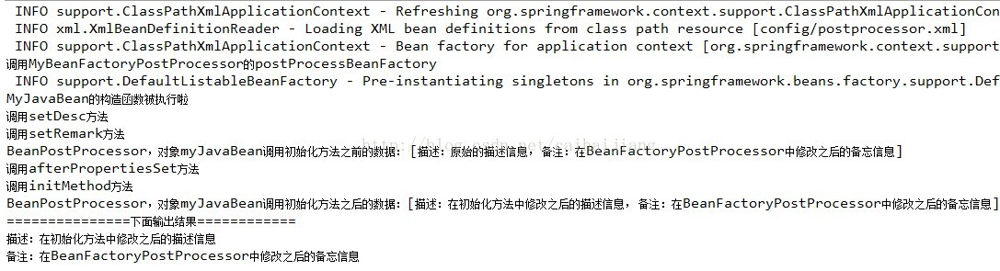
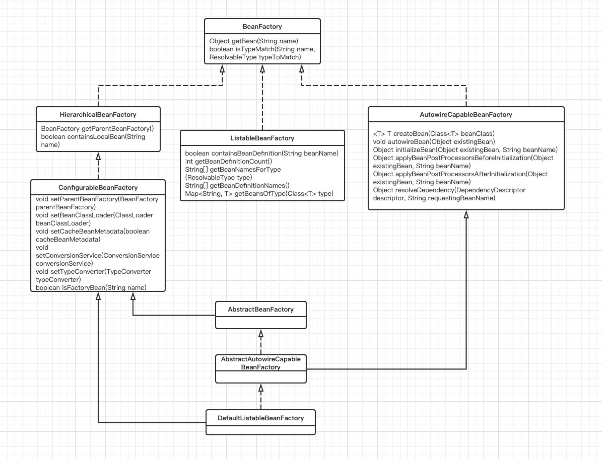
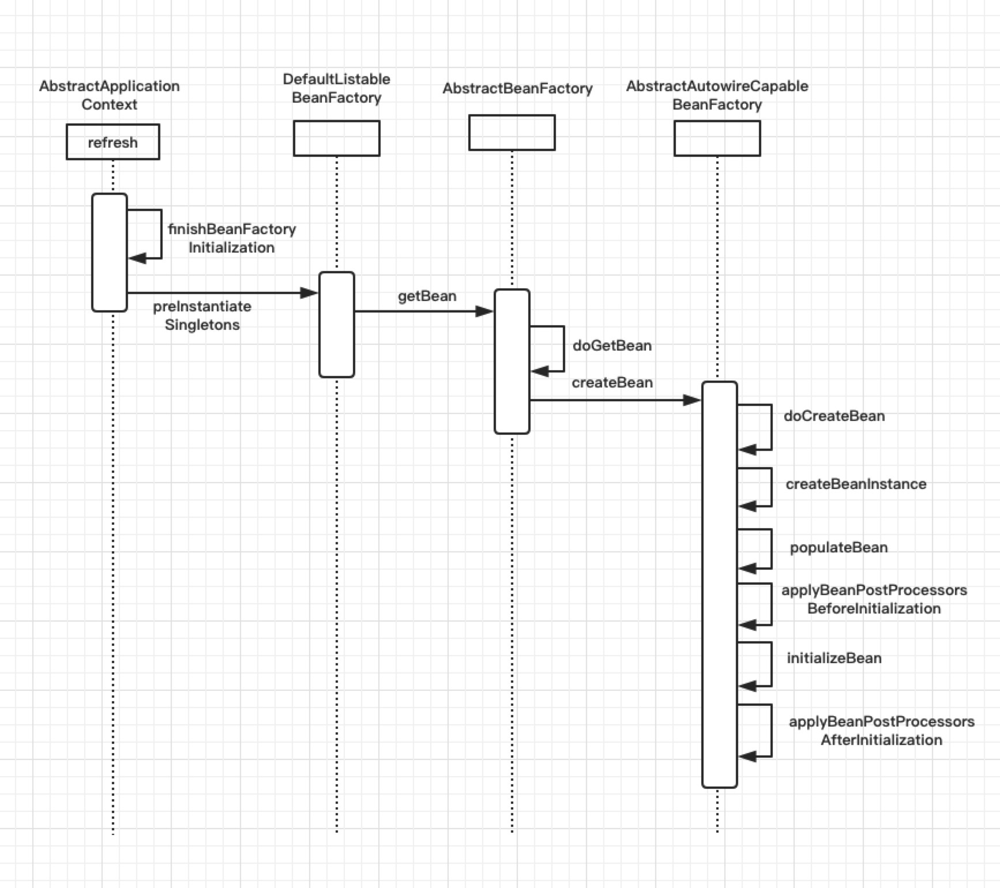

# 1 AOP

术语：

- Joinpoint:连接点，被拦截到需要被增强的方法。where：去哪里做增强
- Pointcut：切入点，哪些包中的哪些类中的哪些方法，可认为是连接点的集合。where:去哪些地方做增强
- Advice：增强，当拦截到Joinpoint 之后，在方法执行的什么时机（when）做什么样(what)的增强。根据时机分为：前置增强、后置增强、异常增强、最终增强、环绕增强
- Aspect：切面，Pointcut+Advice，去哪些地方+在什么时机+做什么增强
- Target：目标对象,被代理的目标对象
- Weaving：织入，把Advice 加到Target 上之后，创建出Proxy 对象的过程。
- Proxy：一个类被AOP 织入增强后，产生的代理类


> 下面的问题对照7.5.1的jdk动态代理注解配置

###  1.1 什么是Aspect？

Aspect由PointCut和Advice组成

它即包含了横切逻辑的定义，也包括了连接点的定义

SpringAOP就是负责实施切面的框架，它将切面所定义的横切逻辑编辑到切面指定的连接点中

AOP的工作重心在于如何将增强编织目标对象的连接点中，这里包含两个工作：

1. 如何通过PointCut和Advice定位到特定的JoinPoint上
2. 如何Advice中编写切面编程

**可以简单地认为，使用@Aspect注解的类就是切面**

eg：这是一个切面

```java
//用于增强的类需要配Conponent和Aspect注解
@Component
@Aspect
public class TransactionManager {
	
	//表示给谁做增强
	@Pointcut("execution(* cn.wolfcode.service.*Service.*(..))")
	public void txPoint() {
	}
    
    ........
        
}
```


### 1.2 什么是JoinPoint?

JoinPoint,切点，程序运行中的一些时间点，例如：

API：

| 方法名              | 功能                                                         |
| ------------------- | ------------------------------------------------------------ |
| getSignature();     | 获取封装了署名信息的对象,在该对象中可以获取到目标方法名,所属类的Class等信息 |
| Object[] getArgs(); | 获取传入目标方法的参数对象                                   |
| Object getTarget(); | 获取被代理的对象                                             |
| Object getThis();   | 获取代理对象                                                 |

```java
//用于增强的类需要配Conponent和Aspect注解
@Component
@Aspect
public class TransactionManager {
	
	//表示给谁做增强
	@Pointcut("execution(* cn.wolfcode.service.*Service.*(..))")
	public void txPoint() {
		
	}
	
    //JoinPoint,时间点
	@AfterThrowing(value="txPoint()",throwing="ex")
	public void rollback(JoinPoint jp, Throwable ex) {
		//ex和App-context.xml里面的ex一致
		System.out.println("回滚事务,异常信息:" + ex.getMessage());
	}

	......
}
```


### 1.3 什么是PointCut？

xml配置中的切入点，也就是对哪些包中的哪些类中的哪些方法进行配置。

```java
<bean id="transctionManager" class="cn.wolfcode.wms.tx.TransctionManager" />
    
<aop:config>	
    <aop:aspect ref="transctionManager">
    //pointcut:切入点，哪些包中的哪些类中的哪些方法，可认为是连接点的集合。
        <aop:pointcut expression="
        execution(* cn.wolfcode.wms.service.*Service.*(..))" id="txPoint" />
            <aop:before method="begin" pointcut-ref="txPoint" />
            <aop:after-returning method="commit" pointcut-ref="txPoint" />
            <aop:after-throwing method="rollback" pointcut-ref="txPoint" />
            <aop:after method="close" pointcut-ref="txPoint" />
            <aop:around method="around" pointcut-ref="txPoint"/>
    </aop:aspect>
</aop:config>
```


### 1.4 什么是Advice?

Advice：增强，SpringAop使用一个Advice作为拦截器，在JoinPoint周围维护一系列的拦截器，当拦截到Joinpoint 之后，在方法执行的什么时机（when）做什么样(what)的增强。根据时机分为：前置增强、后置增强、异常增强、最终增强、环绕增强


### 1.5 什么是 Target ？

目标对象,被代理的目标对象。

注意指的不是原来的对象，而是织入Advice后所产生的代理对象

通过JointPoint的getThis();方法可以获取代理对象，也就是Target，通过getTarget()可以获取获取被代理的对象。


### 1.6 AOP有哪些实现方式

实现AOP的技术，主要分为两类：

1. 静态代理
2. 动态代理
   - JDK动态代理
   - CGLIB动态代理

详情介绍7.1，7.2，7.3 


### 1.7 Spring AOP 和 AspectJ 之间的差别（重点）

[博客](https://www.jianshu.com/p/872d3dbdc2ca)

**概述：**

**AspectJ是一个AOP框架，它能够对java代码进行AOP编译（一般在编译期进行），让java代码具有AspectJ的AOP功能（当然需要特殊的编译器）**，可以这样说AspectJ是目前实现AOP框架中最成熟，功能最丰富的语言，更幸运的是，AspectJ与java程序完全兼容，几乎是无缝关联。

Spring注意到AspectJ在AOP的实现方式上依赖于特殊编译器(ajc编译器)，因此Spring很机智回避了这点，转向采用动态代理技术的实现原理来构建Spring AOP的内部机制（动态织入），这是与AspectJ（静态织入）最根本的区别。**Spring 只是使用了与 AspectJ 5 一样的注解，但仍然没有使用 AspectJ 的编译器，底层依是动态代理技术的实现，因此并不依赖于 AspectJ 的编译器**。 Spring AOP虽然是使用了那一套注解，其实实现AOP的底层是使用了动态代理(JDK或者CGLib)来动态植入。至于AspectJ的静态植入，不是本文重点，所以只提一提。 


**Spring AOP 和 AspectJ 有不同的目标：**

- Spring aop 旨在提供一个跨 Spring IoC 的简单的 aop 实现, 以解决程序员面临的最常见问题。它不打算作为一个完整的 AOP 解决方案 —— 它只能应用于由 Spring 容器管理的 bean。
- AspectJ 是原始的 aop 技术, 目的是提供完整的 aop 解决方案。它更健壮, 但也比 Spring AOP 复杂得多。还值得注意的是, AspectJ 可以在所有域对象中应用。


 **运用技术：**

SpringAOP使用了两种代理机制，一种是基于JDK的动态代理，另一种是基于CGLib的动态代理，之所以需要两种代理机制，很大程度上是因为JDK本身只提供基于接口的代理，不支持类的代理。


 **切面植入的方法：**

1. 编译期织入
2. 类装载期织入
3. 动态代理织入 ----> 在运行期为目标类添加增强生成子类的方式，**Spring  AOP采用动态代理织入切面**


**流行的框架：**     

AOP现有两个主要的流行框架，即Spring AOP和Spring+AspectJ   

/Marie(2019)/programming/08%E6%80%BB%E7%AC%94%E8%AE%B0/Spring%E7%B3%BB%E5%88%97/spring/assets/1.3.png)


此快速表总结了 Spring AOP 和 AspectJ 之间的关键区别:

| Spring AOP                                       | AspectJ                                                      |
| ------------------------------------------------ | ------------------------------------------------------------ |
| 在纯 Java 中实现                                 | 使用 Java 编程语言的扩展实现                                 |
| 不需要单独的编译过程                             | 除非设置 LTW，否则需要 AspectJ 编译器 (ajc)                  |
| 只能使用运行时织入                               | 运行时织入不可用。支持   编译期织入和类装载期织入            |
| 功能不强-仅支持方法级编织                        | 更强大 - 可以编织字段、方法、构造函数、静态初始值设定项、最终类/方法等......。 |
| 只能在由 Spring 容器管理的 bean 上实现           | 可以在所有域对象上实现                                       |
| 仅支持方法执行切入点                             | 支持所有切入点                                               |
| 代理是由目标对象创建的, 并且切面应用在这些代理上 | 在执行应用程序之前 (在运行时) 前, 各方面直接在代码中进行织入 |
| 比 AspectJ 慢多了                                | 更好的性能                                                   |
| 易于学习和应用                                   | 相对于 Spring AOP 来说更复杂                                 |

 

# 2 IOC

### 2.1 **Spring的IoC理解**

1. **IOC：**就是控制反转，是指创建对象的控制权的转移，以前创建对象的主动权和时机是由自己把控的，而现在这种权力转移到Spring容器中，并由容器根据配置文件去创建实例和管理各个实例之间的依赖关系，对象与对象之间松散耦合，也利于功能的复用。
2. **DI：**依赖注入，和控制反转是同一个概念的不同角度的描述，即应用程序在运行时依赖IoC容器来动态注入对象需要的外部资源,IOC是一种概念，而DI是实现IoC的方法。 
3. 最直观的表达就是，IOC让对象的创建不用去new了，可以由spring自动生产，使用java的反射机制，根据配置文件在运行时动态的去创建对象以及管理对象，并调用对象的方法的。
4. Spring的IOC有三种注入方式 ：构造器注入、setter方法注入、根据注解注入。
5. 工厂模式：在Spring IoC中经常用到一个设计模式，即工厂模式。工厂模式提供创建对象的接口。

> IoC让相互协作的组件保持松散的耦合，而AOP编程允许你把遍布于应用各层的功能分离出来形成可重用的功能组件。


### 2.2 BeanFactory&ApplicationContext000000

BeanFactory和ApplicationContext是Spring的两大核心接口，都可以当做Spring的容器。其中ApplicationContext是BeanFactory的子接口。

BeanFactory：

```java
@Test
void testBeanFactory() throws Exception {
Resource resource =
new ClassPathResource("cn/wolfcode/day1/_04_container/ContainerTest-context.xml");
BeanFactory factory = new XmlBeanFactory(resource);
System.out.println("--------before --------");
factory.getBean("someBean", SomeBean.class);//开始创建bean
System.out.println("--------after --------");
}
```

ApplicationContext：

```java
@Test
void testBeanApplicationContext() throws Exception {
    ApplicationContext ctx = new
ClassPathXmlApplicationContext("cn/wolfcode/day1/_04_container/ContainerTest-context.xml");//已创建好所有bean
System.out.println("--------before --------");
ctx.getBean("someBean", SomeBean.class);
System.out.println("--------after --------");
}
```

**比较一：**

**BeanFactory：**是Spring里面最底层的接口，包含了各种Bean的定义，读取bean配置文档，管理bean的加载、实例化，控制bean的生命周期，维护bean之间的依赖关系。

**ApplicationContext：**作为BeanFactory的派生，除了提供BeanFactory所具有的功能外，还提供了更完整的框架功能：

​	①继承MessageSource，因此支持国际化。

​	②统一的资源文件访问方式。

​	③提供在监听器中注册bean的事件。

​	④同时加载多个配置文件。

​	⑤载入多个（有继承关系）上下文 ，使得每一个上下文都专注于一个特定的层次，比如应用的web层。


**比较二：**

**BeanFactroy：**采用的是延迟加载形式来注入Bean的，即只有在使用到某个Bean时(调用getBean())，才对该Bean进行加载实例化。这样，我们就不能发现一些存在的Spring的配置问题。如果Bean的某一个属性没有注入，BeanFacotry加载后，直至第一次使用调用getBean方法才会抛出异常。

**ApplicationContext：**它是在容器启动时，一次性创建了所有的Bean。这样，在容器启动时，我们就可以发现Spring中存在的配置错误，这样有利于检查所依赖属性是否注入。 ApplicationContext启动后预载入所有的单实例Bean，通过预载入单实例bean ,确保当你需要的时候，你就不用等待，因为它们已经创建好了。

相对于基本的BeanFactory，ApplicationContext 唯一的不足是占用内存空间。当应用程序配置Bean较多时，程序启动较慢。


**比较三：**

BeanFactory通常以编程的方式被创建，ApplicationContext还能以声明的方式创建，如使用ContextLoader。

**比较四：**

BeanFactory和ApplicationContext都支持BeanPostProcessor、BeanFactoryPostProcessor的使用，但两者之间的区别是：BeanFactory需要手动注册，而ApplicationContext则是自动注册。


### 2.3 BeanFactoryPostProcessor和BeanPostProcessor

[博客](https://blog.csdn.net/caihaijiang/article/details/35552859)

BeanFactoryPostProcessor和BeanPostProcessor，这两个接口，都是Spring初始化bean时对外暴露的扩展点。

**BeanFactoryPostProcessor接口：**

 实现该接口，可以在spring的bean创建之前，修改bean的定义属性。也就是说，Spring允许BeanFactoryPostProcessor在容器实例化任何其它bean之前读取配置元数据，并可以根据需要进行修改，例如可以把bean的scope从singleton改为prototype，也可以把property的值给修改掉。可以同时配置多个BeanFactoryPostProcessor，并通过设置'order'属性来控制各个BeanFactoryPostProcessor的执行次序。


**BeanPostProcessor接口** ：接口定义如下

```java
public interface BeanPostProcessor {
	Object postProcessBeforeInitialization(Object bean, String beanName) throws BeansException;
 
	Object postProcessAfterInitialization(Object bean, String beanName) throws BeansException;
}
```

BeanPostProcessor，可以在spring容器实例化bean之后，在执行bean的初始化方法前后，添加一些自己的处理逻辑。这里说的初始化方法，指的是下面两种：

1）bean实现了InitializingBean接口，对应的方法为`afterPropertiesSet`

2）在bean定义的时候，通过`init-method`设置的方法


eg：

**定义一个JavaBean** ：

```java
public class MyJavaBean implements InitializingBean {
    private String desc;
    private String remark;
    
    public MyJavaBean() {
        System.out.println("MyJavaBean的构造函数被执行啦");
    }
    public String getDesc() {
        return desc;
    }
    public void setDesc(String desc) {
        System.out.println("调用setDesc方法");
        this.desc = desc;
    }
    public String getRemark() {
        return remark;
    }
    public void setRemark(String remark) {
        System.out.println("调用setRemark方法");
        this.remark = remark;
    }
    public void afterPropertiesSet() throws Exception {
        System.out.println("调用afterPropertiesSet方法");
        this.desc = "在初始化方法中修改之后的描述信息";
    }
    public void initMethod() {
        System.out.println("调用initMethod方法");
    }
    public String toString() {
        StringBuilder builder = new StringBuilder();
        builder.append("[描述：").append(desc);
        builder.append("， 备注：").append(remark).append("]");
        return builder.toString();
    }
}
```


**定义一个BeanFactoryPostProcessor** ：

```java
public class MyBeanFactoryPostProcessor implements BeanFactoryPostProcessor {
 
    public void postProcessBeanFactory(ConfigurableListableBeanFactory beanFactory) throws BeansException {
        System.out.println("调用MyBeanFactoryPostProcessor的postProcessBeanFactory");
        BeanDefinition bd = beanFactory.getBeanDefinition("myJavaBean");
        MutablePropertyValues pv =  bd.getPropertyValues();  
        if (pv.contains("remark")) {  
            pv.addPropertyValue("remark", "在BeanFactoryPostProcessor中修改之后的备忘信息");  
        }  
    }
 
}
```

**定义一个BeanPostProcessor** ：

```java
public class MyBeanPostProcessor implements BeanPostProcessor {
 
    public Object postProcessBeforeInitialization(Object bean, String beanName) throws BeansException {
        System.out.println("BeanPostProcessor，对象" + beanName + "调用初始化方法之前的数据： " + bean.toString());
        return bean;
    }
    public Object postProcessAfterInitialization(Object bean, String beanName) throws BeansException {
        System.out.println("BeanPostProcessor，对象" + beanName + "调用初始化方法之后的数据：" + bean.toString());
        return bean;
    }
}
```

**spring的配置 ：**

```java
<?xml version="1.0" encoding="UTF-8" ?>
<beans xmlns="http://www.springframework.org/schema/beans"
	xmlns:xsi="http://www.w3.org/2001/XMLSchema-instance" xmlns:context="http://www.springframework.org/schema/context"
	xmlns:p="http://www.springframework.org/schema/p" xmlns:tx="http://www.springframework.org/schema/tx"
	xmlns:aop="http://www.springframework.org/schema/aop"
	xsi:schemaLocation="http://www.springframework.org/schema/beans http://www.springframework.org/schema/beans/spring-beans-2.5.xsd
				http://www.springframework.org/schema/context http://www.springframework.org/schema/context/spring-context-2.5.xsd
				http://www.springframework.org/schema/tx http://www.springframework.org/schema/tx/spring-tx-2.5.xsd"
	default-autowire="byName">
	
	<bean id="myJavaBean" class="com.ali.caihj.postprocessor.MyJavaBean" init-method="initMethod">
		<property name="desc" value="原始的描述信息" />
		<property name="remark" value="原始的备注信息" />
	</bean>
	
	<bean id="myBeanPostProcessor" class="com.ali.caihj.postprocessor.MyBeanPostProcessor" />
	<bean id="myBeanFactoryPostProcessor" class="com.ali.caihj.postprocessor.MyBeanFactoryPostProcessor" />
</beans>
```

**测试类 ：**

```java
public class PostProcessorMain {
    public static void main(String[] args) {
        ApplicationContext context = new ClassPathXmlApplicationContext("config/postprocessor.xml");
        MyJavaBean bean = (MyJavaBean) context.getBean("myJavaBean");
        System.out.println("===============下面输出结果============");
        System.out.println("描述：" + bean.getDesc());
        System.out.println("备注：" + bean.getRemark());
 
    }
}
```

输出：




### 2.3.3 IOC原理


# 3 Bean相关

### 3.1 Spring Bean的生命周期

[推荐博客](https://www.cnblogs.com/lxyit/p/10120886.html)

首先需要知道的知识 

在IoC容器启动之后，并不会马上就实例化相应的bean，此时容器仅仅拥有所有对象的BeanDefinition(BeanDefinition：是容器依赖某些工具加载的XML配置信息进行解析和分析，并将分析后的信息编组为相应的BeanDefinition)。**只有当getBean()调用时才是有可能触发Bean实例化阶段的活动**

为什么说有可能触发Bean实例化阶段？

> 因为当对应某个bean定义的getBean()方法第一次被调用时，不管是显示的还是隐式的，Bean实例化阶段才会被触发，第二次被调用则会直接返回容器缓存的第一次实例化完的对象实例(因为默认是singleton单例，当然，这里的情况prototype类型的bean除外)


##### 3.1.1 BeanFactory概览

 





##### 3.1.2 实例化过程


**（1）实例化Bean：**

对于BeanFactory容器，当客户向容器请求一个尚未初始化的bean时，或初始化bean的时候需要注入另一个尚未初始化的依赖时，容器就会调用createBean进行实例化。对于ApplicationContext容器，当容器启动结束后，通过获取BeanDefinition对象中的信息，实例化所有的bean。

**（2）Bean属性注入（依赖注入）：**

实例化后的对象被封装在BeanWrapper对象中，紧接着，Spring根据BeanDefinition中的信息 以及 通过BeanWrapper提供的设置属性的接口完成依赖注入。

**（3）处理Aware接口：**

接着，Spring会检测该对象是否实现了xxxAware接口，并将相关的xxxAware实例注入给Bean：

1. 如果这个Bean已经实现了BeanNameAware接口，会调用它实现的setBeanName(String beanId)方法，此	处传递的就是Spring配置文件中Bean的id值；
2. 如果这个Bean已经实现了BeanFactoryAware接口，会调用它实现的setBeanFactory()方法，传递的是Spring工厂自身。
3. 如果这个Bean已经实现了ApplicationContextAware接口，会调用setApplicationContext(ApplicationContext)方法，传入Spring上下文；

**（4）BeanPostProcessor：**

如果想对Bean进行一些自定义的处理，那么可以让Bean实现了BeanPostProcessor接口，那将会调用postProcessBeforeInitialization(Object obj, String s)方法。

**（5）检查是否是InitializingBean以决定是否调用afterPropertiesSet方法** 

**（6） 自定义初始化方法-init-method：**

检查Bean是否在Spring配置文件中配置了 init-method 方法。

**（7）postProcessAfterInitialization**

如果这个Bean实现了BeanPostProcessor接口，将会调用BeanPostProcessor的postProcessAfterInitialization(Object obj, String s)后置处理方法；由于这个方法是在Bean初始化结束时调用的，所以可以被应用于内存或缓存技术；

> 以上几个步骤完成后，Bean就已经被正确创建了，之后就可以使用这个Bean了。


> 实例化，注入属性和初始化三大步都是在doCreateBean函数中调用的。


**（8）DisposableBean：**

当Bean不再需要时，会经过清理阶段，如果Bean实现了DisposableBean这个接口，会调用其实现的destroy()方法；

**（9）destroy-method：**

最后，如果这个Bean的Spring配置中配置了destroy-method属性，会自动调用其配置的销毁方法。


##### 3.1.3 重要扩展点介绍


**1.BeanFactoryPostProcessor**

bean工厂的bean属性处理容器，说通俗一些就是可以管理我们的bean工厂内所有的beandefinition（未实例化）数据，可以随心所欲的修改属性。 

> BeanDefinition：是容器依赖某些工具加载的XML配置信息进行解析和分析，并将分析后的信息编组为相应的BeanDefinition.他们都是还未实例化的，相当于剥好了运进工厂代加工的豆子原料。


**2.InstantiationAwareBeanPostProcessor**：

作用于实例化阶段的前后

- PostProcessBeforeInstantiation
- PostProcessPropertyValues
- PostProcessAfterInstantiation：是AOP很重要的一个方法，对bean进行了封装，过程包括了通过bean的Name和class匹配到bean的合适增强器，将bean和增强器等信息封装成代理类。

```java
@Override
    public Object postProcessAfterInitialization(Object bean, String beanName) throws BeansException {
    //bean 就是需要 被增强的类。
        if (bean != null) {
            Object cacheKey = getCacheKey(bean.getClass(), beanName);
            //防止 bean 多次被增强。
            if (!this.earlyProxyReferences.contains(cacheKey)) {
            //如果有必要 就进行封装，有没有必要主要取决于 bean 是否需要被增强。
                return wrapIfNecessary(bean, beanName, cacheKey);
            }
        }
        return bean;
    }

//======================wrapIfNecessary()===============================

/**
     *如果有必要 封装 bean
     */
protected Object wrapIfNecessary(Object bean, String beanName, Object cacheKey) {
		//如果已经处理过
        if (beanName != null && this.targetSourcedBeans.contains(beanName)) {
            return bean;
        }
		//如果不需要增强 就直接返回
        if (Boolean.FALSE.equals(this.advisedBeans.get(cacheKey))) {
            return bean;
        }
        //如果是一个 组件类，组件类包括Advice，Pointcut,Advisor,AopInfrastructureBean实现类，和Aspect注解注释的类，那么就标记为不需要增强的bean。所以 切面类 自己不会被AOP 增强。
        if (isInfrastructureClass(bean.getClass()) || shouldSkip(bean.getClass(), beanName)) {
            this.advisedBeans.put(cacheKey, Boolean.FALSE);
            return bean;
        }
        // getAdvicesAndAdvisorsForBean：这个方法会提取当前bean的所有增强方法，然后获取到适合的当前bean的增强方法，然后对增强方法进行排序，最后返回。 
        Object[] specificInterceptors = getAdvicesAndAdvisorsForBean(bean.getClass(), beanName, null);
        //如果匹配到增强器 那么就创建增强代理类。
        if (specificInterceptors != DO_NOT_PROXY) {
            this.advisedBeans.put(cacheKey, Boolean.TRUE);
            //创建 增强代理类
            Object proxy = createProxy(
                    bean.getClass(), beanName, specificInterceptors, new SingletonTargetSource(bean));
            this.proxyTypes.put(cacheKey, proxy.getClass());
            return proxy;
        }
        this.advisedBeans.put(cacheKey, Boolean.FALSE);
        return bean;
    }
```


**BeanPostProcessor**：作用于初始化阶段的前后

而且InstantiationAwareBeanPostProcessor继承了BeanPostProcessor：

```java
InstantiationAwareBeanPostProcessor extends BeanPostProcessor
```


2.Aware扩展类

Aware类型的接口的作用就是让我们能够拿到Spring容器中的一些资源。

- BeanNameAware：可以拿到beanname，用setBeanName可以为bean注入属性
- BeanFactoryAware：用setBeanFactory可以为bean注入属性


### 3.2 **解释Spring支持的几种bean的作用域** 

（1）singleton：默认，每个容器中只有一个bean的实例，单例的模式由BeanFactory自身来维护。

（2）prototype：为每一个bean请求提供一个实例。

（3）request：与web容器有关的作用域。为每一个网络请求创建一个实例，在请求完成以后，bean会失效并被垃圾回收器回收。

（4）session：与web容器有关的作用域 。与request范围类似，确保每个session中有一个bean的实例，在session过期后，bean会随之失效。

（5）global-session：与web容器有关的作用域 。全局作用域，global-session和Portlet应用相关。当你的应用部署在Portlet容器中工作时，它包含很多portlet。如果你想要声明让所有的portlet共用全局的存储变量的话，那么这全局变量需要存储在global-session中。全局作用域与Servlet中的session作用域效果相同。

> 对于singleton作用域的Bean，每次请求该Bean都将获得相同的实例。容器负责跟踪Bean实例的状态，负责维护Bean实例的生命周期行为；
>
> 如果一个Bean被设置成prototype作用域，程序每次请求该id的Bean，Spring都会新建一个Bean实例，然后返回给程序。在这种情况下，Spring容器仅仅使用new 关键字创建Bean实例，一旦创建成功，容器不在跟踪实例，也不会维护Bean实例的状态。


# 4 线程安全处理问题

### 4.1 Spring框架中的单例Beans是线程安全的么

[博客1](http://www.sohu.com/a/339696092_120104204)

[博客2](https://www.cnblogs.com/myseries/p/11729800.html#commentform)

- **原型（prototype）Bean：**
  对于原型Bean,每次创建一个新对象，也就是线程之间并不存在Bean共享，自然是不会有线程安全的问题。

- **单例（singleton）Bean：**默认配置
  对于单例Bean,所有线程都共享一个单例实例Bean,因此是存在资源的竞争。

  如果单例Bean,是一个无状态Bean，也就是线程中的操作不会对Bean的成员执行**查询**以外的操作，那么这个单例Bean是线程安全的。比如Spring mvc 的 Controller、Service、Dao等，这些Bean大多是无状态的，只关注于方法本身。


- 有状态Bean，就是有实例变量的对象 ，可以保存数据，是非线程安全的。
- 无状态对象Bean，就是没有实例变量的对象，不能保存数据，是不变类，是线程安全的。

 


**为什么spring单例，为什么controller、service和dao能保证线程安全？** 

Spring中的Bean默认是单例模式的，框架并没有对bean进行多线程的封装处理。实际上大部分时间Bean是无状态的（比如Dao） 所以说在某种程度上来说Bean其实是安全的。 　　

但是如果Bean是有状态的 那就需要开发人员自己来进行线程安全的保证，有两种办法：

- 将singleton模式改为prototype
- 使用threadlocal封装变量

controller、service和dao层本身并不是线程安全的，但是如果只是调用里面的方法，而不设置变量，多线程调用一个实例的方法，会在内存中复制变量，这是自己的线程的工作内存，是线程安全的。 

**所以其实任何无状态单例都是线程安全的。Spring的根本就是通过大量这种单例构建起系统，以事务脚本的方式提供服务** 

>PS:Spring对有一些Bean（如RequestContextHolder、TransactionSynchronizationManager、LocaleContextHolder等）中非线程安全状态采用ThreadLocal进行处理，让它们也成为线程安全的状态。 


**总结：**

1. 对于多例Bean，是不存在数据共享的，线程安全。对于单例Bean，如果是无状态的，不保存数据只调用方法，那么是线程安全的，如果是有状态的，所有线程共享一个Bean，线程不安全。

2. 在@Controller/@Service等容器中，默认情况下，scope值是单例-singleton的。

   如果**只有方法调用**的话，那么是线程安全的，因为方法调用时每个方法都有自己的栈，装着参数和局部变量。

   但是如果有**成员变量**的话，那么这个成员变量就是线程不安全的。注意，在Controller中注入的service对象也是成员变量，如果此对象是单例的，那么也是不安全的。

   **想要保证成员变量的安全，可以用ThreadLocal来封装。**

3. 尽量不要在@Controller/@Service等容器中定义静态变量，不论是单例(singleton)还是多实例(prototype)都是线程不安全的。


### 4.2 Spring基于xml注入bean的几种方式

1. 构造器实例化（无参数构造器），最标准，使用最多。

2. Set方法注入 

3. 静态工厂方法实例化：解决系统遗留问题。

4. 实例工厂方法实例化：解决系统遗留问题。

5. 实现FactoryBean 接口实例化：实例工厂变种。

   如集成MyBatis 框架使用：org.mybatis.spring.SqlSessionFactoryBean


##### 4.3.1 构造器实例化

（无参数构造器），最标准，使用最多

```java
public class SomeBean1 {
	public SomeBean1() {
		System.out.println("SomeBean1 构造器");
	}
}

```

```java
<bean id="someBean1" class="cn.wolfcode.day1._05_create_bean._1constructor.SomeBean1"/>
```


##### 4.3.2 静态工厂方法实例化

解决系统遗留问题。

很明显这个方法可以在创建Bean的时候实现自己的方法。

```java
public class SomeBean2 {

}

public class SomeBean2Factory {
	public static SomeBean2 createInstance() {
		//TODO
		return new SomeBean2();
	}
}
```

```java
<bean id="someBean2"
class="cn.wolfcode.day1._05_create_bean._2staticfactory.SomeBean2Factory"
factory-method="createInstance"/>
```


##### 4.3.3 实例工厂方法实例化

解决系统遗留问题。

```java
public class SomeBean3 {

}

public class SomeBean3Factory {
	public SomeBean3 createInstance() {
		//TODO
		return new SomeBean3();
	}
}
```


```java
<bean id="factory"
class="cn.wolfcode.day1._05_create_bean._3instancefactory.SomeBean3Factory"/>
<bean id="someBean3" factory-bean="factory" factory-method="createInstance"/>
```


##### 4.3.4 实现FactoryBean 接口实例化

实例工厂变种

```java
public class SomeBean4 {
    
}

public class SomeBean4FactoryBean implements 	FactoryBean<SomeBean4>{
	public SomeBean4 getObject() throws Exception {
		//TODO
		return new SomeBean4();
	}

    public Class<?> getObjectType() {
		return SomeBean4.class;
	}
}
```

```java
<bean id="someBean4"
class="cn.wolfcode.day1._05_create_bean._4factorybean.SomeBean4FactoryBean"/>
```


# 5 注解

### 5.1 自动装配

在spring中，对象无需自己查找或创建与其关联的其他对象，由容器负责把需要相互协作的对象引用赋予各个对象。

**注入时机：在完成对象的创建，为对象变量进行赋值的时候进行注入（populate）。** 

##### 5.1.1 基于xml

```xml
<bean id="userMapper" class="edu.cn.dao.UserMapperImpl" autowire="byName"/>
<bean id="userService" class="edu.cn.dao.UserServiceImpl" autowire="byName"/>
```

**通过设置`<bean>`元素的autowired属性指定自动装配，代替了通过`<property>`标签显示指定Bean的依赖关系。由BeanFactory检查XML配置文件的内容，为Bean自动注入依赖关系。** 在Spring框架xml配置中共有5种自动装配：

（1）no：默认的方式是不进行自动装配的，通过手工设置property的ref属性来进行装配bean。

（2）byType：根据属性类型自动装配。**BeanFactory查找容器中的全部Bean，**如果正好有一个与依赖属性类型相同的Bean，就自动装配这个属性；如果有多个这样的Bean，Spring无法决定注入哪个Bean，就抛出一个致命异常；如果没有匹配的Bean，就什么都不会发生，属性不会被设置

（3）byName： 根据属性名自动装配。BeanFactory查找容器中的全部Bean，找出id与属性的setter方法入参匹配的Bean。找到即自动注入，否则什么都不做

（4）constructor：与byType的方式类似，不同之处在于它应用于构造器参数。如果在容器中没有找到与构造器参数类型一致的Bean，那么将会抛出异常

（5）autodetect：自动探测，如果有构造方法，通过 construct的方式自动装配，否则使用 byType的方式自动装配。


##### 5.1.2 基于注解的方式

使用@Autowired注解来自动装配指定的bean。在使用@Autowired注解之前需要在Spring配置文件进行配置，`<context:annotation-config />`。在启动spring IoC时，容器自动装载了一个AutowiredAnnotationBeanPostProcessor后置处理器，当容器扫描到@Autowied、@Resource或@Inject时，就会在IoC容器自动查找需要的bean，并装配给该对象的属性。在使用@Autowired时，首先在容器中查询对应类型的bean：

- 如果查询结果刚好为一个，就将该bean装配给@Autowired指定的数据；

- 如果查询的结果不止一个，那么@Autowired会根据名称来查找；

- 如果上述查找的结果为空，那么会抛出异常。解决方法时，使用required=false。


@Autowired可用于：构造函数、成员变量、Setter方法

@Autowired和@Resource之间的区别：


##### 5.1.2 源码分析

[博客](https://segmentfault.com/a/1190000018077152)

**在完成对象的创建，为对象变量进行赋值的时候进行注入（populate）。** 


在属性还未赋值的时候-->然后来到applyMergedBeanDefinitionPostProcessors(mbd,  beanType,  beanName)，这一步的作用就是将所有的后置处理器拿出来，并且把名字叫beanName的类中的变量都封装到InjectionMetadata的injectedElements集合里面，目的是以后从中获取，挨个创建实例，通过反射注入到相应类中。


紧接着来到AbstractAutowireCapableBeanFactory第588行populateBean(beanName,  mbd,  instanceWrapper)-->点进去，来到AbstractAutowireCapableBeanFactory的第1347行，来循环遍历所有的后置处理器for  (BeanPostProcessor bp :  getBeanPostProcessors())，从方法名字postProcessPropertyValues也能看出来，就是给属性赋值，**当bp是AutowiredAnnotationBeanPostProcessor的时候，进入postProcessPropertyValues方法，来到AutowiredAnnotationBeanPostProcessor的postProcessPropertyValues方法，如下：**


首先找到需要注入的哪些元数据，然后metadata.inject（注入），注入方法点进去，来到InjectionMetadata的inject方法，在一个for循环里面依次执行element.inject(target,  beanName, pvs)，来对属性进行注入。


**在容器启动，为对象赋值的时候，遇到@Autowired注解，会用后置处理器机制，来创建属性的实例，存储在集合中，然后再利用反射机制，将实例化好的属性，赋值给对象上，这就是Autowired的原理。** 

> 多数语言中，实例化一个对象就是为对象开辟内存空间


# 6 **Spring 框架中都用到了哪些设计模式** 


# 7 事务

### 7.1 **Spring事务的实现方式** 

spring事务实现主要有两种方法

1. **编程式**，beginTransaction()、commit()、rollback()等事务管理相关的方法

2. **声明式**，利用注解Transactional 或者aop配置

以下介绍声明式三种方法：

##### 7.1.1 xml配置

```xml
	<!-- 从classpath的根路径去加载db.properties文件 -->
	<context:property-placeholder location="classpath:db.properties" system-properties-mode="NEVER" />

	<!-- 配置一个druid的连接池 -->
	<bean id="dataSource" class="com.alibaba.druid.pool.DruidDataSource" init-method="init" destroy-method="close">
		<property name="driverClassName" value="${jdbc.driverClassName}" />
		<property name="url" value="${jdbc.url}" />
		<property name="username" value="${jdbc.username}" />
		<property name="password" value="${jdbc.password}" />
		<property name="initialSize" value="${jdbc.initialSize}" />
	</bean>

	<!-- 配置DAO -->
	<bean id="accountDAO" class="cn.wolfcode.dao.impl.AccountDAOImpl">
		<property name="dataSource" ref="dataSource" />
	</bean>

	<!-- 配置Service -->
	<bean id="accountService" class="cn.wolfcode.service.impl.AccountServiceImpl">
		<property name="dao" ref="accountDAO" />
	</bean>

	<!-- ===================================================================== -->
	
	<!-- 1:WHAT:配置JDBC事务管理器 -->
	<bean id="txManager" class="org.springframework.jdbc.datasource.DataSourceTransactionManager">
		<property name="dataSource" ref="dataSource" />
	</bean>
	
	
	<!-- 2:WHEN:配置事务管理器增强 -->
	<tx:advice id="txAdvice" transaction-manager="txManager">
		<tx:attributes>
		<!-- 给AccountServiceImpl里面的trans方法做增强 -->
			<tx:method name="trans"/>
		</tx:attributes>
	</tx:advice>
	
	
	<!-- 3:WHERE:配置切面 -->
	<aop:config>
		<aop:pointcut expression="execution(* cn.wolfcode.service.*Service.*(..))" id="txPc" />
		<!-- 
		 advice-ref:与tx:advice联系
		 pointcut-ref:与aop:pointcut联系
		  -->
		<aop:advisor advice-ref="txAdvice" pointcut-ref="txPc" />
	</aop:config>
	
	<!-- ===================================================================== -->

	<!-- 配置一个CRUD的通用事务的配置 -->

	<tx:advice id="crudAdvice" transaction-manager="txManager">
		<tx:attributes>
			<!-- service中的查询方法 -->
			<tx:method name="get*" read-only="true" propagation="REQUIRED" />
			<tx:method name="list*" read-only="true" propagation="REQUIRED" />
			<tx:method name="query*" read-only="true" propagation="REQUIRED" />
			<!-- service中其他方法(非查询) -->
			<tx:method name="*" propagation="REQUIRED" />
		</tx:attributes>
	</tx:advice>
```


##### 7.1.2 注解配置

AccountDAOImpl.java 

```java
@Repository
public class AccountDAOImpl implements IAccountDAO {
	private JdbcTemplate jdbcTemplate;

	@Autowired
	public void setDataSource(DataSource ds) {
		this.jdbcTemplate = new JdbcTemplate(ds);
	}

	public void transOut(Long outId, int money) {
		jdbcTemplate.update("UPDATE account SET balance = balance - ? WHERE id = ?",
				money, outId);
	}

	public void transIn(Long inId, int money) {
		jdbcTemplate.update("UPDATE account SET balance = balnce + ? WHERE id = ?", 
				money, inId);
	}
}

```

AccountServicelmpl.java

```java
@Service
@Transactional
public class AccountServiceImpl implements IAccountService {

	@Autowired
	private IAccountDAO dao;

	public void trans(Long outId, Long inId, int money) {
		dao.transOut(outId, money);
		//int a = 1 / 0;//模拟程序有异常
		dao.transIn(inId, money);
	}
	
	
	@Transactional(readOnly=true)
	public void listxxx() {
		
	}
}
```

xml

```xml
		<!-- DI注解解析器 -->
	<context:annotation-config/>
	<!-- IoC注解解析器 -->
	<context:component-scan base-package="cn.wolfcode"/>
	<!-- TX注解解析器 -->
	<bean id="txManager" class="org.springframework.jdbc.datasource.DataSourceTransactionManager">
		<property name="dataSource" ref="dataSource"></property>
	</bean>
	<tx:annotation-driven transaction-manager="txManager"/>
	
	<!-- 从classpath的根路径去加载db.properties文件 -->
	<context:property-placeholder location="classpath:db.properties" system-properties-mode="NEVER" />

	<!-- 配置一个druid的连接池 -->
	<bean id="dataSource" class="com.alibaba.druid.pool.DruidDataSource" init-method="init" destroy-method="close">
		<property name="driverClassName" value="${jdbc.driverClassName}" />
		<property name="url" value="${jdbc.url}" />
		<property name="username" value="${jdbc.username}" />
		<property name="password" value="${jdbc.password}" />
		<property name="initialSize" value="${jdbc.initialSize}" />
	</bean>
```


##### 7.2.3 JavaConfig配置

```java
@Service
@Transactional
public class AccountServiceImpl implements IAccountService {

	@Autowired
	private IAccountDAO dao;

	public void trans(Long outId, Long inId, int money) {
		dao.transOut(outId, money);
		int a = 1 / 0;//模拟程序有异常
		dao.transIn(inId, money);
	}
}

```


```java
//当前项目的配置类,好比是applicationContext.xml
@Configuration					//标识当前类为一个配置类
@Import(DataSourceConfig.class)	//包含其他的配置类
@ComponentScan				//IoC注解解析器
@EnableTransactionManagement//事务注解解析器
public class AppConfig {
	//创建事务管理的Bean
	//DataSource在DataSourceConfig里面找到了并设置进来。
	@Bean
	public DataSourceTransactionManager txManager(DataSource ds) {
		return new DataSourceTransactionManager(ds);
	}
}

```

DataSourceConfig.java

```java
//当前项目的连接池的配置类
@Configuration
@PropertySource("classpath:db.properties")
public class DataSourceConfig {
	@Value("${jdbc.driverClassName}")
	private String driverClassName;
	@Value("${jdbc.url}")
	private String url;
	@Value("${jdbc.username}")
	private String username;
	@Value("${jdbc.password}")
	private String password;
	@Value("${jdbc.initialSize}")
	private int initialSize;

	//创建连接池的Bean
	@Bean
	public DataSource dataSource() {
		DruidDataSource ds = new DruidDataSource();
		ds.setDriverClassName(driverClassName);
		ds.setUrl(url);
		ds.setUsername(username);
		ds.setPassword(password);
		ds.setInitialSize(initialSize);
		return ds;
	}
}

```


企业中：

- 组合一：XML+注解
- 组合二：XML+注解+Java代码配置
- 组合三：注解+java代码配置


### 7.2 Spring事务的实现原理

##### 7.2.1**事务的基本原理**

Spring事务的本质其实就是数据库对事务的支持，没有数据库的事务支持，spring是无法提供事务功能的。对于纯JDBC操作数据库，想要用到事务，可以按照以下步骤进行：

1. 获取连接 Connection con = DriverManager.getConnection()
2. 开启事务con.setAutoCommit(true/false);
3. 执行CRUD
4. 提交事务/回滚事务 con.commit() / con.rollback();
5. 关闭连接 conn.close()；

使用Spring的事务管理功能后，我们可以不再写步骤 2 和 4 的代码，而是由Spirng  自动完成。
那么Spring是如何在我们书写的 CRUD  之前和之后开启事务和关闭事务的呢？下面简单地介绍下，注解方式为例子

1. 配置文件开启注解驱动，在相关的类和方法上通过注解@Transactional标识。
2. spring 在启动的时候会去解析生成相关的bean，这时候会查看拥有相关注解的类和方法，并且为这些类和方法生成代理，并根据@Transaction的相关参数进行相关配置注入，这样就在代理中为我们把相关的事务处理掉了（开启正常提交事务，异常回滚事务）。
3. 真正的数据库层的事务提交和回滚是通过binlog或者redo log实现的。


##### 7.2.2 Spring底层原理

[源码分析](https://www.jianshu.com/p/ecf55d6f0118)

Spring事务的本质其实就是数据库对事务的支持，没有数据库的事务支持，spring是无法提供事务功能的。真正的数据库层的事务提交和回滚是通过binlog或者redo log实现的。

Spring事务的种类：

spring支持**编程式事务管理**和**声明式事务管理**两种方式：

1. 编程式事务管理使用TransactionTemplate。
2. 声明式事务管理建立在AOP之上的。**其本质是通过AOP功能，对方法前后进行拦截，将事务处理的功能编织到拦截的方法中**，也就是在目标方法开始之前加入一个事务，在执行完目标方法之后根据执行情况提交或者回滚事务。

> 声明式事务最大的优点就是不需要在业务逻辑代码中掺杂事务管理的代码，只需在配置文件中做相关的事务规则声明或通过@Transactional注解的方式，便可以将事务规则应用到业务逻辑中。
>
> 声明式事务管理要优于编程式事务管理，这正是spring倡导的非侵入式的开发方式，使业务代码不受污染，只要加上注解就可以获得完全的事务支持。唯一不足地方是，最细粒度只能作用到方法级别，无法做到像编程式事务那样可以作用到代码块级别。


### 7.3 Spring的事务隔离级别&事务的传播属性

隔离级别：

| 常量                       | 解释                                                         |
| -------------------------- | ------------------------------------------------------------ |
| ISOLATION_DEFAULT          | 这是个 PlatfromTransactionManager 默认的隔离级别，使用数据库默认的事务隔离级别。另外四个与 JDBC 的隔离级别相对应。 |
| ISOLATION_READ_UNCOMMITTED | 这是事务最低的隔离级别，它充许另外一个事务可以看到这个事务未提交的数据。这种隔离级别会产生脏读，不可重复读和幻像读。 |
| ISOLATION_READ_COMMITTED   | 保证一个事务修改的数据提交后才能被另外一个事务读取。另外一个事务不能读取该事务未提交的数据。 |
| ISOLATION_REPEATABLE_READ  | 这种事务隔离级别可以防止脏读，不可重复读。但是可能出现幻像读。 |
| ISOLATION_SERIALIZABLE     | 这是花费最高代价但是最可靠的事务隔离级别。事务被处理为顺序执行。 |

传播属性：

| 常量名称                  | 常量解释                                                     |
| ------------------------- | ------------------------------------------------------------ |
| PROPAGATION_REQUIRED      | 支持当前事务，如果当前没有事务，就新建一个事务。这是最常见的选择，也是 Spring 默认的事务的传播。 |
| PROPAGATION_REQUIRES_NEW  | 新建事务，如果当前存在事务，把当前事务挂起。新建的事务将和被挂起的事务没有任何关系，是两个独立的事务，外层事务失败回滚之后，不能回滚内层事务执行的结果，内层事务失败抛出异常，外层事务捕获，也可以不处理回滚操作 |
| PROPAGATION_SUPPORTS      | 支持当前事务，如果当前没有事务，就以非事务方式执行。         |
| PROPAGATION_MANDATORY     | 支持当前事务，如果当前没有事务，就抛出异常。                 |
| PROPAGATION_NOT_SUPPORTED | 以非事务方式执行操作，如果当前存在事务，就把当前事务挂起。   |
| PROPAGATION_NEVER         | 以非事务方式执行，如果当前存在事务，则抛出异常。             |
| PROPAGATION_NESTED        | 如果一个活动的事务存在，则运行在一个嵌套的事务中。如果没有活动事务，则按REQUIRED属性执行。它使用了一个单独的事务，这个事务拥有多个可以回滚的保存点。内部事务的回滚不会对外部事务造成影响。它只对DataSourceTransactionManager事务管理器起效。 |

