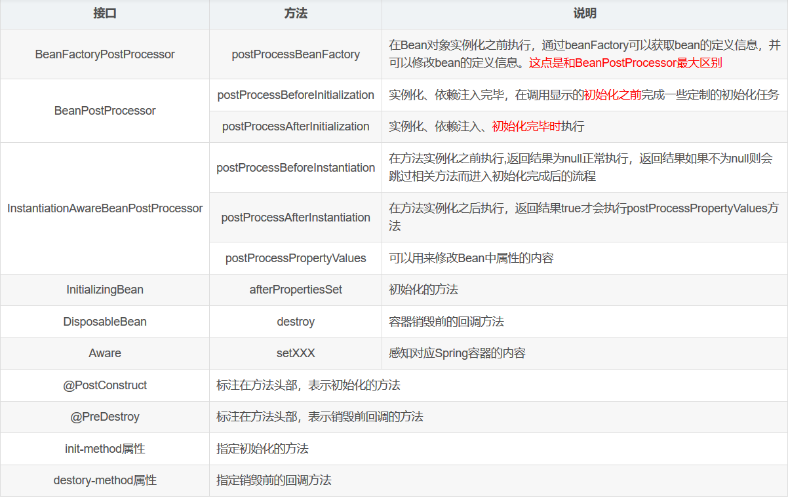

> bean 就是由 IOC  容器初始化、装配及管理的对象， bean 的定义以及 bean  相互间的依赖关系将通过配置元数据来描述。

[博客1](https://blog.csdn.net/qq_38526573/article/details/88143169?depth_1-utm_source=distribute.pc_relevant.none-task&utm_source=distribute.pc_relevant.none-task)

[博客2](https://snailclimb.gitee.io/javaguide/#/docs/system-design/framework/spring/SpringBean)

## 1 bean的作用域


> 五种作用域中，**request、session** 和 **global session** 三种作用域仅在基于web的应用中使用（不必关心你所采用的是什么web应用框架），只能用在基于 web 的 Spring ApplicationContext 环境。


> 如果 bean 的 scope 设为prototype时，当容器关闭时，destroy  方法不会被调用。
>
> **Spring 容器可以管理  singleton 作用域下 bean 的生命周期，在此作用域下，Spring  能够精确地知道bean何时被创建，何时初始化完成，以及何时被销毁。**
>
> **而对于 prototype  作用域的bean，Spring只负责创建，当容器创建了 bean 的实例后，bean  的实例就交给了客户端的代码管理，Spring容器将不再跟踪其生命周期，并且不会管理那些被配置成prototype作用域的bean的生命周期。**


### 1.1 singleton 

对于singleton作用域的Bean，每次请求该Bean都将获得相同的实例。容器负责跟踪Bean实例的状态，负责维护Bean实例的生命周期行为；

我们可以指定Bean节点的 `lazy-init=”true”`  来延迟初始化bean，这时候，第一次请求该bean时才初始化。  每次获取到的对象都是同一个对象。注意，singleton 作用域是Spring中的缺省作用域。要在XML中将 bean 定义成  singleton ，可以这样配置：

```xml
<bean id="ServiceImpl" class="cn.csdn.service.ServiceImpl" scope="singleton">
```

也可以通过 `@Scope` 注解（它可以显示指定bean的作用范围。）的方式

```java
@Service
@Scope("singleton")
public class ServiceImpl{

}
```


### 1.2 prototype

如果一个Bean被设置成prototype作用域，程序每次请求该id的Bean，Spring都会新建一个Bean实例，然后返回给程序。在这种情况下，Spring容器仅仅使用new 关键字创建Bean实例，一旦创建成功，容器不在跟踪实例，也不会维护Bean实例的状态。

在 XML 中将 bean 定义成 prototype ，可以这样配置：

```xml
<bean id="account" class="com.foo.DefaultAccount" scope="prototype"/>  
 或者
<bean id="account" class="com.foo.DefaultAccount" singleton="false"/> 
```

通过 `@Scope` 注解的方式实现就不做演示了。


# 2 bean的生命周期

### 2.1 自定义实现initialization 和 destroy

有时我们需要在Bean属性值set好之后和Bean销毁之前做一些事情，比如检查Bean中某个属性是否被正常的设置好值了。Spring框架提供了多种方法让我们可以在Spring  Bean的生命周期中执行initialization和pre-destroy方法。

**1.实现InitializingBean和DisposableBean接口**

这两个接口都只包含一个方法。通过实现InitializingBean接口的afterPropertiesSet()方法可以在Bean属性值设置好之后做一些操作，实现DisposableBean接口的destroy()方法可以在销毁Bean之前做一些操作。

例子如下：

```java
public class GiraffeService implements InitializingBean,DisposableBean {
    @Override
    public void afterPropertiesSet() throws Exception {
        System.out.println("执行InitializingBean接口的afterPropertiesSet方法");
    }
    @Override
    public void destroy() throws Exception {
        System.out.println("执行DisposableBean接口的destroy方法");
    }
}
```

这种方法比较简单，但是不建议使用。因为这样会将Bean的实现和Spring框架耦合在一起。


**2.在bean的配置文件中指定init-method和destroy-method方法**

Spring允许我们创建自己的 init 方法和 destroy 方法，只要在 Bean 的配置文件中指定 init-method 和 destroy-method 的值就可以在 Bean 初始化时和销毁之前执行一些操作。

例子如下：

```java
public class GiraffeService {
    //通过<bean>的destroy-method属性指定的销毁方法
    public void destroyMethod() throws Exception {
        System.out.println("执行配置的destroy-method");
    }
    //通过<bean>的init-method属性指定的初始化方法
    public void initMethod() throws Exception {
        System.out.println("执行配置的init-method");
    }
}
```

配置文件中的配置：

```xml
<bean name="giraffeService" class="com.giraffe.spring.service.GiraffeService" init-method="initMethod" destroy-method="destroyMethod">
</bean>
```

需要注意的是自定义的init-method和post-method方法可以抛异常但是不能有参数。

这种方式比较推荐，因为可以自己创建方法，无需将Bean的实现直接依赖于spring的框架。


**3.使用@PostConstruct和@PreDestroy注解**

除了xml配置的方式，Spring 也支持用 `@PostConstruct`和 `@PreDestroy`注解来指定 `init` 和 `destroy` 方法。这两个注解均在`javax.annotation` 包中。为了注解可以生效，需要在配置文件中定义org.springframework.context.annotation.CommonAnnotationBeanPostProcessor或context:annotation-config

例子如下：

```java
public class GiraffeService {
    @PostConstruct
    public void initPostConstruct(){
        System.out.println("执行PostConstruct注解标注的方法");
    }
    @PreDestroy
    public void preDestroy(){
        System.out.println("执行preDestroy注解标注的方法");
    }
}
```

配置文件：

```xml
<bean class="org.springframework.context.annotation.CommonAnnotationBeanPostProcessor" />
```


### 2.2 实现*Aware接口

有些时候我们需要在  Bean 的初始化中使用 Spring 框架自身的一些对象来执行一些操作，比如获取 ServletContext 的一些参数，获取  ApplicaitionContext 中的 BeanDefinition 的名字，获取 Bean 在容器中的名字等等。**为了让 Bean可以获取到框架自身的一些对象，Spring 提供了一组名为*Aware的接口。**

这些接口均继承于`org.springframework.beans.factory.Aware`标记接口，并提供一个将由 Bean 实现的set*方法,Spring通过基于setter的依赖注入方式使相应的对象可以被Bean使用。 网上说，这些接口是利用观察者模式实现的，类似于servlet listeners，目前还不明白，不过这也不在本文的讨论范围内。 介绍一些重要的Aware接口：

- **ApplicationContextAware**: 获得ApplicationContext对象,可以用来获取所有Bean definition的名字。
- **BeanFactoryAware**:获得BeanFactory对象，可以用来检测Bean的作用域。
- **BeanNameAware**:获得Bean在配置文件中定义的名字。
- **ResourceLoaderAware**:获得ResourceLoader对象，可以获得classpath中某个文件。
- **ServletContextAware**:在一个MVC应用中可以获取ServletContext对象，可以读取context中的参数。
- **ServletConfigAware**： 在一个MVC应用中可以获取ServletConfig对象，可以读取config中的参数。

```java
public class GiraffeService implements   ApplicationContextAware,
        ApplicationEventPublisherAware, BeanClassLoaderAware, BeanFactoryAware,
        BeanNameAware, EnvironmentAware, ImportAware, ResourceLoaderAware{
         @Override
    public void setBeanClassLoader(ClassLoader classLoader) {
        System.out.println("执行setBeanClassLoader,ClassLoader Name = " + classLoader.getClass().getName());
    }
    @Override
    public void setBeanFactory(BeanFactory beanFactory) throws BeansException {
        System.out.println("执行setBeanFactory,setBeanFactory:: giraffe bean singleton=" +  beanFactory.isSingleton("giraffeService"));
    }
    @Override
    public void setBeanName(String s) {
        System.out.println("执行setBeanName:: Bean Name defined in context="
                + s);
    }
    @Override
    public void setApplicationContext(ApplicationContext applicationContext) throws BeansException {
        System.out.println("执行setApplicationContext:: Bean Definition Names="
                + Arrays.toString(applicationContext.getBeanDefinitionNames()));
    }
    @Override
    public void setApplicationEventPublisher(ApplicationEventPublisher applicationEventPublisher) {
        System.out.println("执行setApplicationEventPublisher");
    }
    @Override
    public void setEnvironment(Environment environment) {
        System.out.println("执行setEnvironment");
    }
    @Override
    public void setResourceLoader(ResourceLoader resourceLoader) {
        Resource resource = resourceLoader.getResource("classpath:spring-beans.xml");
        System.out.println("执行setResourceLoader:: Resource File Name="
                + resource.getFilename());
    }
    @Override
    public void setImportMetadata(AnnotationMetadata annotationMetadata) {
        System.out.println("执行setImportMetadata");
    }
}
```


### 2.3 BeanPostProcessor

上面的*Aware接口是针对某个实现这些接口的Bean定制初始化的过程， Spring同样可以针对容器中的所有Bean，或者某些Bean定制初始化过程，只需提供一个实现BeanPostProcessor接口的类即可。 

 该接口中包含两个方法，postProcessBeforeInitialization和postProcessAfterInitialization。  postProcessBeforeInitialization方法会在容器中的Bean初始化之前执行，  postProcessAfterInitialization方法在容器中的Bean初始化之后执行。

例子如下：

```java
public class CustomerBeanPostProcessor implements BeanPostProcessor {
    @Override
    public Object postProcessBeforeInitialization(Object bean, String beanName) throws BeansException {
        System.out.println("执行BeanPostProcessor的postProcessBeforeInitialization方法,beanName=" + beanName);
        return bean;
    }
    @Override
    public Object postProcessAfterInitialization(Object bean, String beanName) throws BeansException {
        System.out.println("执行BeanPostProcessor的postProcessAfterInitialization方法,beanName=" + beanName);
        return bean;
    }
}
```

要将BeanPostProcessor的Bean像其他Bean一样定义在配置文件中

```xml
<bean class="com.giraffe.spring.service.CustomerBeanPostProcessor"/>
```


### 2.2 Spring Bean的生命周期

[推荐博客](https://www.cnblogs.com/lxyit/p/10120886.html)

在IoC容器启动之后，并不会马上就实例化相应的bean，此时容器仅仅拥有所有对象的BeanDefinition(BeanDefinition：是容器依赖某些工具加载的XML配置信息进行解析和分析，并将分析后的信息编组为相应的BeanDefinition)。**只有当getBean()调用时才是有可能触发Bean实例化阶段的活动**

> 方法说明



这里说的初始化之前初始化完毕，指的是下面两种：

1）bean实现了InitializingBean接口，对应的方法为`afterPropertiesSet`

2）在bean定义的时候，通过`init-method`设置的方法


> Spring Bean的生命周期

**对象实例化之前：**

1. 如果实现了BeanFactoryPostProcessor接口，那么在容器启动的时候，该接口中的postProcessBeanFactory方法可以修改Bean中元数据中的信息。该方法是在实例化对象之前执行
2. 如果实现了InstantiationAwareBeanPostProcessor接口，那么在实例化Bean对象之前会调用postProcessBeforeInstantiation方法。


**对象实例化：**

1. Bean容器找到配置文件中 Spring Bean 的定义。
2. Bean容器利用Java Reflection API创建一个Bean的实例。
3. 如果涉及到一些属性值 利用set方法设置一些属性值。
4. 如果Bean实现了BeanNameAware接口，调用setBeanName()方法，传入Bean的名字。
5. 如果Bean实现了BeanClassLoaderAware接口，调用setBeanClassLoader()方法，传入ClassLoader对象的实例。
6. 如果Bean实现了BeanFactoryAware接口，调用setBeanFactory()方法，传入BeanFactory对象的实例。
7. 与上面的类似，如果实现了其他*Aware接口，就调用相应的方法。
8. 如果实现了BeanPostProcessor接口，执行postProcessBeforeInitialization()方法。这个方法用于在显式调用初始化方法前做一些定制初始化任务。
9. 如果Bean实现了InitializingBean接口，执行afterPropertiesSet()方法。
10. 如果Bean在配置文件中的定义包含init-method属性，执行指定的方法。
11. 如果实现了BeanPostProcessor接口，执行postProcessAfterInitialization()方法

**对象销毁：**

1. 当要销毁Bean的时候，如果Bean实现了DisposableBean接口，执行destroy()方法。
2. 当要销毁Bean的时候，如果Bean在配置文件中的定义包含destroy-method属性，执行指定的方法。


> 详细介绍


**1.BeanFactoryPostProcessor**

bean工厂的bean属性处理容器，说通俗一些就是可以管理我们的bean工厂内所有的beandefinition（未实例化）数据，可以随心所欲的修改属性。 

> BeanDefinition：是容器依赖某些工具加载的XML配置信息进行解析和分析，并将分析后的信息编组为相应的BeanDefinition.他们都是还未实例化的，相当于剥好了运进工厂代加工的豆子原料。


**2.InstantiationAwareBeanPostProcessor**：

作用于实例化阶段的前后

- PostProcessBeforeInstantiation
- PostProcessPropertyValues
- PostProcessAfterInstantiation：是AOP很重要的一个方法，对bean进行了封装，过程包括了通过bean的Name和class匹配到bean的合适增强器，将bean和增强器等信息封装成代理类。

```java
@Override
    public Object postProcessAfterInitialization(Object bean, String beanName) throws BeansException {
    //bean 就是需要 被增强的类。
        if (bean != null) {
            Object cacheKey = getCacheKey(bean.getClass(), beanName);
            //防止 bean 多次被增强。
            if (!this.earlyProxyReferences.contains(cacheKey)) {
            //如果有必要 就进行封装，有没有必要主要取决于 bean 是否需要被增强。
                return wrapIfNecessary(bean, beanName, cacheKey);
            }
        }
        return bean;
    }

//======================wrapIfNecessary()===============================

/**
     *如果有必要 封装 bean
     */
protected Object wrapIfNecessary(Object bean, String beanName, Object cacheKey) {
		//如果已经处理过
        if (beanName != null && this.targetSourcedBeans.contains(beanName)) {
            return bean;
        }
		//如果不需要增强 就直接返回
        if (Boolean.FALSE.equals(this.advisedBeans.get(cacheKey))) {
            return bean;
        }
        //如果是一个 组件类，组件类包括Advice，Pointcut,Advisor,AopInfrastructureBean实现类，和Aspect注解注释的类，那么就标记为不需要增强的bean。所以 切面类 自己不会被AOP 增强。
        if (isInfrastructureClass(bean.getClass()) || shouldSkip(bean.getClass(), beanName)) {
            this.advisedBeans.put(cacheKey, Boolean.FALSE);
            return bean;
        }
        // getAdvicesAndAdvisorsForBean：这个方法会提取当前bean的所有增强方法，然后获取到适合的当前bean的增强方法，然后对增强方法进行排序，最后返回。 
        Object[] specificInterceptors = getAdvicesAndAdvisorsForBean(bean.getClass(), beanName, null);
        //如果匹配到增强器 那么就创建增强代理类。
        if (specificInterceptors != DO_NOT_PROXY) {
            this.advisedBeans.put(cacheKey, Boolean.TRUE);
            //创建 增强代理类
            Object proxy = createProxy(
                    bean.getClass(), beanName, specificInterceptors, new SingletonTargetSource(bean));
            this.proxyTypes.put(cacheKey, proxy.getClass());
            return proxy;
        }
        this.advisedBeans.put(cacheKey, Boolean.FALSE);
        return bean;
    }
```


