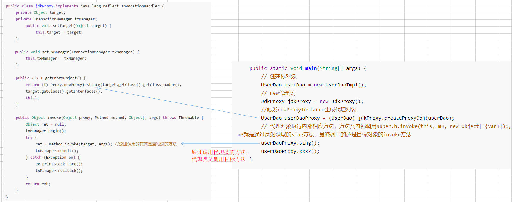

# 1 静态代理

**静态代理：**在程序运行前就已经存在代理类的字节码文件。AOP框架会在编译阶段生成AOP代理类，因此也称为编译时增强，他会在编译阶段将AspectJ(切面)织入到Java字节码中，运行的时候就是增强之后的AOP对象。 

```java
public class EmployeeServiceProxy implements IEmployeeService {
	private IEmployeeService target;
	private TransctionManager txManager;//事务
	public void setTarget(IEmployeeService target) {
		this.target = target;
	}
    
	public void setTxManager(TransctionManager txManager) {
		this.txManager = txManager;
	}
    
	public void save(Employee e) {
		txManager.begin();
	try {
		target.save(e);
		txManager.commit();
	} catch (Exception ex) {
		ex.printStackTrace();
		txManager.rollback();
	}
}
    
	public void update(Employee e) {
		txManager.begin();
	try {
		target.update(e);
		txManager.commit();
	} catch (Exception ex) {
		ex.printStackTrace();
		txManager.rollback();
		}
	}
}
```


xml：

```java
<bean id="transctionManager" class="cn.wolfcode.wms.tx.TransctionManager" />
<bean id="employeeDAO" class="cn.wolfcode.wms.dao.impl.EmployeeDAOImpl" />
<bean id="employeeServiceProxy" class="cn.wolfcode.wms.proxy.EmployeeServiceProxy">
	<property name="txManager" ref="transctionManager" />
    
	<property name="target">
		<bean class="cn.wolfcode.wms.service.impl.EmployeeServiceImpl">
			<property name="dao" ref="employeeDAO" />
		</bean>
	</property>
	
</bean>
```

**优点：**

1. 业务类只需要关注业务逻辑本身，保证了业务类的重用性。
2. 把真实对象隐藏起来了,保护真实对象

**缺点：**

1. 代理对象的某个接口只服务于某一种类型的对象，也就是说每一个真实对象都得创建一个代理对象。
2. 如果需要代理的方法很多，则要为每一种方法都进行代理处理。
3. 如果接口增加一个方法，除了所有实现类需要实现这个方法外，所有代理类也需要实现此方法。


# 2 动态代理

Spring AOP中的动态代理主要有两种方式：JDK动态代理和CGLIB动态代理。

代理模式：客户端直接使用的都是代理对象，不知道真实对象是谁，此时代理对象可以在客户端和真实对象之间起到中介的作用。

- **静态代理**：在程序运行前就已经存在代理类的字节码文件。AOP框架会在编译阶段生成AOP代理类，因此也称为编译时增强，他会在编译阶段将AspectJ(切面)织入到Java字节码中，运行的时候就是增强之后的AOP对象。 
- **动态代理**：动态代理类是在程序运行期间由JVM 通过反射等机制动态的生成的，所以不存在代理类的字节码文件，代理对象和真实对象的关系是在程序运行时期才确定的。

**如何实现动态代理：**
1）：针对有接口：使用**JDK 动态代理**
2）：针对无接口：使用**CGLIB 或Javassist 组件**


### 2.1 jdk动态代理

##### 2.1.1 代码

```java
public class jdkProxy implements java.lang.reflect.InvocationHandler {
	private Object target;
	private TransctionManager txManager;
		public void setTarget(Object target) {
			this.target = target;
	}
    
    public void setTxManager(TransctionManager txManager) {
		this.txManager = txManager;
	}
    
	public <T> T getProxyObject() {
		return (T) Proxy.newProxyInstance(target.getClass().getClassLoader(),
		target.getClass().getInterfaces(),
		this);
	}
    
	public Object invoke(Object proxy, Method method, Object[] args) throws Throwable {
		Object ret = null;
		txManager.begin();
		try {
			ret = method.invoke(target, args); //method.invoke()方法，用来执行某个的对象的目标方法
            								 //也就是通过反射调用目标对象的method方法2
			txManager.commit();
		} catch (Exception ex) {
			ex.printStackTrace();
			txManager.rollback();
		}
		return ret;
	}
}
```


> 测试

```java
    public static void main(String[] args) {
        // 创建标对象
        UserDao userDao = new UserDaoImpl();
        // new代理类
        JdkProxy jdkProxy = new JdkProxy();
        //触发newProxyInstance生成代理对象
        UserDao userDaoProxy = (UserDao) jdkProxy.createProxyObj(userDao);
        // 代理对象执行内部相应方法，方法又内部调用super.h.invoke(this, m3, new Object[]{var1});，m3就是通过反射获取的sing方法，最终调用的还是目标对象的invoke方法
        userDaoProxy.sing();
        userDaoProxy.xxx2();
    }

```


##### 2.2.2 原理



整体流程：

1.使用：创建了目标对象和代理类，然后用代理类执行目标对象的方法。创建代理类的时候会触发newProxyInstance方法。

2.newProxyInstance通过传入classloader和接口组还有一个InvocationHandler去生成一个动态代理类

* 2.1 他底层调用了getProxyClass0方法，传入了target的loader还有一组接口类得到动态代理对象。
* 2.2 通过动态代理对象调用getConstructor获取构造方法

final Constructor<?> cons = cl.getConstructor(constructorParams);

* 2.3 最后通过构造函数使用newInstance创建动态代理类实例。

3.然后最后一步调用方法的时候，会调用生成代理类中的相应方法，这个代理类就是newProxyInstance生成的，在代理方法内部调用的是super.h.invoke(this, m3, new Object[]{var1});，也就是
InvocationHandler的invoke方法，就是我们在目标方法中自定义写的invoke方法了。


> 看关键方法 newProxyInstance

1. 通过为 Proxy 类指定 ClassLoader 对象和一组 interface 来创建动态代理类；
2. 通过反射机制获得动态代理类的构造函数，其唯一参数类型是调用处理器接口类型；
3. 通过构造函数创建动态代理类实例，构造时调用处理器对象作为参数被传入。

```java
@CallerSensitive
    public static Object newProxyInstance(ClassLoader loader,
                                          Class<?>[] interfaces,
                                          InvocationHandler h)
            throws IllegalArgumentException
    {
        // 判断InvocationHandler是否为空，若为空，抛出空指针异常
        Objects.requireNonNull(h);

        final Class<?>[] intfs = interfaces.clone(); //clone接口
        final SecurityManager sm = System.getSecurityManager();
        if (sm != null) {
            checkProxyAccess(Reflection.getCallerClass(), loader, intfs);
        }

        /*
         * 调用了getProxyClass0得到动态代理类，传入参数为ClassLoader 对象和一组 interface 
         */
        Class<?> cl = getProxyClass0(loader, intfs); //传入目标对象的接口和classloader

        try {
            if (sm != null) {
                checkNewProxyPermission(Reflection.getCallerClass(), cl);
            }

		    //2.使用自定义的InvocationHandler作为参数，通过反射机制获得动态代理类的构造函数
            final Constructor<?> cons = cl.getConstructor(constructorParams);
            final InvocationHandler ih = h;
            if (!Modifier.isPublic(cl.getModifiers())) {
                AccessController.doPrivileged(new PrivilegedAction<Void>() {
                    public Void run() {
                        cons.setAccessible(true);
                        return null;
                    }
                });
            }
            //3.通过构造函数使用newInstance创建动态代理类实例，构造时调用处理器对象作为参数被传入
            return cons.newInstance(new Object[]{h}); 
        } catch (IllegalAccessException|InstantiationException e) {
            throw new InternalError(e.toString(), e);
        } catch (InvocationTargetException e) {
            Throwable t = e.getCause();
            if (t instanceof RuntimeException) {
                throw (RuntimeException) t;
            } else {
                throw new InternalError(t.toString(), t);
            }
        } catch (NoSuchMethodException e) {
            throw new InternalError(e.toString(), e);
        }
    }
```


> getProxyClass0()

```java
private static Class<?> getProxyClass0(ClassLoader loader,
                                           Class<?>... interfaces) {
        // 判断委托类的接口数量，超载直接抛出异常
        if (interfaces.length > 65535) {
            throw new IllegalArgumentException("interface limit exceeded");
        }

        // 声明代理类对象
        Class<?> proxyClass = null;

        /* collect interface names to use as key for proxy class cache */
        String[] interfaceNames = new String[interfaces.length];

        // for detecting duplicates
        Set<Class<?>> interfaceSet = new HashSet<>();

      /**
        * 入参 interfaces 检验，包含三部分
        * （1）是否在入参指定的 ClassLoader 内
        * （2）是否是 Interface
        * （3）interfaces 中是否有重复
        */
        for (int i = 0; i < interfaces.length; i++) {
            /*
             * Verify that the class loader resolves the name of this
             * interface to the same Class object.
             */
            String interfaceName = interfaces[i].getName();
            Class<?> interfaceClass = null;
            try {
                interfaceClass = Class.forName(interfaceName, false, loader);
            } catch (ClassNotFoundException e) {
            }
            if (interfaceClass != interfaces[i]) {
                throw new IllegalArgumentException(
                    interfaces[i] + " is not visible from class loader");
            }

            /*
             * Verify that the Class object actually represents an
             * interface.
             */
            if (!interfaceClass.isInterface()) {
                throw new IllegalArgumentException(
                    interfaceClass.getName() + " is not an interface");
            }

            /*
             * Verify that this interface is not a duplicate.
             */
            if (interfaceSet.contains(interfaceClass)) {
                throw new IllegalArgumentException(
                    "repeated interface: " + interfaceClass.getName());
            }
            interfaceSet.add(interfaceClass);

            interfaceNames[i] = interfaceName;
        }

  
        // 以接口名对应的 List 作为缓存的 key
        List<String> key = Arrays.asList(interfaceNames);

        /*
         * Find or create the proxy class cache for the class loader.
         */
        /*
        * loaderToCache 是个双层的 Map
        * 第一层 key 为 ClassLoader，第二层 key 为 上面的 List，value 为代理类的弱引用
        */
        Map<List<String>, Object> cache;
        synchronized (loaderToCache) {
            cache = loaderToCache.get(loader);
            if (cache == null) {
                cache = new HashMap<>();
                loaderToCache.put(loader, cache);
            }

        }

      
        /*
         * 以上面的接口名对应的 List 为 key 查找代理类，如果结果为：
         * (1) 弱引用，表示代理类已经在缓存中
         * (2) pendingGenerationMarker 对象，表示代理类正在生成中，等待生成完成通知。
         * (3) null 表示不在缓存中且没有开始生成，添加标记到缓存中，继续生成代理类
         */
        synchronized (cache) {
            do {
                Object value = cache.get(key);
                if (value instanceof Reference) {
                    proxyClass = (Class<?>) ((Reference) value).get();
                }
                if (proxyClass != null) {
                    // proxy class already generated: return it
                    return proxyClass;
                } else if (value == pendingGenerationMarker) {
                    // proxy class being generated: wait for it
                    try {
                        cache.wait();
                    } catch (InterruptedException e) {
                        /*
                         * The class generation that we are waiting for should
                         * take a small, bounded time, so we can safely ignore
                         * thread interrupts here.
                         */
                    }
                    continue;
                } else {
                    /*
                     * No proxy class for this list of interfaces has been
                     * generated or is being generated, so we will go and
                     * generate it now.  Mark it as pending generation.
                     */
                    cache.put(key, pendingGenerationMarker);
                    break;
                }
            } while (true);
        }

        try {
            String proxyPkg = null;     // package to define proxy class in

            /*
             * Record the package of a non-public proxy interface so that the
             * proxy class will be defined in the same package.  Verify that
             * all non-public proxy interfaces are in the same package.
             */
            /*
             * 如果 interfaces 中存在非 public 的接口，则所有非 public 接口必须在同一包下面，后续生成的代理类也会在该包下面
              */
            for (int i = 0; i < interfaces.length; i++) {
                int flags = interfaces[i].getModifiers();
                if (!Modifier.isPublic(flags)) {
                    String name = interfaces[i].getName();
                    int n = name.lastIndexOf('.');
                    String pkg = ((n == -1) ? "" : name.substring(0, n + 1));
                    if (proxyPkg == null) {
                        proxyPkg = pkg;
                    } else if (!pkg.equals(proxyPkg)) {
                        throw new IllegalArgumentException(
                            "non-public interfaces from different packages");
                    }
                }
            }

            if (proxyPkg == null) {
                // if no non-public proxy interfaces, use the default package.
                proxyPkg = "";
            }

            {
                // Android-changed: Generate the proxy directly instead of calling
                // through to ProxyGenerator.
                List<Method> methods = getMethods(interfaces);
                Collections.sort(methods, ORDER_BY_SIGNATURE_AND_SUBTYPE);
                validateReturnTypes(methods);
                List<Class<?>[]> exceptions = deduplicateAndGetExceptions(methods);

                Method[] methodsArray = methods.toArray(new Method[methods.size()]);
                Class<?>[][] exceptionsArray = exceptions.toArray(new Class<?>[exceptions.size()][]);

                /*
                 * Choose a name for the proxy class to generate.
                 */
                final long num;
                synchronized (nextUniqueNumberLock) {
                    num = nextUniqueNumber++;
                }
                String proxyName = proxyPkg + proxyClassNamePrefix + num;

                // 动态生成代理类的字节码
                // 最终调用 sun.misc.ProxyGenerator.generateClassFile() 得到代理类相关信息写入 DataOutputStream 实现
                proxyClass = generateProxy(proxyName, interfaces, loader, methodsArray,
                        exceptionsArray);
            }
            // add to set of all generated proxy classes, for isProxyClass
            proxyClasses.put(proxyClass, null);

        } finally {
            /*
             * We must clean up the "pending generation" state of the proxy
             * class cache entry somehow.  If a proxy class was successfully
             * generated, store it in the cache (with a weak reference);
             * otherwise, remove the reserved entry.  In all cases, notify
             * all waiters on reserved entries in this cache.
             */
            synchronized (cache) {
                if (proxyClass != null) {
                    cache.put(key, new WeakReference<Class<?>>(proxyClass));
                } else {
                    cache.remove(key);
                }
                cache.notifyAll();
            }
        }
        return proxyClass;
    }
```


> 案例

假设我们有一个接口single

```java
public interface Singer {
    public void perform(String soonName);
}
```

具体类jay继承Single

```java
public class Jay implements Singer {
  
    public void perform(String soonName) {
        System.out.println("接下来我为大家唱一首"+soonName);
    }
}
```


> 然后我们用jdk对jay方法进行代理，看下面生成的代理字节码

这里主要看到有4个方法，method的m1，m2，m3，m0;分别由反射获取，并且由equals()、toString()、perform()、hashcode()方法调用。

在代理类中会自动继承原始接口类并且会调用InvocationHandler将接口类中的方法传入进去

```java
//可以看到继承Single接口，注意这里的Proxy类！！！！
public final class $Proxy0 extends Proxy implements Singer {
    private static Method m1;
    private static Method m2;
    private static Method m3;
    private static Method m0;

    public $Proxy0(InvocationHandler var1) throws  {
        super(var1);
    }

    public final boolean equals(Object var1) throws  {
       ...
    }

    public final String toString() throws  {
        ...
    }

    /*
    1.m3:通过静态代码块+反射获取 Class.forName("main.learn.proxy.Singer").getMethod("perform", Class.forName("java.lang.String"));
    
    2.重写了perform方法。使用InvocationHandler调用m3，并且传入参数
    */
    
    public final void perform(String var1) throws  {
        try {
            super.h.invoke(this, m3, new Object[]{var1}); //
        } catch (RuntimeException | Error var3) {
            throw var3;
        } catch (Throwable var4) {
            throw new UndeclaredThrowableException(var4);
        }
    }

    public final int hashCode() throws  {
      ...
    }

    static {
        try {
            m1 = Class.forName("java.lang.Object").getMethod("equals", Class.forName("java.lang.Object"));
            m2 = Class.forName("java.lang.Object").getMethod("toString");
            m3 = Class.forName("main.learn.proxy.Singer").getMethod("perform", Class.forName("java.lang.String"));
            m0 = Class.forName("java.lang.Object").getMethod("hashCode");
        } catch (NoSuchMethodException var2) {
            throw new NoSuchMethodError(var2.getMessage());
        } catch (ClassNotFoundException var3) {
            throw new NoClassDefFoundError(var3.getMessage());
        }
    }
}
```


### 2.2 CGLIB 动态代理

使用JDK 的动态代理，只能针对于目标对象存在接口的情况，如果目标对象没有接口，此时可以考虑使用CGLIB 的动态代理方式。

```java
public class TransctionManagerInvocationHandler implements org.springframework.cglib.proxy.InvocationHandler {
    
	private Object target;
	private TransctionManager txManager;
	public void setTarget(Object target) {
		this.target = target;
	}
    
	public void setTxManager(TransctionManager txManager) {
		this.txManager = txManager;
	}
    
	public <T> T getProxyObject() {
		Enhancer enhancer = new Enhancer();
		enhancer.setSuperclass(target.getClass());
		enhancer.setCallback(this);
		return (T) enhancer.create();
	}
    
	public Object invoke(Object proxy, Method method, Object[] args) throws Throwable {
		Object ret = null;
		txManager.begin();
	try {
		ret = method.invoke(target, args);
		txManager.commit();
	} catch (Exception ex) {
		ex.printStackTrace();
		txManager.rollback();
	}
	return ret;
	}
}
```


# 3 JDK&CGLIB代理总结

**JDK 动态代理总结：**

1. JAVA 动态代理是使用java.lang.reflect 包中的Proxy 类与InvocationHandler 接口这两个来完成的。

2. 要使用JDK 动态代理，委托必须要定义接口。

3. JDK 动态代理将会拦截所有pubic 的方法（因为只能调用接口中定义的方法），这样即使在接口中增加了新的方法，不用修改代码也会被拦截。

4. 动态代理的最小单位是类(所有类中的方法都会被处理)，如果只想拦截一部分方法，可以在invoke 方法中对要执行的方法名进行判断。

    

**CGLIB 代理总结：**

1. CGLIB 可以生成委托类的子类，并重写父类非final 修饰符的方法。
2. 要求类不能是final 的，要拦截的方法要是非final、非static、非private 的。
3. 动态代理的最小单位是类(所有类中的方法都会被处理);

