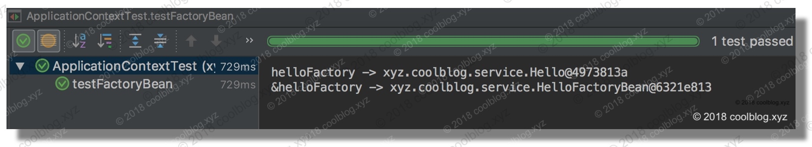
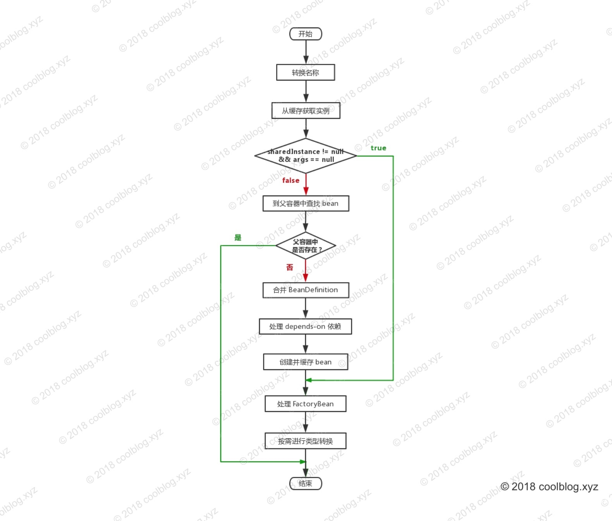
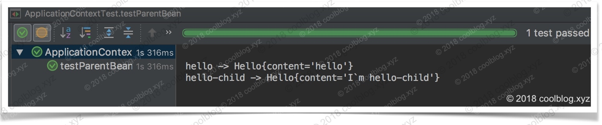
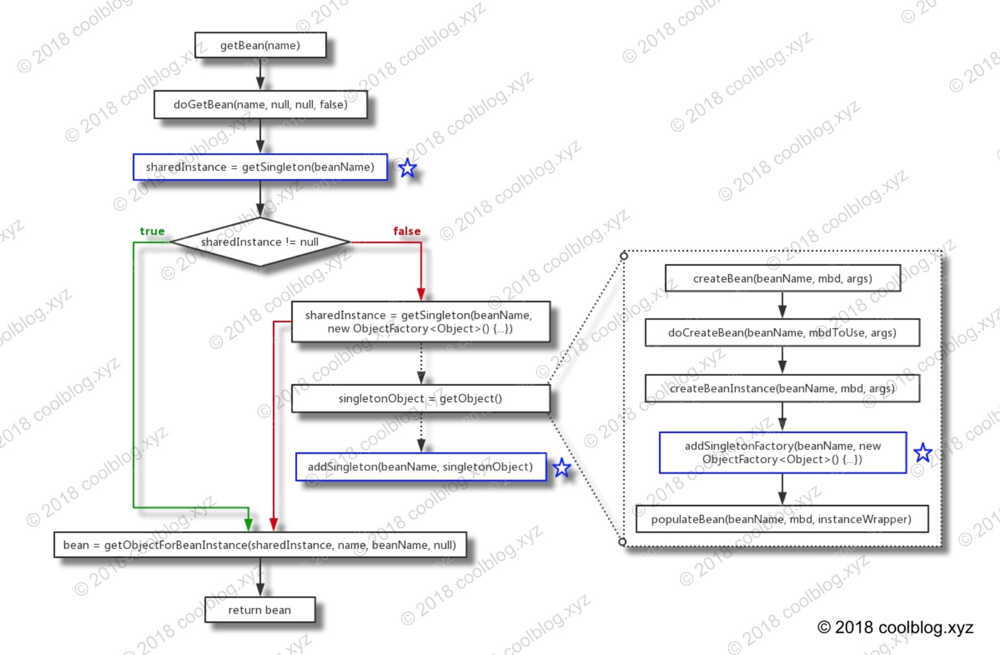
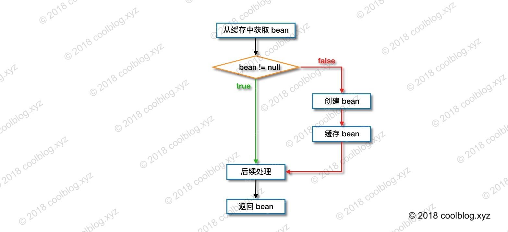
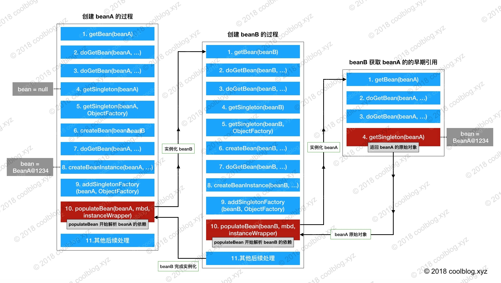

> 基于`Spring 4.3.17.RELEASE` 

[Spring IOC 容器源码分析系列文章导读](http://www.coolblog.xyz/2018/05/30/Spring-IOC-%E5%AE%B9%E5%99%A8%E6%BA%90%E7%A0%81%E5%88%86%E6%9E%90%E7%B3%BB%E5%88%97%E6%96%87%E7%AB%A0%E5%AF%BC%E8%AF%BB/)

[Spring IOC 容器源码分析 - 获取单例 bean](http://www.coolblog.xyz/2018/06/01/Spring-IOC-%E5%AE%B9%E5%99%A8%E6%BA%90%E7%A0%81%E5%88%86%E6%9E%90-%E8%8E%B7%E5%8F%96%E5%8D%95%E4%BE%8B-bean/)

[Spring IOC 容器源码分析 - 创建单例 bean 的过程](http://www.coolblog.xyz/2018/06/04/Spring-IOC-%E5%AE%B9%E5%99%A8%E6%BA%90%E7%A0%81%E5%88%86%E6%9E%90-%E5%88%9B%E5%BB%BA%E5%8D%95%E4%BE%8B-bean/)

[Spring IOC 容器源码分析 - 创建原始 bean 对象](http://www.coolblog.xyz/2018/06/06/Spring-IOC-%E5%AE%B9%E5%99%A8%E6%BA%90%E7%A0%81%E5%88%86%E6%9E%90-%E5%88%9B%E5%BB%BA%E5%8E%9F%E5%A7%8B-bean-%E5%AF%B9%E8%B1%A1/)

[Spring IOC 容器源码分析 - 循环依赖的解决办法](http://www.coolblog.xyz/2018/06/08/Spring-IOC-%E5%AE%B9%E5%99%A8%E6%BA%90%E7%A0%81%E5%88%86%E6%9E%90-%E5%BE%AA%E7%8E%AF%E4%BE%9D%E8%B5%96%E7%9A%84%E8%A7%A3%E5%86%B3%E5%8A%9E%E6%B3%95/) 

[Spring IOC 容器源码分析 - 填充属性到 bean 原始对象](http://www.coolblog.xyz/2018/06/11/Spring-IOC-%E5%AE%B9%E5%99%A8%E6%BA%90%E7%A0%81%E5%88%86%E6%9E%90-%E5%A1%AB%E5%85%85%E5%B1%9E%E6%80%A7%E5%88%B0-bean-%E5%8E%9F%E5%A7%8B%E5%AF%B9%E8%B1%A1/) 

[Spring IOC 容器源码分析 - 余下的初始化工作](http://www.coolblog.xyz/2018/06/11/Spring-IOC-%E5%AE%B9%E5%99%A8%E6%BA%90%E7%A0%81%E5%88%86%E6%9E%90-%E4%BD%99%E4%B8%8B%E7%9A%84%E5%88%9D%E5%A7%8B%E5%8C%96%E5%B7%A5%E4%BD%9C/) 


# 一些基础知识

## 1.什么是IOC

反控：就是控制反转，是指创建对象的控制权的转移，以前创建对象的主动权和时机是由自己把控的，而现在这种权力转移到Spring容器中，并由容器根据配置文件去创建实例和管理各个实例之间的依赖关系，对象与对象之间松散耦合，也利于功能的复用。

> Spring的IOC有三种注入方式 ：构造器注入、setter方法注入、根据注解注入。

举个例子："对象a 依赖了对象 b，当对象 a 需要使用 对象 b的时候必须自己去创建。但是当系统引入了 IOC 容器后， 对象a 和对象 b  之前就失去了直接的联系。这个时候，当对象 a 需要使用 对象 b的时候， 我们可以指定 IOC 容器去创建一个对象b注入到对象 a 中"。 对象 a 获得依赖对象 b 的过程,由主动行为变为了被动行为，控制权翻转，这就是控制反转名字的由来。 


简单来说，**IOC管理bean原理**：

1. 通过Resource 对象加载配置文件

2. 解析配置文件，得到指定名称的bean

3. 解析bean 元素，id 作为bean 的名字，class 用于反射得到bean 的实例：

   注意：此时，bean 类必须存在一个无参数构造器(和访问权限无关)；

4. 调用getBean 方法的时候，从容器中返回对象实例；


## 2 FactoryBean

FactoryBean？看起来是不是很像 BeanFactory 孪生兄弟。不错，他们看起来很像，但是他们是不一样的。FactoryBean  是一种工厂 bean，与普通的 bean 不一样，FactoryBean 是一种可以产生 bean 的  bean。FactoryBean 是一个接口，我们可以实现这个接口。下面演示一下： 

> 继承FactoryBean接口

```java
public class HelloFactoryBean implements FactoryBean<Hello> {

    @Override
    public Hello getObject() throws Exception {
        Hello hello = new Hello();
        hello.setContent("hello");
        return hello;
    }

    @Override
    public Class<?> getObjectType() {
        return Hello.class;
    

    @Override
    public boolean isSingleton() {
        return true;
    }
}
```


> 配置如下

```xml
<bean id="helloFactory" class="xyz.coolblog.service.HelloFactoryBean"/>
```


> 测试代码

```java
public class ApplicationContextTest {

    @Test
    public void testFactoryBean() {
        ApplicationContext applicationContext = new ClassPathXmlApplicationContext("application-factory-bean.xml");
        System.out.println("helloFactory -> " + applicationContext.getBean("helloFactory"));
        System.out.println("&helloFactory -> " + applicationContext.getBean("&helloFactory"));
    }
}
```


> 测试结果如下



当我们调用 getBean(“helloFactory”) 时，ApplicationContext 会返回一个 Hello 对象，该对象是 HelloFactoryBean 的 getObject 方法所创建的。

如果我们想获取 HelloFactoryBean  本身，则可以在 helloFactory 前加上一个前缀`&`，即`&helloFactory`。 


# :tada: 源码

> ApplicationContext创建获取bean

```java
@Test
void testBeanApplicationContext() throws Exception {
    ApplicationContext ctx = new
ClassPathXmlApplicationContext("classpath:applicationfile.xml");//已创建好所有bean
ctx.getBean("someBean", SomeBean.class);
}
```


# 1 获取单例Bean 

## 1.1 getBean

 doGetBean 的执行流程。如下：

1.转换 beanName  

- 如果是FactoryBean，那么就是&开头，需要去&

- 如果传入的是alias，那么需要根据alias转换为真正代表的

2.从缓存中获取实例

 `Object sharedInstance = getSingleton(beanName);`

3.如果实例不为空，且 args = null。调用 getObjectForBeanInstance 方法，并按 name 规则返回相应的 bean 实例

4.若实例为空，两种情况：bean还没创建或者当前容器有父容器，beanName 对应的 bean 实例可能是在父容器中被创建。

- 调用parentBeanFactory.getBean()到父容器中查找 bean 实例

5.若父容器中不存在，则进行下一步操作 – 合并BeanDefinition

 `final RootBeanDefinition mbd = getMergedLocalBeanDefinition(beanName);`

6.处理依赖Bean

 `String[] dependsOn = mbd.getDependsOn();`

7.创建并缓存 bean，分三种情况：单例，多例，其他类型

- 单例方式则调用`getSingleton`的`createBean`创建
- 多例调用`getObjectForBeanInstance`方法

8.最后按需转换 bean 类型，并返回转换后的 bean 实例。

以上步骤对应的流程图如下：




```java
public Object getBean(String name) throws BeansException {
    // getBean 是一个空壳方法，所有的逻辑都封装在 doGetBean 方法中
    return doGetBean(name, null, null, false);
}

protected <T> T doGetBean(
        final String name, final Class<T> requiredType, final Object[] args, boolean typeCheckOnly)
        throws BeansException {

    /*    
     * 1.如果是FactoryBean，那么就是&开头，需要去&
     * 2.如果传入的是alias，那么需要根据alias转换为真正代表的beanName
     */
    final String beanName = transformedBeanName(name);
    Object bean;

    /*
     * 从缓存集合中获取单例 bean，这里的集合有三种：
        1.singletonObjects：用于存放完全初始化好的 bean 
        2.earlySingletonObjects： 用于存放还在初始化中的 bean 
        3.singletonFactories：用于存放 bean 工厂。bean 工厂所产生的 bean 是还未完成初始化的 bean
     */
    Object sharedInstance = getSingleton(beanName);

    /*
     * 如果 sharedInstance = null，则说明缓存里没有对应的实例，表明这个实例还没创建。
     * BeanFactory 并不会在一开始就将所有的单例 bean 实例化好，而是在调用 getBean 获取 
     * bean 时再实例化，也就是懒加载。
     * getBean 方法有很多重载，比如 getBean(String name, Object... args)，我们在首次获取
     * 某个 bean 时，可以传入用于初始化 bean 的参数数组（args），BeanFactory 会根据这些参数
     * 去匹配合适的构造方法构造 bean 实例。当然，如果单例 bean 早已创建好，这里的 args 就没有
     * 用了，BeanFactory 不会多次实例化单例 bean。
     */
    if (sharedInstance != null && args == null) {
        if (logger.isDebugEnabled()) {
            if (isSingletonCurrentlyInCreation(beanName)) {
                logger.debug("Returning eagerly cached instance of singleton bean '" + beanName +
                        "' that is not fully initialized yet - a consequence of a circular reference");
            }
            else {
                logger.debug("Returning cached instance of singleton bean '" + beanName + "'");
            }
        }
      
        /*
         * 如果 sharedInstance 是普通的单例 bean，下面的方法会直接返回。
         *但如果 sharedInstance 是 FactoryBean 类型的，则需调用 getObject 工厂方法获取真正的 
         * bean 实例。如果用户想获取 FactoryBean 本身，这里也不会做特别的处理，直接返回
         * 即可。毕竟 FactoryBean 的实现类本身也是一种 bean，只不过具有一点特殊的功能而已。
         */
        bean = getObjectForBeanInstance(sharedInstance, name, beanName, null);
    }
    
    
    /*
     *sharedInstance为空，此时两种可能：
      1.beanName 对应的bean实例可能还未创建。
      2.当前容器有父容器，beanName 对应的 bean 实例可能是在父容器中被创建了，所以在创建实例前，需要先去父容器里检查一下。
     */
    else {
        // BeanFactory 不缓存 Prototype 类型的 bean，无法处理该类型 bean 的循环依赖问题
        if (isPrototypeCurrentlyInCreation(beanName)) {
            throw new BeanCurrentlyInCreationException(beanName);
        }

        // 如果 sharedInstance = null，则到父容器中查找 bean 实例
        BeanFactory parentBeanFactory = getParentBeanFactory();
        if (parentBeanFactory != null && !containsBeanDefinition(beanName)) {
            // 获取 name 对应的 beanName，如果 name 是以 & 字符开头，则返回 & + beanName
            String nameToLookup = originalBeanName(name);
            // 根据 args 是否为空，以决定调用父容器哪个方法获取 bean
            if (args != null) {
                return (T) parentBeanFactory.getBean(nameToLookup, args);
            } 
            else {
                return parentBeanFactory.getBean(nameToLookup, requiredType);
            }
        }

        if (!typeCheckOnly) {
            markBeanAsCreated(beanName);
        }

        try {
            // 合并父 BeanDefinition 与子 BeanDefinition，后面会单独分析这个方法
            final RootBeanDefinition mbd = getMergedLocalBeanDefinition(beanName);
            checkMergedBeanDefinition(mbd, beanName, args);

            // 检查是否有 dependsOn 依赖，如果有则先初始化所依赖的 bean
            String[] dependsOn = mbd.getDependsOn();
            if (dependsOn != null) {
                for (String dep : dependsOn) {
                    /*
                     * 检测是否存在 depends-on 循环依赖，若存在则抛异常。比如 A 依赖 B，
                     * B 又依赖 A，他们的配置如下：
                     *   <bean id="beanA" class="BeanA" depends-on="beanB">
                     *   <bean id="beanB" class="BeanB" depends-on="beanA">
                     *   
                     * beanA 要求 beanB 在其之前被创建，但 beanB 又要求 beanA 先于它
                     * 创建。这个时候形成了循环，对于 depends-on 循环，Spring 会直接
                     * 抛出异常
                     */
                    if (isDependent(beanName, dep)) {
                        throw new BeanCreationException(mbd.getResourceDescription(), beanName,
                                "Circular depends-on relationship between '" + beanName + "' and '" + dep + "'");
                    }
                    // 注册依赖记录
                    registerDependentBean(dep, beanName);
                   
                    // 加载 depends-on 依赖的Bean
                     getBean(dep);
                    } 
                   
                }
            }

            // 创建 bean 实例
            if (mbd.isSingleton()) {//mdf  -> 类型：RootBeanDefinition
                /*
                 * 这里并没有直接调用 createBean 方法创建 bean 实例，而是通过 
                 * getSingleton(String, ObjectFactory) 方法获取 bean 实例。
                 * getSingleton(String, ObjectFactory) 方法会在内部调用 
                 * ObjectFactory 的 getObject() 方法创建 bean，并会在创建完成后，
                 * 将 bean 放入缓存中。关于 getSingleton 方法的分析，本文先不展开，我会在
                 * 后面的文章中进行分析
                 */
                sharedInstance = getSingleton(beanName, new ObjectFactory<Object>() {
                    @Override
                    public Object getObject() throws BeansException {
                        try {
                            // 创建 bean 实例
                            return createBean(beanName, mbd, args);
                        }
                        catch (BeansException ex) {
                            destroySingleton(beanName);
                            throw ex;
                        }
                    }
                });
                
                // 如果 bean 是 FactoryBean 类型，则调用工厂方法获取真正的 bean 实例。否则直接返回 bean 实例
                bean = getObjectForBeanInstance(sharedInstance, name, beanName, mbd);
            }

            // 创建 prototype 类型的 bean 实例
            else if (mbd.isPrototype()) {
                Object prototypeInstance = null;
                try {
                    beforePrototypeCreation(beanName);
                    prototypeInstance = createBean(beanName, mbd, args);
                }
                finally {
                    afterPrototypeCreation(beanName);
                }
                bean = getObjectForBeanInstance(prototypeInstance, name, beanName, mbd);
            }

            // 创建其他类型的 bean 实例
            else {
                String scopeName = mbd.getScope();
                final Scope scope = this.scopes.get(scopeName);
                if (scope == null) {
                    throw new IllegalStateException("No Scope registered for scope name '" + scopeName + "'");
                }
                try {
                    Object scopedInstance = scope.get(beanName, new ObjectFactory<Object>() {
                        @Override
                        public Object getObject() throws BeansException {
                            beforePrototypeCreation(beanName);
                            try {
                                return createBean(beanName, mbd, args);
                            }
                            finally {
                                afterPrototypeCreation(beanName);
                            }
                        }
                    });
                    bean = getObjectForBeanInstance(scopedInstance, name, beanName, mbd);
                }
                catch (IllegalStateException ex) {
                    throw new BeanCreationException(beanName,
                            "Scope '" + scopeName + "' is not active for the current thread; consider " +
                            "defining a scoped proxy for this bean if you intend to refer to it from a singleton",
                            ex);
                }
            }
        }
        catch (BeansException ex) {
            cleanupAfterBeanCreationFailure(beanName);
            throw ex;
        }
    }

    // 如果需要进行类型转换，则在此处进行转换。类型转换这一块我没细看，就不多说了。
    if (requiredType != null && bean != null && !requiredType.isInstance(bean)) {
        try {
            return getTypeConverter().convertIfNecessary(bean, requiredType);
        }
        catch (TypeMismatchException ex) {
            if (logger.isDebugEnabled()) {
                logger.debug("Failed to convert bean '" + name + "' to required type '" +
                        ClassUtils.getQualifiedName(requiredType) + "'", ex);
            }
            throw new BeanNotOfRequiredTypeException(name, requiredType, bean.getClass());
        }
    }

    // 返回 bean
    return (T) bean;
}
```


## 1.2 getBean内方法解析

#### 1.2.1 transformedBeanName()

> beanName 转换

在获取 bean 实例之前，Spring 第一件要做的事情是对参数 name 进行转换。转换的目的主要是为了解决两个问题，第一个是处理以字符  & 开头的 name，防止 BeanFactory 无法找到与 name 对应的 bean 实例。第二个是处理别名问题，Spring  不会存储 <别名, bean 实例> 这种映射，仅会存储 <beanName, bean>。所以，同样是为了避免  BeanFactory 找不到 name 对应的 bean 的实例，对于别名也要进行转换。接下来，我们来简单分析一下转换的过程，如下： 

```java
protected String transformedBeanName(String name) {
    // 这里调用了两个方法：BeanFactoryUtils.transformedBeanName(name) 和 canonicalName
    return canonicalName(BeanFactoryUtils.transformedBeanName(name));
}

/** 该方法用于处理 & 字符 */
public static String transformedBeanName(String name) {
    Assert.notNull(name, "'name' must not be null");
    String beanName = name;
    // 循环处理 & 字符。比如 name = "&&&&&helloService"，最终会被转成 helloService
    while (beanName.startsWith(BeanFactory.FACTORY_BEAN_PREFIX)) {
        beanName = beanName.substring(BeanFactory.FACTORY_BEAN_PREFIX.length());
    }
    return beanName;
}

/** 该方法用于转换别名 */
public String canonicalName(String name) {
    String canonicalName = name;
    String resolvedName;
    /*
     * 这里使用 while 循环进行处理，原因是：可能会存在多重别名的问题，即别名指向别名。比如下面
     * 的配置：
     *   <bean id="hello" class="service.Hello"/>
     *   <alias name="hello" alias="aliasA"/>
     *   <alias name="aliasA" alias="aliasB"/>
     *
     * 上面的别名指向关系为 aliasB -> aliasA -> hello，对于上面的别名配置，aliasMap 中数据
     * 视图为：aliasMap = [<aliasB, aliasA>, <aliasA, hello>]。通过下面的循环解析别名
     * aliasB 最终指向的 beanName
     */
    do {
        resolvedName = this.aliasMap.get(canonicalName);
        if (resolvedName != null) {
                canonicalName = resolvedName;
        }
    }
    while (resolvedName != null);
    return canonicalName;
}
```


#### 1.2.2 getSingleton()

> 从缓存中获取 bean 实例

对于单例 bean，Spring 容器只会实例化一次。后续再次获取时，只需直接从缓存里获取即可，无需且不能再次实例化。 

```java
public Object getSingleton(String beanName) {
    return getSingleton(beanName, true);
}

/**
 * 这里解释一下 allowEarlyReference 参数，allowEarlyReference 表示是否允许其他 bean 引用
 * 正在创建中的 bean，用于处理循环引用的问题。关于循环引用，这里先简单介绍一下。先看下面的配置：
 *
 *   <bean id="hello" class="xyz.coolblog.service.Hello">
 *       <property name="world" ref="world"/>
 *   </bean>
 *   <bean id="world" class="xyz.coolblog.service.World">
 *       <property name="hello" ref="hello"/>
 *   </bean>
 * 
 * 如上所示，hello 依赖 world，world 又依赖于 hello，他们之间形成了循环依赖。Spring 在构建 
 * hello 这个 bean 时，会检测到它依赖于 world，于是先去实例化 world。实例化 world 时，发现 
 * world 依赖 hello。这个时候容器又要去初始化 hello。由于 hello 已经在初始化进程中了，为了让 
 * world 能完成初始化，这里先让 world 引用正在初始化中的 hello。world 初始化完成后，hello 
 * 就可引用到 world 实例，这样 hello 也就能完成初始了。关于循环依赖，我后面会专门写一篇文章讲解，这里先说这么多。
 */
protected Object getSingleton(String beanName, boolean allowEarlyReference) {
    // 从 singletonObjects 获取实例，singletonObjects 中缓存的实例都是完全实例化好的 bean，可以直接使用
    Object singletonObject = this.singletonObjects.get(beanName);
    /*
     * 如果 singletonObject = null，表明还没创建，或者还没完全创建好。
     */
    if (singletonObject == null && isSingletonCurrentlyInCreation(beanName)) {
        synchronized (this.singletonObjects) {
            // 从 earlySingletonObjects 中获取提前曝光的 bean，用于处理循环引用
            singletonObject = this.earlySingletonObjects.get(beanName);
            // 如果如果 singletonObject = null，且允许提前曝光 bean 实例，则从相应的 ObjectFactory 获取一个原始的（raw）bean（尚未填充属性）
            if (singletonObject == null && allowEarlyReference) {
                // 获取相应的工厂类
                ObjectFactory<?> singletonFactory = this.singletonFactories.get(beanName);
                if (singletonFactory != null) {
                    // 提前曝光 bean 实例，用于解决循环依赖
                    singletonObject = singletonFactory.getObject();
                    // 放入缓存中，如果还有其他 bean 依赖当前 bean，其他 bean 可以直接从 earlySingletonObjects 取结果
                    this.earlySingletonObjects.put(beanName, singletonObject);
                    this.singletonFactories.remove(beanName);
                }
            }
        }
    }
    return (singletonObject != NULL_OBJECT ? singletonObject : null);
}
```


上面的代码虽然不长，但是涉及到了好几个缓存集合。 

| 缓存                  | 用途                                                         |
| --------------------- | ------------------------------------------------------------ |
| singletonObjects      | 用于存放完全初始化好的 bean，从该缓存中取出的 bean 可以直接使用 |
| earlySingletonObjects | 用于存放还在初始化中的 bean，用于解决循环依赖                |
| singletonFactories    | 用于存放 bean 工厂。bean 工厂所产生的 bean 是还未完成初始化的 bean。如代码所示，bean 工厂所生成的对象最终会被缓存到 earlySingletonObjects 中 |


#### 1.2.3 getMergedLocalBeanDefinition()

> 用于合并父 BeanDefinition 与子 BeanDefinition


> 什么是配置继承？

Spring 支持配置继承，在标签中可以使用`parent`属性配置父类 bean。这样子类 bean 可以继承父类 bean 的配置信息，同时也可覆盖父类中的配置。比如下面的配置： 

```xml
<bean id="hello" class="xyz.coolblog.innerbean.Hello">
    <property name="content" value="hello"/>
</bean>

<bean id="hello-child" parent="hello">
    <property name="content" value="I`m hello-child"/>
</bean>
```

> 测试一下

```java
ApplicationContext applicationContext = new ClassPathXmlApplicationContext("application-parent-bean.xml");
System.out.println("hello -> " + applicationContext.getBean("hello"));
System.out.println("hello-child -> " + applicationContext.getBean("hello-child"));
```



由测试结果可以看出，hello-child 在未配置 class 的属性下也实例化成功了，表明它成功继承了父配置的 class 属性。 


> 源码

```java
protected RootBeanDefinition getMergedLocalBeanDefinition(String beanName) throws BeansException {
    // 检查缓存中是否存在“已合并的 BeanDefinition”，若有直接返回即可
    RootBeanDefinition mbd = this.mergedBeanDefinitions.get(beanName);
    if (mbd != null) {
        return mbd;
    }
    // 调用重载方法
    return getMergedBeanDefinition(beanName, getBeanDefinition(beanName));
}

protected RootBeanDefinition getMergedBeanDefinition(String beanName, BeanDefinition bd)
        throws BeanDefinitionStoreException {
    // 继续调用重载方法
    return getMergedBeanDefinition(beanName, bd, null);
}

protected RootBeanDefinition getMergedBeanDefinition(
        String beanName, BeanDefinition bd, BeanDefinition containingBd)
        throws BeanDefinitionStoreException {

    synchronized (this.mergedBeanDefinitions) {
        RootBeanDefinition mbd = null;

        // 我暂时还没去详细了解 containingBd 的用途，尽管从方法的注释上可以知道 containingBd 的大致用途，但没经过详细分析，就不多说了。见谅
        if (containingBd == null) {
            mbd = this.mergedBeanDefinitions.get(beanName);
        }

        if (mbd == null) {
            // bd.getParentName() == null，表明无父配置，这时直接将当前的 BeanDefinition 升级为 RootBeanDefinition
            if (bd.getParentName() == null) {
                if (bd instanceof RootBeanDefinition) {
                    mbd = ((RootBeanDefinition) bd).cloneBeanDefinition();
                }
                else {
                    mbd = new RootBeanDefinition(bd);
                }
            }
            else {
                BeanDefinition pbd;
                try {
                    String parentBeanName = transformedBeanName(bd.getParentName());
                    /*
                     * 判断父类 beanName 与子类 beanName 名称是否相同。若相同，则父类 bean 一定
                     * 在父容器中。原因也很简单，容器底层是用 Map 缓存 <beanName, bean> 键值对
                     * 的。同一个容器下，使用同一个 beanName 映射两个 bean 实例显然是不合适的。
                     * 有的朋友可能会觉得可以这样存储：<beanName, [bean1, bean2]> ，似乎解决了
                     * 一对多的问题。但是也有问题，调用 getName(beanName) 时，到底返回哪个 bean 
                     * 实例好呢？
                     */
                    if (!beanName.equals(parentBeanName)) {
                        /*
                         * 这里再次调用 getMergedBeanDefinition，只不过参数值变为了 
                         * parentBeanName，用于合并父 BeanDefinition 和爷爷辈的 
                         * BeanDefinition。如果爷爷辈的 BeanDefinition 仍有父 
                         * BeanDefinition，则继续合并
                         */
                        pbd = getMergedBeanDefinition(parentBeanName);
                    }
                    else {
                        // 获取父容器，并判断，父容器的类型，若不是 ConfigurableBeanFactory 则判抛出异常
                        BeanFactory parent = getParentBeanFactory();
                        if (parent instanceof ConfigurableBeanFactory) {
                            pbd = ((ConfigurableBeanFactory) parent).getMergedBeanDefinition(parentBeanName);
                        }
                        else {
                            throw new NoSuchBeanDefinitionException(parentBeanName,
                                    "Parent name '" + parentBeanName + "' is equal to bean name '" + beanName +
                                    "': cannot be resolved without an AbstractBeanFactory parent");
                        }
                    }
                }
                catch (NoSuchBeanDefinitionException ex) {
                    throw new BeanDefinitionStoreException(bd.getResourceDescription(), beanName,
                            "Could not resolve parent bean definition '" + bd.getParentName() + "'", ex);
                }
                // 以父 BeanDefinition 的配置信息为蓝本创建 RootBeanDefinition，也就是“已合并的 BeanDefinition”
                mbd = new RootBeanDefinition(pbd);
                // 用子 BeanDefinition 中的属性覆盖父 BeanDefinition 中的属性
                mbd.overrideFrom(bd);
            }

            // 如果用户未配置 scope 属性，则默认将该属性配置为 singleton
            if (!StringUtils.hasLength(mbd.getScope())) {
                mbd.setScope(RootBeanDefinition.SCOPE_SINGLETON);
            }

            if (containingBd != null && !containingBd.isSingleton() && mbd.isSingleton()) {
                mbd.setScope(containingBd.getScope());
            }

            if (containingBd == null && isCacheBeanMetadata()) {
                // 缓存合并后的 BeanDefinition
                this.mergedBeanDefinitions.put(beanName, mbd);
            }
        }

        return mbd;
    }
}
```


#### 1.2.4 getObjectForBeanInstance()

> 从 FactoryBean 中获取 bean 实例

```java
protected Object getObjectForBeanInstance(
        Object beanInstance, String name, String beanName, RootBeanDefinition mbd) {

    // 如果 name 以 & 开头，但 beanInstance 却不是 FactoryBean，则认为有问题。
    if (BeanFactoryUtils.isFactoryDereference(name) && !(beanInstance instanceof FactoryBean)) {
        throw new BeanIsNotAFactoryException(transformedBeanName(name), beanInstance.getClass());
    }

    /* 
     *如果是一个普通的 bean，这里直接返回 beanInstance 即可。如果是 
     * FactoryBean，则要调用工厂方法生成一个 bean 实例。
     */
    if (!(beanInstance instanceof FactoryBean) || BeanFactoryUtils.isFactoryDereference(name)) {
        return beanInstance;
    }

    Object object = null;
    if (mbd == null) {
        /*
         * 如果 mbd 为空，则从缓存中加载 bean。FactoryBean 生成的单例 bean 会被缓存
         * 在 factoryBeanObjectCache 集合中，不用每次都创建
         */
        object = getCachedObjectForFactoryBean(beanName);
    }
    if (object == null) {
        // 经过前面的判断，到这里可以保证 beanInstance 是 FactoryBean 类型的，所以可以进行类型转换
        FactoryBean<?> factory = (FactoryBean<?>) beanInstance;
        // 如果 mbd 为空，则判断是否存在名字为 beanName 的 BeanDefinition
        if (mbd == null && containsBeanDefinition(beanName)) {
            // 合并 BeanDefinition
            mbd = getMergedLocalBeanDefinition(beanName);
        }
        // synthetic 字面意思是"合成的"。通过全局查找，我发现在 AOP 相关的类中会将该属性设为 true。
        // 所以我觉得该字段可能表示某个 bean 是不是被 AOP 增强过，也就是 AOP 基于原始类合成了一个新的代理类。
        // 不过目前只是猜测，没有深究。如果有朋友知道这个字段的具体意义，还望不吝赐教
        boolean synthetic = (mbd != null && mbd.isSynthetic());

        // 调用 getObjectFromFactoryBean 方法继续获取实例
        object = getObjectFromFactoryBean(factory, beanName, !synthetic);
    }
    return object;
}

protected Object getObjectFromFactoryBean(FactoryBean<?> factory, String beanName, boolean shouldPostProcess) {
    /*
     * FactoryBean 也有单例和非单例之分，针对不同类型的 FactoryBean，这里有两种处理方式：
     *   1. 单例 FactoryBean 生成的 bean 实例也认为是单例类型。需放入缓存中，供后续重复使用
     *   2. 非单例 FactoryBean 生成的 bean 实例则不会被放入缓存中，每次都会创建新的实例
     */
    if (factory.isSingleton() && containsSingleton(beanName)) {
        synchronized (getSingletonMutex()) {
            // 从缓存中取 bean 实例，避免多次创建 bean 实例
            Object object = this.factoryBeanObjectCache.get(beanName);
            if (object == null) {
                // 使用工厂对象中创建实例
                object = doGetObjectFromFactoryBean(factory, beanName);
                Object alreadyThere = this.factoryBeanObjectCache.get(beanName);
                if (alreadyThere != null) {
                    object = alreadyThere;
                }
                else {
                    // shouldPostProcess 等价于上一个方法中的 !synthetic，用于表示是否应用后置处理
                    if (object != null && shouldPostProcess) {
                        if (isSingletonCurrentlyInCreation(beanName)) {
                            return object;
                        }
                        beforeSingletonCreation(beanName);
                        try {
                            // 应用后置处理
                            object = postProcessObjectFromFactoryBean(object, beanName);
                        }
                        catch (Throwable ex) {
                            throw new BeanCreationException(beanName,
                                    "Post-processing of FactoryBean's singleton object failed", ex);
                        }
                        finally {
                            afterSingletonCreation(beanName);
                        }
                    }
                    // 这里的 beanName 对应于 FactoryBean 的实现类， FactoryBean 的实现类也会被实例化，并被缓存在 singletonObjects 中
                    if (containsSingleton(beanName)) {
                        // FactoryBean 所创建的实例会被缓存在 factoryBeanObjectCache 中，供后续调用使用
                        this.factoryBeanObjectCache.put(beanName, (object != null ? object : NULL_OBJECT));
                    }
                }
            }
            return (object != NULL_OBJECT ? object : null);
        }
    }
    // 获取非单例实例
    else {
        // 从工厂类中获取实例
        Object object = doGetObjectFromFactoryBean(factory, beanName);
        if (object != null && shouldPostProcess) {
            try {
                // 应用后置处理
                object = postProcessObjectFromFactoryBean(object, beanName);
            }
            catch (Throwable ex) {
                throw new BeanCreationException(beanName, "Post-processing of FactoryBean's object failed", ex);
            }
        }
        return object;
    }
}

private Object doGetObjectFromFactoryBean(final FactoryBean<?> factory, final String beanName)
        throws BeanCreationException {

    Object object;
    try {
        // if 分支的逻辑是 Java 安全方面的代码，可以忽略，直接看 else 分支的代码
        if (System.getSecurityManager() != null) {
            AccessControlContext acc = getAccessControlContext();
            try {
                object = AccessController.doPrivileged(new PrivilegedExceptionAction<Object>() {
                    @Override
                    public Object run() throws Exception {
                            return factory.getObject();
                        }
                    }, acc);
            }
            catch (PrivilegedActionException pae) {
                throw pae.getException();
            }
        }
        else {
            // 调用工厂方法生成 bean 实例
            object = factory.getObject();
        }
    }
    catch (FactoryBeanNotInitializedException ex) {
        throw new BeanCurrentlyInCreationException(beanName, ex.toString());
    }
    catch (Throwable ex) {
        throw new BeanCreationException(beanName, "FactoryBean threw exception on object creation", ex);
    }

    if (object == null && isSingletonCurrentlyInCreation(beanName)) {
        throw new BeanCurrentlyInCreationException(
                beanName, "FactoryBean which is currently in creation returned null from getObject");
    }
    return object;
}
```

> 简单总结

getObjectForBeanInstance 及它所调用的方法主要做了如下几件事情：

1. 检测参数 beanInstance 的类型，如果是非 FactoryBean 类型的 bean，直接返回
2. 检测 FactoryBean 实现类是否单例类型，针对单例和非单例类型进行不同处理
3. 对于单例 FactoryBean，先从缓存里获取 FactoryBean 生成的实例
4. 若缓存未命中，则调用 FactoryBean.getObject() 方法生成实例，并放入缓存中
5. 对于非单例的 FactoryBean，每次直接创建新的实例即可，无需缓存
6. 如果 shouldPostProcess = true，不管是单例还是非单例 FactoryBean 生成的实例，都要进行后置处理


# 2 创建单例 bean 的过程 

## 2.1 创建 bean 实例的入口

对于已实例化好的单例 bean，getBean(String) 方法并不会再一次去创建，而是从缓存中获取。如果某个 bean 还未实例化，这个时候就无法命中缓存。此时，就要根据 bean 的配置信息去创建这个 bean 了。 

```java
public T doGetBean(...) {
    // 省略不相关代码
    if (mbd.isSingleton()) {
        sharedInstance = getSingleton(beanName, new ObjectFactory<Object>() {
            @Override
            public Object getObject() throws BeansException {
                try {
                    return createBean(beanName, mbd, args);
                }
                catch (BeansException ex) {
                    destroySingleton(beanName);
                    throw ex;
                }
            }
        });
        bean = getObjectForBeanInstance(sharedInstance, name, beanName, mbd);
    }
    // 省略不相关代码
}
```

上面是 doGetBean 方法的代码片段，从中可以发现 createBean 方法。createBean 方法被匿名工厂类的 getObject 方法包裹，但这个匿名工厂类对象并未直接调用 getObject 方法。而是将自身作为参数传给了`getSingleton(String, ObjectFactory)`方法，那么我们接下来再去看看一下getSingleton(String, ObjectFactory) 方法的实现。如下： 

```java
public Object getSingleton(String beanName, ObjectFactory<?> singletonFactory) {
    Assert.notNull(beanName, "'beanName' must not be null");
    synchronized (this.singletonObjects) {
        // 从缓存中获取单例 bean，若不为空，则直接返回，不用再初始化
        Object singletonObject = this.singletonObjects.get(beanName);
        if (singletonObject == null) {
            if (this.singletonsCurrentlyInDestruction) {
                throw new BeanCreationNotAllowedException(beanName,
                        "Singleton bean creation not allowed while singletons of this factory are in destruction " +
                        "(Do not request a bean from a BeanFactory in a destroy method implementation!)");
            }
            if (logger.isDebugEnabled()) {
                logger.debug("Creating shared instance of singleton bean '" + beanName + "'");
            }
            /* 
             * 将 beanName 添加到 singletonsCurrentlyInCreation 集合中，
             * 用于表明 beanName 对应的 bean 正在创建中
             */
            beforeSingletonCreation(beanName);
            boolean newSingleton = false;
            boolean recordSuppressedExceptions = (this.suppressedExceptions == null);
            if (recordSuppressedExceptions) {
                this.suppressedExceptions = new LinkedHashSet<Exception>();
            }
            try {
                // 通过 getObject 方法调用 createBean 方法创建 bean 实例
                singletonObject = singletonFactory.getObject();
                newSingleton = true;
            }
            catch (IllegalStateException ex) {
                singletonObject = this.singletonObjects.get(beanName);
                if (singletonObject == null) {
                    throw ex;
                }
            }
            catch (BeanCreationException ex) {
                if (recordSuppressedExceptions) {
                    for (Exception suppressedException : this.suppressedExceptions) {
                        ex.addRelatedCause(suppressedException);
                    }
                }
                throw ex;
            }
            finally {
                if (recordSuppressedExceptions) {
                    this.suppressedExceptions = null;
                }
                // 将 beanName 从 singletonsCurrentlyInCreation 移除
                afterSingletonCreation(beanName);
            }
            if (newSingleton) {
                /* 
                 * 将 <beanName, singletonObject> 键值对添加到 singletonObjects 集合中，
                 * 并从其他集合（比如 earlySingletonObjects）中移除 singletonObject 记录
                 */
                addSingleton(beanName, singletonObject);
            }
        }
        return (singletonObject != NULL_OBJECT ? singletonObject : null);
    }
}
```

> 总结

getSingleton()方法

1. 先从 singletonObjects 集合获取 bean 实例，若不为空，则直接返回
2. 若为空，进入创建 bean 实例阶段。先将 beanName 添加到 singletonsCurrentlyInCreation
3. 通过 getObject 方法调用 createBean 方法创建 bean 实例
4. 将 beanName 从 singletonsCurrentlyInCreation 集合中移除
5. 将 <beanName, singletonObject> 映射缓存到 singletonObjects 集合中

从上面的分析中，我们知道了 createBean 方法在何处被调用的。那么接下来我们一起深入 createBean 方法的源码中，来看看这个方法具体都做了什么事情。


## 2.2 createBean 方法全貌

createBean 和 getBean 方法类似，基本上都是空壳方法，只不过 createBean 的逻辑稍微多点，多做了一些事情。下面我们一起看看这个方法的实现逻辑，如下： 

```java
protected Object createBean(String beanName, RootBeanDefinition mbd, Object[] args) throws BeanCreationException {
    if (logger.isDebugEnabled()) {
        logger.debug("Creating instance of bean '" + beanName + "'");
    }
    RootBeanDefinition mbdToUse = mbd;

    // 解析 bean 的类型
    Class<?> resolvedClass = resolveBeanClass(mbd, beanName);
    if (resolvedClass != null && !mbd.hasBeanClass() && mbd.getBeanClassName() != null) {
        mbdToUse = new RootBeanDefinition(mbd);
        mbdToUse.setBeanClass(resolvedClass);
    }

    try {
        // 处理 lookup-method 和 replace-method 配置，Spring 将这两个配置统称为 override method
        mbdToUse.prepareMethodOverrides();
    }
    catch (BeanDefinitionValidationException ex) {
        throw new BeanDefinitionStoreException(mbdToUse.getResourceDescription(),
                beanName, "Validation of method overrides failed", ex);
    }

    try {
        // 在 bean 初始化前应用后置处理，如果后置处理返回的 bean 不为空，则直接返回
        Object bean = resolveBeforeInstantiation(beanName, mbdToUse);
        if (bean != null) {
            return bean;
        }
    }
    catch (Throwable ex) {
        throw new BeanCreationException(mbdToUse.getResourceDescription(), beanName,
                "BeanPostProcessor before instantiation of bean failed", ex);
    }

    // 调用 doCreateBean 创建 bean
    Object beanInstance = doCreateBean(beanName, mbdToUse, args);
    if (logger.isDebugEnabled()) {
        logger.debug("Finished creating instance of bean '" + beanName + "'");
    }
    return beanInstance;
}
```

> 流程

createBean方法：

1. 解析 bean 类型
2. 处理 lookup-method 和 replace-method 配置
3. 在 bean 初始化前应用后置处理，若后置处理返回的 bean 不为空，则直接返回
4. 若上一步后置处理返回的 bean 为空，则调用 doCreateBean 创建 bean 实例


#### 2.2.1 resolveBeforeInstantiation()

> bean 实例化前的后置处理

后置处理是 Spring 的一个拓展点，用户通过实现 BeanPostProcessor 接口，并将实现类配置到 Spring 的配置文件中（或者使用注解），即可在 bean 初始化前后进行自定义操作。 

```java
protected Object resolveBeforeInstantiation(String beanName, RootBeanDefinition mbd) {
    Object bean = null;
    // 检测是否解析过，mbd.beforeInstantiationResolved 的值在下面的代码中会被设置
    if (!Boolean.FALSE.equals(mbd.beforeInstantiationResolved)) {
        if (!mbd.isSynthetic() && hasInstantiationAwareBeanPostProcessors()) {
            Class<?> targetType = determineTargetType(beanName, mbd);
            if (targetType != null) {
                // 应用前置处理
                bean = applyBeanPostProcessorsBeforeInstantiation(targetType, beanName);
                if (bean != null) {
                    // 应用后置处理
                    bean = applyBeanPostProcessorsAfterInitialization(bean, beanName);
                }
            }
        }
        // 设置 mbd.beforeInstantiationResolved
        mbd.beforeInstantiationResolved = (bean != null);
    }
    return bean;
}

protected Object applyBeanPostProcessorsBeforeInstantiation(Class<?> beanClass, String beanName) {
    for (BeanPostProcessor bp : getBeanPostProcessors()) {
        // InstantiationAwareBeanPostProcessor 一般在 Spring 框架内部使用，不建议用户直接使用
        if (bp instanceof InstantiationAwareBeanPostProcessor) {
            InstantiationAwareBeanPostProcessor ibp = (InstantiationAwareBeanPostProcessor) bp;
            // bean 初始化前置处理
            Object result = ibp.postProcessBeforeInstantiation(beanClass, beanName);
            if (result != null) {
                return result;
            }
        }
    }
    return null;
}

public Object applyBeanPostProcessorsAfterInitialization(Object existingBean, String beanName)
        throws BeansException {

    Object result = existingBean;
    for (BeanPostProcessor beanProcessor : getBeanPostProcessors()) {
       // bean 初始化后置处理
        result = beanProcessor.postProcessAfterInitialization(result, beanName);
        if (result == null) {
            return result;
        }
    }
    return result;
}
```


#### 2.2.2 doCreateBean()

```java
protected Object doCreateBean(final String beanName, final RootBeanDefinition mbd, final Object[] args)
        throws BeanCreationException {

    /* 
     * BeanWrapper 是一个基础接口，由接口名可看出这个接口的实现类用于包裹 bean 实例。
     * 通过 BeanWrapper 的实现类可以方便的设置/获取 bean 实例的属性
     */
    BeanWrapper instanceWrapper = null;
    if (mbd.isSingleton()) {
        // 从缓存中获取 BeanWrapper，并清理相关记录
        instanceWrapper = this.factoryBeanInstanceCache.remove(beanName);
    }
    if (instanceWrapper == null) {
        /* 
         * 创建 bean 实例，并将实例包裹在 BeanWrapper 实现类对象中返回。createBeanInstance 
         * 中包含三种创建 bean 实例的方式：
         *   1. 通过工厂方法创建 bean 实例
         *   2. 通过构造方法自动注入（autowire by constructor）的方式创建 bean 实例
         *   3. 通过无参构造方法方法创建 bean 实例
         *
         * 若 bean 的配置信息中配置了 lookup-method 和 replace-method，则会使用 CGLIB 
         * 增强 bean 实例。关于这个方法，后面会专门写一篇文章介绍，这里先说这么多。
         */
        instanceWrapper = createBeanInstance(beanName, mbd, args);
    }
    // 此处的 bean 可以认为是一个原始的 bean 实例，暂未填充属性
    final Object bean = (instanceWrapper != null ? instanceWrapper.getWrappedInstance() : null);
    Class<?> beanType = (instanceWrapper != null ? instanceWrapper.getWrappedClass() : null);
    mbd.resolvedTargetType = beanType;

    // 这里又遇到后置处理了，此处的后置处理是用于处理已“合并的 BeanDefinition”。关于这种后置处理器具体的实现细节就不深入理解了，大家有兴趣可以自己去看
    synchronized (mbd.postProcessingLock) {
        if (!mbd.postProcessed) {
            try {
                applyMergedBeanDefinitionPostProcessors(mbd, beanType, beanName);
            }
            catch (Throwable ex) {
                throw new BeanCreationException(mbd.getResourceDescription(), beanName,
                        "Post-processing of merged bean definition failed", ex);
            }
            mbd.postProcessed = true;
        }
    }

    /*
     * earlySingletonExposure 是一个重要的变量，这里要说明一下。该变量用于表示是否提前暴露
     * 单例 bean，用于解决循环依赖。earlySingletonExposure 由三个条件综合而成，如下：
     *   条件1：mbd.isSingleton() - 表示 bean 是否是单例类型
     *   条件2：allowCircularReferences - 是否允许循环依赖
     *   条件3：isSingletonCurrentlyInCreation(beanName) - 当前 bean 是否处于创建的状态中
     * 
     * earlySingletonExposure = 条件1 && 条件2 && 条件3 
     *                        = 单例 && 是否允许循环依赖 && 是否存于创建状态中。
     */
    boolean earlySingletonExposure = (mbd.isSingleton() && this.allowCircularReferences &&
            isSingletonCurrentlyInCreation(beanName));
    if (earlySingletonExposure) {
        if (logger.isDebugEnabled()) {
            logger.debug("Eagerly caching bean '" + beanName +
                    "' to allow for resolving potential circular references");
        }
        // 添加工厂对象到 singletonFactories 缓存中
        addSingletonFactory(beanName, new ObjectFactory<Object>() {
            @Override
            public Object getObject() throws BeansException {
                // 获取早期 bean 的引用，如果 bean 中的方法被 AOP 切点所匹配到，此时 AOP 相关逻辑会介入
                return getEarlyBeanReference(beanName, mbd, bean);
            }
        });
    }

    Object exposedObject = bean;
    try {
        // 向 bean 实例中填充属性，populateBean 方法也是一个很重要的方法，后面会专门写文章分析
        populateBean(beanName, mbd, instanceWrapper);
        if (exposedObject != null) {
            /*
             * 进行余下的初始化工作，详细如下：
             * 1. 判断 bean 是否实现了 BeanNameAware、BeanFactoryAware、
             *    BeanClassLoaderAware 等接口，并执行接口方法
             * 2. 应用 bean 初始化前置操作
             * 3. 如果 bean 实现了 InitializingBean 接口，则执行 afterPropertiesSet 
             *    方法。如果用户配置了 init-method，则调用相关方法执行自定义初始化逻辑
             * 4. 应用 bean 初始化后置操作
             * 
             * 另外，AOP 相关逻辑也会在该方法中织入切面逻辑，此时的 exposedObject 就变成了
             * 一个代理对象了
             */
            exposedObject = initializeBean(beanName, exposedObject, mbd);
        }
    }
    catch (Throwable ex) {
        if (ex instanceof BeanCreationException && beanName.equals(((BeanCreationException) ex).getBeanName())) {
            throw (BeanCreationException) ex;
        }
        else {
            throw new BeanCreationException(
                    mbd.getResourceDescription(), beanName, "Initialization of bean failed", ex);
        }
    }

    if (earlySingletonExposure) {
        Object earlySingletonReference = getSingleton(beanName, false);
        if (earlySingletonReference != null) {
            // 若 initializeBean 方法未改变 exposedObject 的引用，则此处的条件为 true。
            if (exposedObject == bean) {
                exposedObject = earlySingletonReference;
            }
            // 下面的逻辑我也没完全搞懂，就不分析了。见谅。
            else if (!this.allowRawInjectionDespiteWrapping && hasDependentBean(beanName)) {
                String[] dependentBeans = getDependentBeans(beanName);
                Set<String> actualDependentBeans = new LinkedHashSet<String>(dependentBeans.length);
                for (String dependentBean : dependentBeans) {
                    if (!removeSingletonIfCreatedForTypeCheckOnly(dependentBean)) {
                        actualDependentBeans.add(dependentBean);
                    }
                }
                if (!actualDependentBeans.isEmpty()) {
                    throw new BeanCurrentlyInCreationException(beanName,
                            "Bean with name '" + beanName + "' has been injected into other beans [" +
                            StringUtils.collectionToCommaDelimitedString(actualDependentBeans) +
                            "] in its raw version as part of a circular reference, but has eventually been " +
                            "wrapped. This means that said other beans do not use the final version of the " +
                            "bean. This is often the result of over-eager type matching - consider using " +
                            "'getBeanNamesOfType' with the 'allowEagerInit' flag turned off, for example.");
                }
            }
        }
    }

    try {
        // 注册销毁逻辑
        registerDisposableBeanIfNecessary(beanName, bean, mbd);
    }
    catch (BeanDefinitionValidationException ex) {
        throw new BeanCreationException(
                mbd.getResourceDescription(), beanName, "Invalid destruction signature", ex);
    }

    return exposedObject;
}
```

> 执行流程

1. 从缓存中获取 BeanWrapper 实现类对象，并清理相关记录
2. 若未命中缓存，则创建 bean 实例，并将实例包裹在 BeanWrapper 实现类对象中返回
3. 应用 MergedBeanDefinitionPostProcessor 后置处理器相关逻辑
4. 根据条件决定是否提前暴露 bean 的早期引用（early reference），用于处理循环依赖问题
5. 调用 populateBean 方法向 bean 实例中填充属性
6. 调用 initializeBean 方法完成余下的初始化工作
7. 注册销毁逻辑

doCreateBean 方法的流程比较复杂，步骤略多。由此也可了解到创建一个 bean 还是很复杂的。比如填充属性、对 BeanPostProcessor 拓展点提供支持等。


# 3 创建原始 bean 对象

这里我们详细分析第二点中`doCreateBean`方法中的一个重要的调用，即`createBeanInstance`方法。此篇分析中将看到三种不同的构造 bean 对象的方式。你也会了解到构造 bean 对象的两种策略 。

```java
protected BeanWrapper createBeanInstance(String beanName, RootBeanDefinition mbd, Object[] args) {
    Class<?> beanClass = resolveBeanClass(mbd, beanName);

    /*
     * 检测类的访问权限。默认情况下，对于非 public 的类，是允许访问的。
     * 若禁止访问，这里会抛出异常
     */
    if (beanClass != null && !Modifier.isPublic(beanClass.getModifiers()) && !mbd.isNonPublicAccessAllowed()) {
        throw new BeanCreationException(mbd.getResourceDescription(), beanName,
                "Bean class isn't public, and non-public access not allowed: " + beanClass.getName());
    }

    /*
     * 如果工厂方法不为空，则通过工厂方法构建 bean 对象。
     */
    if (mbd.getFactoryMethodName() != null)  {
        // 通过“工厂方法”的方式构建 bean 对象
        return instantiateUsingFactoryMethod(beanName, mbd, args);
    }

    /*
     * 当多次构建同一个 bean 时，可以使用此处的快捷路径，即无需再次推断应该使用哪种方式构造实例，
     * 以提高效率。比如在多次构建同一个 prototype 类型的 bean 时，就可以走此处的捷径。
     * 这里的 resolved 和 mbd.constructorArgumentsResolved 将会在 bean 第一次实例
     * 化的过程中被设置，在后面的源码中会分析到，先继续往下看。
     */
    boolean resolved = false;
    boolean autowireNecessary = false;
    if (args == null) {
        synchronized (mbd.constructorArgumentLock) {
            if (mbd.resolvedConstructorOrFactoryMethod != null) {
                resolved = true;
                autowireNecessary = mbd.constructorArgumentsResolved;
            }
        }
    }
    if (resolved) {
        if (autowireNecessary) {
            // 通过“构造方法自动注入”的方式构造 bean 对象
            return autowireConstructor(beanName, mbd, null, null);
        }
        else {
            // 通过“默认构造方法”的方式构造 bean 对象
            return instantiateBean(beanName, mbd);
        }
    }

    // 由后置处理器决定返回哪些构造方法，这里不深入分析了
    Constructor<?>[] ctors = determineConstructorsFromBeanPostProcessors(beanClass, beanName);
    /*
     * 下面的条件分支条件用于判断使用什么方式构造 bean 实例，有两种方式可选 - 构造方法自动
     * 注入和默认构造方法。判断的条件由4部分综合而成，如下：
     * 
     *    条件1：ctors != null -> 后置处理器返回构造方法数组是否为空
     *    
     *    条件2：mbd.getResolvedAutowireMode() == RootBeanDefinition.AUTOWIRE_CONSTRUCTOR 
     *              -> bean 配置中的 autowire 属性是否为 constructor    
     *    条件3：mbd.hasConstructorArgumentValues() 
     *              -> constructorArgumentValues 是否存在元素，即 bean 配置文件中
     *                 是否配置了 <construct-arg/>
     *    条件4：!ObjectUtils.isEmpty(args) 
     *              -> args 数组是否存在元素，args 是由用户调用 
     *                 getBean(String name, Object... args) 传入的
     * 
     * 上面4个条件，只要有一个为 true，就会通过构造方法自动注入的方式构造 bean 实例
     */
    if (ctors != null ||
            mbd.getResolvedAutowireMode() == RootBeanDefinition.AUTOWIRE_CONSTRUCTOR ||
            mbd.hasConstructorArgumentValues() || !ObjectUtils.isEmpty(args))  {
        // 通过“构造方法自动注入”的方式构造 bean 对象
        return autowireConstructor(beanName, mbd, ctors, args);
    }

    // 通过“默认构造方法”的方式构造 bean 对象
    return instantiateBean(beanName, mbd);
}
```

> 流程

1. 检测类的访问权限，若禁止访问，则抛出异常
2. 若工厂方法不为空，则通过工厂方法构建 bean 对象，并返回结果
3. 若构造方式已解析过，则走快捷路径构建 bean 对象，并返回结果
4. 如第三步不满足，则通过组合条件决定使用哪种方式构建 bean 对象

`createBeanInstance`方法有三种构造 bean 对象的方式，如下：

1. 通过“工厂方法”的方式构造 bean 对象
2. 通过“构造方法自动注入”的方式构造 bean 对象
3. 通过“默认构造方法”的方式构造 bean 对象


# 4 循环依赖的解决办法

> 循环依赖

```java
public class BeanB {
    private BeanA beanA;
    // 省略 getter/setter
}

public class BeanA {
    private BeanB beanB;
}
```

```java
<bean id="beanA" class="xyz.coolblog.BeanA">
    <property name="beanB" ref="beanB"/>
</bean>
<bean id="beanB" class="xyz.coolblog.BeanB">
    <property name="beanA" ref="beanA"/>
</bean>
```

IOC 容器在读到上面的配置时，会按照顺序，先去实例化 beanA。然后发现 beanA 依赖于 beanB，接在又去实例化 beanB。实例化 beanB 时，发现 beanB 又依赖于  beanA。如果容器不处理循环依赖的话，容器会无限执行上面的流程，直到内存溢出，程序崩溃。

当然，Spring  是不会让这种情况发生的。在容器再次发现 beanB 依赖于 beanA 时，容器会获取 beanA 对象的一个早期的引用（early  reference），并把这个早期引用注入到 beanB 中，让 beanB 先完成实例化。beanB 完成实例化，beanA 就可以获取到  beanB 的引用，beanA 随之完成实例化。 


> 一些缓存的介绍

```java
/** Cache of singleton objects: bean name --> bean instance */
private final Map<String, Object> singletonObjects = new ConcurrentHashMap<String, Object>(256);

/** Cache of singleton factories: bean name --> ObjectFactory */
private final Map<String, ObjectFactory<?>> singletonFactories = new HashMap<String, ObjectFactory<?>>(16);

/** Cache of early singleton objects: bean name --> bean instance */
private final Map<String, Object> earlySingletonObjects = new HashMap<String, Object>(16);
```

| 缓存                  | 用途                                                         |
| --------------------- | ------------------------------------------------------------ |
| singletonObjects      | 用于存放完全初始化好的 bean，从该缓存中取出的 bean 可以直接使用 |
| earlySingletonObjects | 存放原始的 bean 对象（尚未填充属性），用于解决循环依赖       |
| singletonFactories    | 存放 bean 工厂对象，用于解决循环依赖                         |


> 早期引用 

”早期引用“是指向原始对象的引用。所谓的原始对象是指刚创建好的对象，但还未填充属性。 


> 回顾获取 bean 的过程




这个流程从 getBean 方法开始，getBean 是个空壳方法，所有逻辑都在 doGetBean 方法中。doGetBean  首先会调用 getSingleton(beanName) 方法获取 sharedInstance，sharedInstance  可能是完全实例化好的 bean，也可能是一个原始的 bean，当然也有可能是 null。如果不为 null，则走绿色的那条路径。再经  getObjectForBeanInstance 这一步处理后，绿色的这条执行路径就结束了。

我们再来看一下红色的那条执行路径，也就是 sharedInstance = null 的情况。在第一次获取某个 bean 的时候，缓存中是没有记录的，所以这个时候要走创建逻辑。上图中的 getSingleton(beanName,
new ObjectFactory() {…}) 方法会创建一个 bean 实例，上图虚线路径指的是 getSingleton 方法内部调用的两个方法，其逻辑如下：

```java
public Object getSingleton(String beanName, ObjectFactory<?> singletonFactory) {
    // 省略部分代码
    singletonObject = singletonFactory.getObject();
    // ...
    addSingleton(beanName, singletonObject);
}
```

如上所示，getSingleton 会在内部先调用 getObject 方法创建 singletonObject，然后再调用  addSingleton 将 singletonObject 放入缓存中。getObject 在内部代用了 createBean  方法，createBean 方法基本上也属于空壳方法，更多的逻辑是写在 doCreateBean 方法中的。doCreateBean  方法中的逻辑很多，其首先调用了 createBeanInstance 方法创建了一个原始的 bean 对象，随后调用  addSingletonFactory 方法向缓存中添加单例 bean  工厂，从该工厂可以获取原始对象的引用，也就是所谓的“早期引用”。再之后，继续调用 populateBean 方法向原始 bean  对象中填充属性，并解析依赖。getObject 执行完成后，会返回完全实例化好的 bean。紧接着再调用 addSingleton  把完全实例化好的 bean 对象放入缓存中。到这里，红色执行路径差不多也就要结束的。 


我们可以进一步简化上面的调用流程，比如下面： 




经过前面的铺垫正式进入源码。

## 5.1 getSingleton(beanName)

来看一下循环依赖相关的代码

首先从 singletonObjects 缓存中获取 bean 实例。若未命中，再去 earlySingletonObjects 缓存中获取原始 bean 实例。如果仍未命中，则从 singletonFactory 缓存中获取 ObjectFactory 对象，然后再调用  getObject 方法获取原始 bean 实例的应用，**也就是早期引用**。

获取成功后，将该实例放入 earlySingletonObjects  缓存中，并将 ObjectFactory 对象从 singletonFactories 移除。

```java
protected <T> T doGetBean(
            final String name, final Class<T> requiredType, final Object[] args, boolean typeCheckOnly)
            throws BeansException {

    // ...... 
    
    // 从缓存中获取 bean 实例
    Object sharedInstance = getSingleton(beanName);

    // ......
}

public Object getSingleton(String beanName) {
    return getSingleton(beanName, true);
}

protected Object getSingleton(String beanName, boolean allowEarlyReference) {
    // 从 singletonObjects 获取实例，singletonObjects 中的实例都是准备好的 bean 实例，可以直接使用
    Object singletonObject = this.singletonObjects.get(beanName);
    // 判断 beanName 对应的 bean 是否正在创建中
    if (singletonObject == null && isSingletonCurrentlyInCreation(beanName)) {
        synchronized (this.singletonObjects) {
            // 从 earlySingletonObjects 中获取提前曝光的 bean
            singletonObject = this.earlySingletonObjects.get(beanName);
            if (singletonObject == null && allowEarlyReference) {
                // 获取相应的 bean 工厂
                ObjectFactory<?> singletonFactory = this.singletonFactories.get(beanName);
                if (singletonFactory != null) {
                    // 提前曝光 bean 实例（raw bean），用于解决循环依赖
                    singletonObject = singletonFactory.getObject();
                    
                    // 将 singletonObject 放入缓存中，并将 singletonFactory 从缓存中移除
                    this.earlySingletonObjects.put(beanName, singletonObject);
                    this.singletonFactories.remove(beanName);
                }
            }
        }
    }
    return (singletonObject != NULL_OBJECT ? singletonObject : null);
}
```


## 5.2 getSingleton(String, ObjectFactory)  

看完这个方法，我们再来看看  getSingleton(String, ObjectFactory) 方法，这个方法也是在 doGetBean 中被调用的。这次我会把  doGetBean 的代码多贴一点出来，如下： 

```java
protected <T> T doGetBean(
        final String name, final Class<T> requiredType, final Object[] args, boolean typeCheckOnly)
        throws BeansException {

    // ...... 
    Object bean;

    // 从缓存中获取 bean 实例这里是第一个getSingleton！！！！
    Object sharedInstance = getSingleton(beanName);

    // 这里先忽略 args == null 这个条件
    if (sharedInstance != null && args == null) {
        // 进行后续的处理
        bean = getObjectForBeanInstance(sharedInstance, name, beanName, null);
    } else {
        // ......

        // mbd.isSingleton() 用于判断 bean 是否是单例模式
        if (mbd.isSingleton()) {
            // 再次获取 bean 实例   这里是第二个getSingleton！！！！
            sharedInstance = getSingleton(beanName, new ObjectFactory<Object>() {
                @Override
                public Object getObject() throws BeansException {
                    try {
                        // 创建 bean 实例，createBean 返回的 bean 是完全实例化好的
                        return createBean(beanName, mbd, args);
                    } catch (BeansException ex) {
                        destroySingleton(beanName);
                        throw ex;
                    }
                }
            });
            // 进行后续的处理
            bean = getObjectForBeanInstance(sharedInstance, name, beanName, mbd);
        }

        // ......
    }

    // ......

    // 返回 bean
    return (T) bean;
}
```


> getSingleton：包含两步操作，第一步操作是调用 getObject 创建 bean 实例，第二步是调用 addSingleton 方法将创建好的 bean 放入缓存中 

```java
public Object getSingleton(String beanName, ObjectFactory<?> singletonFactory) {
    synchronized (this.singletonObjects) {

        // ......
        
        // 调用 getObject 方法创建 bean 实例
        singletonObject = singletonFactory.getObject();
        newSingleton = true;

        if (newSingleton) {
            // 添加 bean 到 singletonObjects 缓存中，并从其他集合中将 bean 相关记录移除
            addSingleton(beanName, singletonObject);
        }

        // ......
        
        // 返回 singletonObject
        return (singletonObject != NULL_OBJECT ? singletonObject : null);
    }
}

protected void addSingleton(String beanName, Object singletonObject) {
    synchronized (this.singletonObjects) {
        // 将 <beanName, singletonObject> 映射存入 singletonObjects 中
        this.singletonObjects.put(beanName, (singletonObject != null ? singletonObject : NULL_OBJECT));

        // 从其他缓存中移除 beanName 相关映射
        this.singletonFactories.remove(beanName);
        this.earlySingletonObjects.remove(beanName);
        this.registeredSingletons.add(beanName);
    }
}
```


> 在上面getSingleton方法中，调用了 singletonFactory.getObject()创建 bean 实例，在getObject()方法中，有一个doCreateBean方法

doCreateBean：

1. 创建原始 bean 实例 → createBeanInstance(beanName, mbd, args)
2. 添加原始对象工厂对象到 singletonFactories 缓存中 
        → addSingletonFactory(beanName, new ObjectFactory<Object>{...})
3. 填充属性，解析依赖 → populateBean(beanName, mbd, instanceWrapper)

```java
protected Object doCreateBean(final String beanName, final RootBeanDefinition mbd, final Object[] args)
        throws BeanCreationException {

    BeanWrapper instanceWrapper = null;

    // ......

    // ☆ 创建 bean 对象，并将 bean 对象包裹在 BeanWrapper 对象中返回
    instanceWrapper = createBeanInstance(beanName, mbd, args);
    
    // 从 BeanWrapper 对象中获取 bean 对象，这里的 bean 指向的是一个原始的对象
    final Object bean = (instanceWrapper != null ? instanceWrapper.getWrappedInstance() : null);

    /*
     * earlySingletonExposure 用于表示是否”提前暴露“原始对象的引用，用于解决循环依赖。
     * 对于单例 bean，该变量一般为 true。更详细的解释可以参考我之前的文章
     */ 
    boolean earlySingletonExposure = (mbd.isSingleton() && this.allowCircularReferences &&
            isSingletonCurrentlyInCreation(beanName));
    if (earlySingletonExposure) {
        // ☆ 添加 bean 工厂对象到 singletonFactories 缓存中
        addSingletonFactory(beanName, new ObjectFactory<Object>() {
            @Override
            public Object getObject() throws BeansException {
                /* 
                 * 获取原始对象的早期引用，在 getEarlyBeanReference 方法中，会执行 AOP 
                 * 相关逻辑。若 bean 未被 AOP 拦截，getEarlyBeanReference 原样返回 
                 * bean，所以大家可以把 
                 *      return getEarlyBeanReference(beanName, mbd, bean) 
                 * 等价于：
                 *      return bean;
                 */
                return getEarlyBeanReference(beanName, mbd, bean);
            }
        });
    }

    Object exposedObject = bean;

    // ......
    
    // ☆ 填充属性，解析依赖
    populateBean(beanName, mbd, instanceWrapper);

    // ......

    // 返回 bean 实例
    return exposedObject;
}

protected void addSingletonFactory(String beanName, ObjectFactory<?> singletonFactory) {
    synchronized (this.singletonObjects) {
        if (!this.singletonObjects.containsKey(beanName)) {
            // 将 singletonFactory 添加到 singletonFactories 缓存中
            this.singletonFactories.put(beanName, singletonFactory);

            // 从其他缓存中移除相关记录，即使没有
            this.earlySingletonObjects.remove(beanName);
            this.registeredSingletons.add(beanName);
        }
    }
}
```


## 5.3 分析循环依赖

看doCreateBean这个方法：这里我们假设beanA和beanB循环依赖

**1. 创建原始 bean 对象** 

```java
instanceWrapper = createBeanInstance(beanName, mbd, args);
final Object bean = (instanceWrapper != null ? instanceWrapper.getWrappedInstance() : null);
```

假设 beanA 先被创建，创建后的原始对象为 `BeanA@1234`，上面代码中的 bean 变量指向就是这个对象。 


**2. 暴露早期引用** 

```java
addSingletonFactory(beanName, new ObjectFactory<Object>() {
    @Override
    public Object getObject() throws BeansException {
        return getEarlyBeanReference(beanName, mbd, bean);
    }
});
```

beanA 指向的原始对象创建好后，就开始把指向原始对象的引用通过 ObjectFactory  暴露出去。getEarlyBeanReference 方法的第三个参数 bean 指向的正是 createBeanInstance  方法创建出原始 bean 对象 BeanA@1234。 


**3. 填充属性，解析依赖** 

```java
populateBean(beanName, mbd, instanceWrapper);
```

populateBean 用于向 beanA 这个原始对象中填充属性，当它检测到 beanA 依赖于 beanB 时，会首先去实例化  beanB。beanB 在此方法处也会解析自己的依赖，当它检测到 beanA 这个依赖，于是调用  BeanFactry.getBean(“beanA”) 这个方法，从容器中获取 beanA。 


**4. 获取早期引用** 

```java
protected Object getSingleton(String beanName, boolean allowEarlyReference) {
    Object singletonObject = this.singletonObjects.get(beanName);
    if (singletonObject == null && isSingletonCurrentlyInCreation(beanName)) {
        synchronized (this.singletonObjects) {
            // ☆ 从缓存中获取早期引用
            singletonObject = this.earlySingletonObjects.get(beanName);
            if (singletonObject == null && allowEarlyReference) {
                ObjectFactory<?> singletonFactory = this.singletonFactories.get(beanName);
                if (singletonFactory != null) {
                    // ☆ 从 SingletonFactory 中获取早期引用
                    singletonObject = singletonFactory.getObject();
                    
                    this.earlySingletonObjects.put(beanName, singletonObject);
                    this.singletonFactories.remove(beanName);
                }
            }
        }
    }
    return (singletonObject != NULL_OBJECT ? singletonObject : null);
}
```

接着上面的步骤讲，populateBean 调用 BeanFactry.getBean(“beanA”) 以获取 beanB  的依赖。getBean(“beanA”) 会先调用 getSingleton(“beanA”)，尝试从缓存中获取 beanA。此时由于  beanA 还没完全实例化好，于是 this.singletonObjects.get(“beanA”) 返回 null。接着  this.earlySingletonObjects.get(“beanA”) 也返回空，因为 beanA  早期引用还没放入到这个缓存中。最后调用 singletonFactory.getObject() 返回 singletonObject，此时  singletonObject != null。singletonObject 指向 BeanA@1234，也就是  createBeanInstance 创建的原始对象。此时 beanB 获取到了这个原始对象的引用，beanB 就能顺利完成实例化。beanB  完成实例化后，beanA 就能获取到 beanB 所指向的实例，beanA 随之也完成了实例化工作。由于 beanB.beanA 和 beanA 指向的是同一个对象 BeanA@1234，所以 beanB 中的 beanA 此时也处于可用状态了。 


> 流程图




# 5 填充属性到 bean 原始对象

我在前面几篇文章中介绍过 Spring 创建 bean 的流程，即 Spring 先通过反射创建一个原始的 bean 对象，然后再向这个原始的  bean 对象中填充属性。

对于填充属性这个过程，简单点来说，JavaBean 的每个属性通常都有 getter/setter  方法，我们可以直接调用 setter 方法将属性值设置进去。当然，填充属性的过程中还有许多事情要做。比如在 Spring  配置中，所有属性值都是以字符串的形式进行配置的，我们在将这些属性值赋值给对象的成员变量时，要根据变量类型进行相应的类型转换。对于一些集合类的配置还要将这些配置转换成相应的集合对象才能进行后续的操作。除此之外，如果用户配置了自动注入（autowire = byName/byType），Spring 还要去为自动注入的属性寻找合适的注入项。 

## 5.1  populateBean()

流程：

1. 获取属性列表 pvs
2. 在属性被填充到 bean 前，应用后置处理自定义属性填充
3. 根据名称或类型解析相关依赖
4. 再次应用后置处理，用于动态修改属性列表 pvs 的内容
5. 将属性应用到 bean 对象中

注意第3步，也就是根据名称或类型解析相关依赖（autowire）。该逻辑只会解析依赖，并不会将解析出的依赖立即注入到 bean 对象中。所有的属性值是在 applyPropertyValues 方法中统一被注入到 bean 对象中的。

下面将会对 populateBean 方法中第3步和第5步中的三个方法进行分析

```java
protected void populateBean(String beanName, RootBeanDefinition mbd, BeanWrapper bw) {
    // 获取属性列表
    PropertyValues pvs = mbd.getPropertyValues();

    if (bw == null) {
        if (!pvs.isEmpty()) {
            throw new BeanCreationException(
                    mbd.getResourceDescription(), beanName, "Cannot apply property values to null instance");
        }
        else {
            return;
        }
    }

    boolean continueWithPropertyPopulation = true;
    /*
     * 在属性被填充前，给 InstantiationAwareBeanPostProcessor 类型的后置处理器一个修改 
     * bean 状态的机会。关于这段后置引用，官方的解释是：让用户可以自定义属性注入。比如用户实现一
     * 个 InstantiationAwareBeanPostProcessor 类型的后置处理器，并通过 
     * postProcessAfterInstantiation 方法向 bean 的成员变量注入自定义的信息。当然，如果无
     * 特殊需求，直接使用配置中的信息注入即可。另外，Spring 并不建议大家直接实现 
     * InstantiationAwareBeanPostProcessor 接口，如果想实现这种类型的后置处理器，更建议
     * 通过继承 InstantiationAwareBeanPostProcessorAdapter 抽象类实现自定义后置处理器。
     */
    if (!mbd.isSynthetic() && hasInstantiationAwareBeanPostProcessors()) {
        for (BeanPostProcessor bp : getBeanPostProcessors()) {
            if (bp instanceof InstantiationAwareBeanPostProcessor) {
                InstantiationAwareBeanPostProcessor ibp = (InstantiationAwareBeanPostProcessor) bp;
                if (!ibp.postProcessAfterInstantiation(bw.getWrappedInstance(), beanName)) {
                    continueWithPropertyPopulation = false;
                    break;
                }
            }
        }
    }

    /* 
     * 如果上面设置 continueWithPropertyPopulation = false，表明用户可能已经自己填充了
     * bean 的属性，不需要 Spring 帮忙填充了。此时直接返回即可
     */
    if (!continueWithPropertyPopulation) {
        return;
    }

    // 根据名称或类型注入依赖
    if (mbd.getResolvedAutowireMode() == RootBeanDefinition.AUTOWIRE_BY_NAME ||
            mbd.getResolvedAutowireMode() == RootBeanDefinition.AUTOWIRE_BY_TYPE) {
        MutablePropertyValues newPvs = new MutablePropertyValues(pvs);

        // 通过属性名称注入依赖
        if (mbd.getResolvedAutowireMode() == RootBeanDefinition.AUTOWIRE_BY_NAME) {
            autowireByName(beanName, mbd, bw, newPvs);
        }

        // 通过属性类型注入依赖
        if (mbd.getResolvedAutowireMode() == RootBeanDefinition.AUTOWIRE_BY_TYPE) {
            autowireByType(beanName, mbd, bw, newPvs);
        }

        pvs = newPvs;
    }

    boolean hasInstAwareBpps = hasInstantiationAwareBeanPostProcessors();
    boolean needsDepCheck = (mbd.getDependencyCheck() != RootBeanDefinition.DEPENDENCY_CHECK_NONE);

    /*
     * 这里又是一种后置处理，用于在 Spring 填充属性到 bean 对象前，对属性的值进行相应的处理，
     * 比如可以修改某些属性的值。这时注入到 bean 中的值就不是配置文件中的内容了，
     * 而是经过后置处理器修改后的内容
     */ 
    if (hasInstAwareBpps || needsDepCheck) {
        PropertyDescriptor[] filteredPds = filterPropertyDescriptorsForDependencyCheck(bw, mbd.allowCaching);
        if (hasInstAwareBpps) {
            for (BeanPostProcessor bp : getBeanPostProcessors()) {
                if (bp instanceof InstantiationAwareBeanPostProcessor) {
                    InstantiationAwareBeanPostProcessor ibp = (InstantiationAwareBeanPostProcessor) bp;
                    // 对属性进行后置处理
                    pvs = ibp.postProcessPropertyValues(pvs, filteredPds, bw.getWrappedInstance(), beanName);
                    if (pvs == null) {
                        return;
                    }
                }
            }
        }
        if (needsDepCheck) {
            checkDependencies(beanName, mbd, filteredPds, pvs);
        }
    }

    // 应用属性值到 bean 对象中
    applyPropertyValues(beanName, mbd, bw, pvs);
}
```


#### 5.1.1  autowireByName()

> 通过属性名称注入依赖

```java
protected void autowireByName(
        String beanName, AbstractBeanDefinition mbd, BeanWrapper bw, MutablePropertyValues pvs) {

    /*
     * 获取非简单类型属性的名称，且该属性未被配置在配置文件中。这里从反面解释一下什么是"非简单类型"
     * 属性，我们先来看看 Spring 认为的"简单类型"属性有哪些，如下：
     *   1. CharSequence 接口的实现类，比如 String
     *   2. Enum
     *   3. Date
     *   4. URI/URL
     *   5. Number 的继承类，比如 Integer/Long
     *   6. byte/short/int... 等基本类型
     *   7. Locale
     *   8. 以上所有类型的数组形式，比如 String[]、Date[]、int[] 等等
     * 
     * 除了要求非简单类型的属性外，还要求属性未在配置文件中配置过，也就是 pvs.contains(pd.getName()) = false。
     */
    String[] propertyNames = unsatisfiedNonSimpleProperties(mbd, bw);
    for (String propertyName : propertyNames) {
        // 检测是否存在与 propertyName 相关的 bean 或 BeanDefinition。若存在，则调用 BeanFactory.getBean 方法获取 bean 实例
        if (containsBean(propertyName)) {
            // 从容器中获取相应的 bean 实例
            Object bean = getBean(propertyName);
            // 将解析出的 bean 存入到属性值列表（pvs）中
            pvs.add(propertyName, bean);
            registerDependentBean(propertyName, beanName);
            if (logger.isDebugEnabled()) {
                logger.debug("Added autowiring by name from bean name '" + beanName +
                        "' via property '" + propertyName + "' to bean named '" + propertyName + "'");
            }
        }
        else {
            if (logger.isTraceEnabled()) {
                logger.trace("Not autowiring property '" + propertyName + "' of bean '" + beanName +
                        "' by name: no matching bean found");
            }
        }
    }
}
```


#### 5.1.2  autowireByType

和 autowireByName 一样，autowireByType  首先也是获取非简单类型属性的名称。然后再根据属性名获取属性描述符，并由属性描述符获取方法参数对象 MethodParameter，随后再根据  MethodParameter 对象获取依赖描述符对象，整个过程为 `beanName → PropertyDescriptor → MethodParameter → DependencyDescriptor`。在获取到依赖描述符对象后，再根据依赖描述符解析出合适的依赖。最后将解析出的结果存入属性列表 pvs 中即可。 

```java
protected void autowireByType(
        String beanName, AbstractBeanDefinition mbd, BeanWrapper bw, MutablePropertyValues pvs) {

    TypeConverter converter = getCustomTypeConverter();
    if (converter == null) {
        converter = bw;
    }

    Set<String> autowiredBeanNames = new LinkedHashSet<String>(4);
    // 获取非简单类型的属性
    String[] propertyNames = unsatisfiedNonSimpleProperties(mbd, bw);
    for (String propertyName : propertyNames) {
        try {
            PropertyDescriptor pd = bw.getPropertyDescriptor(propertyName);
            // 如果属性类型为 Object，则忽略，不做解析
            if (Object.class != pd.getPropertyType()) {
                /*
                 * 获取 setter 方法（write method）的参数信息，比如参数在参数列表中的
                 * 位置，参数类型，以及该参数所归属的方法等信息
                 */
                MethodParameter methodParam = BeanUtils.getWriteMethodParameter(pd);

                // Do not allow eager init for type matching in case of a prioritized post-processor.
                boolean eager = !PriorityOrdered.class.isAssignableFrom(bw.getWrappedClass());
                // 创建依赖描述对象
                DependencyDescriptor desc = new AutowireByTypeDependencyDescriptor(methodParam, eager);
                /*
                 * 下面的方法用于解析依赖。过程比较复杂，先把这里看成一个黑盒，我们只要知道这
                 * 个方法可以帮我们解析出合适的依赖即可。
                 */
                Object autowiredArgument = resolveDependency(desc, beanName, autowiredBeanNames, converter);
                if (autowiredArgument != null) {
                    // 将解析出的 bean 存入到属性值列表（pvs）中
                    pvs.add(propertyName, autowiredArgument);
                }
                for (String autowiredBeanName : autowiredBeanNames) {
                    registerDependentBean(autowiredBeanName, beanName);
                    if (logger.isDebugEnabled()) {
                        logger.debug("Autowiring by type from bean name '" + beanName + "' via property '" +
                                propertyName + "' to bean named '" + autowiredBeanName + "'");
                    }
                }
                autowiredBeanNames.clear();
            }
        }
        catch (BeansException ex) {
            throw new UnsatisfiedDependencyException(mbd.getResourceDescription(), beanName, propertyName, ex);
        }
    }
}
```


> resolveDependency

流程：

1. 首先将 beanName 和 requiredType 作为参数，并尝试从 BeanFactory 中获取与此对于的 bean。若获取成功，就可以提前结束 doResolveDependency 的逻辑。
2. 处理 @value 注解
3. 解析数组、List、Map 等类型的依赖，如果解析结果不为空，则返回结果
4. 根据类型查找合适的候选项
5. 如果候选项的数量为0，则抛出异常。为1，直接从候选列表中取出即可。若候选项数量 > 1，则在多个候选项中确定最优候选项，若无法确定则抛出异常
6. 若候选项是 Class 类型，表明候选项还没实例化，此时通过 BeanFactory.getBean 方法对其进行实例化。若候选项是非 Class 类型，则表明已经完成了实例化，此时直接返回即可。

```java
public Object resolveDependency(DependencyDescriptor descriptor, String requestingBeanName,
        Set<String> autowiredBeanNames, TypeConverter typeConverter) throws BeansException {

    descriptor.initParameterNameDiscovery(getParameterNameDiscoverer());
    if (javaUtilOptionalClass == descriptor.getDependencyType()) {
        return new OptionalDependencyFactory().createOptionalDependency(descriptor, requestingBeanName);
    }
    else if (ObjectFactory.class == descriptor.getDependencyType() ||
            ObjectProvider.class == descriptor.getDependencyType()) {
        return new DependencyObjectProvider(descriptor, requestingBeanName);
    }
    else if (javaxInjectProviderClass == descriptor.getDependencyType()) {
        return new Jsr330ProviderFactory().createDependencyProvider(descriptor, requestingBeanName);
    }
    else {
        Object result = getAutowireCandidateResolver().getLazyResolutionProxyIfNecessary(
                descriptor, requestingBeanName);
        if (result == null) {
            // 解析依赖
            result = doResolveDependency(descriptor, requestingBeanName, autowiredBeanNames, typeConverter);
        }
        return result;
    }
}

public Object doResolveDependency(DependencyDescriptor descriptor, String beanName,
        Set<String> autowiredBeanNames, TypeConverter typeConverter) throws BeansException {

    InjectionPoint previousInjectionPoint = ConstructorResolver.setCurrentInjectionPoint(descriptor);
    try {
        // 该方法最终调用了 beanFactory.getBean(String, Class)，从容器中获取依赖
        Object shortcut = descriptor.resolveShortcut(this);
        // 如果容器中存在所需依赖，这里进行断路操作，提前结束依赖解析逻辑
        if (shortcut != null) {
            return shortcut;
        }

        Class<?> type = descriptor.getDependencyType();
        // 处理 @value 注解
        Object value = getAutowireCandidateResolver().getSuggestedValue(descriptor);
        if (value != null) {
            if (value instanceof String) {
                String strVal = resolveEmbeddedValue((String) value);
                BeanDefinition bd = (beanName != null && containsBean(beanName) ? getMergedBeanDefinition(beanName) : null);
                value = evaluateBeanDefinitionString(strVal, bd);
            }
            TypeConverter converter = (typeConverter != null ? typeConverter : getTypeConverter());
            return (descriptor.getField() != null ?
                    converter.convertIfNecessary(value, type, descriptor.getField()) :
                    converter.convertIfNecessary(value, type, descriptor.getMethodParameter()));
        }

        // 解析数组、list、map 等类型的依赖
        Object multipleBeans = resolveMultipleBeans(descriptor, beanName, autowiredBeanNames, typeConverter);
        if (multipleBeans != null) {
            return multipleBeans;
        }

        /*
         * 按类型查找候选列表，如果某个类型已经被实例化，则返回相应的实例。
         * 比如下面的配置：
         *
         *   <bean name="mongoDao" class="xyz.coolblog.autowire.MongoDao" primary="true"/>
         *   <bean name="service" class="xyz.coolblog.autowire.Service" autowire="byType"/>
         *   <bean name="mysqlDao" class="xyz.coolblog.autowire.MySqlDao"/>
         *
         * MongoDao 和 MySqlDao 均实现自 Dao 接口，Service 对象（不是接口）中有一个 Dao 
         * 类型的属性。现在根据类型自动注入 Dao 的实现类。这里有两个候选 bean，一个是 
         * mongoDao，另一个是 mysqlDao，其中 mongoDao 在 service 之前实例化，
         * mysqlDao 在 service 之后实例化。此时 findAutowireCandidates 方法会返回如下的结果：
         *
         *   matchingBeans = [ <mongoDao, Object@MongoDao>, <mysqlDao, Class@MySqlDao> ]
         *
         * 注意 mysqlDao 还未实例化，所以返回的是 MySqlDao.class。
         * 
         * findAutowireCandidates 这个方法逻辑比较复杂，我简单说一下它的工作流程吧，如下：
         *   1. 从 BeanFactory 中获取某种类型 bean 的名称，比如上面的配置中 
         *      mongoDao 和 mysqlDao 均实现了 Dao 接口，所以他们是同一种类型的 bean。
         *   2. 遍历上一步得到的名称列表，并判断 bean 名称对应的 bean 是否是合适的候选项，
         *      若合适则添加到候选列表中，并在最后返回候选列表
         *      
         * findAutowireCandidates 比较复杂，我并未完全搞懂，就不深入分析了。见谅
         */
        Map<String, Object> matchingBeans = findAutowireCandidates(beanName, type, descriptor);
        if (matchingBeans.isEmpty()) {
            if (isRequired(descriptor)) {
                // 抛出 NoSuchBeanDefinitionException 异常
                raiseNoMatchingBeanFound(type, descriptor.getResolvableType(), descriptor);
            }
            return null;
        }

        String autowiredBeanName;
        Object instanceCandidate;

        if (matchingBeans.size() > 1) {
            /*
             * matchingBeans.size() > 1，则表明存在多个可注入的候选项，这里判断使用哪一个
             * 候选项。比如下面的配置：
             *
             *   <bean name="mongoDao" class="xyz.coolblog.autowire.MongoDao" primary="true"/>
             *   <bean name="mysqlDao" class="xyz.coolblog.autowire.MySqlDao"/>
             *
             * mongoDao 的配置中存在 primary 属性，所以 mongoDao 会被选为最终的候选项。如
             * 果两个 bean 配置都没有 primary 属性，则需要根据优先级选择候选项。优先级这一块
             * 的逻辑没细看，不多说了。
             */
            autowiredBeanName = determineAutowireCandidate(matchingBeans, descriptor);
            if (autowiredBeanName == null) {
                if (isRequired(descriptor) || !indicatesMultipleBeans(type)) {
                    // 抛出 NoUniqueBeanDefinitionException 异常
                    return descriptor.resolveNotUnique(type, matchingBeans);
                }
                else {
                    return null;
                }
            }
            // 根据解析出的 autowiredBeanName，获取相应的候选项
            instanceCandidate = matchingBeans.get(autowiredBeanName);
        }
        else { // 只有一个候选项，直接取出来即可
            Map.Entry<String, Object> entry = matchingBeans.entrySet().iterator().next();
            autowiredBeanName = entry.getKey();
            instanceCandidate = entry.getValue();
        }

        if (autowiredBeanNames != null) {
            autowiredBeanNames.add(autowiredBeanName);
        }

        // 返回候选项实例，如果实例是 Class 类型，则调用 beanFactory.getBean(String, Class) 获取相应的 bean。否则直接返回即可
        return (instanceCandidate instanceof Class ?
                descriptor.resolveCandidate(autowiredBeanName, type, this) : instanceCandidate);
    }
    finally {
        ConstructorResolver.setCurrentInjectionPoint(previousInjectionPoint);
    }
}
```


#### 5.1.3 applyPropertyValues()

populateBean()的最后一步，将属性值注入到 bean 对象中 

流程：

1. 检测属性值列表是否已转换过的，若转换过，则直接填充属性，无需再次转换
2. 遍历属性值列表 pvs，解析原始值 originalValue，得到解析值 resolvedValue
3. 对解析后的属性值 resolvedValue 进行类型转换
4. 将类型转换后的属性值设置到 PropertyValue 对象中，并将 PropertyValue 对象存入 deepCopy 集合中
5. 将 deepCopy 中的属性信息注入到 bean 对象中

```java
protected void applyPropertyValues(String beanName, BeanDefinition mbd, BeanWrapper bw, PropertyValues pvs) {
    if (pvs == null || pvs.isEmpty()) {
        return;
    }

    if (System.getSecurityManager() != null && bw instanceof BeanWrapperImpl) {
        ((BeanWrapperImpl) bw).setSecurityContext(getAccessControlContext());
    }

    MutablePropertyValues mpvs = null;
    List<PropertyValue> original;

    if (pvs instanceof MutablePropertyValues) {
        mpvs = (MutablePropertyValues) pvs;
        // 如果属性列表 pvs 被转换过，则直接返回即可
        if (mpvs.isConverted()) {
            try {
                bw.setPropertyValues(mpvs);
                return;
            }
            catch (BeansException ex) {
                throw new BeanCreationException(
                        mbd.getResourceDescription(), beanName, "Error setting property values", ex);
            }
        }
        original = mpvs.getPropertyValueList();
    }
    else {
        original = Arrays.asList(pvs.getPropertyValues());
    }

    TypeConverter converter = getCustomTypeConverter();
    if (converter == null) {
        converter = bw;
    }
    BeanDefinitionValueResolver valueResolver = new BeanDefinitionValueResolver(this, beanName, mbd, converter);

    List<PropertyValue> deepCopy = new ArrayList<PropertyValue>(original.size());
    boolean resolveNecessary = false;
    // 遍历属性列表
    for (PropertyValue pv : original) {
        // 如果属性值被转换过，则就不需要再次转换
        if (pv.isConverted()) {
            deepCopy.add(pv);
        }
        else {
            String propertyName = pv.getName();
            Object originalValue = pv.getValue();
            /*
             * 解析属性值。举例说明，先看下面的配置：
             * 
             *   <bean id="macbook" class="MacBookPro">
             *       <property name="manufacturer" value="Apple"/>
             *       <property name="width" value="280"/>
             *       <property name="cpu" ref="cpu"/>
             *       <property name="interface">
             *           <list>
             *               <value>USB</value>
             *               <value>HDMI</value>
             *               <value>Thunderbolt</value>
             *           </list>
             *       </property>
             *   </bean>
             *
             * 上面是一款电脑的配置信息，每个 property 配置经过下面的方法解析后，返回如下结果：
             *   propertyName = "manufacturer", resolvedValue = "Apple"
             *   propertyName = "width", resolvedValue = "280"
             *   propertyName = "cpu", resolvedValue = "CPU@1234"  注：resolvedValue 是一个对象
             *   propertyName = "interface", resolvedValue = ["USB", "HDMI", "Thunderbolt"]
             *
             * 如上所示，resolveValueIfNecessary 会将 ref 解析为具体的对象，将 <list> 
             * 标签转换为 List 对象等。对于 int 类型的配置，这里并未做转换，所以 
             * width = "280"，还是字符串。除了解析上面几种类型，该方法还会解析 <set/>、
             * <map/>、<array/> 等集合配置
             */
            Object resolvedValue = valueResolver.resolveValueIfNecessary(pv, originalValue);
            Object convertedValue = resolvedValue;

            /*
             * convertible 表示属性值是否可转换，由两个条件合成而来。第一个条件不难理解，解释
             * 一下第二个条件。第二个条件用于检测 propertyName 是否是 nested 或者 indexed，
             * 直接举例说明吧：
             * 
             *   public class Room {
             *       private Door door = new Door();
             *   }
             *
             * room 对象里面包含了 door 对象，如果我们想向 door 对象中注入属性值，则可以这样配置：
             *
             *   <bean id="room" class="xyz.coolblog.Room">
             *      <property name="door.width" value="123"/>
             *   </bean>
             * 
             * isNestedOrIndexedProperty 会根据 propertyName 中是否包含 . 或 [  返回 
             * true 和 false。包含则返回 true，否则返回 false。关于 nested 类型的属性，我
             * 没在实践中用过，所以不知道上面举的例子是不是合理。若不合理，欢迎指正，也请多多指教。
             * 关于 nested 类型的属性，大家还可以参考 Spring 的官方文档：
             *     https://docs.spring.io/spring/docs/4.3.17.RELEASE/spring-framework-reference/htmlsingle/#beans-beans-conventions
             */
            boolean convertible = bw.isWritableProperty(propertyName) &&
                    !PropertyAccessorUtils.isNestedOrIndexedProperty(propertyName);
            // 对于一般的属性，convertible 通常为 true
            if (convertible) {
                // 对属性值的类型进行转换，比如将 String 类型的属性值 "123" 转为 Integer 类型的 123
                convertedValue = convertForProperty(resolvedValue, propertyName, bw, converter);
            }

            /*
             * 如果 originalValue 是通过 autowireByType 或 autowireByName 解析而来，
             * 那么此处条件成立，即 (resolvedValue == originalValue) = true
             */
            if (resolvedValue == originalValue) {
                if (convertible) {
                    // 将 convertedValue 设置到 pv 中，后续再次创建同一个 bean 时，就无需再次进行转换了
                    pv.setConvertedValue(convertedValue);
                }
                deepCopy.add(pv);
            }
            /*
             * 如果原始值 originalValue 是 TypedStringValue，且转换后的值 
             * convertedValue 不是 Collection 或数组类型，则将转换后的值存入到 pv 中。
             */
            else if (convertible && originalValue instanceof TypedStringValue &&
                    !((TypedStringValue) originalValue).isDynamic() &&
                    !(convertedValue instanceof Collection || ObjectUtils.isArray(convertedValue))) {
                pv.setConvertedValue(convertedValue);
                deepCopy.add(pv);
            }
            else {
                resolveNecessary = true;
                deepCopy.add(new PropertyValue(pv, convertedValue));
            }
        }
    }
    if (mpvs != null && !resolveNecessary) {
        mpvs.setConverted();
    }

    try {
        // 将所有的属性值设置到 bean 实例中
        bw.setPropertyValues(new MutablePropertyValues(deepCopy));
    }
    catch (BeansException ex) {
        throw new BeanCreationException(
                mbd.getResourceDescription(), beanName, "Error setting property values", ex);
    }
}
```


> BeanWrapperImpl

```java
public class public class BeanWrapperImpl extends AbstractNestablePropertyAccessor implements BeanWrapper {

    // 省略部分代码

    private class BeanPropertyHandler extends PropertyHandler {
        @Override
        public void setValue(final Object object, Object valueToApply) throws Exception {
            // 获取 writeMethod，也就是 setter 方法
            final Method writeMethod = this.pd.getWriteMethod();
            if (!Modifier.isPublic(writeMethod.getDeclaringClass().getModifiers()) && !writeMethod.isAccessible()) {
                writeMethod.setAccessible(true);
            }
            final Object value = valueToApply;
            // 调用 setter 方法，getWrappedInstance() 返回的是 bean 对象
            writeMethod.invoke(getWrappedInstance(), value);
        }
    }
} extends AbstractNestablePropertyAccessor implements BeanWrapper {

    // 省略部分代码

    private class BeanPropertyHandler extends PropertyHandler {
        @Override
        public void setValue(final Object object, Object valueToApply) throws Exception {
            // 获取 writeMethod，也就是 setter 方法
            final Method writeMethod = this.pd.getWriteMethod();
            if (!Modifier.isPublic(writeMethod.getDeclaringClass().getModifiers()) && !writeMethod.isAccessible()) {
                writeMethod.setAccessible(true);
            }
            final Object value = valueToApply;
            // 调用 setter 方法，getWrappedInstance() 返回的是 bean 对象
            writeMethod.invoke(getWrappedInstance(), value);
        }
    }
}
```


# 6 余下的初始化工作

## 6.1 initializeBean()

该方法用于对已完成属性填充的 bean 做最后的初始化工作。

流程：

1. 检测 bean 是否实现了 *Aware 类型接口，若实现，则向 bean 中注入相应的对象
2. 执行 bean 初始化前置操作
3. 执行初始化操作
4. 执行 bean 初始化后置操作

在上面的流程中，我们又发现了后置处理器的踪影。如果大家阅读过  Spring 的源码，会发现后置处理器在 Spring 源码中多次出现过。后置处理器是 Spring 拓展点之一，通过实现后置处理器  BeanPostProcessor 接口，我们就可以插手 bean 的初始化过程。比如大家所熟悉的 AOP 就是在后置处理  postProcessAfterInitialization 方法中向目标对象中织如切面逻辑的。

```java
protected Object initializeBean(final String beanName, final Object bean, RootBeanDefinition mbd) {
    if (System.getSecurityManager() != null) {
        AccessController.doPrivileged(new PrivilegedAction<Object>() {
            @Override
            public Object run() {
                invokeAwareMethods(beanName, bean);
                return null;
            }
        }, getAccessControlContext());
    }
    else {
        // 若 bean 实现了 BeanNameAware、BeanFactoryAware、BeanClassLoaderAware 等接口，则向 bean 中注入相关对象
        invokeAwareMethods(beanName, bean);
    }

    Object wrappedBean = bean;
    if (mbd == null || !mbd.isSynthetic()) {
        // 执行 bean 初始化前置操作
        wrappedBean = applyBeanPostProcessorsBeforeInitialization(wrappedBean, beanName);
    }

    try {
        /*
         * 调用初始化方法：
         * 1. 若 bean 实现了 InitializingBean 接口，则调用 afterPropertiesSet 方法
         * 2. 若用户配置了 bean 的 init-method 属性，则调用用户在配置中指定的方法
         */
        invokeInitMethods(beanName, wrappedBean, mbd);
    }
    catch (Throwable ex) {
        throw new BeanCreationException(
                (mbd != null ? mbd.getResourceDescription() : null),
                beanName, "Invocation of init method failed", ex);
    }
    if (mbd == null || !mbd.isSynthetic()) {
        // 执行 bean 初始化后置操作，AOP 会在此处向目标对象中织入切面逻辑
        wrappedBean = applyBeanPostProcessorsAfterInitialization(wrappedBean, beanName);
    }
    return wrappedBean;
}
```


#### 6.1.1 invokeAwareMethods()

若 bean 实现了 BeanNameAware、BeanFactoryAware、BeanClassLoaderAware 等接口，则向 bean 中注入相关对象

```java
private void invokeAwareMethods(final String beanName, final Object bean) {
    if (bean instanceof Aware) {
        if (bean instanceof BeanNameAware) {
            // 注入 beanName 字符串
            ((BeanNameAware) bean).setBeanName(beanName);
        }
        if (bean instanceof BeanClassLoaderAware) {
            // 注入 ClassLoader 对象
            ((BeanClassLoaderAware) bean).setBeanClassLoader(getBeanClassLoader());
        }
        if (bean instanceof BeanFactoryAware) {
            // 注入 BeanFactory 对象
            ((BeanFactoryAware) bean).setBeanFactory(AbstractAutowireCapableBeanFactory.this);
        }
    }
}
```


#### 6.1.2 invokeInitMethods()

调用初始化方法：

1. 若 bean 实现了 InitializingBean 接口，则调用 afterPropertiesSet 方法
2. 若用户配置了 bean 的 init-method 属性，则调用用户在配置中指定的方法

```java
protected void invokeInitMethods(String beanName, final Object bean, RootBeanDefinition mbd)
        throws Throwable {

    // 检测 bean 是否是 InitializingBean 类型的
    boolean isInitializingBean = (bean instanceof InitializingBean);
    if (isInitializingBean && (mbd == null || !mbd.isExternallyManagedInitMethod("afterPropertiesSet"))) {
        if (logger.isDebugEnabled()) {
            logger.debug("Invoking afterPropertiesSet() on bean with name '" + beanName + "'");
        }
        if (System.getSecurityManager() != null) {
            try {
                AccessController.doPrivileged(new PrivilegedExceptionAction<Object>() {
                    @Override
                    public Object run() throws Exception {
                        ((InitializingBean) bean).afterPropertiesSet();
                        return null;
                    }
                }, getAccessControlContext());
            }
            catch (PrivilegedActionException pae) {
                throw pae.getException();
            }
        }
        else {
            // 如果 bean 实现了 InitializingBean，则调用 afterPropertiesSet 方法执行初始化逻辑
            ((InitializingBean) bean).afterPropertiesSet();
        }
    }

    if (mbd != null) {
        String initMethodName = mbd.getInitMethodName();
        if (initMethodName != null && !(isInitializingBean && "afterPropertiesSet".equals(initMethodName)) &&
                !mbd.isExternallyManagedInitMethod(initMethodName)) {
            // 调用用户自定义的初始化方法
            invokeCustomInitMethod(beanName, bean, mbd);
        }
    }
}
```


