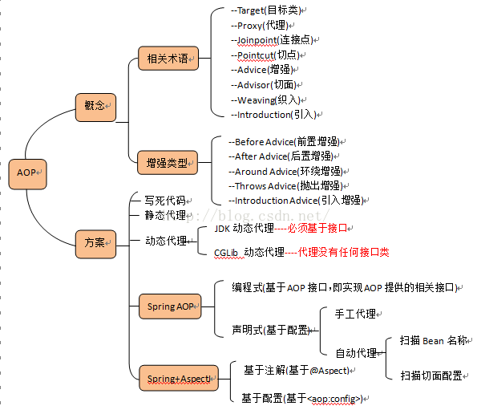
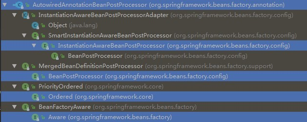

# 1 AOP

术语：

- Joinpoint:连接点，被拦截到需要被增强的方法。where：去哪里做增强
- Pointcut：切入点，哪些包中的哪些类中的哪些方法，可认为是连接点的集合。where:去哪些地方做增强
- Advice：增强，当拦截到Joinpoint 之后，在方法执行的什么时机（when）做什么样(what)的增强。根据时机分为：前置增强、后置增强、异常增强、最终增强、环绕增强
- Aspect：切面，Pointcut+Advice，去哪些地方+在什么时机+做什么增强
- Target：目标对象,被代理的目标对象
- Weaving：织入，把Advice 加到Target 上之后，创建出Proxy 对象的过程。
- Proxy：一个类被AOP 织入增强后，产生的代理类


> 下面的问题对照7.5.1的jdk动态代理注解配置

###  1.1 什么是Aspect？

Aspect由PointCut和Advice组成

它即包含了横切逻辑的定义，也包括了连接点的定义

SpringAOP就是负责实施切面的框架，它将切面所定义的横切逻辑编辑到切面指定的连接点中

AOP的工作重心在于如何将增强编织目标对象的连接点中，这里包含两个工作：

1. 如何通过PointCut和Advice定位到特定的JoinPoint上
2. 如何Advice中编写切面编程

**可以简单地认为，使用@Aspect注解的类就是切面**

eg：这是一个切面

```java
//用于增强的类需要配Conponent和Aspect注解
@Component
@Aspect
public class TransactionManager {
	
	//表示给谁做增强
	@Pointcut("execution(* cn.wolfcode.service.*Service.*(..))")
	public void txPoint() {
	}
    
    ........
        
}
```


### 1.2 什么是JoinPoint?

JoinPoint,切点，程序运行中的一些时间点，例如：

API：

| 方法名              | 功能                                                         |
| ------------------- | ------------------------------------------------------------ |
| getSignature();     | 获取封装了署名信息的对象,在该对象中可以获取到目标方法名,所属类的Class等信息 |
| Object[] getArgs(); | 获取传入目标方法的参数对象                                   |
| Object getTarget(); | 获取被代理的对象                                             |
| Object getThis();   | 获取代理对象                                                 |

```java
//用于增强的类需要配Conponent和Aspect注解
@Component
@Aspect
public class TransactionManager {
	
	//表示给谁做增强
	@Pointcut("execution(* cn.wolfcode.service.*Service.*(..))")
	public void txPoint() {
		
	}
	
    //JoinPoint,时间点
	@AfterThrowing(value="txPoint()",throwing="ex")
	public void rollback(JoinPoint jp, Throwable ex) {
		//ex和App-context.xml里面的ex一致
		System.out.println("回滚事务,异常信息:" + ex.getMessage());
	}

	......
}
```


### 1.3 什么是PointCut？

xml配置中的切入点，也就是对哪些包中的哪些类中的哪些方法进行配置。

```java
<bean id="transctionManager" class="cn.wolfcode.wms.tx.TransctionManager" />
    
<aop:config>	
    <aop:aspect ref="transctionManager">
    //pointcut:切入点，哪些包中的哪些类中的哪些方法，可认为是连接点的集合。
        <aop:pointcut expression="
        execution(* cn.wolfcode.wms.service.*Service.*(..))" id="txPoint" />
            <aop:before method="begin" pointcut-ref="txPoint" />
            <aop:after-returning method="commit" pointcut-ref="txPoint" />
            <aop:after-throwing method="rollback" pointcut-ref="txPoint" />
            <aop:after method="close" pointcut-ref="txPoint" />
            <aop:around method="around" pointcut-ref="txPoint"/>
    </aop:aspect>
</aop:config>
```


### 1.4 什么是Advice?

Advice：增强，SpringAop使用一个Advice作为拦截器，在JoinPoint周围维护一系列的拦截器，当拦截到Joinpoint 之后，在方法执行的什么时机（when）做什么样(what)的增强。根据时机分为：前置增强、后置增强、异常增强、最终增强、环绕增强


### 1.5 什么是 Target ？

目标对象,被代理的目标对象。

注意指的不是原来的对象，而是织入Advice后所产生的代理对象

通过JointPoint的getThis();方法可以获取代理对象，也就是Target，通过getTarget()可以获取获取被代理的对象。


### 1.6 AOP有哪些实现方式

实现AOP的技术，主要分为两类：

1. 静态代理
2. 动态代理
   - JDK动态代理
   - CGLIB动态代理

详情介绍7.1，7.2，7.3 


### 1.7 Spring AOP 和 AspectJ 之间的差别（重点）

[博客](https://www.jianshu.com/p/872d3dbdc2ca)

**概述：**

**AspectJ是一个AOP框架，它能够对java代码进行AOP编译（一般在编译期进行），让java代码具有AspectJ的AOP功能（当然需要特殊的编译器）**，可以这样说AspectJ是目前实现AOP框架中最成熟，功能最丰富的语言，更幸运的是，AspectJ与java程序完全兼容，几乎是无缝关联。

Spring注意到AspectJ在AOP的实现方式上依赖于特殊编译器(ajc编译器)，因此Spring很机智回避了这点，转向采用动态代理技术的实现原理来构建Spring AOP的内部机制（动态织入），这是与AspectJ（静态织入）最根本的区别。**Spring 只是使用了与 AspectJ 5 一样的注解，但仍然没有使用 AspectJ 的编译器，底层依是动态代理技术的实现，因此并不依赖于 AspectJ 的编译器**。 Spring AOP虽然是使用了那一套注解，其实实现AOP的底层是使用了动态代理(JDK或者CGLib)来动态植入。至于AspectJ的静态植入，不是本文重点，所以只提一提。 


**Spring AOP 和 AspectJ 有不同的目标：**

- Spring aop 旨在提供一个跨 Spring IoC 的简单的 aop 实现, 以解决程序员面临的最常见问题。它不打算作为一个完整的 AOP 解决方案 —— 它只能应用于由 Spring 容器管理的 bean。
- AspectJ 是原始的 aop 技术, 目的是提供完整的 aop 解决方案。它更健壮, 但也比 Spring AOP 复杂得多。还值得注意的是, AspectJ 可以在所有域对象中应用。


 **运用技术：**

SpringAOP使用了两种代理机制，一种是基于JDK的动态代理，另一种是基于CGLib的动态代理，之所以需要两种代理机制，很大程度上是因为JDK本身只提供基于接口的代理，不支持类的代理。


 **切面植入的方法：**

1. 编译期织入
2. 类装载期织入
3. 动态代理织入 ----> 在运行期为目标类添加增强生成子类的方式，**Spring  AOP采用动态代理织入切面**


**流行的框架：**     

AOP现有两个主要的流行框架，即Spring AOP和Spring+AspectJ   




此快速表总结了 Spring AOP 和 AspectJ 之间的关键区别:

| Spring AOP                                       | AspectJ                                                      |
| ------------------------------------------------ | ------------------------------------------------------------ |
| 在纯 Java 中实现                                 | 使用 Java 编程语言的扩展实现                                 |
| 不需要单独的编译过程                             | 除非设置 LTW，否则需要 AspectJ 编译器 (ajc)                  |
| 只能使用运行时织入                               | 运行时织入不可用。支持   编译期织入和类装载期织入            |
| 功能不强-仅支持方法级编织                        | 更强大 - 可以编织字段、方法、构造函数、静态初始值设定项、最终类/方法等......。 |
| 只能在由 Spring 容器管理的 bean 上实现           | 可以在所有域对象上实现                                       |
| 仅支持方法执行切入点                             | 支持所有切入点                                               |
| 代理是由目标对象创建的, 并且切面应用在这些代理上 | 在执行应用程序之前 (在运行时) 前, 各方面直接在代码中进行织入 |
| 比 AspectJ 慢多了                                | 更好的性能                                                   |
| 易于学习和应用                                   | 相对于 Spring AOP 来说更复杂                                 |

 


# 4 线程安全处理问题

### 4.1 Spring框架中的单例Beans是线程安全的么

[博客1](http://www.sohu.com/a/339696092_120104204)

[博客2](https://www.cnblogs.com/myseries/p/11729800.html#commentform)

- **原型（prototype）Bean：**
  对于原型Bean,每次创建一个新对象，也就是线程之间并不存在Bean共享，自然是不会有线程安全的问题。

- **单例（singleton）Bean：**默认配置
  对于单例Bean,所有线程都共享一个单例实例Bean,因此是存在资源的竞争。

  如果单例Bean,是一个无状态Bean，也就是线程中的操作不会对Bean的成员执行**查询**以外的操作，那么这个单例Bean是线程安全的。比如Spring mvc 的 Controller、Service、Dao等，这些Bean大多是无状态的，只关注于方法本身。


- 有状态Bean，就是有实例变量的对象 ，可以保存数据，是非线程安全的。
- 无状态对象Bean，就是没有实例变量的对象，不能保存数据，是不变类，是线程安全的。

 


**为什么spring单例，为什么controller、service和dao能保证线程安全？** 

Spring中的Bean默认是单例模式的，框架并没有对bean进行多线程的封装处理。实际上大部分时间Bean是无状态的（比如Dao） 所以说在某种程度上来说Bean其实是安全的。 　　

但是如果Bean是有状态的 那就需要开发人员自己来进行线程安全的保证，有两种办法：

- 将singleton模式改为prototype
- 使用threadlocal封装变量

controller、service和dao层本身并不是线程安全的，但是如果只是调用里面的方法，而不设置变量，多线程调用一个实例的方法，会在内存中复制变量，这是自己的线程的工作内存，是线程安全的。 

**所以其实任何无状态单例都是线程安全的。Spring的根本就是通过大量这种单例构建起系统，以事务脚本的方式提供服务** 

>PS:Spring对有一些Bean（如RequestContextHolder、TransactionSynchronizationManager、LocaleContextHolder等）中非线程安全状态采用ThreadLocal进行处理，让它们也成为线程安全的状态。 


**总结：**

1. 对于多例Bean，是不存在数据共享的，线程安全。对于单例Bean，如果是无状态的，不保存数据只调用方法，那么是线程安全的，如果是有状态的，所有线程共享一个Bean，线程不安全。

2. 在@Controller/@Service等容器中，默认情况下，scope值是单例-singleton的。

   如果**只有方法调用**的话，那么是线程安全的，因为方法调用时每个方法都有自己的栈，装着参数和局部变量。

   但是如果有**成员变量**的话，那么这个成员变量就是线程不安全的。注意，在Controller中注入的service对象也是成员变量，如果此对象是单例的，那么也是不安全的。

   **想要保证成员变量的安全，可以用ThreadLocal来封装。**

3. 尽量不要在@Controller/@Service等容器中定义静态变量，不论是单例(singleton)还是多实例(prototype)都是线程不安全的。


# 5 注解

### 5.1 自动装配

在spring中，对象无需自己查找或创建与其关联的其他对象，由容器负责把需要相互协作的对象引用赋予各个对象。

**注入时机：在完成对象的创建，为对象变量进行赋值的时候进行注入（populate）。** 

##### 5.1.1 基于xml

```xml
<bean id="userMapper" class="edu.cn.dao.UserMapperImpl" autowire="byName"/>
<bean id="userService" class="edu.cn.dao.UserServiceImpl" autowire="byName"/>
```

**通过设置`<bean>`元素的autowired属性指定自动装配，代替了通过`<property>`标签显示指定Bean的依赖关系。由BeanFactory检查XML配置文件的内容，为Bean自动注入依赖关系。** 在Spring框架xml配置中共有5种自动装配：

（1）no：默认的方式是不进行自动装配的，通过手工设置property的ref属性来进行装配bean。

（2）byType：根据属性类型自动装配。**BeanFactory查找容器中的全部Bean，**如果正好有一个与依赖属性类型相同的Bean，就自动装配这个属性；如果有多个这样的Bean，Spring无法决定注入哪个Bean，就抛出一个致命异常；如果没有匹配的Bean，就什么都不会发生，属性不会被设置

（3）byName： 根据属性名自动装配。BeanFactory查找容器中的全部Bean，找出id与属性的setter方法入参匹配的Bean。找到即自动注入，否则什么都不做

（4）constructor：与byType的方式类似，不同之处在于它应用于构造器参数。如果在容器中没有找到与构造器参数类型一致的Bean，那么将会抛出异常

（5）autodetect：自动探测，如果有构造方法，通过 construct的方式自动装配，否则使用 byType的方式自动装配。


##### 5.1.2 基于注解的方式

使用@Autowired注解来自动装配指定的bean。在使用@Autowired注解之前需要在Spring配置文件进行配置，`<context:annotation-config />`。在启动spring IoC时，容器自动装载了一个AutowiredAnnotationBeanPostProcessor后置处理器，当容器扫描到@Autowied、@Resource或@Inject时，就会在IoC容器自动查找需要的bean，并装配给该对象的属性。在使用@Autowired时，首先在容器中查询对应类型的bean：

- 如果查询结果刚好为一个，就将该bean装配给@Autowired指定的数据；

- 如果查询的结果不止一个，那么@Autowired会根据名称来查找；

- 如果上述查找的结果为空，那么会抛出异常。解决方法时，使用required=false。


@Autowired可用于：构造函数、成员变量、Setter方法

@Autowired和@Resource之间的区别：


##### 5.1.2 源码分析

[博客](https://segmentfault.com/a/1190000018077152)

**在完成对象的创建，为对象变量进行赋值的时候进行注入（populate）。** 




在属性还未赋值的时候-->然后来到applyMergedBeanDefinitionPostProcessors(mbd,  beanType,  beanName)，这一步的作用就是将所有的后置处理器拿出来，并且把名字叫beanName的类中的变量都封装到InjectionMetadata的injectedElements集合里面，目的是以后从中获取，挨个创建实例，通过反射注入到相应类中。


紧接着来到AbstractAutowireCapableBeanFactory第588行populateBean(beanName,  mbd,  instanceWrapper)-->点进去，来到AbstractAutowireCapableBeanFactory的第1347行，来循环遍历所有的后置处理器for  (BeanPostProcessor bp :  getBeanPostProcessors())，从方法名字postProcessPropertyValues也能看出来，就是给属性赋值，**当bp是AutowiredAnnotationBeanPostProcessor的时候，进入postProcessPropertyValues方法，来到AutowiredAnnotationBeanPostProcessor的postProcessPropertyValues方法，如下：**


首先找到需要注入的哪些元数据，然后metadata.inject（注入），注入方法点进去，来到InjectionMetadata的inject方法，在一个for循环里面依次执行element.inject(target,  beanName, pvs)，来对属性进行注入。


**在容器启动，为对象赋值的时候，遇到@Autowired注解，会用后置处理器机制，来创建属性的实例，存储在集合中，然后再利用反射机制，将实例化好的属性，赋值给对象上，这就是Autowired的原理。** 

> 多数语言中，实例化一个对象就是为对象开辟内存空间


# 8 事务

### 8.1 **Spring事务的实现方式** 

spring事务实现主要有两种方法

1. **编程式**，beginTransaction()、commit()、rollback()等事务管理相关的方法,导致事务控制的代码和业务代码编织在一起，不好

2. **声明式**，利用注解Transactional 或者aop配置

以下介绍声明式三种方法：

##### 8.1.1 xml配置

```xml
	<!-- 从classpath的根路径去加载db.properties文件 -->
	<context:property-placeholder location="classpath:db.properties" system-properties-mode="NEVER" />

	<!-- 配置一个druid的连接池 -->
	<bean id="dataSource" class="com.alibaba.druid.pool.DruidDataSource" init-method="init" destroy-method="close">
		<property name="driverClassName" value="${jdbc.driverClassName}" />
		<property name="url" value="${jdbc.url}" />
		<property name="username" value="${jdbc.username}" />
		<property name="password" value="${jdbc.password}" />
		<property name="initialSize" value="${jdbc.initialSize}" />
	</bean>

	<!-- 配置DAO -->
	<bean id="accountDAO" class="cn.wolfcode.dao.impl.AccountDAOImpl">
		<property name="dataSource" ref="dataSource" />
	</bean>

	<!-- 配置Service -->
	<bean id="accountService" class="cn.wolfcode.service.impl.AccountServiceImpl">
		<property name="dao" ref="accountDAO" />
	</bean>

	<!-- ===================================================================== -->
	
	<!-- 1:WHAT:配置JDBC事务管理器 -->
	<bean id="txManager" class="org.springframework.jdbc.datasource.DataSourceTransactionManager">
		<property name="dataSource" ref="dataSource" />
	</bean>
	
	
	<!-- 2:WHEN:配置事务管理器增强 -->
	<tx:advice id="txAdvice" transaction-manager="txManager">
		<tx:attributes>
		<!-- 给AccountServiceImpl里面的trans方法做增强 -->
			<tx:method name="trans"/>
		</tx:attributes>
	</tx:advice>
	
	
	<!-- 3:WHERE:配置切面 -->
	<aop:config>
		<aop:pointcut expression="execution(* cn.wolfcode.service.*Service.*(..))" id="txPc" />
		<!-- 
		 advice-ref:与tx:advice联系
		 pointcut-ref:与aop:pointcut联系
		  -->
		<aop:advisor advice-ref="txAdvice" pointcut-ref="txPc" />
	</aop:config>
	
	<!-- ===================================================================== -->

	<!-- 配置一个CRUD的通用事务的配置 -->

	<tx:advice id="crudAdvice" transaction-manager="txManager">
		<tx:attributes>
			<!-- service中的查询方法 -->
			<tx:method name="get*" read-only="true" propagation="REQUIRED" />
			<tx:method name="list*" read-only="true" propagation="REQUIRED" />
			<tx:method name="query*" read-only="true" propagation="REQUIRED" />
			<!-- service中其他方法(非查询) -->
			<tx:method name="*" propagation="REQUIRED" />
		</tx:attributes>
	</tx:advice>
```


##### 8.1.2 注解配置

AccountDAOImpl.java 

```java
@Repository
public class AccountDAOImpl implements IAccountDAO {
	private JdbcTemplate jdbcTemplate;

	@Autowired
	public void setDataSource(DataSource ds) {
		this.jdbcTemplate = new JdbcTemplate(ds);
	}

	public void transOut(Long outId, int money) {
		jdbcTemplate.update("UPDATE account SET balance = balance - ? WHERE id = ?",
				money, outId);
	}

	public void transIn(Long inId, int money) {
		jdbcTemplate.update("UPDATE account SET balance = balnce + ? WHERE id = ?", 
				money, inId);
	}
}

```

AccountServicelmpl.java

```java
@Service
@Transactional
public class AccountServiceImpl implements IAccountService {

	@Autowired
	private IAccountDAO dao;

	public void trans(Long outId, Long inId, int money) {
		dao.transOut(outId, money);
		//int a = 1 / 0;//模拟程序有异常
		dao.transIn(inId, money);
	}
	
	
	@Transactional(readOnly=true)
	public void listxxx() {
		
	}
}
```

xml

```xml
		<!-- DI注解解析器 -->
	<context:annotation-config/>
	<!-- IoC注解解析器 -->
	<context:component-scan base-package="cn.wolfcode"/>
	<!-- TX注解解析器 -->
	<bean id="txManager" class="org.springframework.jdbc.datasource.DataSourceTransactionManager">
		<property name="dataSource" ref="dataSource"></property>
	</bean>
	<tx:annotation-driven transaction-manager="txManager"/>
	
	<!-- 从classpath的根路径去加载db.properties文件 -->
	<context:property-placeholder location="classpath:db.properties" system-properties-mode="NEVER" />

	<!-- 配置一个druid的连接池 -->
	<bean id="dataSource" class="com.alibaba.druid.pool.DruidDataSource" init-method="init" destroy-method="close">
		<property name="driverClassName" value="${jdbc.driverClassName}" />
		<property name="url" value="${jdbc.url}" />
		<property name="username" value="${jdbc.username}" />
		<property name="password" value="${jdbc.password}" />
		<property name="initialSize" value="${jdbc.initialSize}" />
	</bean>
```


##### 8.1.3 JavaConfig配置

```java
@Service
@Transactional
public class AccountServiceImpl implements IAccountService {

	@Autowired
	private IAccountDAO dao;

	public void trans(Long outId, Long inId, int money) {
		dao.transOut(outId, money);
		int a = 1 / 0;//模拟程序有异常
		dao.transIn(inId, money);
	}
}

```


```java
//当前项目的配置类,好比是applicationContext.xml
@Configuration					//标识当前类为一个配置类
@Import(DataSourceConfig.class)	//包含其他的配置类
@ComponentScan				//IoC注解解析器
@EnableTransactionManagement//事务注解解析器
public class AppConfig {
	//创建事务管理的Bean
	//DataSource在DataSourceConfig里面找到了并设置进来。
	@Bean
	public DataSourceTransactionManager txManager(DataSource ds) {
		return new DataSourceTransactionManager(ds);
	}
}

```

DataSourceConfig.java

```java
//当前项目的连接池的配置类
@Configuration
@PropertySource("classpath:db.properties")
public class DataSourceConfig {
	@Value("${jdbc.driverClassName}")
	private String driverClassName;
	@Value("${jdbc.url}")
	private String url;
	@Value("${jdbc.username}")
	private String username;
	@Value("${jdbc.password}")
	private String password;
	@Value("${jdbc.initialSize}")
	private int initialSize;

	//创建连接池的Bean
	@Bean
	public DataSource dataSource() {
		DruidDataSource ds = new DruidDataSource();
		ds.setDriverClassName(driverClassName);
		ds.setUrl(url);
		ds.setUsername(username);
		ds.setPassword(password);
		ds.setInitialSize(initialSize);
		return ds;
	}
}

```


企业中：

- 组合一：XML+注解
- 组合二：XML+注解+Java代码配置
- 组合三：注解+java代码配置


### 8.2 Spring事务的实现原理

##### 8.2.1**事务的基本原理**

Spring事务的本质其实就是数据库对事务的支持，没有数据库的事务支持，spring是无法提供事务功能的。对于纯JDBC操作数据库，想要用到事务，可以按照以下步骤进行：

1. 获取连接 Connection con = DriverManager.getConnection()
2. 开启事务con.setAutoCommit(true/false);
3. 执行CRUD
4. 提交事务/回滚事务 con.commit() / con.rollback();
5. 关闭连接 conn.close()；

使用Spring的事务管理功能后，我们可以不再写步骤 2 和 4 的代码，而是由Spirng  自动完成。
那么Spring是如何在我们书写的 CRUD  之前和之后开启事务和关闭事务的呢？下面简单地介绍下，注解方式为例子

1. 配置文件开启注解驱动，在相关的类和方法上通过注解@Transactional标识。
2. spring 在启动的时候会去解析生成相关的bean，这时候会查看拥有相关注解的类和方法，并且为这些类和方法生成代理，并根据@Transaction的相关参数进行相关配置注入，这样就在代理中为我们把相关的事务处理掉了（开启正常提交事务，异常回滚事务）。
3. 真正的数据库层的事务提交和回滚是通过binlog或者redo log实现的。


##### 8.2.2 Spring底层原理

[源码分析](https://www.jianshu.com/p/ecf55d6f0118)

Spring事务的本质其实就是数据库对事务的支持，没有数据库的事务支持，spring是无法提供事务功能的。真正的数据库层的事务提交和回滚是通过binlog或者redo log实现的。

Spring事务的种类：

spring支持**编程式事务管理**和**声明式事务管理**两种方式：

1. 编程式事务管理使用TransactionTemplate。
2. 声明式事务管理建立在AOP之上的。**其本质是通过AOP功能，对方法前后进行拦截，将事务处理的功能编织到拦截的方法中**，也就是在目标方法开始之前加入一个事务，在执行完目标方法之后根据执行情况提交或者回滚事务。

> 声明式事务最大的优点就是不需要在业务逻辑代码中掺杂事务管理的代码，只需在配置文件中做相关的事务规则声明或通过@Transactional注解的方式，便可以将事务规则应用到业务逻辑中。
>
> 声明式事务管理要优于编程式事务管理，这正是spring倡导的非侵入式的开发方式，使业务代码不受污染，只要加上注解就可以获得完全的事务支持。唯一不足地方是，最细粒度只能作用到方法级别，无法做到像编程式事务那样可以作用到代码块级别。


### 7.3 Spring的事务隔离级别&事务的传播属性

隔离级别：

| 常量                       | 解释                                                         |
| -------------------------- | ------------------------------------------------------------ |
| ISOLATION_DEFAULT          | 这是个 PlatfromTransactionManager 默认的隔离级别，使用数据库默认的事务隔离级别。另外四个与 JDBC 的隔离级别相对应。 |
| ISOLATION_READ_UNCOMMITTED | 这是事务最低的隔离级别，它充许另外一个事务可以看到这个事务未提交的数据。这种隔离级别会产生脏读，不可重复读和幻像读。 |
| ISOLATION_READ_COMMITTED   | 保证一个事务修改的数据提交后才能被另外一个事务读取。另外一个事务不能读取该事务未提交的数据。 |
| ISOLATION_REPEATABLE_READ  | 这种事务隔离级别可以防止脏读，不可重复读。但是可能出现幻像读。 |
| ISOLATION_SERIALIZABLE     | 这是花费最高代价但是最可靠的事务隔离级别。事务被处理为顺序执行。 |

传播属性：

| 常量名称                  | 常量解释                                                     |
| ------------------------- | ------------------------------------------------------------ |
| PROPAGATION_REQUIRED      | 支持当前事务，如果当前没有事务，就新建一个事务。这是最常见的选择，也是 Spring 默认的事务的传播。 |
| PROPAGATION_REQUIRES_NEW  | 新建事务，如果当前存在事务，把当前事务挂起。新建的事务将和被挂起的事务没有任何关系，是两个独立的事务，外层事务失败回滚之后，不能回滚内层事务执行的结果，内层事务失败抛出异常，外层事务捕获，也可以不处理回滚操作 |
| PROPAGATION_SUPPORTS      | 支持当前事务，如果当前没有事务，就以非事务方式执行。         |
| PROPAGATION_MANDATORY     | 支持当前事务，如果当前没有事务，就抛出异常。                 |
| PROPAGATION_NOT_SUPPORTED | 以非事务方式执行操作，如果当前存在事务，就把当前事务挂起。   |
| PROPAGATION_NEVER         | 以非事务方式执行，如果当前存在事务，则抛出异常。             |
| PROPAGATION_NESTED        | 如果一个活动的事务存在，则运行在一个嵌套的事务中。如果没有活动事务，则按REQUIRED属性执行。它使用了一个单独的事务，这个事务拥有多个可以回滚的保存点。内部事务的回滚不会对外部事务造成影响。它只对DataSourceTransactionManager事务管理器起效。 |

