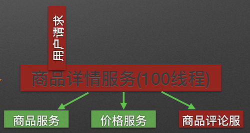
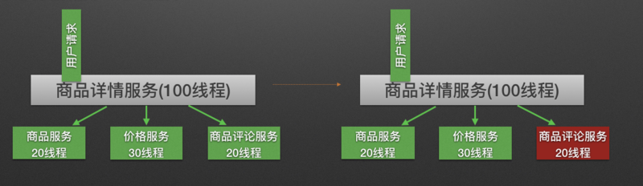
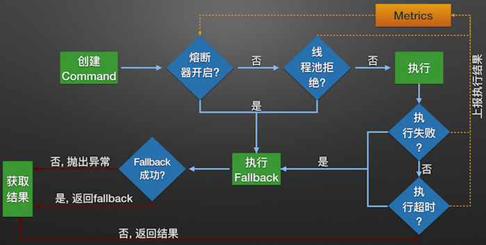

# :taco:1 Hystrix

[推荐博客](https://segmentfault.com/a/1190000005988895)

分布式系统中经常会出现某个基础服务不可用造成整个系统不可用的情况, 这种现象被称为服务雪崩效应. 为了应对服务雪崩, 一种常见的做法是手动服务降级. 而Hystrix的出现,给我们提供了另一种选择——容错机制。


## 1.1.服务雪崩

服务雪崩效应是一种因 **服务提供者** 的不可用导致 **服务调用者** 的不可用,并将不可用 **逐渐放大** 的过程.如图所示: 


服务D是一个辅助类型服务，整个业务不依赖于D服务，某天D服务突然响应时间变长，导致了核心服务C响应时间变长，其上请求越积越多，C服务也出现了响应变慢的情况，由于A，B强依赖于服务C，故而一个无关紧要的服务却影响了整个系统的可用。

 

总结：雪崩原因

1. 服务提供者不可用
2. 重试加大流量
3. 服务调用者不可用


**1.服务提供者不可用**

 **服务不可用** 的原因有:

- 硬件故障
- 程序Bug
- 缓存击穿
- 用户大量请求

缓存击穿一般发生在缓存应用重启, 所有缓存被清空时,以及短时间内大量缓存失效时. 大量的缓存不命中, 使请求直击后端,造成服务提供者超负荷运行,引起服务不可用.   在秒杀和大促开始前,如果准备不充分,用户发起大量请求也会造成服务提供者的不可用. 


**2.重试加大流量**

- 用户重试
- 代码逻辑重试

在服务提供者不可用后, 用户由于忍受不了界面上长时间的等待,而不断刷新页面甚至提交表单. 


**3.服务调用者不可用**

**服务调用者不可用** 产生的主要原因是: 

* 同步等待造成的资源耗尽 

当服务调用者使用 **同步调用** 时, 会产生大量的等待线程占用系统资源. 一旦线程资源被耗尽,服务调用者提供的服务也将处于不可用状态, 于是服务雪崩效应产生了. 


> #### 什么是熔断
>
>  一般是某个服务故障或者是异常引起的，类似现实世界中的‘保险丝’，当某个异常条件被触发，直接熔断整个服务，而不是一直等到此服务超时，为了防止防止整个系统的故障，
>
> 而采用了一些保护措施。过载保护。比如A服务的X功能依赖B服务的某个接口，当B服务接口响应很慢时，A服务X功能的响应也会被拖慢，进一步导致了A服务的线程都卡在了X功能
>
> 上，A服务的其它功能也会卡主或拖慢。此时就需要熔断机制，即A服务不在请求B这个接口，而可以直接进行降级处理。
>
> ####  什么是降级
>
>  服务器当压力剧增的时候，根据当前业务情况及流量，对一些服务和页面进行有策略的降级。以此缓解服务器资源的的压力，以保证核心业务的正常运行，同时也保持了客户和
>
> 大部分客户的得到正确的相应。


## 1.2 使用Hystrix预防服务雪崩

Hystrix的设计原则包括:

- 资源隔离
- 熔断器
- 命令模式


#### 1.2.1 资源隔离

在一个高度服务化的系统中,我们实现的一个业务逻辑通常会依赖多个服务。调用三个依赖服务会共享商品详情服务的线程池。

> 雪崩原因：如果其中的商品评论服务不可用, 就会出现线程池里所有线程都因等待响应而被阻塞, 从而造成服务雪崩




Hystrix通过将每个依赖服务**分配独立的线程池进行资源隔离**, 从而避免服务雪崩.   




#### 1.2.2 熔断器模式

熔断器模式定义了熔断器开关相互转换的逻辑:   

服务的健康状况（设为H）=  请求失败数 / 请求总数.   

1. 当熔断器开关关闭时, 请求被允许通过熔断器. 如果当前H低于设定阈值, 开关则切换为打开状态.
2. 当熔断器开关打开时, 请求被禁止通过.
3. 当熔断器开关处于打开状态, 经过一段时间后, 熔断器会自动进入半开状态, 这时熔断器只允许一个请求通过. 当该请求调用成功时, 熔断器恢复到关闭状态. 若该请求失败, 熔断器继续保持打开状态, 接下来的请求被禁止通过.

> 熔断器的开关能保证服务调用者在调用异常服务时, 快速返回结果, 避免大量的同步等待. 并且熔断器能在一段时间后继续侦测请求执行结果, 提供恢复服务调用的可能.


#### 1.2.3 命令模式

Hystrix使用命令模式(继承HystrixCommand类)来包裹具体的服务调用逻辑(run方法), 并在命令模式中添加了服务调用失败后的降级逻辑(getFallback). 同时我们在Command的构造方法中可以定义当前服务线程池和熔断器的相关参数. 如下代码所示: 

```java
public class Service1HystrixCommand extends HystrixCommand<Response> {
  private Service1 service;
  private Request request;

  public Service1HystrixCommand(Service1 service, Request request){
    supper(
      Setter.withGroupKey(HystrixCommandGroupKey.Factory.asKey("ServiceGroup"))
          .andCommandKey(HystrixCommandKey.Factory.asKey("servcie1query"))
          .andThreadPoolKey(HystrixThreadPoolKey.Factory.asKey("service1ThreadPool"))
          .andThreadPoolPropertiesDefaults(HystrixThreadPoolProperties.Setter()
            .withCoreSize(20))//服务线程池数量
          .andCommandPropertiesDefaults(HystrixCommandProperties.Setter()
            .withCircuitBreakerErrorThresholdPercentage(60)//熔断器关闭到打开阈值
            .withCircuitBreakerSleepWindowInMilliseconds(3000)//熔断器打开到关闭的时间窗长度
      ))
      this.service = service;
      this.request = request;
    );
  }

  @Override
  protected Response run(){
    return service1.call(request);
  }

  @Override
  protected Response getFallback(){
    return Response.dummy();
  }
}
```


> 在使用了Command模式构建了服务对象之后, 服务便拥有了熔断器和线程池的功能.   


#### 1.2.4 Hystrix的内部处理逻辑

Hystrix服务调用的内部逻辑:   



1. 构建Hystrix的Command对象, 调用执行方法.
2. Hystrix检查当前服务的熔断器开关是否开启, 若开启, 则执行降级服务getFallback方法.
3. 若熔断器开关关闭, 则Hystrix检查当前服务的线程池是否能接收新的请求, 若超过线程池已满, 则执行降级服务getFallback方法.
4. 若线程池接受请求, 则Hystrix开始执行服务调用具体逻辑run方法.
5. 若服务执行失败, 则执行降级服务getFallback方法, 并将执行结果上报Metrics更新服务健康状况.
6. 若服务执行超时, 则执行降级服务getFallback方法, 并将执行结果上报Metrics更新服务健康状况.
7. 若服务执行成功, 返回正常结果.
8. 若服务降级方法getFallback执行成功, 则返回降级结果.
9. 若服务降级方法getFallback执行失败, 则抛出异常.


#### 1.2.5 Hystrix Metrics的实现

Hystrix的Metrics中保存了当前服务的健康状况, 包括服务调用总次数和服务调用失败次数等. 根据Metrics的计数,  熔断器从而能计算出当前服务的调用失败率, 用来和设定的阈值比较从而决定熔断器的状态切换逻辑. 因此Metrics的实现非常重要. 


## 1.3 demo

### 1.3.1 开启熔断

##### 1.3.1.1 引入依赖

首先在itcast-service-consumer的pom.xml中引入Hystrix依赖：

```xml
<dependency>
    <groupId>org.springframework.cloud</groupId>
    <artifactId>spring-cloud-starter-netflix-hystrix</artifactId>
</dependency>
```


##### 1.3.1.2 开启熔断


可以看到，我们类上的注解越来越多，在微服务中，经常会引入上面的三个注解，于是Spring就提供了一个组合注解：@SpringCloudApplication


```java
@SpringCloudApplication //代替上图开启springboot + 开启Eureka客户端功能 + 开启熔断
public class ItcastServiceConsumerApplication {

    @Bean
    @LoadBalanced
    public RestTemplate restTemplate(){
        return new RestTemplate();
    }

    public static void main(String[] args) {
        SpringApplication.run(ItcastServiceConsumerApplication.class, args);
    }
}
```


##### 1.3.1.3 编写降级逻辑

我们改造itcast-service-consumer，当目标服务的调用出现故障，我们希望快速失败，给用户一个友好提示。因此需要提前编写好失败时的降级处理逻辑，要使用HystixCommond来完成：

```java
@Controller
@RequestMapping("consumer/user")
public class UserController {

    @Autowired
    private RestTemplate restTemplate;

    @GetMapping
    @ResponseBody
    @HystrixCommand(fallbackMethod = "queryUserByIdFallBack")
    public String queryUserById(@RequestParam("id") Long id) {
        String user = this.restTemplate.getForObject("http://service-provider/user/" + id, String.class);
        return user;
    }

    public String queryUserByIdFallBack(Long id){
        return "请求繁忙，请稍后再试！";
    }
}
```

要注意，因为熔断的降级逻辑方法必须跟正常逻辑方法保证：**相同的参数列表和返回值声明**。失败逻辑中返回User对象没有太大意义，一般会返回友好提示。所以我们把queryById的方法改造为返回String，反正也是Json数据。这样失败逻辑中返回一个错误说明，会比较方便。

说明：

- @HystrixCommand(fallbackMethod = "queryByIdFallBack")：用来声明一个降级逻辑的方法

测试：

当itcast-service-provder正常提供服务时，访问与以前一致。但是当我们将itcast-service-provider停机时，会发现页面返回了降级处理信息：


##### 1.3.1.4 默认FallBack

我们刚才把fallback写在了某个业务方法上，如果这样的方法很多，那岂不是要写很多。所以我们可以把Fallback配置加在类上，实现默认fallback：

```java
@Controller
@RequestMapping("consumer/user")
@DefaultProperties(defaultFallback = "fallBackMethod") // 指定一个类的全局熔断方法
public class UserController {

    @Autowired
    private RestTemplate restTemplate;

    @GetMapping
    @ResponseBody
    @HystrixCommand // 标记该方法需要熔断
    public String queryUserById(@RequestParam("id") Long id) {
        String user = this.restTemplate.getForObject("http://service-provider/user/" + id, String.class);
        return user;
    }

    /**
     * 熔断方法
     * 返回值要和被熔断的方法的返回值一致
     * 熔断方法不需要参数
     * @return
     */
    public String fallBackMethod(){
        return "请求繁忙，请稍后再试！";
    }
}
```

- @DefaultProperties(defaultFallback = "defaultFallBack")：在类上指明统一的失败降级方法
- @HystrixCommand：在方法上直接使用该注解，使用默认的剪辑方法。
- defaultFallback：默认降级方法，不用任何参数，以匹配更多方法，但是返回值一定一致


##### 1.3.1.5 设置超时

在之前的案例中，请求在超过1秒后都会返回错误信息，这是因为Hystix的默认超时时长为1，我们可以通过配置修改这个值：

我们可以通过`hystrix.command.default.execution.isolation.thread.timeoutInMilliseconds`来设置Hystrix超时时间。该配置没有提示。

```yaml
hystrix:
  command:
    default:
      execution:
        isolation:
          thread:
            timeoutInMilliseconds: 6000 # 设置hystrix的超时时间为6000ms
```


##### 1.3.1.6 一些参数

```properties
circuitBreaker.requestVolumeThreshold=10
circuitBreaker.sleepWindowInMilliseconds=10000
circuitBreaker.errorThresholdPercentage=50
```


# :tada: 2 Feign

在前面的学习中，我们使用了Ribbon的负载均衡功能，大大简化了远程调用时的代码：

```java
String user = this.restTemplate.getForObject("http://service-provider/user/" + id, String.class);
```

如果就学到这里，你可能以后需要编写类似的大量重复代码，格式基本相同，无非参数不一样。有没有更优雅的方式，来对这些代码再次优化呢？

这就是我们接下来要学的Feign的功能了。


## 2.1 原理

Feign可以把Rest的请求进行隐藏，伪装成类似SpringMVC的Controller一样。你不用再自己拼接url，拼接参数等等操作，一切都交给Feign去做，可帮助我们更加便捷优雅地调用HTTP API。

spring cloud对feign做了增强，使feign支持了spring mvc注解，并整合了ribbon和eureka。

Feign的一个关键机制就是使用了动态代理，Feign的工作原理：

- 如果你对某个接口定义了@FeignClient注解，Feign就会针对这个接口创建一个动态代理；

- 接着你要是调用那个接口，本质就是会调用 Feign创建的动态代理，这是核心中的核心；

- Feign的动态代理会根据你在接口上的@RequestMapping等注解，来动态构造出你要请求的服务的地址；

- 最后从Ribbon中拿到对应的IP地址个端口号，针对这个地址，发起请求、解析响应。


## 2.2.demo

改造itcast-service-consumer工程

### 2.2.1.导入依赖

```xml
<dependency>
    <groupId>org.springframework.cloud</groupId>
    <artifactId>spring-cloud-starter-openfeign</artifactId>
</dependency>
```


### 2.2.2.开启Feign功能

我们在启动类上，**添加注解**，开启Feign功能

```java
@SpringCloudApplication
@EnableFeignClients // 开启feign客户端
public class ItcastServiceConsumerApplication {
    
    public static void main(String[] args) {
        SpringApplication.run(ItcastServiceConsumerApplication.class, args);
    }
}
```

**删除RestTemplate**：feign已经自动集成了Ribbon负载均衡的RestTemplate。所以，此处不需要再注册RestTemplate。


### 2.2.3.Feign的客户端

在itcast-service-consumer工程中，添加UserClient接口：

 

内容：表示向外提供queryById方法。

```java
@FeignClient(value = "service-provider") // 标注该类是一个feign接口
public interface UserClient {

    @GetMapping("user/{id}")
    User queryById(@PathVariable("id") Long id);
}
```

调用原理过程：

- 如果你对某个接口定义了@FeignClient注解，Feign就会针对这个接口创建一个动态代理；这点跟mybatis的mapper很像
- `@FeignClient`，声明这是一个Feign客户端，类似`@Mapper`注解。同时通过`value`属性指定服务名称
- 接着你要是调用那个接口，本质就是会调用 Feign创建的动态代理，这是核心中的核心；
- Feign的动态代理会根据你在接口上的@RequestMapping等注解，来动态构造出你要请求的服务的地址；
- 最后从Ribbon中拿到对应的IP地址个端口号，针对这个地址，发起请求、解析响应。


调用UserClient接口方法：本质也就是会调用 Feign创建的动态代理

```java
@Controller
@RequestMapping("consumer/user")
public class UserController {

    @Autowired
    private UserClient userClient;

    @GetMapping
    @ResponseBody
    public User queryUserById(@RequestParam("id") Long id){
        User user = this.userClient.queryUserById(id);
        return user;
    }

}
```


## 2.3.负载均衡

Feign中本身已经集成了Ribbon依赖和自动配置：

因此我们不需要额外引入依赖，也不需要再注册`RestTemplate`对象。


## 2.4.Hystrix支持

Feign默认也有对Hystrix的集成：

只不过，默认情况下是关闭的。我们需要通过下面的参数来开启：(在itcast-service-consumer工程添加配置内容)

```yaml
feign:
  hystrix:
    enabled: true # 开启Feign的熔断功能
```

但是，Feign中的Fallback配置不像hystrix中那样简单了。

1）首先，我们要定义一个类UserClientFallback，实现刚才编写的UserClient，作为fallback的处理类

 

```java
@Component
public class UserClientFallback implements UserClient {

    @Override
    public User queryById(Long id) {
        User user = new User();
        user.setUserName("服务器繁忙，请稍后再试！");
        return user;
    }
}
```

2）然后在UserFeignClient中，指定刚才编写的实现类

```java
@FeignClient(value = "service-provider", fallback = UserClientFallback.class) // 标注该类是一个feign接口
public interface UserClient {

    @GetMapping("user/{id}")
    User queryUserById(@PathVariable("id") Long id);
}
```

3）重启测试：


## 2.5.请求压缩(了解)

Spring Cloud Feign 支持对请求和响应进行GZIP压缩，以减少通信过程中的性能损耗。通过下面的参数即可开启请求与响应的压缩功能：

```yaml
feign:
  compression:
    request:
      enabled: true # 开启请求压缩
    response:
      enabled: true # 开启响应压缩
```

同时，我们也可以对请求的数据类型，以及触发压缩的大小下限进行设置：

```yaml
feign:
  compression:
    request:
      enabled: true # 开启请求压缩
      mime-types: text/html,application/xml,application/json # 设置压缩的数据类型
      min-request-size: 2048 # 设置触发压缩的大小下限
```

注：上面的数据类型、压缩大小下限均为默认值。


## 2.6.日志级别(了解)

前面讲过，通过`logging.level.xx=debug`来设置日志级别。然而这个对Fegin客户端而言不会产生效果。因为`@FeignClient`注解修改的客户端在被代理时，都会创建一个新的Fegin.Logger实例。我们需要额外指定这个日志的级别才可以。

1）设置com.leyou包下的日志级别都为debug

```yaml
logging:
  level:
    cn.itcast: debug
```

2）编写配置类，定义日志级别

 

内容：

```java
@Configuration
public class FeignLogConfiguration {

    @Bean
    Logger.Level feignLoggerLevel(){
        return Logger.Level.FULL;
    }
}
```

这里指定的Level级别是FULL，Feign支持4种级别：


- NONE：不记录任何日志信息，这是默认值。
- BASIC：仅记录请求的方法，URL以及响应状态码和执行时间
- HEADERS：在BASIC的基础上，额外记录了请求和响应的头信息
- FULL：记录所有请求和响应的明细，包括头信息、请求体、元数据。


3）在FeignClient中指定配置类：

```java
@FeignClient(value = "service-privider", fallback = UserFeignClientFallback.class, configuration = FeignConfig.class)
public interface UserFeignClient {
    @GetMapping("/user/{id}")
    User queryUserById(@PathVariable("id") Long id);
}
```

4）重启项目，即可看到每次访问的日志：


# :icecream: 3 Zuul网关

## 3.1 功能

通过前面的学习，使用Spring Cloud实现微服务的架构基本成型，大致是这样的：


zuul加入后的架构图：不管是来自于客户端（PC或移动端）的请求，还是服务内部调用。一切对服务的请求都会经过Zuul这个网关，然后再由网关来实现 鉴权、动态路由等等操作。Zuul就是我们服务的统一入口。


Zuul是Spring Cloud全家桶中的微服务API网关,核心是一系列的**过滤器**，所有从设备或网站来的请求都会经过Zuul到达后端的Netflix应用程序。作为一个边界性质的应用程序，Zuul提供了动态路由、监控、弹性负载和安全功能。Zuul底层利用各种filter实现如下功能：

- 认证和安全 识别每个需要认证的资源，拒绝不符合要求的请求。
- 性能监测 在服务边界追踪并统计数据，提供精确的生产视图。
- 动态路由 根据需要将请求动态路由到后端集群。
- 压力测试 逐渐增加对集群的流量以了解其性能。
- 负载卸载 预先为每种类型的请求分配容量，当请求超过容量时自动丢弃。
- 静态资源处理 直接在边界返回某些响应。


## 3.2 原理

zuul 是netflix开源的一个API Gateway 服务器, 本质上是一个web servlet应用。 

zuul的核心是一系列的**filters**, 其作用可以类比Servlet框架的Filter，或者AOP。 

#### 3.2.1 过滤器

**Zuul提供了一个框架，可以对过滤器进行动态的加载，编译，运行。**

Zuul的过滤器之间没有直接的相互通信，他们之间通过一个RequestContext的静态类来进行数据传递的。RequestContext类中有ThreadLocal变量来记录每个Request所需要传递的数据。

Zuul的过滤器是由Groovy写成，这些过滤器文件被放在Zuul Server上的特定目录下面，Zuul会定期轮询这些目录，修改过的过滤器会动态的加载到Zuul Server中以便过滤请求使用。

 **四种标准的过滤器类型：**

Zuul大部分功能都是通过过滤器来实现的。Zuul中定义了四种标准过滤器类型，这些过滤器类型对应于请求的典型生命周期。

(1) PRE：这种过滤器在请求被路由之前调用。我们可利用这种过滤器实现身份验证、在集群中选择请求的微服务、记录调试信息等。

(2) ROUTING：这种过滤器将请求路由到微服务。这种过滤器用于构建发送给微服务的请求，并使用Apache HttpClient或Netfilx Ribbon请求微服务。

(3) POST：这种过滤器在路由到微服务以后执行。这种过滤器可用来为响应添加标准的HTTP Header、收集统计信息和指标、将响应从微服务发送给客户端等。

(4) ERROR：在其他阶段发生错误时执行该过滤器。

**内置的特殊过滤器**

zuul还提供了一类特殊的过滤器，分别为：StaticResponseFilter和SurgicalDebugFilter

StaticResponseFilter：StaticResponseFilter允许从Zuul本身生成响应，而不是将请求转发到源。

SurgicalDebugFilter：SurgicalDebugFilter允许将特定请求路由到分隔的调试集群或主机。

**自定义的过滤器**

除了默认的过滤器类型，Zuul还允许我们创建自定义的过滤器类型。

例如，我们可以定制一种STATIC类型的过滤器，直接在Zuul中生成响应，而不将请求转发到后端的微服务。

 

#### 3.2.2 源码分析

[博客](https://www.cnblogs.com/throwable/p/9653067.html)

:cloud: 没整完…搁一下先

我们先看看Zuul核心类之一com.netflix.zuul.filters.FilterRegistry(Filter的注册中心，实际上是ZuulFilter的**全局缓存**)： 

```java
public class FilterRegistry {
    
    // 饿汉式单例，确保全局只有一个ZuulFilter的缓存
    private static final FilterRegistry INSTANCE = new FilterRegistry();
    public static final FilterRegistry instance() {
        return INSTANCE;
    }

    //缓存字符串到ZuulFilter实例的映射关系，如果是从文件加载，字符串key的格式是：文件绝对路径 + 文件名，当然也可以自实现
    private final ConcurrentHashMap<String, ZuulFilter> filters = new ConcurrentHashMap<String, ZuulFilter>();

    private FilterRegistry() {
    }

    public ZuulFilter remove(String key) {
        return this.filters.remove(key);
    }

    public ZuulFilter get(String key) {
        return this.filters.get(key);
    }

    public void put(String key, ZuulFilter filter) {
        this.filters.putIfAbsent(key, filter);
    }

    public int size() {
        return this.filters.size();
    }

    public Collection<ZuulFilter> getAllFilters() {
        return this.filters.values();
    }

}
```

直接使用ConcurrentHashMap)缓存了ZuulFilter，这些缓存除非主动调用`remove`方法，否则不会自动清理。Zuul提供默认的动态代码编译器，接口是DynamicCodeCompiler，目的是把代码编译为Java的类，默认实现是GroovyCompiler，功能就是把Groovy代码编译为Java类。还有一个比较重要的工厂类接口是FilterFactory，它定义了ZuulFilter类生成ZuulFilter实例的逻辑，默认实现是DefaultFilterFactory，**实际上就是利用`Class#newInstance()`反射生成ZuulFilter实例。** 


FilterLoader，这个类的作用就是加载文件中的ZuulFilter实例： 

```java
public class FilterLoader {
    //静态final实例，注意到访问权限是包许可，实际上就是饿汉式单例
    final static FilterLoader INSTANCE = new FilterLoader();

    private static final Logger LOG = LoggerFactory.getLogger(FilterLoader.class);

    //缓存Filter名称(主要是从文件加载，名称为绝对路径 + 文件名的形式)->Filter最后修改时间戳的映射
    private final ConcurrentHashMap<String, Long> filterClassLastModified = new ConcurrentHashMap<String, Long>();
    //缓存Filter名字->Filter代码的映射，实际上这个Map只使用到get方法进行存在性判断，一直是一个空的结构
    private final ConcurrentHashMap<String, String> filterClassCode = new ConcurrentHashMap<String, String>();
    //缓存Filter名字->Filter名字的映射，用于存在性判断
    private final ConcurrentHashMap<String, String> filterCheck = new ConcurrentHashMap<String, String>();
    //缓存Filter类型名称->List<ZuulFilter>的映射
    private final ConcurrentHashMap<String, List<ZuulFilter>> hashFiltersByType = new ConcurrentHashMap<String, List<ZuulFilter>>();

    //前面提到的ZuulFilter全局缓存的单例
    private FilterRegistry filterRegistry = FilterRegistry.instance();
    //动态代码编译器实例，Zuul提供的默认实现是GroovyCompiler
    static DynamicCodeCompiler COMPILER;
    //ZuulFilter的工厂类
    static FilterFactory FILTER_FACTORY = new DefaultFilterFactory();
    //下面三个方法说明DynamicCodeCompiler、FilterRegistry、FilterFactory可以被覆盖
    public void setCompiler(DynamicCodeCompiler compiler) {
        COMPILER = compiler;
    }

    public void setFilterRegistry(FilterRegistry r) {
        this.filterRegistry = r;
    }

    public void setFilterFactory(FilterFactory factory) {
        FILTER_FACTORY = factory;
    }
    //饿汉式单例获取自身实例
    public static FilterLoader getInstance() {
        return INSTANCE;
    }
    //返回所有缓存的ZuulFilter实例的总数量
    public int filterInstanceMapSize() {
        return filterRegistry.size();
    }
   
    //通过ZuulFilter的类代码和Filter名称获取ZuulFilter实例
    public ZuulFilter getFilter(String sCode, String sName) throws Exception {
        //检查filterCheck是否存在相同名字的Filter，如果存在说明已经加载过
        if (filterCheck.get(sName) == null) {
            //filterCheck中放入Filter名称
            filterCheck.putIfAbsent(sName, sName);
            //filterClassCode中不存在加载过的Filter名称对应的代码
            if (!sCode.equals(filterClassCode.get(sName))) {
                LOG.info("reloading code " + sName);
                //从全局缓存中移除对应的Filter
                filterRegistry.remove(sName);
            }
        }
        ZuulFilter filter = filterRegistry.get(sName);
        //如果全局缓存中不存在对应的Filter，就使用DynamicCodeCompiler加载代码，使用FilterFactory实例化ZuulFilter
        //注意加载的ZuulFilter类不能是抽象的，必须是继承了ZuulFilter的子类
        if (filter == null) {
            Class clazz = COMPILER.compile(sCode, sName);
            if (!Modifier.isAbstract(clazz.getModifiers())) {
                filter = (ZuulFilter) FILTER_FACTORY.newInstance(clazz);
            }
        }
        return filter;
    }

    //通过文件加加载ZuulFilter
    public boolean putFilter(File file) throws Exception {
        //Filter名称为文件的绝对路径+文件名(这里其实绝对路径已经包含文件名，这里再加文件名的目的不明确)
        String sName = file.getAbsolutePath() + file.getName();
        //如果文件被修改过则从全局缓存从移除对应的Filter以便重新加载
        if (filterClassLastModified.get(sName) != null && (file.lastModified() != filterClassLastModified.get(sName))) {
            LOG.debug("reloading filter " + sName);
            filterRegistry.remove(sName);
        }
        //下面的逻辑和上一个方法类似
        ZuulFilter filter = filterRegistry.get(sName);
        if (filter == null) {
            Class clazz = COMPILER.compile(file);
            if (!Modifier.isAbstract(clazz.getModifiers())) {
                filter = (ZuulFilter) FILTER_FACTORY.newInstance(clazz);
                List<ZuulFilter> list = hashFiltersByType.get(filter.filterType());
                //这里说明了一旦文件有修改，hashFiltersByType中对应的当前文件加载出来的Filter类型的缓存要移除，原因见下一个方法
                if (list != null) {
                    hashFiltersByType.remove(filter.filterType()); //rebuild this list
                }
                filterRegistry.put(file.getAbsolutePath() + file.getName(), filter);
                filterClassLastModified.put(sName, file.lastModified());
                return true;
            }
        }
        return false;
    }
    
    
    //通过Filter类型获取同类型的所有ZuulFilter
    public List<ZuulFilter> getFiltersByType(String filterType) {
        List<ZuulFilter> list = hashFiltersByType.get(filterType);
        if (list != null) return list;
        list = new ArrayList<ZuulFilter>();
        //如果hashFiltersByType缓存被移除，这里从全局缓存中加载所有的ZuulFilter，按照指定类型构建一个新的列表
        Collection<ZuulFilter> filters = filterRegistry.getAllFilters();
        for (Iterator<ZuulFilter> iterator = filters.iterator(); iterator.hasNext(); ) {
            ZuulFilter filter = iterator.next();
            if (filter.filterType().equals(filterType)) {
                list.add(filter);
            }
        }
        //注意这里会进行排序，是基于filterOrder
        Collections.sort(list); // sort by priority
        //这里总是putIfAbsent，这就是为什么上个方法可以放心地在修改的情况下移除指定Filter类型中的全部缓存实例的原因
        hashFiltersByType.putIfAbsent(filterType, list);
        return list;
    }
}    
```


上面的几个方法和缓存容器都比较简单，这里实际上有加载和存放动作的方法只有`putFilter`，这个方法正是Filter文件管理器FilterFileManager依赖的，接着看FilterFileManager的源码 ：

```java
public class FilterFileManager {

    private static final Logger LOG = LoggerFactory.getLogger(FilterFileManager.class);

    String[] aDirectories;
    int pollingIntervalSeconds;
    Thread poller;
    boolean bRunning = true;
    //文件名过滤器，Zuul中的默认实现是GroovyFileFilter，只接受.groovy后缀的文件
    static FilenameFilter FILENAME_FILTER;

    static FilterFileManager INSTANCE;

    private FilterFileManager() {
    }

    public static void setFilenameFilter(FilenameFilter filter) {
        FILENAME_FILTER = filter;
    }
    //init方法是核心静态方法，它具备了配置，预处理和激活后台轮询线程的功能
    public static void init(int pollingIntervalSeconds, String... directories) throws Exception, IllegalAccessException, InstantiationException{
        if (INSTANCE == null) INSTANCE = new FilterFileManager();
        INSTANCE.aDirectories = directories;
        INSTANCE.pollingIntervalSeconds = pollingIntervalSeconds;
        INSTANCE.manageFiles();
        INSTANCE.startPoller();
    }

    public static FilterFileManager getInstance() {
        return INSTANCE;
    }

    public static void shutdown() {
        INSTANCE.stopPoller();
    }

    void stopPoller() {
        bRunning = false;
    }
    //启动后台轮询守护线程，每休眠pollingIntervalSeconds秒则进行一次文件扫描尝试更新Filter
    void startPoller() {
        poller = new Thread("GroovyFilterFileManagerPoller") {
            public void run() {
                while (bRunning) {
                    try {
                        sleep(pollingIntervalSeconds * 1000);
                        //预处理文件，实际上是ZuulFilter的预加载
                        manageFiles();
                    } catch (Exception e) {
                        e.printStackTrace();
                    }
                }
            }
        };
        //设置为守护线程
        poller.setDaemon(true);
        poller.start();
    }
    //根据指定目录路径获取目录，主要需要转换为ClassPath
    public File getDirectory(String sPath) {
        File  directory = new File(sPath);
        if (!directory.isDirectory()) {
            URL resource = FilterFileManager.class.getClassLoader().getResource(sPath);
            try {
                directory = new File(resource.toURI());
            } catch (Exception e) {
                LOG.error("Error accessing directory in classloader. path=" + sPath, e);
            }
            if (!directory.isDirectory()) {
                throw new RuntimeException(directory.getAbsolutePath() + " is not a valid directory");
            }
        }
        return directory;
    }
    
    //遍历配置目录，获取所有配置目录下的所有满足FilenameFilter过滤条件的文件
    List<File> getFiles() {
        List<File> list = new ArrayList<File>();
        for (String sDirectory : aDirectories) {
            if (sDirectory != null) {
                File directory = getDirectory(sDirectory);
                File[] aFiles = directory.listFiles(FILENAME_FILTER);
                if (aFiles != null) {
                    list.addAll(Arrays.asList(aFiles));
                }
            }
        }
        return list;
    }
    //遍历指定文件列表，调用FilterLoader单例中的putFilter
    void processGroovyFiles(List<File> aFiles) throws Exception, InstantiationException, IllegalAccessException {
        for (File file : aFiles) {
            FilterLoader.getInstance().putFilter(file);
        }
    }
   //获取指定目录下的所有文件，调用processGroovyFiles，个人认为这两个方法没必要做单独封装
    void manageFiles() throws Exception, IllegalAccessException, InstantiationException {
        List<File> aFiles = getFiles();
        processGroovyFiles(aFiles);
    }
```

分析完FilterFileManager源码之后，Zuul中基于文件加载ZuulFilter的逻辑已经十分清晰：后台启动一个守护线程，定时轮询指定文件夹里面的文件，如果文件存在变更，则尝试更新指定的ZuulFilter缓存，FilterFileManager的`init`方法调用的时候在启动后台线程之前会进行一次预加载。 


FilterProcessor：加载缓存已经从Groovy中缓存好的的ZuulFilter 

```java
public class FilterProcessor {

    //饿汉单例
    static FilterProcessor INSTANCE = new FilterProcessor();
    protected static final Logger logger = LoggerFactory.getLogger(FilterProcessor.class);

    private FilterUsageNotifier usageNotifier;


    public FilterProcessor() {
        usageNotifier = new BasicFilterUsageNotifier();
    }

    public static FilterProcessor getInstance() {
        return INSTANCE;
    }

    public static void setProcessor(FilterProcessor processor) {
        INSTANCE = processor;
    }

    public void setFilterUsageNotifier(FilterUsageNotifier notifier) {
        this.usageNotifier = notifier;
    }
    ...
}

    //指定Filter类型执行该类型下的所有ZuulFilter
    public Object runFilters(String sType) throws Throwable {
        //尝试打印Debug日志
        if (RequestContext.getCurrentContext().debugRouting()) {
            Debug.addRoutingDebug("Invoking {" + sType + "} type filters");
        }
        boolean bResult = false;
        //获取所有指定类型的ZuulFilter
        List<ZuulFilter> list = FilterLoader.getInstance().getFiltersByType(sType);
        if (list != null) {
            for (int i = 0; i < list.size(); i++) {
                ZuulFilter zuulFilter = list.get(i);
                Object result = processZuulFilter(zuulFilter);
                //如果处理结果是Boolean类型尝试做或操作，其他类型结果忽略
                if (result != null && result instanceof Boolean) {
                    bResult |= ((Boolean) result);
                }
            }
        }
        return bResult;
    }
    //执行ZuulFilter，这个就是ZuulFilter执行逻辑
    public Object processZuulFilter(ZuulFilter filter) throws ZuulException {
        RequestContext ctx = RequestContext.getCurrentContext();
        boolean bDebug = ctx.debugRouting();
        final String metricPrefix = "zuul.filter-";
        long execTime = 0;
        String filterName = "";
        try {
            long ltime = System.currentTimeMillis();
            filterName = filter.getClass().getSimpleName();
            RequestContext copy = null;
            Object o = null;
            Throwable t = null;
            if (bDebug) {
                Debug.addRoutingDebug("Filter " + filter.filterType() + " " + filter.filterOrder() + " " + filterName);
                copy = ctx.copy();
            }
            //简单调用ZuulFilter的runFilter方法
            ZuulFilterResult result = filter.runFilter();
            ExecutionStatus s = result.getStatus();
            execTime = System.currentTimeMillis() - ltime;
            switch (s) {
                case FAILED:
                    t = result.getException();
                    //记录调用链中当前Filter的名称，执行结果状态和执行时间
                    ctx.addFilterExecutionSummary(filterName, ExecutionStatus.FAILED.name(), execTime);
                    break;
                case SUCCESS:
                    o = result.getResult();
                    //记录调用链中当前Filter的名称，执行结果状态和执行时间
                    ctx.addFilterExecutionSummary(filterName, ExecutionStatus.SUCCESS.name(), execTime);
                    if (bDebug) {
                        Debug.addRoutingDebug("Filter {" + filterName + " TYPE:" + filter.filterType() + " ORDER:" + filter.filterOrder() + "} Execution time = " + execTime + "ms");
                        Debug.compareContextState(filterName, copy);
                    }
                    break;
                default:
                    break;
            }
            
            if (t != null) throw t;
            //这里做计数器的统计
            usageNotifier.notify(filter, s);
            return o;

        } catch (Throwable e) {
            if (bDebug) {
                Debug.addRoutingDebug("Running Filter failed " + filterName + " type:" + filter.filterType() + " order:" + filter.filterOrder() + " " + e.getMessage());
            }
             //这里做计数器的统计
            usageNotifier.notify(filter, ExecutionStatus.FAILED);
            if (e instanceof ZuulException) {
                throw (ZuulException) e;
            } else {
                ZuulException ex = new ZuulException(e, "Filter threw Exception", 500, filter.filterType() + ":" + filterName);
                //记录调用链中当前Filter的名称，执行结果状态和执行时间
                ctx.addFilterExecutionSummary(filterName, ExecutionStatus.FAILED.name(), execTime);
                throw ex;
            }
        }
    }
```


## 3.3.demo

### 3.3.1.新建工程

添加Zuul依赖


### 3.3.2.编写配置

```yaml
server:
  port: 10010 #服务端口
spring:
  application:
    name: api-gateway #指定服务名
```


### 3.3.3.编写引导类

通过`@EnableZuulProxy `注解开启Zuul的功能：

```java
@SpringBootApplication
@EnableZuulProxy // 开启网关功能
public class ItcastZuulApplication {

    public static void main(String[] args) {
        SpringApplication.run(ItcastZuulApplication.class, args);
    }
}
```


### 3.3.4.编写路由规则

我们需要用Zuul来代理service-provider服务，先看一下控制面板中的服务状态：


- ip为：127.0.0.1
- 端口为：8081

映射规则：

```yaml
server:
  port: 10010 #服务端口
spring:
  application:
    name: api-gateway #指定服务名
zuul:
  routes:
    service-provider: # 这里是路由id，随意写
      path: /service-provider/** # 这里是映射路径
      url: http://127.0.0.1:8081 # 映射路径对应的实际url地址
```

我们将符合`path` 规则的一切请求，都代理到 `url`参数指定的地址

本例中，我们将 `/service-provider/**`开头的请求，代理到http://127.0.0.1:8081


### 3.3.5.启动测试

访问的路径中需要加上配置规则的映射路径，我们访问：http://127.0.0.1:10010/service-provider/user/1


## 3.4.面向服务的路由

在刚才的路由规则中，我们把路径对应的服务地址写死了！如果同一服务有多个实例的话，这样做显然就不合理了。我们应该根据服务的名称，去Eureka注册中心查找 服务对应的所有实例列表，然后进行动态路由才对！

对itcast-zuul工程修改优化：

### 3.4.1.添加Eureka客户端依赖

```xml
<dependency>
    <groupId>org.springframework.cloud</groupId>
    <artifactId>spring-cloud-starter-netflix-eureka-client</artifactId>
</dependency>
```


### 3.4.2.添加Eureka配置，获取服务信息

```yaml
eureka:
  client:
    registry-fetch-interval-seconds: 5 # 获取服务列表的周期：5s
    service-url:
      defaultZone: http://127.0.0.1:10086/eureka
```


### 3.4.3.开启Eureka客户端发现功能

```java
@SpringBootApplication
@EnableZuulProxy // 开启Zuul的网关功能
@EnableDiscoveryClient
public class ZuulDemoApplication {

	public static void main(String[] args) {
		SpringApplication.run(ZuulDemoApplication.class, args);
	}
}
```


### 3.4.4.修改zuul映射配置，通过服务名称获取

因为已经有了Eureka客户端，我们可以从Eureka获取服务的地址信息，因此映射时无需指定IP地址，而是通过服务名称来访问，而且Zuul已经集成了Ribbon的负载均衡功能。

```yaml
zuul:
  routes:
    service-provider: # 这里是路由id，随意写
      path: /service-provider/** # 这里是映射路径
      serviceId: service-provider # 指定服务名称
```


### 3.4.5.启动测试

再次启动，这次Zuul进行代理时，会利用Ribbon进行负载均衡访问：


## 3.5.简化的路由配置

在刚才的配置中，我们的规则是这样的：

- `zuul.routes.<route>.path=/xxx/**`： 来指定映射路径。`<route>`是自定义的路由名
- `zuul.routes.<route>.serviceId=service-provider`：来指定服务名。

而大多数情况下，我们的`<route>`路由名称往往和服务名会写成一样的。因此Zuul就提供了一种简化的配置语法：`zuul.routes.<serviceId>=<path>`

比方说上面我们关于service-provider的配置可以简化为一条：

```yaml
zuul:
  routes:
    service-provider: /service-provider/** # 这里是映射路径
```

省去了对服务名称的配置。


## 3.6.默认的路由规则

在使用Zuul的过程中，上面讲述的规则已经大大的简化了配置项。但是当服务较多时，配置也是比较繁琐的。因此Zuul就指定了默认的路由规则：

- 默认情况下，一切服务的映射路径就是服务名本身。例如服务名为：`service-provider`，则默认的映射路径就	是：`/service-provider/**`

也就是说，刚才的映射规则我们完全不配置也是OK的，不信就试试看。


## 3.7.路由前缀

配置示例：

```yaml
zuul:
  routes:
    service-provider: /service-provider/**
    service-consumer: /service-consumer/**
  prefix: /api # 添加路由前缀
```

我们通过`zuul.prefix=/api`来指定了路由的前缀，这样在发起请求时，路径就要以/api开头。


## 3.8.过滤器

Zuul作为网关的其中一个重要功能，就是实现请求的鉴权。而这个动作我们往往是通过Zuul提供的过滤器来实现的。

### 3.8.1.ZuulFilter

ZuulFilter是过滤器的顶级父类。在这里我们看一下其中定义的4个最重要的方法：

```java
public abstract ZuulFilter implements IZuulFilter{

    abstract public String filterType();

    abstract public int filterOrder();
    
    boolean shouldFilter();// 来自IZuulFilter

    Object run() throws ZuulException;// IZuulFilter
}
```

- `shouldFilter`：返回一个`Boolean`值，判断该过滤器是否需要执行。返回true执行，返回false不执行。
- `run`：过滤器的具体业务逻辑。
- `filterType`：返回字符串，代表过滤器的类型。包含以下4种：
  - `pre`：请求在被路由之前执行
  - `route`：在路由请求时调用
  - `post`：在route和errror过滤器之后调用
  - `error`：处理请求时发生错误调用
- `filterOrder`：通过返回的int值来定义过滤器的执行顺序，数字越小优先级越高。


### 3.8.2.过滤器执行生命周期

这张是Zuul官网提供的请求生命周期图，清晰的表现了一个请求在各个过滤器的执行顺序。


正常流程：
- 请求到达首先会经过pre类型过滤器，而后到达route类型，进行路由，请求就到达真正的服务提供者，执行请求，返回结果后，会到达post过滤器。而后返回响应。

异常流程：
- 整个过程中，pre或者route过滤器出现异常，都会直接进入error过滤器，在error处理完毕后，会将请求交给POST过滤器，最后返回给用户。
- 如果是error过滤器自己出现异常，最终也会进入POST过滤器，将最终结果返回给请求客户端。
- 如果是POST过滤器出现异常，会跳转到error过滤器，但是与pre和route不同的是，请求不会再到达POST过滤器了。


### 3.8.3.使用场景

场景非常多：

- 请求鉴权：一般放在pre类型，如果发现没有访问权限，直接就拦截了
- 异常处理：一般会在error类型和post类型过滤器中结合来处理。
- 服务调用时长统计：pre和post结合使用。


## 3.9.自定义过滤器

接下来我们来自定义一个过滤器，模拟一个登录的校验。基本逻辑：如果请求中有access-token参数，则认为请求有效，放行。

### 3.9.1.定义过滤器类

 

内容：

```java
@Component
public class LoginFilter extends ZuulFilter {
    /**
     * 过滤器类型，前置过滤器
     * @return
     */
    @Override
    public String filterType() {
        return "pre";
    }

    /**
     * 过滤器的执行顺序
     * @return
     */
    @Override
    public int filterOrder() {
        return 1;
    }

    /**
     * 该过滤器是否生效
     * @return
     */
    @Override
    public boolean shouldFilter() {
        return true;
    }

    /**
     * 登陆校验逻辑
     * @return
     * @throws ZuulException
     */
    @Override
    public Object run() throws ZuulException {
        // 获取zuul提供的上下文对象
        RequestContext context = RequestContext.getCurrentContext();
        // 从上下文对象中获取请求对象
        HttpServletRequest request = context.getRequest();
        // 获取token信息
        String token = request.getParameter("access-token");
        // 判断
        if (StringUtils.isBlank(token)) {
            // 过滤该请求，不对其进行路由
            context.setSendZuulResponse(false);
            // 设置响应状态码，401
            context.setResponseStatusCode(HttpStatus.SC_UNAUTHORIZED);
            // 设置响应信息
            context.setResponseBody("{\"status\":\"401\", \"text\":\"request error!\"}");
        }
        // 校验通过，把登陆信息放入上下文信息，继续向后执行
        context.set("token", token);
        return null;
    }
}
```


### 3.9.2.测试

没有token参数时，访问失败：


添加token参数后：


## 3.10.负载均衡和熔断

Zuul中默认就已经集成了Ribbon负载均衡和Hystix熔断机制。但是所有的超时策略都是走的默认值，比如熔断超时时间只有1S，很容易就触发了。因此建议我们手动进行配置：

```yaml
hystrix:
  command:
    default:
      execution:
        isolation:
          thread:
            timeoutInMilliseconds: 2000 # 设置hystrix的超时时间为6000ms
```


# :national_park: 4 总结

**spring cloud:**可以理解为分布式开发部署的各组件的组合。它利用[Spring Boot](https://link.zhihu.com/?target=https%3A//baike.baidu.com/item/Spring%2520Boot/20249767)的开发便利性巧妙地简化了分布式系统基础设施的开发，如服务发现注册、配置中心、消息总线、负载均衡、断路器、数据监控等，都可以用Spring Boot的开发风格做到一键启动和部署。

接下来我来做各组件的功能点介绍、实现原理、实现代码分析：

**1、Eureka：** 负责各个服务的注册于发现，分为服务端和客户端

在每个客户端启动的时候，会自动的将自己的服务名称，ip地址，端口号等信息注册到注册中心。服务端是一个注册中心，里面有一个注册表，保存了各服务所在的机器和端口号，供所有的客户端查询。（客户端，服务端的区别只是配置的区别）

**2.Ribbon：**本质是一个带有负载均衡功能的http客户端，在每次请求的时候会选择一台机器，均匀的把请求分发到各台机器上。Ribbon的负载均衡默认使用的最经典的Round Robin轮询算法（适合域性能和处理能力一样，平均分配）。Ribbon的工作流程：

首先Ribbon会从 Eureka Client里获取到对应的服务注册表，也就知道了所有的服务都部署在了哪些机器上，在监听哪些端口号；

然后Ribbon就可以使用默认的Round Robin算法，从中选择一台机器。


**3.Feign：** Feign的一个关键机制就是使用了动态代理，Feign默认集成了Ribbon，Feign的工作原理：

如果你对某个接口定义了@FeignClient注解，Feign就会针对这个接口创建一个动态代理；

接着你要是调用那个接口，本质就是会调用 Feign创建的动态代理，这是核心中的核心；

Feign的动态代理会根据你在接口上的@RequestMapping等注解，来动态构造出你要请求的服务的地址；

最后聪明从Ribbon中拿到对应的IP地址个端口号，针对这个地址，发起请求、解析响应。


**4.Hystrix：**   分布式系统中某个服务挂掉后，如果系统处于高并发的场景下，大量请求涌过来的时候，上游的服务会因为没有一个线程可以处理请求，就会导致上游的服务也跟着挂掉，这就是微服务架构中恐怖的服务雪崩问题。Hystrix是隔离、熔断以及降级的一个框架。Hystrix会搞很多个小小的线程池，比如订单服务请求库存服务是一个线程池，请求仓储服务是一个线程池，请求积分服务是一个线程池。每个线程池里的线程就仅仅用于请求那个服务。

​	下游的服务挂掉后，每次在上游的服务调用它的时候都会卡住几秒钟，这没有任何意义，可以直接都挂掉的服务熔断处理。比如在5分钟内请求该服务直接就返回了，不要去走网络请求卡住几秒钟，这个过程，就是所谓的熔断！

 降级（比如积分服务挂了）：每次调用积分服务，你就在数据库里记录一条消息，说给某某用户增加了多少积分，因为积分服务挂了，导致没增加成功！这样等积分服务恢复了，你可以根据这些记录手工加一下积分。这个过程，就是所谓的降级。


5.**Zuul：**   这个组件是负责网络路由的，一般微服务架构中都必然会设计一个网关在里面，像android、ios、pc前端、微信小程序、H5等等，不用去关心后端的几百个服务，就知道有一个网关，所有请求都往网关走，网关会根据请求中的一些特征，将请求转发给后端的各个服务。而且有一个网关之后，还有很多好处，比如可以做统一的降级、限流、认证授权、安全，等等。