# 1 概述 

### 1.1 常用集合类

- Set(集)：集合中的对象不按特定方法排序，不允许元素重复。
- List(列表)：集合中的对象按照索引位置排序，允许元素重复。
- Map(映射)：集合中每一个元素都包含一对key和value对象，不允许key对象重复，值对象可以重复。


### 1.2 结构图


Map为独立接口：


# 2 List

### 2.1 Vector类（类数组）

Vector类方法使用synchronized修饰的，也就是说是线程安全的。底层其实就是一个Object数组。

##### 2.1.1 原理

通过源码分析，发现在 Vector 类中有一个 **Object[] 类型数组**。

1. 表面上把数组存储到 Vector 对象中，其实底层依然是把数据存储到 Object 数组中。该数组的元素类型是 Object 类型，即是该集合中能且只能存储任意类型的对象。
2. **该集合中只能存储对象，不能存储基本数据类型的值**。
3. 在 Java5 之前，必须对基本数据类型进行手动装箱，**从 Java5 开始支持自动装箱**。
4. 集合类中存储的对象，实际上**存储的是对象的引用，而不是对象本身**。 


对第四点的证明：集合类中存储的对象都是对象的引用而不是本身

```java
Vector v = new Vector();
StringBuilder s = new StringBuilder("ABC");
v.addElement(s);
s.append("123");
System.out.println(v);
```


输出：

```
ABC123
```


##### 2.1.2 扩容

Vector 的构造函数可以传入 capacityIncrement 参数，它的作用是在扩容时使容量 capacity 增长 capacityIncrement。如果这个参数的值小于等于 0，扩容时每次都令 capacity 为原来的两倍。

```java
public Vector(int initialCapacity, int capacityIncrement) {
    super();
    if (initialCapacity < 0)
        throw new IllegalArgumentException("Illegal Capacity: "+
                                           initialCapacity);
    this.elementData = new Object[initialCapacity];
    this.capacityIncrement = capacityIncrement;
}
```

```java
private void grow(int minCapacity) {
    // overflow-conscious code
    int oldCapacity = elementData.length;
    int newCapacity = oldCapacity + ((capacityIncrement > 0) ?
                                     capacityIncrement : oldCapacity);
    if (newCapacity - minCapacity < 0)
        newCapacity = minCapacity;
    if (newCapacity - MAX_ARRAY_SIZE > 0)
        newCapacity = hugeCapacity(minCapacity);
    elementData = Arrays.copyOf(elementData, newCapacity);
}
```

调用没有 capacityIncrement 的构造函数时，capacityIncrement 值被设置为 0，也就是说默认情况下 Vector 每次扩容时容量都会翻倍。

```java
public Vector(int initialCapacity) {
    this(initialCapacity, 0);
}

public Vector() {
    this(10);
}
```


##### 2.1.3 与 ArrayList 的比较

- Vector 是同步的，因此开销就比 ArrayList 要大，访问速度更慢。最好使用 ArrayList 而不是 Vector，因为同步操作完全可以由程序员自己来控制；
- Vector 每次扩容请求其大小的 2 倍（也可以通过构造函数设置增长的容量），而 ArrayList 是 1.5 倍。


### 2.2 ArrayList（Vector的升级版）

ArrayList类是Java集合框架出现之后用来取代Vector类的，二者底层原理都是基于数组的算法，一般我们把它认为是可以自增扩容的数组。


##### 2.2.1 与Vector的区别

Vector所有的方法都使用了sychronized修饰，ArrayList全部方法都没有使用sychronized。


##### 2.2.2 如何保证线程安全

但是即便是在多线程环境下，也不使用Vector，我们可以用两种方法来保证线程安全：

可以使用 `Collections.synchronizedList();` 得到一个线程安全的 ArrayList。

```java
List<String> list = new ArrayList<>();
List<String> synList = Collections.synchronizedList(list);
```

也可以使用 concurrent 并发包下的 CopyOnWriteArrayList 类。

```java
List<String> list = new CopyOnWriteArrayList<>();
```


##### 2.2.3 初始构造器

*源码：jdk1.8*

ArrayList一共提供了三个初始化的方法： 

```java
public ArrayList()  // 无参

public ArrayList(Collection<? extends E> c)  //传入集合

public ArrayList(int initialCapacity)；//传入长度

```


1.无参构造方法的实现 

注释表示他会默认提供容量为10的数组，但是实际并不是在这一步实现。 (transient是序列化)

所以这一步实际上只是将elementData指向一个空数组而已。 

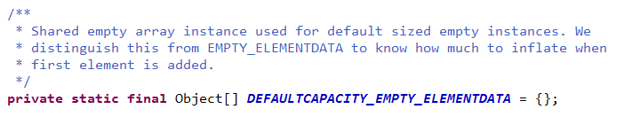

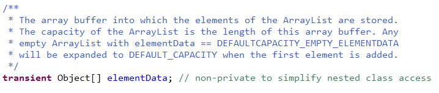

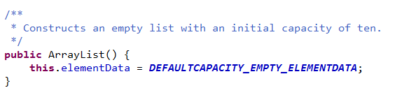


2.带参数的构造方法

这个方法是直接将一个集合作为ArrayList的元素，此时elementData即为集合c转为的数组，size即为elementData的长度。这里size是ArrayList的一个int型私有变量，用于记录该list集合中当前元素的数量，**注意不是容量**。 

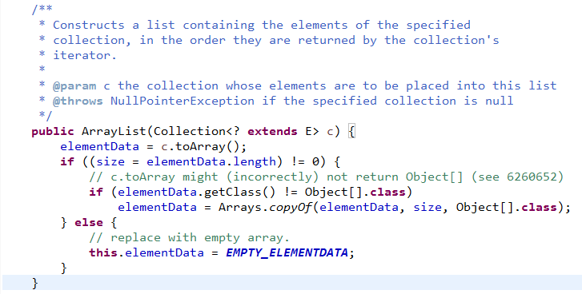


3.初始化容量的构造方法 

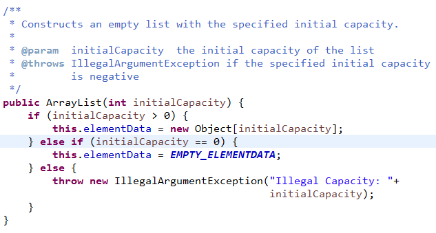


##### 2.2.4 add方法的实现

add方法：调用了ensureCapacityInternal保证容量问题

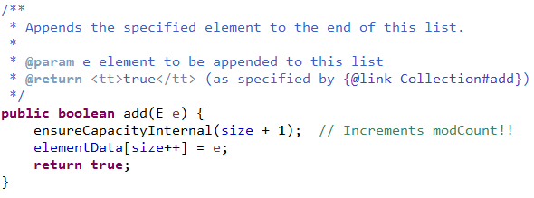


ensureCapacityInternal方法：如果传入初始化长度<10，那么会默认长度为10，反之取传入的长度

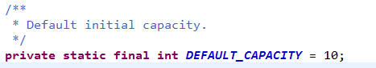


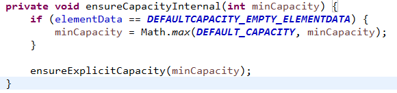


ensureExplicitCapacity方法：

可以看到modCount++，这个参数主要是用在集合的Fail-Fast机制(即快速失败机制)的判断中使用的。
在这个方法里进行判断，新增元素后的大小minCapacity是否超过当前集合的容量elementData.length，如果超过，则调用grow方法进行扩容。


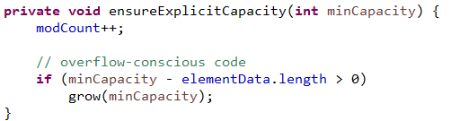


grow方法：

在这里可以很清楚的看到扩容容量的计算:int newCapacity = oldCapacity + (oldCapacity >> 1),其中oldCapacity是原来的容量大小，oldCapacity >> 1 为位运算的右移操作，右移一位相当于除以2，所以这句代码就等于int newCapacity = oldCapacity + oldCapacity / 2；即容量扩大为原来的1.5倍(注意我这里使用的是jdk1.8，没记错的话1.7也是一样的)，获取newCapacity后再对newCapacity的大小进行判断，如果仍然小于minCapacity，则直接让newCapacity 等于minCapacity，而不再计算1.5倍的扩容。然后还要再进行一步判断，即判断当前新容量是否超过最大的容量 if (newCapacity - MAX_ARRAY_SIZE > 0)，如果超过，则调用hugeCapacity方法，传进去的是minCapacity，即新增元素后需要的最小容量。

这里Arrays.copyof方法实际是调用System.arraycopy方法。 

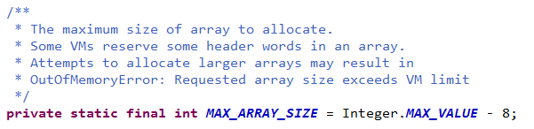


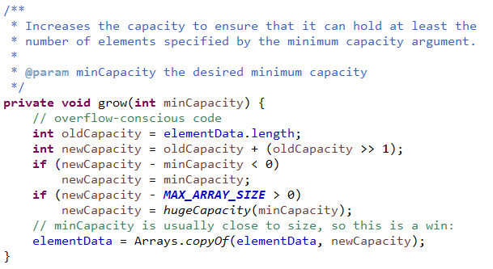


hugeCapacity方法：如果minCapacity大于MAX_ARRAY_SIZE，则返回Integer的最大值。否则返回MAX_ARRAY_SIZE。 

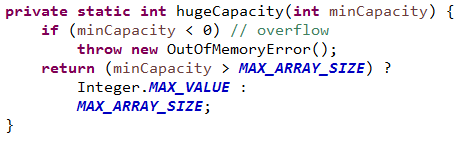


总结：与Vector不同的是，Vector每次扩容容量是翻倍，即为原来的2倍，而ArrayList是1.5倍。 


##### 2.2.5 get方法的实现

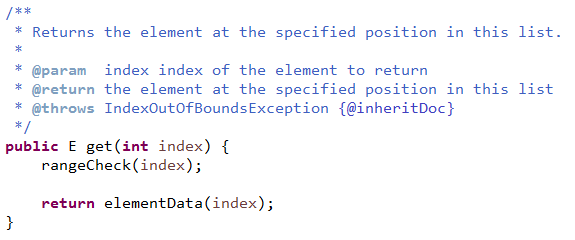


##### 2.2.6 remove

删除元素时需要调用 System.arraycopy() 对元素进行复制，因此删除操作成本很高。

```java
public E remove(int index) {
    rangeCheck(index);

    modCount++;
    E oldValue = elementData(index);

    int numMoved = size - index - 1;
    if (numMoved > 0)
        System.arraycopy(elementData, index+1, elementData, index, numMoved);
    elementData[--size] = null; // clear to let GC do its work

    return oldValue;
}
```


##### 2.2.7 size&modCount

size记录了ArrayList中元素的数量，modCount记录的是关于元素的数目被修改的次数，每次元素数量改变一次，modCount就要++，修改不算。


##### 2.2.8 序列化

ArrayList 基于数组实现，并且具有动态扩容特性，因此保存元素的数组不一定都会被使用，那么就没必要全部进行序列化。

保存元素的数组 elementData 使用 transient 修饰，该关键字声明数组默认不会被序列化。

```java
transient Object[] elementData;
```

ArrayList 实现了 writeObject() 和 readObject() 来控制只序列化数组中有元素填充那部分内容。

```java
private void readObject(java.io.ObjectInputStream s)
    throws java.io.IOException, ClassNotFoundException {
    elementData = EMPTY_ELEMENTDATA;

    // Read in size, and any hidden stuff
    s.defaultReadObject();

    // Read in capacity
    s.readInt(); // ignored

    if (size > 0) {
        // be like clone(), allocate array based upon size not capacity
        ensureCapacityInternal(size);

        Object[] a = elementData;
        // Read in all elements in the proper order.
        for (int i=0; i<size; i++) {
            a[i] = s.readObject();
        }
    }
}
```

```java
private void writeObject(java.io.ObjectOutputStream s)
    throws java.io.IOException{
    // Write out element count, and any hidden stuff
    int expectedModCount = modCount;
    s.defaultWriteObject();

    // Write out size as capacity for behavioural compatibility with clone()
    s.writeInt(size);

    // Write out all elements in the proper order.
    for (int i=0; i<size; i++) {
        s.writeObject(elementData[i]);
    }

    if (modCount != expectedModCount) {
        throw new ConcurrentModificationException();
    }
}
```

序列化时需要使用 ObjectOutputStream 的 writeObject() 将对象转换为字节流并输出。而  writeObject() 方法在传入的对象存在 writeObject() 的时候会去反射调用该对象的 writeObject()  来实现序列化。反序列化使用的是 ObjectInputStream 的 readObject() 方法，原理类似。

```java
ArrayList list = new ArrayList();
ObjectOutputStream oos = new ObjectOutputStream(new FileOutputStream(file));
oos.writeObject(list);
```


##### 2.2.9 总结

总之，ArrayList默认容量是10，如果初始化时一开始指定了容量，或者通过集合作为元素，则容量为指定的大小或参数集合的大小。每次扩容为原来的1.5倍，如果新增后超过这个容量，则容量为新增后所需的最小容量。如果增加0.5倍后的新容量超过限制的容量，则用所需的最小容量与限制的容量进行判断，超过则指定为Integer的最大值，否则指定为限制容量大小。然后通过数组的复制将原数据复制到一个更大(新的容量大小)的数组。


### 2.3 CopyOnWriteArrayList

##### 2.3.1 读写分离

写操作在一个复制的数组上进行，读操作还是在原始数组中进行，读写分离，互不影响。

写操作需要加锁，防止并发写入时导致写入数据丢失。

写操作结束之后需要把原始数组指向新的复制数组。

```java
public boolean add(E e) {
    final ReentrantLock lock = this.lock;
    lock.lock();
    try {
        Object[] elements = getArray();
        int len = elements.length;
        Object[] newElements = Arrays.copyOf(elements, len + 1);
        newElements[len] = e;
        setArray(newElements);
        return true;
    } finally {
        lock.unlock();
    }
}

final void setArray(Object[] a) {
    array = a;
}
```

```java
@SuppressWarnings("unchecked")
private E get(Object[] a, int index) {
    return (E) a[index];
}
```

### 

##### 2.3.2 适用场景

CopyOnWriteArrayList 在写操作的同时允许读操作，大大提高了读操作的性能，因此很适合读多写少的应用场景。

但是 CopyOnWriteArrayList 有其缺陷：

- 内存占用：在写操作时需要复制一个新的数组，使得内存占用为原来的两倍左右；
- 数据不一致：读操作不能读取实时性的数据，因为部分写操作的数据还未同步到读数组中。

所以 CopyOnWriteArrayList 不适合内存敏感以及对实时性要求很高的场景。


### 2.4 LinkedList

线程不安全。是双向链表，单向队列，双向队列，栈的实现类。

LinkedList 底层的数据结构是基于双向循环链表的，且头结点中不存放数据,数据添加删除效率高，只需要改变指针指向即可，但是访问数据的平均效率低，需要对链表进行遍历。 

基于双向链表实现，使用 Node 存储链表节点信息。

```java
private static class Node<E> {
    E item;
    Node<E> next;
    Node<E> prev;
}
```

每个链表存储了 first 和 last 指针：

```java
transient Node<E> first;
transient Node<E> last;
```


##### 2.4.1 如何保证线程安全

```java
List<String> list = Collections.synchronizedList(new LinkedList<String>());
```

```
LinkedList换成ConcurrentLinkedQueue 
```

建议第二种


##### 2.4.2 与 ArrayList 的比较

ArrayList 基于动态数组实现，LinkedList 基于双向链表实现。ArrayList 和 LinkedList 的区别可以归结为数组和链表的区别：

- 数组支持随机访问，但插入删除的代价很高，需要移动大量元素；
- 链表不支持随机访问，但插入删除只需要改变指针。


# 3 set

### 3.1 HashSet

不允许元素重复，不会记录元素的先后添加顺序。

hashSet专门对快速查找进行了优化。


##### 3.1.1 原理总结

1.基于HashMap实现的，默认构造函数是构建一个初始容量为16，负载因子为0.75 的HashMap。封装了一个 HashMap 对象来存储所有的集合元素，所有放入 HashSet 中的集合元素实际上由 HashMap 的 key 来保存，而 HashMap 的 value 则存储了一个 PRESENT，它是一个静态的 Object 对象。因为HashSet用不到value,他们的value都是一样的指向同一个地方。 

2.HashSet的其他操作都是基于HashMap的。

3.查询很快，插入速度也很快，但是适用于少量数据的插入操作。数据比较多的时候会涉及到扩容问题，0.75加载因子,所以速度会变慢。


##### 3.1.2 hashCode&equals

对象的hashCode值决定了再哈希表中的存储位置。

当往hashSet集合中添加新的对象的时候，先会判断该对象和集合对象中的hashCode值：

- 不等：直接存入hashCode指定位置。
- 相等：再继续判断新对象和集合对象中的equals。
  * true：则视为同一个对象，不保存。
  * false：非常麻烦，存储在之前对象同槽位的链表上。

结论：存储在哈希表中的对象，都应该覆盖equals和hashCode方法，并且保证equals相等的时候，hashCode也相等。

每一个存储到hash表中的对象，都得提供hashCode和equals方法，用来判断是否是同一个对象。


##### 3.1.3 源码

```java
import java.util.AbstractSet;
import java.util.Collection;
import java.util.HashMap;
import java.util.LinkedHashMap;
import java.util.Set;

import javax.swing.text.html.HTMLDocument.Iterator;

public class HashSet<E>  
          extends AbstractSet<E>  
          implements Set<E>, Cloneable, java.io.Serializable  
{  
static final long serialVersionUID = -5024744406713321676L;  

// 底层使用HashMap来保存HashSet中所有元素。  
private transient HashMap<E,Object> map;  
  
// 定义一个虚拟的Object对象作为HashMap的value，将此对象定义为static final。  
private static final Object PRESENT = new Object();  

 
//  默认的无参构造器，构造一个空的HashSet。 
//   
//  实际底层会初始化一个空的HashMap，并使用默认初始容量为16和加载因子0.75。 
  
public HashSet() {  
map = new HashMap<E,Object>();  
}  

 
//  构造一个包含指定collection中的元素的新set。 
//  
//  实际底层使用默认的加载因子0.75和足以包含指定 
//  collection中所有元素的初始容量来创建一个HashMap。 
//  @param c 其中的元素将存放在此set中的collection。 
 
public HashSet(Collection<? extends E> c) {  
map = new HashMap<E,Object>(Math.max((int) (c.size()/.75f) + 1, 16));  
addAll(c);  
}  

 
//  以指定的initialCapacity和loadFactor构造一个空的HashSet。 
//  
//  实际底层以相应的参数构造一个空的HashMap。 
// @param initialCapacity 初始容量。 
//  @param loadFactor 加载因子。 
   
public HashSet(int initialCapacity, float loadFactor) {  
map = new HashMap<E,Object>(initialCapacity, loadFactor);  
}  

 
//  以指定的initialCapacity构造一个空的HashSet。 
//  
//  实际底层以相应的参数及加载因子loadFactor为0.75构造一个空的HashMap。 
//  @param initialCapacity 初始容量。 
 
public HashSet(int initialCapacity) {  
map = new HashMap<E,Object>(initialCapacity);  
}  


//  以指定的initialCapacity和loadFactor构造一个新的空链接哈希集合。 
//  此构造函数为包访问权限，不对外公开，实际只是是对LinkedHashSet的支持。 
//  
//  实际底层会以指定的参数构造一个空LinkedHashMap实例来实现。 
//  @param initialCapacity 初始容量。 
//  @param loadFactor 加载因子。 
//  @param dummy 标记。 
   
HashSet(int initialCapacity, float loadFactor, boolean dummy) {  
map = new LinkedHashMap<E,Object>(initialCapacity, loadFactor);  
}  

 
//  返回对此set中元素进行迭代的迭代器。返回元素的顺序并不是特定的。 
//  
// 底层实际调用底层HashMap的keySet来返回所有的key。 
//  可见HashSet中的元素，只是存放在了底层HashMap的key上， 
//  value使用一个static final的Object对象标识。 
//  @return 对此set中元素进行迭代的Iterator。 

 public Iterator<E> iterator() {  
     return map.keySet().iterator();  

}  
 
// 返回此set中的元素的数量（set的容量）。 
//  
//  底层实际调用HashMap的size()方法返回Entry的数量，就得到该Set中元素的个数。 
//  @return 此set中的元素的数量（set的容量）。 
  
public int size() {  
return map.size();  
}  

 
//  如果此set不包含任何元素，则返回true。 
//  
//  底层实际调用HashMap的isEmpty()判断该HashSet是否为空。 
//  @return 如果此set不包含任何元素，则返回true。 
 
public boolean isEmpty() {  
return map.isEmpty();  
}  

 
//  如果此set包含指定元素，则返回true。 
//  更确切地讲，当且仅当此set包含一个满足(o==null ? e==null : o.equals(e)) 
//  的e元素时，返回true。 
// 
//  底层实际调用HashMap的containsKey判断是否包含指定key。 
// @param o 在此set中的存在已得到测试的元素。 
// @return 如果此set包含指定元素，则返回true。 
  
public boolean contains(Object o) {  
return map.containsKey(o);  
}  


// 如果此set中尚未包含指定元素，则添加指定元素。 
// 更确切地讲，如果此 set 没有包含满足(e==null ? e2==null : e.equals(e2)) 
// 的元素e2，则向此set 添加指定的元素e。 
// 如果此set已包含该元素，则该调用不更改set并返回false。 
// 
// 底层实际将将该元素作为key放入HashMap。 
// 由于HashMap的put()方法添加key-value对时，当新放入HashMap的Entry中key 
//与集合中原有Entry的key相同（hashCode()返回值相等，通过equals比较也返回true）， 
//新添加的Entry的value会将覆盖原来Entry的value，但key不会有任何改变， 
//  因此如果向HashSet中添加一个已经存在的元素时，新添加的集合元素将不会被放入HashMap中， 
//  原来的元素也不会有任何改变，这也就满足了Set中元素不重复的特性。 
//  @param e 将添加到此set中的元素。 
//  @return 如果此set尚未包含指定元素，则返回true。 
 
public boolean add(E e) {  
       return map.put(e, PRESENT)==null;  
}  

//  如果指定元素存在于此set中，则将其移除。 
//  更确切地讲，如果此set包含一个满足(o==null ? e==null : o.equals(e))的元素e， 
//  则将其移除。如果此set已包含该元素，则返回true 
// （或者：如果此set因调用而发生更改，则返回true）。（一旦调用返回，则此set不再包含该元素）。 
//  
//  底层实际调用HashMap的remove方法删除指定Entry。 
//  @param o 如果存在于此set中则需要将其移除的对象。 
//  @return 如果set包含指定元素，则返回true。 
 
public boolean remove(Object o) {  
return map.remove(o)==PRESENT;  
}  

 
//  从此set中移除所有元素。此调用返回后，该set将为空。 
//  
//  底层实际调用HashMap的clear方法清空Entry中所有元素。 
 
public void clear() {  
map.clear();  
}  
 
//  返回此HashSet实例的浅表副本：并没有复制这些元素本身。 

//  底层实际调用HashMap的clone()方法，获取HashMap的浅表副本，并设置到HashSet中。 
 
public Object clone() {  
    try {  
        HashSet<E> newSet = (HashSet<E>) super.clone();  
        newSet.map = (HashMap<E, Object>) map.clone();  
        return newSet;  
    } catch (CloneNotSupportedException e) {  
        throw new InternalError();  
    }  
}  
}

```


1. 实现原理，基于哈希表（hashmap）实现。

2. 不允许重复键存在，但可以有null值。
3. 哈希表存储是无序的。
4. 添加元素时把元素当作hashmap的key存储，HashMap的value是存储的一个固定值object
5. 排除重复元素是通过equals检查对象是否相同。
6. 判断2个对象是否相同，先根据2个对象的hashcode比较是否相等（如果两个对象的hashcode相同，它们也不一定是同一个对象，如果不同，那一定不是同一个对象）如果不同，则两个对象不是同一个对象，如果相同，在将2个对象进行equals检查来判断是否相同，如果相同则是同一个对象，不同则不是同一个对象。
7. 如果要完全判断自定义对象是否有重复值，这个时候需要将自定义对象重写对象所在类的hashcode和equals方法来解决。
8. 哈希表的存储结构就是：数组+链表，数组的每个元素都是以链表的形式存储的。


### 3.2 LinkedHashSet

不可重复，保证插入顺序，线程不安全。

底层基于LinkedHashMap实现，是一个哈希表和双向链表的结合。（链表可以保证插入的顺序，哈希表保证取数据的快速）


##### 3.2.1 构造器

初始化容量为16，加载因子为0.75 。

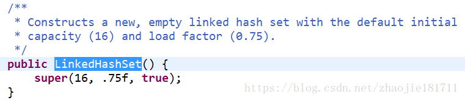

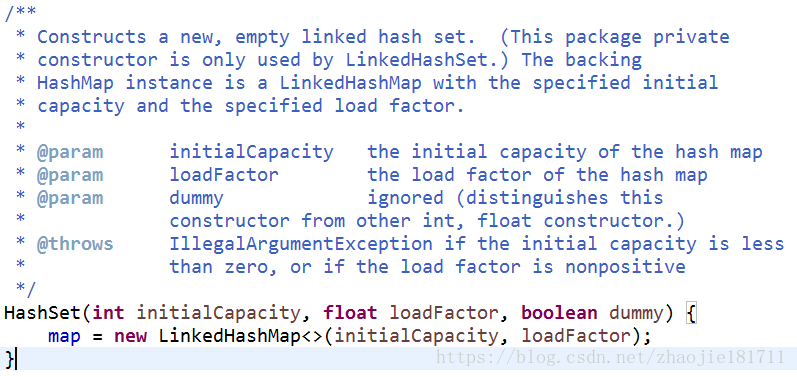


##### 3.2.2 add方法

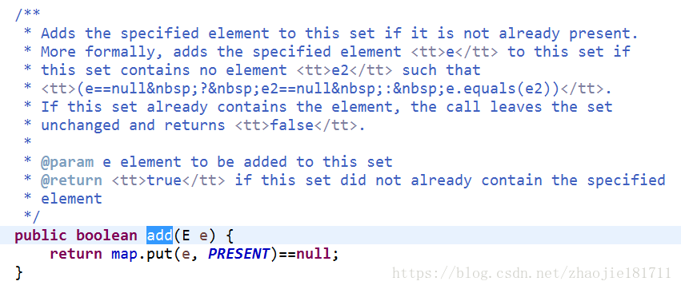


### 3.3 TreeSet

底层红黑树算法，会对存储的元素默认使用自然排序（从小到大），基于TreeMap实现，线程不安全。

注意：必须保证TreeSet集合中的元素对象是相同的数据类型，否则报错。


##### 3.3.1 特性总结

1.TreeSet()是使用二叉树的原理对新add()的对象按照指定的顺序排序，每增加一个对象都会进行排序，将对象插入的二叉树指定的位置。

2.Integer和String对象都可以进行默认的TreeSet排序，而自定义类的对象是不可以的，自己定义的类必须实现Comparable接口，并且覆写相应的compareTo()函数，才可以正常使用。

3.在覆写compare()函数时，要返回相应的值才能使TreeSet按照一定的规则来排序（升序，this.对象 < 指定对象的条件下返回-1）

（降序，this.对象 < 指定对象的条件下返回-1）升序是：比较此对象与指定对象的顺序。如果该对象小于、等于或大于指定对象，则分别返回负整数、零或正整数。
eg:

```java
public int compareTo(Object obj){
		Persontest per = (Persontest) obj;
		//升序
		if(per.age < this.age){
			return -1;
		}
		if(per.age > this.age){
			return 1;
		}
		if(per.age == this.age){
			return this.name.compareTo(per.name);
		}
		return 0;
	}
```


##### 3.3.2 初始化

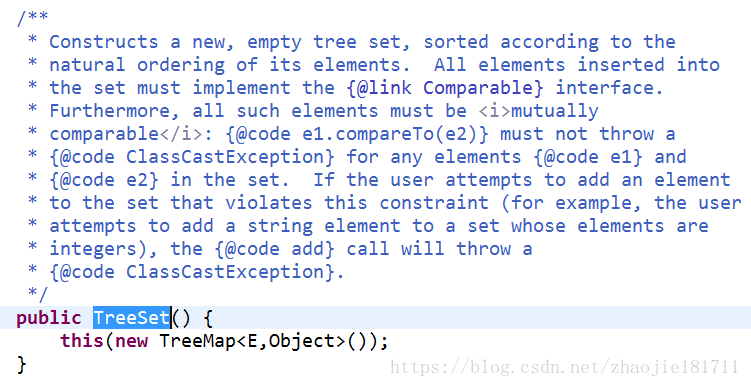

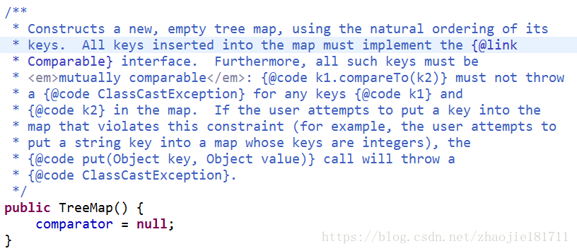

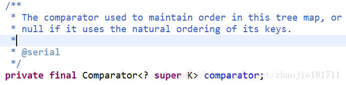


comparator：用于维护元素的比较器。如果为null，则keys用的是自然排序。 

创建一个TreeSet，等于创建一个空的自然排序的TreeMap容器。 


##### 3.3.3 add

容器提供了两种排序的方法，一种自然排序当comparator为空的时候，构建无参构造函数的时候默认的一种排序方式 。

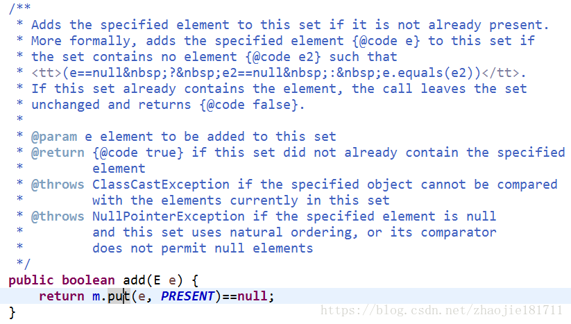


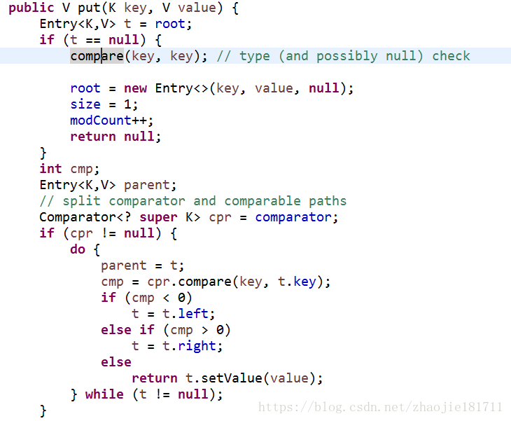

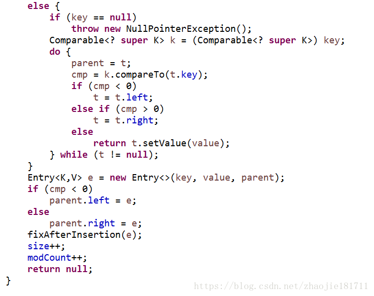


# 4 map

HashMap,LinkedHashMap,TreeMap都不是线程安全的，性能较高。

- Hashtable 是早期Java类库提供的一个哈希表实现，本身是同步的，不支持 null 键和值，由于同步导致的性能开销，所以已经很少被推荐使用。
- HashMap与 HashTable主要区别在于 HashMap 不是同步的，支持 null 键和值等。通常情况下，HashMap 进行 put 或者 get 操作，可以达到常数时间的性能，所以它是绝大部分利用键值对存取场景的首选。
- LinkedHashMap有顺序不重复。
- TreeMap 则是基于红黑树的一种提供顺序访问的 Map，和 HashMap 不同，它的 get、put、remove 之类操作都是 O（log(n)）的时间复杂度，具体顺序可以由指定的 Comparator 来决定，或者根据键的自然顺序来判断。
  


### 4.1 Hashmap

##### 4.1.1 结构

HashMap是数组+链表+红黑树 。

数组被分为一个个桶（bucket），每个桶存储有一个或多个Entry对象，每个Entry对象包含三部分key（键）、value（值），next(指向下一个Entry），通过哈希值决定了Entry对象在这个数组的寻址；哈希值相同的Entry对象（键值对），则以链表形式存储。如果链表大小超过树形转换的阈值（TREEIFY_THRESHOLD= 8），链表就会被改造为树形结构。
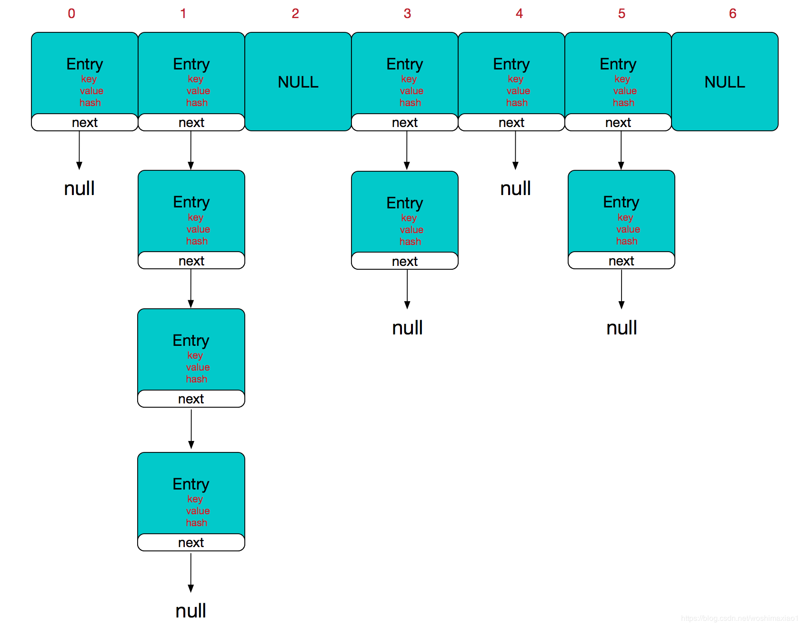


查询时间复杂度：HashMap的本质可以认为是一个数组，数组的每个索引被称为桶，每个桶里放着一个单链表，一个节点连着一个节点。很明显通过下标来检索数组元素时间复杂度为O(1)，而且遍历链表的时间复杂度是O(n)，所以在链表长度尽可能短的前提下，HashMap的查询复杂度接近O(1)

- 数组：存储区间连续，占用内存严重，寻址容易，插入删除困难；  
- 链表：存储区间离散，占用内存比较宽松，寻址困难，插入删除容易；  

Hashmap综合应用了这两种数据结构，实现了寻址容易，插入删除也容易。 


##### 4.1.2 拉链法的工作原理

```java
HashMap<String, String> map = new HashMap<>();
map.put("K1", "V1");
map.put("K2", "V2");
map.put("K3", "V3");
```

- 新建一个 HashMap，默认大小为 16；
- 插入 <K1,V1> 键值对，先计算 K1 的 hashCode 为 115，使用除留余数法得到所在的桶下标 115%16=3。
- 插入 <K2,V2> 键值对，先计算 K2 的 hashCode 为 118，使用除留余数法得到所在的桶下标 118%16=6。
- 插入 <K3,V3> 键值对，先计算 K3 的 hashCode 为 118，使用除留余数法得到所在的桶下标 118%16=6，插在 <K2,V2> 前面。

应该注意到链表的插入是以头插法方式进行的，例如上面的 <K3,V3> 不是插在 <K2,V2> 后面，而是插入在链表头部。


查找需要分成两步进行：

- 计算键值对所在的桶；
- 在链表上顺序查找，时间复杂度显然和链表的长度成正比。


##### 4.1.3 属性&类

属性：

```java
public class HashMap<K,V> extends AbstractMap<K,V>
    implements Map<K,V>, Cloneable, Serializable {
    //序列号，序列化的时候使用。
    private static final long serialVersionUID = 362498820763181265L;
    /**默认容量，1向左移位4个，00000001变成00010000，也就是2的4次方为16，使用移位是因为移位是计算机基础运算，效率比加减乘除快。**/
    static final int DEFAULT_INITIAL_CAPACITY = 1 << 4;
    
    //最大容量，2的30次方。
    static final int MAXIMUM_CAPACITY = 1 << 30;
    
    //加载因子，用于扩容使用。
    static final float DEFAULT_LOAD_FACTOR = 0.75f;
    
    //当某个桶节点数量大于8时，会转换为红黑树。
    static final int TREEIFY_THRESHOLD = 8;
    
    //当某个桶节点数量小于6时，会转换为链表，前提是它当前是红黑树结构。
    static final int UNTREEIFY_THRESHOLD = 6;
    
    //当整个hashMap中元素数量大于64时，也会进行转为红黑树结构。
    static final int MIN_TREEIFY_CAPACITY = 64;
    
    //存储元素的数组，transient关键字表示该属性不能被序列化
    transient Node<K,V>[] table;
    
    //将数据转换成set的另一种存储形式，这个变量主要用于迭代功能。
    transient Set<Map.Entry<K,V>> entrySet;
    
    //元素数量
    transient int size;
    
    //统计该map修改的次数
    transient int modCount;
    
    //临界值，也就是元素数量达到临界值时，会进行扩容。
    int threshold;
    
    //也是加载因子，只不过这个是变量。
    final float loadFactor;  
```


几个常用内部类：

使用静态内部类，是为了方便调用，而不用每次调用里面的属性或者方法都需要new一个对象。这是一个红黑树的结构。

```java
static final class TreeNode<K,V> extends LinkedHashMap.Entry<K,V> {
        TreeNode<K,V> parent;  
        TreeNode<K,V> left;
        TreeNode<K,V> right;
        TreeNode<K,V> prev;    
        boolean red;
        TreeNode(int hash, K key, V val, Node<K,V> next) {
            super(hash, key, val, next);
        }
}
```

```java
 static class Node<K,V> implements Map.Entry<K,V> {
        final int hash;
        final K key;
        V value;
        Node<K,V> next;
 
        Node(int hash, K key, V value, Node<K,V> next) {
            this.hash = hash;
            this.key = key;
            this.value = value;
            this.next = next;
        }
}
```

里面还包含了一个结点内部类，是一个单向链表。上面这两个内部类再加上之前的Node<K,V>[] table属性，组成了hashMap的结构，哈希桶。 


##### 4.1.4 初始化

第一个，空参构造，使用默认的加载因子0.75；第二个，设置初始容量，并使用默认的加载因子；第三个，设置初始容量和加载因子，其实第二个构造方法也是调用了第三个。下面，在看看最后一个构造函数。 

```java
    public HashMap() {
        this.loadFactor = DEFAULT_LOAD_FACTOR; 
    }
 
 
    public HashMap(int initialCapacity) {
        this(initialCapacity, DEFAULT_LOAD_FACTOR);
    }
 
 
    public HashMap(int initialCapacity, float loadFactor) {
        if (initialCapacity < 0)
            throw new IllegalArgumentException("Illegal initial capacity: " +
                                               initialCapacity);
        if (initialCapacity > MAXIMUM_CAPACITY)
            initialCapacity = MAXIMUM_CAPACITY;
        if (loadFactor <= 0 || Float.isNaN(loadFactor))
            throw new IllegalArgumentException("Illegal load factor: " +
                                               loadFactor);
        this.loadFactor = loadFactor;
        this.threshold = tableSizeFor(initialCapacity);
    }
```

第四个构造器：

   该构造函数，传入一个Map，然后把该Map转为hashMap，resize方法在下面添加元素的时候会详细讲解，在上面中entrySet方法会返回一个Set<Map.Entry<K, V>>，泛型为Map的内部类Entry，它是一个存放key-value的实例，也就是Map中的每一个key-value就是一个Entry实例，为什么使用这个方式进行遍历，因为效率高，具体自己百度一波，putVal方法把取出来的每个key-value存入到hashMap中，待会会仔细讲解。

```java
    public HashMap(Map<? extends K, ? extends V> m) {
        this.loadFactor = DEFAULT_LOAD_FACTOR;
        putMapEntries(m, false);
    }
 
 
    final void putMapEntries(Map<? extends K, ? extends V> m, boolean evict) {
        //获取该map的实际长度
        int s = m.size();
        if (s > 0) {
            //判断table是否初始化，如果没有初始化
            if (table == null) { // pre-size
                /**求出需要的容量，因为实际使用的长度=容量*0.75得来的，+1是因为小数相除，基本都不会是整数，容量大小不能为小数的，后面转换为int，多余的小数就要被丢掉，所以+1，例如，map实际长度22，22/0.75=29.3,所需要的容量肯定为30，有人会问如果刚刚好除得整数呢，除得整数的话，容量大小多1也没什么影响**/
                float ft = ((float)s / loadFactor) + 1.0F;
                //判断该容量大小是否超出上限。
                int t = ((ft < (float)MAXIMUM_CAPACITY) ?
                         (int)ft : MAXIMUM_CAPACITY);
                /**对临界值进行初始化，tableSizeFor(t)这个方法会返回大于t值的，且离其最近的2次幂，例如t为29，则返回的值是32**/
                if (t > threshold)
                    threshold = tableSizeFor(t);
            }
            //如果table已经初始化，则进行扩容操作，resize()就是扩容。
            else if (s > threshold)
                resize();
            //遍历，把map中的数据转到hashMap中。
            for (Map.Entry<? extends K, ? extends V> e : m.entrySet()) {
                K key = e.getKey();
                V value = e.getValue();
                putVal(hash(key), key, value, false, evict);
            }
        }
    }
```

无注释：

```java
 public HashMap(Map<? extends K, ? extends V> m) {
        this.loadFactor = DEFAULT_LOAD_FACTOR;
        putMapEntries(m, false);
    }
 
 
    final void putMapEntries(Map<? extends K, ? extends V> m, boolean evict) {
        int s = m.size();
        if (s > 0) {
            if (table == null) { 
                float ft = ((float)s / loadFactor) + 1.0F;
                int t = ((ft < (float)MAXIMUM_CAPACITY) ?
                         (int)ft : MAXIMUM_CAPACITY);
                if (t > threshold)
                    threshold = tableSizeFor(t);
            }
            else if (s > threshold)
                resize();
            for (Map.Entry<? extends K, ? extends V> e : m.entrySet()) {
                K key = e.getKey();
                V value = e.getValue();
                putVal(hash(key), key, value, false, evict);
            }
        }
    }
```


##### 4.1.5 put

HashMap的工作原理 ：HashMap是基于散列法（又称哈希法）的原理，使用put(key, value)存储对象到HashMap中，使用get(key)从HashMap中获取对象。当我们给put()方法传递键和值时，我们先对键调用hashCode()方法，返回的hashCode用于找到bucket（桶）位置来储存Entry对象。HashMap是在bucket中储存键对象和值对象，作为Map.Entry。并不是仅仅只在bucket中存储值。


put:

1.如果数组未进行初始化或者为空，则通过resize()初始化,并返回数组的长度

2.用hash值计算应该存放在数组中的位置，如果此位置为空，则新的节点放在这个位置。

如果不为空，继续判断。

3.如果hash值与数组中节点的hash值相等，key也相等，则直接取代。如果是红黑树节点，putTreeVal将值加入红黑树节点。如果是链表节点，放入链表，放入后计算节点是否达到阈值，达到了就转为一颗红黑树。

4.最后判断数组的长度是否超过了threshold，超过了需要进行扩容。


```java
    final V putVal(int hash, K key, V value, boolean onlyIfAbsent,boolean evict) {
        Node<K,V>[] tab; Node<K,V> p; int n, i;
        
        // 如果数组未进行初始化或者为空，则通过resize()初始化,并返回数组的长度
        if ((tab = table) == null || (n = tab.length) == 0) 
            n = (tab = resize()).length;
        
        // (n - 1) & hash 确定节点放在数组的哪个位置（这个表达式中可以看出为什么数组的扩容的长度为什么要是2的n次幂的原因了）
        // 确定后的在数组中的该位置为空，则新的节点放在这个位置
        if ((p = tab[i = (n - 1) & hash]) == null)
            tab[i] = newNode(hash, key, value, null);
        
        // 以下的else中的逻辑表示确定的该位置不是空
        else {
            Node<K,V> e; K k;
            
            // 如果与数组中的节点的hash值相等，则直接取代
            if (p.hash == hash && ((k = p.key) == key || (key != null && key.equals(k))))
                e = p;
            
            // 如果是红黑树节点
            else if (p instanceof TreeNode)
                e = ((TreeNode<K,V>)p).putTreeVal(this, tab, hash, key, value);
            
            // 如果是链表节点
            else {
                for (int binCount = 0; ; ++binCount) {
                    if ((e = p.next) == null) {
                        p.next = newNode(hash, key, value, null);
                        
                        // 节点到达阈值，转为红黑树
                        if (binCount >= TREEIFY_THRESHOLD - 1) // -1 for 1st
                            treeifyBin(tab, hash);
                        break;
                    }
                    if (e.hash == hash && ((k = e.key) == key || (key != null && key.equals(k))))
                        break;
                    p = e;
                }
            }
            if (e != null) { // existing mapping for key
                V oldValue = e.value;
                if (!onlyIfAbsent || oldValue == null)
                    e.value = value;
                afterNodeAccess(e);
                return oldValue;
            }
        }
        ++modCount;
        
        // 如果数组中的元素个数超过阈值，则进行扩容
        if (++size > threshold)
            resize();
        afterNodeInsertion(evict);
        return null;
    }
```


##### 4.1.6 扩容

因为从 JDK 1.8 开始引入了红黑树，因此扩容操作较为复杂，为了便于理解，以下内容使用 JDK 1.7 的内容。

设 HashMap 的 table 长度为 M，需要存储的键值对数量为 N，如果哈希函数满足均匀性的要求，那么每条链表的长度大约为 N/M，因此平均查找次数的数量级为 O(N/M)。

为了让查找的成本降低，应该尽可能使得 N/M 尽可能小，因此需要保证 M 尽可能大，也就是说 table 要尽可能大。HashMap 采用动态扩容来根据当前的 N 值来调整 M 值，使得空间效率和时间效率都能得到保证。

和扩容相关的参数主要有：capacity、size、threshold 和 load_factor。

|    参数     | 含义                                                         |
| :---------: | :----------------------------------------------------------- |
|  capacity   | table 的容量大小，默认为 16，需要注意的是 capacity 必须保证为 2 的次方。 |
|    size     | table 的实际使用量。                                         |
|  threshold  | size 的临界值，size 必须小于 threshold，如果大于等于，就必须进行扩容操作。 |
| load_factor | table 能够使用的比例，threshold = capacity * load_factor。   |

```java
static final int DEFAULT_INITIAL_CAPACITY = 16;

static final int MAXIMUM_CAPACITY = 1 << 30;

static final float DEFAULT_LOAD_FACTOR = 0.75f;

transient Entry[] table;

transient int size;

int threshold;

final float loadFactor;

transient int modCount;
```


从下面的添加元素代码中可以看出，当需要扩容时，令 capacity 为原来的两倍。

```java
void addEntry(int hash, K key, V value, int bucketIndex) {
    Entry<K,V> e = table[bucketIndex];
    table[bucketIndex] = new Entry<>(hash, key, value, e);
    if (size++ >= threshold)
        resize(2 * table.length);
}
```

扩容使用 resize() 实现，需要注意的是，扩容操作同样需要把旧 table 的所有键值对重新插入新的 table 中，因此这一步是很费时的。

```java
void resize(int newCapacity) {
    Entry[] oldTable = table;
    int oldCapacity = oldTable.length;
    if (oldCapacity == MAXIMUM_CAPACITY) {
        threshold = Integer.MAX_VALUE;
        return;
    }

    Entry[] newTable = new Entry[newCapacity];
    transfer(newTable);
    table = newTable;
    threshold = (int)(newCapacity * loadFactor);
}

void transfer(Entry[] newTable) {
    Entry[] src = table;
    int newCapacity = newTable.length;
    for (int j = 0; j < src.length; j++) {
        Entry<K,V> e = src[j];
        if (e != null) {
            src[j] = null;
            do {
                Entry<K,V> next = e.next;
                int i = indexFor(e.hash, newCapacity);
                e.next = newTable[i];
                newTable[i] = e;
                e = next;
            } while (e != null);
        }
    }
}
```


##### 4.1.7 确定桶下标

很多操作都需要先确定一个键值对所在的桶下标，需要分三步进行。

（一）hashCode()

调用 Key 的 hashCode() 方法得到 hashCode。

```java
public final int hashCode() {
    return Objects.hashCode(key) ^ Objects.hashCode(value);
}
```

（二）高位运算

将 hashCode 的高 16 位和低 16 位进行异或操作，使得在数组比较小时，也能保证高低位都参与到了哈希计算中。

```java
static final int hash(Object key) {
    int h;
    return (key == null) ? 0 : (h = key.hashCode()) ^ (h >>> 16);
}
```

（三）除留余数法

令 x = 1<<4，即 x 为 2 的 4 次方，它具有以下性质：

```
x   : 00010000
x-1 : 00001111
```

令一个数 y 与 x-1 做与运算，可以去除 y 位级表示的第 4 位及以上数：

```
y       : 10110010
x-1     : 00001111
y&(x-1) : 00000010
```

这个性质和 y 对 x 取模效果是一样的：

```
x   : 00010000
y   : 10110010
y%x : 00000010
```

我们知道，位运算的代价比求模运算小的多，因此在进行这种计算时能用位运算的话能带来更高的性能。

拉链法需要使用除留余数法来得到桶下标，也就是需要进行以下计算：hash%capacity，如果能保证 capacity 为 2 的幂次方，那么就可以将这个操作转换位位运算。

以下操作在 Java 8 中没有，但是原理上相同。

```java
static int indexFor(int h, int length) {
    return h & (length-1);
}
```


##### 4.1.8 扩容-重新计算桶下标

在进行扩容时，需要把 Node 重新放到对应的桶上。HashMap 使用了一个特殊的机制，可以降低重新计算桶下标的操作。

假设原数组长度 capacity 为 8，扩容之后 new capacity 为 16：

```html
capacity     : 00010000
new capacity : 00100000
```

对于一个 Key，它的 hashCode 如果在第 6 位上为 0，那么除留余数得到的结果和之前一样；如果为 1，那么得到的结果为原来的结果 + 8。


##### 4.1.9 扩容-计算数组容量

先考虑如何求一个数的补码，对于 10010000，它的掩码为 11111111，可以使用以下方法得到：

```
mask |= mask >> 1    11011000
mask |= mask >> 2    11111100
mask |= mask >> 4    11111111
```

如果最后令 mask+1，得到就是大于原始数字的最小的 2 次方。

以下是 HashMap 中计算一个大小所需要的数组容量的代码：

```java
static final int tableSizeFor(int cap) {
    int n = cap - 1;
    n |= n >>> 1;
    n |= n >>> 2;
    n |= n >>> 4;
    n |= n >>> 8;
    n |= n >>> 16;
    return (n < 0) ? 1 : (n >= MAXIMUM_CAPACITY) ? MAXIMUM_CAPACITY : n + 1;
}
```


##### 4.1.10 null值

HashMap 允许有一个 Node 的 Key 为 null，该 Node 一定会放在第 0 个桶的位置，因为这个 Key 无法计算 hashCode()，因此只能规定一个桶让它存放。


##### 4.1.11 与 HashTable 的区别

- HashTable 是同步的，它使用了 synchronized 来进行同步。它也是线程安全的，多个线程可以共享同一个 HashTable。HashMap 不是同步的，但是可以使用 ConcurrentHashMap，它是 HashTable 的替代，而且比 HashTable 可扩展性更好。
- HashMap 可以插入键为 null 的 Entry。
- HashMap 的迭代器是 fail-fast 迭代器，而 Hashtable 的 enumerator 迭代器不是 fail-fast 的。
- 由于 Hashtable 是线程安全的也是 synchronized，所以在单线程环境下它比 HashMap 要慢。
- HashMap 不能保证随着时间的推移 Map 中的元素次序是不变的。


### 4.2 LinkedHashMap

保持了插入顺序的HashMap。

##### 4.2.1 存储结构

继承自 HashMap，因此具有和 HashMap 一样的快速查找特性。

```java
public class LinkedHashMap<K,V> extends HashMap<K,V> implements Map<K,V>
```

内部维护了一个双向链表，用来维护插入顺序或者 LRU 顺序。

```java
/**
 * The head (eldest) of the doubly linked list.
 */
transient LinkedHashMap.Entry<K,V> head;

/**
 * The tail (youngest) of the doubly linked list.
 */
transient LinkedHashMap.Entry<K,V> tail;
```

accessOrder 决定了顺序，默认为 false，此时维护的是插入顺序。java

```java
final boolean accessOrder;
```

LinkedHashMap 最重要的是以下用于维护顺序的函数，它们会在 put、get 等方法中调用。

```java
void afterNodeAccess(Node<K,V> p) { }
void afterNodeInsertion(boolean evict) { }
```

### 

##### 4.2.2 afterNodeAccess()

当一个节点被访问时，如果 accessOrder 为 true，则会将该节点移到链表尾部。也就是说指定为 LRU 顺序之后，在每次访问一个节点时，会将这个节点移到链表尾部，保证链表尾部是最近访问的节点，那么链表首部就是最近最久未使用的节点。

```java
void afterNodeAccess(Node<K,V> e) { // move node to last
    LinkedHashMap.Entry<K,V> last;
    if (accessOrder && (last = tail) != e) {
        LinkedHashMap.Entry<K,V> p =
            (LinkedHashMap.Entry<K,V>)e, b = p.before, a = p.after;
        p.after = null;
        if (b == null)
            head = a;
        else
            b.after = a;
        if (a != null)
            a.before = b;
        else
            last = b;
        if (last == null)
            head = p;
        else {
            p.before = last;
            last.after = p;
        }
        tail = p;
        ++modCount;
    }
}
```

### 

##### 4.2.3 afterNodeInsertion()

在 put 等操作之后执行，当 removeEldestEntry() 方法返回 true 时会移除最晚的节点，也就是链表首部节点 first。

evict 只有在构建 Map 的时候才为 false，在这里为 true。

```java
void afterNodeInsertion(boolean evict) { // possibly remove eldest
    LinkedHashMap.Entry<K,V> first;
    if (evict && (first = head) != null && removeEldestEntry(first)) {
        K key = first.key;
        removeNode(hash(key), key, null, false, true);
    }
}
```

removeEldestEntry() 默认为 false，如果需要让它为 true，需要继承 LinkedHashMap  并且覆盖这个方法的实现，这在实现 LRU 的缓存中特别有用，通过移除最近最久未使用的节点，从而保证缓存空间足够，并且缓存的数据都是热点数据。

```java
protected boolean removeEldestEntry(Map.Entry<K,V> eldest) {
    return false;
}
```

### 

##### 4.2.4 LRU 缓存

以下是使用 LinkedHashMap 实现的一个 LRU 缓存：

- 设定最大缓存空间 MAX_ENTRIES  为 3；
- 使用 LinkedHashMap 的构造函数将 accessOrder 设置为 true，开启 LRU 顺序；
- 覆盖 removeEldestEntry() 方法实现，在节点多于 MAX_ENTRIES 就会将最近最久未使用的数据移除。

```java
class LRUCache<K, V> extends LinkedHashMap<K, V> {
    private static final int MAX_ENTRIES = 3;

    protected boolean removeEldestEntry(Map.Entry eldest) {
        return size() > MAX_ENTRIES;
    }

    LRUCache() {
        super(MAX_ENTRIES, 0.75f, true);
    }
}
public static void main(String[] args) {
    LRUCache<Integer, String> cache = new LRUCache<>();
    cache.put(1, "a");
    cache.put(2, "b");
    cache.put(3, "c");
    cache.get(1);
    cache.put(4, "d");
    System.out.println(cache.keySet());
}
[3, 1, 4]
```


### 4.3 TreeMap

底层基于红黑树，是一个有序的hashmap。


### 4.4 三者区别

1.HashMap中k的值没有顺序，常用来做统计。

2.LinkedHashMap吧。它内部有一个链表，保持Key插入的顺序。迭代的时候，也是按照插入顺序迭代，而且迭代比HashMap快。

3.TreeMap的顺序是Key的自然顺序（如整数从小到大），也可以指定比较函数。但不是插入的顺序。Hashtable、HashMap、TreeMap都实现了Map接口，使用键值对的形式存储数据和操作数据。

典型回答：

* Hashtable是java早期提供的，方法是同步的（加了synchronized）。key和value都不能是null值。
* HashMap的方法不是同步的，支持key和value为null的情况。行为上基本和Hashtable一致。由于Hashtable是同步的，性能开销比较大，一般不推荐使用Hashtable。通常会选择使用HashMap。HashMap进行put和get操作，基本上可以达到常数时间的性能。
* TreeMap是基于红黑树的一种提供顺序访问的Map，和HashMap不同，它的get或put操作的时间复杂度是O(log(n))。具体的顺序由指定的Comparator来决定，或者根据键key的具体顺序来决定。


# 5 常见集合扩容机制

|                | 底层数据结构  | 默认初始容量 |                    加载因子                    |             扩容增量             |
| :------------: | :-----------: | :----------: | :--------------------------------------------: | :------------------------------: |
|   ArrayList    |     数组      |      10      |    1：当元素个数超过容量长度的1倍时进行扩容    |  0.5：扩容后容量为原容量的1.5倍  |
|     Vector     |     数组      |      10      |    1：当元素个数超过容量长度的1倍时进行扩容    |    1：扩容后容量为原容量的2倍    |
|    HashSet     |    HashMap    |      16      | 0.75：当元素个数超过容量长度的0.75倍时进行扩容 |    1：扩容后容量为原容量的2倍    |
| LinkedHashASet | LinkedHashMap |      16      | 0.75：当元素个数超过容量长度的0.75倍时进行扩容 |    1：扩容后容量为原容量的2倍    |
|    HashMap     |    散列表     |      16      | 0.75：当元素个数超过容量长度的0.75倍时进行扩容 |    1：扩容后容量为原容量的2倍    |
|   Hashtable    |    散列表     |      11      | 0.75：当元素个数超过容量长度的0.75倍时进行扩容 | 1 + 1：扩容后容量为原容量的2倍+1 |


# 6 fail-fast机制

### 6.1 介绍

“快速失败”也就是fail-fast，它是Java集合的一种错误检测机制。当多个线程对集合进行结构上的改变的操作时，有可能会产生fail-fast机制。记住是有可能，而不是一定。例如：假设存在两个线程（线程1、线程2），线程1通过Iterator在遍历集合A中的元素，在某个时候线程2修改了集合A的结构（是结构上面的修改，而不是简单的修改集合元素的内容），那么这个时候程序就会抛出 ConcurrentModificationException 异常，从而产生fail-fast机制。


### 6.2 事例

比如在ArryaList中有一个modCount， 用来记录 ArrayList 结构发生变化的次数。结构发生变化是指添加或者删除至少一个元素的所有操作，或者是调整内部数组的大小，仅仅只是设置元素的值不算结构发生变化。

在进行序列化或者迭代等操作时，需要比较操作前后 modCount 是否改变，如果改变了需要抛出 ConcurrentModificationException。

```java
private void writeObject(java.io.ObjectOutputStream s)
    throws java.io.IOException{
    // Write out element count, and any hidden stuff
    int expectedModCount = modCount;
    s.defaultWriteObject();

    // Write out size as capacity for behavioural compatibility with clone()
    s.writeInt(size);

    // Write out all elements in the proper order.
    for (int i=0; i<size; i++) {
        s.writeObject(elementData[i]);
    }

    if (modCount != expectedModCount) {
        throw new ConcurrentModificationException();
    }
}
```


 参考博客：https://blog.csdn.net/chenssy/article/details/38151189

https://blog.csdn.net/zymx14/article/details/78324464