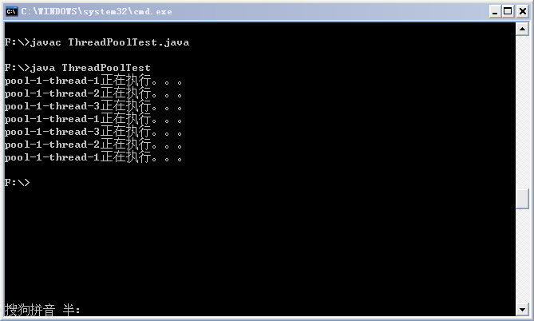
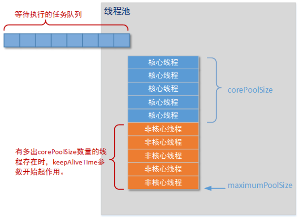
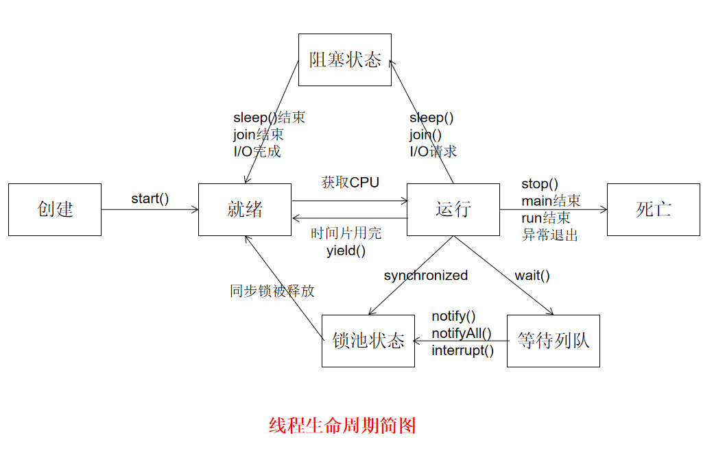
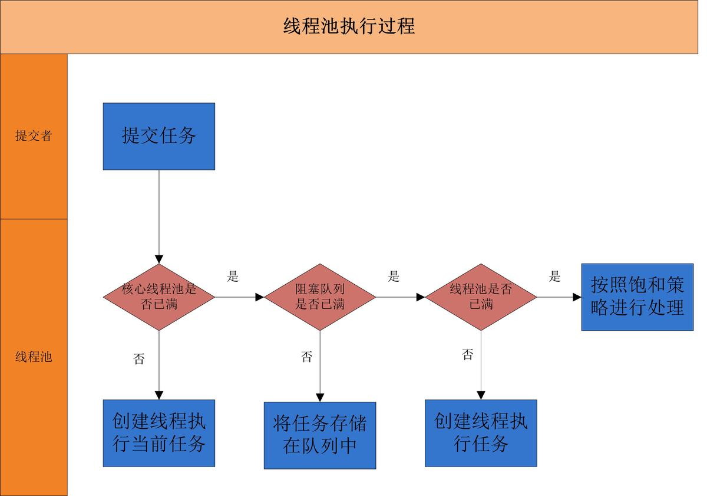
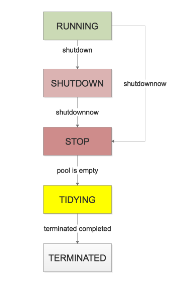
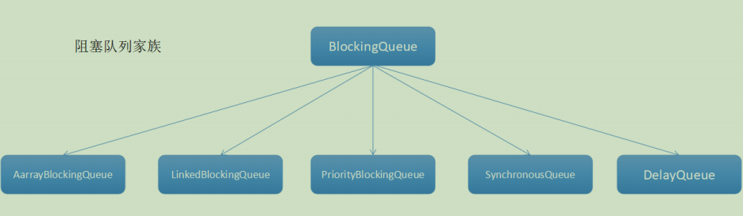
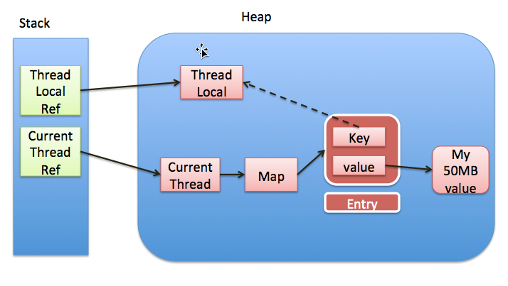
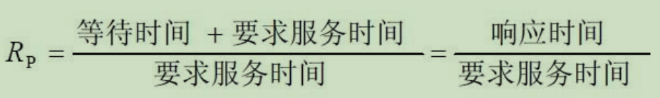

# 1 线程创建方式

Java使用Thread类代表线程，所有的线程对象都必须是Thread类或其子类的实例。Java可以用四种方式来创建线程，如下所示：

1）继承Thread类创建线程

2）实现Runnable接口创建线程

3）使用Callable和Future创建线程

4）使用线程池例如用Executor框架


### 1.1 实现 Runnable 接口

需要实现接口中的 run() 方法。

```java
public class MyRunnable implements Runnable {
    @Override
    public void run() {
        // ...
    }
}
```

使用 Runnable 实例再创建一个 Thread 实例，然后调用 Thread 实例的 start() 方法来启动线程。

```java
public static void main(String[] args) {
    MyRunnable instance = new MyRunnable();
    Thread thread = new Thread(instance);
    thread.start();
}
```


### 1.2 继承 Thread 类

同样也是需要实现 run() 方法，因为 Thread 类也实现了 Runable 接口。

当调用 start() 方法启动一个线程时，虚拟机会将该线程放入就绪队列中等待被调度，当一个线程被调度时会执行该线程的 run() 方法。

```java
public class MyThread extends Thread {
    public void run() {
        // ...
    }
}
```

```java
public static void main(String[] args) {
    MyThread mt = new MyThread();
    mt.start();
}
```


**thread和runnable的区别：**

　1、效果上没区别，写法上的区别而已。
　2、没有可比性，Thread实现了Runnable接口并进行了扩展。


### 1.3 使用Callable和Future

与 Runnable 相比，Callable 可以有返回值，返回值通过 FutureTask 进行封装。

```java
public class MyCallable implements Callable<Integer> {
    public Integer call() {
        return 123;
    }
}
```

```java
public static void main(String[] args) throws ExecutionException, InterruptedException {
    MyCallable mc = new MyCallable();
    FutureTask<Integer> ft = new FutureTask<>(mc);
    Thread thread = new Thread(ft);
    thread.start();
    System.out.println(ft.get());
}
```


### 1.4 Executor 

##### 1.4.1 简介

优点：1.5后引入的Executor框架的最大优点是把任务的提交和执行解耦。

流程： 具体点讲，提交一个Callable对象给ExecutorService（如最常用的线程池ThreadPoolExecutor），将得到一个Future对象，调用Future对象的get方法等待执行结果就好了。

原理：Executor框架的内部使用了线程池机制，它在java.util.cocurrent 包下，通过该框架来控制线程的启动、执行和关闭，可以简化并发编程的操作。

因此，在Java 5之后，通过Executor来启动线程比使用Thread的start方法更好，除了更易管理，效率更好（用线程池实现，节约开销）外，还有关键的一点：有助于避免this逃逸问题——如果我们在构造器中启动一个线程，因为另一个任务可能会在构造器结束之前开始执行，此时可能会访问到初始化了一半的对象用Executor在构造器中。


##### 1.4.2 Executor执行Runnable任务

```java
[java] view pl
 
import java.util.concurrent.ExecutorService;   
import java.util.concurrent.Executors;   
  
public class TestCachedThreadPool{   
    public static void main(String[] args){   
        ExecutorService executorService = Executors.newCachedThreadPool();   
//      ExecutorService executorService = Executors.newFixedThreadPool(5);  
//      ExecutorService executorService = Executors.newSingleThreadExecutor();  
        for (int i = 0; i < 5; i++){   
            executorService.execute(new TestRunnable());   
            System.out.println("************* a" + i + " *************");   
        }   
        executorService.shutdown();   
    }   
}   
  
class TestRunnable implements Runnable{   
    public void run(){   
        System.out.println(Thread.currentThread().getName() + "线程被调用了。");   
    }   
}  
```

execute会首先在线程池中选择一个已有空闲线程来执行任务，如果线程池中没有空闲线程，它便会创建一个新的线程来执行任务。 


##### 1.4.3 Executor执行Callable任务

```java
import java.util.ArrayList;   
import java.util.List;   
import java.util.concurrent.*;   
  
public class CallableDemo{   
    public static void main(String[] args){   
        ExecutorService executorService = Executors.newCachedThreadPool();   
        List<Future<String>> resultList = new ArrayList<Future<String>>();   
  
        //创建10个任务并执行   
        for (int i = 0; i < 10; i++){   
            //使用ExecutorService执行Callable类型的任务，并将结果保存在future变量中   
            Future<String> future = executorService.submit(new TaskWithResult(i));   
            //将任务执行结果存储到List中   
            resultList.add(future);   
        }   
  
        //遍历任务的结果   
        for (Future<String> fs : resultList){   
                try{   
                    while(!fs.isDone);//Future返回如果没有完成，则一直循环等待，直到Future返回完成  
                    System.out.println(fs.get());     //打印各个线程（任务）执行的结果   
                }catch(InterruptedException e){   
                    e.printStackTrace();   
                }catch(ExecutionException e){   
                    e.printStackTrace();   
                }finally{   
                    //启动一次顺序关闭，执行以前提交的任务，但不接受新任务  
                    executorService.shutdown();   
                }   
        }   
    }   
}   
  
  
class TaskWithResult implements Callable<String>{   
    private int id;   
  
    public TaskWithResult(int id){   
        this.id = id;   
    }   
  
    /**  
     * 任务的具体过程，一旦任务传给ExecutorService的submit方法， 
     * 则该方法自动在一个线程上执行 
     */   
    public String call() throws Exception {  
        System.out.println("call()方法被自动调用！！！    " + Thread.currentThread().getName());   
        //该返回结果将被Future的get方法得到  
        return "call()方法被自动调用，任务返回的结果是：" + id + "    " + Thread.currentThread().getName();   
    }   
}  
```

submit也是首先选择空闲线程来执行任务，如果没有，才会创建新的线程来执行任务。另外，需要注意：如果Future的返回尚未完成，则get（）方法会阻塞等待，直到Future完成返回，可以通过调用isDone（）方法判断Future是否完成了返回。 


### 1.5 自定义线程池

##### 1.5.1 代码

自定义线程池，可以用ThreadPoolExecutor类创建。

```java
import java.util.concurrent.ArrayBlockingQueue;   
import java.util.concurrent.BlockingQueue;   
import java.util.concurrent.ThreadPoolExecutor;   
import java.util.concurrent.TimeUnit;   
  
public class ThreadPoolTest{   
    public static void main(String[] args){   
        //创建等待队列   
        BlockingQueue<Runnable> bqueue = new ArrayBlockingQueue<Runnable>(20);   
        //创建线程池，池中保存的线程数为3，允许的最大线程数为5,  
        ThreadPoolExecutor pool = new ThreadPoolExecutor(3,5,50,TimeUnit.MILLISECONDS,bqueue);   
        //创建七个任务   
        Runnable t1 = new MyThread();   
        Runnable t2 = new MyThread();   
        Runnable t3 = new MyThread();   
        Runnable t4 = new MyThread();   
        Runnable t5 = new MyThread();   
        Runnable t6 = new MyThread();   
        Runnable t7 = new MyThread();   
        //每个任务会在一个线程上执行  
        pool.execute(t1);   
        pool.execute(t2);   
        pool.execute(t3);   
        pool.execute(t4);   
        pool.execute(t5);   
        pool.execute(t6);   
        pool.execute(t7);   
        //关闭线程池   
        pool.shutdown();   
    }   
}   
  
class MyThread implements Runnable{   
    @Override   
    public void run(){   
        System.out.println(Thread.currentThread().getName() + "正在执行。。。");   
        try{   
            Thread.sleep(100);   
        }catch(InterruptedException e){   
            e.printStackTrace();   
        }   
    }   
}  
```

 运行结果如下： 




##### 1.5.2  参数

```java
//创建等待队列   
BlockingQueue<Runnable> bqueue = new ArrayBlockingQueue<Runnable>(20);   
ThreadPoolExecutor pool = new ThreadPoolExecutor(3,5,50,TimeUnit.MILLISECONDS,bqueue);   
```

- 3：线程池中所保存的线程数，包括空闲线程。
- 5：池中允许的最大线程数。

- 50：当线程数大于核心数时，该参数为所有的任务终止前，多余的空闲线程等待新任务的最长时间。

- TimeUnit.MILLISECONDS：等待时间的单位。





### 1.6 总结

实现Runnable和实现Callable接口的方式基本相同，不过是后者执行call()方法有返回值，后者线程执行体run()方法无返回值，因此可以把这两种方式归为一种这种方式与继承Thread类的方法之间的差别如下：

1、线程只是实现Runnable或实现Callable接口，还可以继承其他类。

2、这种方式下，多个线程可以共享一个target对象，非常适合多线程处理同一份资源的情形。

3、但是编程稍微复杂，如果需要访问当前线程，必须调用Thread.currentThread()方法。

4、继承Thread类的线程类不能再继承其他父类（Java单继承决定）。

5、前三种的线程如果创建关闭频繁会消耗系统资源影响性能，而使用线程池可以不用线程的时候放回线程池，用的时候再从线程池取，项目开发中主要使用线程池

注：在前三种中一般推荐采用实现接口的方式来创建多线程


# 2 4种线程池

Java通过Executors提供四种线程池，分别为：

- newCachedThreadPool：

  创建一个可缓存线程池，如果线程池长度超过处理需要，可灵活回收空闲线程，若无可回收，则新建线程。

- newFixedThreadPool ：

  创建一个定长线程池，可控制线程最大并发数，超出的线程会在队列中等待。

- newScheduledThreadPool：

   创建一个定长线程池，支持定时及周期性任务执行。

- newSingleThreadExecutor：

   创建一个单线程化的线程池，它只会用唯一的工作线程来执行任务，保证所有任务按照指定顺序(FIFO, LIFO, 优先级)执行。,这个线程池可以在线程死后（或发生异常时）重新启动一个线程来替代原来的线程继续执行下去


##### 2.1 new thread和线程池的比较

**new Thread的弊端如下** ：

- 每次new Thread新建对象性能差。
- b线程缺乏统一管理，可能无限制新建线程，相互之间竞争，及可能占用过多系统资源导致死机或oom。
- 缺乏更多功能，如定时执行、定期执行、线程中断。

**Java提供的四种线程池的好处在于：**

-  减少了创建和销毁线程的次数，每个工作线程都可以被重复利用，可执行多个任务。 
- 可有效控制最大并发线程数，提高系统资源的使用率，同时避免过多资源竞争，避免堵塞。
- 提供定时执行、定期执行、单线程、并发数控制等功能。


##### 2.2 重要的类

Java里面线程池的顶级接口是**Executor**，但是严格意义上讲Executor并不是一个线程池，而只是一个执行线程的工具。真正的线程池接口是ExecutorService。 

比较重要的几个类：

- **ExecutorService： 真正的线程池接口。**

- ScheduledExecutorService： 能和Timer/TimerTask类似，解决那些需要任务重复执行的问题。

- ThreadPoolExecutor： ExecutorService的默认实现。

- ScheduledThreadPoolExecutor： 继承ThreadPoolExecutor的ScheduledExecutorService接口实现，周期性任务调度的类实现。


要配置一个线程池是比较复杂的，尤其是对于线程池的原理不是很清楚的情况下，很有可能配置的线程池不是较优的，因此在Executors类里面提供了一些静态工厂，生成一些常用的线程池，如上面介绍的四种线程池。


##### 2.3 代码

```java
package app.executors;  

import java.util.concurrent.Executors;  
import java.util.concurrent.ExecutorService;  

/** 
 * Java线程：线程池 
 *  
 * @author xiho
 */  
public class Test {  
    public static void main(String[] args) {  
        ExecutorService pool = Executors.newFixedThreadPool(2);  
        //ExecutorService pool = Executors.newCachedThreadPool();
        //xecutorService pool = Executors.newSingleThreadExecutor(); 
        //
        
        // 创建线程  
        Thread t1 = new MyThread();  
        Thread t2 = new MyThread();  
        Thread t3 = new MyThread();  
        Thread t4 = new MyThread();  
        Thread t5 = new MyThread();  
        // 将线程放入池中进行执行  
        pool.execute(t1);  
        pool.execute(t2);  
        pool.execute(t3);  
        pool.execute(t4);  
        pool.execute(t5);  
        // 关闭线程池  
        pool.shutdown();  
    }  
}  

class MyThread extends Thread {  
    @Override  
    public void run() {  
        System.out.println(Thread.currentThread().getName() + "正在执行。。。");  
    }  
}  
```


# 3 线程生命周期状态




### 3.1 新建

当程序使用new关键字创建了一个线程之后，该线程就处于新建状态，此时仅由 JVM 为其分配内存，并初始化其成员变量的值

 

### 3.2 就绪

当线程对象调用了 start()方法之后，该线程处于就绪状态。Java 虚拟机会为其创建方法调用栈和程序计数器，等待调度运行.


### 3.3 运行 Running

如果处于就绪状态的线程获得了CPU资源，就开始执行run方法的线程执行体，则该线程处于运行状态。run方法的那里呢？其实run也是在native线程中。


### 3.4 阻塞 Blocked

阻塞状态是线程因为某种原因放弃CPU使用权，暂时停止运行。直到线程进入就绪状态，才有机会转到运行状态。阻塞的情况大概三种：

1. **等待阻塞：**运行的线程执行wait()方法，JVM会把该线程放入等待池中。(wait会释放持有的锁)
2. **同步阻塞：**运行的线程在获取对象的同步锁时，若该同步锁被别的线程占用，则JVM会把该线程放入锁池中。
3. **其他阻塞：**运行的线程执行sleep()或join()方法，或者发出了I/O请求时，JVM会把该线程置为阻塞状态。当sleep()状态超时、join()等待线程终止或者超时、或者I/O处理完毕时，线程重新转入就绪状态。（注意,sleep是不会释放持有的锁）。

**线程睡眠：**Thread.sleep(long millis)方法，使线程转到阻塞状态。millis参数设定睡眠的时间，以毫秒为单位。当睡眠结束后，就转为就绪（Runnable）状态。sleep()平台移植性好。
 **线程等待：**Object类中的wait()方法，导致当前的线程等待，直到其他线程调用此对象的 notify() 方法或 notifyAll() 唤醒方法。这个两个唤醒方法也是Object类中的方法，行为等价于调用 wait(0) 一样。唤醒线程后，就转为就绪（Runnable）状态。
 **线程让步：**Thread.yield() 方法，暂停当前正在执行的线程对象，把执行机会让给相同或者更高优先级的线程。
 **线程加入：**join()方法，等待其他线程终止。在当前线程中调用另一个线程的join()方法，则当前线程转入阻塞状态，直到另一个进程运行结束，当前线程再由阻塞转为就绪状态。
 **线程I/O：**线程执行某些IO操作，因为等待相关的资源而进入了阻塞状态。比如说监听system.in，但是尚且没有收到键盘的输入，则进入阻塞状态。
 **线程唤醒：**Object类中的notify()方法，唤醒在此对象监视器上等待的单个线程。如果所有线程都在此对象上等待，则会选择唤醒其中一个线程，选择是任意性的，并在对实现做出决定时发生。类似的方法还有一个notifyAll()，唤醒在此对象监视器上等待的所有线程。


### 3.5 死亡 Dead

线程会以以下三种方式之一结束，结束后就处于死亡状态:

1. run()方法执行完成，线程正常结束。
2. 线程抛出一个未捕获的Exception或Error。
3. 直接调用该线程的stop()方法来结束该线程——该方法容易导致死锁，通常不推荐使用。


 

# 4 终止线程4种方式

### 4.1 正常运行结束

程序运行结束，线程自动结束。 


### 4.2 使用退出标志退出线程 

一般 run()方法执行完，线程就会正常结束，然而，常常有些线程是伺服线程。它们需要长时间的运行，只有在外部某些条件满足的情况下，才能关闭这些线程。使用一个变量来控制循环，例如： 

最直接的方法就是设一个 boolean 类型的标志，并通过设置这个标志为 true 或 false 来控制 while循环是否退出，代码示例：

```java
public class ThreadSafe extends Thread {
 public volatile boolean exit = false; 
 public void run() { 
 while (!exit){
 //do something
 }
 } 
}
```

定义了一个退出标志 exit，当 exit 为 true 时，while 循环退出，exit 的默认值为 false.在定义 exit时，使用了一个 Java 关键字 volatile，这个关键字的目的是使exit同步，也就是说在同一时刻只能由一个线程来修改 exit的值，一个线程修改了exit为true，所有线程看到的exit都为true。


### 4.3 Interrupt 方法结束线程 

使用 interrupt()方法来中断线程有两种情况：

1. **线程处于阻塞状态：**如使用了 sleep,同步锁的 wait,socket 中的 receiver,accept 等方法时，会使线程处于阻塞状态。当调用线程的 interrupt()方法时，会抛出 InterruptException 异常。 阻塞中的那个方法抛出这个异常，通过代码捕获该异常，然后 break 跳出循环状态，从而让我们有机会结束这个线程的执行。

   通常很多人认为只要调用 interrupt 方法线程就会结束，实际上是错的， 一定要先捕获 InterruptedException 异常之后通过 break 来跳出循环，才能正常结束 run 方法。 

2. **线程未处于阻塞状态：**使用 isInterrupted()判断线程的中断标志来退出循环。当使用interrupt()方法时，中断标志就会置 true，和使用自定义的标志来控制循环是一样的道理。

```java
public class ThreadSafe extends Thread {
	 public void run() { 
 		while (!isInterrupted()){ //非阻塞过程中通过判断中断标志来退出
 		try{
			 Thread.sleep(5*1000);//阻塞过程捕获中断异常来退出
		 }catch(InterruptedException e){
			 e.printStackTrace();
			 break;//捕获到异常之后，执行 break 跳出循环
		 }
	 }
   } 
}
```


### 4.4 stop 方法终止线程（线程不安全） 

程序中可以直接使用 thread.stop()来强行终止线程，但是 stop 方法是很危险的，就象突然关闭计算机电源，而不是按正常程序关机一样，可能会产生不可预料的结果，不安全主要是： 

thread.stop()调用之后，创建子线程的线程就会抛出 ThreadDeatherror 的错误，并且会释放子线程所持有的所有锁。一般任何进行加锁的代码块，都是为了保护数据的一致性，如果在调用thread.stop()后导致了该线程所持有的所有锁的突然释放(不可控制)，那么被保护数据就有可能呈现不一致性，其他线程在使用这些被破坏的数据时，有可能导致一些很奇怪的应用程序错误。因此，并不推荐使用 stop 方法来终止线程。


# 5 多线程之间的协作方法

### 5.1 sleep()方法

1. sleep()方法是**线程类（Thread）的静态方法**，让调用的线程进入指定时间睡眠状态，使得当前线程进入阻塞状态，告诉系统至少在指定时间内不需要为线程调度器为该线程分配执行时间片，给执行机会给其他线程（实际上，调用sleep()方法时并不要求持有任何锁，即sleep()可在任何地方使用。），但是监控状态依然保持，到时后会自动恢复。
2. 当线程处于上锁时，sleep()方法**不会释放对象锁**，即睡眠时也持有对象锁。只会让出CPU执行时间片，并不会释放同步资源锁。
3. sleep()休眠时间满后，该线程不一定会立即执行，这是因为其他线程可能正在运行而起没有被调度为放弃执行，除非此线程具有更高的优先级。
4. sleep()必须捕获异常，在sleep的过程中过程中有可能被其他对象调用它的interrupt(),产生InterruptedException异常，如果你的程序不捕获这个异常，线程就会异常终止，进入TERMINATED状态，如果你的程序捕获了这个异常，那么程序就会继续执行catch语句块(可能还有finally语句块)以及以后的代码。

在没有锁的情况下，sleep()可以使低优先级的线程得到执行的机会，当然也可以让同优先级、高优先级的线程有执行的机会。


### 5.2 wait() notify() notifyAll()

##### 5.2.1 简介

1. wait()方法是**Object类里的方法**，当一个线程执行wait()方法时，它就进入到一个和该对象相关的等待池中（进入等待队列，也就是阻塞的一种，叫等待阻塞），**同时释放对象锁，并让出CPU资源**，待指定时间结束后返还得到对象锁。
2. wait()使用**notify()方法、notiftAll()方法**或者等待指定时间来唤醒当前等待池中的线程。等待的线程只是被激活，但是必须得再次获得锁才能继续往下执行，也就是说只要锁没被释放，原等待线程因为为获取锁仍然无法继续执行。notify的作用只负责唤醒线程，线程被唤醒后有权利重新参与线程的调度。

wait()方法、notify()方法和notiftAll()方法用于协调**多线程对共享数据的存取**，所以**只能在同步方法或者同步块中**使用，否则抛出IllegalMonitorStateException。


##### 5.2.2 代码

使用 wait() 挂起期间，线程会释放锁。这是因为，如果没有释放锁，那么其它线程就无法进入对象的同步方法或者同步控制块中，那么就无法执行 notify() 或者 notifyAll() 来唤醒挂起的线程，造成死锁。

```java
public class WaitNotifyExample {

    public synchronized void before() {
        System.out.println("before");
        notifyAll();
    }

    public synchronized void after() {
        try {
            wait();
        } catch (InterruptedException e) {
            e.printStackTrace();
        }
        System.out.println("after");
    }
}
```

```java
public static void main(String[] args) {
    ExecutorService executorService = Executors.newCachedThreadPool();
    WaitNotifyExample example = new WaitNotifyExample();
    executorService.execute(() -> example.after());
    executorService.execute(() -> example.before());
}
```

```html
before
after
```


##### 5.2.3 wait&sleep的区别

   （1）属于不同的两个类，sleep()方法是线程类（Thread）的静态方法，wait()方法是Object类里的方法。

   （2）sleep()方法不会释放锁，wait()方法释放对象锁。

   （3）sleep()方法可以在任何地方使用，wait()方法则只能在同步方法或同步块中使用。

   （4）sleep()使线程进入阻塞状态（线程睡眠），wait()方法使线程进入等待队列（线程挂起），也就是阻塞类别不同。


### 5.3 join()方法

   join()方法使调用该方法的线程在此之前执行完毕，也就是等待该方法的线程执行完毕后再往下继续执行。注意该方法也需要捕捉异常。

满足需求：主线程创建子线程并启动后，有可能子线程中存在比较耗时的操作（但耗时多少不确定），主线程往往会早于子线程结束，如果我们想要在子线程完成后再结束主线程，可执行使用join。

eg：a.join()会无限阻塞当前线程，直到a执行完毕并销毁，达到目的效果 

```java
ThreadA a = new ThreadA();
a.start();//假设a会执行50s
a.join();
System.out.println("我要在a执行完后打印");
```


### 5.4 yield()方法

   yield() 方法和 sleep() 方法类似，也不会释放“锁标志”，区别在于，它没有参数，即 yield()  方法只是使当前线程重新回到可执行状态，所以执行 yield() 的线程有可能在进入到可执行状态后马上又被执行，另外 yield()  方法只能使同优先级或者高优先级的线程得到执行机会，这也和 sleep() 方法不同。 

 

### 5.5 await() signal() signalAll()

java.util.concurrent 类库中提供了 Condition 类来实现线程之间的协调，可以在 Condition 上调用 await() 方法使线程等待，其它线程调用 signal() 或 signalAll() 方法唤醒等待的线程。

相比于 wait() 这种等待方式，await() 可以指定等待的条件，因此更加灵活。

使用 Lock 来获取一个 Condition 对象。

```java
public class AwaitSignalExample {

    private Lock lock = new ReentrantLock();
    private Condition condition = lock.newCondition();

    public void before() {
        lock.lock();
        try {
            System.out.println("before");
            condition.signalAll();
        } finally {
            lock.unlock();
        }
    }

    public void after() {
        lock.lock();
        try {
            condition.await();
            System.out.println("after");
        } catch (InterruptedException e) {
            e.printStackTrace();
        } finally {
            lock.unlock();
        }
    }
}
```

```java
public static void main(String[] args) {
    ExecutorService executorService = Executors.newCachedThreadPool();
    AwaitSignalExample example = new AwaitSignalExample();
    executorService.execute(() -> example.after());
    executorService.execute(() -> example.before());
}
```

```html
before
after
```


# 6 start()&run()

1.run方法是Runnable接口中定义的，start方法是Thread类定义的。    所有实现Runnable的接口的类都需要重写run方法，run方法是线程默认要执行的方法，有底层源码可知是绑定操作系统的，也是线程执行的入口。     

start方法是Thread类的默认执行入口，Thread又是实现Runnable接口的。要使线程Thread启动起来，需要通过start方法，表示线程可执行状态，调用start方法后，则表示Thread开始执行，此时run变成了Thread的默认要执行普通方法。

2.通过start(）方法，直接调用run()方法可以达到多线程的目的    通常，系统通过调用线程类的start()方法来启动一个线程，此时该线程处于就绪状态，而非运行状态，这也就意味着这个线程可以被JVM来调度执行。在调度过程中，JVM会通过调用线程类的run()方法来完成试机的操作，当run()方法结束之后，此线程就会终止。       如果直接调用线程类的run()方法，它就会被当做一个普通的函数调用，程序中任然只有主线程这一个线程。也就是说，star()方法可以异步地调用run()方法，但是直接调用run()方法确实同步的，因此也就不能达到多线程的目的。     run()和start()的区别可以用一句话概括：单独调用run()方法，是同步执行；通过start()调用run()，是异步执行。


简而言之：

t1.run();  只是调用了一个普通方法，并没有启动另一个线程，程序还是会按照顺序执行相应的代码。

t1.start();  则表示，重新开启一个线程，不必等待其他线程运行完，只要得到cpu就可以运行该线程。

```java
public class demo1 {
	public static void main(String args[]) {  
        Thread t = new Thread() {  
            public void run() {  
                pong();  
            }  
        };  
        t.start();  //，重新开启一个线程，不必等待其他线程运行完，只要得到cpu就可以运行该线程
//        t.run();
        System.out.print("ping");  
    }  
    static void pong() {  
        System.out.print("pong");  
    }
}
```

输出：

```
pingpong
```


```java
public class demo2 {
	public static void main(String args[]) {  
        Thread t = new Thread() {  
            public void run() {  
                pong();  
            }  
        };  
 //       t.start();  
          t.run(); //  只是调用了一个普通方法，并没有启动另一个线程
        System.out.print("ping");  
    }  
    static void pong() {  
        System.out.print("pong");  
    }
}
```

输出：

```
pongping
```


# 8 守护线程-Daemon

### 8.1 简介

在Java中有两类线程：User Thread(用户线程)、Daemon Thread(守护线程) 

用个比较通俗的比如，任何一个守护线程都是整个JVM中所有非守护线程的保姆：

只要当前JVM实例中尚存在任何一个非守护线程没有结束，守护线程就全部工作；只有当最后一个非守护线程结束时，守护线程随着JVM一同结束工作。

值得一提的是，守护线程并非只有虚拟机内部提供，用户在编写程序时也可以自己设置守护线程。下面的方法就是用来设置守护线程的。  

```java
Thread daemonTread = new Thread();
 
  // 设定 daemonThread 为 守护线程，default false(非守护线程)
 daemonThread.setDaemon(true);
 
 // 验证当前线程是否为守护线程，返回 true 则为守护线程
 daemonThread.isDaemon();
```


### 8.2 注意点

(1) thread.setDaemon(true)必须在thread.start()之前设置，否则会跑出一个IllegalThreadStateException异常。你不能把正在运行的常规线程设置为守护线程。

 (2) 在Daemon线程中产生的新线程也是Daemon的。 

 (3) 不要认为所有的应用都可以分配给Daemon来进行服务，比如读写操作或者计算逻辑。  

因为你不可能知道在所有的User完成之前，Daemon是否已经完成了预期的服务任务。一旦User退出了，可能大量数据还没有来得及读入或写出，计算任务也可能多次运行结果不一样。 

```java
//完成文件输出的守护线程任务
import java.io.*;   
  
class TestRunnable implements Runnable{   
    public void run(){   
               try{   
                  Thread.sleep(1000);//守护线程阻塞1秒后运行   
                  File f=new File("daemon.txt");   
                  FileOutputStream os=new FileOutputStream(f,true);   
                  os.write("daemon".getBytes());   
           }   
               catch(IOException e1){   
          e1.printStackTrace();   
               }   
               catch(InterruptedException e2){   
                  e2.printStackTrace();   
           }   
    }   
}   
public class TestDemo2{   
    public static void main(String[] args) throws InterruptedException   
    {   
        Runnable tr=new TestRunnable();   
        Thread thread=new Thread(tr);   
                thread.setDaemon(true); //设置守护线程   
        thread.start(); //开始执行分进程   
    }   
}   
//运行结果：文件daemon.txt中没有"daemon"字符串。
```


### 8.3 总结

1. **定义：**守护线程--也称“服务线程”，他是后台线程，它有一个特性，即为用户线程提供公共服务，在没有用户线程可服务时会自动离开。 

2. 优先级：守护线程的优先级比较低，用于为系统中的其它对象和线程提供服务。 
3. **设置：**通过 setDaemon(true)来设置线程为“守护线程”；将一个用户线程设置为守护线程的方式是在 线程对象创建 之前 用线程对象的 setDaemon 方法。 
4. 在 Daemon 线程中产生的新线程也是 Daemon 的。 
5. **线程则是 JVM 级别的，**以 Tomcat 为例，如果你在 Web 应用中启动一个线程，这个线程的生命周期并不会和Web 应用程序保持同步。也就是说，即使你停止了 Web 应用，这个线程依旧是活跃的。 

6. **example:** 垃圾回收线程就是一个经典的守护线程，当我们的程序中不再有任何运行的Thread, 程序就不会再产生垃圾，垃圾回收器也就无事可做，所以当垃圾回收线程是 JVM 上仅剩的线程时，垃圾回收线程会自动离开。它始终在低级别的状态中运行，用于实时监控和管理系统中的可回收资源。 

7. **生命周期：**守护进程（Daemon）是运行在后台的一种特殊进程。它独立于控制终端并且周期性地执行某种任务或等待处理某些发生的事件。也就是说守护线程不依赖于终端，但是依赖于系统，与系统“同生共死”。当 JVM 中所有的线程都是守护线程的时候，JVM 就可以退出了；如果还有一个或以上的非守护线程则 JVM 不会退出。


# 9 java锁

见jvm笔记第十三章线程优化与锁安全


# 10 J.U.C1

### 10.1 CAS

CAS全称呼Compare-And-Swap，它是一条**CPU并发原语**

他的功能是判断内存某个位置的值是否为预期值，如果是则更改为新的值，这个过程是原子的。

CAS并发原语体现在JAVA语言中就是`sun.misc.Unsafe`类中各个方法。调用`Unsafe类中的CAS方法`，JVM会帮我们实现CAS汇编指令。这是一种完全依赖于硬件的功能，通过他实现了原子操作。由于CAS是一种系统原语，原语属于操作系统用语范畴，是由若干条指令组成的，用于完成某个功能的一个过程，并且原语的执行必须是连续的，在执行过程中不允许被中断，也就是说CAS是一条CPU的原子指令，不会造成数据不一致问题。


##### 10.1.1 CAS-区别于synchronized的乐观锁

CAS：Compare and Swap，即比较再交换。

jdk5增加了并发包java.util.concurrent.*,其下面的类使用CAS算法实现了区别于synchronized同步锁的一种**乐观**锁。JDK 5之前Java语言是靠**synchronized关键字保证同步的，这是一种独占锁，也是悲观锁**。

 

##### 10.1.2 CAS源码

常用属性：

```java
public class AtomicInteger extends Number implements java.io.Serializable {
    private static final long serialVersionUID = 6214790243416807050L;
    private static final Unsafe unsafe = Unsafe.getUnsafe();
    //内存地址
    private static final long valueOffset;
    //值，volatile修饰
	private volatile int value;
    
      static {
        try {
            /*
            getDeclaredFiled ：能获取类本身的属性成员（包括私有、共有、保护） 
            				 反射，获取AtomicInteger.class的value属性,得到它的内存地址
            */
            valueOffset = unsafe.objectFieldOffset
                (AtomicInteger.class.getDeclaredField("value"));
        } catch (Exception ex) { throw new Error(ex); }
    }
    
}
```

静态代码块：

- 当类加载器将类加载到JVM中的时候就会创建静态变量，静态变量加载的时候就会分配内存空间。
- **静态代码块的代码只会在类的第一次初始化，也就是第一次被使用的时候执行一次** 


`AtomicInteger.compareAndSet(int expect, indt update)`

```java
//expect：预期值，update：更新值
public final boolean compareAndSet(int expect, int update) {
    /*	@this:AtomicInteger对象本身
    	@valueOffset:表示该变量值在内存中的偏移地址，因为Unsafe就是根据内存便宜地址获取数据的
    	@expect:预期值
    	@update:更新值
    */
    
    //compareAndSwapInt：这是一个native方法。
    //public final native boolean compareAndSwapInt(Object var1, long var2, int var4, int var5);
        return unsafe.compareAndSwapInt(this, valueOffset, expect, update);
    }
```


应用实例：

```java
import java.util.concurrent.atomic.AtomicInteger;
public class CASDemo {
    public static void main(String[] args) {
       checkCAS();
    }

    public static void checkCAS(){
        AtomicInteger atomicInteger = new AtomicInteger(5);
      //第一个参数：expect，第二个参数：update
        System.out.println(atomicInteger.compareAndSet(5, 2019) + "\t current data is " + atomicInteger.get());
        System.out.println(atomicInteger.compareAndSet(5, 2014) + "\t current data is " + atomicInteger.get());
    }
}
```


输出：

```java
true	 current data is 2019
false	 current data is 2019
```


##### 10.1.3 Unsafe

比较当前工作内存中的值和主内存中的值，如果相同则执行规定操作，否则继续比较直到主内存和工作内存中的值一直为止

- **Unsafe类中的所有方法都是native修饰的**，也就是说Unsafe类中的方法都直接调用操作系统底层资源执行相应任务，操作可以像C的指针一样直接操作内存，Java中CAS操作的执行依赖于Unsafe类的方法。
- 变量valueOffset，表示该变量值在内存中的偏移地址，因为Unsafe就是根据内存便宜地址获取数据的
- 变量value用volatile修饰，保证多线程之间的可见性


示例：

`atomicInteger.getAndIncrement();`

```java
public final int getAndIncrement() {
    return unsafe.getAndAddInt(this, valueOffset, 1);
}
```


```java
/*
var1：AtomicInteger对象本身
var2：该对象的引用地址
var4 ：更新值

*/
    public final int getAndAddInt(Object var1, long var2, int var4) {
        int var5;
        do {
            // 通过var1 var2找出的主内存中真实的值
            var5 = this.getIntVolatile(var1, var2);
        } while(!this.compareAndSwapInt(var1, var2, var5, var5 + var4));//var4和与var5比较。如果相同，更新var5+var4并且返回true，如果不同，继续循环
        return var5;
    }
```


##### 10.1.4 CAS开销&缺点

**优点：**

CAS（比较并交换）是CPU指令级的操作，只有一步原子操作，所以非常快。 

**缺点：**

1. 只能保证对一个变量的原子性操作

   对多个共享变量操作时，循环CAS就无法保证操作的原子性，这个时候就可以用锁来保证原子性

2. 长时间自旋会给CPU带来压力

   我们可以看到getAndAddInt方法执行时，如果CAS失败，会一直进行尝试。如果CAS长时间一直不成功，可能会给CPU带来很大的开销。

3. ABA问题

   见10.3


### 10.2 AtomicInteger

**AtomicInteger**是一个提供原子操作的**Integer**类，通过线程安全的方式操作加减，因此十分适合高并发情况下的使用。 


##### 10.2.1 应用场景

可以看出，integer想要达到AtomicInteger必须加上锁

integer:

```java
public class Sample1 {

    private static Integer count = 0;

    synchronized public static void increment() {
        count++;
    }

}
```

AtomicInteger：getAndIncrement()方法在CAS里面有进行解析

```java
public class Sample2 {

    private static AtomicInteger count = new AtomicInteger(0);

    public static void increment() {
        count.getAndIncrement();
    }

}
```

使用volatile将使得JVM优化失去作用，导致效率较低，所以要在必要的时候使用，因此AtomicInteger类不要随意使用，要在使用场景下使用。


### 10.3 ABA

如果一个变量初次读取的时候是 A 值，它的值被改成了 B，后来又被改回为 A，那 CAS 操作就会误认为它从来没有被改变过。

J.U.C 包提供了一个带有标记的原子引用类 AtomicStampedReference 来解决这个问题，它可以通过控制变量值的版本来保证 CAS 的正确性。大部分情况下 ABA 问题不会影响程序并发的正确性，如果需要解决 ABA 问题，改用传统的互斥同步可能会比原子类更高效。

##### 10.3.1 解决方案：原子引用

```java
import lombok.AllArgsConstructor;
import lombok.Getter;
import lombok.ToString;

import java.util.concurrent.atomic.AtomicReference;

public class AtomicRefrenceDemo {
    public static void main(String[] args) {
        User z3 = new User("张三", 22);
        User l4 = new User("李四", 23);
        AtomicReference<User> atomicReference = new AtomicReference<>();
        atomicReference.set(z3);
        System.out.println(atomicReference.compareAndSet(z3, l4) + "\t" + atomicReference.get().toString());
        System.out.println(atomicReference.compareAndSet(z3, l4) + "\t" + atomicReference.get().toString());
    }
}

@Getter
@ToString
@AllArgsConstructor
class User {
    String userName;
    int age;
}
```

输出结果：

```java
true	User(userName=李四, age=23)
false	User(userName=李四, age=23)
```


##### 10.3.2 解决方案：AtomicStampedReference

AtomicStampedReference它内部不仅维护了对象值，还维护了一个时间戳（我这里把它称为时间戳，实际上它可以使任何一个整数，它使用整数来表示状态值）。当AtomicStampedReference对应的数值被修改时，除了更新数据本身外，还必须要更新时间戳。当AtomicStampedReference设置对象值时，对象值以及时间戳都必须满足期望值，写入才会成功。因此，即使对象值被反复读写，写回原值，只要时间戳发生变化，就能防止不恰当的写入。

源码：

```java
public class AtomicStampedReference<V> {
private static class Pair<T> {//将值和版本号封装为一个Pair，比较就是比较这个Pair。
    final T reference;
    final int stamp;
    private Pair(T reference, int stamp) {
        this.reference = reference;
        this.stamp = stamp;
    }
    static <T> Pair<T> of(T reference, int stamp) {
        return new Pair<T>(reference, stamp);
    }
}

private volatile Pair<V> pair;//多个线程同时修改这个pair要可见。比如：一直自加到100

public AtomicStampedReference(V initialRef, int initialStamp) {//构造AtomicStampedReference时候把要多线程修改的
//值封装成pair
    pair = Pair.of(initialRef, initialStamp);
}

public V getReference() {//获取准备通过AtomicStampedReference来改变的值。
    return pair.reference;
}

public int getStamp() {//获取准备通过AtomicStampedReference来改变的值的版本号。
    return pair.stamp;
}

public V get(int[] stampHolder) {
    Pair<V> pair = this.pair;
    stampHolder[0] = pair.stamp;
    return pair.reference;
}

public boolean weakCompareAndSet(V   expectedReference,
                                 V   newReference,
                                 int expectedStamp,
                                 int newStamp) {
    return compareAndSet(expectedReference, newReference,
                         expectedStamp, newStamp);
}
    //旧值修改为新值。有3个：现在值2个，期望现在值2个，新值2个。

//期望值和现在值2个相等，前提下，新值和现在值2个都相等不改变，否则该变。

    public boolean compareAndSet(V   expectedReference,

                                 V   newReference,

                                 int expectedStamp,

                                 int newStamp) {

        Pair<V> current = pair;

        return

            //现在值和期望现在值里面2个一样直接返回false不需要更新。

            expectedReference == current.reference &&

            expectedStamp == current.stamp &&

            //现在值和期望现在值里面2个一样需要更新

            //新值和现在值2个都一样返回false不需要更新

            ((newReference == current.reference &&

              newStamp == current.stamp) ||

              //现在值和期望现在值里面2个一样,并且新值和现在值有一个不一样，需要更新。

             casPair(current, Pair.of(newReference, newStamp)));//改变旧的pair为新的pair，新的pair要重新构造一个新的。

    }
public void set(V newReference, int newStamp) {
    Pair<V> current = pair;
    if (newReference != current.reference || newStamp != current.stamp)
        this.pair = Pair.of(newReference, newStamp);
}

public boolean attemptStamp(V expectedReference, int newStamp) {
    Pair<V> current = pair;
    return
        expectedReference == current.reference &&
        (newStamp == current.stamp ||
         casPair(current, Pair.of(expectedReference, newStamp)));
}

// Unsafe mechanics

private static final sun.misc.Unsafe UNSAFE = sun.misc.Unsafe.getUnsafe();
private static final long pairOffset =
    objectFieldOffset(UNSAFE, "pair", AtomicStampedReference.class);

private boolean casPair(Pair<V> cmp, Pair<V> val) {
    return UNSAFE.compareAndSwapObject(this, pairOffset, cmp, val);//改变里面的pair从cmp到val
}

static long objectFieldOffset(sun.misc.Unsafe UNSAFE,
                              String field, Class<?> klazz) {
    try {
        return UNSAFE.objectFieldOffset(klazz.getDeclaredField(field));
    } catch (NoSuchFieldException e) {
        // Convert Exception to corresponding Error
        NoSuchFieldError error = new NoSuchFieldError(field);
        error.initCause(e);
        throw error;
      }
   }
}
```


# 11 线程的上下文切换

CPU通过分配时间片来执行任务，当一个任务的时间片用完，就会切换到另一个任务。在切换之前会保存上一个任务的状态，当下次再切换到该任务，就会加载这个状态。
**任务从保存到再加载的过程就是一次上下文切换。**


### 11.1 基础概念介绍

**上下文** ：是指某一时间点 CPU 寄存器和程序计数器的内容。 

寄存器 ：是 CPU 内部的数量较少但是速度很快的内存（与之对应的是 CPU 外部相对较慢的 RAM 主内 

存）。寄存器通过对常用值（通常是运算的中间值）的快速访问来提高计算机程序运行的速度。 

**程序计数器** ：是一个专用的寄存器，用于表明指令序列中 CPU 正在执行的位置，存的值为正在执行的指令的位置或者下一个将要被执行的指令的位置，具体依赖于特定的系统。 

 **PCB-“切换桢**” ：上下文切换可以认为是内核（操作系统的核心）在 CPU 上对于进程（包括线程）进行切换，上下 

文切换过程中的信息是保存在进程控制块（PCB, process control block）中的。信息会一直保存到 CPU 的内存中，直到他们被再次使用。


### 11.2  上下文切换过程

1. 挂起一个进程，将这个进程在 CPU 中的状态（上下文）存储于内存中的某处。 
2. 在内存中检索下一个进程的上下文并将其在 CPU 的寄存器中恢复。 
3. 跳转到程序计数器所指向的位置（即跳转到进程被中断时的代码行），以恢复该进程在程序中。 


### 11.3  引起线程上下文切换的原因 

1. 当前执行任务的时间片用完之后，系统 CPU 正常调度下一个任务； 
2. 当前执行任务碰到 IO 阻塞，调度器将此任务挂起，继续下一任务； 
3. 多个任务抢占锁资源，当前任务没有抢到锁资源，被调度器挂起，继续下一任务； 
4. 用户代码挂起当前任务，让出 CPU 时间； 
5. 硬件中断；


# 12 线程池原理

### 12.1 线程池组成&优势

在实际使用中，线程是很占用系统资源的，如果对线程管理不善很容易导致系统问题。因此，在大多数并发框架中都会使用**线程池**来管理线程，使用线程池管理线程主要有如下好处：

1.  **降低资源消耗**。通过复用已存在的线程和降低线程关闭的次数来尽可能降低系统性能损耗；
2.  **提升系统响应速度**。通过复用线程，省去创建线程的过程，因此整体上提升了系统的响应速度；
3.  **提高线程的可管理性**。线程是稀缺资源，如果无限制的创建，不仅会消耗系统资源，还会降低系统的稳定性，因此，需要使用线程池来管理线程。


一般的线程池主要分为以下 4 个组成部分： 

1. 线程池管理器：用于创建并管理线程池 
2. 工作线程：线程池中的线程 
3. 任务接口：每个任务必须实现的接口，用于工作线程调度其运行 
4. 任务队列：用于存放待处理的任务，提供一种缓冲机制

 

 

###  12.2 执行流程

创建函数：

```java
public ThreadPoolExecutor(int corePoolSize,    //核心线程的数量
                          int maximumPoolSize,    //最大线程数量
                          long keepAliveTime,    //超出核心线程数量以外的线程空余存活时间
                          TimeUnit unit,    //存活时间的单位
                          BlockingQueue<Runnable> workQueue,    //保存待执行任务的队列
                          ThreadFactory threadFactory,    //创建新线程使用的工厂
                          RejectedExecutionHandler handler // 当任务无法执行时的处理器
                          ) {...}

```


1.线程池刚创建时，里面没有一个线程。任务队列是作为参数传进来的。不过，就算队列里面有任务，线程池也不会马上执行它们。 

2.当调用 **execute() 方法**添加一个任务时，线程池会做如下判断： 

- 如果正在运行的线程数量小于 corePoolSize，那么马上创建线程运行这个任务； 
- 如果正在运行的线程数量大于或等于 corePoolSize，那么将这个任务放入队列； 
- 如果这时候队列满了，而且正在运行的线程数量小于 maximumPoolSize，那么还是要创建非核心线程立刻运行这个任务； 
- 如果队列满了，而且正在运行的线程数量大于或等于 maximumPoolSize，那么线程池会抛出异常 RejectExecutionException。 

3.当一个线程完成任务时，它会从队列中取下一个任务来执行。 

 4.当一个线程无事可做，超过一定的时间（keepAliveTime）时，线程池会判断，如果当前运行的线程数大于 corePoolSize，那么这个线程就被停掉。所以线程池的所有任务完成后，它最终会收缩到 corePoolSize 的大小。




### 12.3 ThreadPoolExecutor

JDK中线程池的核心实现类是ThreadPoolExecutor，先看这个类的第一个成员变量ctl，AtomicInteger这个类可以通过CAS达到无锁并发，效率比较高，这个变量有双重身份，它的高三位表示线程池的状态，低29位表示线程池中现有的线程数，这也是Doug Lea一个天才的设计，用最少的变量来减少锁竞争，提高并发效率

```java
    //CAS，无锁并发
    private final AtomicInteger ctl = new AtomicInteger(ctlOf(RUNNING, 0));
    //表示线程池线程数的bit数
    private static final int COUNT_BITS = Integer.SIZE - 3;
    //最大的线程数量，数量是完全够用了
    private static final int CAPACITY   = (1 << COUNT_BITS) - 1;

    // runState is stored in the high-order bits
    //1110 0000 0000 0000 0000 0000 0000 0000（很耿直的我）
    private static final int RUNNING    = -1 << COUNT_BITS;
    //0000 0000 0000 0000 0000 0000 0000 0000（很耿直的我）
    private static final int SHUTDOWN   =  0 << COUNT_BITS;
    //0010 0000 0000 0000 0000 0000 0000 0000（很耿直的我）
    private static final int STOP       =  1 << COUNT_BITS;
    //0100 0000 0000 0000 0000 0000 0000 0000（很耿直的我）
    private static final int TIDYING    =  2 << COUNT_BITS;
    //0110 0000 0000 0000 0000 0000 0000 0000（很耿直的我）
    private static final int TERMINATED =  3 << COUNT_BITS;

    // Packing and unpacking ctl
    //获取线程池的状态
    private static int runStateOf(int c)     { return c & ~CAPACITY; }
    //获取线程的数量
    private static int workerCountOf(int c)  { return c & CAPACITY; }
    //组装状态和数量，成为ctl
    private static int ctlOf(int rs, int wc) { return rs | wc; }

    /*
     * Bit field accessors that don't require unpacking ctl.
     * These depend on the bit layout and on workerCount being never negative.
     * 判断状态c是否比s小，下面会给出状态流转图
     */
    
    private static boolean runStateLessThan(int c, int s) {
        return c < s;
    }
    
    //判断状态c是否不小于状态s
    private static boolean runStateAtLeast(int c, int s) {
        return c >= s;
    }
    //判断线程是否在运行
    private static boolean isRunning(int c) {
        return c < SHUTDOWN;
    }

```


### 12.4 状态

关于线程池的状态，有5种：

1. RUNNING, 运行状态，值也是最小的，刚创建的线程池就是此状态。
2. SHUTDOWN，停工状态，不再接收新任务，已经接收的会继续执行
3. STOP，停止状态，不再接收新任务，已经接收正在执行的，也会中断
4. 清空状态，所有任务都停止了，工作的线程也全部结束了
5. TERMINATED，终止状态，线程池已销毁

 

###  12.5 execute/submit

向线程池提交任务有这2种方式，execute是ExecutorService接口定义的，submit有三种方法重载都在AbstractExecutorService中定义，**都是将要执行的任务包装为FutureTask来提交，使用者可以通过FutureTask来拿到任务的执行状态和执行最终的结果，最终调用的都是execute方法，其实对于线程池来说，它并不关心你是哪种方式提交的，因为任务的状态是由FutureTask自己维护的，对线程池透明**。

**submit：**

```java
    public Future<?> submit(Runnable task) {
        if (task == null) throw new NullPointerException();
        RunnableFuture<Void> ftask = newTaskFor(task, null);
        //还是调用的execute
        execute(ftask);
        return ftask;
    }

    public <T> Future<T> submit(Runnable task, T result) {
        if (task == null) throw new NullPointerException();
        RunnableFuture<T> ftask = newTaskFor(task, result);
        execute(ftask);
        return ftask;
    }

    public <T> Future<T> submit(Callable<T> task) {
        if (task == null) throw new NullPointerException();
        RunnableFuture<T> ftask = newTaskFor(task);
        execute(ftask);
        return ftask;
    }

```

 

**execute&addworker：execute没有加锁，但是在addworker里面加了ReentrantLock锁。**

```java
    public void execute(Runnable command) {
        if (command == null)
            throw new NullPointerException();
        //第一步，获取ctl
        int c = ctl.get();
        //检查当前线程数是否达到核心线程数的限制，注意线程本身是不区分核心还是非核心，后面会进一步验证
        if (workerCountOf(c) < corePoolSize) {
            //如果核心线程数未达到，会直接添加一个核心线程，也就是说在线程池刚启动预热阶段，
            //提交任务后，会优先启动核心线程处理
            if (addWorker(command, true))
                return;
            //如果添加任务失败，刷新ctl，进入下一步
            c = ctl.get();
        }
        //检查线程池是否是运行状态，然后将任务添加到等待队列，注意offer是不会阻塞的
        if (isRunning(c) && workQueue.offer(command)) {
           //任务成功添加到等待队列，再次刷新ctl
            int recheck = ctl.get();
           //如果线程池不是运行状态，则将刚添加的任务从队列移除并执行拒绝策略
            if (! isRunning(recheck) && remove(command))
                reject(command);
            //判断当前线程数量，如果线程数量为0，则添加一个非核心线程，并且不指定首次执行任务
            else if (workerCountOf(recheck) == 0)
                addWorker(null, false);
        }
       //添加非核心线程，指定首次执行任务，如果添加失败，执行异常策略
        else if (!addWorker(command, false))
            reject(command);
    }
    
    /*
     * addWorker方法申明
     * @param core if true use corePoolSize as bound, else
     * maximumPoolSize. (A boolean indicator is used here rather than a
     * value to ensure reads of fresh values after checking other pool
     * state).
     * @return true if successful
     */
private boolean addWorker(Runnable firstTask, boolean core) {
       //相当于goto，虽然不建议滥用，但这里使用又觉得没一点问题
        retry:
        for (;;) {
            int c = ctl.get();
            int rs = runStateOf(c);
            //如果线程池的状态到了SHUTDOWN或者之上的状态时候，只有一种情况还需要继续添加线程，
            //那就是线程池已经SHUTDOWN，但是队列中还有任务在排队,而且不接受新任务（所以firstTask必须为null）
           //这里还继续添加线程的初衷是，加快执行等待队列中的任务，尽快让线程池关闭
            // Check if queue empty only if necessary.
            if (rs >= SHUTDOWN &&
                ! (rs == SHUTDOWN &&
                   firstTask == null &&
                   ! workQueue.isEmpty()))
                return false;

            for (;;) {
                int wc = workerCountOf(c);
               //传入的core的参数，唯一用到的地方，如果线程数超过理论最大容量，如果core是true跟最大核心线程数比较，否则跟最大线程数比较
                if (wc >= CAPACITY ||
                    wc >= (core ? corePoolSize : maximumPoolSize))
                    return false;
                //通过CAS自旋，增加线程数+1，增加成功跳出双层循环，继续往下执行
                if (compareAndIncrementWorkerCount(c))
                    break retry;
               //检测当前线程状态如果发生了变化，则继续回到retry，重新开始循环
                c = ctl.get();  // Re-read ctl
                if (runStateOf(c) != rs)
                    continue retry;
                // else CAS failed due to workerCount change; retry inner loop
            }
        }
        //走到这里，说明我们已经成功的将线程数+1了，但是真正的线程还没有被添加
        boolean workerStarted = false;
        boolean workerAdded = false;
        Worker w = null;
        try {
           //添加线程，Worker是继承了AQS，实现了Runnable接口的包装类
            w = new Worker(firstTask);
            final Thread t = w.thread;
            if (t != null) {
               //到这里开始加锁
                final ReentrantLock mainLock = this.mainLock;
                mainLock.lock();
                try {
                    // Recheck while holding lock.
                    // Back out on ThreadFactory failure or if
                    // shut down before lock acquired.
                    int rs = runStateOf(ctl.get());
                    //检查线程状态，还是跟之前一样，只有当线程池处于RUNNING，或者处于SHUTDOWN并且firstTask==null的时候，这时候创建Worker来加速处理队列中的任务
                    if (rs < SHUTDOWN ||
                        (rs == SHUTDOWN && firstTask == null)) {
                       //线程只能被start一次
                        if (t.isAlive()) // precheck that t is startable
                            throw new IllegalThreadStateException();
                      //workers是一个HashSet，添加我们新增的Worker
                        workers.add(w);
                        int s = workers.size();
                        if (s > largestPoolSize)
                            largestPoolSize = s;
                        workerAdded = true;
                    }
                } finally {
                    mainLock.unlock();
                }
                if (workerAdded) {
                  //启动Worker
                    t.start();
                    workerStarted = true;
                }
            }
        } finally {
            if (! workerStarted)
                addWorkerFailed(w);
        }
        return workerStarted;
    }


```

 

### 12.6 线程复用

线程池中的线程在循环中尝试取任务执行，这一步会被阻塞，如果设置了allowCoreThreadTimeOut为true，则线程池中的所有线程都会在keepAliveTime时间超时后还未取到任务而退出。或者线程池已经STOP，那么所有线程都会被中断，然后退出。

runworker：while循环条件是task != null || (task = getTask()) != null，在循环中尝试取任务执行。

```java
//Worker的run方法调用的是ThreadPoolExecutor的runWorker方法
    public void run() {
          runWorker(this);
    }


    final void runWorker(Worker w) {
        Thread wt = Thread.currentThread();
        //取出需要执行的任务，
        Runnable task = w.firstTask;
        w.firstTask = null;
        w.unlock(); // allow interrupts
        boolean completedAbruptly = true;
        try {
            //如果task不是null，或者去队列中取任务，注意这里会阻塞，后面会分析getTask方法
            while (task != null || (task = getTask()) != null) {
               //这个lock在这里是为了如果线程被中断，那么会抛出InterruptedException，而退出循环，结束线程
                w.lock();
                //判断线程是否需要中断
                if ((runStateAtLeast(ctl.get(), STOP) ||
                     (Thread.interrupted() &&
                      runStateAtLeast(ctl.get(), STOP))) &&
                    !wt.isInterrupted())
                    wt.interrupt();
                try {
                   //任务开始执行前的hook方法
                    beforeExecute(wt, task);
                    Throwable thrown = null;
                    try {
                        task.run();
                    } catch (RuntimeException x) {
                        thrown = x; throw x;
                    } catch (Error x) {
                        thrown = x; throw x;
                    } catch (Throwable x) {
                        thrown = x; throw new Error(x);
                    } finally {
                       ////任务开始执行后的hook方法
                        afterExecute(task, thrown);
                    }
                } finally {
                    task = null;
                    w.completedTasks++;
                    w.unlock();
                }
            }
            completedAbruptly = false;
        } finally {
           //Worker退出
            processWorkerExit(w, completedAbruptly);
        }
    }

   private Runnable getTask() {
        boolean timedOut = false; // Did the last poll() time out?

        for (;;) {
            int c = ctl.get();
            int rs = runStateOf(c);

            // Check if queue empty only if necessary.
           //检查线程池的状态，如果已经是STOP及以上的状态，或者已经SHUTDOWN，队列也是空的时候，直接return null，并将Worker数量-1
            if (rs >= SHUTDOWN && (rs >= STOP || workQueue.isEmpty())) {
                decrementWorkerCount();
                return null;
            }

            int wc = workerCountOf(c);

           // 注意这里的allowCoreThreadTimeOut参数，字面意思是否允许核心线程超时，即如果我们设置为false，那么只有当线程数wc大于corePoolSize的时候才会超时
           //更直接的意思就是，如果设置allowCoreThreadTimeOut为false，那么线程池在达到corePoolSize个工作线程之前，不会让闲置的工作线程退出
            boolean timed = allowCoreThreadTimeOut || wc > corePoolSize;
          //确认超时，将Worker数-1，然后返回
            if ((wc > maximumPoolSize || (timed && timedOut))
                && (wc > 1 || workQueue.isEmpty())) {
                if (compareAndDecrementWorkerCount(c))
                    return null;
                continue;
            }

            try {
                //从队列中取任务，根据timed选择是有时间期限的等待还是无时间期限的等待
                Runnable r = timed ?
                    workQueue.poll(keepAliveTime, TimeUnit.NANOSECONDS) :
                    workQueue.take();
                if (r != null)
                    return r;
                timedOut = true;
            } catch (InterruptedException retry) {
                timedOut = false;
            }
        }
    }

```


### 12.7 线程池如何做到高效并发

 看整个线程池的工作流程，有以下几个需要特别关注的并发点.
 ①: 线程池状态和工作线程数量的变更。这个由一个AtomicInteger变量 ctl来解决原子性问题。
 ②: 向工作Worker容器workers中添加新的Worker的时候。这个线程池本身已经加锁了。
 ③: 工作线程Worker从等待队列中取任务的时候。这个由工作队列本身来保证线程安全，比如LinkedBlockingQueue等。

 

### 12.8 四种线程池

见2


### 12.9 整合

源码分析的比较简洁：https://blog.csdn.net/moakun/article/details/80606029

 

# 13 J.U.C2

java.util.concurrent（J.U.C）大大提高了并发性能，AQS 被认为是 J.U.C 的核心。

### 13.1 AQS

 AQS：AbstractQuenedSynchronizer抽象的队列式同步器。是除了java自带的synchronized关键字之外的锁机制，这个类在java.util.concurrent.locks包

##### 13.1.1 AQS的核心思想

AQS就是基于CLH队列，用volatile修饰共享变量state，线程通过CAS去改变状态符，成功则获取锁成功，失败则进入等待队列，等待被唤醒。

 **AQS是将每一条请求共享资源的线程封装成一个CLH锁队列的一个结点（Node），来实现锁的分配。**

**注意：AQS是自旋锁：**在等待唤醒的时候，经常会使用自旋（while(!cas())）的方式，不停地尝试获取锁，直到被其他线程获取成功

**实现了AQS的锁有：自旋锁、互斥锁、读锁写锁、条件产量、信号量、栅栏都是AQS的衍生物**

 

##### 13.1.2 AQS实现的具体方式

- 如果被请求的共享资源空闲，则将当前请求资源的线程设置为有效的工作线程，并将共享资源设置为锁定状态。
- 如果被请求的共享资源被占用，那么AQS需要用CLH队列锁，将暂时获取不到锁的线程加入到队列中。


##### 13.1.3 两种资源共享方式

state就是共享资源，其访问方式有如下三种：

- getState();
- setState();
- compareAndSetState();

AQS 定义了两种资源共享方式：

- **Exclusive**：独占，只有一个线程能执行，如ReentrantLock
- **Share**：共享，多个线程可以同时执行，如Semaphore、CountDownLatch、ReadWriteLock，CyclicBarrier


### 13.2 阻塞队列

##### 13.2.1 JAVA 阻塞队列原理 

阻塞队列，关键字是阻塞，先理解阻塞的含义，在阻塞队列中，线程阻塞有这样的两种情况： 

1. 当队列中没有数据的情况下，消费者端的所有线程都会被自动阻塞（挂起），直到有数据放入队列
2. 当队列中填满数据的情况下，生产者端的所有线程都会被自动阻塞（挂起），直到队列中有空的位置，线程被自动唤醒。


##### 13.2.2 java中的阻塞队列

1. ArrayBlockingQueue ：由数组结构组成的有界阻塞队列。 
2. LinkedBlockingQueue ：由链表结构组成的有界阻塞队列。 
3. PriorityBlockingQueue ：支持优先级排序的无界阻塞队列。 
4. DelayQueue：使用优先级队列实现的无界阻塞队列。 
5. SynchronousQueue：不存储元素的阻塞队列。 
6. LinkedTransferQueue：由链表结构组成的无界阻塞队列。 
7. LinkedBlockingDeque：由链表结构组成的双向阻塞队列




##### 13.2.3 ArrayBlockingQueue （公平、非公平） 

用数组实现的有界阻塞队列。此队列按照先进先出（FIFO）的原则对元素进行排序。默认情况下不保证访问者公平的访问队列。

所谓公平访问队列是指阻塞的所有生产者线程或消费者线程，当队列可用时，可以按照阻塞的先后顺序访问队列，即先阻塞的生产者线程，可以先往队列里插入元素，先阻塞的消费者线程，可以先从队列里获取元素。通常情况下为了保证公平性会降低吞吐量。我们可以使用以下代码创建一个公平的阻塞队列： 

```java
ArrayBlockingQueue fairQueue = new ArrayBlockingQueue(1000,true); 
```


##### 13.2.3 LinkedBlockingQueue（两个独立锁提高并发） 

基于链表的阻塞队列，同 ArrayListBlockingQueue 类似，此队列按照先进先出（FIFO）的原则对元素进行排序。而 LinkedBlockingQueue 之所以能够高效的处理并发数据，还因为其对于生产者端和消费者端分别采用了独立的锁来控制数据同步，这也意味着在高并发的情况下生产者和消费者可以并行地操作队列中的数据，以此来提高整个队列的并发性能。 

LinkedBlockingQueue不同于ArrayBlockingQueue，它如果不指定容量，默认为`Integer.MAX_VALUE`，也就是无界队列。所以为了避免队列过大造成机器负载或者内存爆满的情况出现，我们在使用的时候建议手动传一个队列的大小。 


它的内部由两个ReentrantLock来实现出入队列的线程安全，由各自的Condition对象的await和signal来实现等待和唤醒功能。**它和ArrayBlockingQueue的不同点在于：**

- 队列大小有所不同，ArrayBlockingQueue是有界的初始化必须指定大小，而LinkedBlockingQueue可以是有界的也可以是无界的(Integer.MAX_VALUE)，对于后者而言，当添加速度大于移除速度时，在无界的情况下，可能会造成内存溢出等问题。
- 数据存储容器不同，ArrayBlockingQueue采用的是数组作为数据存储容器，而LinkedBlockingQueue采用的则是以Node节点作为连接对象的链表。
- 由于ArrayBlockingQueue采用的是数组的存储容器，因此在插入或删除元素时不会产生或销毁任何额外的对象实例，而LinkedBlockingQueue则会生成一个额外的Node对象。这可能在长时间内需要高效并发地处理大批量数据的时，对于GC可能存在较大影响。
- 两者的实现队列添加或移除的锁不一样，ArrayBlockingQueue实现的队列中的锁是没有分离的，即添加操作和移除操作采用的同一个ReenterLock锁，而LinkedBlockingQueue实现的队列中的锁是分离的，其添加采用的是putLock，移除采用的则是takeLock，这样能大大提高队列的吞吐量，也意味着在高并发的情况下生产者和消费者可以并行地操作队列中的数据，以此来提高整个队列的并发性能。


##### 13.2.4 PriorityBlockingQueue（compareTo 排序实现优先） 

是一个支持优先级的无界队列。默认情况下元素采取自然顺序升序排列。可以自定义实现compareTo()方法来指定元素进行排序规则，或者初始化 PriorityBlockingQueue 时，指定构造参数 Comparator 来对元素进行排序。需要注意的是不能保证同优先级元素的顺序。 


##### 13.2.5 DelayQueue（缓存失效、定时任务 ） 

是一个支持延时获取元素的无界阻塞队列。队列使用 PriorityQueue 来实现。队列中的元素必须实现 Delayed 接口，在创建元素时可以指定多久才能从队列中获取当前元素。只有在延迟期满时才能从队列中提取元素。我们可以将 DelayQueue 运用在以下应用场景： 

1. 缓存系统的设计：可以用 DelayQueue 保存缓存元素的有效期，使用一个线程循环查询DelayQueue，一旦能从 DelayQueue 中获取元素时，表示缓存有效期到了。
2. 定时任务调度：使用 DelayQueue 保存当天将会执行的任务和执行时间，一旦从DelayQueue 中获取到任务就开始执行，从比如 TimerQueue 就是使用 DelayQueue 实现的。


##### 13.2.6 SynchronousQueue（不存储数据、可用于传递数据） 

是一个不存储元素的阻塞队列。每一个 put 操作必须等待一个 take 操作，否则不能继续添加元素。SynchronousQueue 可以看成是一个传球手，负责把生产者线程处理的数据直接传递给消费者线程。队列本身并不存储任何元素，非常适合于传递性场景,比如在一个线程中使用的数据，传递给另外一个线程使用，SynchronousQueue 的吞吐量高于 LinkedBlockingQueue和ArrayBlockingQueue。 


##### 13.2.7 LinkedTransferQueue 

是一个由链表结构组成的无界阻塞 TransferQueue 队列。相对于其他阻塞队列， LinkedTransferQueue 多了 tryTransfer 和 transfer 方法。 

1. transfer 方法：如果当前有消费者正在等待接收元素（消费者使用 take()方法或带时间限制的poll()方法时），transfer 方法可以把生产者传入的元素立刻 transfer（传输）给消费者。如果没有消费者在等待接收元素，transfer 方法会将元素存放在队列的 tail 节点，并等到该元素被消费者消费了才返回。 
2. tryTransfer 方法。则是用来试探下生产者传入的元素是否能直接传给消费者。如果没有消费 者等待接收元素，则返回 false。和 transfer 方法的区别是 tryTransfer 方法无论消费者是否接收，方法立即返回。而 transfer 方法是必须等到消费者消费了才返回。对于带有时间限制的 tryTransfer(E e, long timeout, TimeUnit unit)方法，则是试图把生产者传入的元素直接传给消费者，但是如果没有消费者消费该元素则等待指定的时间再返回，如果超时还没消费元素，则返回 false，如果在超时时间内消费了元素，则返回 true。 


##### 13.2.8 LinkedBlockingDeque 

是一个由链表结构组成的双向阻塞队列。所谓双向队列指的你可以从队列的两端插入和移出元素。双端队列因为多了一个操作队列的入口，在多线程同时入队时，也就减少了一半的竞争。相比其他的阻塞队列，LinkedBlockingDeque 多了 addFirst，addLast，offerFirst，offerLast， peekFirst，peekLast 等方法，以 First 单词结尾的方法，表示插入，获取（peek）或移除双端队列的第一个元素。以 Last 单词结尾的方法，表示插入获取或移除双端队列的最后一个元素。另 外插入方法 add 等同于 addLast，移除方法 remove 等效于 removeFirst。但是 take 方法却等同于 takeFirst，不知道是不是 Jdk 的 bug，使用时还是用带有 First 和 Last 后缀的方法更清楚。 在初始化 LinkedBlockingDeque 时可以设置容量防止其过渡膨胀。另外双向阻塞队列可以运用在 “工作窃取”模式中.


### 13.3 CountDownLatch 

用来控制一个或者多个线程等待多个线程。

维护了一个计数器 cnt，每次调用 countDown() 方法会让计数器的值减 1，减到 0 的时候，那些因为调用 await() 方法而在等待的线程就会被唤醒。

<div align="center">  </div><br>

```java
public class CountdownLatchExample {

    public static void main(String[] args) throws InterruptedException {
        final int totalThread = 10;
        CountDownLatch countDownLatch = new CountDownLatch(totalThread);
        ExecutorService executorService = Executors.newCachedThreadPool();
        for (int i = 0; i < totalThread; i++) {
            executorService.execute(() -> {
                System.out.print("run..");
                countDownLatch.countDown();
            });
        }
        countDownLatch.await();
        System.out.println("end");
        executorService.shutdown();
    }
}
```

```html
run..run..run..run..run..run..run..run..run..run..end
```


### 13.4 CyclicBarr

用来控制多个线程互相等待，只有当多个线程都到达时，这些线程才会继续执行。

和 CountdownLatch 相似，都是通过维护计数器来实现的。线程执行 await() 方法之后计数器会减 1，并进行等待，直到计数器为 0，所有调用 await() 方法而在等待的线程才能继续执行。

CyclicBarrier 和 CountdownLatch 的一个区别是，CyclicBarrier 的计数器通过调用 reset() 方法可以循环使用，所以它才叫做循环屏障。

CyclicBarrier 有两个构造函数，其中 parties 指示计数器的初始值，barrierAction 在所有线程都到达屏障的时候会执行一次。

<div align="center">  </div><br>

```java
public CyclicBarrier(int parties, Runnable barrierAction) {
    if (parties <= 0) throw new IllegalArgumentException();
    this.parties = parties;
    this.count = parties;
    this.barrierCommand = barrierAction;
}

public CyclicBarrier(int parties) {
    this(parties, null);
}
```


```java
public class CyclicBarrierExample {

    public static void main(String[] args) {
        final int totalThread = 10;
        CyclicBarrier cyclicBarrier = new CyclicBarrier(totalThread);
        ExecutorService executorService = Executors.newCachedThreadPool();
        for (int i = 0; i < totalThread; i++) {
            executorService.execute(() -> {
                System.out.print("before..");
                try {
                    cyclicBarrier.await();
                } catch (InterruptedException | BrokenBarrierException e) {
                    e.printStackTrace();
                }
                System.out.print("after..");
            });
        }
        executorService.shutdown();
    }
}
```

```html
before..before..before..before..before..before..before..before..before..before..after..after..after..after..after..after..after..after..after..after..
```


### 13.5 Semaphore 信号量

Semaphore是一种在多线程环境下使用的设施，该设施负责协调各个线程，以保证它们能够正确、合理的使用公共资源的设施，也是操作系统中用于控制进程同步互斥的量。Semaphore是一种**计数信号量，用于管理一组资源**，内部是基于AQS的共享模式。它**相当于给线程规定一个量从而控制允许活动的线程数。**


##### 13.5.1 代码讲解

```java
package concurrent;
import java.util.concurrent.Semaphore;
import java.util.concurrent.ThreadPoolExecutor;
import java.util.concurrent.TimeUnit;
import java.util.concurrent.LinkedBlockingQueue;
public class SemaphoreDemo {
	private static final Semaphore semaphore=new Semaphore(3);
	private static final ThreadPoolExecutor threadPool=new ThreadPoolExecutor(5,10,60,TimeUnit.SECONDS,new LinkedBlockingQueue<Runnable>());
	
	private static class InformationThread extends Thread{
		private final String name;
		private final int age;
		public InformationThread(String name,int age)
		{
			this.name=name;
			this.age=age;
		}
		
		public void run()
		{
			try
			{
                //获取一个线程
				semaphore.acquire();
				System.out.println(Thread.currentThread().getName()+":大家好，我是"+name+"我今年"+age+"岁当前时间为："+System.currentTimeMillis());
				Thread.sleep(1000);
				System.out.println(name+"要准备释放许可证了，当前时间为："+System.currentTimeMillis());
				System.out.println("当前可使用的许可数为："+semaphore.availablePermits());
                //释放这个线程
				semaphore.release();
				
			}
			catch(InterruptedException e)
			{
				e.printStackTrace();
			}
		}
	}
	public static void main(String[] args)
	{
		String[] name= {"李明","王五","张杰","王强","赵二","李四","张三"};
		int[] age= {26,27,33,45,19,23,41};
		for(int i=0;i<7;i++)
		{
			Thread t1=new InformationThread(name[i],age[i]);
			threadPool.execute(t1);
		}
	}
 
}
```


**运行结果：可以看出，每次只能限制三个线程运行。只有某个线程被释放了，才能开启另一个线程。**

```java
pool-1-thread-3:大家好，我是张杰我今年33岁当前时间为：1520424000186
pool-1-thread-1:大家好，我是李明我今年26岁当前时间为：1520424000186
pool-1-thread-2:大家好，我是王五我今年27岁当前时间为：1520424000186
张杰要准备释放许可证了，当前时间为：1520424001187
李明要准备释放许可证了，当前时间为：1520424001187
王五要准备释放许可证了，当前时间为：1520424001187
当前可使用的许可数为：0
当前可使用的许可数为：0
当前可使用的许可数为：0
pool-1-thread-4:大家好，我是王强我今年45岁当前时间为：1520424001187
pool-1-thread-2:大家好，我是张三我今年41岁当前时间为：1520424001187
pool-1-thread-1:大家好，我是李四我今年23岁当前时间为：1520424001187
李四要准备释放许可证了，当前时间为：1520424002187
王强要准备释放许可证了，当前时间为：1520424002187
当前可使用的许可数为：0
张三要准备释放许可证了，当前时间为：1520424002187
pool-1-thread-5:大家好，我是赵二我今年19岁当前时间为：1520424002187
当前可使用的许可数为：0
当前可使用的许可数为：0
赵二要准备释放许可证了，当前时间为：1520424003188
当前可使用的许可数为：2
```


# 14 如何在两个线程之间共享数据

Java 里面进行多线程通信的主要方式就是共享内存的方式，共享内存主要的关注点有两个：可见性和有序性原子性。Java 内存模型（JMM）解决了可见性和有序性的问题，而锁解决了原子性的问题，理想情况下我们希望做到“同步”和“互斥”。有以下常规实现方法。


### 14.1 方式一

将数据抽象成一个类，并将对这个数据的操作作为这个类的方法，这么设计可以和容易做到同步，只要在方法上加”synchronized“ 

```java
public class MyData { 
    
 	private int j=0; 
    
	public synchronized void add(){ 
 		j++; 
		System.out.println("线程"+Thread.currentThread().getName()+"j 为："+j); 
	}	 

	public synchronized void dec(){ 
 		j--; 
 		System.out.println("线程"+Thread.currentThread().getName()+"j 为："+j); 
	 } 

	 public int getData(){ 
		 return j; 
	 } 	
} 

	public class AddRunnable implements Runnable{ 
	 MyData data; 
	 public AddRunnable(MyData data){ 
		 this.data= data; 
	 } 
        
	public void run() {
 		data.add();
 		} 
  	}

	public class DecRunnable implements Runnable {
		 MyData data;
		 public DecRunnable(MyData data){
 			this.data = data;
 		}
	 public void run() {
		 data.dec();
	 } 
    }

	public static void main(String[] args) {
 	MyData data = new MyData();
 	Runnable add = new AddRunnable(data);
 	Runnable dec = new DecRunnable(data);
 	for(int i=0;i<2;i++){
		 new Thread(add).start();
 		 new Thread(dec).start();
 }
```


### 14.2 方式二

将 Runnable 对象作为一个类的内部类，共享数据作为这个类的成员变量，每个线程对共享数据的操作方法也封装在外部类，以便实现对数据的各个操作的同步和互斥，作为内部类的各个Runnable对象调用外部类的这些方法

```java
public class MyData {
	 private int j=0;
    
 public synchronized void add(){
	 j++;
	 System.out.println("线程"+Thread.currentThread().getName()+"j 为："+j);
 }
    
 public synchronized void dec(){
 	j--;
 	System.out.println("线程"+Thread.currentThread().getName()+"j 为："+j);
 }
    
 public int getData(){
 	return j;
  } 
}

public class TestThread {
	 public static void main(String[] args) {
 		final MyData data = new MyData();
 		for(int i=0;i<2;i++){
 			new Thread(new Runnable(){
 				public void run() {
					 data.add();
 				}
 		}).start();
 			new Thread(new Runnable(){
 				public void run() {
					 data.dec(); 
				 }
 		}).start();
  	}
  }
}
```


# 15 ThreadLocal

在多线程环境下，每个线程都有自己的数据。一个线程使用自己的局部变量比使用全局变量好，因为局部变量只有线程自己能看见，不会影响其他线程，而全局变量的修改必须加锁。

但是局部变量也有问题，就是在函数调用的时候，传递起来很麻烦。为了解决一个线程中，局部变量传递麻烦的问题，于是引入了ThreadLocal来实现线程本地存储功能。

### 15.1 代码分析

对于以下代码，thread1 中设置 threadLocal 为 1，而 thread2 设置 threadLocal 为 2。过了一段时间之后，thread1 读取 threadLocal 依然是 1，不受 thread2 的影响。

```java
public class ThreadLocalExample {
    public static void main(String[] args) {
        ThreadLocal threadLocal = new ThreadLocal();
        Thread thread1 = new Thread(() -> {
            threadLocal.set(1);
            try {
                Thread.sleep(1000);
            } catch (InterruptedException e) {
                e.printStackTrace();
            }
            System.out.println(threadLocal.get());
            threadLocal.remove();
        });
        Thread thread2 = new Thread(() -> {
            threadLocal.set(2);
            threadLocal.remove();
        });
        thread1.start();
        thread2.start();
    }
}
```

```html
1
```

为了理解 ThreadLocal，先看以下代码：

```java
public class ThreadLocalExample1 {
    public static void main(String[] args) {
        ThreadLocal threadLocal1 = new ThreadLocal();
        ThreadLocal threadLocal2 = new ThreadLocal();
        Thread thread1 = new Thread(() -> {
            threadLocal1.set(1);
            threadLocal2.set(1);
        });
        Thread thread2 = new Thread(() -> {
            threadLocal1.set(2);
            threadLocal2.set(2);
        });
        thread1.start();
        thread2.start();
    }
}
```

它所对应的底层结构图为：

<div align="center">  </div><br>


每个线程都维护一个 `ThreadlocalMap` 哈希表(类似HashMap),这个哈希表的 `key` 是 `ThreadLocal` 对象本身，`value` 是要存储的局部副本值，这样的话存储数量是 `ThreadLocal` 的数量决定的。当 `Thread` 销毁之后,`ThreadLocalMap` 也会被随之销毁,减少内存占用。

```java
/* ThreadLocal values pertaining to this thread. This map is maintained
 * by the ThreadLocal class. */
ThreadLocal.ThreadLocalMap threadLocals = null;
```

当调用一个 ThreadLocal 的 set(T value) 方法时，先得到当前线程的 ThreadLocalMap 对象，然后将ThreadLocal->value 键值对插入到该 Map 中。

```java
public void set(T value) {
    Thread t = Thread.currentThread();
    ThreadLocalMap map = getMap(t);
    if (map != null)
        map.set(this, value);
    else
        createMap(t, value);
}
```

get() 方法类似。

```java
public T get() {
    Thread t = Thread.currentThread();
    ThreadLocalMap map = getMap(t);
    if (map != null) {
        ThreadLocalMap.Entry e = map.getEntry(this);
        if (e != null) {
            @SuppressWarnings("unchecked")
            T result = (T)e.value;
            return result;
        }
    }
    return setInitialValue();
}
```

ThreadLocal 从理论上讲并不是用来解决多线程并发问题的，因为根本不存在多线程竞争。

在一些场景 (尤其是使用线程池) 下，由于 ThreadLocal.ThreadLocalMap 的底层数据结构导致 ThreadLocal 有内存泄漏的情况，应该尽可能在每次使用 ThreadLocal 后手动调用 remove()，以避免出现 ThreadLocal 经典的内存泄漏甚至是造成自身业务混乱的风险。


### 15.2 应用场景

##### 15.2.1 数据库的连接

```java
private static ThreadLocal < Connection > connectionHolder = new ThreadLocal < Connection > () {
    public Connection initialValue() {
        return DriverManager.getConnection(DB_URL);
    }
};

public static Connection getConnection() {
    return connectionHolder.get();
}
private static final ThreadLocal threadSession = new ThreadLocal();

public static Session getSession() throws InfrastructureException {
    Session s = (Session) threadSession.get();
    try {
        if (s == null) {
            s = getSessionFactory().openSession();
            threadSession.set(s);
        }
    } catch (HibernateException ex) {
        throw new InfrastructureException(ex);
    }
    return s;
}
```


##### 15.2.2 web请求

大部分使用消费队列的架构模式（如“生产者-消费者”模式）都会将产品的消费过程尽量在一个线程中消费完。其中最重要的一个应用实例就是经典 Web 交互模型中的“一个请求对应一个服务器线程”（Thread-per-Request）的处理方式，这种处理方式的广泛应用使得很多 Web 服务端应用都可以使用线程本地存储来解决线程安全问题。

eg：百度面试题：如果我想跟踪一个请求，从接收请求，处理到返回的整个流程，有没有好的办法？

这是ThreadLocal的一个功能。很多人可能不知道，因为threadlocal 是局部变量，只要线程不销毁，就会一直存在，因此可以使用threadlocal来跟踪传递参数；


### 15.3 导致内存泄露

这篇博客，写的非常好：https://www.cnblogs.com/aspirant/p/8991010.html

1. JVM利用设置ThreadLocalMap的Key为弱引用，来避免内存泄露。
2. JVM利用调用remove、get、set方法的时候，回收弱引用。
3. 当ThreadLocal存储很多Key为null的Entry的时候，而不再去调用remove、get、set方法，那么将导致内存泄漏。
4. 当使用static  ThreadLocal的时候，延长ThreadLocal的生命周期，那也可能导致内存泄漏。因为，static变量在类未加载的时候，它就已经加载，当线程结束的时候，static变量不一定会回收。那么，比起普通成员变量使用的时候才加载，static的生命周期加长将更容易导致内存泄漏危机。


##### 15.3.1 为何导致内存泄露？

在threadlocal的生命周期中,都存在这些引用. 看下图: 实线代表强引用,虚线代表弱引用.



每个thread中都存在一个map, map的类型是ThreadLocal.ThreadLocalMap.  Map中的key为一个threadlocal实例. 这个Map的确使用了弱引用,不过弱引用只是针对key.  每个key都弱引用指向threadlocal.  当把threadlocal实例置为null以后,没有任何强引用指向threadlocal实例,所以threadlocal将会被gc回收.  但是,我们的value却不能回收,因为存在一条从current thread连接过来的强引用. 只有当前thread结束以后, current  thread就不会存在栈中,强引用断开, Current Thread, Map, value将全部被GC回收.


##### 15.3.2 如何避免内存泄露

事实上，在ThreadLocalMap中的set/getEntry方法中，会对key为null（也即是ThreadLocal为null）进行判断，如果为null的话，那么是会对value置为null的。我们也可以通过调用ThreadLocal的remove方法进行释放！

 

##### 15.3.3 与sychronized对比

都是为了保持数据的一致性，**synchronized是用时间换空间(牺牲时间)、ThreadLocal是用空间换时间(牺牲空间)**。

- sychronized只需要维持一个共享变量，操作共享变量时用锁进行阻塞即可。
- 而ThreadLocal是每个线程都创建一块小的堆工作内存 ，一个线程对应一块工作内存，线程可以存储多个ThreadLocal，ThreadLocal的引用ThreadLocalMap的Key为弱引用，如果内存回收，那么将ThreadLocalMap的Key将会被回收，ThreadLocal也将被回收。value在ThreadLocalMap调用get、set、remove的时候就会被清除。 


# 16 java中用到的线程调度

### 16.1 Java 中用到的线程调度 

##### 16.1.1 抢占式调度

抢占式调度指的是每条线程执行的时间、线程的切换都由系统控制，系统控制指的是在系统某种运行机制下，可能每条线程都分同样的执行时间片，也可能是某些线程执行的时间片较长，甚至某些线程得不到执行的时间片。在这种机制下，一个线程的堵塞不会导致整个进程堵塞。 


##### 16.1.2 协同式调度

协同式调度指某一线程执行完后主动通知系统切换到另一线程上执行，这种模式就像接力赛一样， 一个人跑完自己的路程就把接力棒交接给下一个人，下个人继续往下跑。线程的执行时间由线程本身控制，线程切换可以预知，不存在多线程同步问题，但它有一个致命弱点：如果一个线程编写有问题，运行到一半就一直堵塞，那么可能导致整个系统崩溃。


##### 16.1.3 JVM 的线程调度实现（抢占式调度） 

java 使用的线程调使用抢占式调度，Java 中线程会按优先级分配 CPU 时间片运行，且优先级越高越优先执行，但优先级高并不代表能独自占用执行时间片，可能是优先级高得到越多的执行时间片，反之，优先级低的分到的执行时间少但不会分配不到执行时间。


##### 16.1.4 线程让出 cpu 的情况

1. 当前运行线程主动放弃 CPU，JVM 暂时放弃 CPU 操作（基于时间片轮转调度的 JVM 操作系统不会让线程永久放弃 CPU，或者说放弃本次时间片的执行权），例如调用 yield()方法。 
2. 当前运行线程因为某些原因进入阻塞状态，例如阻塞在 I/O 上。 
3. 当前运行线程结束，即运行完 run()方法里面的任务


### 16.2 进程调度算法 

##### 16.2.1 优先调度算法 

**1.先来先服务调度算法（FCFS）** 

当在作业调度中采用该算法时，每次调度都是从后备作业队列中选择一个或多个最先进入该队列的作业，将它们调入内存，为它们分配资源、创建进程，然后放入就绪队列。在进程调度中采用 FCFS 算法时，则每次调度是从就绪队列中选择一个最先进入该队列的进程，为之分配处理机使之投入运行。该进程一直运行到完成或发生某事件而阻塞后才放弃处理机，特点是：算法比较简单，可以实现基本上的公平。 

**2.短作业(进程)优先调度算法** 

短作业优先(SJF)的调度算法是从后备队列中选择一个或若干个估计运行时间最短的作业，将它们调入内存运行。而短进程优先(SPF)调度算法则是从就绪队列中选出一个估计运行时间最短的进程，将处理机分配给它，使它立即执行并一直执行到完成，或发生某事件而被阻塞放弃处理机再重新调度。该算法未照顾紧迫型作业。


##### 16.2.2 高优先权优先调度算法 

为了照顾紧迫型作业，使之在进入系统后便获得优先处理，引入了最高优先权优先(FPF)调度算法。当把该算法用于作业调度时，系统将从后备队列中选择若干个优先权最高的作业装入内存。 

当用于进程调度时，该算法是把处理机分配给就绪队列中优先权最高的进程。 

1.非抢占式优先权算法 

在这种方式下，系统一旦把处理机分配给就绪队列中优先权最高的进程后，该进程便一直执行下去，直至完成；或因发生某事件使该进程放弃处理机时。这种调度算法主要用于批处理系统中； 也可用于某些对实时性要求不严的实时系统中。 

2.抢占式优先权调度算法 

在这种方式下，系统同样是把处理机分配给优先权最高的进程，使之执行。但在其执行期间，只要又出现了另一个其优先权更高的进程，进程调度程序就立即停止当前进程(原优先权最高的进程)的执行，重新将处理机分配给新到的优先权最高的进程。显然，这种抢占式的优先权调度算法能更好地满足紧迫作业的要求，故而常用于要求比较严格的实时系统中，以及对性能要求较高的批处理和分时系统中。 

3.高响应比优先调度算法 

 在批处理系统中，短作业优先算法是一种比较好的算法，其主要的不足之处是长作业的运行 得不到保证。如果我们能为每个作业引入前面所述的动态优先权，并使作业的优先级随着等待时间的增加而以速率 a 提高，则长作业在等待一定的时间后，必然有机会分配到处理机。该优先权的变化规律可描述为：

 

(1) 如果作业的等待时间相同，则要求服务的时间愈短，其优先权愈高，因而该算法有利于短作业。 

 (2) 当要求服务的时间相同时，作业的优先权决定于其等待时间，等待时间愈长，其优先权愈高，因而它实现的是先来先服务。

(3) 对于长作业，作业的优先级可以随等待时间的增加而提高，当其等待时间足够长时，其优先级便可升到很高，从而也可获得处理机。简言之，该算法既照顾了短作业，又考虑了作业到达的先后次序，不会使长作业长期得不到服务。因此，该算法实现了一种较好的折衷。当然，在利用该算法时，每要进行调度之前，都须先做响应比的计算，这会增加系统开销.


##### 16.2.3 基于时间片的轮转调度算法 

1.时间片轮转法 

在早期的时间片轮转法中，系统将所有的就绪进程按先来先服务的原则排成一个队列，每次调度时，把 CPU 分配给队首进程，并令其执行一个时间片。时间片的大小从几 ms 到几百 ms。当执行的时间片用完时，由一个计时器发出时钟中断请求，调度程序便据此信号来停止该进程的执行，并将它送往就绪队列的末尾；然后，再把处理机分配给就绪队列中新的队首进程，同时也让它执行一个时间片。这样就可以保证就绪队列中的所有进程在一给定的时间内均能获得一时间片的处 理机执行时间。 

2.多级反馈队列调度算法 

 (1) 应设置多个就绪队列，并为各个队列赋予不同的优先级。第一个队列的优先级最高，第二个队列次之，其余各队列的优先权逐个降低。该算法赋予各个队列中进程执行时间片的大小也各不相同，在优先权愈高的队列中，为每个进程所规定的执行时间片就愈小。例如，第二个队列的时间片要比第一个队列的时间片长一倍，……，第 i+1 个队列的时间片要比第 i 个队列的时间片长 一倍。 

 (2) 当一个新进程进入内存后，首先将它放入第一队列的末尾，按 FCFS 原则排队等待调度。当轮到该进程执行时，如它能在该时间片内完成，便可准备撤离系统；如果它在一个时间片结束时尚未完成，调度程序便将该进程转入第二队列的末尾，再同样地按 FCFS 原则等待调度执行；如果 它在第二队列中运行一个时间片后仍未完成，再依次将它放入第三队列，……，如此下去，当一个长作业(进程)从第一队列依次降到第 n 队列后，在第 n 队列便采取按时间片轮转的方式运行。 

(3) 仅当第一队列空闲时，调度程序才调度第二队列中的进程运行；仅当第 1～(i-1)队列均空时，才会调度第 i 队列中的进程运行。如果处理机正在第 i 队列中为某进程服务时，又有新进程进入优 先权较高的队列(第 1～(i-1)中的任何一个队列)，则此时新进程将抢占正在运行进程的处理机，即由调度程序把正在运行的进程放回到第 i 队列的末尾，把处理机分配给新到的高优先权进程。  在多级反馈队列调度算法中，如果规定第一个队列的时间片略大于多数人机交互所需之处理时间时，便能够较好的满足各种类型用户的需要。


# 17 ArrayList线程安全方案

我们知道ArrayList是线程不安全的，请编写一个不安全的案例并给出解决方案


博客参考：https://blog.csdn.net/m0_37840000/article/details/79756932

https://blog.csdn.net/qq_34490018/article/details/81609147

https://blog.csdn.net/kapukpk/article/details/53008516

https://blog.csdn.net/carson0408/article/details/79475723

https://blog.csdn.net/u012734441/article/details/51619751

https://blog.csdn.net/dh554112075/article/details/90696768

https://www.jianshu.com/p/9a8c81066201