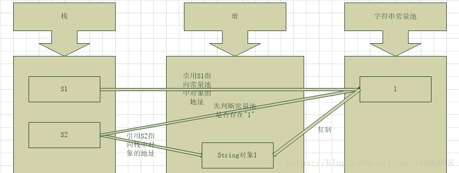
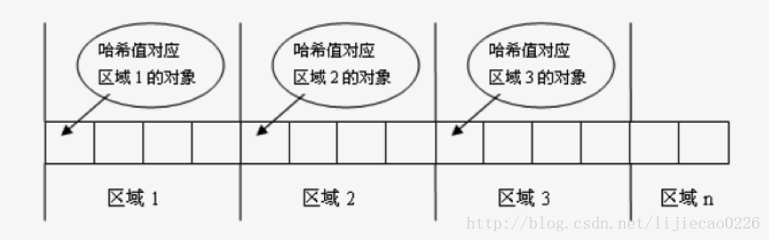
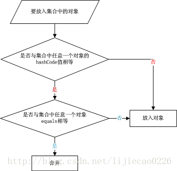

# 1 数据类型

### 1.1 八种基本数据类型

| 类型    | 型别   | 字节      | 取值范围                      |
| ------- | ------ | --------- | ----------------------------- |
| byte    | 整型   | 1byte/8位 | -27 ~ 27-1                    |
| short   | 整型   | 2byte     | -215 ~ 215-1                  |
| int     | 整型   | 4byte     | -231 ~ 231-1                  |
| long    | 整型   | 8byte     | -263 ~ 263-1                  |
| float   | 浮点型 | 4byte     | 3.402823e+38 ~ 1.401298e-45   |
| double  | 浮点型 | 8byte     | 1.797693e+308~ 4.9000000e-324 |
| char    | 文本型 | 2byte     | 0~216-1                       |
| boolean | 布尔型 | 1byte     | true/false                    |

JVM 会在编译时期将 boolean 类型的数据转换为 int，使用 1 来表示 true，0 表示 false。JVM 支持 boolean 数组，但是是通过读写 byte 数组来实现的。


##### 1.1.1 问题

 **short s1 = 1；s1 = s1 + 1；有什么错？那么 short s1 = 1; s1 += 1；呢？有没有错误？** 

对于 short s1 = 1; s1 = s1 + 1; 来说，在 s1 + 1 运算时会自动提升表达式的类型为 int ，那么将 int 型值赋值给 short 型变量，s1 会出现类型转换错误。

对于 short s1 = 1; s1 += 1; 来说，+= 是 Java 语言规定的运算符，Java 编译器会对它进行特殊处理，因此可以正确编译。


### 1.2 Java有 5种引用类型（对象类型）

类 

接口 

数组 

枚举 

标注 


# 2 关于 JVM JDK 和 JRE 最详细通俗的解答

### 4.1 JVM

Java虚拟机（JVM）是运行 Java 字节码的虚拟机。JVM有针对不同系统的特定实现（Windows，Linux，macOS），目的是使用相同的字节码，它们都会给出相同的结果。


**什么是字节码?采用字节码的好处是什么?**

> 在 Java 中，JVM可以理解的代码就叫做`字节码`（即扩展名为 `.class`  的文件），它不面向任何特定的处理器，只面向虚拟机。Java  语言通过字节码的方式，在一定程度上解决了传统解释型语言执行效率低的问题，同时又保留了解释型语言可移植的特点。所以 Java  程序运行时比较高效，而且，由于字节码并不针对一种特定的机器，因此，Java程序无须重新编译便可在多种不同操作系统的计算机上运行。
>
> 

**Java 程序从源代码到运行一般有下面3步：**


我们需要格外注意的是  .class->机器码 这一步。在这一步 JVM  类加载器首先加载字节码文件，然后通过解释器逐行解释执行，这种方式的执行速度会相对比较慢。而且，有些方法和代码块是经常需要被调用的(也就是所谓的热点代码)，所以后面引进了  JIT 编译器，而JIT 属于运行时编译。当 JIT  编译器完成第一次编译后，其会将字节码对应的机器码保存下来，下次可以直接使用。而我们知道，机器码的运行效率肯定是高于 Java  解释器的。这也解释了我们为什么经常会说 Java 是编译与解释共存的语言。


> HotSpot采用了惰性评估(Lazy  Evaluation)的做法，根据二八定律，消耗大部分系统资源的只有那一小部分的代码（热点代码），而这也就是JIT所需要编译的部分。JVM会根据代码每次被执行的情况收集信息并相应地做出一些优化，因此执行的次数越多，它的速度就越快。JDK  9引入了一种新的编译模式AOT(Ahead of Time  Compilation)，它是直接将字节码编译成机器码，这样就避免了JIT预热等各方面的开销。JDK支持分层编译和AOT协作使用。但是 ，AOT 编译器的编译质量是肯定比不上 JIT 编译器的。


**总结：**

Java虚拟机（JVM）是运行 Java  字节码的虚拟机。JVM有针对不同系统的特定实现（Windows，Linux，macOS），目的是使用相同的字节码，它们都会给出相同的结果。字节码和不同系统的  JVM  实现是 Java 语言“一次编译，随处可以运行”的关键所在。 


### 4.2 JDK 和 JRE

JDK是Java Development Kit，它是功能齐全的Java SDK。它拥有JRE所拥有的一切，还有编译器（javac）和工具（如javadoc和jdb）。它能够创建和编译程序。

JRE 是 Java运行时环境。它是运行已编译 Java 程序所需的所有内容的集合，包括 Java虚拟机（JVM），Java类库，java命令和其他的一些基础构件。但是，它不能用于创建新程序。

如果你只是为了运行一下  Java 程序的话，那么你只需要安装 JRE 就可以了。如果你需要进行一些 Java  编程方面的工作，那么你就需要安装JDK了。但是，这不是绝对的。有时，即使您不打算在计算机上进行任何Java开发，仍然需要安装JDK。例如，如果要使用JSP部署Web应用程序，那么从技术上讲，您只是在应用程序服务器中运行Java程序。那你为什么需要JDK呢？因为应用程序服务器会将  JSP 转换为 Java servlet，并且需要使用 JDK 来编译 servlet。


# 3 Java和C++的区别

- 都是面向对象的语言，都支持封装、继承和多态
- Java 不提供指针来直接访问内存，程序内存更加安全
- Java 的类是单继承的，C++ 支持多重继承；虽然 Java 的类不可以多继承，但是接口可以多继承。
- Java 有自动内存管理机制，不需要程序员手动释放无用内存
- **在 C 语言中，字符串或字符数组最后都会有一个额外的字符‘\0’来表示结束。但是，Java 语言中没有结束符这一概念。** 这是一个值得深度思考的问题，具体原因推荐看这篇文章： <https://blog.csdn.net/sszgg2006/article/details/49148189> 。


# 4 字符型常量和字符串常量的区别

1. 形式上: 字符常量是单引号引起的一个字符; 字符串常量是双引号引起的若干个字符

2. 含义上: 字符常量相当于一个整型值( ASCII 值),可以参加表达式运算; 字符串常量代表一个地址值(该字符串在内存中存放位置)

3. 占内存大小 字符常量只占2个字节; 字符串常量占若干个字节 (**注意： char在Java中占两个字节**)

   

> java编程思想第四版：2.2.2节 
>
> 


# 5 重载和重写的区别

### 9.1 重载

发生在同一个类中，方法名必须相同，参数类型不同、个数不同、顺序不同，方法返回值和访问修饰符可以不同。**简单来说，就是签名相同。**

下面是《Java核心技术》对重载这个概念的介绍：

　

### 9.2 重写

 重写是子类对父类的允许访问的方法的实现过程进行重新编写,发生在子类中，方法签名必须相同，返回值范围小于等于父类，抛出的异常范围小于等于父类，访问修饰符范围大于等于父类。另外，如果父类方法访问修饰符为 private 则子类就不能重写该方法。**也就是说方法提供的行为改变，而方法的外貌并没有改变。** 


**问题一：Java 中是否可以重写一个 private 或者 static 方法？** 

Java 中 static 方法不能被覆盖，因为方法覆盖是基于运行时动态绑定的，而 static 方法是编译时静态绑定的。static 方法跟类的任何实例都不相关，所以概念上不适用。 

Java 中也不可以覆盖 private 的方法，因为 private 修饰的变量和方法只能在当前类中使用， 如果是其他的类继承当前类是不能访问到 private 变量或方法的，当然也不能覆盖。

> 静态方法补充：
>
> 静态的方法可以被继承，但是不能重写。如果父类和子类中存在同样名称和参数的静态方法，那么该子类的方法会把原来继承过来的父类的方法隐藏，而不是重写。通俗的讲就是父类的方法和子类的方法是两个没有关系的方法，具体调用哪一个方法是看是哪个对象的引用；这种父子类方法也不在存在多态的性质。 


**问题二：构造器是否可以被重写？**

在讲继承的时候我们就知道父类的私有属性和构造方法并不能被继承，所以 Constructor 也就不能被 Override（重写），但是可以 Overload（重载），所以你可以看到一个类中有多个构造函数的情况。


# 6 Java 面向对象编程三大特性: 封装 继承 多态


### 6.1 封装

通常认为封装是把数据和操作数据的方法封装起来，对数据的访问只能通过已定义的接口。 

eg:

```java
public class Person {
    private String name;
    private int gender;
    private int age;
 
    public String getName() {
        return name;
    }
 
    public String getGender() {
        return gender == 0 ? "man" : "woman";
    }
 
    public void work() {
        if (18 <= age && age <= 50) {
            System.out.println(name + " is working very hard!");
        } else {
            System.out.println(name + " can't work any more!");
        }
    }
}
```


优点：

- 减少耦合：可以独立地开发、测试、优化、使用、理解和修改
- 减轻维护的负担：可以更容易被程序员理解，并且在调试的时候可以不影响其他模块
- 有效地调节性能：可以通过剖析确定哪些模块影响了系统的性能
- 提高软件的可重用性
- 降低了构建大型系统的风险：即使整个系统不可用，但是这些独立的模块却有可能是可用的


### 6.2 继承

通过使用继承我们能够非常方便地复用以前的代码。

**关于继承如下 3 点请记住：**

1. 子类拥有父类对象所有的属性和方法（包括私有属性和私有方法），但是父类中的私有属性和方法子类是无法访问，**只是拥有**。
2. 子类可以拥有自己属性和方法，即子类可以对父类进行扩展。
3. 子类可以用自己的方式实现父类的方法。（重写） 


### 6.3 多态

多态：分为**编译时多态（方法重载）**和**运行时多态（方法重写）。**

要实现多态需要做两件事：

- 子类继承父类并重写父类中的方法（重写）
- 用父类型引用子类型对象(重载)

这样同样的引用调用同样的方法就会根据子类对象的不同而表现出不同的行为。 


# 7 String

### 7.1 不可变的String

String 被声明为 final，因此它不可被继承。(Integer 等包装类也不能被继承）

在 Java 8 中，String 内部使用 char 数组存储数据。

```java
public final class String
    implements java.io.Serializable, Comparable<String>, CharSequence {
    /** The value is used for character storage. */
    private final char value[];
}
```

在 Java 9 之后，String 类的实现改用 byte 数组存储字符串，同时使用 `coder` 来标识使用了哪种编码。

```java
public final class String
    implements java.io.Serializable, Comparable<String>, CharSequence {
    /** The value is used for character storage. */
    private final byte[] value;

    /** The identifier of the encoding used to encode the bytes in {@code value}. */
    private final byte coder;
}
```

value 数组被声明为 final，这意味着 value 数组初始化之后就不能再引用其它数组。并且 String 内部没有改变 value 数组的方法，因此可以保证 String 不可变。


**String 字符串修改实现的原理？**

当用 String 类型来对字符串进行修改时，其实现方法是首先创建一个 StringBuffer，其次调用 StringBuffer 的 append() 方法，最后调用 StringBuffer 的 toString() 方法把结果返回。


### 7.2 不可变的好处

**1. 可以缓存 hash 值**  

因为 String 的 hash 值经常被使用，例如 String 用做 HashMap 的 key。不可变的特性可以使得 hash 值也不可变，因此只需要进行一次计算。

**2. String Pool 的需要**  

如果一个 String 对象已经被创建过了，那么就会从 String Pool 中取得引用。只有 String 是不可变的，才可能使用 String Pool。

 


**3. 安全性**  

String 经常作为参数，如网络连接地址 URL、文件路径 path、还有反射机制所需要的 String 参数等 ，String 不可变性可以保证参数不可变。

例如在作为网络连接参数的情况下如果 String 是可变的，那么在网络连接过程中，String 被改变，改变 String 的那一方以为现在连接的是其它主机，而实际情况却不一定是。


**4. 线程安全**  

String 不可变性天生具备线程安全，可以在多个线程中安全地使用。


###  7.3 String & StringBuffer & StringBuilder 

String 类中使用 final 关键字修饰字符数组来保存字符串，`private　final　char　value[]`，所以 String 对象是不可变的。而StringBuilder 与 StringBuffer 都继承自 AbstractStringBuilder 类，在 AbstractStringBuilder 中也是使用字符数组保存字符串`char[]value` 但是没有用 final 关键字修饰，所以这两种对象都是可变的。

StringBuilder 与 StringBuffer 的构造方法都是调用父类构造方法也就是 AbstractStringBuilder 实现的，大家可以自行查阅源码。

AbstractStringBuilder.java

```java
abstract class AbstractStringBuilder implements Appendable, CharSequence {
    char[] value;
    int count;
    AbstractStringBuilder() {
    }
    AbstractStringBuilder(int capacity) {
        value = new char[capacity];
    }
```

**线程安全性**

String  中的对象是不可变的，也就可以理解为常量，线程安全。AbstractStringBuilder 是 StringBuilder 与  StringBuffer 的公共父类，定义了一些字符串的基本操作，如 expandCapacity、append、insert、indexOf  等公共方法。StringBuffer 对方法加了同步锁或者对调用的方法加了同步锁，所以是线程安全的。StringBuilder  并没有对方法进行加同步锁，所以是非线程安全的。　

**性能**

每次对 String  类型进行改变的时候，都会生成一个新的 String 对象，然后将指针指向新的 String 对象。StringBuffer 每次都会对  StringBuffer 对象本身进行操作，而不是生成新的对象并改变对象引用。相同情况下使用 StringBuilder 相比使用  StringBuffer 仅能获得 10%~15% 左右的性能提升，但却要冒多线程不安全的风险。

**对于三者使用的总结：** 

1. 操作少量的数据: 适用String
2. 单线程操作字符串缓冲区下操作大量数据: 适用StringBuilder
3. 多线程操作字符串缓冲区下操作大量数据: 适用StringBuffer


### 7.4 String Pool

##### 7.4.1 内存图

String s=”1”：创建字符串常量时，JVM会首先检查字符串常量池，如果该字符串已经存在常量池中，那么就将此字符串对象的地址赋值给引用s（引用s在Java栈中）。如果字符串不存在常量池中，就会实例化该字符串并且将其放到常量池中，并将此字符串对象的地址赋值给引用s（引用s在Java栈中）。

 String s=new String(”1”)：创建字符串常量时，JVM会首先检查字符串常量池，如果该字符串已经存在常量池中，那么不再在字符串常量池创建该字符串对象，而直接堆中复制该对象的副本，然后将堆中对象的地址赋值给引用s，如果字符串不存在常量池中，就会实例化该字符串并且将其放到常量池中，然后在堆中复制该对象的副本，然后将堆中对象的地址赋值给引用s。




**final 修饰 StringBuffer 后还可以 append 吗？**

可以。final 修饰的是一个引用变量，那么这个引用始终只能指向这个对象，但是这个对象内部的属性是可以变化的。


##### 7.4.2 intern() 

字符串常量池（String Pool）保存着所有字符串字面量（literal strings），这些字面量在编译时期就确定。不仅如此，还可以使用 String 的 intern() 方法在运行过程将字符串添加到 String Pool 中。

当一个字符串调用 intern() 方法时，如果 String Pool 中已经存在一个字符串和该字符串值相等（使用 equals() 方法进行确定），那么就会返回 String Pool 中字符串的引用；否则，就会在 String Pool 中添加一个新的字符串，并返回这个新字符串的引用。

```java
String s1 = new String("aaa");
String s2 = new String("aaa");
System.out.println(s1 == s2);           // false
String s3 = s1.intern();
String s4 = s1.intern();
System.out.println(s3 == s4);           // true
```

如果是采用 "bbb" 这种字面量的形式创建字符串，会自动地将字符串放入 String Pool 中。

```java
String s5 = "bbb";
String s6 = "bbb";
System.out.println(s5 == s6);  // true
```

在 Java 7 之前，String Pool 被放在运行时常量池中，它属于永久代。而在 Java 7，String Pool 被移到堆中。这是因为永久代的空间有限，在大量使用字符串的场景下会导致 OutOfMemoryError 错误。


### 7.5  创建字符串

##### 7.5.1 String s1=”1”+”2”+”3”

直接入字符串常量池（当然同样需要判断是否已经存在该字符串）。  因为会直接优化为123


##### 7.5.2 String s2=”1”+”3”+new String(“1”)+”4”; 

 实际上的实现过程为：

```java
String s2=new StringBuilder(“13”)

		.append(new String(“1”))

		.append(“4”)

		.toString(); 

```


##### 7.5.3 String s3=new String(“1”)+new String(“1”); 

同7.5.2


# 8 成员变量&局部变量&静态变量

|          | **成员变量**   | **局部变量**              | **静态变量**       |
| -------- | -------------- | ------------------------- | ------------------ |
| 定义位置 | 在类中,方法外  | 方法中,或者方法的形式参数 | 在类中,方法外      |
| 初始化值 | 有默认初始化值 | 无,先定义,赋值后才能使用  | 有默认初始化值     |
| 调用方式 | 对象调用       | ---                       | 对象调用，类名调用 |
| 存储位置 | 堆中           | 栈中                      | 方法区             |
| 生命周期 | 与对象共存     | 与方法共存亡              | 与类共存亡         |
| 别名     | 实例变量       | ---                       | 类变量             |


# 9 == & equals & hashcode

### 9.1 == & equals 

**==** : 它的作用是判断两个对象的地址是不是相等。即，判断两个对象是不是同一个对象(基本数据类型==比较的是值，引用数据类型==比较的是内存地址)。

**equals()** : 它的作用也是判断两个对象是否相等。但它一般有两种使用情况：

- 情况1：类没有覆盖 equals() 方法。则通过 equals() 比较该类的两个对象时，等价于通过“==”比较这两个对象。

- 情况2：类覆盖了 equals() 方法。一般，我们都覆盖 equals() 方法来比较两个对象的内容是否相等；若它们的内容相等，则返回 true (即，认为这两个对象相等)。

  很多类重写了 equals 方法，比如 String、Integer  等把它变成了值比较。

注意：equals 方法不能用于比较基本数据类型的变量。 

**举个例子：**

```java
public class test1 {
    public static void main(String[] args) {
        String a = new String("ab"); // a 为一个引用
        String b = new String("ab"); // b为另一个引用,对象的内容一样
        String aa = "ab"; // 放在常量池中
        String bb = "ab"; // 从常量池中查找
        if (aa == bb) // true
            System.out.println("aa==bb");
        if (a == b) // false，非同一对象
            System.out.println("a==b");
        if (a.equals(b)) // true
            System.out.println("aEQb");
        if (42 == 42.0) { // true
            System.out.println("true");
        }
    }
}
```

**说明：**

- **String 中的 equals 方法是被重写过的**，因为 object 的 equals 方法是比较的对象的内存地址，而 String 的 equals 方法比较的是对象的值。
- 当创建 String 类型的对象时，虚拟机会在常量池中查找有没有已经存在的值和要创建的值相同的对象，如果有就把它赋给当前引用。如果没有就在常量池中重新创建一个 String 对象。


### 9.2 equals & hashcode

[博客推荐][https://blog.csdn.net/lijiecao0226/article/details/24609559]

面试官可能会问你：“你重写过 hashcode 和 equals 么，为什么重写equals时必须重写hashCode方法？” 

##### 9.2.1 为什么要有 hashCode

 个问题应该是有个前提，就是你需要用到  HashMap、HashSet 等 Java 集合，用不到哈希表的话，其实仅仅重写 equals() 方法也可以。而工作中的场景是常常用到  Java 集合，所以 Java 官方建议重写 equals() 就一定要重写 hashCode() 方法。 

对于对象集合的判重，如果一个集合含有  10000 个对象实例，仅仅使用 equals() 方法的话，那么对于一个对象判重就需要比较 10000  次，随着集合规模的增大，时间开销是很大的。但是同时使用哈希表的话，就能快速定位到对象的大概存储位置，并且在定位到大概存储位置后，后续比较过程中，如果两个对象的  hashCode 不相同，也不再需要调用 equals() 方法，从而大大减少了 equals() 比较次数。 

所以从程序实现原理上来讲的话，既需要 equals() 方法，也需要 hashCode() 方法。那么既然重写了 equals()，那么也要重写 hashCode() 方法，以保证两者之间的配合关系。 


实际的使用中，一个对象一般有key和value，可以根据key来计算它的hashCode。假设现在全部的对象都已经根据自己的hashCode值存储在不同的存储区域中了，那么现在查找某个对象（根据对象的key来查找），不需要遍历整个集合了，现在只需要计算要查找对象的key的hashCode，然后找到该hashCode对应的存储区域，在该存储区域中来查找就可以了


##### 9.2.3 hashCode（）与equals（）

介绍：

在Java中任何一个对象都具备equals(Object obj)和hashCode()这两个方法，因为他们是在Object类中定义的。 equals(Object obj)方法用来判断两个对象是否“相同”，如果“相同”则返回true，否则返回false。 hashCode()方法返回一个int数，在Object类中的默认实现是“将该对象的内部地址转换成一个整数返回”。 


何时需要重写equals和hashCode：一般来说涉及到对象之间的比较大小就需要重写equals方法 


为什么重写hashCode一定要重写equals：先看集合add一个对象的过程



从上面的图中可以清晰地看到在存储一个对象时，先进行hashCode值的比较，然后进行equals的比较。


总结：
   1.hashCode是为了提高在散列结构存储中查找的效率，在线性表中没有作用。
   2.equals和hashCode需要同时覆盖。
   3.若两个对象equals返回true，则hashCode有必要也返回相同的int数。

4. 若两个对象equals返回false，则hashCode不一定返回不同的int数,但为不相等的对象生成不同hashCode值可以提高 哈希表的性能。
5. 若两个对象hashCode返回相同int数，则equals不一定返回true。
6. 若两个对象hashCode返回不同int数，则equals一定返回false。

   7.同一对象在执行期间若已经存储在集合中，则不能修改影响hashCode值的相关信息，否则会导致内存泄露问题。


# 10 程序&进程&线程

程序：

是含有指令和数据的文件，被存储在磁盘或其他的数据存储设备中，也就是说程序是静态的代码。

进程&线程：

1.进程是程序的一次执行过程，是系统运行程序的基本单位，因此进程是动态的。

2.进程是资源的分配和调度的一个独立单元，而线程是CPU调度的基本单元
3.同一个进程中可以包括多个线程，并且线程共享整个进程的资源（寄存器、堆栈、上下文），一个进行至少包括一个线程。
4.进程的创建调用fork或者vfork，而线程的创建调用pthread_create，进程结束后它拥有的所有线程都将销毁，而线程的结束不会影响同个进程中的其他线程的结束
5.线程是轻量级的进程，它的创建和销毁所需要的时间比进程小很多，所有操作系统中的执行功能都是创建线程去完成的
6.线程中执行时一般都要进行同步和互斥，因为他们共享同一进程的所有资源
7.线程有自己的私有属性TCB，线程id，寄存器、硬件上下文，而进程也有自己的私有属性进程控制块PCB，这些私有属性是不被共享的，用来标示一个进程或一个线程的标志。


# 11 关键字

### 11.1 final

final关键字主要用在三个地方：变量、方法、类。

1. 对于一个final变量，如果是基本数据类型的变量，则其数值一旦在初始化之后便不能更改；如果是引用类型的变量，则在对其初始化之后便不能再让其指向另一个对象。
2. 当用final修饰一个类时，表明这个类不能被继承。final类中的所有成员方法都会被隐式地指定为final方法。
3. 使用final方法的原因有两个。第一个原因是把方法锁定，以防任何继承类修改它的含义；第二个原因是效率。在早期的Java实现版本中，会将final方法转为内嵌调用。但是如果方法过于庞大，可能看不到内嵌调用带来的任何性能提升（现在的Java版本已经不需要使用final方法进行这些优化了）。类中所有的private方法都隐式地指定为final。


### 11.2 static

**1. 静态变量**  

- 静态变量：是被 static 修饰的变量，也称为类变量，它属于类，因此不管创建多少个对象，静态变量在内存中有且仅有一个拷贝；静态变量可以实现让多个对象共享内存。 
- 实例变量：每创建一个实例就会产生一个实例变量，需要先创建对象，然后通过对象才能访问到它，它与该实例同生共死。

```java
public class A {

    private int x;         // 实例变量
    private static int y;  // 静态变量

    public static void main(String[] args) {
        // int x = A.x;  // Non-static field 'x' cannot be referenced from a static context
        A a = new A();
        int x = a.x;
        int y = A.y;
    }
}
```

**2. 静态方法**  

静态方法在类加载的时候就存在了，它不依赖于任何实例。所以静态方法必须有实现，也就是说它不能是抽象方法。

```java
public abstract class A {
    public static void func1(){
    }
    // public abstract static void func2();  // Illegal combination of modifiers: 'abstract' and 'static'
}
```

只能访问所属类的静态字段和静态方法，方法中不能有 this 和 super 关键字，因此这两个关键字与具体对象关联。

```java
public class A {

    private static int x;
    private int y;

    public static void func1(){
        int a = x;
        // int b = y;  // Non-static field 'y' cannot be referenced from a static context
        // int b = this.y;     // 'A.this' cannot be referenced from a static context
    }
}
```

**问题一：在一个静态方法内调用一个非静态成员为什么是非法的?**

由于静态方法可以不通过对象进行调用，因此在静态方法里，不能调用其他非静态变量，也不可以访问非静态变量成员。


**问题二：静态方法和实例方法有何不同？**

1. 在外部调用静态方法时，可以使用"类名.方法名"的方式，也可以使用"对象名.方法名"的方式。而实例方法只有后面这种方式。也就是说，调用静态方法可以无需创建对象。 
2. 静态方法在访问本类的成员时，只允许访问静态成员（即静态成员变量和静态方法），而不允许访问实例成员变量和实例方法；实例方法则无此限制。


**3. 静态语句块**  

静态语句块在类初始化时运行一次。

```java
public class A {
    static {
        System.out.println("123");
    }

    public static void main(String[] args) {
        A a1 = new A();
        A a2 = new A();
    }
}
```

```html
123
```

**4. 静态内部类**  

非静态内部类依赖于外部类的实例，也就是说需要先创建外部类实例，才能用这个实例去创建非静态内部类。而静态内部类不需要。

```java
public class OuterClass {

    class InnerClass {
    }

    static class StaticInnerClass {
    }

    public static void main(String[] args) {
        // InnerClass innerClass = new InnerClass(); // 'OuterClass.this' cannot be referenced from a static context
        OuterClass outerClass = new OuterClass();
        InnerClass innerClass = outerClass.new InnerClass();
        StaticInnerClass staticInnerClass = new StaticInnerClass();
    }
}
```

静态内部类不能访问外部类的非静态的变量和方法。

**5. 静态导包**  

在使用静态变量和方法时不用再指明 ClassName，从而简化代码，但可读性大大降低。

```java
import static com.xxx.ClassName.*
```

**6. 初始化顺序**  

静态变量和静态语句块优先于实例变量和普通语句块，静态变量和静态语句块的初始化顺序取决于它们在代码中的顺序。

```java
public static String staticField = "静态变量";
```

```java
static {
    System.out.println("静态语句块");
}
```

```java
public String field = "实例变量";
```

```java
{
    System.out.println("普通语句块");
}
```

最后才是构造函数的初始化。

```java
public InitialOrderTest() {
    System.out.println("构造函数");
}
```

存在继承的情况下，初始化顺序为：

- 父类（静态变量、静态语句块）
- 子类（静态变量、静态语句块）
- 父类（实例变量、普通语句块）
- 父类（构造函数）
- 子类（实例变量、普通语句块）
- 子类（构造函数）


**补充：**

**Java 中是否可以重写一个 private 或者 static 方法？** 

Java 中 static 方法不能被覆盖，因为方法覆盖是基于运行时动态绑定的，而 static 方法是编译时静态绑定的。static 方法跟类的任何实例都不相关，所以概念上不适用。 

Java 中也不可以覆盖 private 的方法，因为 private 修饰的变量和方法只能在当前类中使用， 如果是其他的类继承当前类是不能访问到 private 变量或方法的，当然也不能覆盖。

> 静态方法补充：
>
> 静态的方法可以被继承，但是不能重写。如果父类和子类中存在同样名称和参数的静态方法，那么该子类的方法会把原来继承过来的父类的方法隐藏，而不是重写。通俗的讲就是父类的方法和子类的方法是两个没有关系的方法，具体调用哪一个方法是看是哪个对象的引用；这种父子类方法也不在存在多态的性质。 


### 11.3 this 

this关键字用于引用类的当前实例。 例如：

```
class Manager {
    Employees[] employees;
     
    void manageEmployees() {
        int totalEmp = this.employees.length;
        System.out.println("Total employees: " + totalEmp);
        this.report();
    }
     
    void report() { }
}
```

在上面的示例中，this关键字用于两个地方：

- this.employees.length：访问类Manager的当前实例的变量。
- this.report（）：调用类Manager的当前实例的方法。

此关键字是可选的，这意味着如果上面的示例在不使用此关键字的情况下表现相同。 但是，使用此关键字可能会使代码更易读或易懂。


### 11.4 super

（1）访问父类的构造函数：可以使用 super() 函数访问父类的构造函数，从而委托父类完成一些初始化的工作。

（2）访问父类的成员：如果子类重写了父类的某个方法，可以通过使用 super 关键字来引用父类的方法实现。

（3）this 和 super 不能同时出现在一个构造函数里面，因为 this 必然会调用其它的构造函数，其它的构造函数必然也会有 super 语句的存在，所以在同一个构造函数里面有相同的语句，就失去了语句的意义，编译器也不会通过。


```java
public class Super {
    protected int number;
     
    protected showNumber() {
        System.out.println("number = " + number);
    }
}
 
public class Sub extends Super {
    void bar() {
        super.number = 10;
        super.showNumber();
    }
}
```

在上面的例子中，Sub 类访问父类成员变量 number 并调用其父类 Super 的 `showNumber（）` 方法。

**使用 this 和 super 要注意的问题：**

- 在构造器中使用 `super（）` 调用父类中的其他构造方法时，该语句必须处于构造器的首行，否则编译器会报错。另外，this 调用本类中的其他构造方法时，也要放在首行。
- this、super不能用在static方法中。

**简单解释一下：**

被 static 修饰的成员属于类，不属于单个这个类的某个对象，被类中所有对象共享。而 this 代表对本类对象的引用，指向本类对象；而 super 代表对父类对象的引用，指向父类对象；所以， **this和super是属于对象范畴的东西，而静态方法是属于类范畴的东西**。


# 12 抽象类与接口

### 12.1  抽象类 

抽象类和抽象方法都使用 abstract 关键字进行声明。如果一个类中包含抽象方法，那么这个类必须声明为抽象类。

抽象类和普通类最大的区别是，抽象类不能被实例化，只能被继承。

```java
public abstract class AbstractClassExample {

    protected int x;
    private int y;

    public abstract void func1();

    public void func2() {
        System.out.println("func2");
    }
}
```

```java
public class AbstractExtendClassExample extends AbstractClassExample {
    @Override
    public void func1() {
        System.out.println("func1");
    }
}
```

```java
// AbstractClassExample ac1 = new AbstractClassExample(); // 'AbstractClassExample' is abstract; cannot be instantiated
AbstractClassExample ac2 = new AbstractExtendClassExample();
ac2.func1();
```


### 12.2 接口  

接口是抽象类的延伸，在 Java 8 之前，它可以看成是一个完全抽象的类，也就是说它不能有任何的方法实现。

从 Java 8 开始，接口也可以拥有默认的方法实现，这是因为不支持默认方法的接口的维护成本太高了。在 Java 8 之前，如果一个接口想要添加新的方法，那么要修改所有实现了该接口的类，让它们都实现新增的方法。

接口的成员（字段 + 方法）默认都是 public 的，并且不允许定义为 private 或者 protected。

接口的字段默认都是 static 和 final 的。

```java
public interface InterfaceExample {

    void func1();

    default void func2(){
        System.out.println("func2");
    }

    int x = 123;
    // int y;               // Variable 'y' might not have been initialized
    public int z = 0;       // Modifier 'public' is redundant for interface fields
    // private int k = 0;   // Modifier 'private' not allowed here
    // protected int l = 0; // Modifier 'protected' not allowed here
    // private void fun3(); // Modifier 'private' not allowed here
}
```

```java
public class InterfaceImplementExample implements InterfaceExample {
    @Override
    public void func1() {
        System.out.println("func1");
    }
}
```

```java
// InterfaceExample ie1 = new InterfaceExample(); // 'InterfaceExample' is abstract; cannot be instantiated
InterfaceExample ie2 = new InterfaceImplementExample();
ie2.func1();
System.out.println(InterfaceExample.x);
```


### 12.3 比较  

- 抽象类中可以定义构造函数，接口不能定义构造函数； 
- 抽象类中可以有抽象方法和具体方法，而接口中只能有抽象方法（public abstract）； 
- 抽象类里的抽象方法必须全部被子类所实现，如果子类不能全部实现父类抽象方法，即如果一个类里有抽象方法，那么该子类只能是抽象类。同样，一个实现接口的时候，如不能全部实现接口方法，那么该类也只能为抽象类。 
- 从使用上来看，一个类可以实现多个接口，但是不能继承多个抽象类。
- 抽象类中的成员权限可以是 public、默认、protected（抽象类中抽象方法就是为了重写，所以不能被 private  修饰），而接口中的成员只可以是 public（方法默认：public abstrat、成员变量默认：public static final）；
-  抽象类中可以包含静态方法，而接口中不可以包含静态方法； 

**JDK8中的改变：**

1. 在 JDK1.8中，允许在接口中包含带有具体实现的方法，使用 default 修饰，这类方法就是默认方法。

2. 在 JDK1.8 之前接口中不能包含静态方法，JDK1.8 以后可以包含。

   之前不能包含是因为，接口不可以实现方法，只可以定义方法，所以不能使用静态方法（因为静态方法必须实现）。现在可以包含了，只能直接用接口调用静态方法。JDK1.8 仍然不可以包含静态代码块。


### 12.4 使用选择  

使用接口：

- 需要让不相关的类都实现一个方法，例如不相关的类都可以实现 Compareable 接口中的 compareTo() 方法；
- 需要使用多重继承。

使用抽象类：

- 需要在几个相关的类中共享代码。
- 需要能控制继承来的成员的访问权限，而不是都为 public。
- 需要继承非静态和非常量字段。

在很多情况下，接口优先于抽象类。因为接口没有抽象类严格的类层次结构要求，可以灵活地为一个类添加行为。并且从 Java 8 开始，接口也可以有默认的方法实现，使得修改接口的成本也变的很低。


# 13 构造器

**构造器是否可以被重写？**

在讲继承的时候我们就知道父类的私有属性和构造方法并不能被继承，所以 Constructor 也就不能被 Override（重写），但是可以 Overload（重载），所以你可以看到一个类中有多个构造函数的情况。


 **构造方法有哪些特性**

（1）名字与类名相同；

（2）没有返回值，但不能用 void 声明构造函数；

（3）成类的对象时自动执行，无需调用。


 **定义一个没有参数的构造方法的作用**

Java 程序在执行子类的构造方法之前，如果没有用 super() 来调用父类特定的构造方法，则会调用父类中“没有参数的构造方法”。因此，如果父类中只定义了有参数的构造方法，而在子类的构造方法中又没有用  super() 来调用父类中特定的构造方法，则编译时将发生错误，因为 Java  程序在父类中找不到没有参数的构造方法可供执行。解决办法是：在父类里加上一个不做事且没有参数的构造方法。　


**一个类的构造方法的作用是什么? 若一个类没有声明构造方法，该程序能正确执行吗? **

主要作用是完成对类对象的初始化工作。可以执行。因为一个类即使没有声明构造方法也会有默认的不带参数的构造方法。


# 14 面向对象和面向过程的区别

面向对象是向现实世界模型的自然延伸，这是一种“万物皆对象”的编程思想。由执行者变为指挥者，在现实生活中的任何物体都可以归为一类事物，而每一个个体都是一类事物的实例。面向对象的编程是以对象为中心，以消息为驱动。

**区别:** 

（1）编程思路不同：面向过程以实现功能的函数开发为主，而面向对象要首先抽象出类、属性及其方法，然后通过实例化类、执行方法来完成功能。 

（2）封装性：都具有封装性，但是面向过程是封装的是功能，而面向对象封装的是数据和功能。 

（3）面向对象具有继承性和多态性，而面向过程没有继承性和多态性，所以面向对象优势很明显。


# 15 可变&不可变对象

**什么是不可变对象?好处是什么?**

不可变对象指对象一旦被创建,状态就不能再改变,任何修改都会创建一个新的对象,如 String、Integer及其它包装类.不可变对象最大的好处是线程安全.


**能否创建一个包含可变对象的不可变对象?**

当然可以,比如final Person[] persons = new Persion[]{}.persons是不可变对象的引用,但其数组中的Person实例却是可变的.这种情况下需要特别谨慎,不要共享可变对象的引用.这种情况下,如果数据需要变化时,就返回原对象的一个拷贝.


# 16 包装类

### 16.1 Integer 和 int 的区别

（1）int 是 Java 的八种基本数据类型之一，而 Integer 是 Java 为 int 类型提供的封装类；

（2）int 型变量的默认值是 0，Integer 变量的默认值是 null，这一点说明 Integer 可以区分出未赋值和值为 0 的区分；

（3）Integer 变量必须实例化后才可以使用，而 int 不需要。


```java
Integer i = new Integer(100);
Integer j = new Integer(100);
System.out.print(i == j); //false
 
System.out.println(i.equals(j)); //true
System.out.println(i.intValue()==j.intValue()); //true
//上面的两个代码是一样的比较过程，详细可以看下面equals的源码


//包装类Integer和基本数据类型int比较时，java会自动拆包装为int
Integer i = new Integer(100);
int j = 100；
System.out.print(i == j); //true

//非new生成的Integer变量指向的是java常量池中的对象，而new Integer()生成的变量指向堆中新建的对象，两者在内存中的地址不同
Integer i = new Integer(100);
Integer j = 100;
System.out.print(i == j); //false


//对于两个非new生成的Integer对象，进行比较时，如果两个变量的值在区间-128到127之间，则比较结果为true
Integer i = 100;
Integer j = 100;
System.out.print(i == j); //true

    Integer i = 128;
    Integer j = 128;
    System.out.print(i == j); //false


```


源码：

```java
private final int value;
 
public Integer(int value) {
    this.value = value;
}
 
public int intValue() {
    return value;
}
 
public boolean equals(Object obj) {
    if (obj instanceof Integer) {
        return value == ((Integer)obj).intValue();
    }
    return false;
}

public static Integer valueOf(int i){
    assert IntegerCache.high >= 127;
    if (i >= IntegerCache.low && i <= IntegerCache.high){
        return IntegerCache.cache[i + (-IntegerCache.low)];
    }
    return new Integer(i);
}
```


### 16.2 **包装类的缓存**

Boolean：全部缓存

Byte：全部缓存

Character：<= 127 缓存

Short：-128 — 127 缓存

Long：-128 — 127 缓存

Integer：-128 — 127 缓存

Float：没有缓存

Double：没有缓存


### 16.3 **装箱和拆箱** 

自动装箱是 Java 编译器在基本数据类型和对应得包装类之间做的一个转化。比如：把 int 转化成 Integer，double 转化成 Double 等等。反之就是自动拆箱。

原始类型：boolean、char、byte、short、int、long、float、double

封装类型：Boolean、Character、Byte、Short、Integer、Long、Float、Double


# 17 switch

**switch 语句能否作用在 byte 上，能否作用在 long 上，能否作用在 String 上？**

在  switch(expr 1) 中，expr1 只能是一个**整数表达式或者枚举常量**。而整数表达式可以是 **int 基本数据类型或者 Integer  包装类型**。由于，**byte、short、char** 都可以隐式转换为 int，所以，这些类型以及这些类型的包装类型也都是可以的。而 long 和  String 类型都不符合 switch 的语法规定，并且不能被隐式的转换为 int 类型，所以，它们不能作用于 switch 语句中。

不过，需要注意的是在 JDK1.7 版本之后 switch 就可以作用在 String 上了。


**原理：**

```java
public class SwitchString {
    public static void main(String[] args) {
        switch (args[0]) {
	    case "A" : break;
            case "B" : break;
            default :
	}//switch
    }
}
```


```java
//
// Source code recreated from a .class file by IntelliJ IDEA
// (powered by Fernflower decompiler)
//
 
public class SwitchString {
    public SwitchString() {
    }
 
    public static void main(String[] var0) {
        String var1 = var0[0];
        byte var2 = -1;
        switch(var1.hashCode()) {
        case 65:
            if (var1.equals("A")) {
                var2 = 0;
            }
            break;
        case 66:
            if (var1.equals("B")) {
                var2 = 1;
            }
        }
 
        switch(var2) {
        case 0:
        case 1:
        default:
        }
    }
}
```

jvm是先调用String的hashCode方法得到hash值，然后将case中的常量换掉，再用euqals再次确认。

但是有个很奇怪的地方，为什么在case中，还要再使用String的equals方法呢？这就和String的hashCode计算hash值有关了

```java
    public int hashCode() {
        int h = hash;
        if (h == 0 && value.length > 0) {
            char val[] = value;
 
            for (int i = 0; i < value.length; i++) {
                h = 31 * h + val[i];
            }
            hash = h;
        }
        return h;
    }
```

 String的Hash可能会冲突，即两个不同的String可能计算出相同的hash值。

因此JVM才会又用String的equals方法再次比较


# 18 Object类

**Object 的常用方法** 

clone 方法：用于创建并返回当前对象的一份拷贝；

getClass 方法：用于返回当前运行时对象的 Class；

toString 方法：返回对象的字符串表示形式；

finalize 方法：实例被垃圾回收器回收时触发的方法；

equals 方法：用于比较两个对象的内存地址是否相等，一般需要重写；

hashCode 方法：用于返回对象的哈希值；

notify 方法：唤醒一个在此对象监视器上等待的线程。如果有多个线程在等待只会唤醒一个。

notifyAll 方法：作用跟 notify() 一样，只不过会唤醒在此对象监视器上等待的所有线程，而不是一个线程。

wait 方法：让当前对象等待；


**为什么 wait/notify 方法放在 Object 类中而不是 Thread 类** 

一个很明显的原因是 Java 提供的锁是对象级的而不是线程级的，每个对象都有锁，通过线程获得。如果 wait() 方法定义在 Thread 类中，线程正在等待的是哪个锁就不明显了。


# 19 位运算

### 19.1 & 和 && 的区别

Java 中 && 和 & 都是表示与的逻辑运算符，都表示逻辑运输符 and，当两边的表达式都为 true 的时候，整个运算结果才为 true，否则为 false。

&&：有短路功能，当第一个表达式的值为 false 的时候，则不再计算第二个表达式；

&：不管第一个表达式结果是否为 true，第二个都会执行。除此之外，& 还可以用作位运算符：当 & 两边的表达式不是 Boolean 类型的时候，& 表示按位操作。


### 19.2 运算

|是按位或     

^是按位异或(值不一样就是1)     ->  a^b = |a-b| 

&是按位与

eg：

```java
int x = 5;

int y = 11;

System.out.println(x|y);//15

System.out.println(x&y);//1

System.out.println(x^y);//14
```


# 20 Java 中的参数传递时传还是传引用？

Java 的参数是以值传递的形式传入方法中，而不是引用传递。

当传递方法参数类型为基本数据类型（数字以及布尔值）时，一个方法是不可能修改一个基本数据类型的参数。

当传递方法参数类型为引用数据类型时，一个方法将修改一个引用数据类型的参数所指向对象的值。即使 Java 函数在传递引用数据类型时，也只是拷贝了引用的值罢了，之所以能修改引用数据是因为它们同时指向了一个对象，但这仍然是按值调用而不是引用调用。


# 21 Math.round(-1.5)等于多少

等于 -1，因为在数轴上取值时，中间值（0.5）向右取整，所以正 0.5 是往上取整，负 0.5 是直接舍弃。


[知识点在这里](https://snailclimb.gitee.io/javaguide/#/docs/java/Java%E5%9F%BA%E7%A1%80%E7%9F%A5%E8%AF%86)