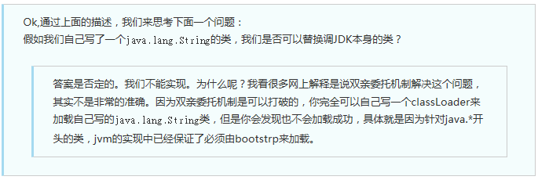

# 1 java异常分类及处理

### 1.1 异常分类 

 

 

Throwable 是 Java 语言中所有错误或异常的超类。Throwable分成了两个不同的分支，一个分支是Error，它表示不希望被程序捕获或者是程序无法处理的错误。另一个分支是Exception，它表示用户程序可能捕捉的异常情况或者说是程序可以处理的异常。其中异常类Exception又分为运行时异常(RuntimeException)和非运行时异常。Java异常又可以分为不受检查异常（Unchecked Exception）和检查异常（Checked Exception）。 

**注意：Error和Exception的区别**：Error通常是灾难性的致命的错误，是程序无法控制和处理的，当出现这些异常时，Java虚拟机（JVM）一般会选择终止线程；Exception通常情况下是可以被程序处理的，并且在程序中应该尽可能的去处理这些异常。 


##### 1.1.1 Error

Error类对象由 Java 虚拟机生成并抛出，大多数错误与代码编写者所执行的操作无关。例如，Java虚拟机运行错误（Virtual MachineError），当JVM不再有继续执行操作所需的内存资源时，将出现 OutOfMemoryError。这些异常发生时，Java虚拟机（JVM）一般会选择线程终止；还有发生在虚拟机试图执行应用时，如类定义错误（NoClassDefFoundError）、链接错误（LinkageError）。这些错误是不可查的 。


##### 1.1.2 Exception

 **运行时异常（RuntimeException）：**在Exception分支中有一个重要的子类RuntimeException（运行时异常），该类型的异常自动为你所编写的程序定义ArrayIndexOutOfBoundsException（数组下标越界）、NullPointerExce~ption（空指针异常）、ArithmeticException（算术异常）、MissingResourceException（丢失资源）、ClassNotFoundException（找不到类）等异常，这些异常是不检查异常，程序中可以选择捕获处理，也可以不处理。这些异常一般是由程序逻辑错误引起的，程序应该从逻辑角度尽可能避免这类异常的发生；

**非运行时异常：**RuntimeException之外的异常我们统称为非运行时异常，类型上属于Exception类及其子类，从程序语法角度讲是必须进行处理的异常，如果不处理，程序就不能编译通过。如IOException、SQLException等以及用户自定义的Exception异常。


##### 1.1.3 检查异常&不受检查异常

**检查异常：**除了RuntimeException及其子类以外，其他的Exception类及其子类都属于这种异常，当程序中可能出现这类异常，要么使用try-catch语句进行捕获，要么用throws子句抛出，否则编译无法通过。 

**不受检查异常：**包括RuntimeException及其子类和Error。 

不受检查异常为编译器不要求强制处理的异常，检查异常则是编译器要求必须处置的异常。 


### 1.2 异常的处理方式 

- throw
- throws
- 系统自动抛异常
- try-catch
- finally


##### 1.2.1 Throw 和 throws 的区别

位置不同 ：

1. throws 用在函数上，后面跟的是异常类，可以跟多个；而 throw 用在函数内，后面跟的是异常对象。 

功能不同 ：

2. throws 用来声明异常，让调用者只知道该功能可能出现的问题，可以给出预先的处理方式；throw 抛出具体的问题对象，执行到 throw，功能就已经结束了，跳转到调用者，并 将具体的问题对象抛给调用者。也就是说 throw 语句独立存在时，下面不要定义其他语句，因为执行不到。 

3. throws 表示出现异常的一种可能性，并不一定会发生这些异常；throw 则是抛出了异常，执行 throw 则一定抛出了某种异常对象

4. 两者都是消极处理异常的方式，只是抛出或者可能抛出异常，但是不会由函数去处理异常，真正的处理异常由函数的上层调用处理。


### 1.3 finally

##### 1.3.1 finally和return执行顺序

[可以看这篇博客][https://blog.csdn.net/jdfk423/article/details/80406297]

总结：

- 当finaly没有返回值时，try和catch中有return时，finally里面的语句会被先执行。
- 当finally有返回值时，会直接返回。不会再去返回try或者catch中的返回值。
- finally中对于try中返回变量做的改变不会影响最终的返回结果。


##### 1.3.2 final、finally、finalize的区别

（1）final用于声明变量、方法和类的，分别表示变量值不可变，方法不可覆盖，类不可以继承

（2）finally是异常处理中的一个关键字，表示finally{}里面的代码一定要执行

（3）finalize是Object类的一个方法，在垃圾回收的时候会调用被回收对象的此方法。


# 2 java反射

[博客推荐][https://blog.csdn.net/sinat_38259539/article/details/71799078]

[博客推荐][https://blog.csdn.net/xu__cg/article/details/52877573]

### 2.1 基础知识

**什么是动态语言？**

**动态语言**，是指程序在运行时可以改变其结构：新的函数可以引进，已有的函数可以被删除等结构上的变化。比如常见的JavaScript就是动态语言，除此之外Ruby,Python等也属于动态语言，而C、C++则不属于动态语言。 


**java是动态语言吗？**

从动态语言能在运行时改变程序结构结构或则变量类型上看，Java和C、C++一样都不属于动态语言。
但是JAVA却又一个非常突出的与动态相关的机制：反射机制。Java通过反射机制，可以在程序运行时加载，探知和使用编译期间完全未知的类，并且可以生成相关类对象实例，从而可以调用其方法或则改变某个属性值。所以JAVA也可以算得上是一个半动态的语言。


### 2.2 **什么是反射？**

在Java中的反射机制是指在运行状态中，对于任意一个类都能够知道这个类所有的属性和方法；并且对于任意一个对象，都能够调用它的任意一个方法；这种动态获取信息以及动态调用对象方法的功能成为Java语言的反射机制。 


### 2.3 反射应用场景

在Java程序中许多对象在运行是都会出现两种类型：编译时类型和运行时类型。   编译时的类型由声明对象时实用的类型来决定，运行时的类型由实际赋值给对象的类型决定   如： 

```java
Person p=new Student();
```

其中编译时类型为Person，运行时类型为Student。
除此之外，程序在运行时还可能接收到外部传入的对象，该对象的编译时类型为Object,但是程序有需要调用该对象的运行时类型的方法。为了解决这些问题，程序需要在运行时发现对象和类的真实信息。然而，如果编译时根本无法预知该对象和类属于哪些类，程序只能依靠运行时信息来发现该对象和类的真实信息，此时就必须使用到反射了。


### 2.4 反射API

反射API用来生成JVM中的类、接口或则对象的信息。

- Class类：反射的核心类，可以获取类的属性，方法等信息。
- Field类：Java.lang.reflec包中的类，表示类的成员变量，可以用来获取和设置类之中的属性值。
- Method类： Java.lang.reflec包中的类，表示类的方法，它可以用来获取类中的方法信息或者执行方法。
- Constructor类： Java.lang.reflec包中的类，表示类的构造方法。


##### 2.4.1 获取Class对象的三种方式

推荐第三种，最安全性能最好

```java
package fanshe;
/**
 * 获取Class对象的三种方式
 * 1 Object ——> getClass();
 * 2 任何数据类型（包括基本数据类型）都有一个“静态”的class属性
 * 3 通过Class类的静态方法：forName（String  className）(常用)
 *
 */
public class Fanshe {
	public static void main(String[] args) {
		//第一种方式获取Class对象  
		Student stu1 = new Student();//这一new 产生一个Student对象，一个Class对象。
		Class stuClass = stu1.getClass();//获取Class对象
		System.out.println(stuClass.getName());
		
		//第二种方式获取Class对象
		Class stuClass2 = Student.class;
		System.out.println(stuClass == stuClass2);//判断第一种方式获取的Class对象和第二种方式获取的是否是同一个
		
		//第三种方式获取Class对象
		try {
			Class stuClass3 = Class.forName("fanshe.Student");//注意此字符串必须是真实路径，就是带包名的类路径，包名.类名
			System.out.println(stuClass3 == stuClass2);//判断三种方式是否获取的是同一个Class对象
		} catch (ClassNotFoundException e) {
			e.printStackTrace();
		}
		
	}
}
```


##### 2.4.2 创建对象的两种方法

1. 使用 Class 对象的 newInstance()方法来创建该 Class 对象对应类的实例，但是这种方法要求该 Class 对象对应的类有默认的空构造器。 
2. 先使用 Class 对象获取指定的 Constructor 对象，再调用 Constructor 对象的 newInstance() 方法来创建 Class 对象对应类的实例,通过这种方法可以选定构造方法创建实例。

```java
//获取 Person 类的 Class 对象
 Class clazz=Class.forName("reflection.Person"); 
 //使用.newInstane 方法创建对象
 Person p=(Person) clazz.newInstance();

//获取构造方法并创建对象
 Constructor c=clazz.getDeclaredConstructor(String.class,String.class,int.class);
 //创建对象并设置属性
 Person p1=(Person) c.newInstance("李四","男",20);
```


### 2.5 优缺点

**反射的优点：**  

- **可扩展性**   ：应用程序可以利用全限定名创建可扩展对象的实例，来使用来自外部的用户自定义类。
- **类浏览器和可视化开发环境**   ：一个类浏览器需要可以枚举类的成员。可视化开发环境（如 IDE）可以从利用反射中可用的类型信息中受益，以帮助程序员编写正确的代码。
- **调试器和测试工具**   ： 调试器需要能够检查一个类里的私有成员。测试工具可以利用反射来自动地调用类里定义的可被发现的 API 定义，以确保一组测试中有较高的代码覆盖率。


**反射的缺点：**  

尽管反射非常强大，但也不能滥用。如果一个功能可以不用反射完成，那么最好就不用。在我们使用反射技术时，下面几条内容应该牢记于心。

- **性能开销**   ：反射涉及了动态类型的解析，所以 JVM 无法对这些代码进行优化。因此，反射操作的效率要比那些非反射操作低得多。我们应该避免在经常被执行的代码或对性能要求很高的程序中使用反射。
- **安全限制**   ：使用反射技术要求程序必须在一个没有安全限制的环境中运行。如果一个程序必须在有安全限制的环境中运行，如 Applet，那么这就是个问题了。
- **内部暴露**   ：由于反射允许代码执行一些在正常情况下不被允许的操作（比如访问私有的属性和方法），所以使用反射可能会导致意料之外的副作用，这可能导致代码功能失调并破坏可移植性。反射代码破坏了抽象性，因此当平台发生改变的时候，代码的行为就有可能也随着变化。


### 2.6 反射过程&原理

1. 当 Student 类 new 一个对象的时候，会通知 JVM 去本地加载 Student.class 这个二进制文件；
2. JVM 在本地磁盘寻找这个文件，找到之后就把它加载到 JVM 内存中，在加载的同时会生成一个对象来映射这个 class 文件，该对象中存储着 Student.class 的信息，包括字段、方法等，将该对象放在 JVM 的一块内存空间中；
3. 在 JVM 内存中为 Student 开辟一块空间，来存储 student1。


反射的本质就是当获取到表示 Student.class 的对象后，反向获取 Student 类的信息。

 Java反射框架提供以下功能：

- 在运行时判断任意一个对象所属的类；
- 在运行时构造任意一个类的对象；
- 在运行时判断任意一个类所具有的成员变量和方法（通过反射设置可以调用private）；
- 在运行时调用任意一个对象的方法。


# 3 java注解

注解是一种特殊的接口。是附加在代码中的一些元信息，用于一些工具在编译、运行时进行解析和使用，起到说明、配置的功能。注解不会也不能影响代码的实际逻辑，仅仅起到辅助性的作用。

程序可以通过反射来获取指定程序中元素的 Annotation对象，然后通过该 Annotation 对象来获取注解中的元数据信息。


### 3.1 元注解

用来注解注解的注解。

java中有四种元注解：@Retention、@Inherited、@Documented、@Target 

##### 3.1.1 @Retention

注解的保留位置（枚举RetentionPolicy），RetentionPolicy可选值：

- SOURCE：注解仅存在于源码中，在class字节码文件中不包含
- CLASS：默认的保留策略，注解在class字节码文件中存在，但运行时无法获得
- RUNTIME：注解在class字节码文件中存在，在运行时可以通过反射获取到


##### 3.1.2 @Inherited

声明子类可以继承此注解，如果一个类A使用此注解，则类A的子类也继承此注解


##### 3.1.3 @Documented

声明注解能够被javadoc等识别


##### 3.1.4 @Target

用来声明注解范围（枚举ElementType），ElementType可选值：

- TYPE：接口、类、枚举、注解
- FIELD：字段、枚举的常量
- METHOD：方法
- PARAMETER：方法参数
- CONSTRUCTOR：构造函数
- LOCAL_VARIABLE：局部变量
- ANNOTATION_TYPE：注解
- PACKAGE：包


### 3.2 应用场景

1. 类属性自动赋值。
2. 验证对象属性完整性。
3. 代替配置文件功能，像spring基于注解的配置。
4. 可以生成文档，像java代码注释中的@see,@param等


### 3.3 原理

总结一下整个反射注解的工作原理：

- 首先，编译器将在编译期扫描每个类或者方法上的注解，会做一个基本的检查，你的这个注解是否允许作用在当前位置，最后会将注解信息写入元素的属性表。
- 然后，当你进行反射的时候，虚拟机将所有生命周期在 RUNTIME 的注解取出来放到一个 map 中，并创建一个 AnnotationInvocationHandler 实例，把这个 map 传递给它。
- 最后，虚拟机将采用 JDK 动态代理机制生成一个目标注解的代理类，并初始化好处理器。
- 那么这样，一个注解的实例就创建出来了，它本质上就是一个代理类，你应当去理解好 AnnotationInvocationHandler 中 invoke 方法的实现逻辑，这是核心。一句话概括就是，**通过方法名返回注解属性值**。


**自定义实现一个注解处理器：**

```java
 /1：*** 定义注解*/
@Target(ElementType.FIELD)
@Retention(RetentionPolicy.RUNTIME)
@Documented
public @interface FruitProvider {
	 /**供应商编号*/
	public int id() default -1;
	/*** 供应商名称*/
	 public String name() default ""；
	 /** * 供应商地址*/
	 public String address() default "";
}

//2：注解使用
public class Apple {
	 @FruitProvider(id = 1, name = "陕西红富士集团", address = "陕西省西安市延安路")
 	private String appleProvider;
 	public void setAppleProvider(String appleProvider) {
 		this.appleProvider = appleProvider;
 	}
    
	 public String getAppleProvider() {
 		return appleProvider;
	 }
}


/3：*********** 注解处理器 ***************/
public class FruitInfoUtil {
	 public static void getFruitInfo(Class<?> clazz) {
 		String strFruitProvicer = "供应商信息：";
	 	Field[] fields = clazz.getDeclaredFields();//通过反射获取处理注解
	 		for (Field field : fields) {
		 		if (field.isAnnotationPresent(FruitProvider.class)) {
			 			FruitProvider fruitProvider = (FruitProvider) 			field.getAnnotation(FruitProvider.class);

                   //注解信息的处理地方 
				strFruitProvicer = " 供应商编号：" + fruitProvider.id() + " 供应商名称："
			 + fruitProvider.name() + " 供应商地址："+ fruitProvider.address();
 			System.out.println(strFruitProvicer);
		 }
 	 }
  }
}
 

public class FruitRun {
	 public static void main(String[] args) {
	 FruitInfoUtil.getFruitInfo(Apple.class);
	/***********输出结果***************/
	// 供应商编号：1 供应商名称：陕西红富士集团 供应商地址：陕西省西安市延
	 } 
}
```


# 4 java泛型

[博客推荐][https://www.jianshu.com/p/986f732ed2f1]

[面试题][https://blog.csdn.net/Yxueny/article/details/84653247]

### 4.1 意义

在程序中我们将一个对象放入集合中，但是集合不会记住对象的类型，当我们在次使用对象的时候，对象变为Object类型，而程序中还是原来的类型，我们必须要自己转换其类型，为了解决这个问题，则提出泛型。 

1.适用于多种数据类型执行相同的代码（代码复用）

2.泛型中的类型在使用时指定，不需要强制类型转换（类型安全，编译器会检查类型）


### 4.2 定义

* 定义一个泛型类：public class `GenericClass<T>`{} 

```java
public class GenericClass<T> {
    private T data;

    public T getData() {
        return data;
    }

    public void setData(T data) {
        this.data = data;
    }
```


* 定义一个泛型接口：public interface `GenericIntercace<T>`{} 
  * 实现泛型接口方式一：public class `ImplGenericInterface1<T>` implements `GenericIntercace<T>` 
  * 实现泛型接口方式二：public class ImplGenericInterface2 implements `GenericIntercace<String>` {} 
* 定义一个泛型方法： private static`<T> T`genericAdd(T a, T b) {} 


### 4.3 限定泛型类型变量

1.对类的限定：public class `TypeLimitForClass<T extends List & Serializable>{}`
 2.对方法的限定：public static`<T extends Comparable<T>>`T getMin(T a, T b) {}

 

### 4.4 泛型中的约束和局限性

1.不能实例化泛型类
2.静态变量或方法不能引用泛型类型变量，但是静态泛型方法是可以的
3.基本类型无法作为泛型类型
4.无法使用instanceof关键字或==判断泛型类的类型
5.泛型类的原生类型与所传递的泛型无关，无论传递什么类型，原生类是一样的
6.泛型数组可以声明但无法实例化
7.泛型类不能继承Exception或者Throwable
8.不能捕获泛型类型限定的异常但可以将泛型限定的异常抛出

 

```java
/**
 * Author：Jay On 2019/5/10 17:41
 * <p>
 * Description: 泛型的约束和局限性
 */
public class GenericRestrict1<T> {
    static class NormalClass {

    }

    private T data;

    /**
     * 不能实例化泛型类
     * Type parameter 'T' cannot be instantiated directly
     */
    public void setData() {
        //this.data = new T();
    }

    /**
     * 静态变量或方法不能引用泛型类型变量
     * 'com.jay.java.泛型.restrict.GenericRestrict1.this' cannot be referenced from a static context
     */
//    private static T result;

//    private static T getResult() {
//        return result;
//    }

    /**
     * 静态泛型方法是可以的
     */
    private static <K> K getKey(K k) {
        return k;
    }

    public static void main(String[] args) {
        NormalClass normalClassA = new NormalClass();
        NormalClass normalClassB = new NormalClass();
        /**
         * 基本类型无法作为泛型类型
         */
//        GenericRestrict1<int> genericRestrictInt = new GenericRestrict1<>();
        GenericRestrict1<Integer> genericRestrictInteger = new GenericRestrict1<>();
        GenericRestrict1<String> genericRestrictString = new GenericRestrict1<>();
        /**
         * 无法使用instanceof关键字判断泛型类的类型
         * Illegal generic type for instanceof
         */
//        if(genericRestrictInteger instanceof GenericRestrict1<Integer>){
//            return;
//        }

        /**
         * 无法使用“==”判断两个泛型类的实例
         * Operator '==' cannot be applied to this two instance
         */
//        if (genericRestrictInteger == genericRestrictString) {
//            return;
//        }

        /**
         * 泛型类的原生类型与所传递的泛型无关，无论传递什么类型，原生类是一样的
         */
        System.out.println(normalClassA == normalClassB);//false
        System.out.println(genericRestrictInteger == genericRestrictInteger);//
        System.out.println(genericRestrictInteger.getClass() == genericRestrictString.getClass()); //true
        System.out.println(genericRestrictInteger.getClass());//com.jay.java.泛型.restrict.GenericRestrict1
        System.out.println(genericRestrictString.getClass());//com.jay.java.泛型.restrict.GenericRestrict1

        /**
         * 泛型数组可以声明但无法实例化
         * Generic array creation
         */
        GenericRestrict1<String>[] genericRestrict1s;
//        genericRestrict1s = new GenericRestrict1<String>[10];
        genericRestrict1s = new GenericRestrict1[10];
        genericRestrict1s[0]=genericRestrictString;
    }

}

```

 

 

```java
/**
 * Author：Jay On 2019/5/10 18:45
 * <p>
 * Description: 泛型和异常
 */
public class GenericRestrict2 {

    private class MyException extends Exception {
    }

    /**
     * 泛型类不能继承Exception或者Throwable
     * Generic class may not extend 'java.lang.Throwable'
     */
//    private class MyGenericException<T> extends Exception {
//    }
//
//    private class MyGenericThrowable<T> extends Throwable {
//    }

    /**
     * 不能捕获泛型类型限定的异常
     * Cannot catch type parameters
     */
    public <T extends Exception> void getException(T t) {
//        try {
//
//        } catch (T e) {
//
//        }
    }

    /**
     *可以将泛型限定的异常抛出
     */
    public <T extends Throwable> void getException(T t) throws T {
        try {

        } catch (Exception e) {
            throw t;
        }
    }
}

```

 

###  4.5 泛型类型继承规则

1.对于泛型参数是继承关系的泛型类之间是没有继承关系的
2.泛型类可以继承其它泛型类，例如: public class ArrayList<E> extends AbstractList<E>
3.泛型类的继承关系在使用中同样会受到泛型类型的影响


### 4.6 通配符类型

1.`<? extends T>` 指定了泛型类型的上届,表示参数化类型的可能是T 或是 T的子类。 
2.`<? super T>` 指定了泛型类型的下届,表示参数化类型是此类型的超类型（父类型），直至Object。 

3.`<?>` 指定了没有限制的泛型类型

 

### 4.7 虚拟机是如何实现泛型的

Java 中的泛型基本上都是在编译器这个层次来实现的。在生成的 Java 字节代码中是不包含泛型中的类型信息的。使用泛型的时候加上的类型参数，会被编译器在编译的时候去掉。这个过程就称为类型擦除。

如在代码中定义的 List<Object>和 List<String>等类型，在编译之后 都会变成 List。JVM 看到的只是 List，而由泛型附加的类型信息对 JVM 来说是不可见的。 类型擦除的基本过程也比较简单，首先是找到用来替换类型参数的具体类。这个具体类一般 是 Object。如果指定了类型参数的上界的话，则使用这个上界。把代码中的类型参数都替换成具体的类.

 

 

#  5 序列化

### 5.1 定义

序列化：把对象转换为字节序列的过程称为对象的序列化；
反序列化：把字节序列恢复为对象的过程称为对象的反序列化。


###  5.2 什么情况下需要序列化

- 当你想把的内存中的对象状态保存到一个文件中或者数据库中时候；
-  当你想用套接字在网络上传送对象的时候；
-  当你想通过RMI传输对象的时候；

 

 

### 5.3 如何序列化&反序列化

如何实现Java序列化（确保对象实现serializable接口），ObjectOutputStream：

```java
        // ObjectOutputStream 对象输出流，将 flyPig 对象存储到E盘的 flyPig.txt 文件中，完成对 flyPig 对象的序列化操作
        ObjectOutputStream oos = new ObjectOutputStream(new FileOutputStream(new File("d:/flyPig.txt")));
        oos.writeObject(flyPig);
        System.out.println("FlyPig 对象序列化成功！");
        oos.close();
```


反序列化，ObjectInputStream：

```java
       ObjectInputStream ois = new ObjectInputStream(new FileInputStream(new File("d:/flyPig.txt")));
        FlyPig person = (FlyPig) ois.readObject();
        System.out.println("FlyPig 对象反序列化成功！");
```

注意：

- transient 修饰的属性，是不会被序列化的 。
- 静态的属性是不能被序列化和反序列化的。


### 5.4 serialVersionUID

**具体序列化的过程是这样的：**序列化操作时会把系统当前类的serialVersionUID写入到序列化文件中，当反序列化时系统会自动检测文件中的serialVersionUID，判断它是否与当前类中的serialVersionUID一致。如果一致说明序列化文件的版本与当前类的版本是一样的，可以反序列化成功，否则就失败；

- **serialVersionUID有两种显示的生成方式：**
  默认的1L，比如：private static final long serialVersionUID = 1L;        
- 根据包名，类名，继承关系，非私有的方法和属性，以及参数，返回值等诸多因子计算得出的，极度复杂生成的一个64位的哈希字段。基本上计算出来的这个值是唯一的。比如：private static final long  serialVersionUID = xxxxL;
  注意：显示声明serialVersionUID可以避免对象不一致，


### 5.5 总结

1. 所有需要网络传输的对象都需要实现序列化接口，通过建议所有的javaBean都实现Serializable接口。
2. 对象的类名、实例变量（包括基本类型，数组，对其他对象的引用）都会被序列化；方法、类变量、transient实例变量都不会被序列化。
3. 如果想让某个变量不被序列化，使用transient修饰。
4. 序列化对象的引用类型成员变量，也必须是可序列化的，否则，会报错。
5. 反序列化时必须有序列化对象的class文件。
6. 当通过文件、网络来读取序列化后的对象时，必须按照实际写入的顺序读取。
7. 单例类序列化，需要重写readResolve()方法；否则会破坏单例原则。
8. 同一对象序列化多次，只有第一次序列化为二进制流，以后都只是保存序列化编号，不会重复序列化。
9. 建议所有可序列化的类加上serialVersionUID 版本号，方便项目升级。


# 6 JAVA 复制 

[推荐博客][https://www.cnblogs.com/ysocean/p/8482979.html]

关于Java的深拷贝和浅拷贝，简单来说就是创建一个和已知对象


### 6.1 四种拷贝方式

全部都是浅拷贝

- 循环赋值
- System.arraycopy -- 用于数组拷贝
- Arrays.copyOf  -- 用于数组拷贝
- clone()方法 -- 用于对象拷贝


### 6.1 创建对象的5种方式

**1.通过 new 关键字**

这是最常用的一种方式，通过 new 关键字调用类的有参或无参构造方法来创建对象。比如 Object obj = new Object();

**2.通过 Class 类的 newInstance() 方法**

这种默认是调用类的无参构造方法创建对象。比如 Person p2 = (Person) Class.forName("com.ys.test.Person").newInstance();

**3.通过 Constructor 类的 newInstance 方法**

这和第二种方法类时，都是通过反射来实现。通过 java.lang.relect.Constructor 类的 newInstance() 方法指定某个构造器来创建对象。

Person p3 = (Person) Person.class.getConstructors()[0].newInstance();

实际上第二种方法利用 Class 的 newInstance() 方法创建对象，其内部调用还是 Constructor 的 newInstance() 方法。

**4.利用 Clone 方法**

Clone 是 Object 类中的一个方法，通过 对象A.clone() 方法会创建一个内容和对象 A 一模一样的对象 B，clone 克隆，顾名思义就是创建一个一模一样的对象出来。

Person p4 = (Person) p3.clone();

**5.反序列化**

序列化是把堆内存中的 Java 对象数据，通过某种方式把对象存储到磁盘文件中或者传递给其他网络节点（在网络上传输）。而反序列化则是把磁盘文件中的对象数据或者把网络节点上的对象数据，恢复成Java对象模型的过程。


### 6.2 Clone 方法

 Java 的深拷贝和浅拷贝 ，其实现方式正是通过调用 Object 类的 clone() 方法来完成。在 Object.class 类中，源码为：

```java
protected native Object clone() throws CloneNotSupportedException;
```

　可以看到使用的是native方法。


### 6.3 基本类型和引用类型

普及一个概念，在 Java 中基本类型和引用类型的区别。

在 Java 中数据类型可以分为两大类：基本类型和引用类型。

Java 将内存空间分为堆和栈。基本类型直接在栈中存储数值，而引用类型是将引用放在栈中，实际存储的值是放在堆中，通过栈中的引用指向堆中存放的数据。

　　

　　

### 6.4 浅拷贝

**注意：**调用对象的 clone 方法，必须要让类实现 Cloneable 接口，并且覆写 clone 方法。

```java
@Override
    protected Object clone() throws CloneNotSupportedException {
        return super.clone();
    }
```


浅拷贝示意图：

　

创建一个新对象：

- 将当前对象的**非静态字段复制**到该新对象。
- 如果字段是值类型的，那么对该字段执行复制。
- 如果该字段是引用类型的话，则复制引用但不复制引用的对象。因此，原始对象及其副本引用同一个对象。


### 6.5 深拷贝

创建一个新对象：

- 然后将当前对象的非静态字段复制到该新对象
- 无论该字段是值类型的还是引用类型，都复制独立的一份。

当你修改其中一个对象的任何内容时，都不会影响另一个对象的内容。

　　

那么该如何实现深拷贝呢？**Object 类提供的 clone 是只能实现 浅拷贝的。**


### 6.6 如何实现深拷贝

##### 6.6.1 重写clone() 方法

让每个引用类型属性内部都重写clone() 方法

既然引用类型不能实现深拷贝，那么我们将每个引用类型都拆分为基本类型，分别进行浅拷贝。

Address.class：

```java
package com.ys.test;

public class Address implements Cloneable{
    private String provices;
    private String city;
    public void setAddress(String provices,String city){
        this.provices = provices;
        this.city = city;
    }
    @Override
    public String toString() {
        return "Address [provices=" + provices + ", city=" + city + "]";
    }
    @Override
    protected Object clone() throws CloneNotSupportedException {
        return super.clone();
    }
    
}
```

Person.class 的 clone() 方法： 

```java
@Override
    protected Object clone() throws CloneNotSupportedException {
        Person p = (Person) super.clone();
        p.address = (Address) address.clone();
        return p;
    }
```

但是这种做法有个弊端，有多少个引用类型，我们就要重写多少次，如果存在很多引用类型，那么代码量显然会很大，所以这种方法不太合适。 


##### 6.6.2 利用序列化

序列化是将对象写到流中便于传输，而反序列化则是把对象从流中读取出来。这里写到流中的对象则是原始对象的一个拷贝，因为原始对象还存在 JVM 中，所以我们可以利用对象的序列化产生克隆对象，然后通过反序列化获取这个对象。

　　注意每个需要序列化的类都要实现 Serializable 接口，如果有某个属性不需要序列化，可以将其声明为 transient，即将其排除在克隆属性之外。

```java
//深度拷贝
public Object deepClone() throws Exception{
    // 序列化
    ByteArrayOutputStream bos = new ByteArrayOutputStream();
    ObjectOutputStream oos = new ObjectOutputStream(bos);

    oos.writeObject(this);

    // 反序列化
    ByteArrayInputStream bis = new ByteArrayInputStream(bos.toByteArray());
    ObjectInputStream ois = new ObjectInputStream(bis);

    return ois.readObject();
}
```

因为序列化产生的是两个完全独立的对象，所有无论嵌套多少个引用类型，序列化都是能实现深拷贝的。 


# 7 ClassLoader

主要作用是将class加载到JVM 。

### 7.1类与类加载器

**如果两个类来源于同一个Class文件，只要加载它们的类加载器不同，那么这两个类就必定不相等。**

##### 7.1.1 类加载器介绍

从Java虚拟机的角度分为两种不同的类加载器：启动类加载器（Bootstrap ClassLoader） 和其他类加载器。其中启动类加载器，使用C++语言实现，是虚拟机自身的一部分；其余的类加载器都由Java语言实现，独立于虚拟机之外，并且全都继承自java.lang.ClassLoader类。（这里只限于HotSpot虚拟机）。

从Java开发人员的角度来看，绝大部分Java程序都会使用到以下3种系统提供的类加载器。

- **启动类加载器（Bootstrap ClassLoader）：**

这个类加载器负责将存放在\lib目录中的，或者被-Xbootclasspath参数所指定的路径中的，并且是虚拟机识别的（仅按照文件名识别，如rt.jar，名字不符合的类库即使放在lib目录中也不会被加载）类库加载到虚拟机内存中。

- **扩展类加载器（Extension ClassLoader）**：

这个加载器由sun.misc.Launcher$ExtClassLoader实现，它负责加载\lib\ext目录中的，或者被java.ext.dirs系统变量所指定的路径中的所有类库，开发者可以直接使用扩展类加载器。

- **应用程序类加载器（Application ClassLoader）：**

这个类加载器由sun.misc.Launcher$AppClassLoader实现。由于这个类加载器是ClassLoader中的getSystemClassLoader()方法的返回值，所以一般也称它为系统类加载器。它负责加载用户类路径（ClassPath）上所指定的类库，开发者可以直接使用这个类加载器，如果应用程序中没有自定义过自己的类加载器，一般情况下这个就是程序中默认的类加载器。

我们的应用程序都是由这3种类加载器互相配合进行加载的，如果有必要，还可以加入自己定义的类加载器。


##### 7.1.2  双亲委派模型

双亲委派模型（Pattern Delegation Model）,要求除了顶层的启动类加载器外，其余的类加载器都应该有自己的父类加载器。这里父子关系通常是子类通过组合关系而不是继承关系来复用父加载器的代码。

双亲委派模型（Pattern Delegation Model）：

/Marie(2019)/programming/08总笔记/JVM/assets/TIM%E6%88%AA%E5%9B%BE20191217200114.png)


双亲委派模型的工作过程：

 如果一个类加载器收到了类加载的请求，先把这个请求委派给父类加载器去完成，只有当父加载器反馈自己无法完成加载请求时，子加载器才会尝试自己去加载。

注意：双亲委派模型是Java设计者们推荐给开发者们的一种类加载器实现方式，并不是一个强制性 的约束模型。在java的世界中大部分的类加载器都遵循这个模型，但也有例外。


##### 7.1.3 好处

 因为这样可以避免重复加载，当父亲已经加载了该类的时候，就没有必要子ClassLoader再加载一次。

而且考虑到安全因素，我们试想一下，如果不使用这种委托模式，那我们就可以随时使用自定义的String来动态替代java核心api中定义的类型，这样会存在非常大的安全隐患，而双亲委托的方式，就可以避免这种情况，因为String已经在启动时就被引导类加载器（Bootstrcp ClassLoader）加载，所以用户自定义的ClassLoader永远也无法加载一个自己写的String，除非你改变JDK中ClassLoader搜索类的默认算法。 


### 7.2 原理

 ClassLoader使用的是双亲委托模型来搜索类的，每个ClassLoader实例都有一个父类加载器的引用（不是继承的关系，是一个包含的关系），虚拟机内置的类加载器（Bootstrap ClassLoader）本身没有父类加载器，但可以用作其它ClassLoader实例的的父类加载器。**当一个ClassLoader实例需要加载某个类时，它会试图亲自搜索某个类之前，先把这个任务委托给它的父类加载器，这个过程是由上至下依次检查的，首先由最顶层的类加载器Bootstrap ClassLoader试图加载，如果没加载到，则把任务转交给Extension ClassLoader试图加载，如果也没加载到，则转交给App ClassLoader  进行加载，如果它也没有加载得到的话，则返回给委托的发起者，由它到指定的文件系统或网络等URL中加载该类。如果它们都没有加载到这个类时，则抛出ClassNotFoundException异常。否则将这个找到的类生成一个类的定义，并将它加载到内存当中，最后返回这个类在内存中的Class实例对象**。 


### 7.3 **自定义ClassLoader** 

#####  7.3.1 为什么我们需要自定义类加载

 **主要原因：**

1.需要加载外部的Class,JVM提供的默认ClassLoader只能加载指定目录下的.jar和.class,如果我们想加载其它位置的class或者jar时，这些默认的类加载器是加载不到的（如果是文件格式必须配置到classpath）。例如：我们需要加载网络上的一个class字节流；  

2.需要实现Class的隔离性。目前我们常用的Web服务器，如tomcat、jetty都实现了自己定义的类加载，这些类加载主要完成以下三个功能：

- 实现加载Web应用指定目录下的jar和class
- 实现部署在容器中的Web应用程共同使用的类库的共享
- 实现部署在容器中各个Web应用程序自己私有类库的相互隔离


##### 7.3.2 如何自定义类加载

- **继承java.lang.ClassLoader**
- **覆写父类的findClass()方法**


Java除了上面所说的默认提供的classloader以外，它还容许应用程序可以自定义classloader，那么要想自定义classloader我们需要通过继承java.lang.ClassLoader来实现,接下来我们就来看看再自定义Classloader的时候，我们需要注意的几个重要的方法：

**1.loadClass 方法** 

```java
protected synchronized Class<?> loadClass(String name, boolean resolve)  throws ClassNotFoundException   

 {  // First, check if the class has already been loaded  Class c = findLoadedClass(name);

//检查class是否已经被加载过了  if (c == null)
 {     

 try {      

if (parent != null) {         

 c = parent.loadClass(name, false); //如果没有被加载，且指定了父类加载器，则委托父加载器加载。    

  } else {        

  c = findBootstrapClass0(name);//如果没有父类加载器，则委托bootstrap加载器加载      } 

     } catch (ClassNotFoundException e) {         

 // If still not found, then invoke findClass in order          

// to find the class.         

 c = findClass(name);//如果父类加载没有加载到，则通过自己的findClass来加载。      } 

 } 

 if (resolve) 

{     
 resolveClass(c); 
 }  
return c;
}
```

这里我们需要注意一点就是public Class<?> loadClass(String name) throws  ClassNotFoundException**没有被标记为final，也就意味着我们是可以override这个方法的，也就是说双亲委托机制是可以打破的。** 


##### 2.**findClass** 

源码：

```java
 protected Class<?> findClass(String name) throws ClassNotFoundException
 {  
   throw new ClassNotFoundException(name);
  }
```

我们可以看出此方法默认的实现是直接抛出异常，其实这个方法就是留给我们应用程序来override的。那么具体的实现就看你的实现逻辑了，你可以从磁盘读取，也可以从网络上获取class文件的字节流，获取class二进制了以后就可以交给defineClass来实现进一步的加载。defineClass我们再下面再来描述。通过上面的分析，我们可以得出如下结论： 

我们在写自己的ClassLoader的时候，如果想遵循双亲委托机制，只需要overrode findClass


##### 3.defineClass

```java
protected final Class<?> defineClass(String name, byte[] b, int off, int len)  
throws ClassFormatError
{     
 return defineClass(name, b, off, len, null);
}

```

从上面的代码我们看出此方法被定义为了final，这也就意味着此方法不能被Override，其实这也是jvm留给我们的唯一的入口，通过这个唯  一的入口，jvm保证了类文件必须符合Java虚拟机规范规定的类的定义。此方法最后会调用native的方法来实现真正的类的加载工作。 

