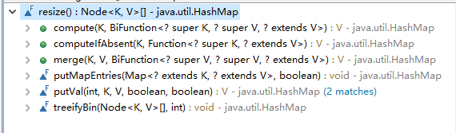
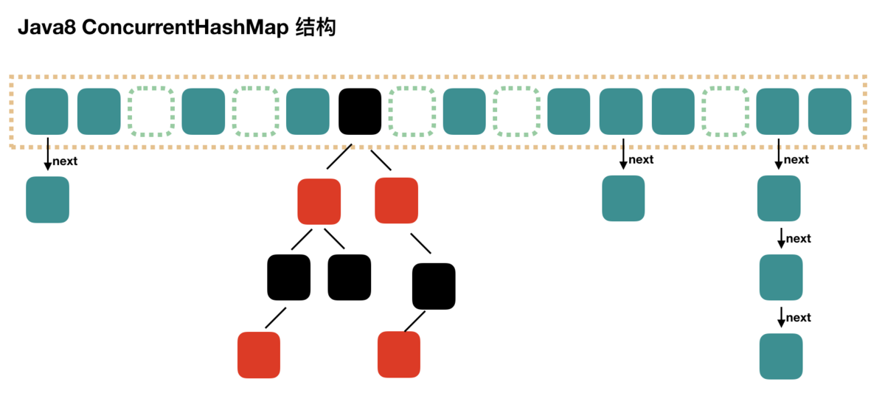
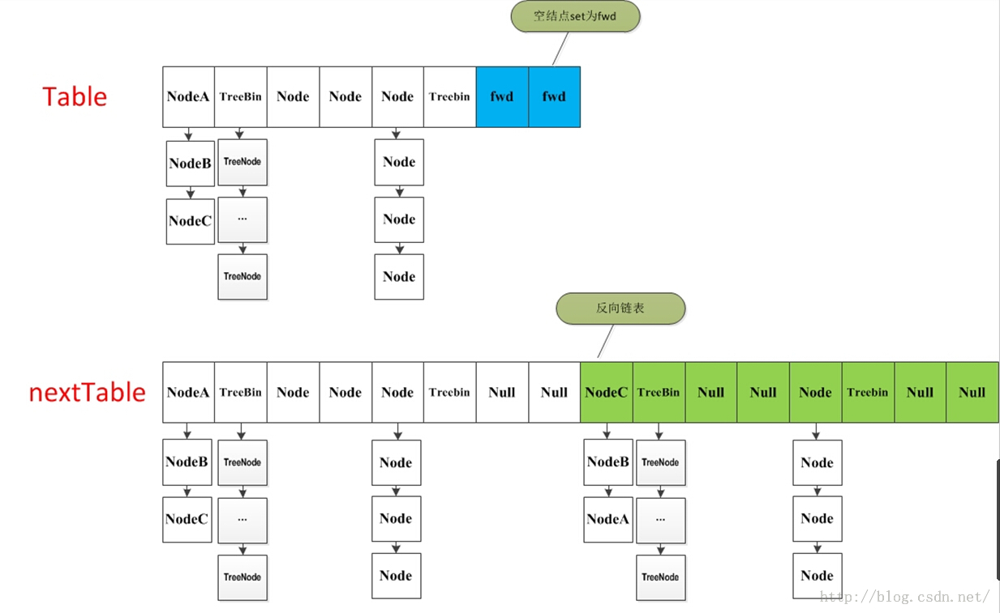
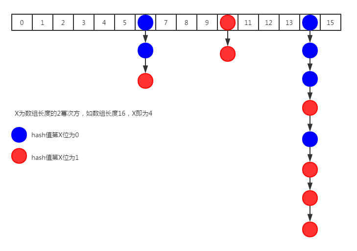
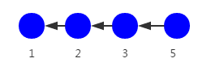
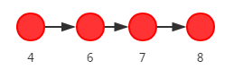
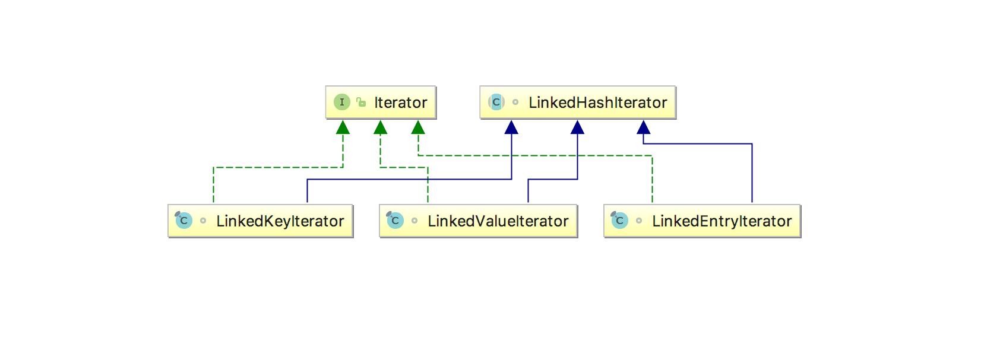
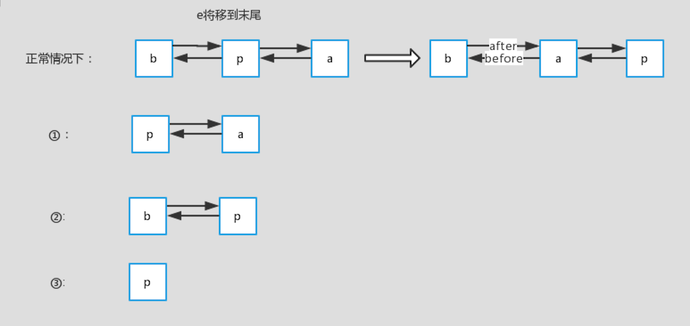

# map

HashMap,LinkedHashMap,TreeMap都不是线程安全的，性能较高。

- Hashtable 是早期Java类库提供的一个哈希表实现，本身是同步的，不支持 null 键和值，由于同步导致的性能开销，所以已经很少被推荐使用。
- HashMap与 HashTable主要区别在于 HashMap 不是同步的，支持 null 键和值等。通常情况下，HashMap 进行 put 或者 get 操作，可以达到常数时间的性能，所以它是绝大部分利用键值对存取场景的首选。
- LinkedHashMap有顺序不重复。
- TreeMap 则是基于红黑树的一种提供顺序访问的 Map，和 HashMap 不同，它的 get、put、remove 之类操作都是 O（log(n)）的时间复杂度，具体顺序可以由指定的 Comparator 来决定，或者根据键的自然顺序来判断。


## 1 Hashmap

[推荐博客](https://www.jianshu.com/p/ee0de4c99f87)

### 1.1 结构

HashMap是数组+链表+红黑树 。

数组被分为一个个桶（bucket），每个桶存储有一个或多个Entry对象，每个Entry对象包含三部分key（键）、value（值），next(指向下一个Entry），通过哈希值决定了Entry对象在这个数组的寻址；哈希值相同的Entry对象（键值对），则以链表形式存储。如果链表大小超过树形转换的阈值（TREEIFY_THRESHOLD= 8），链表就会被改造为树形结构。
/Marie(2019)/programming/08%E6%80%BB%E7%AC%94%E8%AE%B0/java%E5%9F%BA%E7%A1%80/assets/1.29.png)


查询时间复杂度：HashMap的本质可以认为是一个数组，数组的每个索引被称为桶，每个桶里放着一个单链表，一个节点连着一个节点。很明显通过下标来检索数组元素时间复杂度为O(1)，而且遍历链表的时间复杂度是O(n)，所以在链表长度尽可能短的前提下，HashMap的查询复杂度接近O(1)

- 数组：存储区间连续，占用内存严重，寻址容易，插入删除困难；  
- 链表：存储区间离散，占用内存比较宽松，寻址困难，插入删除容易；  

Hashmap综合应用了这两种数据结构，实现了寻址容易，插入删除也容易。 


### 1.2 拉链法的工作原理

```java
HashMap<String, String> map = new HashMap<>();
map.put("K1", "V1");
map.put("K2", "V2");
map.put("K3", "V3");
```

- 新建一个 HashMap，默认大小为 16；
- 插入 <K1,V1> 键值对，先计算 K1 的 hashCode 为 115，使用除留余数法得到所在的桶下标 115%16=3。
- 插入 <K2,V2> 键值对，先计算 K2 的 hashCode 为 118，使用除留余数法得到所在的桶下标 118%16=6。
- 插入 <K3,V3> 键值对，先计算 K3 的 hashCode 为 118，使用除留余数法得到所在的桶下标 118%16=6，插在 <K2,V2> 前面。

> 1.7使用头插法，1.8使用尾插法

/Marie(2019)/programming/08%E6%80%BB%E7%AC%94%E8%AE%B0/java%E5%9F%BA%E7%A1%80/assets/1.30.png)


查找需要分成两步进行：

- 计算键值对所在的桶；
- 在链表上顺序查找，时间复杂度显然和链表的长度成正比。


### 1.3 属性&类

属性：

```java
public class HashMap<K,V> extends AbstractMap<K,V>
    implements Map<K,V>, Cloneable, Serializable {
    //序列号，序列化的时候使用。
    private static final long serialVersionUID = 362498820763181265L;
    /**默认容量，1向左移位4个，00000001变成00010000，也就是2的4次方为16。**/
    static final int DEFAULT_INITIAL_CAPACITY = 1 << 4;
    
    //最大容量，2的30次方。
    static final int MAXIMUM_CAPACITY = 1 << 30;
    
    //加载因子，用于扩容使用。
    static final float DEFAULT_LOAD_FACTOR = 0.75f;
    
    //当某个桶节点数量大于8时，会转换为红黑树。
    static final int TREEIFY_THRESHOLD = 8;
    
    //当某个桶节点数量小于6时，会转换为链表，前提是它当前是红黑树结构。
    static final int UNTREEIFY_THRESHOLD = 6;
    
    //当某个桶节点数量大于8时，会转换为红黑树。将链表转换成红黑树前会判断，如果当前数组的长度小于 64，那么会选择先进行数组扩容，而不是转换为红黑树
    static final int MIN_TREEIFY_CAPACITY = 64;
    
    //存储元素的数组，transient关键字表示该属性不能被序列化，总是2的幂次倍
    transient Node<K,V>[] table;
    
    //将数据转换成set的另一种存储形式，这个变量主要用于迭代功能。
    transient Set<Map.Entry<K,V>> entrySet;
    
    //元素数量
    transient int size;
    
    //每次扩容和更改map结构的计数器
    transient int modCount;
    
    //临界值，也就是元素数量达到临界值时，会进行扩容。
    int threshold;
    
    //也是加载因子，只不过这个是变量。
    final float loadFactor;  
```


几个常用内部类：

使用静态内部类，是为了方便调用，而不用每次调用里面的属性或者方法都需要new一个对象。这是一个红黑树的结构。

```java
static final class TreeNode<K,V> extends LinkedHashMap.Entry<K,V> {
        TreeNode<K,V> parent;  
        TreeNode<K,V> left;
        TreeNode<K,V> right;
        TreeNode<K,V> prev;    
        boolean red;
        TreeNode(int hash, K key, V val, Node<K,V> next) {
            super(hash, key, val, next);
        }
}
```

```java
 static class Node<K,V> implements Map.Entry<K,V> {
        final int hash;
        final K key;
        V value;
        Node<K,V> next;
 
        Node(int hash, K key, V value, Node<K,V> next) {
            this.hash = hash;
            this.key = key;
            this.value = value;
            this.next = next;
        }
}
```

里面还包含了一个结点内部类，是一个单向链表。上面这两个内部类再加上之前的Node<K,V>[] table属性，组成了hashMap的结构，哈希桶。 


### 1.4 初始化

共四种构造器：

```java
    public HashMap() {
        //默认的加载因子0.75
        this.loadFactor = DEFAULT_LOAD_FACTOR; 
    }
 
 
    public HashMap(int initialCapacity) {
        this(initialCapacity, DEFAULT_LOAD_FACTOR);
    }
 
 
//构造一个初始容量为initialCapacity,负载因子为loadFactor的HashMap
    public HashMap(int initialCapacity, float loadFactor) {
        if (initialCapacity < 0)
            throw new IllegalArgumentException("Illegal initial capacity: " +
                                               initialCapacity);
        if (initialCapacity > MAXIMUM_CAPACITY)
            initialCapacity = MAXIMUM_CAPACITY;
        if (loadFactor <= 0 || Float.isNaN(loadFactor))
            throw new IllegalArgumentException("Illegal load factor: " +
                                               loadFactor);
        this.loadFactor = loadFactor;
        //threshold临界值，如果达到临界值需要扩容
        this.threshold = tableSizeFor(initialCapacity);
    }
```

第四个构造器：

   该构造函数，传入一个Map，然后把该Map转为hashMap，负载因子为默认的0.75

loadFactor：负载因子，0.75

threshold：临界值，临界值是判断数组是否要扩容的依据

tableSizeFor：用于计算临界值的方法

resize：扩容方法

```java
    public HashMap(Map<? extends K, ? extends V> m) {
        //负载因子，默认0.75
        this.loadFactor = DEFAULT_LOAD_FACTOR;
        putMapEntries(m, false);
    }
 
 
    final void putMapEntries(Map<? extends K, ? extends V> m, boolean evict) {
        int s = m.size();
        if (s > 0) {
            //table:存储元素的数组。判断table是否初始化，如果没有初始化
            if (table == null) { // pre-size
          	//根据插入的map的size计算要创建的HashMap的容量
                float ft = ((float)s / loadFactor) + 1.0F;
                //判断该容量大小是否超出上限。
                int t = ((ft < (float)MAXIMUM_CAPACITY) ?
                         (int)ft : MAXIMUM_CAPACITY);
               //threshold代表临界值，判断t是否大于临界值，如果就对threshold进行重新计算赋值得出新的临界值
                if (t > threshold)
                    threshold = tableSizeFor(t);
            }
            //如果table已经初始化，并且大于当前临界值，则进行扩容操作，resize()就是扩容。
            else if (s > threshold)
                resize();
            //遍历，把map中的数据转到hashMap中。
            for (Map.Entry<? extends K, ? extends V> e : m.entrySet()) {
                K key = e.getKey();
                V value = e.getValue();
                putVal(hash(key), key, value, false, evict);
            }
        }
    }
```


`tableSizeFor(int cap)` ：

```java
//Returns a power of two size for the given target capacity.
   static final int tableSizeFor(int cap) {
       int n = cap - 1;
        n |= n >>> 1;
        n |= n >>> 2;
        n |= n >>> 4;
        n |= n >>> 8;
        n |= n >>> 16;
       return (n < 0) ? 1 : (n >= MAXIMUM_CAPACITY) ? MAXIMUM_CAPACITY : n + 1;
    }
```

tableSizeFor代码解释：以65举例子， >>>表示右移

```java
n-=1 // n=1000000(二进制)
n |= n >>> 16;	//1000000 | 0000000 = 1000000 = 64
n |= n >>> 8;	//1000000 | 0000000 = 1000000 = 64
n |= n >>> 4;	//1000000 | 0000100 = 1000100 = 68 
n |= n >>> 2;	//1000100 | 0010001 = 1010101 = 85
n |= n >>> 1;	//1010101 | 0101010 = 1111111 = 127

return n + 1;
```


putVal(hash(key))方法中的`hash(key)`：

```java
static final hash(Object key){
    int h;
    return (key == null) ? 0 : (h = key.hashCode()) ^ (h >>> 16);
}
```

 `(h = key.hashCode()) ^ (h >>> 16)`：异或运算

原来的hashCode：

1111 1111 1111 1111 0100 1100 0000 1010

向右移16位的hashCode：

0000 0000 0000 0000 1111 1111 1111 1111

进行异或运算结果：

1111 1111 1111 1111 1011 0011 1111 0101

好处：生成的hash值的随机性会增大


### 1.5 扩容 resize()



> 因为从 JDK 1.8 开始引入了红黑树，扩容操作较为复杂。jdk1.7是没有用红黑树的。

|    参数     | 含义                                                         |
| :---------: | :----------------------------------------------------------- |
|  capacity   | table 的容量大小，默认为 16，需要注意的是 capacity 必须保证为 2 的次方。 |
|    size     | table 的实际使用量。                                         |
|  threshold  | size 的临界值，size 必须小于 threshold，如果大于等于，就必须进行扩容操作。 |
| load_factor | table 能够使用的比例，threshold = capacity * load_factor。   |

进行扩容，会伴随着一次重新hash分配，并且会遍历hash表中所有的元素，是非常耗时的。在编写程序中，要尽量避免resize。 

```java
final Node<K,V>[] resize() {
        Node<K,V>[] oldTab = table;//将当前table暂存到oldtab来操作
    	//保存当前table的容量
        int oldCap = (oldTab == null) ? 0 : oldTab.length;
    	//保存当前临界阈值
        int oldThr = threshold;
        int newCap, newThr = 0;
    
    	//1.当table已初始化时
        if (oldCap > 0) {
            if (oldCap >= MAXIMUM_CAPACITY) {//如果老容量大于最大容量
                threshold = Integer.MAX_VALUE;//阈值直接设置为Integer的最大值
                return oldTab;//直接返回不用扩容
            }
            //使新的容量翻倍
            else if ((newCap = oldCap << 1) < MAXIMUM_CAPACITY &&
                     oldCap >= DEFAULT_INITIAL_CAPACITY)
                newThr = oldThr << 1; // 阈值翻倍
        }
    
    
     //2.当table未初始化时，让新的容量为老的阈值
    else if (oldThr > 0){
        newCap = oldThr;
       }
    
   
    //3.这种情况是初始化HashMap时啥参数都没加
    else { 
            newCap = DEFAULT_INITIAL_CAPACITY;
            newThr = (int)(DEFAULT_LOAD_FACTOR * DEFAULT_INITIAL_CAPACITY);
        }
    
    
    //当新的阈值为0，重新计算，新的阈值= 新的容量*0.75
        if (newThr == 0) {
            float ft = (float)newCap * loadFactor;
            newThr = (newCap < MAXIMUM_CAPACITY && ft < (float)MAXIMUM_CAPACITY ?
                      (int)ft : Integer.MAX_VALUE);
        }
        threshold = newThr;//把新的阈值赋给当前table
    
    
        @SuppressWarnings({"rawtypes","unchecked"})
    	//初始化table
            Node<K,V>[] newTab = (Node<K,V>[])new Node[newCap];
        table = newTab;
        if (oldTab != null) {
            //对老table进行遍历
            for (int j = 0; j < oldCap; ++j) {
                Node<K,V> e;
                if ((e = oldTab[j]) != null) {//遍历到的赋给e进行暂存，同时将老table对应项赋值为null
                    oldTab[j] = null;
                    if (e.next == null)//将不为空的元素复制到新table中
                        newTab[e.hash & (newCap - 1)] = e;//等于是创建一个新的空table然后重新进行元素的put，这里的table长度是原table的两倍
                    else if (e instanceof TreeNode)//如果e是红黑树的元素，要进行红黑树的rehash操作
                        ((TreeNode<K,V>)e).split(this, newTab, j, oldCap);
                    else { //如果是链表，进行链表的rehash操作
                        Node<K,V> loHead = null, loTail = null;//用于保存put后不移位的链表
                        Node<K,V> hiHead = null, hiTail = null;//用于保存put后移位的链表
                        Node<K,V> next;
                        do {
                            next = e.next;
                            if ((e.hash & oldCap) == 0) {//如果与的结果为0，表示不移位，将桶中的头结点添加到lohead和lotail中，往后如果桶中还有不移位的结点，就向tail继续添加
                                if (loTail == null)//在后面遍历lohead和lotail保存到table中时，lohead用于保存头结点的位置，lotail用于判断是否到了末尾
                                    loHead = e;
                                else
                                    loTail.next = e;
                                loTail = e;
                            }
                            
                            else {//这是添加移位的结点，与不移位的类似
                                if (hiTail == null)
                                    hiHead = e;
                                else
                                    hiTail.next = e;
                                hiTail = e;
                            }
                        } while ((e = next) != null);
                        
                        
                        if (loTail != null) {//把不移位的结点添加到对应的链表数组中去
                            loTail.next = null;
                            newTab[j] = loHead;
                        }
                        
                        if (hiTail != null) {//把移位的结点添加到对应的链表数组中去
                            hiTail.next = null;
                            newTab[j + oldCap] = hiHead;
                        }
                    }
                }
            }
        }
        return newTab;
    }
```


### 1.6 putVal()

HashMap只提供了put用于添加元素，putVal方法只是给put方法调用的一个方法，并没有提供给用户使用。

**对putVal方法添加元素的分析如下：**

- ①如果定位到的数组位置没有元素 就直接插入。
- ②如果定位到的数组位置有元素就和要插入的key比较，如果key相同就直接覆盖，如果key不相同，就判断p是否是一个树节点，如果是就调用`e = ((TreeNode<K,V>)p).putTreeVal(this, tab, hash, key, value)`将元素添加进入。如果不是就遍历链表插入(插入的是链表尾部)。

**我们再来对比一下 JDK1.7 put方法的代码**

**对于put方法的分析如下：**

- ①如果定位到的数组位置没有元素 就直接插入。
- ②如果定位到的数组位置有元素，遍历以这个元素为头结点的链表，依次和插入的key比较，如果key相同就直接覆盖，不同就采用头插法插入元素。

**1.8流程：**


```java
    final V putVal(int hash, K key, V value, boolean onlyIfAbsent,boolean evict) {
        Node<K,V>[] tab; Node<K,V> p; int n, i;
        
        // 如果table为空或者长度为0，则resize()扩容
        if ((tab = table) == null || (n = tab.length) == 0) 
            n = (tab = resize()).length;
        
        // 确定插入table的位置，算法是(n - 1) & hash，相当于取模操作
        //这个表达式中可以看出为什么数组的扩容的长度为什么要是2的n次幂的原因了 
        // 确定后的在数组中的该位置为空，则新的节点放在这个位置
        if ((p = tab[i = (n - 1) & hash]) == null)
            tab[i] = newNode(hash, key, value, null);
        
        // 以下的else中的逻辑表示确定的该位置不是空
        else {
            Node<K,V> e; K k;
            //如果hash值相同并且key相同，或者key是equals的，直接替换这个节点
            if (p.hash == hash && ((k = p.key) == key || (key != null && key.equals(k))))
                e = p;
            
            // 如果是红黑树节点
            else if (p instanceof TreeNode)
                e = ((TreeNode<K,V>)p).putTreeVal(this, tab, hash, key, value);
            
            // 如果是链表节点，遍历链表
            else {
                for (int binCount = 0; ; ++binCount) {
                    //如果在尾端都没有找到和key值相同的节点，则生成一个新的Node插入尾端
                    if ((e = p.next) == null) {
                        p.next = newNode(hash, key, value, null);
                        
                        // 节点到达阈值，转为红黑树
                        if (binCount >= TREEIFY_THRESHOLD - 1) // -1 for 1st
                            treeifyBin(tab, hash);
                        break;
                    }
                    //如果有hash，key相同的节点或者equals的系欸但，直接替换
                    if (e.hash == hash && ((k = e.key) == key || (key != null && key.equals(k))))
                        break;
                    p = e;
                }
            }
            
            //如果e不为空就替换旧的oldValue值
            if (e != null) { 
                V oldValue = e.value;
                if (!onlyIfAbsent || oldValue == null)
                    e.value = value;
                afterNodeAccess(e);
                return oldValue;
            }
        }
        ++modCount;
        
        // 如果数组中的元素个数超过阈值，则进行扩容
        if (++size > threshold)
            resize();
        afterNodeInsertion(evict);
        return null;
    }
```

>注：hash 冲突发生的几种情况：
>
>1. 两节点key 值相同（hash值一定相同），导致冲突；
>2. 两节点key 值不同，由于 hash 函数的局限性导致hash 值相同，冲突；
>3. 两节点key 值不同，hash 值不同，但 hash 值对数组长度取模后相同，冲突；

##### 

### 1.7 get

1. 首先将 key hash 之后取得所定位的桶。`tab[(n - 1) & hash]`
2. 如果桶为空则直接返回 null 。
3. 否则判断桶的第一个位置，如果他们的hash相同并且他们的key==相等或者equals相等，返回桶第一个位置的元素
4. 如果第一个不匹配，则判断它的下一个是红黑树还是链表。
5. 红黑树就按照树的查找方式返回值。
6. 不然就按照链表的方式while遍历匹配返回值。

```java
public V get(Object key) {
    Node<K,V> e;
    return (e = getNode(hash(key), key)) == null ? null : e.value;
}

final Node<K,V> getNode(int hash, Object key) {
    Node<K,V>[] tab; Node<K,V> first, e; int n; K k;
    // 1. 定位键值对所在桶的位置
    if ((tab = table) != null && (n = tab.length) > 0 &&
        (first = tab[(n - 1) & hash]) != null) {
        if (first.hash == hash && // always check first node
            ((k = first.key) == key || (key != null && key.equals(k))))
            return first;
        if ((e = first.next) != null) {
            // 2. 如果 first 是 TreeNode 类型，则调用黑红树查找方法
            if (first instanceof TreeNode)
                return ((TreeNode<K,V>)first).getTreeNode(hash, key);
                
            // 2. 对链表进行查找
            do {
                if (e.hash == hash &&
                    ((k = e.key) == key || (key != null && key.equals(k))))
                    return e;
            } while ((e = e.next) != null);
        }
    }
    return null;
}
```


### 1.8 null值

HashMap 允许有一个 Node 的 Key 为 null，该 Node 一定会放在第 0 个桶的位置，因为这个 Key 无法计算 hashCode()，因此只能规定一个桶让它存放。


### 1.9 jdk1.7和jdk1.8对比

（1）JDK1.7用的是头插法，而JDK1.8及之后使用的都是尾插法，那么为什么要这样做呢？因为JDK1.7是用单链表进行的纵向延伸，当采用头插法就是能够提高插入的效率，但是也会容易出现逆序且环形链表死循环问题。但是在JDK1.8之后是因为加入了红黑树使用尾插法，能够避免出现逆序且链表死循环的问题。

（2）扩容后数据存储位置的计算方式也不一样：

在JDK1.7的时候是直接用hash值和需要扩容的二进制数进行&amp;（这里就是为什么扩容的时候为啥一定必须是2的多少次幂的原因所在，因为如果只有2的n次幂的情况时最后一位二进制数才一定是1，这样能最大程度减少hash碰撞）（hash值 &amp; length-1） 。
而在JDK1.8的时候直接用了JDK1.7的时候计算的规律，也就是扩容前的原始位置+扩容的大小值=JDK1.8的计算方式，而不再是JDK1.7的那种异或的方法。但是这种方式就相当于只需要判断Hash值的新增参与运算的位是0还是1就直接迅速计算出了扩容后的储存方式。

（3）JDK1.7的时候使用的是数组+ 单链表的数据结构。

JDK1.8及之后时，使用的是数组+链表+红黑树的数据结构（当链表的深度达到8的时候，也就是默认阈值，就会自动扩容把链表转成红黑树的数据结构来把时间复杂度从O（N）变成O（logN）提高了效率）。


### 1.10 HashMap为什么线程不安全的

HashMap 在并发时可能出现的问题主要是两方面：

1. **put的时候导致的多线程数据不一致**

   比如有两个线程A和B，首先A希望插入一个key-value对到HashMap中，首先计算记录所要落到的 hash桶的索引坐标，然后获取到该桶里面的链表头结点，此时线程A的时间片用完了，而此时线程B被调度得以执行，和线程A一样执行，只不过线程B成功将记录插到了桶里面，假设线程A插入的记录计算出来的 hash桶索引和线程B要插入的记录计算出来的 hash桶索引是一样的，那么当线程B成功插入之后，线程A再次被调度运行时，它依然持有过期的链表头但是它对此一无所知，以至于它认为它应该这样做，如此一来就覆盖了线程B插入的记录，这样线程B插入的记录就凭空消失了，造成了数据不一致的行为。

2. **resize而引起死循环**

   这种情况发生在HashMap自动扩容时，当2个线程同时检测到元素个数超过 数组大小 × 负载因子。此时2个线程会在put()方法中调用了resize()，**两个线程同时修改一个链表结构会产生一个循环链表**（JDK1.7中，会出现resize前后元素顺序倒置的情况）。接下来再想通过get()获取某一个元素，就会出现死循环。


### 1.11 与 HashTable 的区别

HashMap和Hashtable都实现了Map接口，但决定用哪一个之前先要弄清楚它们之间的分别。主要的区别有：**线程安全性，同步，以及速度。**

1. HashMap几乎可以等价于Hashtable，除了HashMap是非synchronized的，Hashtable是synchronized。
2. HashMap可以接受为null的键值(key)和值(value)，而Hashtable则不行
3. 另一个区别是HashMap的迭代器(Iterator)是fail-fast迭代器，而Hashtable的enumerator迭代器不是fail-fast的。所以当有其它线程改变了HashMap的结构（增加或者移除元素），将会抛出ConcurrentModificationException，但迭代器本身的remove()方法移除元素则不会抛出ConcurrentModificationException异常。但这并不是一个一定发生的行为，要看JVM。这条同样也是Enumeration和Iterator的区别。
4. 在单线程环境下Hashtable比HashMap要慢。
5. HashMap不能保证随着时间的推移Map中的元素次序是不变的。

> java 5提供了ConcurrentHashMap，它是HashTable的替代，比HashTable的扩展性更好。


## 2 ConcurrentHashMap

[推荐博客](https://www.jianshu.com/p/81d848ea6c1a)

[并发方法实现解析](https://www.jianshu.com/p/5bc70d9e5410)



- 抛弃了 JDK 1.7 中原有的 Segment 分段锁，而采用了 CAS + synchronized 来保证并发安全性。
- 将 JDK 1.7 中存放数据的 HashEntry 改为 Node，但作用是相同的。


### 2.1 重要属性&类

| 属性           | 说明                                                         |
| -------------- | ------------------------------------------------------------ |
| table          | 默认为 null，初始化发生在第一次插入操作，默认大小为 16 的数组，用来存储 Node 结点数据，扩容时大小总是 2 的幂次方。 |
| nextTable      | 默认为 null，扩容时新生成的数组，其大小为原数组的两倍。      |
| sizeCtl        | 默认为 0，用来控制 table 的初始化和扩容操作。-1 代表 table 正在初始化；-N 表示有 N-1 个线程正在进行扩容操作。 |
| ForwardingNode | 一个特殊的 Node 结点，hash 值为 -1，其中存储 nextTable 的引用。有 table 发生扩容的时候，ForwardingNode 发挥作用，作为一个占位符放在 table 中表示当前结点为 null 或者已经被移动。 |


**这里介绍关于table数组，有3个重要方法 ：**

```java
static{
    U = getUnsafe();
    ....          
}

    //以volatile读的方式读取table数组中的元素
    static final <K,V> Node<K,V> tabAt(Node<K,V>[] tab, int i) {
        return (Node<K,V>)U.getObjectVolatile(tab, ((long)i << ASHIFT) + ABASE);
    }

    //以volatile写的方式，将元素插入table数组
    static final <K,V> void setTabAt(Node<K,V>[] tab, int i, Node<K,V> v) {
        U.putObjectVolatile(tab, ((long)i << ASHIFT) + ABASE, v);
    }

    //以CAS的方式，将元素插入table数组
    static final <K,V> boolean casTabAt(Node<K,V>[] tab, int i,
                                        Node<K,V> c, Node<K,V> v) {
        //原子的执行如下逻辑：如果tab[i]==c,则设置tab[i]=v，并返回ture.否则返回false
        return U.compareAndSwapObject(tab, ((long)i << ASHIFT) + ABASE, c, v);
    }
    

```


重要的属性 :注意被volatile修饰的几个属性

```java
private static final int MAXIMUM_CAPACITY = 1 << 30;
private static final int DEFAULT_CAPACITY = 16;
static final int TREEIFY_THRESHOLD = 8;
static final int UNTREEIFY_THRESHOLD = 6;
static final int MIN_TREEIFY_CAPACITY = 64;
static final int MOVED     = -1; // hash值是-1，表示这是一个forwardNode节点
static final int TREEBIN   = -2; //表示这时一个TreeBin节点
static final int RESERVED  = -3; // hash for transient reservations
static final int HASH_BITS = 0x7fffffff; // usable bits of normal node hash
transient volatile Node<K,V>[] table;//默认没初始化的数组，用来保存元素

private transient volatile Node<K,V>[] nextTable;//默认为 null，扩容时新生成的数组，其大小为原数组的两倍。

/**
  默认为 0，用来控制 table 的初始化和扩容操作。-1 代表 table 正在初始化；-N 表示有 N-1 个线程正在进行扩容操作。
  */
    private transient volatile int sizeCtl;
```


Node<K,V>,这是构成每个元素的基本类：

```java
static class Node<K,V> implements Map.Entry<K,V> {
        final int hash;    //key的hash值
        final K key;       //key
        volatile V val;    //value
        volatile Node<K,V> next; //表示链表中的下一个节点

        Node(int hash, K key, V val, Node<K,V> next) {
            this.hash = hash;
            this.key = key;
            this.val = val;
            this.next = next;
        }
        public final K getKey()       { return key; }
        public final V getValue()     { return val; }
        public final int hashCode()   { return key.hashCode() ^ val.hashCode(); }
    }
```

ForwardingNode在转移的时候放在头部的节点，是一个空节点 ：

```java
static final class ForwardingNode<K,V> extends Node<K,V> {
        final Node<K,V>[] nextTable;
        ForwardingNode(Node<K,V>[] tab) {
            super(MOVED, null, null, null);
            this.nextTable = tab;
        }
}
```


### 2.2 put()

- 根据 key 计算出 hashcode 。
- 判断是否需要进行初始化。
- `f` 即为当前 key 定位出的 Node，**如果为空表示当前位置可以写入数据，利用 CAS 尝试写入，失败则自旋保证成功。**
- 如果当前位置的 `hashcode == MOVED == -1`,则需要进行扩容。
- 如果都不满足，则**利用 synchronized 锁写入数据。**
- 如果数量大于 `TREEIFY_THRESHOLD` 则要转换为红黑树。


**线程安全使用的两种方法：**

1. **CAS+失败自旋重试：**CAS同时具有**volatile读**和**volatile写**的内存语义

   `if (casTabAt(tab, i, null, new Node<K,V>(hash, key, value, null)))` 

   在put时，是以key定位出的第一个node为锁，使用sychronized来保证线程安全的，那么此桶为null，就没有锁了。此时在没有互斥锁保护的情况下，多个put线程都会尝试将元素插入头结点，使用CAS+失败自旋重试来保证线程安全。

2. **sychronized**

```java
final V putVal(K key, V value, boolean onlyIfAbsent) {
        if (key == null || value == null) throw new NullPointerException(); 
        // 键的hash值经过计算获得hash值，这里的 hash 计算多了一步 & HASH_BITS，HASH_BITS 是 0x7fffffff，该步是为了消除最高位上的负符号 hash的负在ConcurrentHashMap中有特殊意义表示在扩容或者是树结点
        int hash = spread(key.hashCode());
        int binCount = 0;
        for (Node<K,V>[] tab = table;;) { // 无限循环
            Node<K,V> f; int n, i, fh;
            if (tab == null || (n = tab.length) == 0) 
                tab = initTable();
            else if ((f = tabAt(tab, i = (n - 1) & hash)) == null) { // f 即为当前 key 定位出的 Node，如果为空表示当前位置可以写入数
                //利用 CAS 尝试写入，此时tab[i]等于预期值null,因此会插入node1.随后线程二执行casTabAt(tba,i,null,node2),此时tab[i]不等于预期值null，插入失败。然后线程二会回到for循环开始处，重新获取tab[i]作为预期值，重复上述逻辑。
                if (casTabAt(tab, i, null,
                             new Node<K,V>(hash, key, value, null))) 
                    break;         //设置成功，跳出for循环          
            }
            
            else if ((fh = f.hash) == MOVED) // 该结点的hash值为MOVED
                // 进行结点的转移（在扩容的过程中）
                tab = helpTransfer(tab, f);
            else {
                V oldVal = null;
                synchronized (f) { // 加锁同步
                    if (tabAt(tab, i) == f) { // 找到table表下标为i的结点
                        if (fh >= 0) { // 该table表中该结点的hash值大于0
                            // binCount赋值为1
                            binCount = 1;
                            for (Node<K,V> e = f;; ++binCount) { // 无限循环
                                K ek;
                                if (e.hash == hash &&
                                    ((ek = e.key) == key ||
                                     (ek != null && key.equals(ek)))) { // 结点的hash值相等并且key也相等
                                    // 保存该结点的val值
                                    oldVal = e.val;
                                    if (!onlyIfAbsent) // 进行判断
                                        // 将指定的value保存至结点，即进行了结点值的更新
                                        e.val = value;
                                    break;
                                }
                                // 保存当前结点
                                Node<K,V> pred = e;
                                if ((e = e.next) == null) { // 当前结点的下一个结点为空，即为最后一个结点
                                    // 新生一个结点并且赋值给next域
                                    pred.next = new Node<K,V>(hash, key,
                                                              value, null);
                                    // 退出循环
                                    break;
                                }
                            }
                        }
                        else if (f instanceof TreeBin) { // 结点为红黑树结点类型
                            Node<K,V> p;
                            // binCount赋值为2
                            binCount = 2;
                            if ((p = ((TreeBin<K,V>)f).putTreeVal(hash, key,
                                                           value)) != null) { // 将hash、key、value放入红黑树
                                // 保存结点的val
                                oldVal = p.val;
                                if (!onlyIfAbsent) // 判断
                                    // 赋值结点value值
                                    p.val = value;
                            }
                        }
                    }
                }
                if (binCount != 0) { // binCount不为0
                    if (binCount >= TREEIFY_THRESHOLD) // 如果binCount大于等于转化为红黑树的阈值
                        // 进行转化
                        treeifyBin(tab, i);
                    if (oldVal != null) // 旧值不为空
                        // 返回旧值
                        return oldVal;
                    break;
                }
                
            }
        }
        // 增加binCount的数量
        addCount(1L, binCount);
        return null;
}

```


### 2.3 初始化数组

- 初始化方法中的并发问题是通过对 sizeCtl 进行一个 CAS 操作来控制的。 
- 只有第一次使用才初始化，为了防止初始化后的首次操作就需要扩容（比如 putAll ），从而影响效率。

```java
private final Node<K,V>[] initTable() {
    Node<K,V>[] tab; int sc;
    while ((tab = table) == null || tab.length == 0) {
        // sizeCtl < 0 ,表示初始化数组的工作其它线程正在做，很明显，sizeCtl是由volatile修饰的，保证可见性 
        if ((sc = sizeCtl) < 0)
            Thread.yield(); //  线程让步：暂停当前正在执行的线程对象，把执行机会让给相同或者更高优先级的线程。
        // CAS 一下，将 sizeCtl 设置为 -1，代表抢到了锁
        else if (U.compareAndSwapInt(this, SIZECTL, sc, -1)) {
            try {
                if ((tab = table) == null || tab.length == 0) {
                    // DEFAULT_CAPACITY 默认初始容量是 16
                    int n = (sc > 0) ? sc : DEFAULT_CAPACITY;
                    // 初始化数组，长度为 16 或初始化时提供的长度
                    Node<K,V>[] nt = (Node<K,V>[])new Node<?,?>[n];
                    // 将这个数组赋值给 table，table 是 volatile 的
                    table = tab = nt;
                    // 如果 n 为 16 的话，那么这里 sc = 12
                    // 其实就是 0.75 * n
                    sc = n - (n >>> 2);
                }
            } finally {
                // 设置 sizeCtl 为 sc
                sizeCtl = sc;
            }
            break;
        }
    }
    return tab;
}

```


### 2.4 链表转红黑树

treeifyBin 不一定就会进行红黑树转换，也可能是仅仅做数组扩容。

 **synchronized (b)  ：对桶中第一个结点进行加锁**

```java
private final void treeifyBin(Node<K,V>[] tab, int index) {
        Node<K,V> b; int n, sc;
        if (tab != null) { // 表不为空
            if ((n = tab.length) < MIN_TREEIFY_CAPACITY) // table表的长度小于最小的长度
                // 进行扩容，调整某个桶中结点数量过多的问题（由于某个桶中结点数量超出了阈值，则触发treeifyBin）
                tryPresize(n << 1);
            else if ((b = tabAt(tab, index)) != null && b.hash >= 0) { // 桶中存在结点并且结点的hash值大于等于0
                synchronized (b) { // 对桶中第一个结点进行加锁
                    if (tabAt(tab, index) == b) { // 第一个结点没有变化
                        TreeNode<K,V> hd = null, tl = null;
                        for (Node<K,V> e = b; e != null; e = e.next) { // 遍历桶中所有结点
                            // 新生一个TreeNode结点
                            TreeNode<K,V> p =
                                new TreeNode<K,V>(e.hash, e.key, e.val,
                                                  null, null);
                            if ((p.prev = tl) == null) // 该结点前驱为空
                                // 设置p为头结点
                                hd = p;
                            else
                                // 尾结点的next域赋值为p
                                tl.next = p;
                            // 尾结点赋值为p
                            tl = p;
                        }
                        // 设置table表中下标为index的值为hd
                        setTabAt(tab, index, new TreeBin<K,V>(hd));
                    }
                }
            }
        }
}

```


### 2.5 扩容resize()

什么时候会触发扩容？

当往hashMap中成功插入一个key/value节点时，有可能触发扩容：

1. 新增节点之后，会调用`addCount`方法记录元素个数，并检查是否需要进行扩容，当数组元素个数达到阈值时，会触发`transfer`方法，重新调整节点的位置。 
2. 如果新增节点之后，所在链表的元素个数达到了阈值 **8**，则会调用`treeifyBin`方法把链表转换成红黑树，不过在结构转换之前，会对数组长度进行判断 


- 扩容后数组容量为原来的 2 倍。

```java
// 参数 size 传进来的时候就已经翻倍（例如 16）
private final void tryPresize(int size) {
    // c：size 的 1.5 倍，再加 1，再往上取最近的 2 的 n 次方。
    // 16 + 8 + 1 -> 32 -> 2^8
    int c = (size >= (MAXIMUM_CAPACITY >>> 1)) ? MAXIMUM_CAPACITY :
        tableSizeFor(size + (size >>> 1) + 1);
    int sc;
    while ((sc = sizeCtl) >= 0) {
        Node<K,V>[] tab = table; int n;
 
        // 这个 if 分支和之前说的初始化数组的代码基本上是一样的，在这里，我们可以不用管这块代码
        if (tab == null || (n = tab.length) == 0) {
            n = (sc > c) ? sc : c;
            if (U.compareAndSwapInt(this, SIZECTL, sc, -1)) {
                try {
                    if (table == tab) {
                        @SuppressWarnings("unchecked")
                        Node<K,V>[] nt = (Node<K,V>[])new Node<?,?>[n];
                        table = nt;
                        sc = n - (n >>> 2); // 0.75 * n
                    }
                } finally {
                    sizeCtl = sc;
                }
            }
        }
        else if (c <= sc || n >= MAXIMUM_CAPACITY)
            break;
        else if (tab == table) {
            int rs = resizeStamp(n);
 
            if (sc < 0) {
                Node<K,V>[] nt;
                if ((sc >>> RESIZE_STAMP_SHIFT) != rs || sc == rs + 1 ||
                    sc == rs + MAX_RESIZERS || (nt = nextTable) == null ||
                    transferIndex <= 0)
                    break;
                // 2. 用 CAS 将 sizeCtl 加 1，然后执行 transfer 方法
                //    此时 nextTab 不为 null
                if (U.compareAndSwapInt(this, SIZECTL, sc, sc + 1))
                    transfer(tab, nt);
            }
            // 1. 将 sizeCtl 设置为 (rs << RESIZE_STAMP_SHIFT) + 2)
            //  调用 transfer 方法，此时 nextTab 参数为 null
            else if (U.compareAndSwapInt(this, SIZECTL, sc,
                                         (rs << RESIZE_STAMP_SHIFT) + 2))
                transfer(tab, null);
        }
    }
}

```


### 2.6 transfer()

[安利博客](https://www.cnblogs.com/williamjie/p/9099861.html)

> ForwardingNode

为什么有ForwardingNode和helpTransfer()：单个扩容线程的扩容速度会很慢，可能有线程需要插入尾端数据，但是那个扩容线程在头端。这样的话，给对应hash表设置灵活的扩容机制比较重要。读线程不需修改数据，直接把数据读了就是；写线程要考虑新插入的数据位置，让这个线程协助扩容，再完成插入操作的话这个线程的写操作不会堵塞很久。 


> 扩容流程

整个扩容操作分为两个部分

-  第一部分是构建一个nextTable,它的容量是原来的两倍，这个操作是单线程完成的。这个单线程的保证是通过RESIZE_STAMP_SHIFT这个常量经过一次运算来保证的，这个地方在后面会有提到；
- 第二个部分就是将原来table中的元素复制到nextTable中，这里允许多线程进行操作。

**先来看一下单线程是如何完成的：**

它的大体思想就是遍历、复制的过程。首先根据运算得到需要遍历的次数i，然后利用tabAt方法获得i位置的元素：

- 如果这个位置为空，就在原table中的i位置放入forwardNode节点，这个也是触发并发扩容的关键点；

- 如果这个位置是Node节点（fh>=0），如果它是一个链表的头节点，就构造一个反序链表，把他们分别放在nextTable的i和i+n的位置上

- 如果这个位置是TreeBin节点（fh<0），也做一个反序处理，并且判断是否需要untreefi，把处理的结果分别放在nextTable的i和i+n的位置上

- 遍历过所有的节点以后就完成了复制工作，这时让nextTable作为新的table，并且更新sizeCtl为新容量的0.75倍 ，完成扩容。

**再看一下多线程是如何完成的：**

在代码的69行有一个判断，如果遍历到的节点是forward节点，就向后继续遍历，再加上给节点上锁的机制，就完成了多线程的控制。多线程遍历节点，处理了一个节点，就把对应点的值set为forward，另一个线程看到forward，就向后遍历。这样交叉就完成了复制工作。而且还很好的解决了线程安全的问题。 




> 链表扩容过程举例

`transfer`方法实现了在并发的情况下，高效的从原始组数往新数组中移动元素，假设扩容之前节点的分布如下，这里区分蓝色节点和红色节点，是为了后续更好的分析：



使用`fn&n`可以快速把链表中的元素区分成两类，A类是hash值的第X位为0，B类是hash值的第X位为1。

ln链：和原来链表相比，顺序已经不一样了 



hn链：

 

通过CAS把ln链表设置到新数组的i位置，hn链表设置到i+n的位置； 

```java
/**
     * 一个过渡的table表  只有在扩容的时候才会使用
     */
private transient volatile Node<K,V>[] nextTable;

/**
     * Moves and/or copies the nodes in each bin to new table. See
     * above for explanation.
     */
private final void transfer(Node<K,V>[] tab, Node<K,V>[] nextTab) {
    int n = tab.length, stride;
    if ((stride = (NCPU > 1) ? (n >>> 3) / NCPU : n) < MIN_TRANSFER_STRIDE)
        stride = MIN_TRANSFER_STRIDE; // subdivide range
    if (nextTab == null) {            // initiating
        try {
            @SuppressWarnings("unchecked")
            Node<K,V>[] nt = (Node<K,V>[])new Node<?,?>[n << 1];//构造一个nextTable对象 它的容量是原来的两倍
            nextTab = nt;
        } catch (Throwable ex) {      // try to cope with OOME
            sizeCtl = Integer.MAX_VALUE;
            return;
        }
        nextTable = nextTab;
        transferIndex = n;
    }
    int nextn = nextTab.length;
    ForwardingNode<K,V> fwd = new ForwardingNode<K,V>(nextTab);//构造一个连节点指针 用于标志位
    boolean advance = true;//并发扩容的关键属性 如果等于true 说明这个节点已经处理过
    boolean finishing = false; // to ensure sweep before committing nextTab
    for (int i = 0, bound = 0;;) {
        Node<K,V> f; int fh;
        //这个while循环体的作用就是在控制i--  通过i--可以依次遍历原hash表中的节点
        while (advance) {
            int nextIndex, nextBound;
            if (--i >= bound || finishing)
                advance = false;
            else if ((nextIndex = transferIndex) <= 0) {
                i = -1;
                advance = false;
            }
            else if (U.compareAndSwapInt
                     (this, TRANSFERINDEX, nextIndex,
                      nextBound = (nextIndex > stride ?
                                   nextIndex - stride : 0))) {
                bound = nextBound;
                i = nextIndex - 1;
                advance = false;
            }
        }
        if (i < 0 || i >= n || i + n >= nextn) {
            int sc;
            if (finishing) {
                //如果所有的节点都已经完成复制工作  就把nextTable赋值给table 清空临时对象nextTable
                nextTable = null;
                table = nextTab;
                sizeCtl = (n << 1) - (n >>> 1);//扩容阈值设置为原来容量的1.5倍  依然相当于现在容量的0.75倍
                return;
            }
            //利用CAS方法更新这个扩容阈值，在这里面sizectl值减一，说明新加入一个线程参与到扩容操作
            if (U.compareAndSwapInt(this, SIZECTL, sc = sizeCtl, sc - 1)) {
                if ((sc - 2) != resizeStamp(n) << RESIZE_STAMP_SHIFT)
                    return;
                finishing = advance = true;
                i = n; // recheck before commit
            }
        }
        //如果遍历到的节点为空 则放入ForwardingNode指针
        else if ((f = tabAt(tab, i)) == null)
            advance = casTabAt(tab, i, null, fwd);
        //如果遍历到ForwardingNode节点  说明这个点已经被处理过了 直接跳过  这里是控制并发扩容的核心
        else if ((fh = f.hash) == MOVED)
            advance = true; // already processed
        else {
            //节点上锁
            synchronized (f) {
                if (tabAt(tab, i) == f) {
                    Node<K,V> ln, hn;
                    //如果fh>=0 证明这是一个Node节点
                    if (fh >= 0) {
                        int runBit = fh & n;
                        //以下的部分在完成的工作是构造两个链表  一个是原链表  另一个是原链表的反序排列
                        Node<K,V> lastRun = f;
                        for (Node<K,V> p = f.next; p != null; p = p.next) {
                            int b = p.hash & n;
                            if (b != runBit) {
                                runBit = b;
                                lastRun = p;
                            }
                        }
                        if (runBit == 0) {
                            ln = lastRun;
                            hn = null;
                        }
                        else {
                            hn = lastRun;
                            ln = null;
                        }
                        for (Node<K,V> p = f; p != lastRun; p = p.next) {
                            int ph = p.hash; K pk = p.key; V pv = p.val;
                            if ((ph & n) == 0)
                                ln = new Node<K,V>(ph, pk, pv, ln);
                            else
                                hn = new Node<K,V>(ph, pk, pv, hn);
                        }
                        //在nextTable的i位置上插入一个链表
                        setTabAt(nextTab, i, ln);
                        //在nextTable的i+n的位置上插入另一个链表
                        setTabAt(nextTab, i + n, hn);
                        //在table的i位置上插入forwardNode节点  表示已经处理过该节点
                        setTabAt(tab, i, fwd);
                        //设置advance为true 返回到上面的while循环中 就可以执行i--操作
                        advance = true;
                    }
                    //对TreeBin对象进行处理  与上面的过程类似
                    else if (f instanceof TreeBin) {
                        TreeBin<K,V> t = (TreeBin<K,V>)f;
                        TreeNode<K,V> lo = null, loTail = null;
                        TreeNode<K,V> hi = null, hiTail = null;
                        int lc = 0, hc = 0;
                        //构造正序和反序两个链表
                        for (Node<K,V> e = t.first; e != null; e = e.next) {
                            int h = e.hash;
                            TreeNode<K,V> p = new TreeNode<K,V>
                                (h, e.key, e.val, null, null);
                            if ((h & n) == 0) {
                                if ((p.prev = loTail) == null)
                                    lo = p;
                                else
                                    loTail.next = p;
                                loTail = p;
                                ++lc;
                            }
                            else {
                                if ((p.prev = hiTail) == null)
                                    hi = p;
                                else
                                    hiTail.next = p;
                                hiTail = p;
                                ++hc;
                            }
                        }
                        //如果扩容后已经不再需要tree的结构 反向转换为链表结构
                        ln = (lc <= UNTREEIFY_THRESHOLD) ? untreeify(lo) :
                        (hc != 0) ? new TreeBin<K,V>(lo) : t;
                        hn = (hc <= UNTREEIFY_THRESHOLD) ? untreeify(hi) :
                        (lc != 0) ? new TreeBin<K,V>(hi) : t;
                        //在nextTable的i位置上插入一个链表    
                        setTabAt(nextTab, i, ln);
                        //在nextTable的i+n的位置上插入另一个链表
                        setTabAt(nextTab, i + n, hn);
                        //在table的i位置上插入forwardNode节点  表示已经处理过该节点
                        setTabAt(tab, i, fwd);
                        //设置advance为true 返回到上面的while循环中 就可以执行i--操作
                        advance = true;
                    }
                }
            }
        }
    }
}
```

 

### 2.7 get()

**get方法同样利用了volatile特性，实现了无锁读**。

查找value的过程如下：

1. 根据key定位hash桶，通过**tabAt的volatile读**，获取hash桶的头结点。
2. 通过头结点Node的**volatile属性next**，遍历Node链表
3. 找到目标node后，读取Node的**volatile属性val** 

可见上述3个操作都是volatile读，因此可以做到在不加锁的情况下，保证value的内存可见性

```java
public V get(Object key) {
    Node<K,V>[] tab; Node<K,V> e, p; int n, eh; K ek;
    int h = spread(key.hashCode());
    if ((tab = table) != null && (n = tab.length) > 0 &&
        (e = tabAt(tab, (n - 1) & h)) != null) {
        // 判断头结点是否就是我们需要的结点
        if ((eh = e.hash) == h) {
            if ((ek = e.key) == key || (ek != null && key.equals(ek)))
                return e.val;
        }
        // 如果头结点的 hash 小于 0，说明 正在扩容，或者该位置是红黑树
        else if (eh < 0)
            // 参考 ForwardingNode.find(int h, Object k) 和 TreeBin.find(int h, Object k)
            return (p = e.find(h, key)) != null ? p.val : null;
 
        // 遍历链表
        while ((e = e.next) != null) {
            if (e.hash == h &&
                ((ek = e.key) == key || (ek != null && key.equals(ek))))
                return e.val;
        }
    }
    return null;
}
```

 

### 2.8 ConcurrentHashmap 不支持 key 或者 value 为 null 的原因

因为支持并发的Map在调用m.contains（key）和m.get(key),m可能已经不同了。

 

## 3 LinkedHashMap

[推荐博客1](https://www.cnblogs.com/joemsu/p/7787043.html)

[推荐博客2](https://segmentfault.com/a/1190000012964859#item-3-2)

HashMap是无序的，当我们希望有顺序地去存储key-value时，就需要使用LinkedHashMap了。 


### 3.1 继承关系


LinkedHashMap的Entry继承自HashMap的Node，在其基础上加上了before和after两个指针。

而TreeNode作为HashMap和LinkedHashMap的树节点，继承自LinkedHahsMap的Entry，并且加上了树节点的相关指针。



LinkedHashMap的迭代器为遍历节点提供了自己的实现 


### 3.2 存储结构


内部维护了一个双向链表，用来维护插入顺序或者 LRU 顺序。

继承自 HashMap:

```java
public class LinkedHashMap<K,V> extends HashMap<K,V> implements Map<K,V>
```


### 3.3 重要成员变量

```java
private static final long serialVersionUID = 3801124242820219131L;

// 用于指向双向链表的头部
transient LinkedHashMap.Entry<K,V> head;
//用于指向双向链表的尾部
transient LinkedHashMap.Entry<K,V> tail;
/**
 * 用来指定LinkedHashMap的迭代顺序，
 * true则表示按照基于访问的顺序来排列，意思就是最近使用的entry，放在链表的最末尾
 * false则表示按照插入顺序来
 */ 
final boolean accessOrder;
```

> 注意：`accessOrder`的**final**关键字，说明我们要在构造方法里给它初始化。 


### 3.4 构造方法

跟HashMap类似的构造方法这里就不一一赘述了，**里面唯一的区别就是添加了前面提到的accessOrder，默认赋值为false**

```java
//多了一个 accessOrder的参数，用来指定按照LRU排列方式还是顺序插入的排序方式
public LinkedHashMap(int initialCapacity,
                         float loadFactor,
                         boolean accessOrder) {
   super(initialCapacity, loadFactor);
   this.accessOrder = accessOrder;
 }
```


### 3.5 get()方法

先介绍三个回调方法：

```java
// Callbacks to allow LinkedHashMap post-actions
void afterNodeAccess(Node<K,V> p) { }
void afterNodeInsertion(boolean evict) { }
void afterNodeRemoval(Node<K,V> p) { }
```

这些方法的用途是在增删查等操作后，通过回调的方式，让 LinkedHashMap 有机会做一些后置操作。


```java
public V get(Object key) {
  Node<K,V> e;
  //调用HashMap的getNode的方法，详见上一篇HashMap源码解析
  if ((e = getNode(hash(key), key)) == null)
    return null;
  //在取值后对参数accessOrder进行判断，如果为true，执行afterNodeAccess
  if (accessOrder)
    afterNodeAccess(e);
  return e.value;
}
```


##### 3.5.1 afterNodeAccess()

accessOrder = true表示按照基于访问的顺序来排列，意思就是最近使用的entry，放在链表的最末尾。

```java
//此函数执行的效果就是将最近使用的Node，放在链表的最末尾
void afterNodeAccess(Node<K,V> e) {
  LinkedHashMap.Entry<K,V> last;
  //仅当按照LRU原则且e不在最末尾，才执行修改链表，将e移到链表最末尾的操作
  if (accessOrder && (last = tail) != e) {
    //将e赋值临时节点p， b是e的前一个节点， a是e的后一个节点
    LinkedHashMap.Entry<K,V> p =
      (LinkedHashMap.Entry<K,V>)e, b = p.before, a = p.after;
    //设置p的后一个节点为null，因为执行后p在链表末尾，after肯定为null
    p.after = null;
    //p前一个节点不存在，情况一
    if (b == null) // ①
      head = a;
    else
      b.after = a;
    if (a != null) 
      a.before = b;
    //p的后一个节点不存在，情况二
    else // ②
      last = b;
    //情况三
    if (last == null) // ③
      head = p;
    //正常情况，将p设置为尾节点的准备工作，p的前一个节点为原先的last，last的after为p
    else {
      p.before = last;
      last.after = p;
    }
    //将p设置为将p设置为尾节点
    tail = p;
    // 修改计数器+1
    ++modCount;
  }
}
```

标注的情况如下图所示（**特别说明一下，这里是显示链表的修改后指针的情况，实际上在桶里面的位置是不变的，只是前后的指针指向的对象变了**）： 

 

- 正常情况下：查询的p在链表中间，那么将p设置到末尾后，它原先的前节点b和后节点a就变成了前后节点。
- 情况一：p为头部，前一个节点b不存在，那么考虑到p要放到最后面，则设置p的后一个节点a为head
- 情况二：p为尾部，后一个节点a不存在，那么考虑到统一操作，设置last为b
- 情况三：p为链表里的第一个节点，head=p


##### 3.5.2 afterNodeInsertion()

在 put 等操作之后执行，当 removeEldestEntry() 方法返回 true 时会移除最晚的节点，也就是链表首部节点 first。

evict 只有在构建 Map 的时候才为 false，在这里为 true。

```java
void afterNodeInsertion(boolean evict) { // possibly remove eldest
    LinkedHashMap.Entry<K,V> first;
    if (evict && (first = head) != null && removeEldestEntry(first)) {
        K key = first.key;
        removeNode(hash(key), key, null, false, true);
    }
}
```

removeEldestEntry() 默认为 false，如果需要让它为 true，需要继承 LinkedHashMap  并且覆盖这个方法的实现，这在实现 LRU 的缓存中特别有用，通过移除最近最久未使用的节点，从而保证缓存空间足够，并且缓存的数据都是热点数据。

```java
protected boolean removeEldestEntry(Map.Entry<K,V> eldest) {
    return false;
}
```


上面的源码的核心逻辑在一般情况下都不会被执行。上面的代码就是通过一些条件，判断是否移除最近最少被访问的节点。

当我们基于 LinkedHashMap 实现缓存时，通过覆写`removeEldestEntry`方法可以实现自定义策略的 LRU  缓存。


### 3.6 put()方法

LinkedHashMap的put方法调用的还是HashMap里的put，不同的是重写了里面的部分方法,还增加了回调方法

-  afterNodeAccess(e);    // 回调方法
- afterNodeInsertion(evict);    // 回调方法

```java
// HashMap 中实现
public V put(K key, V value) {
    return putVal(hash(key), key, value, false, true);
}

// HashMap 中实现
final V putVal(int hash, K key, V value, boolean onlyIfAbsent,
               boolean evict) {
    Node<K,V>[] tab; Node<K,V> p; int n, i;
    if ((tab = table) == null || (n = tab.length) == 0) {...}
    // 通过节点 hash 定位节点所在的桶位置，并检测桶中是否包含节点引用
    if ((p = tab[i = (n - 1) & hash]) == null) {...}
    else {
        Node<K,V> e; K k;
        if (p.hash == hash &&
            ((k = p.key) == key || (key != null && key.equals(k))))
            e = p;
        else if (p instanceof TreeNode) {...}
        else {
            // 遍历链表，并统计链表长度
            for (int binCount = 0; ; ++binCount) {
                // 未在单链表中找到要插入的节点，将新节点接在单链表的后面
                if ((e = p.next) == null) {
                    p.next = newNode(hash, key, value, null);
                    if (binCount >= TREEIFY_THRESHOLD - 1) {...}
                    break;
                }
                // 插入的节点已经存在于单链表中
                if (e.hash == hash &&
                    ((k = e.key) == key || (key != null && key.equals(k))))
                    break;
                p = e;
            }
        }
        if (e != null) { // existing mapping for key
            V oldValue = e.value;
            if (!onlyIfAbsent || oldValue == null) {...}
            afterNodeAccess(e);    // 回调方法
            return oldValue;
        }
    }
    ++modCount;
    if (++size > threshold) {...}
    afterNodeInsertion(evict);    // 回调方法
    return null;
}

// HashMap 中实现
Node<K,V> newNode(int hash, K key, V value, Node<K,V> next) {
    return new Node<>(hash, key, value, next);
}

// LinkedHashMap 中覆写
Node<K,V> newNode(int hash, K key, V value, Node<K,V> e) {
    LinkedHashMap.Entry<K,V> p =
        new LinkedHashMap.Entry<K,V>(hash, key, value, e);
    // 将 Entry 接在双向链表的尾部
    linkNodeLast(p);
    return p;
}

// LinkedHashMap 中实现
private void linkNodeLast(LinkedHashMap.Entry<K,V> p) {
    LinkedHashMap.Entry<K,V> last = tail;
    tail = p;
    // last 为 null，表明链表还未建立
    if (last == null)
        head = p;
    else {
        // 将新节点 p 接在链表尾部
        p.before = last;
        last.after = p;
    }
}
```


### 3.7 remove()方法

1. 根据 hash 定位到桶位置
2. 遍历链表或调用红黑树相关的删除方法
3. 从 LinkedHashMap 维护的双链表中移除要删除的节点


remove里面设计者也设置了一个钩子方法： afterNodeRemoval(node); 

```java
// HashMap 中实现
public V remove(Object key) {
    Node<K,V> e;
    return (e = removeNode(hash(key), key, null, false, true)) == null ?
        null : e.value;
}

// HashMap 中实现
final Node<K,V> removeNode(int hash, Object key, Object value,
                           boolean matchValue, boolean movable) {
    Node<K,V>[] tab; Node<K,V> p; int n, index;
    if ((tab = table) != null && (n = tab.length) > 0 &&
        (p = tab[index = (n - 1) & hash]) != null) {
        Node<K,V> node = null, e; K k; V v;
        if (p.hash == hash &&
            ((k = p.key) == key || (key != null && key.equals(k))))
            node = p;
        else if ((e = p.next) != null) {
            if (p instanceof TreeNode) {...}
            else {
                // 遍历单链表，寻找要删除的节点，并赋值给 node 变量
                do {
                    if (e.hash == hash &&
                        ((k = e.key) == key ||
                         (key != null && key.equals(k)))) {
                        node = e;
                        break;
                    }
                    p = e;
                } while ((e = e.next) != null);
            }
        }
        if (node != null && (!matchValue || (v = node.value) == value ||
                             (value != null && value.equals(v)))) {
            if (node instanceof TreeNode) {...}
            // 将要删除的节点从单链表中移除
            else if (node == p)
                tab[index] = node.next;
            else
                p.next = node.next;
            ++modCount;
            --size;
            afterNodeRemoval(node);    // 调用回调方法进行后续操作
            return node;
        }
    }
    return null;
}

// LinkedHashMap 中覆写
void afterNodeRemoval(Node<K,V> e) { // unlink
    LinkedHashMap.Entry<K,V> p =
        (LinkedHashMap.Entry<K,V>)e, b = p.before, a = p.after;
    // 将 p 节点的前驱后后继引用置空
    p.before = p.after = null;
    // b 为 null，表明 p 是头节点
    if (b == null)
        head = a;
    else
        b.after = a;
    // a 为 null，表明 p 是尾节点
    if (a == null)
        tail = b;
    else
        a.before = b;
}
```


### 3.8 迭代器

```java
abstract class LinkedHashIterator {
  //记录下一个Entry
  LinkedHashMap.Entry<K,V> next;
  //记录当前的Entry
  LinkedHashMap.Entry<K,V> current;
  //记录是否发生了迭代过程中的修改
  int expectedModCount;

  LinkedHashIterator() {
    //初始化的时候把head给next
    next = head;
    expectedModCount = modCount;
    current = null;
  }

  public final boolean hasNext() {
    return next != null;
  }

  //这里采用的是链表方式的遍历方式
  final LinkedHashMap.Entry<K,V> nextNode() {
    LinkedHashMap.Entry<K,V> e = next;
    if (modCount != expectedModCount)
      throw new ConcurrentModificationException();
    if (e == null)
      throw new NoSuchElementException();
    //记录当前的Entry
    current = e;
    //直接拿after给next
    next = e.after;
    return e;
  }

  public final void remove() {
    Node<K,V> p = current;
    if (p == null)
      throw new IllegalStateException();
    if (modCount != expectedModCount)
      throw new ConcurrentModificationException();
    current = null;
    K key = p.key;
    removeNode(hash(key), key, null, false, false);
    expectedModCount = modCount;
  }
}
```

LinkedHashMap遍历的方式使链表，顺序访问的话速度应该会更快一些。 


### 3.9 LRU 缓存

以下是使用 LinkedHashMap 实现的一个 LRU 缓存：

- 设定最大缓存空间 MAX_ENTRIES  为 3；
- 使用 LinkedHashMap 的构造函数**将 accessOrder 设置为 true**，开启 LRU 顺序；
- **覆盖 removeEldestEntry() 方法实现**，在节点多于 MAX_ENTRIES 就会将最近最久未使用的数据移除。

```java
class LRUCache<K, V> extends LinkedHashMap<K, V> {
    private static final int MAX_ENTRIES = 3;

    protected boolean removeEldestEntry(Map.Entry eldest) {
        return size() > MAX_ENTRIES;
    }

    LRUCache() {
        super(MAX_ENTRIES, 0.75f, true);
    }
}
public static void main(String[] args) {
    LRUCache<Integer, String> cache = new LRUCache<>();
    cache.put(1, "a");
    cache.put(2, "b");
    cache.put(3, "c");
    cache.get(1);
    cache.put(4, "d");
    System.out.println(cache.keySet());
}
[3, 1, 4]
```


### 3.10 总结

1. LinkedHashMap是继承于HashMap，是基于HashMap和双向链表来实现的。
2. HashMap无序；LinkedHashMap有序，可分为插入顺序和访问顺序两种。如果是访问顺序，那put和get操作已存在的Entry时，都会把Entry移动到双向链表的表尾(其实是先删除再插入)。
3. LinkedHashMap存取数据，还是跟HashMap一样使用的Entry[]的方式，双向链表只是为了保证顺序。
4. LinkedHashMap是线程不安全的。


## 4 TreeMap

[推荐博客](https://www.cnblogs.com/emoji1213/p/7723400.html)

底层基于红黑树，TreeMap**使用比较器排序**，按照key的排序遍历，  如果没有比较器，用默认比较器，key的类默认实现了Comparable接口的compareTo方法，比如Integer，String 

> 红黑树的定义:
> （1）根节点是黑色。
> （2）每个叶节点（NIL节点，空节点）是黑色的。
> （3）节点是红色或黑色。
> （4）如果一个节点是红色，那么他的两个子节点都是黑色
> （5）从任一节点到其每个叶子的所有路径都包含相同数目的黑色节点。


### 4.1 成员属性

```java
//比较器，
    private final Comparator<? super K> comparator;
    //红黑树的根节点
    private transient Entry<K,V> root;

 
    //元素数量
    private transient int size = 0;

    //结构修改记录
    private transient int modCount = 0;

// Red-black mechanics

    private static final boolean RED   = false;
    private static final boolean BLACK = true;
```


### 4.2 构造方法 

```java
//无参构造，comparator=null,默认按照自然顺序排序
    public TreeMap() {
        comparator = null;
    }

  //设置自定义比较器的构造函数
    public TreeMap(Comparator<? super K> comparator) {
        this.comparator = comparator;
    }

 //指定Map的构造
    public TreeMap(Map<? extends K, ? extends V> m) {
        comparator = null;
        putAll(m);
    }


//指定SortedMap的构造
    public TreeMap(SortedMap<K, ? extends V> m) {
        comparator = m.comparator();
        try {
            buildFromSorted(m.size(), m.entrySet().iterator(), null, null);
        } catch (java.io.IOException cannotHappen) {
        } catch (ClassNotFoundException cannotHappen) {
        }
    }
```

### 4.3 put()方法

```java
//添加元素
    public V put(K key, V value) {
        //记录根节点
        Entry<K,V> t = root;
        //如果根节点为空，该元素设置为root
        if (t == null) {
            compare(key, key); // type (and possibly null) check

            root = new Entry<>(key, value, null);
            size = 1;
            modCount++;
            return null;
        }
        int cmp;
        Entry<K,V> parent;
        // split comparator and comparable paths
        Comparator<? super K> cpr = comparator;
        //比较器不为空
        if (cpr != null) {
            //循环比较并确定元素插入的位置(找父亲节点)
            do {
                //记录根节点
                parent = t;
                //将当前节点和根节点元素比较
                cmp = cpr.compare(key, t.key);
                //待插入key小于当前元素key，查找左边
                if (cmp < 0)
                    t = t.left;
                //待插入key大于当前元素key，查找右边
                else if (cmp > 0)
                    t = t.right;
                //相等，替换
                else
                    return t.setValue(value);
            } while (t != null);
        }
        
        //比较器为null
        else {
            //TreeMap元素，key不能为null
            if (key == null)
                throw new NullPointerException();
            @SuppressWarnings("unchecked")
            //key需要实现Comparable接口
            Comparable<? super K> k = (Comparable<? super K>) key;
            //循环比较并确定元素插入的位置
            do {
                parent = t;
                cmp = k.compareTo(t.key);
                if (cmp < 0)
                    t = t.left;
                else if (cmp > 0)
                    t = t.right;
                else
                    return t.setValue(value);
            } while (t != null);
        }
        
        //找到父亲节点，根据父亲节点创建一个新节点
        Entry<K,V> e = new Entry<>(key, value, parent);
        //如果待插入元素的key值小于父节点的key值，父节点左边插入
        if (cmp < 0) {
            parent.left = e;
        }
        //如果待插入元素的key值大于父节点的key值，父节点右边插入
        else {
            parent.right = e;
        }
        fixAfterInsertion(e); //对红黑树进行重新平衡,里面包括了左旋右旋什么的操作
        size++;
        modCount++;
        return null;
    }
```

##### 

### 4.4 get()

```java
//获取指定key的value
    public V get(Object key) {
        Entry<K,V> p = getEntry(key);
        return (p==null ? null : p.value);
    }

//根据指定的key删除节点
    final Entry<K,V> getEntry(Object key) {
        if (comparator != null)
            //有比较器
            return getEntryUsingComparator(key);
        
        if (key == null)
            throw new NullPointerException();

        @SuppressWarnings("unchecked")
        Comparable<? super K> k = (Comparable<? super K>) key;//没有比较器，key需要实现Comparable接口
        //获取root节点
        Entry<K,V> p = root;
        //循环找k
        while (p != null) {
            //从p节点开始比较，
            int cmp = k.compareTo(p.key);
            //如果当前节点的key，比p节点的key小，移动到左孩子
            if (cmp < 0)
                p = p.left;
                //如果当前节点的key，比p节点的key大，移动到右孩子
            else if (cmp > 0)
                p = p.right;
            else
                //如果相等，返回p。
                return p;
        }
        //找不到，返回null
        return null;
    }


final Entry<K,V> getEntryUsingComparator(Object key) {
        @SuppressWarnings("unchecked")
        K k = (K) key;
        //获取比较器
        Comparator<? super K> cpr = comparator;
        //比较器不为null
        if (cpr != null) {
            //获取root节点
            Entry<K,V> p = root;
            //循环找k
            while (p != null) {
                //从p节点开始比较，
                int cmp = cpr.compare(k, p.key);
                //如果当前节点的key，比p节点的key小，移动到左孩子
                if (cmp < 0)
                    p = p.left;
                //如果当前节点的key，比p节点的key大，移动到右孩子
                else if (cmp > 0)
                    p = p.right;
                //如果相等
                else
                    //返回p
                    return p;
            }
        }
        //没有找到，返回null
        return null;
    }
```

### 4.5 remove()

```java
//根据指定的key删除节点，返回该节点的值
    public V remove(Object key) {
        //根据key查找到对应的节点
        Entry<K,V> p = getEntry(key);
        if (p == null)
            return null;
        //获取该节点的值，作为返回值
        V oldValue = p.value;
        //删除节点
        deleteEntry(p);
        return oldValue;
    }


 //删除指定节点
    private void deleteEntry(Entry<K,V> p) {
        modCount++;
        size--;

        // If strictly internal, copy successor's element to p and then make p
        // point to successor.

        //如果p有两个孩子
        if (p.left != null && p.right != null) {
            //获取p的继承节点
            Entry<K,V> s = successor(p);
            //将s的key设置为p的key
            p.key = s.key;
            //将s的value设置为p的value
            p.value = s.value;
            //将s设置为p
            p = s;
        } // p has 2 children

        // Start fixup at replacement node, if it exists.
        //开始修复被移除节点的树结构
        //如果p有左孩子，获取左孩子，没有就获取右孩子
        Entry<K,V> replacement = (p.left != null ? p.left : p.right);
        //
        if (replacement != null) {
            // Link replacement to parent
            replacement.parent = p.parent;
            //如果p没有父亲，p就是root节点
            if (p.parent == null)
                //将replacement设置为root节点
                root = replacement;
            //如果p是父节点的左孩子
            else if (p == p.parent.left)
                //将replacement设置为p的父亲的左孩子
                p.parent.left  = replacement;
            else
                //否则，将replacement设置为p的父亲的右孩子
                p.parent.right = replacement;

            //解除p节点的父亲和p节点的左右孩子的引用
            // Null out links so they are OK to use by fixAfterDeletion.
            p.left = p.right = p.parent = null;


            // Fix replacement
            //如果p为黑色
            if (p.color == BLACK)
                //颜色修复
                fixAfterDeletion(replacement);
            //p的父亲为null，说明p只有自己一个节点
        } else if (p.parent == null) { // return if we are the only node.
            //
            root = null;
        } else { //  No children. Use self as phantom replacement and unlink.
            //如果p是黑色
            if (p.color == BLACK)
                //调整
                fixAfterDeletion(p);
            //上面判断过
            if (p.parent != null) {
                //p是父亲的左孩子
                if (p == p.parent.left)
                    //删除引用
                    p.parent.left = null;
                //p是父亲的右孩子
                else if (p == p.parent.right)
                    //删除引用
                    p.parent.right = null;
                //删除p对父亲的引用
                p.parent = null;
            }
        }
    }


/** From CLR */
    //删除后的颜色修复
    private void fixAfterDeletion(Entry<K,V> x) {
        //循环，只要x不是root节点并且x的颜色是黑色的
        while (x != root && colorOf(x) == BLACK) {
            //如果x是它父亲的左孩子
            if (x == leftOf(parentOf(x))) {
                //获取到x节点父亲的右孩子
                Entry<K,V> sib = rightOf(parentOf(x));
                //如果sib(父亲右孩子)是红色
                if (colorOf(sib) == RED) {
                    //设置sib为黑色
                    setColor(sib, BLACK);
                    //设置x父节点为红色
                    setColor(parentOf(x), RED);
                    //x父节点左旋
                    rotateLeft(parentOf(x));
                    //将x父亲的右节点设置为sib，即sib移动到旋转后的x父亲的右孩子
                    sib = rightOf(parentOf(x));
                }
                //如果sib的左右孩子都是黑色
                if (colorOf(leftOf(sib))  == BLACK &&
                        colorOf(rightOf(sib)) == BLACK) {
                    //将sib设置为红色
                    setColor(sib, RED);
                    //将x的父亲设置为x，即x移动到父亲节点
                    x = parentOf(x);
                    //如果不是
                } else {
                    //如果sib的右孩子是黑色
                    if (colorOf(rightOf(sib)) == BLACK) {
                        //将sib的左孩子设置为黑色
                        setColor(leftOf(sib), BLACK);
                        //将sib设置为红色
                        setColor(sib, RED);
                        //右旋sib
                        rotateRight(sib);
                        //将x的父亲的右孩子设置为sib，即sib移动到旋转后的x父亲的右孩子
                        sib = rightOf(parentOf(x));
                    }
                    //将sib设置成和x的父亲一样的颜色
                    setColor(sib, colorOf(parentOf(x)));
                    //将x的父亲设置为黑色
                    setColor(parentOf(x), BLACK);
                    //将sib的右孩子设置为黑色
                    setColor(rightOf(sib), BLACK);
                    //左旋x的父亲
                    rotateLeft(parentOf(x));
                    //将root设置为x，跳出循环
                    x = root;
                }
                //x是一个右孩子
            } else { // symmetric
                //获取x父亲的左孩子
                Entry<K,V> sib = leftOf(parentOf(x));
                //如果sib为红色
                if (colorOf(sib) == RED) {
                    //将sib设置为黑色
                    setColor(sib, BLACK);
                    //将x的父亲设置为红色
                    setColor(parentOf(x), RED);
                    //右旋x的父亲
                    rotateRight(parentOf(x));
                    //将x的父亲的左孩子设置为sib，即sib移动到旋转后的x父亲的左孩子
                    sib = leftOf(parentOf(x));
                }
                //如果sib的左右孩子都是黑色
                if (colorOf(rightOf(sib)) == BLACK &&
                        colorOf(leftOf(sib)) == BLACK) {
                    //将sib设置为红色
                    setColor(sib, RED);
                    //将x的父亲设置为x，即x移动到父亲节点
                    x = parentOf(x);
                    //如果不是
                } else {
                    //如果sib的左孩子是黑色
                    if (colorOf(leftOf(sib)) == BLACK) {
                        //将sib的右孩子设置成黑色
                        setColor(rightOf(sib), BLACK);
                        //将sib设置成红色
                        setColor(sib, RED);
                        //左旋sib
                        rotateLeft(sib);
                        //将x的父亲的左孩子设置为sib，即sib移动到旋转后的x父亲的左孩子
                        sib = leftOf(parentOf(x));
                    }
                    //将sib设置成和x的父亲一样的颜色
                    setColor(sib, colorOf(parentOf(x)));
                    //将x的父亲设置为黑色
                    setColor(parentOf(x), BLACK);
                    //将sib的左孩子设置为黑色
                    setColor(leftOf(sib), BLACK);
                    //右旋x的父亲
                    rotateRight(parentOf(x));
                    //将root设置为x，跳出循环
                    x = root;
                }
            }
        }
        //将x设置为黑色
        setColor(x, BLACK);
    }
```


## 5 三者区别

Map主要用于存储健值对，根据键得到值，因此不允许键重复(重复会覆盖)，但允许值重复。

**1.HashMap**

- HashMap中k的值没有顺序，常用来做统计。
- 最多只允许一条记录的键为Null；允许多条记录的值为Null；
- 非线程安全.同步，可以用Collections的synchronizedMap方法，或者使用ConcurrentHashMap。

HashMap进行put和get操作，当哈希冲突足够小链表比较短时，基本上可以达到常数时间的性能。


**2.LinkedHashMap**

* 继承自HashMap
* 它内部维护一个双向链表，保持Key插入的顺序。使用三个回调函数维护链表

```java
void afterNodeAccess(Node<K,V> p) { }

void afterNodeInsertion(boolean evict) { }

void afterNodeRemoval(Node<K,V> p) { }

```

* LinkedHashMap的迭代器为遍历节点提供了自己的实现。当accessOrder为true则表示按照基于访问的顺序来排列，意思就是最近使用的entry，放在链表的最末尾，false则表示按照插入顺序来。默认false。
* 在遍历的时候会比HashMap慢，不过有种情况例外，当HashMap容量很大，实际数据较少时，遍历起来可能会比LinkedHashMap慢，因为LinkedHashMap的遍历速度只和实际数据有关，和容量无关，而HashMap的遍历速度和他的容量有关。


**3.TreeMap**

* 底层基于红黑树，TreeMap**使用比较器排序**，按照key的排序遍历，  如果没有比较器，用默认比较器，key的类默认实现了Comparable接口的compareTo方法，比如Integer，String .
* 它的get或put操作的时间复杂度是O(log(n))


**4.Hashtable**

- 方法是同步的（加了synchronized）。

- key和value都不能是null值。

  


 

 

 

 

 