# 1 java异常分类及处理

### 1.1 异常分类 

 

 

Throwable 是 Java 语言中所有错误或异常的超类。分为两个分支：

- Error，它表示不希望被程序捕获或者是程序无法处理的错误。 一般是指与虚拟机相关的问题，如：系统崩溃、虚拟机错误、内存空间不足、方法调用栈溢出等。这类错误将会导致应用程序中断，仅靠程序本身无法恢复和预防； 
- Exception，它表示用户程序可能捕捉的异常情况或者说是程序可以处理的异常。其中异常类Exception又分为运行时异常(RuntimeException)和非运行时异常。Java异常又可以分为不受检查异常（Unchecked Exception）和检查异常（Checked Exception）。 

**注意：Error和Exception的区别**：

Error通常是灾难性的致命的错误，是程序无法控制和处理的，当出现这些异常时，Java虚拟机（JVM）一般会选择终止线程；

Exception通常情况下是可以被程序处理的，并且在程序中应该尽可能的去处理这些异常。 


##### 1.1.1 Error

Error类对象由 Java 虚拟机生成并抛出，大多数错误与代码编写者所执行的操作无关。例如，Java虚拟机运行错误（Virtual MachineError），当JVM不再有继续执行操作所需的内存资源时，将出现 OutOfMemoryError。这些异常发生时，Java虚拟机（JVM）一般会选择线程终止；还有发生在虚拟机试图执行应用时，如类定义错误（NoClassDefFoundError）、链接错误（LinkageError）。这些错误是不可查的 。


##### 1.1.2 Exception

 **运行时异常（RuntimeException）：**如：空指针异常、指定的类找不到、数组越界、方法传递参数错误、数据类型转换错误。可以编译通过，但是一运行就停止了，程序不会自己处理。

这些异常是不检查异常，程序中可以选择捕获处理，也可以不处理。这些异常一般是由程序逻辑错误引起的，程序应该从逻辑角度尽可能避免这类异常的发生；

**非运行时异常：**RuntimeException之外的异常我们统称为非运行时异常，类型上属于Exception类及其子类，从程序语法角度讲是必须进行处理的异常，如果不处理，程序就不能编译通过。如IOException、SQLException等以及用户自定义的Exception异常。


##### 1.1.3 检查异常&不受检查异常

**检查异常：**除了RuntimeException及其子类以外，其他的Exception类及其子类都属于这种异常，要么用 try … catch… 捕获，要么用 throws 声明抛出，交给父类处理。 

**不受检查异常：**包括RuntimeException及其子类和Error。 

不受检查异常为编译器不要求强制处理的异常，检查异常则是编译器要求必须处置的异常。 


### 1.2 异常的处理方式 

- throw
- throws
- 系统自动抛异常
- try-catch
- finally


##### 1.2.1 Throw 和 throws 的区别

（1）throw：在方法体内部，表示抛出异常，由方法体内部的语句处理；throw 是具体向外抛出异常的动作，所以它抛出的是一个异常实例；

（2）throws：在方法声明后面，表示如果抛出异常，由该方法的调用者来进行异常的处理；表示出现异常的可能性，并不一定会发生这种异常。


**主线程可以捕获到子线程的异常吗？**

线程设计的理念：“线程的问题应该线程自己本身来解决，而不要委托到外部”。

正常情况下，如果不做特殊的处理，在主线程中是不能够捕获到子线程中的异常的。如果想要在主线程中捕获子线程的异常，我们可以用如下的方式进行处理，使用 Thread 的静态方法。

```java
Thread.setDefaultUncaughtExceptionHandler(new MyUncaughtExceptionHandle());
```


### 1.3 finally

[可以看这篇博客][https://blog.csdn.net/jdfk423/article/details/80406297]

**finally和return执行顺序**

在  Java 语言的异常处理中，finally 块的作用就是为了保证无论出现什么情况，finally 块里的代码一定会被执行。由于程序执行  return 就意味着结束对当前函数的调用并跳出这个函数体，因此任何语句要执行都只能在 return 前执行（除非碰到 exit 函数），**因此 finally 块里的代码也是在 return 之前执行的。**

此外，如果 try-finally 或者 catch-finally 中都有 return，那么 **finally 块中的 return 将会覆盖别处的 return 语句**，最终返回到调用者那里的是 finally 中 return 的值。


 **final、finally、finalize的区别**

（1）final用于声明变量、方法和类的，分别表示变量值不可变，方法不可覆盖，类不可以继承

（2）finally是异常处理中的一个关键字，表示finally{}里面的代码一定要执行

（3）finalize是Object类的一个方法，在垃圾回收的时候会调用被回收对象的此方法。

直接死亡的对象符合下列条件：

- 对象没有覆盖finalize()方法。
- 或者finalize()方法已经被虚拟机调用过。


**finally 是不是一定会被执行到？**

不一定。下面列举两种执行不到的情况：

（1）当程序进入 try 块之前就出现异常时，会直接结束，不会执行 finally 块中的代码；

（2）当程序在 try 块中强制退出时也不会去执行 finally 块中的代码，比如在 try 块中执行 exit 方法。


**try-catch-finally 中，如果 catch 中 return 了，finally 还会执行吗？**

会。程序在执行到  return 时会首先将返回值存储在一个指定的位置，其次去执行 finally 块，最后再返回。因此，对基本数据类型，在 finally  块中改变 return 的值没有任何影响，直接覆盖掉；而对引用类型是有影响的，返回的是在 finally 对 前面 return  语句返回对象的修改值。


**try-catch-finally 中那个部分可以省略？**

catch  可以省略。try 只适合处理运行时异常，try+catch 适合处理运行时异常+普通异常。也就是说，如果你只用 try 去处理普通异常却不加以  catch 处理，编译是通不过的，因为编译器硬性规定，普通异常如果选择捕获，则必须用 catch  显示声明以便进一步处理。而运行时异常在编译时没有如此规定，所以 catch 可以省略，你加上 catch 编译器也觉得无可厚非。


# 2 java反射

[博客推荐][https://blog.csdn.net/sinat_38259539/article/details/71799078]

[博客推荐][https://blog.csdn.net/xu__cg/article/details/52877573]

### 2.1 基础知识

**什么是动态语言？**

**动态语言**，是指程序在运行时可以改变其结构：新的函数可以引进，已有的函数可以被删除等结构上的变化。比如常见的JavaScript就是动态语言，除此之外Ruby,Python等也属于动态语言，而C、C++则不属于动态语言。 


**java是动态语言吗？**

从动态语言能在运行时改变程序结构结构或则变量类型上看，Java和C、C++一样都不属于动态语言。
但是JAVA却又一个非常突出的与动态相关的机制：反射机制。Java通过反射机制，可以在程序运行时加载，探知和使用编译期间完全未知的类，并且可以生成相关类对象实例，从而可以调用其方法或则改变某个属性值。所以JAVA也可以算得上是一个半动态的语言。


### 2.2 **什么是反射？**

在Java中的反射机制是指在运行状态中，对于任意一个类都能够知道这个类所有的属性和方法；并且对于任意一个对象，都能够调用它的任意一个方法；这种动态获取信息以及动态调用对象方法的功能成为Java语言的反射机制。 


### 2.3 反射应用场景

在Java程序中许多对象在运行是都会出现两种类型：编译时类型和运行时类型。   编译时的类型由声明对象时实用的类型来决定，运行时的类型由实际赋值给对象的类型决定   如： 

```java
Person p=new Student();
```

其中编译时类型为Person，运行时类型为Student。
除此之外，程序在运行时还可能接收到外部传入的对象，该对象的编译时类型为Object,但是程序有需要调用该对象的运行时类型的方法。为了解决这些问题，程序需要在运行时发现对象和类的真实信息。然而，如果编译时根本无法预知该对象和类属于哪些类，程序只能依靠运行时信息来发现该对象和类的真实信息，此时就必须使用到反射了。


### 2.4 反射API

反射API用来生成JVM中的类、接口或则对象的信息。

- Class类：反射的核心类，可以获取类的属性，方法等信息。
- Field类：Java.lang.reflec包中的类，表示类的成员变量，可以用来获取和设置类之中的属性值。
- Method类： Java.lang.reflec包中的类，表示类的方法，它可以用来获取类中的方法信息或者执行方法。
- Constructor类： Java.lang.reflec包中的类，表示类的构造方法。


##### 2.4.1 获取Class对象的三种方式

推荐第三种，最安全性能最好

```java
package fanshe;
/**
 * 获取Class对象的三种方式
 * 1 Object ——> getClass();
 * 2 任何数据类型（包括基本数据类型）都有一个“静态”的class属性
 * 3 通过Class类的静态方法：forName（String  className）(常用)
 *
 */
public class Fanshe {
	public static void main(String[] args) {
		//第一种方式获取Class对象  
		Student stu1 = new Student();//这一new 产生一个Student对象，一个Class对象。
		Class stuClass = stu1.getClass();//获取Class对象
		System.out.println(stuClass.getName());
		
		//第二种方式获取Class对象
		Class stuClass2 = Student.class;
		System.out.println(stuClass == stuClass2);//判断第一种方式获取的Class对象和第二种方式获取的是否是同一个
		
		//第三种方式获取Class对象
		try {
			Class stuClass3 = Class.forName("fanshe.Student");//注意此字符串必须是真实路径，就是带包名的类路径，包名.类名
			System.out.println(stuClass3 == stuClass2);//判断三种方式是否获取的是同一个Class对象
		} catch (ClassNotFoundException e) {
			e.printStackTrace();
		}
		
	}
}
```


##### 2.4.2 创建对象的两种方法

1. 使用 Class 对象的 newInstance()方法来创建该 Class 对象对应类的实例，但是这种方法要求该 Class 对象对应的类有默认的空构造器。 
2. 先使用 Class 对象获取指定的 Constructor 对象，再调用 Constructor 对象的 newInstance() 方法来创建 Class 对象对应类的实例,通过这种方法可以选定构造方法创建实例。

```java
//获取 Person 类的 Class 对象
 Class clazz=Class.forName("reflection.Person"); 
 //使用.newInstane 方法创建对象
 Person p=(Person) clazz.newInstance();

//获取构造方法并创建对象
 Constructor c=clazz.getDeclaredConstructor(String.class,String.class,int.class);
 //创建对象并设置属性
 Person p1=(Person) c.newInstance("李四","男",20);
```


### 2.5 优缺点

**反射的优点：**  

- **可扩展性**   ：应用程序可以利用全限定名创建可扩展对象的实例，来使用来自外部的用户自定义类。
- **类浏览器和可视化开发环境**   ：一个类浏览器需要可以枚举类的成员。可视化开发环境（如 IDE）可以从利用反射中可用的类型信息中受益，以帮助程序员编写正确的代码。
- **调试器和测试工具**   ： 调试器需要能够检查一个类里的私有成员。测试工具可以利用反射来自动地调用类里定义的可被发现的 API 定义，以确保一组测试中有较高的代码覆盖率。


**反射的缺点：**  

尽管反射非常强大，但也不能滥用。如果一个功能可以不用反射完成，那么最好就不用。在我们使用反射技术时，下面几条内容应该牢记于心。

- **性能开销**   ：反射涉及了动态类型的解析，所以 JVM 无法对这些代码进行优化。因此，反射操作的效率要比那些非反射操作低得多。我们应该避免在经常被执行的代码或对性能要求很高的程序中使用反射。
- **安全限制**   ：使用反射技术要求程序必须在一个没有安全限制的环境中运行。如果一个程序必须在有安全限制的环境中运行，如 Applet，那么这就是个问题了。
- **内部暴露**   ：由于反射允许代码执行一些在正常情况下不被允许的操作（比如访问私有的属性和方法），所以使用反射可能会导致意料之外的副作用，这可能导致代码功能失调并破坏可移植性。反射代码破坏了抽象性，因此当平台发生改变的时候，代码的行为就有可能也随着变化。


### 2.6 反射过程&原理

每个类都有一个  Class 对象，包含了与类有关的信息。当编译一个新类时，会产生一个同名的 .class 文件，该文件内容保存着 Class  对象。类加载相当于 Class 对象的加载，类在第一次使用时才动态加载到 JVM 中。也可以使用  Class.forName("com.mysql.jdbc.Driver") 这种方式来控制类的加载，该方法会返回一个 Class 对象。

**Class 和 java.lang.reflect 一起对反射提供了支持。**

**过程：**

1. 当 Student 类 new 一个对象的时候，会通知 JVM 去本地加载 Student.class 这个二进制文件；
2. JVM 在本地磁盘寻找这个文件，找到之后就把它加载到 JVM 内存中，在加载的同时会生成一个对象来映射这个 class 文件，该对象中存储着 Student.class 的信息，包括字段、方法等，将该对象放在 JVM 的一块内存空间中；
3. 在 JVM 内存中为 Student 开辟一块空间，来存储 student1。


反射的本质就是当获取到表示 Student.class 的对象后，反向获取 Student 类的信息。

 Java反射框架提供以下功能：

- 在运行时判断任意一个对象所属的类；
- 在运行时构造任意一个类的对象；
- 在运行时判断任意一个类所具有的成员变量和方法（通过反射设置可以调用private）；
- 在运行时调用任意一个对象的方法。


# 3 java注解

注解是一种特殊的接口。是附加在代码中的一些元信息，用于一些工具在编译、运行时进行解析和使用，起到说明、配置的功能。注解不会也不能影响代码的实际逻辑，仅仅起到辅助性的作用。

程序可以通过反射来获取指定程序中元素的 Annotation对象，然后通过该 Annotation 对象来获取注解中的元数据信息。


### 3.1 元注解

用来注解注解的注解。

java中有四种元注解：@Retention、@Inherited、@Documented、@Target 

##### 3.1.1 @Retention

注解的保留位置（枚举RetentionPolicy），RetentionPolicy可选值：

- SOURCE：注解仅存在于源码中，在class字节码文件中不包含
- CLASS：默认的保留策略，注解在class字节码文件中存在，但运行时无法获得
- RUNTIME：注解在class字节码文件中存在，在运行时可以通过反射获取到


##### 3.1.2 @Inherited

声明子类可以继承此注解，如果一个类A使用此注解，则类A的子类也继承此注解


##### 3.1.3 @Documented

声明注解能够被javadoc等识别


##### 3.1.4 @Target

用来声明注解范围（枚举ElementType），ElementType可选值：

- TYPE：接口、类、枚举、注解
- FIELD：字段、枚举的常量
- METHOD：方法
- PARAMETER：方法参数
- CONSTRUCTOR：构造函数
- LOCAL_VARIABLE：局部变量
- ANNOTATION_TYPE：注解
- PACKAGE：包


### 3.2 应用场景

1. 类属性自动赋值。
2. 验证对象属性完整性。
3. 代替配置文件功能，像spring基于注解的配置。
4. 可以生成文档，像java代码注释中的@see,@param等


### 3.3 原理

总结一下整个反射注解的工作原理：

- 首先，编译器将在编译期扫描每个类或者方法上的注解，会做一个基本的检查，你的这个注解是否允许作用在当前位置，最后会将注解信息写入元素的属性表。
- 然后，当你进行反射的时候，虚拟机将所有生命周期在 RUNTIME 的注解取出来放到一个 map 中，并创建一个 AnnotationInvocationHandler 实例，把这个 map 传递给它。
- 最后，虚拟机将采用 JDK 动态代理机制生成一个目标注解的代理类，并初始化好处理器。
- 那么这样，一个注解的实例就创建出来了，它本质上就是一个代理类，你应当去理解好 AnnotationInvocationHandler 中 invoke 方法的实现逻辑，这是核心。一句话概括就是，**通过方法名返回注解属性值**。


**自定义实现一个注解处理器：**

```java
 /1：*** 定义注解*/
@Target(ElementType.FIELD)
@Retention(RetentionPolicy.RUNTIME)
@Documented
public @interface FruitProvider {
	 /**供应商编号*/
	public int id() default -1;
	/*** 供应商名称*/
	 public String name() default ""；
	 /** * 供应商地址*/
	 public String address() default "";
}

//2：注解使用
public class Apple {
	 @FruitProvider(id = 1, name = "陕西红富士集团", address = "陕西省西安市延安路")
 	private String appleProvider;
 	public void setAppleProvider(String appleProvider) {
 		this.appleProvider = appleProvider;
 	}
    
	 public String getAppleProvider() {
 		return appleProvider;
	 }
}


/3：*********** 注解处理器 ***************/
public class FruitInfoUtil {
	 public static void getFruitInfo(Class<?> clazz) {
 		String strFruitProvicer = "供应商信息：";
	 	Field[] fields = clazz.getDeclaredFields();//通过反射获取处理注解
	 		for (Field field : fields) {
		 		if (field.isAnnotationPresent(FruitProvider.class)) {
			 			FruitProvider fruitProvider = (FruitProvider) 			field.getAnnotation(FruitProvider.class);

                   //注解信息的处理地方 
				strFruitProvicer = " 供应商编号：" + fruitProvider.id() + " 供应商名称："
			 + fruitProvider.name() + " 供应商地址："+ fruitProvider.address();
 			System.out.println(strFruitProvicer);
		 }
 	 }
  }
}
 

public class FruitRun {
	 public static void main(String[] args) {
	 FruitInfoUtil.getFruitInfo(Apple.class);
	/***********输出结果***************/
	// 供应商编号：1 供应商名称：陕西红富士集团 供应商地址：陕西省西安市延
	 } 
}
```


# 4 java泛型

[博客推荐][https://www.jianshu.com/p/986f732ed2f1]

[面试题][https://blog.csdn.net/Yxueny/article/details/84653247]

### 4.1 意义

在程序中我们将一个对象放入集合中，但是集合不会记住对象的类型，当我们在次使用对象的时候，对象变为Object类型，而程序中还是原来的类型，我们必须要自己转换其类型，为了解决这个问题，则提出泛型。 

1.适用于多种数据类型执行相同的代码（**代码复用**）

2.泛型中的类型在使用时指定，不需要强制类型转换（类型安全，编译器会检查类型）


### 4.2 定义

* 定义一个泛型类：public class `GenericClass<T>`{} 

```java
public class GenericClass<T> {
    private T data;

    public T getData() {
        return data;
    }

    public void setData(T data) {
        this.data = data;
    }
```


* 定义一个泛型接口：public interface `GenericIntercace<T>`{} 
  * 实现泛型接口方式一：public class `ImplGenericInterface1<T>` implements `GenericIntercace<T>` 
  * 实现泛型接口方式二：public class ImplGenericInterface2 implements `GenericIntercace<String>` {} 
* 定义一个泛型方法： private static`<T> T`genericAdd(T a, T b) {} 


### 4.3 限定泛型类型变量

1.对类的限定：public class `TypeLimitForClass<T extends List & Serializable>{}`
 2.对方法的限定：public static`<T extends Comparable<T>>`T getMin(T a, T b) {}

 

### 4.4 泛型中的约束和局限性

1.不能实例化泛型类
2.静态变量或方法不能引用泛型类型变量，但是静态泛型方法是可以的
3.基本类型无法作为泛型类型
4.无法使用instanceof关键字或==判断泛型类的类型
5.泛型类的原生类型与所传递的泛型无关，无论传递什么类型，原生类是一样的
6.泛型数组可以声明但无法实例化
7.泛型类不能继承Exception或者Throwable
8.不能捕获泛型类型限定的异常但可以将泛型限定的异常抛出

 

```java
/**
 * Author：Jay On 2019/5/10 17:41
 * <p>
 * Description: 泛型的约束和局限性
 */
public class GenericRestrict1<T> {
    static class NormalClass {

    }

    private T data;

    /**
     * 不能实例化泛型类
     * Type parameter 'T' cannot be instantiated directly
     */
    public void setData() {
        //this.data = new T();
    }

    /**
     * 静态变量或方法不能引用泛型类型变量
     * 'com.jay.java.泛型.restrict.GenericRestrict1.this' cannot be referenced from a static context
     */
//    private static T result;

//    private static T getResult() {
//        return result;
//    }

    /**
     * 静态泛型方法是可以的
     */
    private static <K> K getKey(K k) {
        return k;
    }

    public static void main(String[] args) {
        NormalClass normalClassA = new NormalClass();
        NormalClass normalClassB = new NormalClass();
        /**
         * 基本类型无法作为泛型类型
         */
//        GenericRestrict1<int> genericRestrictInt = new GenericRestrict1<>();
        GenericRestrict1<Integer> genericRestrictInteger = new GenericRestrict1<>();
        GenericRestrict1<String> genericRestrictString = new GenericRestrict1<>();
        /**
         * 无法使用instanceof关键字判断泛型类的类型
         * Illegal generic type for instanceof
         */
//        if(genericRestrictInteger instanceof GenericRestrict1<Integer>){
//            return;
//        }

        /**
         * 无法使用“==”判断两个泛型类的实例
         * Operator '==' cannot be applied to this two instance
         */
//        if (genericRestrictInteger == genericRestrictString) {
//            return;
//        }

        /**
         * 泛型类的原生类型与所传递的泛型无关，无论传递什么类型，原生类是一样的
         */
        System.out.println(normalClassA == normalClassB);//false
        System.out.println(genericRestrictInteger == genericRestrictInteger);//
        System.out.println(genericRestrictInteger.getClass() == genericRestrictString.getClass()); //true
        System.out.println(genericRestrictInteger.getClass());//com.jay.java.泛型.restrict.GenericRestrict1
        System.out.println(genericRestrictString.getClass());//com.jay.java.泛型.restrict.GenericRestrict1

        /**
         * 泛型数组可以声明但无法实例化
         * Generic array creation
         */
        GenericRestrict1<String>[] genericRestrict1s;
//        genericRestrict1s = new GenericRestrict1<String>[10];
        genericRestrict1s = new GenericRestrict1[10];
        genericRestrict1s[0]=genericRestrictString;
    }

}

```

 

 

```java
/**
 * Author：Jay On 2019/5/10 18:45
 * <p>
 * Description: 泛型和异常
 */
public class GenericRestrict2 {

    private class MyException extends Exception {
    }

    /**
     * 泛型类不能继承Exception或者Throwable
     * Generic class may not extend 'java.lang.Throwable'
     */
//    private class MyGenericException<T> extends Exception {
//    }
//
//    private class MyGenericThrowable<T> extends Throwable {
//    }

    /**
     * 不能捕获泛型类型限定的异常
     * Cannot catch type parameters
     */
    public <T extends Exception> void getException(T t) {
//        try {
//
//        } catch (T e) {
//
//        }
    }

    /**
     *可以将泛型限定的异常抛出
     */
    public <T extends Throwable> void getException(T t) throws T {
        try {

        } catch (Exception e) {
            throw t;
        }
    }
}

```

 

###  4.5 泛型类型继承规则

1.对于泛型参数是继承关系的泛型类之间是没有继承关系的
2.泛型类可以继承其它泛型类，例如: public class ArrayList<E> extends AbstractList<E>
3.泛型类的继承关系在使用中同样会受到泛型类型的影响


### 4.6 通配符类型

1.`<? extends T>` 指定了泛型类型的上界,表示参数化类型的可能是T 或是 T的子类。 例如 List<? extends Number> 可以接受 List<Integer> 或 List<Float>。 
2.`<? super T>` 指定了泛型类型的下界,表示参数化类型是此类型的超类型（父类型），直至Object。 

3.`<?>` 指定了没有限制的泛型类型

**补充：**

Array 不支持泛型，要用 List 代替 Array，因为 List 可以提供编译器的类型安全保证，而 Array却不能。 


### 4.7 虚拟机是如何实现泛型的

Java 中的泛型基本上都是在编译器这个层次来实现的。在生成的 Java 字节代码中是不包含泛型中的类型信息的。使用泛型的时候加上的类型参数，会被编译器在编译的时候去掉。这个过程就称为**类型擦除**。

如在代码中定义的 List<Object>和 List<String>等类型，在编译之后 都会变成 List。JVM 看到的只是 List，而由泛型附加的类型信息对 JVM 来说是不可见的。 类型擦除的基本过程也比较简单，首先是找到用来替换类型参数的具体类。这个具体类一般 是 Object。如果指定了类型参数的上界的话，则使用这个上界。把代码中的类型参数都替换成具体的类.

 **补充：**

```java
List<String> list = new ArrayList<String>();
```

1、两个 String 其实只有第一个起作用，后面一个没什么卵用，只不过 JDK7 才开始支持 List<String>list = new ArrayList<> 这种写法。

2、第一个 String 就是告诉编译器，List 中存储的是 String 对象，也就是起**类型检查的作用**，之后编译器会擦除泛型占位符，以保证兼容以前的代码。

 

#  5 序列化

### 5.1 定义

- 序列化：把对象转换为字节序列的过程称为对象的序列化；可以将其保存到磁盘文件中或通过网络发送到任何其他程序。

- 反序列化：把字节序列恢复为对象的过程称为对象的反序列化。


###  5.2 什么情况下需要序列化

- 当你想把的内存中的对象状态保存到一个文件中或者数据库中时候；
-  当你想用套接字在网络上传送对象的时候；
-  当你想通过RMI传输对象的时候；

 

 

### 5.3 如何序列化&反序列化

如何实现Java序列化（确保对象实现serializable接口），ObjectOutputStream：

```java
// ObjectOutputStream 对象输出流，将 flyPig 对象存储到E盘的 flyPig.txt 文件中，完成对 flyPig 对象的序列化操作
ObjectOutputStream oos = new ObjectOutputStream(new FileOutputStream(new File("d:/flyPig.txt")));
oos.writeObject(flyPig);
System.out.println("FlyPig 对象序列化成功！");
oos.close();
```


反序列化，ObjectInputStream：

```java
ObjectInputStream ois = new ObjectInputStream(new FileInputStream(new File("d:/flyPig.txt")));
FlyPig person = (FlyPig) ois.readObject();
System.out.println("FlyPig 对象反序列化成功！");
```

注意：

- transient 修饰的属性，是不会被序列化的 。
- 静态的属性是不能被序列化和反序列化的。


### 5.4 serialVersionUID

**具体序列化的过程是这样的：**序列化操作时会把系统当前类的serialVersionUID写入到序列化文件中，当反序列化时系统会自动检测文件中的serialVersionUID，判断它是否与当前类中的serialVersionUID一致。如果一致说明序列化文件的版本与当前类的版本是一样的，可以反序列化成功，否则就失败；

- **serialVersionUID有两种显示的生成方式：**
  默认的1L，比如：private static final long serialVersionUID = 1L;        
- 根据包名，类名，继承关系，非私有的方法和属性，以及参数，返回值等诸多因子计算得出的，极度复杂生成的一个64位的哈希字段。基本上计算出来的这个值是唯一的。比如：private static final long  serialVersionUID = xxxxL;
  注意：显示声明serialVersionUID可以避免对象不一致，


### 5.5 transient 关键字

transient 关键字的作用是：当对象被反序列化时，被 transient 修饰的变量值不会被持久化和恢复。transient 只能修饰变量，不能修饰类和方法。


### 5.6 总结

1. 所有需要网络传输的对象都需要实现序列化接口，通过建议所有的javaBean都实现**Serializable接口。**
2. **对象的类名、实例变量（包括基本类型，数组，对其他对象的引用）都会被序列化；方法、类变量、transient实例变量都不会被序列化。**
3. 如果想让某个变量不被序列化，使用transient修饰。
4. **序列化对象的引用类型成员变量，也必须是可序列化的，否则，会报错。**
5. 反序列化时必须有序列化对象的class文件。
6. 当通过文件、网络来读取序列化后的对象时，必须按照实际写入的顺序读取。
7. 单例类序列化，需要重写readResolve()方法；否则会破坏单例原则。
8. **同一对象序列化多次，只有第一次序列化为二进制流，以后都只是保存序列化编号，不会重复序列化。**
9. 建议所有可序列化的类加上serialVersionUID 版本号，方便项目升级。


# 6 JAVA 复制 

[推荐博客][https://www.cnblogs.com/ysocean/p/8482979.html]

关于Java的深拷贝和浅拷贝，简单来说就是创建一个和已知对象


### 6.1 四种拷贝方式

全部都是浅拷贝

- 循环赋值
- System.arraycopy -- 用于数组拷贝
- Arrays.copyOf  -- 用于数组拷贝
- clone()方法 -- 用于对象拷贝


### 6.1 创建对象的5种方式

**1.通过 new 关键字**

这是最常用的一种方式，通过 new 关键字调用类的有参或无参构造方法来创建对象。比如 Object obj = new Object();

**2.通过 Class 类的 newInstance() 方法**

这种默认是调用类的无参构造方法创建对象。比如 Person p2 = (Person) Class.forName("com.ys.test.Person").newInstance();

**3.通过 Constructor 类的 newInstance 方法**

这和第二种方法类时，都是通过反射来实现。通过 java.lang.relect.Constructor 类的 newInstance() 方法指定某个构造器来创建对象。

Person p3 = (Person) Person.class.getConstructors()[0].newInstance();

实际上第二种方法利用 Class 的 newInstance() 方法创建对象，其内部调用还是 Constructor 的 newInstance() 方法。

**4.利用 Clone 方法**

Clone 是 Object 类中的一个方法，通过 对象A.clone() 方法会创建一个内容和对象 A 一模一样的对象 B，clone 克隆，顾名思义就是创建一个一模一样的对象出来。

Person p4 = (Person) p3.clone();

**5.反序列化**

序列化是把堆内存中的 Java 对象数据，通过某种方式把对象存储到磁盘文件中或者传递给其他网络节点（在网络上传输）。而反序列化则是把磁盘文件中的对象数据或者把网络节点上的对象数据，恢复成Java对象模型的过程。


### 6.2 Clone 方法

 Java 的深拷贝和浅拷贝 ，其实现方式正是通过调用 Object 类的 clone() 方法来完成。在 Object.class 类中，源码为：

```java
protected native Object clone() throws CloneNotSupportedException;
```

　可以看到使用的是native方法。


### 6.3 基本类型和引用类型

普及一个概念，在 Java 中基本类型和引用类型的区别。

在 Java 中数据类型可以分为两大类：基本类型和引用类型。

Java 将内存空间分为堆和栈。基本类型直接在栈中存储数值，而引用类型是将引用放在栈中，实际存储的值是放在堆中，通过栈中的引用指向堆中存放的数据。

　　

　　

### 6.4 浅拷贝

1. **浅拷贝**：对基本数据类型进行值传递，对引用数据类型进行引用传递般的拷贝，此为浅拷贝。
2. **深拷贝**：对基本数据类型进行值传递，对引用数据类型，创建一个新的对象，并复制其内容，此为深拷贝。


浅克隆只是复制了对象的引用地址，两个对象指向同一个内存地址，所以修改其中任意的值，另一个值都会随之变化，这就是浅克隆。 

**注意：**调用对象的 clone 方法，必须要让类实现 Cloneable 接口，并且覆写 clone 方法。

```java
@Override
    protected Object clone() throws CloneNotSupportedException {
        return super.clone();
    }
```


浅拷贝示意图：

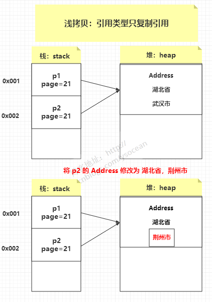　


### 6.5 深拷贝

深拷贝是将对象及值复制过来，两个对象修改其中任意的值另一个值不会改变，（例：JSON.parse() 和 JSON.stringify()，但是此方法无法复制函数类型）。 

创建一个新对象：

- 然后将当前对象的非静态字段复制到该新对象
- 无论该字段是值类型的还是引用类型，都复制独立的一份。

当你修改其中一个对象的任何内容时，都不会影响另一个对象的内容。

　　

那么该如何实现深拷贝呢？**Object 类提供的 clone 是只能实现 浅拷贝的。**


### 6.6 如何实现深拷贝

##### 6.6.1 重写clone() 方法

让每个引用类型属性内部都重写clone() 方法

既然引用类型不能实现深拷贝，那么我们将每个引用类型都拆分为基本类型，分别进行浅拷贝。

Address.class：

```java
package com.ys.test;

public class Address implements Cloneable{
    private String provices;
    private String city;
    public void setAddress(String provices,String city){
        this.provices = provices;
        this.city = city;
    }
    @Override
    public String toString() {
        return "Address [provices=" + provices + ", city=" + city + "]";
    }
    @Override
    protected Object clone() throws CloneNotSupportedException {
        return super.clone();
    }
    
}
```

Person.class 的 clone() 方法： 

```java
@Override
    protected Object clone() throws CloneNotSupportedException {
        Person p = (Person) super.clone();
        p.address = (Address) address.clone();
        return p;
    }
```

但是这种做法有个弊端，有多少个引用类型，我们就要重写多少次，如果存在很多引用类型，那么代码量显然会很大，所以这种方法不太合适。 


##### 6.6.2 利用序列化

序列化是将对象写到流中便于传输，而反序列化则是把对象从流中读取出来。这里写到流中的对象则是原始对象的一个拷贝，因为原始对象还存在 JVM 中，所以我们可以利用对象的序列化产生克隆对象，然后通过反序列化获取这个对象。

　　注意每个需要序列化的类都要实现 Serializable 接口，如果有某个属性不需要序列化，可以将其声明为 transient，即将其排除在克隆属性之外。

```java
//深度拷贝
public Object deepClone() throws Exception{
    // 序列化
    ByteArrayOutputStream bos = new ByteArrayOutputStream();
    ObjectOutputStream oos = new ObjectOutputStream(bos);

    oos.writeObject(this);

    // 反序列化
    ByteArrayInputStream bis = new ByteArrayInputStream(bos.toByteArray());
    ObjectInputStream ois = new ObjectInputStream(bis);

    return ois.readObject();
}
```

因为序列化产生的是两个完全独立的对象，所有无论嵌套多少个引用类型，序列化都是能实现深拷贝的。 


# 9 IO流

## 9.1 种类 

* 按功能来分：输入流（input）、输出流（output）。
  * 输入流是指程序从数据源中读取数据。只进行读操作； 
  * 输出流是指将数据从程序中写到指定的文件中；
* 按类型来分：字节流 和 字符流。

字节流：InputStream/OutputStream 是字节流的抽象类，这两个抽象类又派生了若干子类，不同的子类分别处理不同的操作类型。具体子类如下所示：

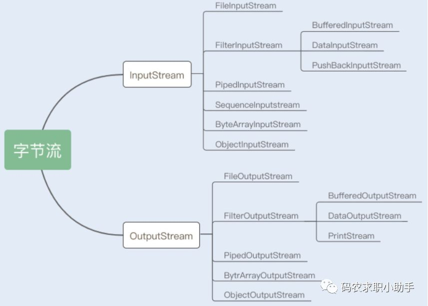

字符流：Reader/Writer 是字符的抽象类，这两个抽象类也派生了若干子类，不同的子类分别处理不同的操作类型。

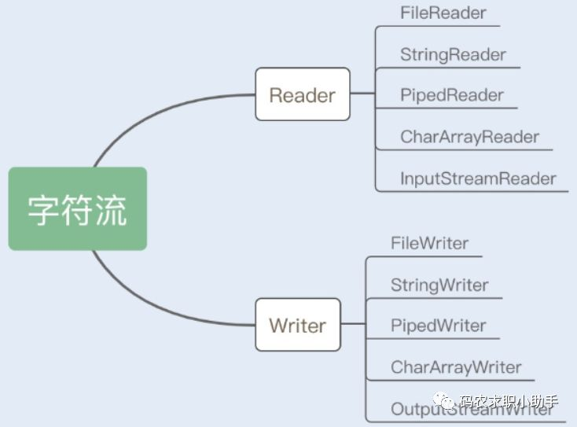


**字节流和字符流有什么区别？**

字节流按 8 位传输，以字节为单位输入输出数据，字符流按 16 位传输，以字符为单位输入输出数据。（中文对应的字节数是两个，在UTF-8码表中是3个字节） 

但是不管文件读写还是网络发送接收，信息的最小存储单元都是字节。

> 字节流可以处理所有类型数据，如：图片，MP3，AVI视频文件，而字符流只能处理字符数据。
>
> 只要是处理纯文本数据，就要优先考虑使用字符流，除此之外都用字节流。 


处理流类型：
 1、缓冲流（BufferedInPutStream/BufferedOutPutStream和BufferedWriter/BufferedReader）他可以提高对流的操作效率。

```java
 //写入缓冲区对象：   
BufferedWriter bufw=new BufferedWriter(new FileWriter("buf.txt"));
//读取缓冲区对象：    
BufferedReader bufr=new BufferedReader(new FileReader("buf.txt"));
```

该类型的流有一个特有的方法：readLine()；一次读一行，到行标记时，将行标记之前的字符数据作为字符串返回，当读到末尾时，返回null，其原理还是与缓冲区关联的流对象的read方法，只不过每一次读取到一个字符，先不进行具体操作，先进行临时储存，当读取到回车标记时，将临时容器中储存的数据一次性返回。


2、转换流（InputStreamReader/OutputStreamWriter）
      该类型时字节流和字符流之间的桥梁，该流对象中可以对读取到的字节数据进行指定编码的编码转换。
      构造函数主要有：    

```java
InputStreamReader(InputStream);        //通过构造函数初始化，使用的是本系统默认的编码表GBK。
InputStreamWriter(InputStream,String charSet);   //通过该构造函数初始化，可以指定编码表。
OutputStreamWriter(OutputStream);      //通过该构造函数初始化，使用的是本系统默认的编码表GBK。
OutputStreamwriter(OutputStream,String charSet);   //通过该构造函数初始化，可以指定编码表。

InputStreamReader isr=new InputStreamReader(new FileInputStream("a.txt"),utf-8);
```

 

3、数据流（DataInputStream/DataOutputStream）
该数据流可以方便地对一些基本类型数据进行直接的存储和读取，不需要再进一步进行转换，通常只要操作基本数据类型的数据，就需要通过DataStream进行包装。
构造方法：        

`DataInputStreamReader（InputStream）；`
`DataInputStreamWriter（OutputStream）`

方法举例： 

```java
 int readInt()；//一次读取四个字节，并将其转成int值
writeInt(int)；//一次写入四个字节，注意和write(int)不同，write(int)只将该整数的最低一个8位写入，剩余三个8为丢失
     
hort readShort();
writeShort(short);
 String readUTF();//按照utf-8修改版读取字符，注意，它只能读writeUTF()写入的字符数据。
writeUTF(String);//按照utf-8修改版将字符数据进行存储，只能通过readUTF读取。
```

 

4、打印流（PrintStream/PrintWriter）

- PrintStream是一个字节打印流，System.out对应的类型就是PrintStream，它的构造函数可以接受三种数据类型的值：1.字符串路径。2.File对象 3.OutputStream

-  PrintWriter是一个字符打印流，它的构造函数可以接受四种类型的值：1.字符串路径。2.File对象 3.OutputStream  4.Writer  对于1、2类型的数据，可以指定编码表，也就是字符集，对于3、4类型的数据，可以指定自动刷新，当该自动刷新为True时，只有3个方法可以用：println,printf,format。


5、对象流（ObjectInputStream/ObjectOutputStream）
该类型的流可以把类作为一个整体进行存取，主要方法有：

-  Object readObject();该方法抛出异常：ClassNotFountException。
- void writeObject(Object)：被写入的对象必须实现一个接口：Serializable，否则就会抛出：NotSerializableException

​     

## 9.2 IO模型

###  9.2.1 同步与异步

同步与异步的概念，关注的是 消息通信机制

- 同步是指发出一个请求，在没有得到结果之前该请求就不返回结果，请求返回时，也就得到结果了。

比如洗衣服，把衣服放在洗衣机里，没有洗好之前我们一直看着， 直到洗好了才拿出来晾晒。

- 异步是指发出一个请求后，立刻得到了回应，但没有返回结果。这时我们可以再处理别的事情(发送其他请求)，所以这种方式需要我们通过状态主动查看是否有了结果, 或者可以设置一个回调来通知调用者。

比如洗衣服时，把衣服放到洗衣机里，我们就可以去做别的事情，过会儿来看看有没有洗好(通过状态查询)；或者我们设置洗衣机洗完后响铃来通知我们洗好了(回调通知)


### 9.2.2 阻塞与非阻塞

阻塞与非阻塞很容易和同步与异步混淆，但两者关注点是不一样的。 阻塞与非阻塞关注的是 程序在等待调用结果时的状态

- 阻塞是指请求结果返回之前，当前线程会被挂起(被阻塞)，这时线程什么也做不了
- 非阻塞是指请求结果返回之前，当前线程没有被阻塞，仍然可以做其他事情。

阻塞有个明显的特征就是线程通常是处于BLOCKED状态(BIO中的read()操作时，线程阻塞是JVM配合OS完成的，此时Java获取到线程的状态仍是RUNNABLE但它确实已经被阻塞了)

如果要拿同步来做比较的话，同步通信方式中的线程在发送请求之后等待结果这个过程中应该处于RUNNABLE状态，同步必须一步一步来完成，就像是代码必须执行完一行才能执行下一行, 所以必须等待这个请求返回之后才可进行下一个请求, 即使等待结果的时间长，也是在执行这个请求的过程中。而异步则不用等上一条执行完, 可以先执行别的代码，等请求有了结果再来获取结果。

 

### 9.2.3 四种主要的IO模型

  如下表：

|      组合方式       | 性能分析                                                     |
| :-----------------: | ------------------------------------------------------------ |
|      同步阻塞       | BIO。最常用的一种用法，使用也是最简单的，但是 I/O 性能一般很差，CPU 大部分在空闲状态。 |
|     同步非阻塞      | 提升 I/O 性能的常用手段，就是将 I/O 的阻塞改成非阻塞方式，尤其在网络 I/O 是长连接，同时传输数据也不是很多的情况下，提升性能非常有效。 这种方式通常能提升 I/O 性能，但是会增加CPU 消耗，要考虑增加的 I/O 性能能不能补偿 CPU 的消耗，也就是系统的瓶颈是在 I/O 还是在 CPU 上。 |
| 异步阻塞-IO多路复用 | 这种方式在分布式数据库中经常用到，例如在往一个分布式数据库中写一条记录，通常会有一份是同步阻塞的记录，而还有两至三份是备份记录会写到其它机器上，这些备份记录通常都是采用异步阻塞的方式写 I/O。异步阻塞对网络 I/O 能够提升效率，尤其像上面这种同时写多份相同数据的情况。 |
|     异步非阻塞      | 这种组合方式用起来比较复杂，只有在一些非常复杂的分布式情况下使用，像集群之间的消息同步机制一般用这种 I/O 组合方式。如 Cassandra 的 Gossip 通信机制就是采用异步非阻塞的方式。它适合同时要传多份相同的数据到集群中不同的机器，同时数据的传输量虽然不大，但是却非常频繁。这种网络 I/O 用这个方式性能能达到最高。 |

#### 9.2.3.1  同步阻塞IO

> eg：BIO

在linux中的Java进程中，默认情况下所有的socket都是blocking IO。在阻塞式 I/O 模型中，应用程序在从IO系统调用开始，一直到到系统调用返回，这段时间是阻塞的。返回成功后，应用进程开始处理用户空间的缓存数据。

**举个栗子，发起一个blocking socket的read读操作系统调用，流程大概是这样：**

（1）当用户线程调用了read系统调用，内核（kernel）就开始了IO的第一个阶段：准备数据。很多时候，数据在一开始还没有到达（比如，还没有收到一个完整的Socket数据包），这个时候kernel就要等待足够的数据到来。

（2）当kernel一直等到数据准备好了，它就会将数据从kernel内核缓冲区，拷贝到用户缓冲区（用户内存），然后kernel返回结果。

（3）从开始IO读的read系统调用开始，用户线程就进入阻塞状态。一直到kernel返回结果后，用户线程才解除block的状态，重新运行起来。

所以，blocking IO的特点就是在内核进行IO执行的两个阶段，用户线程都被block了。

**BIO的优点：**

程序简单，在阻塞等待数据期间，用户线程挂起。用户线程基本不会占用 CPU 资源。

**BIO的缺点：**

一般情况下，会为每个连接配套一条独立的线程，或者说一条线程维护一个连接成功的IO流的读写。在并发量小的情况下，这个没有什么问题。但是，当在高并发的场景下，需要大量的线程来维护大量的网络连接，内存、线程切换开销会非常巨大。因此，基本上，BIO模型在高并发场景下是不可用的。


#### 9.2.3.2 同步非阻塞

在linux系统下，可以通过设置socket使其变为non-blocking。

举个栗子。发起一个non-blocking socket的read读操作系统调用，流程是这个样子：

（1）在内核数据没有准备好的阶段，用户线程发起IO请求时，立即返回。用户线程需要**不断地发起IO系统调用**。

（2）内核数据到达后，用户线程发起系统调用，**用户线程阻塞**。内核开始复制数据。它就会将数据从kernel内核缓冲区，拷贝到用户缓冲区（用户内存），然后kernel返回结果。

（3）用户线程才解除block的状态，重新运行起来。经过多次的尝试，用户线程终于真正读取到数据，继续执行。

**NIO的特点：**

应用程序的线程需要不断的进行 I/O 系统调用，轮询数据是否已经准备好，如果没有准备好，继续轮询，直到完成系统调用为止。

**NIO的优点：**

每次发起的 IO 系统调用，在内核的等待数据过程中可以立即返回。用户线程不会阻塞，实时性较好。

**NIO的缺点：**

需要不断的重复发起IO系统调用，这种不断的轮询，将会不断地询问内核，这将占用大量的 CPU 时间，系统资源利用率较低。

总之，NIO模型在高并发场景下，也是不可用的。一般 Web 服务器不使用这种 IO 模型。java的实际开发中，也不会涉及这种IO模型。

**注：Java NIO（New IO） 不是IO模型中的NIO模型，而是另外的一种模型，叫做IO多路复用模型（ IO multiplexing ）。**


#### 9.2.3.3 IO多路复用模型

> eg：NIO

如何避免同步非阻塞NIO模型中轮询等待的问题呢？这就是IO多路复用模型。

IO多路复用模型，就是通过一种新的系统调用，一个进程可以监视多个文件描述符，一旦某个描述符就绪（一般是内核缓冲区可读/可写），内核kernel能够通知程序进行相应的IO系统调用。

目前支持IO多路复用的系统调用，有 select，epoll等等。select系统调用，是目前几乎在所有的操作系统上都有支持，具有良好跨平台特性。epoll是在linux 2.6内核中提出的，是select系统调用的linux增强版本。

IO多路复用模型的基本原理：

基本原理其实就是select/epoll系统调用，单个线程不断的轮询select/epoll系统调用所负责的成百上千的socket连接，当某个或者某些socket网络连接有数据到达了，就返回这些可以读写的连接。通过一次select/epoll系统调用，就查询到到可以读写的一个甚至是成百上千的网络连接。

**举个栗子。发起一个多路复用IO的的read读操作系统调用，流程是这个样子：**

在这种模式中，首先不是进行read系统调动，而是进行select/epoll系统调用。当然，这里有一个前提，需要将目标网络连接，提前注册到select/epoll的可查询socket列表中。然后，才可以开启整个的IO多路复用模型的读流程。

**举个例子：**

（1）进行select/epoll系统调用，查询可以读的连接。kernel会查询所有select的可查询socket列表，当任何一个socket中的数据准备好了，select就会返回。

**当用户进程调用了select，那么整个线程会被block（阻塞掉）。**

（2）用户线程获得了目标连接后，发起read系统调用，用户线程阻塞。内核开始复制数据。它就会将数据从kernel内核缓冲区，拷贝到用户缓冲区（用户内存），然后kernel返回结果。

（3）用户线程才解除block的状态，用户线程终于真正读取到数据，继续执行。

**多路复用IO的特点：**

建立在操作系统kernel内核能够提供的多路分离系统调用select/epoll基础之上的。多路复用IO需要用到两个系统调用（system call）， 一个select/epoll查询调用，一个是IO的读取调用。

和NIO模型相似，多路复用IO需要轮询。负责select/epoll查询调用的线程，需要不断的进行select/epoll轮询，查找出可以进行IO操作的连接。

另外，多路复用IO模型与前面的NIO模型，是有关系的。对于每一个可以查询的socket，一般都设置成为non-blocking模型。

**多路复用IO的优点：**

用select/epoll的优势在于，它可以同时处理成千上万个连接（connection）。与一条线程维护一个连接相比，I/O多路复用技术的最大优势是：系统不必创建线程，也不必维护这些线程，从而大大减小了系统的开销。

**Java的NIO（new IO）技术，使用的就是IO多路复用模型。在linux系统上，使用的是epoll系统调用。**


**多路复用IO的缺点：**

本质上，select/epoll系统调用，属于同步IO，也是阻塞IO。都需要在读写事件就绪后，自己负责进行读写，也就是说这个读写过程是阻塞的。

如何充分的解除线程的阻塞呢？那就是异步IO模型。


#### 9.2.3.4 异步IO模型

> eg：AIO

如何进一步提升效率，解除最后一点阻塞呢？这就是异步IO模型，全称asynchronous I/O，简称为AIO。

AIO的基本流程是：用户线程通过系统调用，告知kernel内核启动某个IO操作，用户线程返回。kernel内核在整个IO操作（包括数据准备、数据复制）完成后，通知用户程序，用户执行后续的业务操作。

kernel的数据准备是将数据从网络物理设备（网卡）读取到内核缓冲区；kernel的数据复制是将数据从内核缓冲区拷贝到用户程序空间的缓冲区。

**举个例子：**

（1）当用户线程调用了read系统调用，立刻就可以开始去做其它的事，用户线程不阻塞。

（2）内核（kernel）就开始了IO的第一个阶段：准备数据。当kernel一直等到数据准备好了，它就会将数据从kernel内核缓冲区，拷贝到用户缓冲区（用户内存）。

（3）kernel会给用户线程发送一个信号（signal），或者回调用户线程注册的回调接口，告诉用户线程read操作完成了。

（4）用户线程读取用户缓冲区的数据，完成后续的业务操作。

**异步IO模型的特点：**

在内核kernel的等待数据和复制数据的两个阶段，用户线程都不是block(阻塞)的。用户线程需要接受kernel的IO操作完成的事件，或者说注册IO操作完成的回调函数，到操作系统的内核。所以说，异步IO有的时候，也叫做信号驱动 IO 。

**异步IO模型缺点：**

需要完成事件的注册与传递，这里边需要底层操作系统提供大量的支持，去做大量的工作。

目前来说， Windows 系统下通过 IOCP 实现了真正的异步 I/O。但是，就目前的业界形式来说，Windows 系统，很少作为百万级以上或者说高并发应用的服务器操作系统来使用。

而在 Linux 系统下，异步IO模型在2.6版本才引入，目前并不完善。所以，这也是在 Linux 下，实现高并发网络编程时都是以 IO 复用模型模式为主。


> 小结：四种IO模型，理论上越往后，阻塞越少，效率也是最优。在这四种 I/O 模型中，前三种属于同步 I/O，因为其中真正的 I/O 操作将阻塞线程。只有最后一种，才是真正的异步 I/O 模型，可惜目前Linux 操作系统尚欠完善。  


## 9.3 Java IO读写原理

[博客](https://www.cnblogs.com/crazymakercircle/p/10225159.html)

Java中的IO操作是JVM配合操作系统来完成的。对于一个IO的读操作，数据会先被拷贝到操作系统内核的缓冲区中，然后从操作系统内核的缓冲区拷贝到应用程序的地址空间。所以整个过程可分为两个阶段：

1. 等待I/O数据准备好，这取决于IO目标返回数据的速度, 如网络IO时看网速和数据本身的大小。
2. 数据从内核缓冲区拷贝到进程内。

根据这两个阶段，产生了常见的几种不同的IO模型：BIO， NIO， IO多路复用和AIO。


### 9.3.1 内核缓冲与进程缓冲区

缓冲区的目的，是为了减少频繁的系统IO调用。大家都知道，系统调用需要保存之前的进程数据和状态等信息，而结束调用之后回来还需要恢复之前的信息，为了减少这种损耗时间、也损耗性能的系统调用，于是出现了缓冲区。

有了缓冲区，操作系统使用read函数把数据从内核缓冲区复制到进程缓冲区，write把数据从进程缓冲区复制到内核缓冲区中。等待缓冲区达到一定数量的时候，再进行IO的调用，提升性能。至于什么时候读取和存储则由内核来决定，用户程序不需要关心。

在linux系统中，系统内核也有个缓冲区叫做内核缓冲区。每个进程有自己独立的缓冲区，叫做进程缓冲区。

所以，用户程序的IO读写程序，大多数情况下，并没有进行实际的IO操作，而是在读写自己的进程缓冲区。


### 9.3.2  java IO读写的底层流程

用户程序进行IO的读写，基本上会用到系统调用read&write，read把数据从内核缓冲区复制到进程缓冲区，write把数据从进程缓冲区复制到内核缓冲区。 

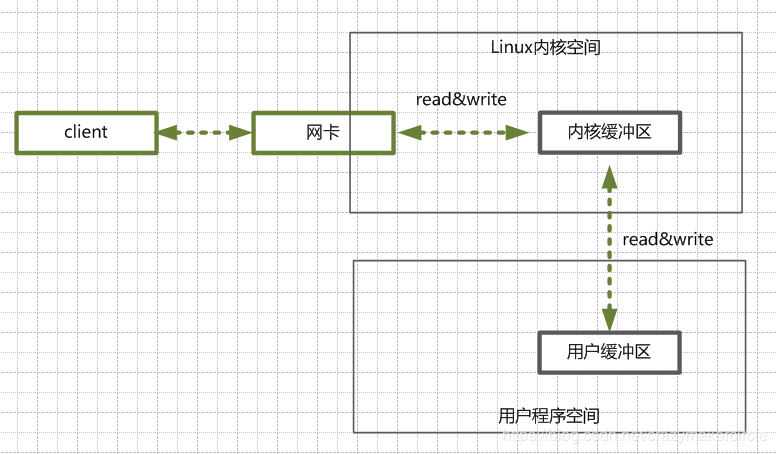

首先看看一个典型Java 服务端处理网络请求的典型过程：

（1）客户端请求

Linux通过网卡，读取客户端的请求数据，将数据读取到内核缓冲区。

（2）获取请求数据

服务器从内核缓冲区读取数据到Java进程缓冲区。

（1）服务器端业务处理

Java服务端在自己的用户空间中，处理客户端的请求。

（2）服务器端返回数据

Java服务端已构建好的响应，从用户缓冲区写入系统缓冲区。

（3）发送给客户端

Linux内核通过网络 I/O ，将内核缓冲区中的数据，写入网卡，网卡通过底层的通讯协议，会将数据发送给目标客户端。


## 9.4 BIO & NIO & AIO

[博客](https://snailclimb.gitee.io/javaguide/#/docs/java/BIO-NIO-AIO)

### 9.4.1 BIO

BIO 就是传统的 [java.io](http://java.io) 包，它是基于流模型实现的，交互的方式是同步、阻塞方式，也就是说在读入输入流或者输出流时，在读写动作完成之前，线程会一直阻塞在那里，它们之间的调用时可靠的线性顺序。它的有点就是代码比较简单、直观；缺点就是 IO 的效率和扩展性很低，容易成为应用性能瓶颈。 

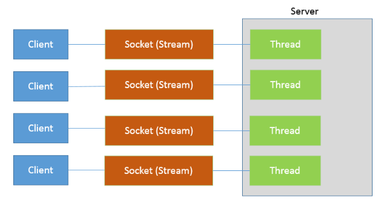


程序发送请求给内核，然后由内核去进行通信，在内核准备好数据之前这个线程是被挂起的，所以在两个阶段程序都处于挂起状态。

- BIO的特点就是在IO执行的两个阶段都被block了

  

**流程：**

（1）当用户线程调用了read系统调用，内核（kernel）就开始了IO的第一个阶段：准备数据。此阶段阻塞。

（2）当所有需要的数据都到达了kernel内核缓冲区，它就会将数据从kernel内核缓冲区，拷贝到用户缓冲区（用户内存），然后kernel返回结果。此阶段阻塞。

（3）一直到kernel返回结果后，用户线程才解除block的状态。

所以，blocking IO的特点就是在内核进行IO执行的两个阶段，用户线程都被block了。


如果要让 **BIO 通信模型** 能够同时处理多个客户端请求，就必须使用多线程（主要原因是`socket.accept()`、`socket.read()`、`socket.write()` 涉及的三个主要函数都是同步阻塞的）。这就是典型的 **一请求一应答通信模型** 。不过可以通过 **线程池机制** 改善，使用`FixedThreadPool` 可以有效的控制了线程的最大数量，保证了系统有限的资源的控制。

但是很明显，无法用于百万并发量的情况。


### 9.4.2 NIO(同步非阻塞)

[博客](https://blog.csdn.net/a953713428/article/details/64907250)

>使用IO多路复用模型

```
NIO 是 Java 1.4 引入的 java.nio 包，提供了 Channel、Selector、Buffer 等新的抽象，可以构建多路复用的、同步非阻塞 IO 程序，同时提供了更接近操作系统底层高性能的数据操作方式。

NIO 是利用了单线程轮询事件的机制，通过高效地定位就绪的 Channel，来决定做什么，仅仅 select 阶段是阻塞的，可以有效避免大量客户端连接时，频繁线程切换带来的问题，应用的扩展能力有了非常大的提高。

```

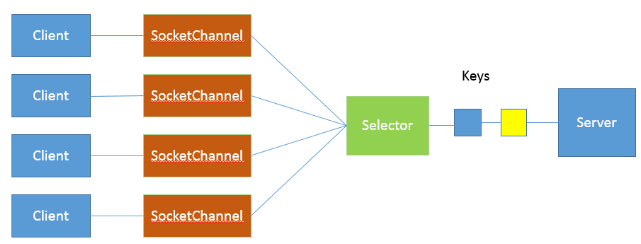

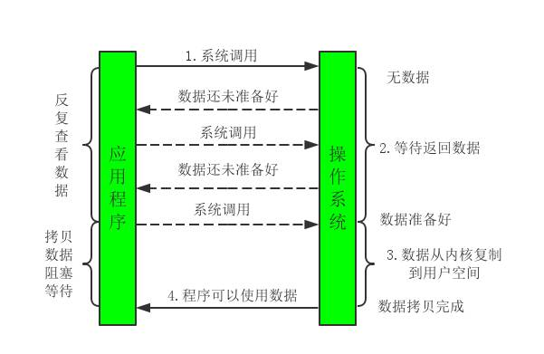

与BIO的明显区别是，发起第一次请求后，线程并没有被阻塞，它反复检查数据是否准备好，把原来大块不能用的阻塞时间分成了许多“小阻塞”(检查)，所以进程不断有机会被执行。这个检查有没有准备好数据的过程有点类似于“轮询”。

- NIO的特点就是程序需要不断的主动询问内核数据是否准备好。第一个阶段非阻塞，第二个阶段阻塞


**流程：**

（1）进行select/epoll系统调用，kernel会查询所有select的可查询socket列表，当任何一个socket中的数据准备好了，select就会返回。（注意：socket中的数据准备好的含义是，已经将请求的数据全部读取到了内核缓冲区中，也就是所谓的NIO流不阻塞。）

（2）用户线程获得了目标连接后，发起read系统调用，用户线程阻塞。内核开始复制数据到用户缓冲区（用户内存）。然后kernel返回结果。

（3）用户线程才解除block的状态，用户线程终于真正读取到数据，继续执行。


#### 9.4.2.1 核心组件

NIO 包含下面几个核心的组件：

- Channel(通道)
- Buffer(缓冲区)
- Selector(选择器)


**1.Buffer(缓冲区**)

[缓冲区结构](https://www.jianshu.com/p/12c81abb5387)

**IO 面向流(Stream oriented)，而 NIO 面向缓冲区(Buffer oriented)。**

在NIO厍中，所有数据都是用缓冲区处理的。在读取数据时，它是直接读到缓冲区中的; 在写入数据时，写入到缓冲区中。任何时候访问NIO中的数据，都是通过缓冲区进行操作。

底层是数组。


**2.Channel (通道）**

NIO 通过Channel（通道） 进行读写。

**通常来说NIO中的所有IO都是从 Channel（通道） 开始的。**

- **从通道进行数据读取** ：创建一个缓冲区，然后请求通道读取数据。
- **从通道进行数据写入** ：创建一个缓冲区，填充数据，并要求通道写入数据。

**数据读取和写入操作图示：**


**Java NIO Channel通道和流非常相似，主要有以下几点区别：**

- 通道可以读也可以写，流一般来说是单向的（只能读或者写，所以之前我们用流进行IO操作的时候需要分别创建一个输入流和一个输出流）。
- 通道可以异步读写。
- 通道总是基于缓冲区Buffer来读写。

**Java NIO中最重要的几个Channel的实现：**

- **FileChannel：** 用于文件的数据读写 
- **DatagramChannel：** 用于UDP的数据读写
- **SocketChannel：** 用于TCP的数据读写，一般是客户端实现
- **ServerSocketChannel:** 允许我们监听TCP链接请求，每个请求会创建会一个SocketChannel，一般是服务器实现
- '


**3.Selector (选择器）**

NIO有选择器，而IO没有。

Selector允许单线程处理多个 Channel。线程之间的切换对于操作系统来说是昂贵的。 因此，为了提高系统效率选择器是有用的。

如果你的应用打开了多个连接（通道），但每个连接的流量都很低，使用Selector就会很方便。例如，在一个聊天服务器中。

要使用Selector，得向Selector注册Channel，然后调用它的select()方法。这个方法会一直阻塞到某个注册的通道有事件就绪。一旦这个方法返回，线程就可以处理这些事件，事件的例子有如新连接进来，数据接收等。


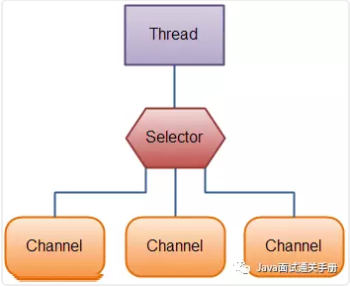


### 9.4.3 **IO多路复用** 

IO多路复用(I/O Multiplexing)有select，poll，epoll等不同方式，它的优点在于单个线程可以同时处理多个网络IO。

NIO中轮询操作是用户线程进行的，如果把这个任务交给其他线程，则用户线程就不用这么费劲的查询状态了。IO多路复用调用系统级别的select或poll模型，由系统进行监控IO状态。select轮询可以监控许多socket的IO请求，当有一个socket的数据准备好时就可以返回。

- select： 注册事件由数组管理, 数组是有长度的, 32位机上限1024， 64位机上限2048。轮询查找时需要遍历数组。
- poll：把select的数组采用链表实现，因此没了最大数量的限制
- epoll方式：基于事件回调机制，回调时直接通知进程，无须使用某种方式来查看状态。

**多路复用IO过程图：**

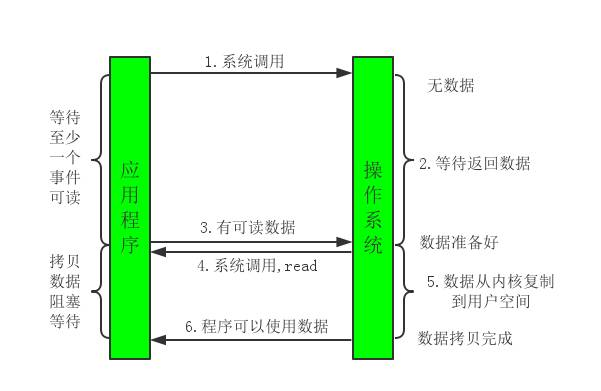

用户线程有一段时间是阻塞的，从上图来看，与NIO很像，但与NIO不一样的是，select不是等到所有数据准备好才返回，而是只要有一个准备好就返回，它的优势在于可以同时处理多个连接。若连接不是很多的话，它的效率不一定高，可能还会更差。

Java 1.4开始支持NIO(New IO)，就是采用了这种方式，在套接字上提供selector选择机制，当发起select()时会阻塞等待至少一个事件返回。

- 多路复用IO的特点是用户进程能同时等待多个IO请求，系统来监控IO状态，其中的任意一个进入读就绪状态，select函数就可以返回。


### 9.4.4 AIO(异步非阻塞)

[NIO2-AIO](https://www.ibm.com/developerworks/cn/java/j-lo-nio2/index.html)

```
AIO即Asynchronous I/O(异步 I/O)，这是Java 1.7引入的NIO 2.0中用到的。整个过程中，用户线程发起一个系统调用之后无须等待，可以处理别的事情。由操作系统等待接收内容，接收后把数据拷贝到用户进程中，最后通知用户程序已经可以使用数据了，两个阶段都是非阻塞的。AIO整个过程如下图：
```

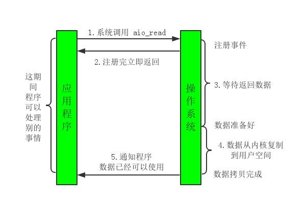


AIO属于异步模型，用户线程可以同时处理别的事情，我们怎么进一步加工处理结果呢? Java在这个模型中提供了两种方法：

- 一种是基于”回调”，我们可以实现CompletionHandler接口，在调用时把回调函数传递给对应的API即可
- 另一种是返回一个Future。处理完别的事情，可以通过isDone()可查看是否已经准备好数据，通过get()方法等待返回数据。


# 10 jdk8新特性

[博客](https://www.jianshu.com/p/0bf8fe0f153b)

## 10.1 接口的默认方法

Java 8允许我们给接口添加一个非抽象的方法实现，只需要使用 default关键字即可，这个特征又叫做扩展方法。


## 10.2 Lambda 表达式

首先看看在老版本的Java中是如何排列字符串的：

```dart
List<String> names = Arrays.asList("peter", "anna", "mike", "xenia");

Collections.sort(names, new Comparator<String>() {
    @Override
    public int compare(String a, String b) {
        return b.compareTo(a);
    }
});
```

只需要给静态方法 Collections.sort 传入一个List对象以及一个比较器来按指定顺序排列。通常做法都是创建一个匿名的比较器对象然后将其传递给sort方法。

在Java 8 中你就没必要使用这种传统的匿名对象的方式了，Java 8提供了更简洁的语法，lambda表达式：


```rust
Collections.sort(names, (String a, String b) -> {
    return b.compareTo(a);
});
```

看到了吧，代码变得更段且更具有可读性，但是实际上还可以写得更短：

```rust
Collections.sort(names, (String a, String b) -> b.compareTo(a));
```

对于函数体只有一行代码的，你可以去掉大括号{}以及return关键字，但是你还可以写得更短点：

```css
Collections.sort(names, (a, b) -> b.compareTo(a));
```

Java编译器可以自动推导出参数类型，所以你可以不用再写一次类型。接下来我们看看lambda表达式还能作出什么更方便的东西来


## 10.3 函数式接口

- 只包含一个抽象方法的接口，称为函数式接口。
- 可以通过 Lambda 表达式来创建该接口的对象。

函数式接口 (Functional Interface) 就是一个有且仅有一个抽象方法，但是可以有多个非抽象方法的接口。

```tsx
@FunctionalInterface
public interface MyNumber {
     double getValue();
}

@FunctionalInterface
public interface MyNumber<T> {
     T getValue(T t);
}

//使用lambda函数式创建对象
public static void main(String[] args) {
    System.out.println(toUpperString(str->str.toUpperCase(),"abc")); //ABC
}

public static String toUpperString(MyNumber<String> mn, String str) {
    return mn.getValue(str);
}
```

在之前的java中，典型的应用场景有 org.w3c.dom.events.EventTarget 的addEventListener 第二个参数 EventListener也是函数式接口


## 10.4 stream流

[博客](https://www.jianshu.com/p/bd6c6e094d2a)

  Stream 是对集合(Collection)对象功能的增强，它专注于对集合对象进行各种非常便利、高效的聚合操作，或者大批量数据操作。通常我们需要多行代码才能完成的操作，借助于Stream流式处理可以很简单的实现。

​    Stream 不是集合元素，它不是数据结构并不保存数据，它是有关算法和计算的，它更像一个高级版本的Iterator。同时Stream提供串行和并行两种模式进行汇聚操作。比如你的Stream里面有很多数据，Stream可以开多个线程每个线程处理一部分。最后把结果汇总起来。

>适用数据源

- 集合
- 数组
- 文件
- 自定义等等


### 10.4.1 file

> Files.list()

 列出指定Path下面的所有文件。把这些文件作为Stream数据源。

```cpp
    @Test
    public void fileListStream() {
        Path path = Paths.get("D:\\job\\git\\google-guava-study\\src\\main\\resources");
        try {
            // 找到指定path下的所有的文件
            Stream<Path> stream = Files.list(path);
            // TODO: 对流对象做处理
        } catch (IOException e) {
            e.printStackTrace();
        }
    }
```


> Files.walk()

 Files.walk()方法用于遍历子文件(包括文件夹)。参数maxDepth用于指定遍历的深度。把子文件(子文件夹)作为Stream数据源。

```csharp
    @Test
    public void fileWalkStream() {
        Path path = Paths.get("D:\\job\\git\\google-guava-study\\src\\main\\resources");
        try {
            // 第二个参数用于指定遍历几层
            Stream<Path> stream = Files.walk(path, 2);
            // TODO: 对流对象做处理
        } catch (IOException e) {
            e.printStackTrace();
        }
    }
```


> Files.find()

Files.find方法用于遍历查找(过滤)子文件。参数里面会指定查询(过滤)条件。把过滤出来的子文件作为Stream的数据源。

```csharp
    @Test
    public void fileFindStream() {
        Path path = Paths.get("D:\\job\\git\\google-guava-study\\src\\main\\resources");
        try {
            // 找到指定path下的所有不是目录的文件
           Stream<Path> stream = Files.find(path, 2, (path1, basicFileAttributes) -> {
               // 过滤掉目录文件
               return !basicFileAttributes.isDirectory();
           });
            // TODO: 对流对象做处理
        } catch (IOException e) {
            e.printStackTrace();
        }
    }
```


> Files.lines()

Files.lines方法是把指定Path文件里面的每一行内容作为Stream的数据源。

```csharp
    @Test
    public void fileLineStream() {
        Path path = Paths.get("D:\\job\\git\\google-guava-study\\src\\main\\resources\\application.yml");
        try {
            // 生成一个Stream对象
            Stream<String> stream = Files.lines(path);
            // TODO: 对流对象做处理
        } catch (IOException e) {
            e.printStackTrace();
        }
    }
```


### 10.4.2 流操作符

Stream提供的流操作符


### 10.4.3 Stream流终端操作

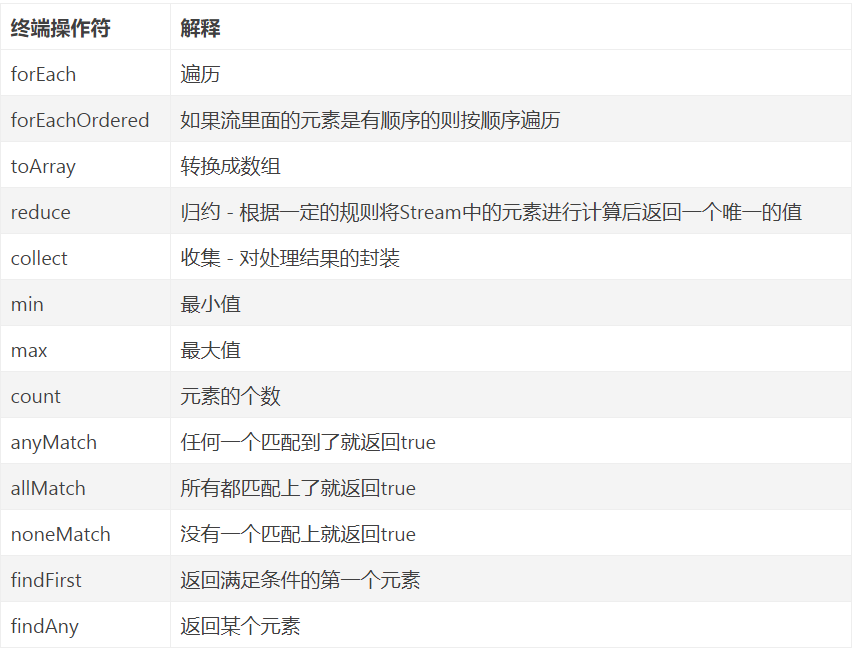

