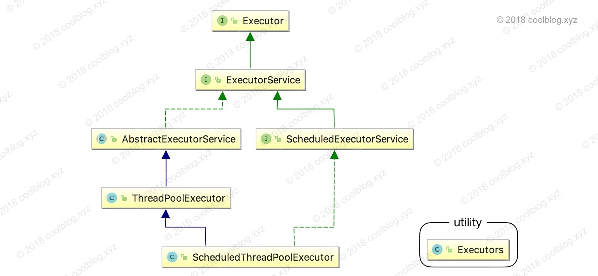
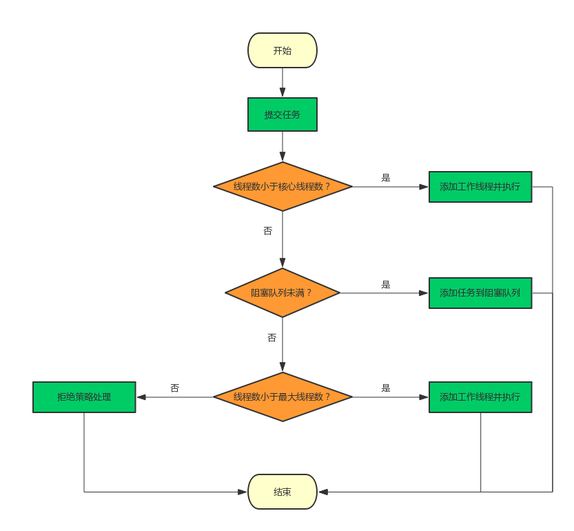

[源码分析](https://www.jianshu.com/p/d2729853c4da)

# 1 基础特性

## 1.1 线程池组成&优势 

线程池可以看错一些线程的集合，用于管理线程。

new thread和线程池的比较：

**new Thread的弊端如下** ：

- 每次new Thread新建对象性能差。
- b线程缺乏统一管理，可能无限制新建线程，相互之间竞争，及可能占用过多系统资源导致死机或oom。
- 缺乏更多功能，如定时执行、定期执行、线程中断。

**Java提供的四种线程池的好处在于：**

- 重用存在的线程，减少县城创建消亡的开销，提高性能
- 提高响应速度，当任务到达时，任务可以不需要等到线程创建就能立即执行
- 提高线程对的可管理性，可统一分配、调优和监控


**什么时候使用线程池：**

* 单个任务处理时间比较短(处理时间长就直接用创建线程就好)

* 需要处理的任务数量很大(任务数量少的话直接创建线程就好)


## 1.2 执行流程

创建函数：

```java
public ThreadPoolExecutor(int corePoolSize,    //核心线程的数量
                          int maximumPoolSize,    //最大线程数量
                          long keepAliveTime,    //超出核心线程数量以外的线程空余存活时间
                          TimeUnit unit,    //存活时间的单位
                          BlockingQueue<Runnable> workQueue,    //保存待执行任务的队列
                          ThreadFactory threadFactory,    //创建新线程使用的工厂
                          RejectedExecutionHandler handler // 当任务无法执行时的处理器
                          ) {...}

```


1.线程池刚创建时，里面没有一个线程。任务队列是作为参数传进来的。不过，就算队列里面有任务，线程池也不会马上执行它们。 

2.当调用 **execute() 方法**添加一个任务时，线程池会做如下判断： 

- 如果正在运行的线程数量小于 corePoolSize，那么马上创建线程运行这个任务； 
- 如果正在运行的线程数量大于或等于 corePoolSize，那么将这个任务放入队列； 
- 如果这时候队列满了，而且正在运行的线程数量小于 maximumPoolSize，那么还是要创建非核心线程立刻运行这个任务； 
- 如果队列满了，而且正在运行的线程数量大于或等于 maximumPoolSize，那么线程池会抛出异常 RejectExecutionException。 

3.当一个线程完成任务时，它会从队列中取下一个任务来执行。 

 4.当一个线程无事可做，超过一定的时间（keepAliveTime）时，线程池会判断，如果当前运行的线程数大于 corePoolSize，那么这个线程就被停掉。所以线程池的所有任务完成后，它最终会收缩到 corePoolSize 的大小。


## 1.3 状态

关于线程池的状态，有5种：

1. RUNNING：接受新任务并且处理阻塞队列里的任务；
2. SHUTDOWN：拒绝新任务但是处理阻塞队列里的任务；
3. STOP：拒绝新任务并且抛弃阻塞队列里的任务，同时会中断正在处理的任务；
4. TIDYING：所有任务都执行完（包含阻塞队列里面任务）当前线程池活动线程为 0，将要调用 `terminated` 方法；
5. TERMINATED：终止状态，terminated方法调用完成以后的状态。

 


## 1.4 四种线程池

| 静态构造方法                             | 说明                                                         |
| ---------------------------------------- | ------------------------------------------------------------ |
| newFixedThreadPool(int nThreads)         | 创建一个定长线程池，可控制线程最大并发数，超出的线程会在队列中等待。 |
| newCachedThreadPool()                    | 构建线程数不定的线程池，线程数量随任务量变动，空闲线程存活时间超过60秒后会被回收 |
| newSingleThreadExecutor()                | 构建线程数为1的线程池，等价于 newFixedThreadPool(1) 所构造出的线程池 |
| newScheduledThreadPool(int corePoolSize) | 构建核心线程数为 corePoolSize，可执行定时任务的线程池        |
| newSingleThreadScheduledExecutor()       | 创建一个单线程化的线程池，它只会用唯一的工作线程来执行任务，保证所有任务按照指定顺序(FIFO, LIFO, 优先级)执行。,这个线程池可以在线程死后（或发生异常时）重新启动一个线程来替代原来的线程继续执行下去，等价于 newScheduledThreadPool(1) |


## 1.5 拒绝策略

1. 什么是线程策略

   等待队列也已经排满了，再也塞不下新任务了，同时线程池中的max线程也达到了，无法继续为新任务服务。这时我们就需要拒绝策略机制合理的处理这个问题。

| 实现类              | 说明                                          |
| ------------------- | --------------------------------------------- |
| AbortPolicy         | 丢弃新任务，并抛出 RejectedExecutionException |
| DiscardPolicy       | 直接丢弃新任务，不抛出异常                    |
| DiscardOldestPolicy | 丢弃队列队首的元素，并执行新任务              |
| CallerRunsPolicy    | 由调用线程执行新任务                          |


## 1.6 排队策略

当线程数量大于等于 corePoolSize，workQueue 未满时，则缓存新任务。这里要考虑使用什么类型的容器缓存新任务，通过 JDK 文档介绍，我们可知道有3中类型的容器可供使用，分别是`同步队列`，`有界队列`和`无界队列`。对于有优先级的任务，这里还可以增加`优先级队列`。以上所介绍的4中类型的队列，对应的实现类如下： 

| 实现类                | 类型       | 说明                                                         |
| --------------------- | ---------- | ------------------------------------------------------------ |
| SynchronousQueue      | 同步队列   | 该队列不存储元素，每个插入操作必须等待另一个线程调用移除操作，否则插入操作会一直阻塞 |
| ArrayBlockingQueue    | 有界队列   | 基于数组的阻塞队列，按照 FIFO 原则对元素进行排序             |
| LinkedBlockingQueue   | 无界队列   | 基于链表的阻塞队列，按照 FIFO 原则对元素进行排序             |
| PriorityBlockingQueue | 优先级队列 | 具有优先级的阻塞队列                                         |


## 1.7 生产上你如何设置合理参数

你在工作中单一的/固定数的/可变的三种创建线程池的方法，用哪个多？

**一个都不用，我们生产上只能使用自定义的！！！！**


为什么？

线程池不允许使用Executors创建，试试通过ThreadPoolExecutor的方式，规避资源耗尽风险

* FixedThreadPool和SingleThreadPool允许请求队列长度为Integer.MAX_VALUE，可能会堆积大量请求；
* CachedThreadPool和ScheduledThreadPool允许的创建线程数量为Integer.MAX_VALUE，可能会创建大量线程，导致OOM


 在工作中时如何使用线程池的：

```java
package com.jian8.juc.thread;

import java.util.concurrent.*;

/**
 * 第四种获得java多线程的方式--线程池
 */
public class MyThreadPoolDemo {
    public static void main(String[] args) {
        ExecutorService threadPool = new ThreadPoolExecutor(3, 5, 1L,
                							TimeUnit.SECONDS,
                							new LinkedBlockingDeque<>(3),
                                            Executors.defaultThreadFactory(), 
                                            new ThreadPoolExecutor.DiscardPolicy())
        try {
            for (int i = 1; i <= 10; i++) {
                threadPool.execute(() -> {
                    System.out.println(Thread.currentThread().getName() + "\t办理业务");
                });
            }
        } catch (Exception e) {
            e.printStackTrace();
        } finally {
            threadPool.shutdown();
        }
    }
}

```


### 1.7.1 合理配置线程池你是如何考虑的？

1. **CPU密集型**

   CPU密集的意思是该任务需要大量的运算，而没有阻塞，CPU一直全速运行

   CPU密集任务只有在真正多核CPU上才可能得到加速（通过多线程）

   而在单核CPU上，无论你开几个模拟的多线程该任务都不可能得到加速，因为CPU总的运算能力就那些

   CPU密集型任务配置尽可能少的线程数量：

   ==**一般公式：CPU核数+1个线程的线程池**==

2. **IO密集型**

   - 由于IO密集型任务线程并不是一直在执行任务，则应配置经可能多的线程，如CPU核数 * 2

   - IO密集型，即该任务需要大量的IO，即大量的阻塞。

     在单线程上运行IO密集型的任务会导致浪费大量的 CPU运算能力浪费在等待。

     所以在IO密集型任务中使用多线程可以大大的加速程序运行，即使在单核CPU上，这种加速主要就是利用了被浪费掉的阻塞时间。

     IO密集型时，大部分线程都阻塞，故需要多配置线程数：

     参考公式：==CPU核数/（1-阻塞系数） 阻塞系数在0.8~0.9之间==

     八核CPU：8/（1-0.9）=80


# 2 源码

[博客](https://www.jianshu.com/p/bf4a9e0b9e60)




JDK中线程池的核心实现类是ThreadPoolExecutor，先看这个类的第一个成员变量ctl，AtomicInteger这个类可以通过CAS达到无锁并发，效率比较高，这个变量有双重身份，它的高三位表示线程池的状态，低29位表示线程池中现有的线程数，用最少的变量来减少锁竞争，提高并发效率

> 看整个线程池的工作流程，有以下几个需要特别关注的并发点.

 ①: 线程池状态和工作线程数量的变更。这个由一个AtomicInteger变量 ctl来解决原子性问题。
 ②: 向工作Worker容器workers中添加新的Worker的时候。这个线程池本身已经加锁了。
 ③: 工作线程Worker从等待队列中取任务的时候。这个由工作队列本身来保证线程安全，比如LinkedBlockingQueue等。


> 源码当前先着重看一下2.1 2.2

## 2.1 execute()

> 提交任务 

1. 代码（3）判断如果当前线程池线程个数小于 corePoolSize，如上图会在 workers 里面新增一个核心线程（core 线程）执行该任务。

2. 如果当前线程池线程个数大于等于 corePoolSize 执行代码（4），如果当前线程池处于 RUNNING 状态则添加当前任务到任务队列，这里需要判断线程池状态是因为有可能线程池已经处于非 RUNNING 状态，而非 RUNNING 状态下是抛弃新任务的。

3. 如果任务添加任务队列成功，则代码（4.2）对线程池状态进行二次校验，这是因为添加任务到任务队列后，执行代码（4.2）前有可能线程池的状态已经变化了，这里进行二次校验，如果当前线程池状态不是 RUNNING 了则把任务从任务队列移除，移除后执行拒绝策略；如果二次校验通过，则执行代码（4.3）重新判断当前线程池里面是否还有线程，如果没有则新增一个线程。

4. 如果代码（4）添加任务失败，则说明任务队列满了，则执行代码（5）尝试新开启线程（如上图 thread 3 和 thread 4）来执行该任务，如果当前线程池线程个数 > `maximumPoolSize` 则执行拒绝策略。

这里要注意一下`addWorker(null, false);`，也就是创建一个线程，但并没有传入任务，因为任务已经被添加到workQueue中了，所以worker在执行的时候，会直接从workQueue中获取任务。所以，在`workerCountOf(recheck) == 0`时执行`addWorker(null, false);`也是为了保证线程池在RUNNING状态下必须要有一个线程来执行任务。

 



```java
public void execute(Runnable command) {

    //(1) 如果任务为null，则抛出NPE异常
    if (command == null)
        throw new NullPointerException();

    //（2）获取当前线程池的状态+线程个数变量的组合值
    int c = ctl.get();

    //（3）当前线程池线程个数是否小于corePoolSize,小于则开启新线程运行
    if (workerCountOf(c) < corePoolSize) {
        if (addWorker(command, true))
            return;
        c = ctl.get();
    }

    //（4）如果线程池处于RUNNING状态，则添加任务到阻塞队列
    if (isRunning(c) && workQueue.offer(command)) {

        //（4.1）二次检查
        int recheck = ctl.get();
        //（4.2）如果当前线程池状态不是RUNNING则从队列删除任务，并执行拒绝策略
        if (! isRunning(recheck) && remove(command))
            reject(command);

        //（4.3）否者如果当前线程池线程空，则添加一个线程
        else if (workerCountOf(recheck) == 0)
            addWorker(null, false);
    }
    //（5）如果队列满了，则新增线程，新增失败则执行拒绝策略
    else if (!addWorker(command, false))
        reject(command);
}
```


## 2.2 addWorker()

> 新增处理线程（worker） 
>
> addWorker方法的主要工作是在线程池中创建一个新的线程并执行，firstTask参数 用于指定新增的线程执行的第一个任务，core参数为true表示在新增线程时会判断当前活动线程数是否少于corePoolSize，false表示新增线程前需要判断当前活动线程数是否少于maximumPoolSize

主要分两部分，第一部分的双重循环目的是通过 cas 操作增加线程池线程数，第二部分主要是并发安全的把任务添加到 workers 里面，并且启动任务执行。


```java
private boolean addWorker(Runnable firstTask, boolean core) {
    retry:
    for (;;) {
        int c = ctl.get();
        int rs = runStateOf(c);

        //（6） 检查队列是否只在必要时为空
        if (rs >= SHUTDOWN &&
            ! (rs == SHUTDOWN &&
               firstTask == null &&
               ! workQueue.isEmpty()))
            return false;

        //（7）循环cas增加线程个数
        for (;;) {
            int wc = workerCountOf(c);

            //（7.1）如果线程个数超限则返回false
            if (wc >= CAPACITY ||
                wc >= (core ? corePoolSize : maximumPoolSize))
                return false;
            //（7.2）cas增加线程个数，同时只有一个线程成功
            if (compareAndIncrementWorkerCount(c))
                break retry;
            //（7.3）cas失败了，则看线程池状态是否变化了，变化则跳到外层循环重试重新获取线程池状态，否者内层循环重新cas。
            c = ctl.get();  // Re-read ctl
            if (runStateOf(c) != rs)
                continue retry;
        }
    }

    //（8）到这里说明cas成功了
    boolean workerStarted = false;
    boolean workerAdded = false;
    Worker w = null;
    try {
        //（8.1）创建worker
        final ReentrantLock mainLock = this.mainLock;
        w = new Worker(firstTask);
        final Thread t = w.thread;
        if (t != null) {

            //（8.2）加独占锁，为了workers同步，因为可能多个线程调用了线程池的execute方法。
            mainLock.lock();
            try {

                //（8.3）重新检查线程池状态，为了避免在获取锁前调用了shutdown接口
                int c = ctl.get();
                int rs = runStateOf(c);

                if (rs < SHUTDOWN ||
                    (rs == SHUTDOWN && firstTask == null)) {
                    if (t.isAlive()) // precheck that t is startable
                        throw new IllegalThreadStateException();
                    //（8.4）添加任务
                    workers.add(w);
                    int s = workers.size();
                    if (s > largestPoolSize)
                        largestPoolSize = s;
                    workerAdded = true;
                }
            } finally {
                mainLock.unlock();
            }
            //（8.5）添加成功则启动任务
            if (workerAdded) {
                t.start();
                workerStarted = true;
            }
        }
    } finally {
        if (! workerStarted)
            addWorkerFailed(w);
    }
    return workerStarted;
}
```

 

## 2.3 Worker类

**线程池中的每一个线程被封装成一个Worker对象，ThreadPool维护的其实就是一组Worker对象**，看一下Worker的定义： 

**Worker类继承了AQS，并实现了Runnable接口**，注意其中的firstTask和thread属性：firstTask用它来保存传入的任务；thread是在调用构造方法时通过ThreadFactory来创建的线程，是用来处理任务的线程。

在调用构造方法时，需要把任务传入，这里通过`getThreadFactory().newThread(this);`来新建一个线程，newThread方法传入的参数是this，因为Worker本身继承了Runnable接口，也就是一个线程，所以一个Worker对象在启动的时候会调用Worker类中的run方法。

Worker继承了AQS，使用AQS来实现独占锁的功能。为什么不使用ReentrantLock来实现呢？可以看到tryAcquire方法，它是不允许重入的，而ReentrantLock是允许重入的：

1. lock方法一旦获取了独占锁，表示当前线程正在执行任务中；
2. 如果正在执行任务，则不应该中断线程；
3. 如果该线程现在不是独占锁的状态，也就是空闲的状态，说明它没有在处理任务，这时可以对该线程进行中断；
4. 线程池在执行shutdown方法或tryTerminate方法时会调用interruptIdleWorkers方法来中断空闲的线程，interruptIdleWorkers方法会使用tryLock方法来判断线程池中的线程是否是空闲状态；
5. 之所以设置为不可重入，是因为我们不希望任务在调用像setCorePoolSize这样的线程池控制方法时重新获取锁。如果使用ReentrantLock，它是可重入的，这样如果在任务中调用了如setCorePoolSize这类线程池控制的方法，会中断正在运行的线程。

所以，Worker继承自AQS，用于判断线程是否空闲以及是否可以被中断。

此外，在构造方法中执行了`setState(-1);`，把state变量设置为-1，为什么这么做呢？是因为AQS中默认的state是0，如果刚创建了一个Worker对象，还没有执行任务时，这时就不应该被中断，看一下tryAquire方法：

```java
private final class Worker
        extends AbstractQueuedSynchronizer
        implements Runnable
{
    /**
     * This class will never be serialized, but we provide a
     * serialVersionUID to suppress a javac warning.
     */
    private static final long serialVersionUID = 6138294804551838833L;

    /** Thread this worker is running in.  Null if factory fails. */
    final Thread thread;
    /** Initial task to run.  Possibly null. */
    Runnable firstTask;
    /** Per-thread task counter */
    volatile long completedTasks;

    /**
     * Creates with given first task and thread from ThreadFactory.
     * @param firstTask the first task (null if none)
     */
    Worker(Runnable firstTask) {
        setState(-1); // inhibit interrupts until runWorker
        this.firstTask = firstTask;
        this.thread = getThreadFactory().newThread(this);
    }

    /** Delegates main run loop to outer runWorker  */
    public void run() {
        runWorker(this);
    }

    // Lock methods
    //
    // The value 0 represents the unlocked state.
    // The value 1 represents the locked state.

    protected boolean isHeldExclusively() {
        return getState() != 0;
    }

    protected boolean tryAcquire(int unused) {
        if (compareAndSetState(0, 1)) {
            setExclusiveOwnerThread(Thread.currentThread());
            return true;
        }
        return false;
    }

    protected boolean tryRelease(int unused) {
        setExclusiveOwnerThread(null);
        setState(0);
        return true;
    }

    public void lock()        { acquire(1); }
    public boolean tryLock()  { return tryAcquire(1); }
    public void unlock()      { release(1); }
    public boolean isLocked() { return isHeldExclusively(); }

    void interruptIfStarted() {
        Thread t;
        if (getState() >= 0 && (t = thread) != null && !t.isInterrupted()) {
            try {
                t.interrupt();
            } catch (SecurityException ignore) {
            }
        }
    }
}
```


## 2.4 runWorker方法

在Worker类中的run方法调用了runWorker方法来执行任务，runWorker方法的代码如下： 

```java
  final void runWorker(Worker w) {
        //在添加worker的流程中执行thread.start()之后真实执行的方法
        Thread wt = Thread.currentThread();
        Runnable task = w.firstTask; // 获取当前worker携带的任务
        w.firstTask = null;
        /**
         * 直接unlock？？？在unlock之前一定要lock吗？从这里我们可以看出不一定
         */
        w.unlock(); // 修改state为0，将占用锁的线程设为null（第一次执行之前没有线程占用）
        boolean completedAbruptly = true;
        try {
            // 自旋。先执行自己携带的任务，然后从阻塞队列中获取一个任务直到无法获取任务
            while (task != null || (task = getTask()) != null) {
                // 将state修改为1，设置占有锁的线程为自己
                w.lock();
                /**
                 * check线程池的状态，如果状态为stop以上(stop以上不执行任务)，则中断当前线程
                 * 如果当前线程已被中断（其他线程并发的调用线程池的shutdown()或shutdownNow()方法），则check线程池状态是否为stop以上
                 * 最后如果当前线程未被中断则中断当前线程（不可能！笔者还未想到此种场景）
                 */
                if ((runStateAtLeast(ctl.get(), STOP) || (Thread.interrupted() && runStateAtLeast(ctl.get(), STOP))) && !wt.isInterrupted())
                    wt.interrupt();
                try {
                    beforeExecute(wt, task);// 空方法，留给子类实现
                    Throwable thrown = null;
                    try {
                        task.run(); //执行外部提交的任务，通过try-catch来保证异常不会影响线程池本身的功能
                    } catch (RuntimeException x) {
                        thrown = x; throw x;
                    } catch (Error x) {
                        thrown = x; throw x;
                    } catch (Throwable x) {
                        thrown = x; throw new Error(x);
                    } finally {
                        afterExecute(task, thrown);// 空方法，留给子类实现
                    }
                } finally {
                    task = null;
                    w.completedTasks++; //已完成任务数量统计
                    w.unlock();
                }
            }
            // 如果执行到这里代表非核心线程在keepAliveTime内无法获取任务而退出
            completedAbruptly = false;
        } finally {
            /**
             * 从上面可以看出如果实际业务(外部提交的Runnable)出现异常会导致当前worker终止
             * completedAbruptly 此时为true意味着worker是突然完成，不是正常退出
             */
            processWorkerExit(w, completedAbruptly);// 执行worker退出收尾工作
        }
    }

```


## 2.5 getTask()

> 获取任务 

```java
  private Runnable getTask() {
        boolean timedOut = false; // Did the last poll() time out?
        // 自旋获取任务(因为是多线程环境)
        for (;;) {
            int c = ctl.get();// 读取最新的clt
            int rs = runStateOf(c);
            /**
             * 1、线程池状态为shutdown并且任务队列为空
             * 2、线程池状态为stop状态以上
             * 这2种情况直接减少worker数量，并且返回null从而保证外部获取任务的worker进行正常退出
             */
            if (rs >= SHUTDOWN && (rs >= STOP || workQueue.isEmpty())) {
                decrementWorkerCount();
                return null;
            }
            int wc = workerCountOf(c);
            /**
             * 1、允许核心线程退出
             * 2、当前的线程数量超过核心线程数
             * 这时获取任务的机制切换为poll(keepAliveTime)
             */
            boolean timed = allowCoreThreadTimeOut || wc > corePoolSize;
            /**
             * 1、线程数大于maximumPoolSize(什么时候会出现这种情况？ 当maximumPoolSize初始设置为0或者其他线程通过set方法对其进行修改)
             * 2、线程数未超过maximumPoolSize但是timed为true(允许核心线程退出或者线程数量超过核心线程)
             * 并且上次获取任务超时(没获取到任务,我们推测本次依旧会超时)
             * 3、在满足条件1或者条件2的情况下进行check：运行线程数大于1或者任务队列没有任务
             */
            if ((wc > maximumPoolSize || (timed && timedOut))
                && (wc > 1 || workQueue.isEmpty())) {
                if (compareAndDecrementWorkerCount(c)) // CAS进行worker数量-1，成功则返回null进行worker退出流程，失败则继续自旋
                    return null;
                continue;
            }
            try {
                // 如果允许超时退出，则调用poll(keepAliveTime)获取任务，否则则通过tack()一直阻塞等待直到有任务提交到队列
                Runnable r = timed ? workQueue.poll(keepAliveTime, TimeUnit.NANOSECONDS) : workQueue.take();
                if (r != null)
                    return r;
                timedOut = true;// 当等待超过keepAliveTime时间未获取到任务时，标记为true。在下次自旋时会进入销毁流程
            } catch (InterruptedException retry) {
                // 什么时候会抛出异常？当调用shutdown或者shutdownNow方法触发worker内的Thread调用interrupt方法时会执行到此处
                timedOut = false;
            }
        }
    }

```


## 2.6 shutdown()

> 关闭线程池 

```java
  public void shutdown() {
        final ReentrantLock mainLock = this.mainLock;
        // 利用排它锁进行上锁，保证只有一个线程执行关闭流程
        mainLock.lock();
        try {
            // 安全检查
            checkShutdownAccess();
            // 内部通过自旋+CAS修改线程池状态为shutdown
            advanceRunState(SHUTDOWN);
            // 遍历所有的worker，进行线程中断通知
            interruptIdleWorkers();
            // 钩子函数
            onShutdown(); // hook for ScheduledThreadPoolExecutor
        } finally {
            mainLock.unlock();
        }
        // 进行最后的整理工作
        tryTerminate();
    }

  public List<Runnable> shutdownNow() {
        List<Runnable> tasks;
        //...和shutdown类似，将状态修改为stop并返回在任务队列排队的任务 ...
        return tasks;
    }

```

