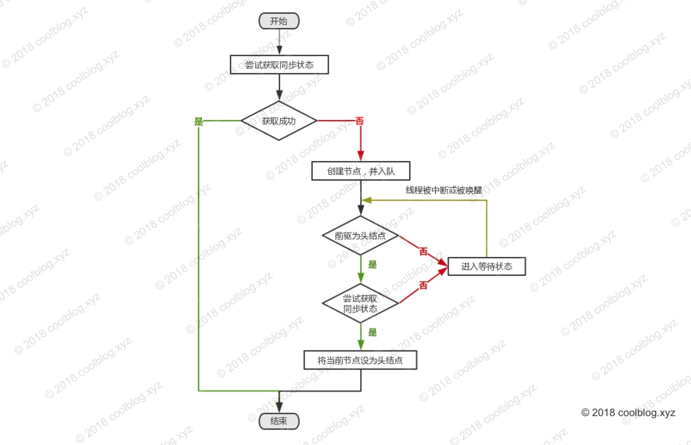

[田小波源码大佬博客](http://www.tianxiaobo.com/2018/05/01/AbstractQueuedSynchronizer-%E5%8E%9F%E7%90%86%E5%88%86%E6%9E%90-%E7%8B%AC%E5%8D%A0-%E5%85%B1%E4%BA%AB%E6%A8%A1%E5%BC%8F/#2%E5%8E%9F%E7%90%86%E6%A6%82%E8%BF%B0)

> AQS以模板方法模式在内部定义了获取和释放同步状态的模板方法,并留下钩子函数供子类继承时进行扩展,由子类决定在获取和释放同步状态时的细节，向实现者屏蔽了线程阻塞和唤醒的细节。 
>
> 采用设计模式：模板模式

# 1 AQS的核心思想

AQS就是基于CLH队列，用volatile修饰共享变量state，线程通过CAS去改变状态符，成功则获取锁成功，失败的线程则会被封装成一个节点置于队尾，入队的线程将会通过自旋的方式获取同步状态，若在有限次的尝试后，仍未获取成功，线程则会被阻塞住。 


当头结点释放同步状态后，且后继节点对应的线程被阻塞，此时头结点线程将会去唤醒后继节点线程。后继节点线程恢复运行并获取同步状态后，会将旧的头结点从队列中移除，并将自己设为头结点。大致示意图如下：


> state

**state既表示资源，又表示重入锁。当state==0时，表示资源空闲可以获得。当state>0时，表示某线程持有的重入锁个数。**


# 2 重要方法

第一组：子类必须通过以下三个方法修改获取锁的状态值state。

| 方法                                               | 说明                  |
| -------------------------------------------------- | --------------------- |
| int getState()                                     | 获取同步状态          |
| void setState()                                    | 设置同步状态          |
| boolean compareAndSetState(int expect, int update) | 通过 CAS 设置同步状态 |

第二组：需要由子类同步组件覆盖的方法

| 方法                              | 说明                       |
| --------------------------------- | -------------------------- |
| boolean tryAcquire(int arg)       | 独占式获取同步状态         |
| boolean tryRelease(int arg)       | 独占式释放同步状态         |
| int tryAcquireShared(int arg)     | 共享式获取同步状态         |
| boolean tryReleaseShared(int arg) | 共享式私房同步状态         |
| boolean isHeldExclusively()       | 检测当前线程是否获取独占锁 |

 第三组：是一组模板方法，同步组件可直接调用。

| 方法                                              | 说明                                                         |
| ------------------------------------------------- | ------------------------------------------------------------ |
| void acquire(int arg)                             | 独占式获取同步状态，该方法将会调用 tryAcquire 尝试获取同步状态。获取成功则返回，获取失败，线程进入同步队列等待。 |
| void acquireInterruptibly(int arg)                | 响应中断版的 acquire                                         |
| boolean tryAcquireNanos(int arg,long nanos)       | 超时+响应中断版的 acquire                                    |
| void acquireShared(int arg)                       | 共享式获取同步状态，同一时刻可能会有多个线程获得同步状态。比如读写锁的读锁就是就是调用这个方法获取同步状态的。 |
| void acquireSharedInterruptibly(int arg)          | 响应中断版的 acquireShared                                   |
| boolean tryAcquireSharedNanos(int arg,long nanos) | 超时+响应中断版的 acquireShared                              |
| boolean release(int arg)                          | 独占式释放同步状态                                           |
| boolean releaseShared(int arg)                    | 共享式释放同步状态                                           |

> AQS支持的锁的类别

 AQS支持独占锁和共享锁两种。

- 独占锁：锁在一个时间点只能被一个线程占有。根据锁的获取机制，又分为“公平锁”和“非公平锁”。ReentrantLock和ReentrantReadWriteLock.Writelock
- 共享锁：JUC包中ReentrantReadWriteLock.ReadLock，CyclicBarrier，CountDownLatch和Semaphore

 


# 3:tada: 源码分析

## 3.1 Unsafe类

> 通过static引入的native类型的Unsafe.getUnsafe()类

```java
   
    //native方法，本来应该搁在最后的…搁这儿方便看
    private static final Unsafe unsafe = Unsafe.getUnsafe();
    //都是内存位置
    private static final long stateOffset;
    private static final long headOffset;
    private static final long tailOffset;
    private static final long waitStatusOffset;
    private static final long nextOffset;

	//准备阶段，静态变量赋予零值
	//初始化阶段，静态代码块执行（包括对静态变量的赋值）
    static {
        try {
            stateOffset = unsafe.objectFieldOffset
                (AbstractQueuedSynchronizer.class.getDeclaredField("state"));
            headOffset = unsafe.objectFieldOffset
                (AbstractQueuedSynchronizer.class.getDeclaredField("head"));
            tailOffset = unsafe.objectFieldOffset
                (AbstractQueuedSynchronizer.class.getDeclaredField("tail"));
            waitStatusOffset = unsafe.objectFieldOffset
                (Node.class.getDeclaredField("waitStatus"));
            nextOffset = unsafe.objectFieldOffset
                (Node.class.getDeclaredField("next"));

        } catch (Exception ex) { throw new Error(ex); }
    }

    /**
     * CAS head field. Used only by enq.
     */
    private final boolean compareAndSetHead(Node update) {
        return unsafe.compareAndSwapObject(this, headOffset, null, update);
    }

    /**
     * CAS tail field. Used only by enq.
     */
    private final boolean compareAndSetTail(Node expect, Node update) {
        return unsafe.compareAndSwapObject(this, tailOffset, expect, update);
    }

    /**
     * CAS waitStatus field of a node.
     */
    private static final boolean compareAndSetWaitStatus(Node node,
                                                         int expect,
                                                         int update) {
        return unsafe.compareAndSwapInt(node, waitStatusOffset,
                                        expect, update);
    }

    /**
     * CAS next field of a node.
     */
    private static final boolean compareAndSetNext(Node node,
                                                   Node expect,
                                                   Node update) {
        return unsafe.compareAndSwapObject(node, nextOffset, expect, update);
    }
    
    

    private static final long serialVersionUID = 7373984972572414691L;


    protected AbstractQueuedSynchronizer() {
    }
    
```


## 3.2 Node类

在并发的情况下，AQS 会将未获取同步状态的线程将会封装成节点，并将其放入同步队列尾部。同步队列中的节点除了要保存线程，还要保存等待状态。不管是独占式还是共享式，在获取状态失败时都会用到节点类。 

```java
static final class Node {

    /** 共享类型节点，标记节点在共享模式下等待 */
    static final Node SHARED = new Node();
    
    /** 独占类型节点，标记节点在独占模式下等待 */
    static final Node EXCLUSIVE = null;

    /** 等待状态 - 取消 */
    static final int CANCELLED =  1;
    
    /** 
     * 等待状态 - 通知。某个节点是处于该状态，当该节点释放同步状态后，
     * 会通知后继节点线程，使之可以恢复运行 
     */
    static final int SIGNAL    = -1;
    
    /** 等待状态 - 条件等待。表明节点等待在 Condition 上 */
    static final int CONDITION = -2;
    
    /**
     * 等待状态 - 传播。表示无条件向后传播唤醒动作，详细分析请看第五章
     */
    static final int PROPAGATE = -3;

    /**
     * 等待状态，取值如下：
     *   SIGNAL,
     *   CANCELLED,
     *   CONDITION,
     *   PROPAGATE,
     *   0
     * 
     * 初始情况下，waitStatus = 0
     */
    volatile int waitStatus;

    /**
     * 前驱节点
     */
    volatile Node prev;

    /**
     * 后继节点
     */
    volatile Node next;

    /**
     * 对应的线程
     */
    volatile Thread thread;

    /**
     * 下一个等待节点，用在 ConditionObject 中
     */
    Node nextWaiter;

    /**
     * 判断节点是否是共享节点
     */
    final boolean isShared() {
        return nextWaiter == SHARED;
    }

    /**
     * 获取前驱节点
     */
    final Node predecessor() throws NullPointerException {
        Node p = prev;
        if (p == null)
            throw new NullPointerException();
        else
            return p;
    }

    Node() {    // Used to establish initial head or SHARED marker
    }

    /** addWaiter 方法会调用该构造方法 */
    Node(Thread thread, Node mode) {
        this.nextWaiter = mode;
        this.thread = thread;
    }

    /** Condition 中会用到此构造方法 */
    Node(Thread thread, int waitStatus) { // Used by Condition
        this.waitStatus = waitStatus;
        this.thread = thread;
    }
}
```


## 3.3 独占模式分析

### 3.3.1 获取同步状态acquire()

独占式获取同步状态时通过 acquire 进行的

> 流程

1. 调用 tryAcquire 方法尝试获取同步状态
2. 获取成功，直接返回
3. 获取失败，将线程封装到节点中，并将节点入队
4. 入队节点在 acquireQueued 方法中自旋获取同步状态
5. 若节点的前驱节点是头节点，则再次调用 tryAcquire 尝试获取同步状态
6. 获取成功，当前节点将自己设为头节点并返回
7. 获取失败，可能再次尝试，也可能会被阻塞。这里简单认为会被阻塞。



```java
/**
 * 该方法将会调用子类复写的 tryAcquire 方法获取同步状态，
 * - 获取成功：直接返回
 * - 获取失败：将线程封装在节点中，并将节点置于同步队列尾部，
 *     通过自旋尝试获取同步状态。如果在有限次内仍无法获取同步状态，
 *     该线程将会被 LockSupport.park 方法阻塞住，直到被前驱节点唤醒
 */
public final void acquire(int arg) {
    if (!tryAcquire(arg) &&
        acquireQueued(addWaiter(Node.EXCLUSIVE), arg)) //addWaiter会返回添加成功的尾节点
        selfInterrupt();
}


/** 向同步队列尾部添加一个节点 */
private Node addWaiter(Node mode) {
    Node node = new Node(Thread.currentThread(), mode);
    // tail!=null时，尝试以快速方式将节点添加到队列尾部
    Node pred = tail;
    if (pred != null) {
        node.prev = pred;
        if (compareAndSetTail(pred, node)) {
            pred.next = node;
            return node;
        }
    }
    
    // 当tail == null,那么无法使用快速插入节点，调用 enq 方法，不停的尝试插入节点
    enq(node);
    return node;
}

/**
 * 通过 CAS + 自旋的方式插入节点到队尾
 */
private Node enq(final Node node) {
    for (;;) {
        Node t = tail;
        if (t == null) { // Must initialize
            // 设置头结点，初始情况下，头结点是一个空节点
            if (compareAndSetHead(new Node()))
                tail = head;
        } else {
            /*
             * 将节点插入队列尾部。这里是先将新节点的前驱设为尾节点，之后在尝试将新节点设为尾节
             * 点，最后再将原尾节点的后继节点指向新的尾节点。除了这种方式，我们还先设置尾节点，
             * 之后再设置前驱和后继，即：
             * 
             *    if (compareAndSetTail(t, node)) {
             *        node.prev = t;
             *        t.next = node;
             *    }
             *    
             * 但但如果是这样做，会导致一个问题，即短时内，队列结构会遭到破坏。考虑这种情况，
             * 某个线程在调用 compareAndSetTail(t, node)成功后，该线程被 CPU 切换了。此时
             * 设置前驱和后继的代码还没带的及执行，但尾节点指针却设置成功，导致队列结构短时内会
             * 出现如下情况：
             *
             *      +------+  prev +-----+       +-----+
             * head |      | <---- |     |       |     |  tail
             *      |      | ----> |     |       |     |
             *      +------+ next  +-----+       +-----+
             *
             * tail 节点完全脱离了队列，这样导致一些队列遍历代码出错。如果先设置
             * 前驱，在设置尾节点。及时线程被切换，队列结构短时可能如下：
             *
             *      +------+  prev +-----+ prev  +-----+
             * head |      | <---- |     | <---- |     |  tail
             *      |      | ----> |     |       |     |
             *      +------+ next  +-----+       +-----+
             *      
             * 这样并不会影响从后向前遍历，不会导致遍历逻辑出错。
             * 
             * 参考：
             *    https://www.cnblogs.com/micrari/p/6937995.html
             */
            node.prev = t;	//为了不使得尾节点脱离队列，先设置node.prev = t,这样不会影响从后往前遍历
            if (compareAndSetTail(t, node)) { 
                t.next = node;
                return t;
            }
        }
    }
}

/**
 * 同步队列中的线程在此方法中以循环尝试获取同步状态，在有限次的尝试后，
 * 若仍未获取锁，线程将会被阻塞，直至被前驱节点的线程唤醒。
 */
final boolean acquireQueued(final Node node, int arg) {
    boolean failed = true;
    try {
        boolean interrupted = false;
        // 循环获取同步状态
        for (;;) {
            final Node p = node.predecessor(); //前驱节点
            /*
             * 前驱节点如果是头结点，表明前驱节点已经获取了同步状态。前驱节点释放同步状态后，
             * 在不出异常的情况下， tryAcquire(arg) 应返回 true。此时节点就成功获取了同
             * 步状态，并将自己设为头节点，原头节点出队。
             */ 
            if (p == head && tryAcquire(arg)) {
                // 成功获取同步状态，设置自己为头节点
                setHead(node);
                p.next = null; // help GC
                failed = false;
                return interrupted;
            }
            
            /*
             * 如果获取同步状态失败，则根据条件判断是否应该阻塞自己。
             * 如果不阻塞，CPU 就会处于忙等状态，这样会浪费 CPU 资源
             */
            if (shouldParkAfterFailedAcquire(p, node) &&
                parkAndCheckInterrupt())
                interrupted = true;
        }
    } finally {
        /*
         * 如果在获取同步状态中出现异常，failed = true，cancelAcquire 方法会被执行。
         * tryAcquire 需同步组件开发者覆写，难免不了会出现异常。
         */
        if (failed)
            cancelAcquire(node);
    }
}


/** 设置头节点 */
private void setHead(Node node) {
    // 仅有一个线程可以成功获取同步状态，所以这里不需要进行同步控制
    head = node;
    node.thread = null;
    node.prev = null;
}

/**
 * 该方法主要用途是，当线程在获取同步状态失败时，根据前驱节点的等待状态，决定后续的动作。比如前驱
 * 节点等待状态为 SIGNAL，表明当前节点线程应该被阻塞住了。不能老是尝试，避免 CPU 忙等。
 *    —————————————————————————————————————————————————————————————————
 *    | 前驱节点等待状态 |                   相应动作                     |
 *    —————————————————————————————————————————————————————————————————
 *    | SIGNAL         | 阻塞                                          |
 *    | CANCELLED      | 向前遍历, 移除前面所有为该状态的节点               |
 *    | waitStatus < 0 | 将前驱节点状态设为 SIGNAL, 并再次尝试获取同步状态   |
 *    —————————————————————————————————————————————————————————————————
 */
private static boolean shouldParkAfterFailedAcquire(Node pred, Node node) {
    int ws = pred.waitStatus;
    /* 
     * 前驱节点等待状态为 SIGNAL，表示当前线程应该被阻塞。
     * 线程阻塞后，会在前驱节点释放同步状态后被前驱节点线程唤醒
     */
    if (ws == Node.SIGNAL)
        return true;
        
    /*
     * 前驱节点等待状态为 CANCELLED，则以前驱节点为起点向前遍历，
     * 移除其他等待状态为 CANCELLED 的节点。
     */ 
    if (ws > 0) {
        do {
            node.prev = pred = pred.prev;
        } while (pred.waitStatus > 0);
        pred.next = node;
    } else {
        /*
         * 等待状态为 0 或 PROPAGATE，设置前驱节点等待状态为 SIGNAL，
         * 并再次尝试获取同步状态。
         */
        compareAndSetWaitStatus(pred, ws, Node.SIGNAL);
    }
    return false;
}

private final boolean parkAndCheckInterrupt() {
    // 调用 LockSupport.park 阻塞自己
    LockSupport.park(this);
    return Thread.interrupted();
}

/**
 * 取消获取同步状态
 */
private void cancelAcquire(Node node) {
    if (node == null)
        return;

    node.thread = null;

    // 前驱节点等待状态为 CANCELLED，则向前遍历并移除其他为该状态的节点
    Node pred = node.prev;
    while (pred.waitStatus > 0)
        node.prev = pred = pred.prev;

    // 记录 pred 的后继节点，后面会用到
    Node predNext = pred.next;

    // 将当前节点等待状态设为 CANCELLED
    node.waitStatus = Node.CANCELLED;

    /*
     * 如果当前节点是尾节点，则通过 CAS 设置前驱节点 prev 为尾节点。设置成功后，再利用 CAS 将 
     * prev 的 next 引用置空，断开与后继节点的联系，完成清理工作。
     */ 
    if (node == tail && compareAndSetTail(node, pred)) {
        /* 
         * 执行到这里，表明 pred 节点被成功设为了尾节点，这里通过 CAS 将 pred 节点的后继节点
         * 设为 null。注意这里的 CAS 即使失败了，也没关系。失败了，表明 pred 的后继节点更新
         * 了。pred 此时已经是尾节点了，若后继节点被更新，则是有新节点入队了。这种情况下，CAS 
         * 会失败，但失败不会影响同步队列的结构。
         */
        compareAndSetNext(pred, predNext, null);
    } else {
        int ws;
        // 根据条件判断是唤醒后继节点，还是将前驱节点和后继节点连接到一起
        if (pred != head &&
            ((ws = pred.waitStatus) == Node.SIGNAL ||
             (ws <= 0 && compareAndSetWaitStatus(pred, ws, Node.SIGNAL))) &&
            pred.thread != null) {
            
            Node next = node.next;
            if (next != null && next.waitStatus <= 0)
                /*
                 * 这里使用 CAS 设置 pred 的 next，表明多个线程同时在取消，这里存在竞争。
                 * 不过此处没针对 compareAndSetNext 方法失败后做一些处理，表明即使失败了也
                 * 没关系。实际上，多个线程同时设置 pred 的 next 引用时，只要有一个能设置成
                 * 功即可。
                 */
                compareAndSetNext(pred, predNext, next);
        } else {
            /*
             * 唤醒后继节点对应的线程。这里简单讲一下为什么要唤醒后继线程，考虑下面一种情况：
             *        head          node1         node2         tail
             *        ws=0          ws=1          ws=-1         ws=0
             *      +------+  prev +-----+  prev +-----+  prev +-----+
             *      |      | <---- |     | <---- |     | <---- |     |  
             *      |      | ----> |     | ----> |     | ----> |     |
             *      +------+  next +-----+  next +-----+  next +-----+
             *      
             * 头结点初始状态为 0，node1、node2 和 tail 节点依次入队。node1 自旋过程中调用 
             * tryAcquire 出现异常，进入 cancelAcquire。head 节点此时等待状态仍然是 0，它
             * 会认为后继节点还在运行中，所它在释放同步状态后，不会去唤醒后继等待状态为非取消的
             * 节点 node2。如果 node1 再不唤醒 node2 的线程，该线程面临无法被唤醒的情况。此
             * 时，整个同步队列就回全部阻塞住。
             */
            unparkSuccessor(node);
        }

        node.next = node; // help GC
    }
}

private void unparkSuccessor(Node node) {
    int ws = node.waitStatus;
    /*
     * 通过 CAS 将等待状态设为 0，让后继节点线程多一次
     * 尝试获取同步状态的机会
     */
    if (ws < 0)
        compareAndSetWaitStatus(node, ws, 0);

    Node s = node.next;
    if (s == null || s.waitStatus > 0) {
        s = null;
       /*
        * 这里如果 s == null 处理，是不是表明 node 是尾节点？答案是不一定。原因之前在分析 
        * enq 方法时说过。这里再啰嗦一遍，新节点入队时，队列瞬时结构可能如下：
        *                      node1         node2
        *      +------+  prev +-----+ prev  +-----+
        * head |      | <---- |     | <---- |     |  tail
        *      |      | ----> |     |       |     |
        *      +------+ next  +-----+       +-----+
        * 
        * node2 节点为新入队节点，此时 tail 已经指向了它，但 node1 后继引用还未设置。
        * 这里 node1 就是 node 参数，s = node1.next = null，但此时 node1 并不是尾
        * 节点。所以这里不能从前向后遍历同步队列，应该从后向前。
        */
        for (Node t = tail; t != null && t != node; t = t.prev)
            if (t.waitStatus <= 0)
                s = t;
    }
    if (s != null)
        // 唤醒 node 的后继节点线程
        LockSupport.unpark(s.thread);
}
```


### 3.3.4 释放同步状态release()

> 流程

1. 调用 tryRelease(arg) 尝试释放同步状态
2. 根据条件判断是否应该唤醒后继线程

在Node内部类中，声明了pre、next节点用于队列的连接，同时保存了waitStatus状态。 

```java
public final boolean release(int arg) {
    if (tryRelease(arg)) {
        Node h = head;
        /*
         * 这里简单列举条件分支的可能性，如下：
         * 1. head = null
         *     head 还未初始化。初始情况下，head = null，当第一个节点入队后，head 会被初始
         *     为一个虚拟（dummy）节点。这里，如果还没节点入队就调用 release 释放同步状态，
         *     就会出现 h = null 的情况。
         *     
         * 2. head != null && waitStatus = 0
         *     表明后继节点对应的线程仍在运行中，不需要唤醒
         * 
         * 3. head != null && waitStatus < 0
         *     后继节点对应的线程可能被阻塞了，需要唤醒 
         */
        if (h != null && h.waitStatus != 0)
            // 唤醒后继节点
            unparkSuccessor(h);
        return true;
    }
    return false;
}
```


## 3.4 共享模式分析

> 暂时不写

