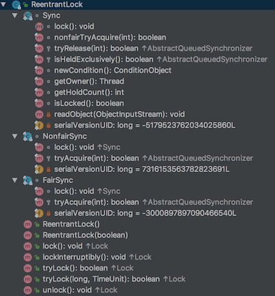
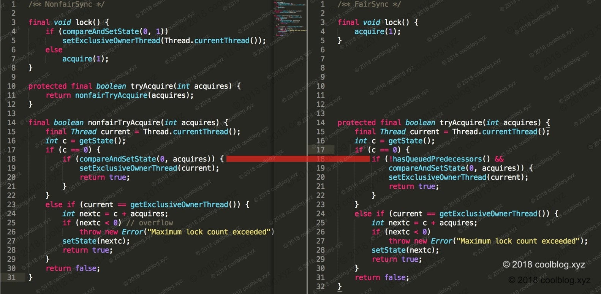

[还是田小波大佬的博客](http://www.tianxiaobo.com/2018/05/07/Java-%E9%87%8D%E5%85%A5%E9%94%81-ReentrantLock-%E5%8E%9F%E7%90%86%E5%88%86%E6%9E%90/#1%E7%AE%80%E4%BB%8B)

> 与 synchronized 的异同

ReentrantLock 和 synchronized 都是用于线程的同步控制，但它们在功能上来说差别还是很大的。对比下来 ReentrantLock 功能明显要丰富的多。下面简单列举一下两者之间的差异，如下：

| 特性               | synchronized | ReentrantLock | 相同 |
| ------------------ | ------------ | ------------- | ---- |
| 可重入             | 是           | 是            | ✅    |
| 响应中断           | 否           | 是            | ❌    |
| 超时等待           | 否           | 是            | ❌    |
| 公平锁             | 否           | 是            | ❌    |
| 非公平锁           | 是           | 是            | ✅    |
| 是否可尝试加锁     | 否           | 是            | ❌    |
| 是否是Java内置特性 | 是           | 否            | ❌    |
| 自动获取/释放锁    | 是           | 否            | ❌    |
| 对异常的处理       | 自动释放锁   | 需手动释放锁  | ❌    |

除此之外，ReentrantLock 提供了丰富的接口用于获取锁的状态，比如可以通过`isLocked()`查询 ReentrantLock 对象是否处于锁定状态, 也可以通过`getHoldCount()`获取 ReentrantLock 的加锁次数，也就是重入次数等。而 synchronized 仅支持通过`Thread.holdsLock`查询当前线程是否持有锁。另外，synchronized 使用的是对象或类进行加锁，而 ReentrantLock 内部是通过 AQS 中的同步队列进行加锁，这一点和 synchronized 也是不一样的。 


# 源码





> 背景

ReentrantLock主要利用CAS+AQS队列来实现。它支持公平锁和非公平锁，两者的实现类似。 

**state既表示资源，又表示重入锁。当state==0时，表示资源空闲可以获得。当state>0时，表示某线程持有的重入锁个数。**

内部分为三个内部类：

Sync：总抽象类，定义一些基本方法

NofairSync：非公平锁对应的逻辑方法

FairSync：公平锁对应的逻辑方法

`Sync`是一个静态抽象类，继承了 AbstractQueuedSynchronizer。公平和非公平锁的实现类`NonfairSync`和`FairSync`则继承自 Sync  。


## 1.1 公平锁

> 公平锁对应的逻辑是 ReentrantLock 内部静态类 FairSync，流程：

1. 调用 AQS的acquire 方法，将线程放入同步队列中进行等待
2. AQS又调用tryAcquire方法尝试获取资源，tryAcquire：
   * getState获取当前资源
   * 如果为0，表示资源空闲，调用hasQueuedPredecessors判断是否有等待更久的队列，没有的话就CAS设置为acquire(x)传入的参数，调用 setExclusiveOwnerThread(current);将当前线程设置为持有锁线程
   * 如果不为0，表示已经有锁获取了state，判断当前线程是否是持有锁线程，是的话就当前状态（c =  getState()） + acquire(x)的参数，算出重入的锁数量，CAS更新state

```java
==========================ReentrantLock.FairSync.java===================================
final void lock() {
    // 调用 AQS acquire 获取锁
    acquire(1);
}

===========================AbstractQueuedSynchronizer.java=============================
/**
 * 该方法主要做了三件事情：
 * 1. 调用 tryAcquire 尝试获取锁，该方法需由 AQS 的继承类实现，获取成功直接返回
 * 2. 若 tryAcquire 返回 false，则调用 addWaiter 方法，将当前线程封装成节点，
 *    并将节点放入同步队列尾部
 * 3. 调用 acquireQueued 方法让同步队列中的节点循环尝试获取锁
 */
public final void acquire(int arg) {
    // acquireQueued 和 addWaiter 属于 AQS 中的方法，这里不展开分析了
    if (!tryAcquire(arg) &&
        acquireQueued(addWaiter(Node.EXCLUSIVE), arg))
        selfInterrupt();
}

============================== ReentrantLock.FairSync.java================================
protected final boolean tryAcquire(int acquires) {
    final Thread current = Thread.currentThread();
    // 获取同步状态
    int c = getState();
    // 如果同步状态 c 为0，表示锁暂时没被其他线程获取
    if (c == 0) {
        /*
         * 判断是否有其他线程等待的时间更长。如果有，应该先让等待时间更长的节点先获取锁。
         * 如果没有，调用 compareAndSetState 尝试设置同步状态。
         */ 
        if (!hasQueuedPredecessors() &&
            compareAndSetState(0, acquires)) {
            // 将当前线程设置为持有锁的线程
            setExclusiveOwnerThread(current);
            return true;
        }
    }
    // 如果当前线程为持有锁的线程，则执行重入逻辑
    else if (current == getExclusiveOwnerThread()) {
        // 计算重入后的同步状态，acquires 一般为1
        int nextc = c + acquires;
        // 如果重入次数超过限制，这里会抛出异常
        if (nextc < 0)
            throw new Error("Maximum lock count exceeded");
        // 设置重入后的同步状态
        setState(nextc);
        return true;
    }
    return false;
}

+==============================AbstractQueuedSynchronizer.java=============================
/** 该方法用于判断同步队列中有比当前线程等待时间更长的线程 */
public final boolean hasQueuedPredecessors() {
    Node t = tail;
    Node h = head;
    Node s;
    /*
     * 在同步队列中，头结点是已经获取了锁的节点，头结点的后继节点则是即将获取锁的节点。
     * 如果有节点对应的线程等待的时间比当前线程长，则返回 true，否则返回 false
     */
    return h != t &&
        ((s = h.next) == null || s.thread != Thread.currentThread());
}
```


## 1.2 非公平锁

> 流程

1. 调用 compareAndSetState 方法抢占式加锁，加锁成功则将自己设为持锁线程，否则执行 acquire(1);
2. acquire(1)执行参照公平锁，唯一不同的是没有hasQueuedPredecessors判断

```java
+============================= ReentrantLock.NonfairSync=============================
final void lock() {
    /*
     * 这里调用直接 CAS 设置 state 变量，如果设置成功，表明加锁成功。这里并没有像公平锁
     * 那样调用 acquire 方法让线程进入同步队列进行排队，而是直接调用 CAS 抢占锁。抢占失败
     * 再调用 acquire 方法将线程置于队列尾部排队。
     */
    if (compareAndSetState(0, 1))
        setExclusiveOwnerThread(Thread.currentThread());
    else
        acquire(1);
}

+=============================AbstractQueuedSynchronizer=============================
/** 参考上一节的分析 */
public final void acquire(int arg) {
    if (!tryAcquire(arg) &&
        acquireQueued(addWaiter(Node.EXCLUSIVE), arg))
        selfInterrupt();
}

+============================= ReentrantLock.NonfairSync=============================
protected final boolean tryAcquire(int acquires) {
    return nonfairTryAcquire(acquires);
}

+================================== ReentrantLock.Sync=================================
final boolean nonfairTryAcquire(int acquires) {
    final Thread current = Thread.currentThread();
    // 获取同步状态
    int c = getState();
    
    // 如果同步状态 c = 0，表明锁当前没有线程获得，此时可加锁。
    if (c == 0) {
        // 调用 CAS 加锁，如果失败，则说明有其他线程在竞争获取锁
        if (compareAndSetState(0, acquires)) {
            // 设置当前线程为锁的持有线程
            setExclusiveOwnerThread(current);
            return true;
        }
    }
    // 如果当前线程已经持有锁，此处条件为 true，表明线程需再次获取锁，也就是重入
    else if (current == getExclusiveOwnerThread()) {
        // 计算重入后的同步状态值，acquires 一般为1
        int nextc = c + acquires;
        if (nextc < 0) // overflow
            throw new Error("Maximum lock count exceeded");
        // 设置新的同步状态值
        setState(nextc);
        return true;
    }
    return false;
}
```


## 1.3 公平锁&非公平锁区别

> 获取锁上有什么区别呢？



从上面的源码对比图中，可以看出两种的差异并不大。就差了个hasQueuedPredecessors判断是否有等待更久的node线程。如下：


node1 对应的线程比 node2 对应的线程在队列中等待的时间更长，如果 node2 线程调用 hasQueuedPredecessors  方法，则会返回 true。如果 node1 调用此方法，则会返回 false。因为 node1  前面只有一个头结点，但头结点已经获取同步状态，不处于等待状态。所以在所有处于等待状态的节点中，没有节点比它等待的更长了。


## 1.6  释放锁

> 释放锁的过程没有公平和非公平之分 

1.调用AQS的release方法

2.AQS反过来调用tryRelease方法,tryRelease流程：

* c = getState() - releases算出释放锁后的state，判断当前线程是否是持有锁线程，不是的话报错，并且判断c是否=0，等于零的话就将当前持锁线程设置为null，最后调用setState更新state
* 执行完了tryRelease，AQS还要继续操作，通过unparkSuccessor唤醒后一个节点。

```java
+================================= ReentrantLock=================================
public void unlock() {
    // 调用 AQS 中的 release 方法
    sync.release(1);
}

+================================= AbstractQueuedSynchronizer=================================
public final boolean release(int arg) {
    // 调用 ReentrantLock.Sync 中的 tryRelease 尝试释放锁
    if (tryRelease(arg)) {
        Node h = head;
        /*
         * 如果头结点的等待状态不为0，则应该唤醒头结点的后继节点。
         * 这里简单说个结论：
         *     头结点的等待状态为0，表示头节点的后继节点线程还是活跃的，无需唤醒
         */
        if (h != null && h.waitStatus != 0)
            // 唤醒头结点的后继节点，该方法的分析请参考我写的关于 AQS 的文章
            unparkSuccessor(h);
        return true;
    }
    return false;
}

+================================= ReentrantLock.Sync=================================
protected final boolean tryRelease(int releases) {
    /*
     * 用同步状态量 state 减去释放量 releases，得到本次释放锁后的同步状态量。
     * 当将 state 为 0，锁才能被完全释放
     */ 
    int c = getState() - releases;
    // 检测当前线程是否已经持有锁，仅允许持有锁的线程执行锁释放逻辑
    if (Thread.currentThread() != getExclusiveOwnerThread())
        throw new IllegalMonitorStateException();
        
    boolean free = false;
    // 如果 c 为0，则表示完全释放锁了，此时将持锁线程设为 null
    if (c == 0) {
        free = true;
        setExclusiveOwnerThread(null);
    }
    
    // 设置新的同步状态
    setState(c);
    return free;
}
```


## 1.7 condition的实现

对于condition的具体实现，在另一个类AbstractQueuedLongSynchronizer：（注意，比AQS多了个Long，不是同一个类，但是和AQS都继承于AbstractOwnableSynchronizer）

```java
//线程等待
public final void await() throws InterruptedException {
    if (Thread.interrupted())
        throw new InterruptedException();
    Node node = addConditionWaiter();
    long savedState = fullyRelease(node);
    int interruptMode = 0;
    while (!isOnSyncQueue(node)) {
        LockSupport.park(this);
        if ((interruptMode = checkInterruptWhileWaiting(node)) != 0)
            break;
    }
    if (acquireQueued(node, savedState) && interruptMode != THROW_IE)
        interruptMode = REINTERRUPT;
    if (node.nextWaiter != null) // clean up if cancelled
        unlinkCancelledWaiters();
    if (interruptMode != 0)
        reportInterruptAfterWait(interruptMode);
}

      public final void signal() {
            if (!isHeldExclusively())
                throw new IllegalMonitorStateException();
            Node first = firstWaiter;
            if (first != null)
                doSignal(first);
        }

      private void doSignal(Node first) {
            do {
                if ( (firstWaiter = first.nextWaiter) == null)
                    lastWaiter = null;
                first.nextWaiter = null;
            } while (!transferForSignal(first) &&
                     (first = firstWaiter) != null);
        }
```


## 1.8 示例

```java
package com.jian8.juc.lock;

import java.util.concurrent.locks.Condition;
import java.util.concurrent.locks.Lock;
import java.util.concurrent.locks.ReentrantLock;

/**
 * synchronized和lock区别
 * <p===lock可绑定多个条件===
 * 对线程之间按顺序调用，实现A>B>C三个线程启动，要求如下：
 * AA打印5次，BB打印10次，CC打印15次
 * 紧接着
 * AA打印5次，BB打印10次，CC打印15次
 * 。。。。
 * 来十轮
 */
public class SyncAndReentrantLockDemo {
    public static void main(String[] args) {
        ShareData shareData = new ShareData();
        new Thread(() -> {
            for (int i = 1; i <= 10; i++) {
                shareData.print5();
            }
        }, "A").start();
        new Thread(() -> {
            for (int i = 1; i <= 10; i++) {
                shareData.print10();
            }
        }, "B").start();
        new Thread(() -> {
            for (int i = 1; i <= 10; i++) {
                shareData.print15();
            }
        }, "C").start();
    }

}

class ShareData {
    private int number = 1;//A:1 B:2 C:3
    private Lock lock = new ReentrantLock();
    private Condition condition1 = lock.newCondition();
    private Condition condition2 = lock.newCondition();
    private Condition condition3 = lock.newCondition();

    //打印5次
    public void print5() {
        lock.lock();
        try {
            //判断
            while (number != 1) {
                condition1.await();
            }
            //干活
            for (int i = 1; i <= 5; i++) {
                System.out.println(Thread.currentThread().getName() + "\t" + i);
            }
            //通知
            number = 2;
            condition2.signal();

        } catch (Exception e) {
            e.printStackTrace();
        } finally {
            lock.unlock();
        }
    }
    
    //打印10次
    public void print10() {
        lock.lock();
        try {
            //判断
            while (number != 2) {
                condition2.await();
            }
            //干活
            for (int i = 1; i <= 10; i++) {
                System.out.println(Thread.currentThread().getName() + "\t" + i);
            }
            //通知
            number = 3;
            condition3.signal();

        } catch (Exception e) {
            e.printStackTrace();
        } finally {
            lock.unlock();
        }
    }
    
    //打印15次
    public void print15() {
        lock.lock();
        try {
            //判断
            while (number != 3) {
                condition3.await();
            }
            //干活
            for (int i = 1; i <= 15; i++) {
                System.out.println(Thread.currentThread().getName() + "\t" + i);
            }
            //通知
            number = 1;
            condition1.signal();

        } catch (Exception e) {
            e.printStackTrace();
        } finally {
            lock.unlock();
        }
    }
}
```

