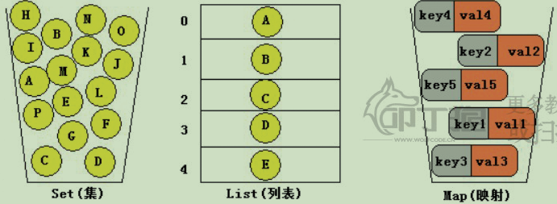
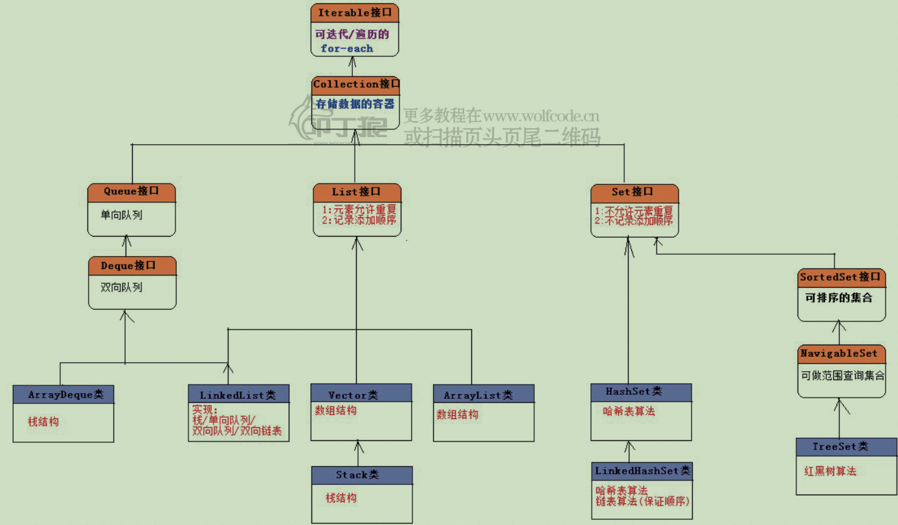
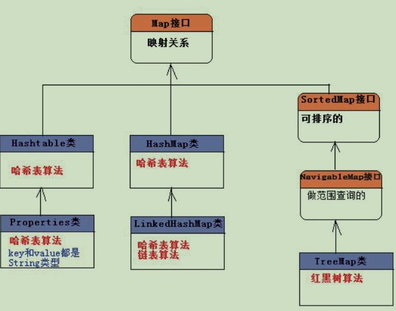

# 1 概述 

### 1.1 常用集合类

- Set(集)：集合中的对象不按特定方法排序，不允许元素重复。
- List(列表)：集合中的对象按照索引位置排序，允许元素重复。
- Map(映射)：集合中每一个元素都包含一对key和value对象，不允许key对象重复，值对象可以重复。




### 1.2 结构图




Map为独立接口：




# 5 常见集合扩容机制

|                      | 底层数据结构  | 默认初始容量 | 加载因子 |                           扩容增量                           |
| :------------------: | :-----------: | :----------: | :------: | :----------------------------------------------------------: |
|      ArrayList       |     数组      |      10      |    1     | 原容量的1.5倍， 如果扩容后的大小小于实际需要的大小，将数组扩大到实际需要的大小 |
|        Vector        |     数组      |      10      |    1     |                             2倍                              |
|       HashSet        |    HashMap    |      16      |   0.75   |                             2倍                              |
|    LinkedHashASet    | LinkedHashMap |      16      |   0.75   |                             2倍                              |
|       HashMap        |    散列表     |      16      |   0.75   |                             2倍                              |
|      Hashtable       |    散列表     |      11      |   0.75   |                        原容量的2倍+1                         |
| CopyOnWriteArrayList |               |      0       |          |                              +1                              |


### 5.1 CopyOnWriteArrayList

**作用：**

很多应用场景中，读操作可能会远远大于写操作。由于读操作根本不会修改原有的数据，因此如果每次读取都进行加锁操作，其实是一种资源浪费。我们应该允许多个线程同时访问 List 的内部数据，毕竟读操作是线程安全的。

这和 `ReentrantReadWriteLock` 读写锁的思想非常类似，也就是 **读读共享、写写互斥、读写互斥、写读互斥**。JDK中提供了 `CopyOnWriteArrayList` 类，相比于在读写锁的思想又更进一步。为了将读取的性能发挥到极致，`CopyOnWriteArrayList` 读取是完全不用加锁的，并且更厉害的是：写入也不会阻塞读取操作，只有写入和写入之间需要进行同步等待，读操作的性能得到大幅度提升。


**实现：**

`CopyOnWriteArrayList` 类的所有可变操作（add，set等等）都是通过创建底层数组的新副本来实现的。当 List 需要被修改的时候，并不直接修改原有数组对象，而是对原有数据进行一次拷贝，将修改的内容写入副本中。写完之后，再将修改完的副本替换成原来的数据，这样就可以保证写操作不会影响读操作了。

- 实现了List接口
- 内部持有一个ReentrantLock lock = new ReentrantLock();
- 底层是用volatile transient声明的数组 array
- 读写分离，写时复制出一个新的数组，完成插入、修改或者移除操作后将新数组赋值给array


# 6 fail-fast机制

### 6.1 介绍

“快速失败”也就是fail-fast，它是Java集合的一种错误检测机制。当多个线程对集合进行结构上的改变的操作时，有可能会产生fail-fast机制。记住是有可能，而不是一定。例如：假设存在两个线程（线程1、线程2），线程1通过Iterator在遍历集合A中的元素，在某个时候线程2修改了集合A的结构（是结构上面的修改，而不是简单的修改集合元素的内容），那么这个时候程序就会抛出 ConcurrentModificationException 异常，从而产生fail-fast机制。


### 6.2 事例

比如在ArryaList中有一个modCount， 用来记录 ArrayList 结构发生变化的次数。结构发生变化是指添加或者删除至少一个元素的所有操作，或者是调整内部数组的大小，仅仅只是设置元素的值不算结构发生变化。

**在进行序列化或者迭代等操作时，需要比较操作前后 modCount 是否改变，如果改变了需要抛出 ConcurrentModificationException。**

```java
private void writeObject(java.io.ObjectOutputStream s)
    throws java.io.IOException{
    // Write out element count, and any hidden stuff
    int expectedModCount = modCount;
    s.defaultWriteObject();

    // Write out size as capacity for behavioural compatibility with clone()
    s.writeInt(size);

    // Write out all elements in the proper order.
    for (int i=0; i<size; i++) {
        s.writeObject(elementData[i]);
    }

    if (modCount != expectedModCount) {
        throw new ConcurrentModificationException();
    }
}
```


 参考博客：https://blog.csdn.net/chenssy/article/details/38151189

https://blog.csdn.net/zymx14/article/details/78324464