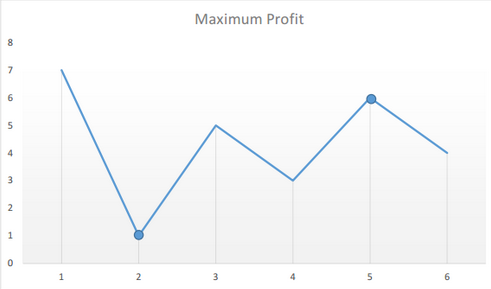

# 买卖股票的最佳时机

### 信息卡片

- 时间： 2019-1-16
- 题目链接：https://leetcode-cn.com/problems/best-time-to-buy-and-sell-stock/submissions/
- 难度：简单
- 题目描述：

```
给定一个数组，它的第 i 个元素是一支给定股票第 i 天的价格。

如果你最多只允许完成一笔交易（即买入和卖出一支股票），设计一个算法来计算你所能获取的最大利润。

注意你不能在买入股票前卖出股票。

示例 1:

输入: [7,1,5,3,6,4]
输出: 5
解释: 在第 2 天（股票价格 = 1）的时候买入，在第 5 天（股票价格 = 6）的时候卖出，最大利润 = 6-1 = 5 。
     注意利润不能是 7-1 = 6, 因为卖出价格需要大于买入价格。

示例 2:

输入: [7,6,4,3,1]
输出: 0
解释: 在这种情况下, 没有交易完成, 所以最大利润为 0。
```


### 参考答案

> 思路



min记录最低的价格，也就是波谷。

在下一个比当前波谷更低的波谷出现之前，最大的利润一定就是当前这个最低波谷到最高波峰的差，这里方便讲解命名为差1.

当下一个更低的波谷出现时，就要看之后的最大波峰到这个新最低波谷的差了，如果这个差比差1大，那么最大利润就替换为差2，否则就继续循环，一直到是否有第三个更低的波谷出现，或者有更大的差值出现。

这里的差值就是最大利润。


> 代码


```js
class Solution {
    public int maxProfit(int prices[]) {
        if(prices == null || prices.length == 0) return 0;
        int min = prices[0];
        int allProfit = 0;
        for (int i = 1; i < prices.length; i++) {
          if(prices[i] < min){
              min = prices[i];
          }else if(allProfit < prices[i] - min ){
              allProfit = prices[i] - min;
          }
        }
        return allProfit ;
    }
}
```


> 复杂度分析

时间复杂度 O(N) ： 只需遍历一次prices
 空间复杂度 O(1) ： 变量使用常数额外空间


### 其他优秀解答

```
暂无
```


