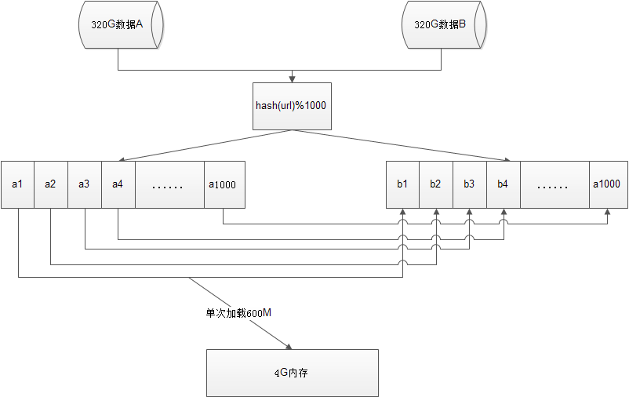

# 1 微信红包实现

### 1.1 算法设计

微信红包的分配：红包里的金额怎么算？为什么出现各个红包金额相差很大？

答案是完全随机，额度在0.01和(剩余平均值x2)之间。  例如：发100块钱，总共10个红包，那么平均值是10块钱一个，那么发出来的红包的额度在0.01元～20元之间波动。  当前面3个红包总共被领了40块钱时，剩下60块钱，总共7个红包，那么这7个红包的额度在：0.01～（60/7*2）=17.14之间。

```java
 // remainSize 剩余的红包数量
    // remainMoney 剩余的钱
    if (_redPackage.remainSize == 1) {
        _redPackage.remainSize--;
        return (double) Math.round(_redPackage.remainMoney * 100) / 100;
    }
    Random r     = new Random();
    double min   = 0.01; //
    double max   = _redPackage.remainMoney / _redPackage.remainSize * 2;
    double money = r.nextDouble() * max;
    money = money <= min ? 0.01: money;
    money = Math.floor(money * 100) / 100;
    _redPackage.remainSize--;
    _redPackage.remainMoney -= money;
    return money;
}
```


### 1.2 金额一致问题

微信从财付通拉取金额数据过来，生成个数/红包类型/金额放到redis集群里，app端将红包ID的请求放入**请求队列**中，如果发现超过红包的个数，直接返回。根据红包的逻辑处理成功得到令牌请求，则由财付通进行一致性调用，通过像比特币一样，两边保存交易记录，交易后交给第三方服务审计，如果交易过程中出现不一致就强制回归。

而一个红包代表一条数据，数据上有一个计数器字段。


### 1.3 分布式分担压力

cache会抵抗无效请求，将无效的请求过滤掉，实际进入到后台的量不大。cache记录红包个数，原子操作进行个数递减，到0表示被抢光。财付通按照20万笔每秒入账准备，但实际还不到8万每秒。
通如何保持8w每秒的写入？答：多主sharding，水平扩展机器。


# 2 发工资问题

> 同时给10万个人发工资，确保1分钟内全部发完

考察的是如何设计并发，但是，这里并没有说“发工资动作”需要用时多少，所以，这里分情况讨论；

1.假设发工资动作非常快，1μs（微妙）内可给一个人发送
直接for(int i = 0; i < 100000; i++)即可，总耗时：100000/1000=100ms（毫秒）=0.1s（秒）

2.假设发工资动作耗时1ms
直接for(int i = 0; i < 100000; i++)的话，总耗时：100000/1000=100s>1min，不能满足需求了，这里再开一个线程，即，两个线程可将时间缩短到50s，符合1分钟的需求。

3.假设发工资耗时1s
当发工资耗时1s时，单线程在1分钟内只能发送60个人的工资，如果直接考虑开线程的话，100000/60=1667个线程。
假设给的机器时1个CPU，4个Core的，那么同时开1667个线程的话，这里写了一个简单代码，模拟了1个CPU，4个Core时，启1000个线程的情况：

```java
import java.util.concurrent.ArrayBlockingQueue;
import java.util.concurrent.ThreadPoolExecutor;
import java.util.concurrent.TimeUnit;

/**
 * @author Wayss.
 * @date 2019/7/9.
 */
public class ThreadPoolDemo {

    public static void main(String [] args) {

        ThreadPoolExecutor threadPoolExecutor = new ThreadPoolExecutor(0, 2000, 1, TimeUnit.SECONDS, new ArrayBlockingQueue<Runnable>(1));

        for (int i = 0; i < 1000; i++) {
            WorkThread workThread = new WorkThread();
            threadPoolExecutor.execute(workThread);
        }
        System.out.println("threadPoolExecutor.shutdown()");
        threadPoolExecutor.shutdown();
    }
}

class WorkThread implements Runnable {

    public void run() {
        try {

            System.out.println(Thread.currentThread().getName() + "===执行开始");
            //方案一：模拟等待用sleep阻塞线程，不占用CPU
            TimeUnit.SECONDS.sleep(10);
            //方案二：模拟等待用for,占用CPU
            //for (long i = 0; i < 9999999999L; i++) ;
            System.out.println(Thread.currentThread().getName() + "===执行结束");
        } catch (Exception e) {
            e.printStackTrace();
        }
    }
}
```

因此，可以**得出结论**，如果发工资线程，大量占用CPU计算资源，那么1个CPU，4个Core的机器肯定不能支持，需要加机器；

如果发工资线程时间耗费在等待IO上面，那么1个CPU，4个Core是可以启动2000个线程的。 


# 3 海量数据处理

[博客](https://www.cnblogs.com/huanxiyun/articles/5405369.html)

## 3.1 

**问题：给定a、b两个文件，各存放50亿个url，每个url各占64字节，内存限制是4G，让你找出a、b文件共同的url？**

分析：50亿个url，每个url64字节，就是320G，显然是无法一次读入内存的。因此这里需要采用分治法。

方案：分治法，分支方法：哈希



1 将AB两个文件，用相同的哈希函数，分解为1000个独立哈希值相同的小文件，这里哈希函数的设计是个重点。

2 哈希值不同的url必然不在序号对应的文件中，因此只要在序号对应的两个文件中进行互相匹配即可。

3 比较每对小文件时，可以使用hash_set。


## 3.2 

**有一个1G大小的一个文件，里面每一行是一个词，词的大小不超过16字节，内存限制大小是1M。返回频数最高的100个词。**

  方案：顺序读文件中，对于每个词x，取hash(x)%5000，然后按照该值存到5000个小文件（记为x0,x1,...x4999）中。这样每个文件大概是200k左右。

  如果其中的有的文件超过了1M大小，还可以按照类似的方法继续往下分，直到分解得到的小文件的大小都不超过1M。
  对每个小文件，统计每个文件中出现的词以及相应的频率（可以采用trie树/hash_map等），并取出出现频率最大的100个词（可以用含100个结点的最小堆），并把100个词及相应的频率存入文件，这样又得到了5000个文件。下一步就是把这5000个文件进行归并（类似与归并排序）的过程了。


## 3.3 

**有10个文件，每个文件1G，每个文件的每一行存放的都是用户的query，每个文件的query都可能重复。要求你按照query的频度排序。**

  还是典型的TOP K算法，解决方案如下：
  方案1：
  顺序读取10个文件，按照hash(query)%10的结果将query写入到另外10个文件（记为）中。这样新生成的文件每个的大小大约也1G（假设hash函数是随机的）。
  
  找一台内存在2G左右的机器，依次对用hash_map(query, query_count)来统计每个query出现的次数。利用快速/堆/归并排序按照出现次数进行排序。将排序好的query和对应的query_cout输出到文件中。这样得到了10个排好序的文件（记为）。

  对这10个文件进行归并排序（内排序与外排序相结合）。

  方案2：
   一般query的总量是有限的，只是重复的次数比较多而已，可能对于所有的query，一次性就可以加入到内存了。这样，我们就可以采用trie树/hash_map等直接来统计每个query出现的次数，然后按出现次数做快速/堆/归并排序就可以了。

  方案3：
  与方案1类似，但在做完hash，分成多个文件后，可以交给多个文件来处理，采用分布式的架构来处理（比如MapReduce），最后再进行合并。


## 3.4 

**在2.5亿个整数中找出不重复的整数，注，内存不足以容纳这2.5亿个整数。**

  方案1：采用2-Bitmap（每个数分配2bit，00表示不存在，01表示出现一次，10表示多次，11无意义）进行，共需内存2^32 * 2 bit=1 GB内存，还可以接受。然后扫描这2.5亿个整数，查看Bitmap中相对应位，如果是00变01，01变10，10保持不变。所描完事后，查看bitmap，把对应位是01的整数输出即可。

  方案2：也可采用与第1题类似的方法，进行划分小文件的方法。然后在小文件中找出不重复的整数，并排序。然后再进行归并，注意去除重复的元素。


## 4.5 

**一个文本文件，大约有一万行，每行一个词，要求统计出其中最频繁出现的前10个词，请给出思想，给出时间复杂度分析。**

  方案1：这题是考虑时间效率。用trie树统计每个词出现的次数，时间复杂度是O(n*le)（le表示单词的平准长度）。然后是找出出现最频繁的前10个词，可以用堆来实现，前面的题中已经讲到了，时间复杂度是O(n*lg10)。所以总的时间复杂度，是O(n*le)与O(n*lg10)中较大的哪一个。