# 1 进程与线程的区别

1. 进程是资源的分配和调度的一个独立单元，而线程是CPU调度的基本单元
2. 同一个进程中可以包括多个线程，并且线程共享整个进程的资源（寄存器、堆栈、上下文），一个进行至少包3.进程的创建调用fork或者vfork，而线程的创建调用pthread_create，进程结束后它拥有的所有线程都将销毁，而线程的结束不会影响同个进程中的其他线程的结束
3. 线程是轻两级的进程，它的创建和销毁所需要的时间比进程小很多，所有操作系统中的执行功能都是创建线程去完成的
4. 线程中执行时一般都要进行同步和互斥，因为他们共享同一进程的所有资源
5. 线程有自己的私有属性TCB，线程id，寄存器、硬件上下文，而进程也有自己的私有属性进程控制块PCB，这些私有属性是不被共享的，用来标示一个进程或一个线程的标志


**共享的资源有：**

1. 堆：由于堆是在进程空间中开辟出来的，所以它是理所当然地被共享的；因此new出来的都是共享的（16位平台上分全局堆和局部堆，局部堆是独享的）

2. 全局变量 它是与具体某一函数无关的，所以也与特定线程无关；因此也是共享的
3. 静态变量 虽然对于局部变量来说，它在代码中是“放”在某一函数中的，但是其存放位置和全局变量一样，存于堆中开辟的.bss和.data段，是共享的
4. 文件等公用资源  这个是共享的，使用这些公共资源的线程必须同步。Win32 提供了几种同步资源的方式，包括信号、临界区、事件和互斥体。

**独享的资源有：**

1. 栈：栈是独享的
2. 寄存器 ：这个可能会误解，因为电脑的寄存器是物理的，每个线程去取值难道不一样吗？其实线程里存放的是副本，包括程序计数器PC


# 2 fork

[博客1](https://blog.csdn.net/jason314/article/details/5640969)

[博客2](https://www.jianshu.com/p/1327c51a4a99)

一个进程，包括代码、数据和分配给进程的资源。fork（）函数通过系统调用创建一个与原来进程几乎完全相同的进程，也就是两个进程可以做完全相同的事，但如果初始参数或者传入的变量不同，两个进程也可以做不同的事。 

一个进程调用fork（）函数后，系统先给新的进程分配资源，例如存储数据和代码的空间。然后把原来的进程的所有值都复制到新的新进程中，只有少数值与原来的进程的值不同。相当于克隆了一个自己。

### 2.1 示例1

```c
/*
 *  fork_test.c
 *  version 1
 *  Created on: 2010-5-29
 *      Author: wangth
 */
#include <unistd.h>
#include <stdio.h> 
int main () 
{ 
	pid_t fpid; //fpid表示fork函数返回的值
	int count=0;
	fpid=fork(); 
	if (fpid < 0) 
		printf("error in fork!"); 
	else if (fpid == 0) {
		printf("i am the child process, my process id is %d/n",getpid()); 
		count++;
	}
	else {
		printf("i am the parent process, my process id is %d/n",getpid()); 
		count++;
	}
	printf("统计结果是: %d/n",count);
	return 0;
}
```


运行结果：

```
 i am the child process, my process id is 5574
 统计结果是: 1
 i am the parent process, my process id is 5573
 统计结果是: 1
```


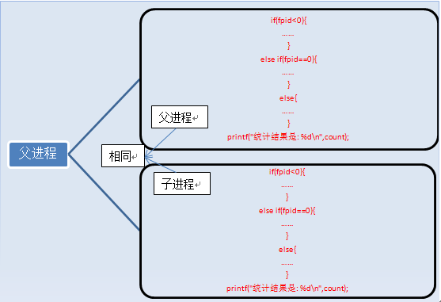

> 可以看到，这里代码的复制是从if(fpid<0)开始的，而不是#include <unistd.h>

这两个进程的变量都是独立的，存在不同的地址中，不是共用的，这点要注意。可以说，我们就是**通过fpid来识别和操作父子进程的。**

每个进程都有一个独特（互不相同）的进程标识符（process ID），可以通过getpid（）函数获得，还有一个记录父进程pid的变量，可以通过getppid（）函数获得变量的值。 

**fpid可能有三种不同的返回值：**
    1）在父进程中，fork返回新创建子进程的进程ID；
    2）在子进程中，fork返回0；
    3）如果出现错误，fork返回一个负值；

其实就相当于链表，进程形成了链表，父进程的fpid(p 意味point)指向子进程的进程id, 因为子进程没有子进程，所以其fpid为0. 


**fork出错可能有两种原因：**     

1）当前的进程数已经达到了系统规定的上限，这时errno的值被设置为EAGAIN。    

2）系统内存不足，这时errno的值被设置为ENOMEM。 


> 创建新进程成功后，系统中出现两个基本完全相同的进程，这两个进程执行没有固定的先后顺序，哪个进程先执行要看系统的进程调度策略。 


### 2.2 示例2

```c
/*
 *  fork_test.c
 *  version 2
 *  Created on: 2010-5-29
 *      Author: wangth
 */
#include <unistd.h>
#include <stdio.h>
int main(void)
{
   int i=0;
   printf("start/n");
   //ppid指当前进程的父进程pid
   //pid指当前进程的pid,
   //fpid指fork返回给当前进程的值
   for(i=0;i<2;i++){
       pid_t fpid=fork();
       if(fpid==0)
    	   printf("%d child  %4d %4d %4d/n",i,getppid(),getpid(),fpid);
       else
    	   printf("%d parent %4d %4d %4d/n",i,getppid(),getpid(),fpid);
   }
   return 0;
}
```


输出结果：

```c
	start
  //i    getppid(),getpid(),fpid
    0 parent 2043 3224 3225
    0 child  3224 3225    0
    1 parent 2043 3224 3226
    1 parent 3224 3225 3227
    1 child     1 3227    0
    1 child     1 3226    0 
```


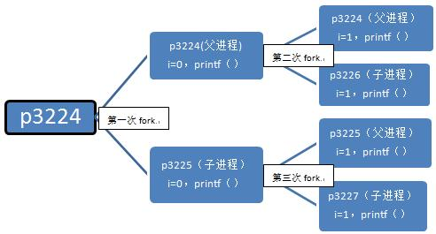


p3226，p3227的父进程难道不该是p3224和p3225吗，怎么会是1呢？这里得讲到进程的创建和死亡的过程，在p3224和p3225执行完第二个循环后，main函数就该退出了，也即进程该死亡了，因为它已经做完所有事情了。p3224和p3225死亡后，p3226，p3227就没有父进程了，这在操作系统是不被允许的，所以p3226，p3227的父进程就被置为p1了，p1是永远不会死亡的.

> 这个程序最终产生了3个子进程，执行过6次printf（）函数。 


p2043是main函数的进程。①②③④这些数字表示进程执行的顺序。

​		  ①		②

p2043->p3224->p3225  

​		   ③		 ④

​		   ↓             ↓

​		p3226   p3227

​		    ⑤	  ⑥


### 2.3 示例3

```c
/*
 *  fork_test.c
 *  version 3
 *  Created on: 2010-5-29
 *      Author: wangth
 */
#include <unistd.h>
#include <stdio.h>
int main(void)
{
   int i=0;
   for(i=0;i<3;i++){
       pid_t fpid=fork();
       if(fpid==0)
    	   printf("son/n");
       else
    	   printf("father/n");
   }
   return 0;

}
```


```
    father
    son
    father
    father
    father
    father
    son
    son
    father
    son
    son
    son
    father
    son 
```

分析：

 for        i=0          1                 2
              father     father     father
                                              son
                                son       father
                                              son
               son        father     father
                                             son
                              son        father
                                            son


### 2.4 示例4

```java
/*
 *  fork_test.c
 *  version 4
 *  Created on: 2010-5-29
 *      Author: wangth
 */
#include <unistd.h>
#include <stdio.h>
int main() {
	pid_t fpid;//fpid表示fork函数返回的值
	//printf("fork!");
	printf("fork!/n");
	fpid = fork();
	if (fpid < 0)
		printf("error in fork!");
	else if (fpid == 0)
		printf("I am the child process, my process id is %d/n", getpid());
	else
		printf("I am the parent process, my process id is %d/n", getpid());
	return 0;
}
```


 执行结果如下：

```
 fork!
I am the parent process, my process id is 3361
I am the child process, my process id is 3362 
```


 如果把语句printf("fork!/n");注释掉，执行printf("fork!");

   则新的程序的执行结果是：

```
fork!I am the parent process, my process id is 3298
fork!I am the child process, my process id is 3299 
```

就跟printf的缓冲机制有关了，printf某些内容时，操作系统仅仅是把该内容放到了stdout的缓冲队列里了,并没有实际的写到屏幕上。但是,只要看到有/n 则会立即刷新stdout,因此就马上能够打印了。

- 运行了printf("fork!")后,“fork!”仅仅被放到了缓冲里,程序运行到fork时缓冲里面的“fork!”  被子进程复制过去了。
-  而运行printf("fork! /n")后,“fork!”被立即打印到了屏幕上。


### 2.5 示例5

```c
#include <stdio.h>
int main(int argc, char* argv[])
{
   fork();
   fork() && fork() || fork();
   fork();
   printf("+/n");
}

```


# 3 进程间的通信方式（IPC）

> InterProcess Communication 

### 2.1 管道

管道，通常指无名管道，是 UNIX 系统IPC最古老的形式。
**特点：**

它是半双工的（即数据只能在一个方向上流动），具有固定的读端和写端。

它只能用于具有亲缘关系的进程之间的通信（也是父子进程或者兄弟进程之间）。

它可以看成是一种特殊的文件，对于它的读写也可以使用普通的read、write 等函数。但是它不是普通的文件，并不属于其他任何文件系统，并且只存在于内存中。

```c
#include <unistd.h>
int pipe(int fd[2]);    // 返回值：若成功返回0，失败返回-1
```

当一个管道建立时，它会创建两个文件描述符：`fd[0]`为读而打开，`fd[1]`为写而打开。如下图： 


要关闭管道只需将这两个文件描述符关闭即可。 


 **例子**

单个进程中的管道几乎没有任何用处。所以，通常调用 pipe 的进程接着调用 fork，这样就创建了父进程与子进程之间的 IPC 通道。如下图所示： 

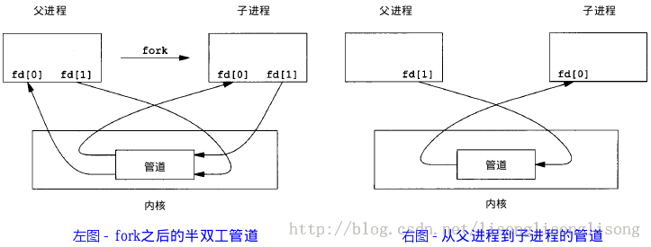

若要数据流从父进程流向子进程，则关闭父进程的读端（`fd[0]`）与子进程的写端（`fd[1]`）；反之，则可以使数据流从子进程流向父进程。 

```c
#include<stdio.h>
#include<unistd.h>
 
int main()
{
     int fd[2];  // 两个文件描述符
     pid_t pid;
     char buff[20];
 
     if(pipe(fd) < 0)  // 创建管道
         printf("Create Pipe Error!\n");
 
     if((pid = fork()) < 0)  // 创建子进程
         printf("Fork Error!\n");
     else if(pid > 0)  // 父进程
     {
         close(fd[0]); // 关闭读端
         write(fd[1], "hello world\n", 12);
     }
     else
     {         
         close(fd[1]); // 关闭写端
         read(fd[0], buff, 20);
         printf("%s", buff);
     } 
    return 0;
}


```


### 2.2 FIFO

FIFO，也称为命名管道，它是一种文件类型。

**特点:**

1. FIFO可以在无关的进程之间交换数据，与无名管道不同。
2. FIFO有路径名与之相关联，它以一种特殊设备文件形式存在于文件系统中。


FIFO的通信方式类似于在进程中使用文件来传输数据，只不过FIFO类型文件同时具有管道的特性。在数据读出时，FIFO管道中同时清除数据，并且“先进先出”。下面的例子演示了使用 FIFO 进行 IPC 的过程： 

write_fifo.c ：

```c
 1 #include<stdio.h>
 2 #include<stdlib.h>   // exit
 3 #include<fcntl.h>    // O_WRONLY
 4 #include<sys/stat.h>
 5 #include<time.h>     // time
 6 
 7 int main()
 8 {
 9     int fd;
10     int n, i;
11     char buf[1024];
12     time_t tp;
13 
14     printf("I am %d process.\n", getpid()); // 说明进程ID
15     
16     if((fd = open("fifo1", O_WRONLY)) < 0) // 以写打开一个FIFO 
17     {
18         perror("Open FIFO Failed");
19         exit(1);
20     }
21 
22     for(i=0; i<10; ++i)
23     {
24         time(&tp);  // 取系统当前时间
25         n=sprintf(buf,"Process %d's time is %s",getpid(),ctime(&tp));
26         printf("Send message: %s", buf); // 打印
27         if(write(fd, buf, n+1) < 0)  // 写入到FIFO中
28         {
29             perror("Write FIFO Failed");
30             close(fd);
31             exit(1);
32         }
33         sleep(1);  // 休眠1秒
34     }
35 
36     close(fd);  // 关闭FIFO文件
37     return 0;
38 }

```

read_fifo.c :

```c
 1 #include<stdio.h>
 2 #include<stdlib.h>
 3 #include<errno.h>
 4 #include<fcntl.h>
 5 #include<sys/stat.h>
 6 
 7 int main()
 8 {
 9     int fd;
10     int len;
11     char buf[1024];
12 
13     if(mkfifo("fifo1", 0666) < 0 && errno!=EEXIST) // 创建FIFO管道
14         perror("Create FIFO Failed");
15 
16     if((fd = open("fifo1", O_RDONLY)) < 0)  // 以读打开FIFO
17     {
18         perror("Open FIFO Failed");
19         exit(1);
20     }
21     
22     while((len = read(fd, buf, 1024)) > 0) // 读取FIFO管道
23         printf("Read message: %s", buf);
24 
25     close(fd);  // 关闭FIFO文件
26     return 0;
27 }
```


在两个终端里用 gcc 分别编译运行上面两个文件，可以看到输出结果如下： 

```c
1 [cheesezh@localhost]$ ./write_fifo 
 2 I am 5954 process.
 3 Send message: Process 5954's time is Mon Apr 20 12:37:28 2015
 4 Send message: Process 5954's time is Mon Apr 20 12:37:29 2015
 5 Send message: Process 5954's time is Mon Apr 20 12:37:30 2015
 6 Send message: Process 5954's time is Mon Apr 20 12:37:31 2015
 7 Send message: Process 5954's time is Mon Apr 20 12:37:32 2015
 8 Send message: Process 5954's time is Mon Apr 20 12:37:33 2015
 9 Send message: Process 5954's time is Mon Apr 20 12:37:34 2015
10 Send message: Process 5954's time is Mon Apr 20 12:37:35 2015
11 Send message: Process 5954's time is Mon Apr 20 12:37:36 2015
12 Send message: Process 5954's time is Mon Apr 20 12:37:37 2015
```

```c
 1 [cheesezh@localhost]$ ./read_fifo 
 2 Read message: Process 5954's time is Mon Apr 20 12:37:28 2015
 3 Read message: Process 5954's time is Mon Apr 20 12:37:29 2015
 4 Read message: Process 5954's time is Mon Apr 20 12:37:30 2015
 5 Read message: Process 5954's time is Mon Apr 20 12:37:31 2015
 6 Read message: Process 5954's time is Mon Apr 20 12:37:32 2015
 7 Read message: Process 5954's time is Mon Apr 20 12:37:33 2015
 8 Read message: Process 5954's time is Mon Apr 20 12:37:34 2015
 9 Read message: Process 5954's time is Mon Apr 20 12:37:35 2015
10 Read message: Process 5954's time is Mon Apr 20 12:37:36 2015
11 Read message: Process 5954's time is Mon Apr 20 12:37:37 2015

```

上述例子可以扩展成 客户进程—服务器进程 通信的实例，write_fifo的作用类似于客户端，可以打开多个客户端向一个服务器发送请求信息，read_fifo类似于服务器，它适时监控着FIFO的读端，当有数据时，读出并进行处理，但是有一个关键的问题是，每一个客户端必须预先知道服务器提供的FIFO接口，下图显示了这种安排：

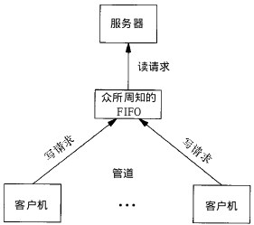


### 2.3 消息队列

消息队列，是消息的链接表，存放在内核中。一个消息队列由一个标识符（即队列ID）来标识。

**特点：**

1. 消息队列是面向记录的，其中的消息具有特定的格式以及特定的优先级。
2. 消息队列独立于发送与接收进程。进程终止时，消息队列及其内容并不会被删除。

3. 消息队列可以实现消息的随机查询,消息不一定要以先进先出的次序读取,也可以按消息的类型读取。


### 2.4 信号量

信号量（semaphore）与已经介绍过的 IPC 结构不同，它是一个计数器。信号量用于实现进程间的互斥与同步，而不是用于存储进程间通信数据。

**特点：**

1. 信号量用于进程间同步，若要在进程间传递数据需要结合共享内存。
2. 信号量基于操作系统的 PV 操作，程序对信号量的操作都是原子操作。

3. 每次对信号量的 PV 操作不仅限于对信号量值加 1 或减 1，而且可以加减任意正整数。

4. 支持信号量组。


最简单的信号量是只能取 0 和 1 的变量，这也是信号量最常见的一种形式，叫做二值信号量（Binary Semaphore）。而可以取多个正整数的信号量被称为通用信号量。

Linux 下的信号量函数都是在通用的信号量数组上进行操作，而不是在一个单一的二值信号量上进行操作。


### 2.5 共享内存

共享内存（Shared Memory），指两个或多个进程共享一个给定的存储区。

**特点：**

1. 共享内存是最快的一种 IPC，因为进程是直接对内存进行存取。
2. 因为多个进程可以同时操作，所以需要进行同步。

3. 信号量+共享内存通常结合在一起使用，信号量用来同步对共享内存的访问


### 2.6 信号

**1. 概念：**

 　　1）信号是在软件层次上对中断机制的一种模拟，是一种异步通信方式

 　　2）信号可以直接进行用户空间进程和内核进程之间的交互，内核进程也可以利用它来通知用户空间进程发生了哪些系统事件。

 　　3）如果该进程当前并未处于执行态，则该信号就由内核保存起来，直到该进程恢复执行再传递给它；如果一个信号被进程设置为阻塞，则该信号的传递被延迟，直到其阻塞被 取消时才被传递给进程。

 **2.用户进程对信号的响应方式：**

 　　1）忽略信号：对信号不做任何处理，但是有两个信号不能忽略：即SIGKILL及SIGSTOP。

 　　2）捕捉信号：定义信号处理函数，当信号发生时，执行相应的处理函数。

 　　3）执行缺省操作：Linux对每种信号都规定了默认操作

 

### 2.7 套接字(socket)

面说到的进程间的通信，所通信的进程都是在同一台计算机上的，而使用socket进行通信的进程可以是同一台计算机的进程，也是可以是通过网络连接起来的不同计算机上的进程。通常我们使用socket进行网络编程，这里将会简单地讲述如何使用``socket``进行简单的网络编程。 

套接字的特性由3个属性确定，它们分别是：**域、类型和协议**。 

1. **套接字的域**

  它指定套接字通信中使用的网络介质，最常见的套接字域是AF_INET，它指的是Internet网络。当客户使用套接字进行跨网络的连接时，它就需要用到服务器计算机的IP地址和端口来指定一台联网机器上的某个特定服务，所以在使用socket作为通信的终点，服务器应用程序必须在开始通信之前绑定一个端口，服务器在指定的端口等待客户的连接。另一个域AF_UNIX表示UNIX文件系统，它就是文件输入/输出，而它的地址就是文件名。


2. **套接字类型**

  因特网提供了两种通信机制：流（stream）和数据报（datagram），因而套接字的类型也就分为流套接字和数据报套接字。这里主要讲流套接字。

- **流套接字**由类型SOCK_STREAM指定，它们是在AF_INET域中通过**TCP/IP**连接实现，同时也是AF_UNIX中常用的套接字类型。流套接字提供的是一个有序、可靠、双向字节流的连接，因此发送的数据可以确保不会丢失、重复或乱序到达，而且它还有一定的出错后重新发送的机制。
- **数据报套接字**由类型SOCK_DGRAM指定，它不需要建立连接和维持一个连接，它们在AF_INET中通常是通过**UDP/IP协议**实现的。它对可以发送的数据的长度有限制，数据报作为一个单独的网络消息被传输,它可能会丢失、复制或错乱到达，UDP不是一个可靠的协议，但是它的速度比较高，因为它并一需要总是要建立和维持一个连接。


### 2.7 总结

1. **管道：**速度慢，容量有限，只有父子进程能通讯    
2. **FIFO：**任何进程间都能通讯，但速度慢    
3. **消息队列：**容量受到系统限制，且要注意第一次读的时候，要考虑上一次没有读完数据的问题    
4. **信号量：**不能传递复杂消息，只能用来同步    
5. **共享内存区：**能够很容易控制容量，速度快，但要保持同步，比如一个进程在写的时候，另一个进程要注意读写的问题，相当于线程中的线程安全，当然，共享内存区同样可以用作线程间通讯，不过没这个必要，线程间本来就已经共享了同一进程内的一块内存


# 4 线程同步的方式

### 4.1 linux线程同步机制

[博客](https://blog.csdn.net/a987073381/article/details/52029070)

##### 4.1.1 互斥量

互斥量本质上说是一把锁，在访问共享资源前对互斥量进行加锁，在访问完成后释放互斥量。


##### 4.1.2 读写锁

一次只有一个线程可以占有写模式的读写锁，但是多个线程可以同时占有读模式的读写锁。 


##### 4.1.3 条件变量 

互斥量用于上锁，条件变量则用于等待，并且条件变量总是需要与互斥量一起使用， 条件变量本身是由互斥量保护的，线程在改变条件变量之前必须首先锁住互斥量。 


##### 4.1.4 **信号量** 

信号量实际上是一个非负的整数计数器，用来实现对公共资源的控制。在公共资源增加的时候，信号量就增加；公共资源减少的时候，信号量就减少；只有当信号量的值大于0的时候，才能访问信号量所代表的公共资源。 


##### 4.1.5 自旋锁 

自旋锁与互斥量类似，但它不是通过休眠使进程阻塞，而是在获取锁之前一直处于忙等（自旋）阻塞状态。自旋锁可以用于以下情况：锁被持有的时间短，而且线程并不希望在重新调度上花费太多的成本。 


##### 4.1.6 屏障 

屏障是指用户可以协调多个线程并行工作的同步机制。屏障允许每个线程等待，直到所有的合作线程都到达某一点，然后从改点继续执行。
还记pthread_join函数吗？在子线程退出之前，主线程要一直等待。pthread_join函数就是一种屏障，它允许一个线程等待，直到另一个线程退出。屏障允许任意数量的线程等待，直到所有的线程完成处理工作，而线程不需要退出。所有线程达到屏障后可以接着工作。
如果我们要让主线程在所有工作线程完成之后再做某项任务，一般把屏障计数值设为工作线程数加1，主线程也作为其中一个候选线程。


### 4.2 java线程同步机制

[博客](https://blog.csdn.net/qq_22847457/article/details/89430008)

##### 4.2.1 synchronized关键字  

由于java的每个对象都有一个内置锁，当用此关键字修饰方法时， 内置锁会保护整个方法。在调用该方法前，需要获得内置锁，否则就处于阻塞状态。

>注： synchronized关键字也可以修饰静态方法，此时如果调用该静态方法，将会锁住整个类。
>
>sychronized修饰的方法可以是静态方法和非静态方法，但是不能是抽象类的抽象方法，也不能是接口中的接口方法。


##### 4.2.2 wait和notify 

wait():使一个线程处于等待状态，并且释放所持有的对象的lock。

sleep():使一个正在运行的线程处于睡眠状态，是一个静态方法，调用此方法要捕捉InterruptedException异常。
notify():唤醒一个处于等待状态的线程，注意的是在调用此方法的时候，并不能确切的唤醒某一个等待状态的线程，而是由JVM确定唤醒哪个线程，而且不是按优先级。
Allnotity():唤醒所有处入等待状态的线程，注意并不是给所有唤醒线程一个对象的锁，而是让它们竞争。


##### 4.2.3 volatile

1. volatile关键字为域变量的访问提供了一种免锁机制
2. 使用volatile修饰域相当于告诉虚拟机该域可能会被其他线程更新
3. 因此每次使用该域就要重新计算，而不是使用寄存器中的值 
4. volatile不会提供任何原子操作，它也不能用来修饰final类型的变量 


##### 4.2.4 ReentrantLock

在JavaSE5.0中新增了一个java.util.concurrent包来支持同步。 ReentrantLock类是可重入、互斥、实现了Lock接口的锁，它与使用synchronized方法和快具有相同的基本行为和语义，并且扩展了其能力。

 ReenreantLock类的常用方法有：

- ReentrantLock() : 创建一个ReentrantLock实例 
- lock() : 获得锁 
- unlock() : 释放锁 

> 注：ReentrantLock()还有一个可以创建公平锁的构造方法，但由于能大幅度降低程序运行效率，不推荐使用  


##### 4.2.5 ThreadLocal

如果使用ThreadLocal管理变量，则每一个使用该变量的线程都获得该变量的副本，副本之间相互独立，这样每一个线程都可以随意修改自己的变量副本，而不会对其他线程产生影响。 

 ThreadLocal 类的常用方法:

- ThreadLocal() : 创建一个线程本地变量 
- get() : 返回此线程局部变量的当前线程副本中的值 
- initialValue() : 返回此线程局部变量的当前线程的"初始值" 
- set(T value) : 将此线程局部变量的当前线程副本中的值设置为value

**采用以"空间换时间"的方法**


##### 4.2.6 使用阻塞队列 

前面5种同步方式都是在底层实现的线程同步，但是我们在实际开发当中，应当尽量远离底层结构。  

常用LinkedBlockingQueue() 。


##### 4.2.7 AtomicInteger 

使用原子变量实现线程同步 

原子操作就是指将读取变量值、修改变量值、保存变量值看成一个整体来操作即-这几种行为要么同时完成，要么都不完成。

在java的util.concurrent.atomic包中提供了创建了原子类型变量的工具类，使用该类可以简化线程同步。其中AtomicInteger 表可以用原子方式更新int的值，可用在应用程序中(如以原子方式增加的计数器)，但不能用于替换Integer；可扩展Number，允许那些处理机遇数字类的工具和实用工具进行统一访问。


# 5 进程同步有哪几种机制 

原子操作、信号量机制、自旋锁、管程、会合、分布式系统 

### 5.1 信号量机制

什么是信号量？信号量（semaphore）的数据结构为一个值和一个指针，指针指向等待该信号量的下一个进程。信号量的值与相应资源的使用情况有关。

- 当它的值大于0时，表示当前可用资源的数量；
- 当它的值小于0时，其绝对值表示等待使用该资源的进程个数。

一个信号量只能置一次初值，以后只能对之进行p操作或v操作。 由此也可以看到，信号量机制必须有公共内存，不能用于分布式操作系统，这是它最大的弱点。  


### 5.2 原子操作

[博客](https://www.cnblogs.com/fanzhidongyzby/p/3654855.html)

C语言语句“count++;”在未经编译器优化时生成的汇编代码为：

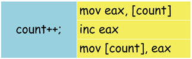

当操作系统内存在多个进程同时执行这段代码时，就可能带来并发问题。 

假设count变量初始值为0。进程1执行完“mov eax, [count]”后，寄存器eax内保存了count的值0。此时，进程2被调度执行，抢占了进程1的CPU的控制权。进程2执行“count++;”的汇编代码，将累加后的count值1写回到内存。然后，进程1再次被调度执行，CPU控制权回到进程1。进程1接着执行，计算count的累加值仍为1，写回到内存。虽然进程1和进程2执行了两次“count++;”操作，但是count实际的内存值为1，而不是2！ 


##### 5.2.1 单处理器原子操作

解决这个问题的方法是，将“count++;”语句翻译为单指令操作。 


##### 5.2.2 多处理器原子操作

但是在多处理器的环境下，例如SMP架构，这个结论不再成立。我们知道“inc [count]”指令的执行过程分为三步：

1）从内存将count的数据读取到cpu。

2）累加读取的值。

3）将修改的值写回count内存。

于是Intel x86指令集提供了指令前缀lock用于锁定前端串行总线（FSB），保证了指令执行时不会受到其他处理器的干扰。 


使用lock指令前缀后，处理器间对count内存的并发访问（读/写）被禁止，从而保证了指令的原子性。 


### 5.3 自旋锁

基于原子操作，nginx实现了一个自旋锁。自旋锁是为了保护共享资源提出的一种锁机制。 自旋锁是一种非睡眠锁。调用者申请的资源如果被占用，即自旋锁被已经被别的执行单元保持，则调用者一直循环在那里看是否该自旋锁的保持着已经释放了锁，自旋锁是一种比较低级的保护数据结构和代码片段的原始方式，可能会引起以下两个问题;   （1）死锁   （2）过多地占用CPU资源  


**应用场景：**

   自旋锁主要是为多处理器操作系统而设置的，他要解决的共享资源保护场景就是进程使用锁的时间非常短（如果锁的使用时间很久，自旋锁不合适，因为会占用大量的CPU资源）。  

   大部分情况下Nginx的worker进程最好都不要进入睡眠状态，因为它非常繁忙，在这个进程的epoll上可能有十万甚至百万的TCP连接等待着处理，进程一旦睡眠后必须等待其他事件的唤醒，这中间及其频繁的进程间切换带来的负载消耗可能无法让用户接受。  


### 5.4 管程

[博客](https://www.cnblogs.com/yongh/p/9294838.html)

在信号量机制中，每个要访问临界资源的进程都必须自备同步的PV操作，大量分散的同步操作会给系统管理带来麻烦，且容易因为同步操作不当而导致系统死锁。于是便产生了一种新的进程同步工具——**管程（Monitors）**。

**管程（Monitors）：**是一个资源管理模块，其中包含了共享资源的数据结构，以及由对该共享数据结构实施操作的一组过程（方法）所组成的资源管理程序。

管程中包含**条件变量**，用于管理进程的阻塞和唤醒。其形式为 condition x；对它的操作仅有wait和signal。

- **x.wait**：正在调用管程的进程因 x 条件需要被阻塞或挂起，则调用 x.wait 将自己插入到 x 条件的等待队列上，并释放管程，直到 x 条件变化。此时其它进程可以使用该管程。
- **x.signal**：正在调用管程的进程发现 x 条件发生了变化，则调用 x.signal，重新启动一个因 x 条件而阻塞或挂起的进程。（与信号量的signal不同，没有s:=s+1的操作）

 

**java中的管程：**

Java 采用的是管程技术，synchronized 关键字及 wait()、notify()、notifyAll() 这三个方法都是管程的组成部分。而**管程和信号量是等价的，所谓等价指的是用管程能够实现信号量，也能用信号量实现管程**。但是**管程利用OOP的封装特性解决了信号量在工程实践上的复杂性问题**，因此java采用管理机制。 


**总结：**

1. 管程相当于把对临界资源的操作封装了起来，当进程要对资源进行操作时，只要调用管程中的方法就可以了，而不用进程自己担心同步和互斥的问题，管程的内部有自己的一套机制进行同步与互斥。
2. 管程中每次只允许一个进程进入管程。
3. 当调用管程的进程因为某原因阻塞或者挂起时，把这个原因定义为一个条件变量x。
4. x.wait操作就是把自己放到一个队列上，这个队列上的进程都是因为x原因而阻塞的。
5. x.signal操作就是让在x阻塞队列上的一个进程重新启动。

> **相对形象的比喻**：假如一个管程叫ATM（取款机），其包含两个方法：存款和取款，不同的人代表不同的进程，但是ATM只允许一个人在一个时间段中进行操作，当一个人在使用时，其他的人只能wait。此外，一个人如果使用的时间太长也不行，所以需要一个条件变量来约束他。
>
> 比如一个人在操作ATM时突然接电话了，没法继续操作，把这个原因记为x，执行x.wait，让他离开ATM机，去接电话的队列中等待。等到打完电话，即调用了x.signal后，他就可以继续操作ATM了（一般令正在操作ATM的人操作完后，他才能重新进去）。

 


### 5.5 会合

管程比PV操作要高级一些，但是和PV操作等价，只适合与单处理器系统及具有公共内存的多处理器系统。 

是适合分布式系统的同步机制。


### 5.6 分布式系统

适合分布式系统的同步机制。


# 6 线程生命周期状态


### 6.1 新建

当程序使用new关键字创建了一个线程之后，该线程就处于新建状态，此时仅由 JVM 为其分配内存，并初始化其成员变量的值

 

### 6.2 就绪

当线程对象调用了 start()方法之后，该线程处于就绪状态。Java 虚拟机会为其创建方法调用栈和程序计数器，等待调度运行.


### 6.3 运行 Running

如果处于就绪状态的线程获得了CPU资源，就开始执行run方法的线程执行体，则该线程处于运行状态。run方法的那里呢？其实run也是在native线程中。


### 6.4 阻塞 Blocked

阻塞状态是线程因为某种原因放弃CPU使用权，暂时停止运行。直到线程进入就绪状态，才有机会转到运行状态。阻塞的情况大概三种：

1. **等待阻塞：**运行的线程执行wait()方法，JVM会把该线程放入等待池中。(wait会释放持有的锁)
2. **同步阻塞：**运行的线程在获取对象的同步锁时，若该同步锁被别的线程占用，则JVM会把该线程放入锁池中。
3. **其他阻塞：**运行的线程执行sleep()或join()方法，或者发出了I/O请求时，JVM会把该线程置为阻塞状态。当sleep()状态超时、join()等待线程终止或者超时、或者I/O处理完毕时，线程重新转入就绪状态。（注意,sleep是不会释放持有的锁）。

**线程睡眠：**Thread.sleep(long millis)方法，使线程转到阻塞状态。millis参数设定睡眠的时间，以毫秒为单位。当睡眠结束后，就转为就绪（Runnable）状态。sleep()平台移植性好。
 **线程等待：**Object类中的wait()方法，导致当前的线程等待，直到其他线程调用此对象的 notify() 方法或 notifyAll() 唤醒方法。这个两个唤醒方法也是Object类中的方法，行为等价于调用 wait(0) 一样。唤醒线程后，就转为就绪（Runnable）状态。
 **线程让步：**Thread.yield() 方法，暂停当前正在执行的线程对象，把执行机会让给相同或者更高优先级的线程。
 **线程加入：**join()方法，等待其他线程终止。在当前线程中调用另一个线程的join()方法，则当前线程转入阻塞状态，直到另一个进程运行结束，当前线程再由阻塞转为就绪状态。
 **线程I/O：**线程执行某些IO操作，因为等待相关的资源而进入了阻塞状态。比如说监听system.in，但是尚且没有收到键盘的输入，则进入阻塞状态。
 **线程唤醒：**Object类中的notify()方法，唤醒在此对象监视器上等待的单个线程。如果所有线程都在此对象上等待，则会选择唤醒其中一个线程，选择是任意性的，并在对实现做出决定时发生。类似的方法还有一个notifyAll()，唤醒在此对象监视器上等待的所有线程。


### 6.5 死亡 Dead

线程会以以下三种方式之一结束，结束后就处于死亡状态:

1. run()方法执行完成，线程正常结束。
2. 线程抛出一个未捕获的Exception或Error。
3. 直接调用该线程的stop()方法来结束该线程——该方法容易导致死锁，通常不推荐使用。


## 7 进程生命周期

就绪状态：进程已获得除处理机以外的所需资源，等待分配处理机资源；

运行状态：占用处理机资源运行，处于此状态的进程数小于等于CPU数；

阻塞状态： 进程等待某种条件，在条件满足之前无法执行；

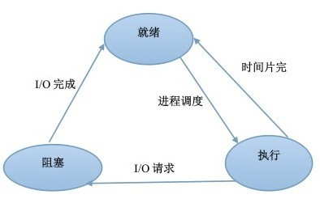


# 8 **什么是死锁？死锁产生的条件？** 

[博客](https://blog.csdn.net/wljliujuan/article/details/79614019)

### 8.1 死锁的概念

在两个或者多个并发进程中，如果每个进程持有某种资源而又等待其它进程释放它或它们现在保持着的资源，在未改变这种状态之前都不能向前推进，称这一组进程产生了死锁。通俗的讲，就是两个或多个进程无限期的阻塞、相互等待的一种状态。


### 8.2 资源的类型

##### 8.2.1  可重用资源和消耗性资源

**1.可重用资源（永久性资源）**

可被多个进程多次使用，如所有硬件。

- 只能分配给一个进程使用，不允许多个进程共享。
- 进程在对可重用资源的使用时，须按照请求资源、使用资源、释放资源这样的顺序。
- 系统中每一类可重用资源中的单元数目是相对固定的，进程在运行期间，既不能创建，也不能删除。


**2.消耗性资源（临时性资源）**

又称临时性资源，是由进程在运行期间动态的创建和消耗的。

- 消耗性资源在进程运行期间是可以不断变化的，有时可能为0。
- 进程在运行过程中，可以不断地创造可消耗性资源的单元，将它们放入该资源类的缓冲区中，以增加该资源类的单元数目。
- 进程在运行过程中，可以请求若干个可消耗性资源单元，用于进程自己消耗，不再将它们返回给该资源类中。

可消耗资源通常是由生产者进程创建，由消费者进程消耗。最典型的可消耗资源是用于进程间通信的消息。 


##### 8.2.2 可抢占资源和不可抢占资源

**1.可抢占资源**

可抢占资源指某进程在获得这类资源后，该资源可以再被其他进程或系统抢占。对于这类资源是不会引起死锁的。

> CPU 和主存均属于可抢占性资源。


**2.不可抢占资源**

一旦系统把某资源分配给该进程后，就不能将它强行收回，只能在进程用完后自行释放。

> 磁带机、打印机等属于不可抢占性资源。


### 8.3 产生死锁的原因

##### 8.3.1 竞争不可抢占资源引起死锁

如：共享文件时引起死锁
系统中拥有两个进程P1和P2，它们都准备写两个文件F1和F2。而这两者都属于可重用和不可抢占性资源。如果进程P1在打开F1的同时，P2进程打开F2文件，当P1想打开F2时由于F2已结被占用而阻塞，当P2想打开1时由于F1已结被占用而阻塞，此时就会无线等待下去，形成死锁。 


##### 8.3.2 竞争可消耗资源引起死锁

如：进程通信时引起死锁
系统中拥有三个进程P1、P2和P3，m1、m2、m3是3可消耗资源。进程P1一方面产生消息m1，将其发送给P2，另一方面要从P3接收消息m3。而进程P2一方面产生消息m2，将其发送给P3，另一方面要从P1接收消息m1。类似的，进程P3一方面产生消息m3，将其发送给P1，另一方面要从P2接收消息m2。
如果三个进程都先发送自己产生的消息后接收别人发来的消息，则可以顺利的运行下去不会产生死锁，但要是三个进程都先接收别人的消息而不产生消息则会永远等待下去，产生死锁。


##### 8.3.3 **进程推进顺序不当引起死锁** 

例如，并发进程 P1、P2分别保持了资源R1、R2，而进程P1申请资源R2，进程P2申请资源R1时，两者都会因为所需资源被占用而阻塞。  


### 8.4 死锁产生的四个必要条件

产生死锁的必要条件：

- 互斥条件：进程要求对所分配的资源进行排它性控制，即在一段时间内某资源仅为一进程所占用。
- 请求和保持条件：当进程因请求资源而阻塞时，对已获得的资源保持不放。
- 不剥夺条件：进程已获得的资源在未使用完之前，不能剥夺，只能在使用完时由自己释放。
- 环路等待条件：在发生死锁时，必然存在一个进程--资源的环形链。


### 8.5 处理死锁的方法

### 8.5.1 预防死锁

通过设置某些限制条件，去破坏产生死锁的四个必要条件中的一个或几个条件，来防止死锁的发生。

##### 8.5.1.1 破坏“互斥”条件

就是在系统里取消互斥。若资源不被一个进程独占使用，那么死锁是肯定不会发生的。但一般来说在所列的四个条件中，“互斥”条件是无法破坏的。

> 注意：互斥条件不能被破坏，否则会造成结果的不可再现性。


##### 8.5.2 破坏“占有并等待”条件:

在系统中不允许进程在已获得某种资源的情况下，申请其他资源。即要想出一个办法，阻止进程在持有资源的同时申请其他资源。

1. 创建进程时，要求它申请所需的全部资源，系统或满足其所有要求，或什么也不给它。这是所谓的 “ 一次性分配”方案。
2. 要求每个进程提出新的资源申请前，释放它所占有的资源。这样，一个进程在需要资源S时，须先把它先前占有的资源R释放掉，然后才能提出对S的申请，即使它可能很快又要用到资源R。


##### 8.5.3 破坏“不可抢占”条件

破坏“不可抢占”条件就是允许对资源实行抢夺。

1. 如果占有某些资源的一个进程进行进一步资源请求被拒绝，则该进程必须释放它最初占有的资源，如果有必要，可再次请求这些资源和另外的资源。
2. 如果一个进程请求当前被另一个进程占有的一个资源，则操作系统可以抢占另一个进程，要求它释放资源。只有在任意两个进程的优先级都不相同的条件下，此方法才能预防死锁。


##### 8.5.4 破坏“循环等待”条件

破坏“循环等待”条件的一种方法，是将系统中的所有资源统一编号，进程可在任何时刻提出资源申请，但所有申请必须按照资源的编号顺序（升序）提出。这样做就能保证系统不出现死锁。


### 8.5.2 避免死锁

在资源的动态分配过程中，用某种方法去防止系统进入不安全状态，从而避免死锁的发生。

##### 8.5.2.1 常用避免死锁的方法

**1.有序资源分配法**

这种算法资源按某种规则系统中的所有资源统一编号（例如打印机为1、磁带机为2、磁盘为3、等等），申请时必须以上升的次序。系统要求申请进程：
　　1、对它所必须使用的而且属于同一类的所有资源，必须一次申请完；
　　2、在申请不同类资源时，必须按各类设备的编号依次申请。例如：进程PA，使用资源的顺序是R1，R2； 进程PB，使用资源的顺序是R2，R1；若采用动态分配有可能形成环路条件，造成死锁。
　　采用有序资源分配法：R1的编号为1，R2的编号为2；
　　PA：申请次序应是：R1，R2
　　PB：申请次序应是：R1，R2
　　这样就破坏了环路条件，避免了死锁的发生


**2.银行家算法**

当一个进程申请使用资源的时候，银行家算法通过先 **试探** 分配给该进程资源，然后通过安全性算法判断分配后的系统是否处于安全状态，若不安全则试探分配作废，让该进程继续等待。 

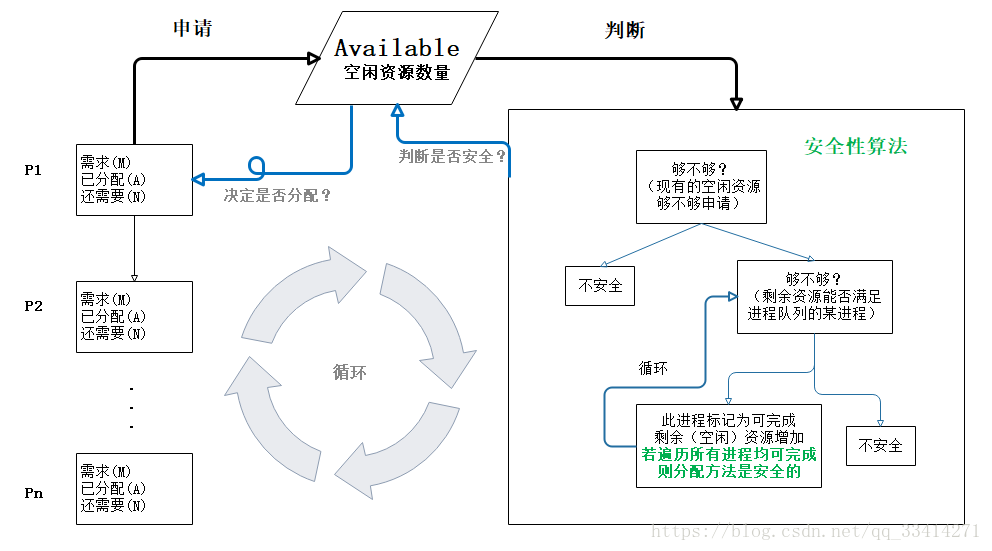


例子：

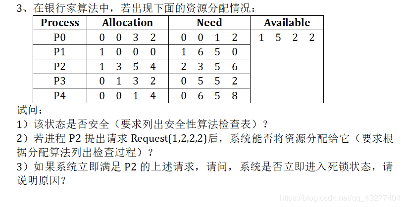

Allocation 分配矩阵，Need需求矩阵，Available 当前系统空闲资源

分析：

四种空闲资源数量为1 5 2 2 ，满足P0的need，释放Allocation，Available变为1 5 5 4

| 满足条件的进程 | 进程释放资源后Available变化 |
| -------------- | --------------------------- |
| P0             | 1 5 5 4                     |
| P3             | 1 6 8 6                     |
| P1             | 2 6 8 6                     |
| P2             | 3 9 13 10                   |
| P4             | 3 9 14 14                   |


##### 8.5.2.2 常用避免死锁的技术

- 加锁顺序（线程按照一定的顺序加锁）
- 加锁时限（线程尝试获取锁的时候加上一定的时限，超过时限则放弃对该锁的请求，并释放自己占有的锁）
- 死锁检测


1.加锁顺序

按照顺序加锁是一种有效的死锁预防机制。但是，这种方式需要你事先知道所有可能会用到的锁(译者注：并对这些锁做适当的排序)，但总有些时候是无法预知的。 


2.加锁时限

在尝试获取锁的过程中若超过了这个时限该线程则放弃对该锁请求。若一个线程没有在给定的时限内成功获得所有需要的锁，则会进行回退并释放所有已经获得的锁，然后等待一段随机的时间再重试。 

问题：超时和重试机制是为了避免在同一时间出现的竞争，但是当线程很多时，其中两个或多个线程的超时时间一样或者接近的可能性就会很大，因此就算出现竞争而导致超时后，由于超时时间一样，它们又会同时开始重试，导致新一轮的竞争，带来了新的问题。 

> 这种机制存在一个问题，在Java中不能对synchronized同步块设置超时时间。你需要创建一个自定义锁，或使用Java5中java.util.concurrent包下的工具。


3.死锁检测

每当一个线程获得了锁，会在线程和锁相关的数据结构中（map、graph等等）将其记下。除此之外，每当有线程请求锁，也需要记录在这个数据结构中。 

当一个线程请求锁失败时，这个线程可以遍历锁的关系图看看是否有死锁发生 ，当检测出死锁后，便采取适当措施将进程从死锁状态中解脱出来。


### 8.5.3 检测死锁

允许系统在运行过程中发生死锁，但可设置检测机构及时检测死锁的发生，并采取适当措施加以清除。


### 8.5.4 解除死锁

当检测出死锁后，便采取适当措施将进程从死锁状态中解脱出来。

死锁解除的主要方法有：

- 资源剥夺法。挂起某些死锁进程，并抢占它的资源，将这些资源分配给其他的死锁进程。但应防止被挂起的进程长时间得不到资源，而处于资源匮乏的状态。
- 撤销进程法。强制撤销部分、甚至全部死锁进程并剥夺这些进程的资源。撤销的原则可以按进程优先级和撤销进程代价的高低进行。
- 进程回退法。让一（多）个进程回退到足以回避死锁的地步，进程回退时自愿释放资源而不是被剥夺。要求系统保持进程的历史信息，设置还原点。


# 9 页式管理、段式管理和段页式管理(内存管理) 

[博客](https://blog.csdn.net/smilesundream/article/details/70148878)

内存管理方式主要分为：页式管理、段式管理和段页式管理。 

基本存储分配方式：

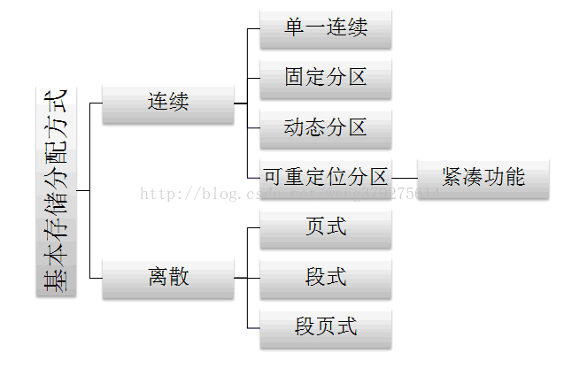


### 9.1 页式管理

 页式管理的基本原理是将各进程的虚拟空间划分为若干个长度相等的页。把内存空间按页的大小划分为片或者页面，然后把页式虚拟地址与内存地址建立一一对应的页表，并用相应的硬件地址转换机构来解决离散地址变换问题。页式管理采用请求调页和预调页技术来实现内外存存储器的统一管理。

-  优点：没有外碎片，每个内碎片不超过页的大小。
-  缺点：程序全部装入内存，要求有相应的硬件支持，如地址变换机构缺页中断的产生和选择淘汰页面等都要求有相应的硬件支持。增加了机器成本和系统开销。


### 9.2 段式管理

 段式管理的基本思想是把程序按内容或过程函数关系分成段，每段有自己的名字。一个用户作业或者进程所包含的段对应一个二维线性虚拟空间，也就是一个二维虚拟存储器。段式管理程序以段为单位分配内存，然后通过地址映射机构把段式虚拟地址转换为实际内存物理地址。

-  优点：可以分别编写和编译，可以针对不同类型的段采取不同的保护，可以按段为单位来进行共享，包括通过动态链接进行代码共享。
-  缺点：会产生碎片。


### 9.3  段页式管理

 段页式管理，系统必须为每个作业或者进程建立一张段表以管理内存分配与释放、缺段处理等。另外由于一个段又被划分为若干个页，每个段必须建立一张页表以把段中的虚页变换为内存中的实际页面。显然与页式管理时相同，页表也要有相应的实现缺页中断处理和页面保护等功能的表项。

 段页式管理是段式管理和页式管理相结合而成，具有两者的优点。

由于管理软件的增加，复杂性和开销也增加。另外需要的硬件以及占用的内存也有所增加，使得执行速度下降。


段式存储和页式存储的区别：

- 目的不同：分页是由于系统管理的需要而不是用户的需要，它是信息的物理单位；分段的目的是为了能更好地满足用户的需要，它是信息的逻辑单位，它含有一组其意义相对完整的信息；
- 大小不同：页的大小固定且由系统决定，而段的长度却不固定，由其所完成的功能决定；

- 地址空间不同： 段向用户提供二维地址空间；页向用户提供的是一维地址空间；

- 信息共享：段是信息的逻辑单位，便于存储保护和信息的共享，页的保护和共享受到限制；

- 内存碎片：页式存储管理的优点是没有外碎片（因为页的大小固定），但会产生内碎片（一个页可能填充不满）；而段式管理的优点是没有内碎片（因为段大小可变，改变段大小来消除内碎片）。但段换入换出时，会产生外碎片（比如4k的段换5k的段，会产生1k的外碎片）。


# 10 操作系统中进程调度策略

不同环境的调度算法目标不同，因此需要针对不同环境来讨论调度算法。

### 10.1 批处理系统

批处理系统没有太多的用户操作，在该系统中，调度算法目标是保证吞吐量和周转时间（从提交到终止的时间）。

##### 10.1.1 先来先服务 

> first-come first-serverd（FCFS）  

非抢占式的调度算法，按照请求的顺序进行调度。

有利于长作业，但不利于短作业，因为短作业必须一直等待前面的长作业执行完毕才能执行，而长作业又需要执行很长时间，造成了短作业等待时间过长。


##### 10.1.2 短作业优先 

> shortest job first（SJF）

非抢占式的调度算法，按估计运行时间最短的顺序进行调度。

长作业有可能会饿死，处于一直等待短作业执行完毕的状态。因为如果一直有短作业到来，那么长作业永远得不到调度。


##### 10.1.3 最短剩余时间优先

> shortest remaining time next（SRTN）

最短作业优先的抢占式版本，按剩余运行时间的顺序进行调度。 当一个新的作业到达时，其整个运行时间与当前进程的剩余时间作比较。如果新的进程需要的时间更少，则挂起当前进程，运行新的进程。否则新的进程等待。


### 10.2 交互式系统

交互式系统有大量的用户交互操作，在该系统中调度算法的目标是快速地进行响应。

##### 10.2.1 时间片轮转

将所有就绪进程按 FCFS 的原则排成一个队列，每次调度时，把 CPU 时间分配给队首进程，该进程可以执行一个时间片。当时间片用完时，由计时器发出时钟中断，调度程序便停止该进程的执行，并将它送往就绪队列的末尾，同时继续把 CPU 时间分配给队首的进程。

时间片轮转算法的效率和时间片的大小有很大关系：

- 因为进程切换都要保存进程的信息并且载入新进程的信息，如果时间片太小，会导致进程切换得太频繁，在进程切换上就会花过多时间。
- 而如果时间片过长，那么实时性就不能得到保证。

<div align="center">  </div><br>


##### 10.2.2 优先级调度  

为每个进程分配一个优先级，按优先级进行调度。

为了防止低优先级的进程永远等不到调度，可以随着时间的推移增加等待进程的优先级。


##### 10.2.3 多级反馈队列  

一个进程需要执行 100 个时间片，如果采用时间片轮转调度算法，那么需要交换 100 次。

多级队列是为这种需要连续执行多个时间片的进程考虑，它设置了多个队列，每个队列时间片大小都不同，例如 1,2,4,8,..。进程在第一个队列没执行完，就会被移到下一个队列。这种方式下，之前的进程只需要交换 7 次。

每个队列优先权也不同，最上面的优先权最高。因此只有上一个队列没有进程在排队，才能调度当前队列上的进程。

可以将这种调度算法看成是时间片轮转调度算法和优先级调度算法的结合。

<div align="center">  </div><br>

### 10.3 实时系统

实时系统要求一个请求在一个确定时间内得到响应。

分为硬实时和软实时，前者必须满足绝对的截止时间，后者可以容忍一定的超时。


# 11 内存&虚拟内存 

### 11.1 内存 

[博客](https://www.cnblogs.com/jmsjh/p/7811601.html)

##### 11.1.1 为什么需要内存

程序和数据平常存储在硬盘等存储器上，不管你开机或关机了，它们都是存在的，不会丢失。硬盘可以存储的东西很多，但其传输数据的速度较慢。所以需要运行程序或打开数据时，这些数据必须从硬盘等存储器上先传到另一种容量小但速度快得多的存储器，之后才送入CPU进行执行处理。这中间的存储器就是内存。 


**读一个磁盘扇区的流程：**

> 1. CPU 将相关的命令和地址，通过系统总线和IO总线传递给磁盘，发起一个磁盘读。
> 2. 磁盘控制器将相关的地址解析，并通过IO总线与内存总线将数据传给内存。
> 3. 第2步完成之后，磁盘控制器向CPU发送一个中断信号。(学电子的同学应该很清楚中断是什么)。这时CPU就知道了，数据已经发送到内存了。

第二步磁盘操作很慢，但是在第一步CPU发出信号后。但是第二步和第三步时，CPU根本不参与。第二步很耗时，所以CPU在第一步发出信号后，就切换到另一个线程。所以此时的CPU依旧没有闲着。而在第三步时，通过中断，硬盘主动发信号给CPU，你需要的数据已经发送到内存了，然后此时它可以将线程再切换回来，接着执行这个该线程的任务。 


**应用程序：**

对于一个应用/进程而言，它都应该有一个入口。(虽然不一定需要我们直接写`main`函数)。入口函数内部就是我们的任务代码，任务代码执行完了这个应用/进程也就结束了。这个很好理解，比如测试工程师写的一个测试case。跑完了这个任务就结束了。

但是 有些程序，比如一个  app，你打开了这个app。不做任何操作。这个界面会一直存在，也不会消失。

所以这个app进程的入口main来讲，其实是这样的。

```c
int main(){
    boolean flag  = true;
    while (flag){
        //我们执行任务的代码
    }
    return 0;
}
```


##### 11.2 局部性原理

* 时间局部性(temporal locality):被引用过一次的存储器位置的内容在未来会被多次引用。
* 空间局部性(spatial locality):如果一个存储器位置的内容被引用，那么它附近的位置也很大概率会被引用。


### 11.2 虚拟内存

[博客1](https://www.cnblogs.com/jmsjh/p/8017202.html)

[博客2](https://www.cnblogs.com/logo-fox/p/10843348.html)

维基百科上的解释：

虚拟内存不只是“用磁盘空间来扩展物理内存”的意思——这只是扩充内存级别以使其包含硬盘驱动器而已。把内存扩展到磁盘只是使用虚拟内存技术的一个结果，它的作用也可以通过覆盖或者把处于不活动状态的程序以及它们的数据全部交换到磁盘上等方式来实现。对虚拟内存的定义是基于对地址空间的重定义的，即把地址空间定义为“连续的虚拟内存地址”，以借此“欺骗”程序，使它们以为自己正在使用一大块的“连续”地址。 


##### 11.1 为什么需要虚拟内存

解决了三个使用连续物理内存时的问题：

- **问题1：进程地址空间不隔离。**由于程序都是直接访问物理内存，所以恶意程序可以随意修改别的进程的内存数据，以达到破坏的目的。有些非恶意的，但是有bug的程序也可能不小心修改了其它程序的内存数据，就会导致其它程序的运行出现异常。这种情况对用户来说是无法容忍的，因为用户希望使用计算机的时候，其中一个任务失败了，至少不能影响其它的任务。
- **问题2：内存使用效率低。**在A和B都运行的情况下，如果用户又运行了程序C，而程序C需要20M大小的内存才能运行，而此时系统只剩下8M的空间可供使用，所以此时系统必须在已运行的程序中选择一个将该程序的数据暂时拷贝到硬盘上，释放出部分空间来供程序C使用，然后再将程序C的数据全部装入内存中运行。可以想象得到，在这个过程中，有大量的数据在装入装出，导致效率十分低下。
- **问题3：程序运行的地址不确定。**当内存中的剩余空间可以满足程序C的要求后，操作系统会在剩余空间中随机分配一段连续的20M大小的空间给程序C使用，因为是随机分配的，所以程序运行的地址是不确定的。


概念：虚拟内存也是一种缓存思想,虚拟内存将主存看成是一个磁盘的高速缓存，主存中只保存活动区域，并根据需要在磁盘和主存之间来回传送数据。虚拟内存的地址和磁盘的地址之间建立影射关系。磁盘上活动的数组内容被缓存在主存中。

虚拟内存（VM）系统将虚拟内存分割成称为大小固定的虚拟页（Virtual Page,VP），每个虚拟页的大小为固定字节。同样的，物理内存被分割为物理页（Physical Page,PP）,大小也为固定字节（物理页也称作页帧，page frame）。

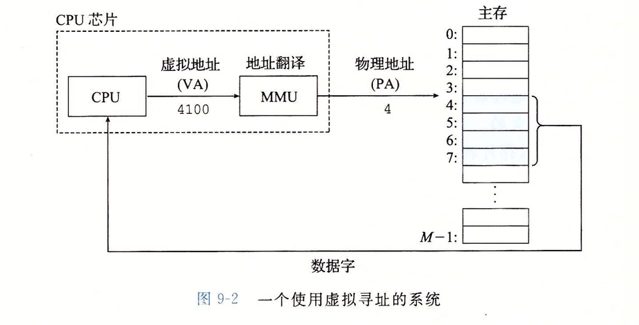


在任意时刻，虚拟页面都分为三个不相交的部分：

- **未分配的(Unallocated)**：VM 系统还未分配（或者创建）的页，未分配的页没有任何数据和它们关联，因此不占用任何内存/磁盘空间。
- **缓存的(Cached)**：当前已缓存在物理内存中的已分配页。
- **未缓存的(UnCached)**：该页已经映射到磁盘上了，但是还没缓存在物理内存中。

> 其中**未分配的VP**不占用任何的实际物理空间，这点要理解。如果程序每个VP都映射着实际的PP。无论如何也对应不上的。并且也完全没必要一一映射,下图中可以看到，地址空间内有大量的空白。毕竟程序不可能实际使用那么大的地址空间。 

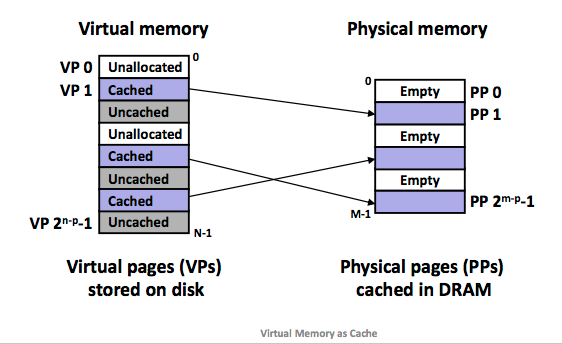


##### 11.2 页表

系统必须得有办法判定某个虚拟页是否缓存在主存的某个地方。这具体可分为两种情况。

- 已经在主存中，就需要判断出该虚拟页存在于哪个物理页中。
- 不在主存中，那么系统必须判断虚拟页存放在磁盘的哪个位置，并且在物理主存中选择一个牺牲页，并将该虚拟页从磁盘复制到 主存，替换这个牺牲页。

这些功能由软硬件联合提供，包括操作系统，CPU中的**内存管理单元（Memory Management Unit,MMU）**和一个存放在物理内存中叫**页表（page table）**的数据结构，页表将虚拟页映射到物理页。每次地址翻译硬件将一个虚拟地址转换成物理地址时都会读取页表。

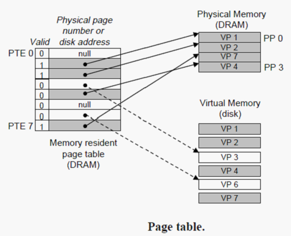

上图展示了一个页表的基本结构，页表就是一个**页表条目（Page Table Entry,PTE）**的数组。虚拟地址的每个页在页表中都有一个对应的PTE。在这里我们假设每个 PTE 是由一个有效位（Valid bit）和一个 n 位地址字段组成的。有效位表明了该虚拟页当前是否被缓存在 主存 中。

- 有效位为 1，则主存缓存了该虚拟页。地址字段就表示主存中相应的物理页的起始位置。
- 有效位为 0，则地址字段的null表示这个虚拟页还未被分配，否则该地址就指向该虚拟页在磁盘上的起始位置。

> 命中和缺页：
>
> 当CPU想要读取包含在某个虚拟页的内容时，如果该页已经缓存在主存中，也就是**页命中**。perfect,很完美。但是如果该页没有缓存在主存中，则我们称之为**缺页(page fault)** 


**理所当然的，每个进程都有一个独立的页表和一个独立的虚拟地址空间**。


##### 11.3 共享页面

比如每个C程序都要调用的 `stdio`这个库，不可能为每个进程都添加一份库，内存中只有一份`stdio`库的内容，供每个使用该库的进程共享。 

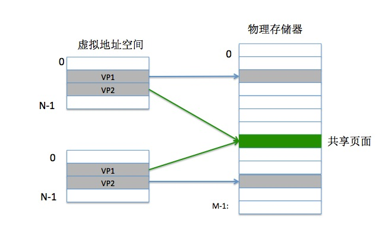

如上图所示: 第一个进程的的页表将 VP2 映射到 某个物理页面。而第二个进程同样将它的 VP2 映射到 该物理页面。所以该物理页面都被两个进程共享了。 

所以说**虚拟内存简化了共享机制** .


##### 11.4 内存保护

大家知道，C语言中存在指针，可以直接进行内存操作。因为有了虚拟内存，所以我们的指针操作也不会访问到其他进程的区域，但是哪怕是对于自己的地址空间，很多内存区域也应该是禁止访问的，这不仅包括kernel的区域，也包括自己的只读代码段。那么虚拟内存就提供了这样的一种内存保护工具。 

**地址翻译机制**可以使用一种自然的方式来提供内存的访问控制。PTE 上添加一些额外的控制位来添加权限。每次 CPU 生成一个地址时，地址翻译硬件都会读一个 PTE 。 

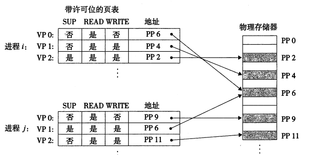


##### 11.5 段 和 页

我们明白了页，页是操作系统为了管理主存方便而划分的，对用户不可见。但是思考这种情况，假设一个页的大小是1M。但是某个程序数据加起来也就0.5M，所以在内存和磁盘进行页交换明显的浪费内存了。所以还一种划分方式是**分段**。上面那个例子，我将该段划分为0.5M，在内存和磁盘之间交换，这样就避免了浪费。

段是信息的逻辑单元，是根据用户需求而灵活划分的，所以大小不固定，对用户是可见的，提供的是二维地址空间。


##### 11.6 swap分区的作用

熟悉linux的同学，应该知道linux有一个swap分区。Swap空间的作用可简单描述为：当系统的物理内存不够用的时候，就需要将物理内存中的一部分空间释放出来，以供当前运行的程序使用。那些被释放的空间可能来自一些很长时间没有什么操作的程序，这些被释放的空间中的信息被临时保存到Swap空间中，等到那些程序要运行时，再从Swap中恢复保存的数据到内存中。系统总是在物理内存不够时，才进行Swap交换。

> 你电脑打开了一个音乐播放器，但是也没播放歌曲，然后你几天不关机，也一直没关闭这个音乐播放器，随着运行的程序越来越多，内存快不够用了，所以操作系统就选择将这个音乐播放器的内存状态(包括堆栈状态等)都写到磁盘上的swap区进行保存。这样就腾出来一部分内存供其他需要运行的程序使用。你啥时候想听歌了，就找到了这个音乐播放器程序操作。此时，  系统会从磁盘中的swap区重新读取该音乐播放器的相关信息，送回内存接着运行。

在window下也有类作用的硬盘空间，属于对用户不可见的匿名磁盘空间(在C盘)。


> **按照字面意思，swap交换区也可以称为虚拟内存**
>
> 硬盘上的swap交换区，起到了扩大内存的作用。所以从某些意义上来讲，swap区也可以叫做虚拟内存，但是**这个虚拟内存是字面意思**。和我们本文当中站在计算机系统的角度来解释的虚拟内存不是一个概念.


> linux环境下叫做swap分区，window下这块区域没叫做swap分区，就直接按照字面意思叫做"虚拟内存"了。


# 12 协程

[博客1](https://www.zhihu.com/question/20511233)

[博客2](https://blog.csdn.net/zheng199172/article/details/88800275)


线程和进程的操作是由程序触发系统接口，最后的执行者是系统；**协程的操作则是程序员。**

协程存在的意义：对于多线程应用，CPU通过切片的方式来切换线程间的执行，线程切换时需要耗时（保存状态，下次继续）。**协程，就是微线程，只使用一个线程，在一个线程中规定某个代码块执行顺序，有效避免了线程和进程的切换带来的资源消耗。**


**首先看一个典型生产者和消费者的问题：（代码不贴了）**

1. 定义了一个生产者类，一个消费者类。
2. 生产者类循环100次，向同步队列当中插入数据。
3. 消费者循环监听同步队列，当队列有数据时拉取数据。
4. 如果队列满了（达到5个元素），生产者阻塞。
5. 如果队列空了，消费者阻塞。

上面的过程正确地实现了生产者/消费者模式，但是却并不是一个高性能的实现。为什么性能不高呢？原因如下：

1. 涉及到同步锁。
2. 涉及到线程阻塞状态和可运行状态之间的切换。
3. 涉及到线程上下文的切换。

**以上涉及到的任何一点，都是非常耗费性能的操作。**

**如果用协程，可以完美地避免上面三个问题，因为协程不需要进行线程的切换，所以它的资源不需要竞争，也不涉及同步锁。**


**协程的适用场景：当程序中存在大量不需要CPU的操作时（IO），适用于协程；**

```python
import time

def consumer():
    r = ''
    while True:
        n = yield r	#consumer通过yield拿到消息，处理，又通过yield把结果传回
        if not n:
            return
        print('[CONSUMER] Consuming %s...' % n)
        time.sleep(1)
        r = '200 OK'

def produce(c):
    c.next()   #调用c.next()启动生成器
    n = 0
    while n < 5:
        n = n + 1
        print('[PRODUCER] Producing %s...' % n)
        r = c.send(n)   #一旦生产了东西，通过c.send(n)切换到consumer执行
        print('[PRODUCER] Consumer return: %s' % r)  #produce拿到consumer处理的结果，继续生产下一条消息；
    c.close()

if __name__=='__main__':
    c = consumer()
    produce(c)
```

执行结果：

```python
[PRODUCER] Producing 1...
[CONSUMER] Consuming 1...
[PRODUCER] Consumer return: 200 OK
[PRODUCER] Producing 2...
[CONSUMER] Consuming 2...
[PRODUCER] Consumer return: 200 OK
[PRODUCER] Producing 3...
[CONSUMER] Consuming 3...
[PRODUCER] Consumer return: 200 OK
[PRODUCER] Producing 4...
[CONSUMER] Consuming 4...
[PRODUCER] Consumer return: 200 OK
[PRODUCER] Producing 5...
[CONSUMER] Consuming 5...
[PRODUCER] Consumer return: 200 OK
```

注意到consumer函数是一个generator（生成器），把一个consumer传入produce后：

1. 首先调用c.next()启动生成器；
2. 然后，一旦生产了东西，通过c.send(n)切换到consumer执行；
3. consumer通过yield拿到消息，处理，又通过yield把结果传回；
4. produce拿到consumer处理的结果，继续生产下一条消息；
5. produce决定不生产了，通过c.close()关闭consumer，整个过程结束。

整个流程无锁，由一个线程执行，produce和consumer协作完成任务，所以称为“协程”，而不是线程的抢占式多任务。


# 13 用户态和核心态

[博客](https://blog.csdn.net/qq_39823627/article/details/78736650)

### 13.1 特权级的概念

对于任何操作系统来说，创建一个进程是核心功能。创建进程要做很多工作，会消耗很多物理资源。比如分配物理内存，父子进程拷贝信息，拷贝设置页目录页表等等，这些工作得由特定的进程去做，所以就有了特权级别的概念。

最关键的工作必须交给特权级最高的进程去执行，这样可以做到集中管理，减少有限资源的访问和使用冲突。且低优先级的进程不能操作高优先级的进程的数据，具有一定的安全保护作用。

inter x86架构的cpu一共有四个级别，0-3级，0级特权级最高（内核态），3级特权级最低（用户态）。


### 13.2 用户态和内核态的概念 

**用户态：**当一个进程在执行用户自己的代码时处于用户运行态（用户态），此时特权级最低，为3级。Ring3状态不能访问Ring0的地址空间，包括代码和数据；当一个进程因为系统调用陷入内核代码中执行时处于内核运行态（内核态），此时特权级最高，为0级。执行的内核代码会使用当前进程的内核栈，每个进程都有自己的内核栈。

**内核态：**如果要执行文件操作、网络数据发送等操作必须通过write、send等系统调用，这些系统调用会调用内核的代码。进程会切换到Ring0，然后进入3G-4G中的内核地址空间去执行内核代码来完成相应的操作。内核态的进程执行完后又会切换到Ring3，回到用户态。


### 13.3 用户态和内核态的切换 

当在系统中执行一个程序时，大部分时间是运行在用户态下的，在其需要操作系统帮助完成一些用户态自己没有特权和能力完成的操作时就会切换到内核态。

用户态切换到内核态的3种方式：

1. **系统调用**

   这是用户态进程主动要求切换到内核态的一种方式。用户态进程通过系统调用申请使用操作系统提供的服务程序完成工作。例如fork（）就是执行了一个创建新进程的系统调用。系统调用的机制和新是使用了操作系统为用户特别开放的一个中断来实现，如Linux的int 80h中断。

2. **异常**

   当cpu在执行运行在用户态下的程序时，发生了一些没有预知的异常，这时会触发由当前运行进程切换到处理此异常的内核相关进程中，也就是切换到了内核态，如缺页异常。

3. **外围设备的中断**

   当外围设备完成用户请求的操作后，会向CPU发出相应的中断信号，这时CPU会暂停执行下一条即将要执行的指令而转到与中断信号对应的处理程序去执行，如果前面执行的指令是用户态下的程序，那么转换的过程自然就会是 由用户态到内核态的切换。如硬盘读写操作完成，系统会切换到硬盘读写的中断处理程序中执行后边的操作等。

这三种方式是系统在运行时由用户态切换到内核态的最主要方式，其中系统调用可以认为是用户进程主动发起的，异常和外围设备中断则是被动的。**系统调用实际上最终是中断机制实现的，而异常和中断的处理机制基本一致。**


### 13.4 用户态到内核态具体的切换步骤

1. 从当前进程的描述符中提取其内核栈的ss0及esp0信息。

2. 使用ss0和esp0指向的内核栈将当前进程的cs,eip,eflags,ss,esp信息保存起来，这个过程也完成了由用户栈到内核栈的切换过程，同时保存了被暂停执行的程序的下一条指令。
3. 将先前由中断向量检索得到的中断处理程序的cs,eip信息装入相应的寄存器，开始执行中断处理程序，这时就转到了内核态的程序执行了。


　　注意：系统调用的本质其实也是中断，相对于外围设备的硬中断，这种中断称为软中断，这是操作系统为用户特别开放的一种中断，如Linux int 80h中断。所以，从触发方式和效果上来看，这三种切换方式是完全一样的，都相当于是执行了一个中断响应的过程。但是从触发的对象来看，系统调用是进程主动请求切换的，而异常和硬中断则是被动的。


# 14 中断

如果让内核定期对设备进行轮询，以便处理设备，那会做很多无用功，因为外设的处理速度一般慢于CPU，而CPU不能一直等待外部事件。所以能让**设备在需要内核时主动通知内核，会是一个聪明的方式，这便是中断。**

[博客](https://blog.csdn.net/ypshowm/article/details/89174951)

中断是指CPU对系统发生的某个事件做出的一种反应，CPU暂停正在执行的程序，保存现场后自动去执行相应的处理程序，处理完该事件后再返回中断处继续执行原来的程序。


### 14.1 中断类型 

中断一般三类：

- **外中断：**由CPU外部引起

  如`I/O中断`，表示设备输入/输出处理已经完成，希望处理机能够向设备发下一个输入 / 输出请求，同时让完成输入/输出后的程序继续运行。

  `时钟中断`，表示一个固定的时间片已到，让处理机处理计时、启动定时运行的任务等。

  这一类中断通常是与当前程序运行无关的事件，即它们与当前处理机运行的程序无关。

- **内中断：**由CPU内部事件或程序执行中引起，例如程序非法操作，地址越界、浮点溢出，或者异常

- 系统调用：系统调用就是用户在程序中调用操作系统所提供的一些子功能。系统中的各种共享资源都由操作系统统一掌管，因此在用户程序中，凡是与资源有关的操作（如存储分配、进行I/0传输以及管理文件等)，都必须通过系统调用方式向操作系统提出服务请求，并由操作系统代为完成。


### 14.2 中断处理方式

##### 14.2.1 屏蔽（禁止）中断

当处理机正在处理一个中断时，将屏蔽掉所有的中断，直到处理机已完成本次中断的处理后，处理机再去检查是否有中断发生。所有中断都按顺序依次执行，优点是简单，不适合用于对实时性要求较高的中断请求。


##### 14.2.2 **嵌套中断** 

在设置了中断优先级的系统中。通常按这样的规则来处理中断。

1. 当同时有多个不同优先级的中断请求时，CPU优先响应最高优先级的中断请求。
2. 高优先级的中断请求可以抢占正在运行的低优先级中断的处理机。


**中断处理程序的处理过程**

1. 测定是否有未响应的中断信号。
2. 保护被中断进程的CPU环境。
3. 转入相应的设备处理程序。
4. 中断处理。
5. 恢复CPU的现场并退出中断。


# （下次再看）14 操作系统分配的进程空间是怎样的？线程能共享哪些？  

 **进程是由程序控制块（PCB）、程序段、数据段组成。**

 操作系统是通过PCB来管理进程，因此PCB中应该包含操作系统对其进行管理所需的各种信息，如进程描述信息、进程控制和管理信息、资源分配清单和处理机相关信息。

程序段：程序代码存放的位置。

数据段：程序运行时使用、产生的运算数据。如全局变量、局部变量、宏定义的常量就存放在数据段内。

 

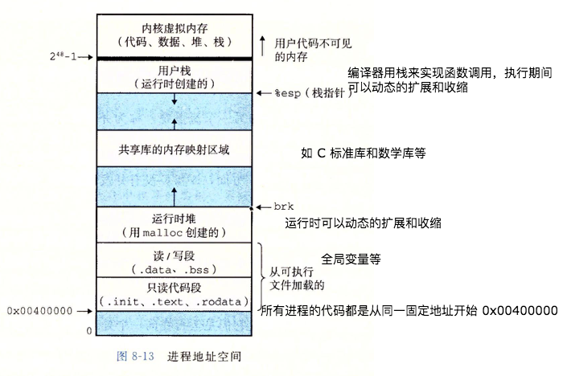


https://www.jianshu.com/p/583334385b41


# 15 页面置换算法

在程序运行过程中，如果要访问的页面不在内存中，就发生缺页中断从而将该页调入内存中。此时如果内存已无空闲空间，系统必须从内存中调出一个页面到磁盘对换区中来腾出空间。

页面置换算法的主要目标是使页面置换频率最低（也可以说缺页率最低）。

### 15.1 Optimal算法-最优算法 

> Optimal replacement algorithm

所选择的被换出的页面将是最长时间内不再被访问，通常可以保证获得最低的缺页率。

**是一种理论上的算法，无法被实现，因为无法知道一个页面多长时间不再被访问。**

举例：一个系统为某进程分配了三个物理块，并有如下页面引用序列：

```html
7，0，1，2，0，3，0，4，2，3，0，3，2，1，2，0，1，7，0，1
```

开始运行时，先将 7, 0, 1 三个页面装入内存。当进程要访问页面 2 时，产生缺页中断，会将页面 7 换出，因为页面 7 再次被访问的时间最长。


### 15.2 FIFO-先进先出

选择换出的页面是最先进入的页面。

**缺点：**该算法会将那些经常被访问的页面也被换出，从而使缺页率升高。


**改进1：（第二次机会）算法 **

FIFO 算法可能会把经常使用的页面置换出去，为了避免这一问题，对该算法做一个简单的修改：

- 当选择置换页面时，检查它的访问位。如果是0，就淘汰这页；如果访问位是1，就给它第二次机会，并选择下一个FIFO页面。
- 当一个页面得到第二次机会时，它被放到链表最后，同时它的访问位被清为0，它的到达时间就置为当前时间。如果该页在此期间被访问过，则访问位置1。这样给了第二次机会的页面将不被淘汰，直至所有其他页面被淘汰过（或者也给了第二次机会）。因此，如果一个页面经常使用，它的访问位总保持为1，它就从来不会被淘汰出去。 


**改进2：Clock算法（时钟轮转法） **

第二次机会算法需要在链表中移动页面，降低了效率。时钟算法使用**环形链表**将页面连接起来，这样**每一次进行替换指针的位置就从替换数移到下一个位置,每一次进行访问时，则指针保持不动。** 

这样只需要移动指针，页面就自动到了环形链表的最后位置，无需移动页面。

  


### 15.3 LRU-最近最久未使用

>  Least Recently Used

LRU 将最近最久未使用的页面换出。

为了实现 LRU，需要在内存中维护一个所有页面的链表。当一个页面被访问时，将这个页面移到链表表头。这样就能保证链表表尾的页面是最近最久未访问的。

因为每次访问都需要更新链表，因此这种方式实现的 LRU 代价很高。

> 4，7，0，7，1，0，1，2，1，2，6

 


手写LRU（代码）：

```java

public class LRUList<T> {

    private static final int DEFAULT_SIZE = 10;
    private int capacity;
    private Node<T> head;
    private Node<T> tail;
    private int size;

    public LRUList() {
        this(DEFAULT_SIZE);
    }

    public LRUList(int capacity) {
        this.capacity = capacity;
    }

    /**
     * 访问元素 t
     * -查询数据
     * --存在 - 在头部则返回  - 不在头部，移动到头部（是否是结尾）
     * --不存在 添加数据-添加到头部
     * ---是否达到capacity -是 移除尾部数据 -否 ¬不移除
     *
     * @param t 元素
     */
    public void access(T t) {
        int index = indexOfElement(t);
        if (index != -1) {
            if (index == 0) {
                return;
            } else {
                moveToHead(index);
            }
        } else {
            addElement(t);
        }
    }

    /**
     * 添加元素到头部
     *
     * @param t 元素
     */
    private void addElement(T t) {
        Node<T> node = new Node<>(t);
        if (size == capacity) {
            removeLast();
        }
        Node<T> f = head;
        node.prev = null;
        node.next = head;
        head = node;
        if (f == null) {
            tail = node;
        } else {
            f.prev = node;
        }
        size++;
    }

    /**
     * 移除最后一个节点
     */
    private void removeLast() {
        if (isEmpty()) {
            return;
        }
        Node<T> l = tail;
        tail = tail.prev;
        if (tail == null) {
            head = null;
        } else {
            tail.next = null;
        }
        l.prev = null;
        l.item = null;
        size--;
    }

    /**
     * 将元素移动到头部
     *
     * @param index 索引
     */
    private void moveToHead(int index) {
        Node<T> node;
        if (index == size - 1) {
            node = tail;
            tail = tail.prev;
            tail.next = null;
        } else {
            node = getNodeByIndex(index);
            node.prev.next = node.next;
            node.next.prev = node.prev;
        }
        node.prev = null;
        node.next = head;
        head.prev = node;
        head = node;
    }

    /**
     * 根据索引获取节点
     *
     * @param index 索引
     * @return 节点
     */
    private Node<T> getNodeByIndex(int index) {
        if (index < 0 || index >= size) {
            throw new IndexOutOfBoundsException("index out of bounds");
        }
        Node<T> node = head;
        for (int i = 0; i < index; i++) {
            node = node.next;
        }
        return node;
    }

    /**
     * 查找节点索引
     *
     * @param t 元素
     * @return 不考虑为空的元素
     */
    private int indexOfElement(T t) {
        if (isEmpty()) {
            return -1;
        }
        int index = 0;
        for (Node node = head; node != null; node = node.next) {
            if (node.item.equals(t)) {
                return index;
            }
            index++;
        }
        return -1;
    }

    public boolean isEmpty() {
        return size == 0;
    }

    @Override
    public String toString() {
        if (isEmpty()) {
            return "[]";
        }
        StringBuilder builder = new StringBuilder();
        for (Node<T> node = head; node != null; node = node.next) {
            builder.append(node.item.toString()).append(",");
        }
        String result = builder.toString();
        return result.substring(0, result.length() - 1);
    }

    private static class Node<T> {
        private Node<T> prev;
        private Node<T> next;
        private T item;

        public Node(T item) {
            this.item = item;
        }
    }
}

```


测试：

```java
public class LRUListTest {

    @Test
    public void test() {

        LRUList<Integer> frame = new LRUList<>(3);
        frame.access(7);
        frame.access(0);
        frame.access(1);
        Assert.assertEquals("1,0,7", frame.toString());
        frame.access(2);
        Assert.assertEquals("2,1,0", frame.toString());
        frame.access(0);

        Assert.assertEquals("0,2,1", frame.toString());

        frame.access(0);
        Assert.assertEquals("0,2,1", frame.toString());
        frame.access(3);
        Assert.assertEquals("3,0,2", frame.toString());
        frame.access(0);
        Assert.assertEquals("0,3,2", frame.toString());
        frame.access(4);
        Assert.assertEquals("4,0,3", frame.toString());
    }
}

```


### 15.4  NRU-最近未使用

> Not Recently Used

每个页面都有两个状态位：R 与 M，当页面被访问时设置页面的 R=1，当页面被修改时设置 M=1。其中 R 位会定时被清零。可以将页面分成以下四类：

- R=0，M=0
- R=0，M=1
- R=1，M=0
- R=1，M=1

当发生缺页中断时，NRU 算法随机地从类编号最小的非空类中挑选一个页面将它换出。

NRU 优先换出已经被修改的脏页面（R=0，M=1），而不是被频繁使用的干净页面（R=1，M=0）。


