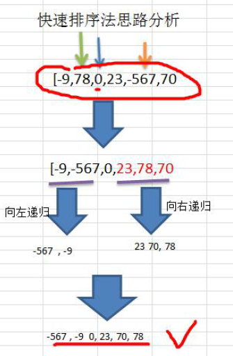
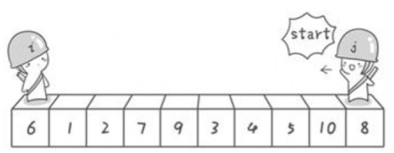
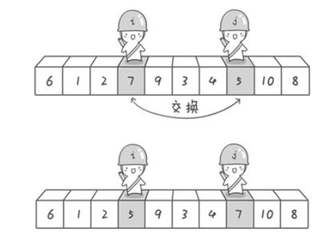

# 快速排序

#### 1.介绍

快速排序（Quicksort）是对冒泡排序的一种改进。基本思想是：通过一趟排序将要排序的数据分割成独立的两
部分，其中一部分的所有数据都比另外一部分的所有数据都要小，然后再按此方法对这两部分数据分别进行快速排
序，整个排序过程可以递归进行，以此达到整个数据变成有序序列。


#### 2.解决思路

其实分治的一种，第一步先将一个数组划分为两部分，左部分的数字全部比右边部分的小。左右部分的数组再次划分，进行递归。

具体如下图，可以看到，第一步处理之后，左边所有的数字[-9,567,0]比右边所有的数字[23,78,70]小，然后再对左边的数组[-9,567,0]以及右边的数组[23,78,70]分别进行递归处理。




#### 3.具体分析

那么具体如何将一个数组变成左边的所有数字都比右边小呢？

以下图为例，第一步，先定义两个可爱的指针，一个叫i，一个叫j。




第二步：将i指针指向的6存起来，存在temp里，这个数字是我们对数组进行分割的依据，大于6的数字要放在右边，小于等于6的数字则放在左边。

j指针先开始走动，当j指针找到第一个<6的数字时停下，也就是5。

然后i指针走动，当i指针找到第一个>=6的停下，也就是7。

5和7进行交换。





然后j继续走动，直到遇到第一个>6的数字4时，停下。

然后i走动，遇到第一个<=6的数字9，停下。

9和4进行交换。


j继续走动，和i相遇了。这时候只要将6和3进行交换，交换后6左边所有的数字就都满足<=6，而6右边所有的数字都满足>6的条件。

将[3,1,2,5,4]看做一个数组，[9,7,10,8]看做一个数组。分别递归重复进行上面的操作。最后得到的数组便是顺序的了！


#### 4.代码

> 代码实现

```java
private static void quickSort(int[] a, int left, int right) {
    if( left >= right) {
        return;
    }
    int i = left;
    int j = right;
    int temp = a[ left ];
    while( i< j) {
        while(i<j && a[j] > temp){
            j--;
        }
        while( i<j && a[i] <= temp) {
            i++;
        }
        if(i<j) {
            int p = a[i];
            a[i] = a[j];
            a[j] = p;
        }
    }
    int p = a[i];
    a[i] = a[left];
    a[left] = p;
    //对temp左边的数快排
    quickSort(a, left, i-1 );
    // 对temp右边的数快排
    quickSort(a, i+1, right);
}
```

