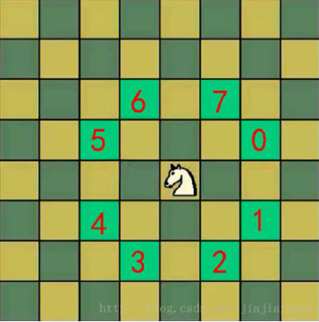

# 马踏棋盘算法

#### 1.介绍

1) 马踏棋盘算法也被称为骑士周游问题
2) 将马随机放在国际象棋的8×8 棋盘Board[0～7][0～7]的某个方格中，马按走棋规则(马走日字)进行移动。要求
每个方格只进入一次，走遍棋盘上全部64 个方格




#### 2.解决思路

回溯递归，深度优先搜索。

并且用贪心算法进行优化。


#### 3.代码

> 代码实现

```java
package demo;

import java.awt.Point;
import java.util.ArrayList;
import java.util.Comparator;

public class HorseChessboard {

    private static int X; // 棋盘的列数
    private static int Y; // 棋盘的行数
    //创建一个数组，标记棋盘的各个位置是否被访问过
    private static boolean visited[];
    //使用一个属性，标记是否棋盘的所有位置都被访问
    private static boolean finished; // 如果为true,表示成功


    /**
     * 功能： 根据当前位置(Point对象)，计算马儿还能走哪些位置(Point)，并放入到一个集合中(ArrayList), 最多有8个位置
     * @param curPoint
     * @return
     */
    public static ArrayList<Point> next(Point curPoint) {
        //创建一个ArrayList
        ArrayList<Point> ps = new ArrayList<Point>();
        //创建一个Point
        Point p1 = new Point();
        //表示马儿可以走10点方向的日
        if((p1.x = curPoint.x - 2) >= 0 && (p1.y = curPoint.y -1) >= 0) {
            ps.add(new Point(p1));
        }
        //判断马儿可以走11点方向的日
        if((p1.x = curPoint.x - 1) >=0 && (p1.y=curPoint.y-2)>=0) {
            ps.add(new Point(p1));
        }
        //判断马儿可以走1点方向的日
        if ((p1.x = curPoint.x + 1) < X && (p1.y = curPoint.y - 2) >= 0) {
            ps.add(new Point(p1));
        }
        //判断马儿可以走2点方向的日
        if ((p1.x = curPoint.x + 2) < X && (p1.y = curPoint.y - 1) >= 0) {
            ps.add(new Point(p1));
        }
        //判断马儿可以走4点方向的日
        if ((p1.x = curPoint.x + 2) < X && (p1.y = curPoint.y + 1) < Y) {
            ps.add(new Point(p1));
        }
        //判断马儿可以走5点方向的日
        if ((p1.x = curPoint.x + 1) < X && (p1.y = curPoint.y + 2) < Y) {
            ps.add(new Point(p1));
        }
        //判断马儿可以走7点方向的日
        if ((p1.x = curPoint.x - 1) >= 0 && (p1.y = curPoint.y + 2) < Y) {
            ps.add(new Point(p1));
        }
        //判断马儿可以走8点方向的日
        if ((p1.x = curPoint.x - 2) >= 0 && (p1.y = curPoint.y + 1) < Y) {
            ps.add(new Point(p1));
        }
        return ps;
    }


    /**
     * 完成骑士周游问题的算法
     * @param chessboard 棋盘
     * @param row 马儿当前的位置的行 从0开始
     * @param column 马儿当前的位置的列  从0开始
     * @param step 是第几步 ,初始位置就是第1步
     */
    public static void traversalChessboard(int[][] chessboard, int row, int column, int step) {

        chessboard[row][column] = step;
        //row * X + column：表示计算马在第几个格子。
        visited[row * X + column] = true;
        //获取当前位置可以走的下一个位置的集合
        ArrayList<Point> ps = next(new Point(column, row));
        //贪心算法优化：对ps进行递增排序,这样每次第一个取出的下一步都是选择步数最少的，回溯也就减少了。速度差了近十倍。
        sort(ps);

        //遍历 ps
        while(!ps.isEmpty()) {
            //取出下一个可以走的位置
            Point p = ps.remove(0);
            //判断该点是否已经访问过
            if(!visited[p.y * X + p.x]) {
                traversalChessboard(chessboard, p.y, p.x, step + 1);
            }
        }

        /*
            判断马儿是否完成了任务，若没有完成任务，将当前棋盘位置的步数step标记改为0，visited也标记为0.
            会通过回溯将此错误路径前边所有走过的格子都进行visited=0，当前格子步数=1操作。
         */
        if(step < X * Y && !finished ) {
            chessboard[row][column] = 0;
            visited[row * X + column] = false;
        } else {
            finished = true;
        }

    }


    //贪心算法优化：根据当前这个一步的所有的下一步的选择位置，进行非递减排序, 减少回溯的次数
    public static void sort(ArrayList<Point> ps) {
        ps.sort(new Comparator<Point>() {
            @Override
            public int compare(Point o1, Point o2) {
                //获取到o1的下一步的所有位置个数
                int count1 = next(o1).size();
                //获取到o2的下一步的所有位置个数
                int count2 = next(o2).size();
                if(count1 < count2) {
                    return -1;
                } else if (count1 == count2) {
                    return 0;
                } else {
                    return 1;
                }
            }

        });
    }

    public static void main(String[] args) {
        System.out.println("骑士周游算法，开始运行~~");
        //测试骑士周游算法是否正确
        X = 5;
        Y = 5;
        //马儿初始位置的行
        int row = 1;
        //马儿初始位置的列
        int column = 1;
        //创建棋盘
        int[][] chessboard = new int[X][Y];
        ////初始值都是false
        visited = new boolean[X * Y];
        //测试耗时
        long start = System.currentTimeMillis();
        traversalChessboard(chessboard, row - 1, column - 1, 1);
        long end = System.currentTimeMillis();
        System.out.println("共耗时: " + (end - start) + " 毫秒");

        //输出棋盘的最后情况
        for(int[] rows : chessboard) {
            for(int step: rows) {
                System.out.print(step + "\t");
            }
            System.out.println();
        }
    }

}


```


