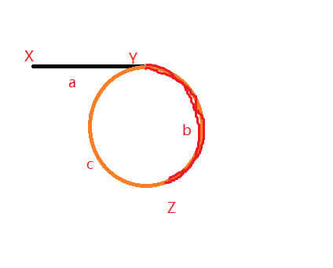

# 链表中环的入口结点

### 信息卡片 

- 时间： 2020-2-1

- 题目描述：

  ```
  给一个链表，若其中包含环，请找出该链表的环的入口结点，否则，输出null。
  ```

  

### 参考答案

> 思路

快慢双指针。



当fast与slow相遇时，fast走过的距离为a + b + c + b，而slow走过的距离为a + b，因为fast是slow速度的两倍，则有a+b+c+b = 2*(a+b)，登出a=c;

相遇后将fast移到头指针，fast和slow同时移动，找到根据a=c找到入口。


> 代码

```java
   public ListNode EntryNodeOfLoop(ListNode pHead) {
        if(pHead == null || pHead.next == null) return null;
        ListNode slow = pHead, fast = pHead;
        do{
            slow = slow.next;
            fast = fast.next.next;
        }while(slow != fast);

        fast = pHead;
        while(fast != slow){
            fast = fast.next;
            slow = slow.next;
        }
        return fast;
    }
```


