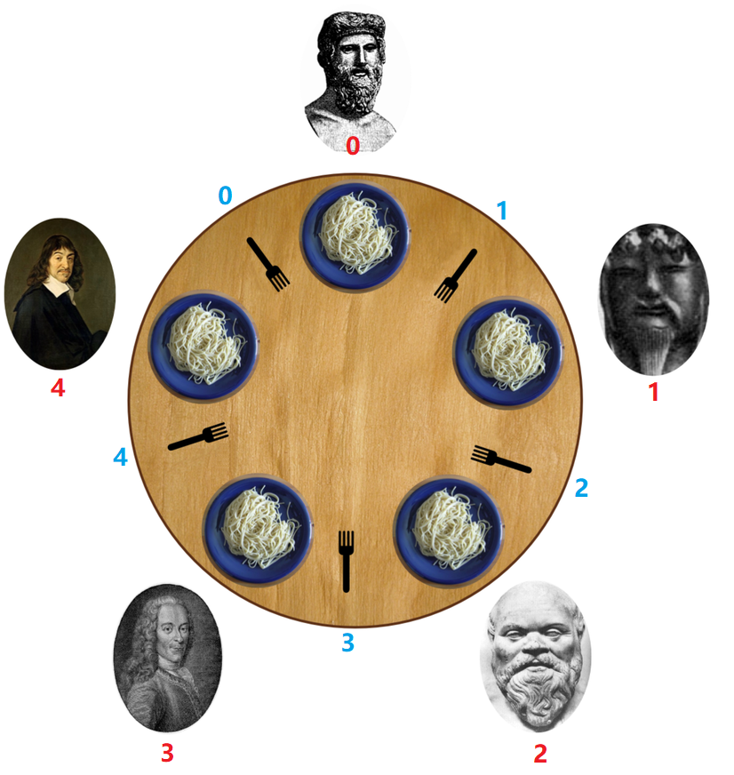

# [哲学家进餐](https://leetcode-cn.com/problems/the-dining-philosophers/)

### 信息卡片

- 时间： 2020-3-7
- 难度：中等
- 题目描述：

```
5 个沉默寡言的哲学家围坐在圆桌前，每人面前一盘意面。叉子放在哲学家之间的桌面上。（5 个哲学家，5 根叉子）

所有的哲学家都只会在思考和进餐两种行为间交替。哲学家只有同时拿到左边和右边的叉子才能吃到面，而同一根叉子在同一时间只能被一个哲学家使用。每个哲学家吃完面后都需要把叉子放回桌面以供其他哲学家吃面。只要条件允许，哲学家可以拿起左边或者右边的叉子，但在没有同时拿到左右叉子时不能进食。

假设面的数量没有限制，哲学家也能随便吃，不需要考虑吃不吃得下。

设计一个进餐规则（并行算法）使得每个哲学家都不会挨饿；也就是说，在没有人知道别人什么时候想吃东西或思考的情况下，每个哲学家都可以在吃饭和思考之间一直交替下去。

```


```
哲学家从 0 到 4 按 顺时针 编号。请实现函数 void wantsToEat(philosopher, pickLeftFork, pickRightFork, eat, putLeftFork, putRightFork)：

    philosopher 哲学家的编号。
    pickLeftFork 和 pickRightFork 表示拿起左边或右边的叉子。
    eat 表示吃面。
    putLeftFork 和 putRightFork 表示放下左边或右边的叉子。
    由于哲学家不是在吃面就是在想着啥时候吃面，所以思考这个方法没有对应的回调。

给你 5 个线程，每个都代表一个哲学家，请你使用类的同一个对象来模拟这个过程。在最后一次调用结束之前，可能会为同一个哲学家多次调用该函数。
```


### 参考答案

> 思路

这道题本质上其实是想考察如何避免死锁。
易知：当 5个哲学家都拿着其左边(或右边)的叉子时，会进入死锁.

故最多只允许4 个哲学家去持有叉子，可保证至少有 1 个哲学家能吃上意大利面（即获得到 2 个叉子）。
因为最差情况下是：4 个哲学家都各自持有1个叉子，此时还 剩余 1 个叉子 可供使用，这4 个哲学家中必然有1人能获取到这个 剩余的 1 个叉子，从而手持 2 个叉子，可以吃意大利面。


既然最多只允许4个哲学家去持有叉子，那么如果只允许3个哲学家去持有叉子是否可行呢？
当然可行，3个哲学家可以先都各自持有1把叉子，此时还剩余2把叉子；接下来，这3个哲学家中必有2人能获取到这剩余的2把叉子，从而手持2把叉子，可以吃意大利面。而必然剩余1人只能持有1把叉子。


**因此，如果只允许4个哲学家去持有叉子，在头1轮中只能有1人能吃上意大利面；如果只允许3个哲学家去持有叉子，在头一轮中能有2个人能吃上意大利面。直觉上来讲，一轮能有2个人完成吃面 在时间上 显然优于 一轮只有1个人吃面。**


设计：

- 用Semaphore去实现持有叉子的哲学家数量。

- 一共有5个叉子，视为5个ReentrantLock，并将它们全放入1个数组中。

具体编号我是如下图这般设计的：





> 代码

```java
class DiningPhilosophers {
    //限制 最多只有3个哲学家去持有叉子(当然也可以设置成4个)
    private Semaphore count = new Semaphore(3);
    //1个Fork视为1个ReentrantLock，5个叉子即5个ReentrantLock，将其都放入数组中
    private ReentrantLock[] lock = {new ReentrantLock(),
                                    new ReentrantLock(),
                                    new ReentrantLock(),
                                    new ReentrantLock(),
                                    new ReentrantLock()};

    public DiningPhilosophers() {

    }

    // call the run() method of any runnable to execute its code
    public void wantsToEat(int philosopher,
                           Runnable pickLeftFork,
                           Runnable pickRightFork,
                           Runnable eat,
                           Runnable putLeftFork,
                           Runnable putRightFork) throws InterruptedException {

        int left = (philosopher + 1) % 5;	//左边的叉子 的编号
        int right = philosopher;	//右边的叉子 的编号

        count.acquire();		//限制的人数 -1
        lock[left].lock();		//拿起左边的叉子
        lock[right].lock();		//拿起右边的叉子
        pickLeftFork.run();		//拿起左边的叉子 的具体执行
        pickRightFork.run();	//拿起右边的叉子 的具体执行
        eat.run();				//吃意大利面 的具体执行
        putLeftFork.run();		//放下左边的叉子 的具体执行
        putRightFork.run();		//放下右边的叉子 的具体执行
        lock[left].unlock();	//放下左边的叉子
        lock[right].unlock();	//放下右边的叉子
        count.release();		//限制的人数 +1

    }
}
```


### 其他优秀解答
