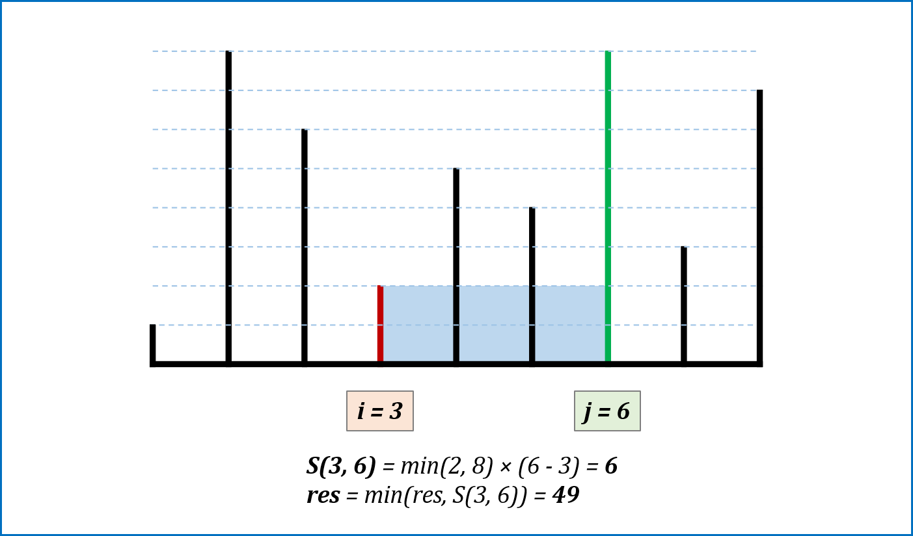
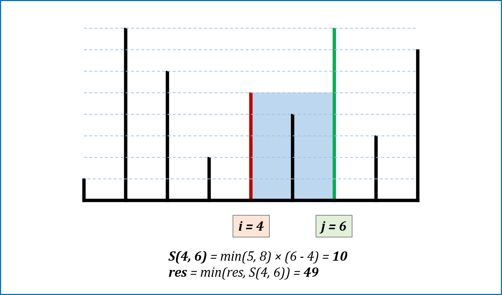

# [盛最多水的容器](https://leetcode-cn.com/problems/container-with-most-water/)

### 信息卡片

- 时间： 2019-1-18
- 难度：中等
- 题目描述：

```
给定 n 个非负整数 a1，a2，...，an，每个数代表坐标中的一个点 (i, ai) 。在坐标内画 n 条垂直线，垂直线 i 的两个端点分别为 (i, ai) 和 (i, 0)。找出其中的两条线，使得它们与 x 轴共同构成的容器可以容纳最多的水。

说明：你不能倾斜容器，且 n 的值至少为 2。

示例:
输入: [1,8,6,2,5,4,8,3,7]
输出: 49

图中垂直线代表输入数组 [1,8,6,2,5,4,8,3,7]。在此情况下，容器能够容纳水（表示为蓝色部分）的最大值为 49。

```


### 参考答案

> 思路

双指针：

其实无论是移动短指针和长指针都是一种可行求解。 只是，一开始就已经把指针定义在两端，如果短指针不动，而把长指针向着另一端移动，两者的距离已经变小了，无论会不会遇到更高的指针，结果都只是以短的指针来进行计算。 故移动长指针是无意义的。 

图解指针移动步骤：







> 代码

```
    public int maxArea(int[] height) {
        int i = 0, j = height.length - 1, res = 0;
        while(i < j){
            res = height[i] < height[j] ?
                    Math.max(res, (j - i) * height[i++]) :
                    Math.max(res, (j - i) * height[j--] );

        }

        return res;
    }
```


>复杂度分析

时间复杂度：O(n).

空间复杂度：O(1) 


### 其他优秀解答

> 暂无
