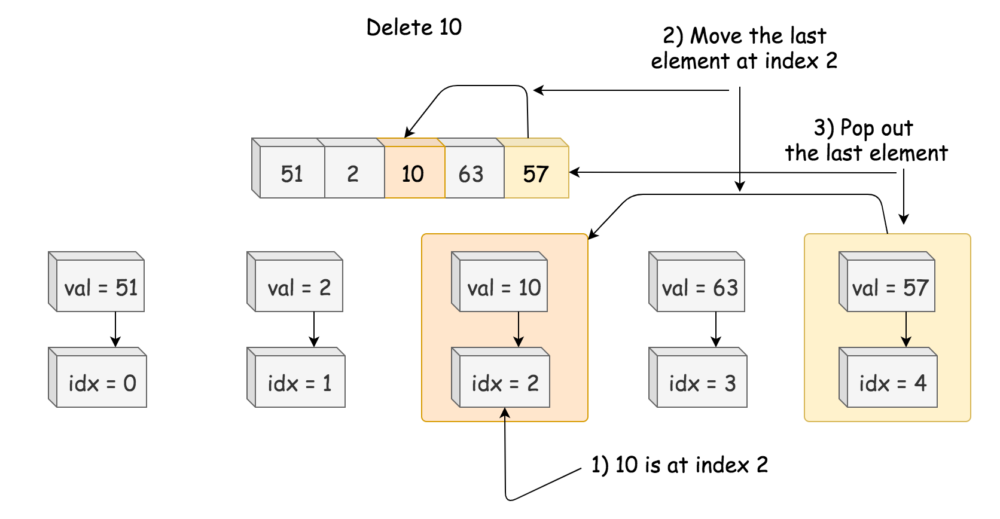

# [常数时间插入、删除和获取随机元素](https://leetcode-cn.com/problems/insert-delete-getrandom-o1/)

### 信息卡片

- 时间： 2019-1-19
- 难度：中等
- 题目描述：

```
设计一个支持在平均 时间复杂度 O(1) 下，执行以下操作的数据结构。

    insert(val)：当元素 val 不存在时，向集合中插入该项。
    remove(val)：元素 val 存在时，从集合中移除该项。
    getRandom：随机返回现有集合中的一项。每个元素应该有相同的概率被返回。

示例 :

// 初始化一个空的集合。
RandomizedSet randomSet = new RandomizedSet();

// 向集合中插入 1 。返回 true 表示 1 被成功地插入。
randomSet.insert(1);

// 返回 false ，表示集合中不存在 2 。
randomSet.remove(2);

// 向集合中插入 2 。返回 true 。集合现在包含 [1,2] 。
randomSet.insert(2);

// getRandom 应随机返回 1 或 2 。
randomSet.getRandom();

// 从集合中移除 1 ，返回 true 。集合现在包含 [2] 。
randomSet.remove(1);

// 2 已在集合中，所以返回 false 。
randomSet.insert(2);

// 由于 2 是集合中唯一的数字，getRandom 总是返回 2 。
randomSet.getRandom();

```


### 参考答案

> 思路

方法：哈希表 + 动态数组

Insert:

- 添加元素到动态数组。
- 在哈希表中添加值到索引的映射


remove:

- 在哈希表中查找要删除元素的索引。
- 将要删除元素与最后一个元素交换。
- 删除最后一个元素。
- 更新哈希表中的对应关系。




> 代码

```
class RandomizedSet {

    Map<Integer, Integer> dict;
    List<Integer> list;
    Random rand = new Random();

    public RandomizedSet() {
        dict = new HashMap();
        list = new ArrayList();
    }

    public boolean insert(int val) {
        if (dict.containsKey(val)) return false;
        //添加值到索引的映射到哈希表 & 添加值到li
        dict.put(val, list.size());
        list.add(list.size(), val);
        return true;
    }

    // 找到要删除元素的索引，将要删除的元素与最后一个元素交换，然后删除最后一个元素，最后更新哈希表中的对应关系
    public boolean remove(int val) {
        if (! dict.containsKey(val)) return false;
        int lastElement = list.get(list.size() - 1);
        int idx = dict.get(val);
        list.set(idx, lastElement);
        dict.put(lastElement, idx);
        list.remove(list.size() - 1);
        dict.remove(val);
        return true;
    }

    
    public int getRandom() {
        return list.get(rand.nextInt(list.size()));
    }
   }
```


> 复杂度分析

时间复杂度 :O(1)。

空间复杂度 :O(N)。


### 其他优秀解答

> 暂无
