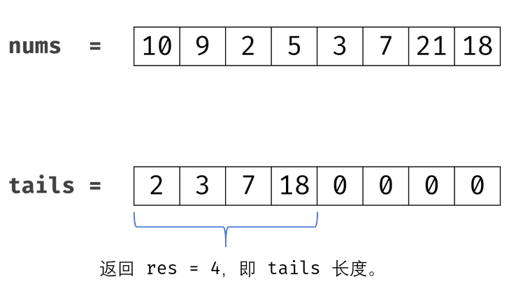

# [ 最长上升子序列](https://leetcode-cn.com/problems/longest-increasing-subsequence/)

### 信息卡片

- 时间： 2020-2-6
- 难度：中等
- 题目描述：

```
给定一个无序的整数数组，找到其中最长上升子序列的长度。

示例:

输入: [10,9,2,5,3,7,101,18]
输出: 4 
解释: 最长的上升子序列是 [2,3,7,101]，它的长度是 4。

说明:

    可能会有多种最长上升子序列的组合，你只需要输出对应的长度即可。
    你算法的时间复杂度应该为 O(n2) 。

进阶: 你能将算法的时间复杂度降低到 O(n log n) 吗?
```


### 参考答案

> 思路

动态规划

[题解](https://leetcode-cn.com/problems/longest-increasing-subsequence/solution/zui-chang-shang-sheng-zi-xu-lie-dong-tai-gui-hua-2/)


> 代码

```java
class Solution {
    public int lengthOfLIS(int[] nums) {
        int len = nums.length;
        if(len == 0) return 0;
        int[] dp = new int[len + 1];
        int res = 0; //用来记录出现过的最大值
        Arrays.fill(dp,1);
        for (int i =  0; i < len; i++) {
            for (int j = 0; j < i; j++) {
                if(nums[j] < nums[i]){
                    //从j=0开始找，如果有小于nums[i]的值，比较
                    dp[i] = Math.max(dp[i],dp[j] + 1);
                }
            }
            res = Math.max(res, dp[i]);
        }
        return res;
    }
}
```


> 复杂度分析

时间复杂度 ：O(N^2) , 遍历计算 dpdpdp 列表需O(N)，计算每个 dp[i] 需 O(N)。
空间复杂度 ：O(N) ：dp 列表占用线性大小额外空间。


### 优化

> 思路

动态规划+二分搜索

[题解](https://leetcode-cn.com/problems/longest-increasing-subsequence/solution/zui-chang-shang-sheng-zi-xu-lie-dong-tai-gui-hua-2/)

降低复杂度切入点： 解法一中，遍历计算 dp 列表需 O(N)，计算每个dp[k] 需O(N)。

动态规划中，通过线性遍历来计算 dp 的复杂度无法降低；
每轮计算中，需要通过线性遍历 [0,k) 区间元素来得到 dp[k] 。我们考虑：是否可以通过重新设计状态定义，使整个 dp 为一个排序列表；这样在计算每个dp[k] 时，就可以通过二分法遍历 [0,k) 区间元素，将此部分复杂度由 O(N) 降至 O(logN)。




> 代码

```java
 public int lengthOfLIS(int[] nums) {
        int[] tails = new int[nums.length];
        int res = 0;
        for(int num : nums) {
            int i = 0, j = res;
            while(i < j) {
                int m = (i + j) / 2;
                if(tails[m] < num) i = m + 1;
                else j = m;
            }
            tails[i] = num;
            if(res == j) res++;
        }
        return res;
    }
```


> 复杂度分析

时间复杂度 ：O(NlogN) ,遍历 nums 列表O(N)，在每个nums[i] 二分法需O(logN)。
空间复杂度 ：O(N) ，tails 列表占用线性大小额外空间。

